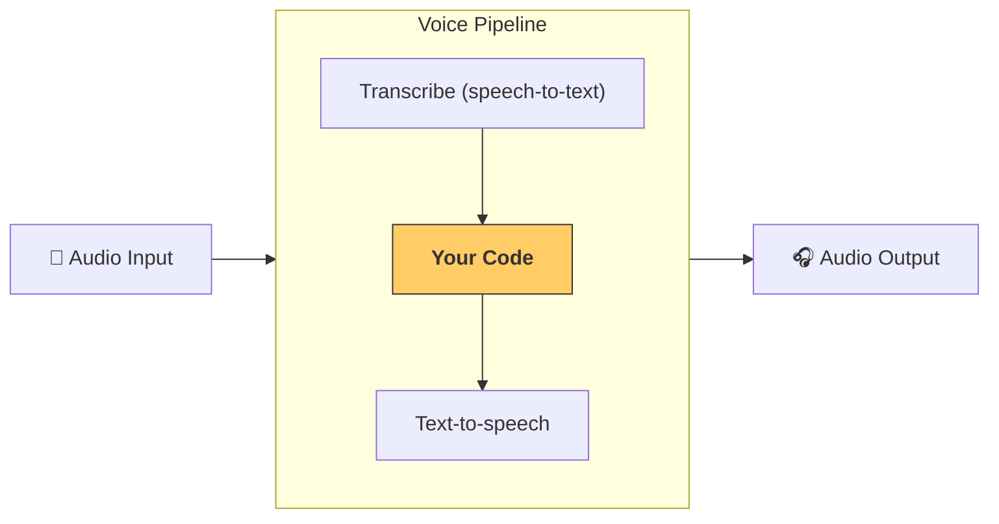

================================================================
Files
================================================================

================
File: docs/ko/models/index.md
================
---
search:
  exclude: true
---
# 모델

Agents SDK 는 기본적으로 다음 두 가지 방식의 OpenAI 모델을 지원합니다:

-   **권장**: 새로운 [Responses API](https://platform.openai.com/docs/api-reference/responses)를 사용해 OpenAI API 를 호출하는 [`OpenAIResponsesModel`][agents.models.openai_responses.OpenAIResponsesModel]
-   [Chat Completions API](https://platform.openai.com/docs/api-reference/chat)를 사용해 OpenAI API 를 호출하는 [`OpenAIChatCompletionsModel`][agents.models.openai_chatcompletions.OpenAIChatCompletionsModel]

## OpenAI 모델

`Agent` 를 초기화할 때 모델을 지정하지 않으면 기본 모델이 사용됩니다. 현재 기본값은 [`gpt-4.1`](https://platform.openai.com/docs/models/gpt-4.1)이며, 에이전트형 워크플로의 예측 가능성과 낮은 지연 시간 사이에서 균형이 좋습니다.

[`gpt-5`](https://platform.openai.com/docs/models/gpt-5) 등의 다른 모델로 전환하려면 다음 섹션의 단계를 따르세요.

### 기본 OpenAI 모델

사용자 정의 모델을 설정하지 않은 모든 에이전트에서 특정 모델을 일관되게 사용하려면, 에이전트를 실행하기 전에 `OPENAI_DEFAULT_MODEL` 환경 변수를 설정하세요.

```bash
export OPENAI_DEFAULT_MODEL=gpt-5
python3 my_awesome_agent.py
```

#### GPT-5 모델

이 방식으로 GPT-5 추론 모델들([`gpt-5`](https://platform.openai.com/docs/models/gpt-5), [`gpt-5-mini`](https://platform.openai.com/docs/models/gpt-5-mini), [`gpt-5-nano`](https://platform.openai.com/docs/models/gpt-5-nano))을 사용할 때, SDK 는 기본적으로 합리적인 `ModelSettings` 를 적용합니다. 구체적으로 `reasoning.effort` 와 `verbosity` 를 모두 `"low"` 로 설정합니다. 이러한 설정을 직접 구성하고 싶다면 `agents.models.get_default_model_settings("gpt-5")` 를 호출하세요.

더 낮은 지연 시간이나 특정 요구 사항이 있다면, 다른 모델과 설정을 선택할 수 있습니다. 기본 모델의 추론 강도를 조정하려면 직접 만든 `ModelSettings` 를 전달하세요:

```python
from openai.types.shared import Reasoning
from agents import Agent, ModelSettings

my_agent = Agent(
    name="My Agent",
    instructions="You're a helpful agent.",
    model_settings=ModelSettings(reasoning=Reasoning(effort="minimal"), verbosity="low")
    # If OPENAI_DEFAULT_MODEL=gpt-5 is set, passing only model_settings works.
    # It's also fine to pass a GPT-5 model name explicitly:
    # model="gpt-5",
)
```

특히 더 낮은 지연 시간을 위해 [`gpt-5-mini`](https://platform.openai.com/docs/models/gpt-5-mini) 또는 [`gpt-5-nano`](https://platform.openai.com/docs/models/gpt-5-nano) 모델을 `reasoning.effort="minimal"` 로 사용하면 기본 설정보다 더 빠르게 응답을 반환하는 경우가 많습니다. 다만 Responses API 의 일부 내장 도구(예: 파일 검색과 이미지 생성)는 `"minimal"` 추론 강도를 지원하지 않으므로, 본 Agents SDK 는 기본값을 `"low"` 로 설정합니다.

#### 비 GPT-5 모델

사용자 정의 `model_settings` 없이 비 GPT-5 모델 이름을 전달하면, SDK 는 모든 모델과 호환되는 일반적인 `ModelSettings` 로 되돌립니다.

## 비 OpenAI 모델

대부분의 다른 비 OpenAI 모델은 [LiteLLM 연동](./litellm.md)을 통해 사용할 수 있습니다. 먼저 litellm 의존성 그룹을 설치하세요:

```bash
pip install "openai-agents[litellm]"
```

그 다음, `litellm/` 접두사를 사용하여 [지원되는 모델](https://docs.litellm.ai/docs/providers) 중 아무 것이나 사용할 수 있습니다:

```python
claude_agent = Agent(model="litellm/anthropic/claude-3-5-sonnet-20240620", ...)
gemini_agent = Agent(model="litellm/gemini/gemini-2.5-flash-preview-04-17", ...)
```

### 비 OpenAI 모델을 사용하는 다른 방법

다른 LLM 제공자를 통합하는 방법은 추가로 3가지가 있습니다(예시는 [여기](https://github.com/openai/openai-agents-python/tree/main/examples/model_providers/)에 있습니다):

1. [`set_default_openai_client`][agents.set_default_openai_client] 는 전역적으로 `AsyncOpenAI` 인스턴스를 LLM 클라이언트로 사용하고 싶을 때 유용합니다. 이는 LLM 제공자가 OpenAI 호환 API 엔드포인트를 제공하고, `base_url` 과 `api_key` 를 설정할 수 있는 경우에 해당합니다. 구성 가능한 예시는 [examples/model_providers/custom_example_global.py](https://github.com/openai/openai-agents-python/tree/main/examples/model_providers/custom_example_global.py) 를 참조하세요.
2. [`ModelProvider`][agents.models.interface.ModelProvider] 는 `Runner.run` 수준에서 사용됩니다. 이를 통해 "이 실행(run)의 모든 에이전트에 사용자 정의 모델 제공자를 사용"할 수 있습니다. 구성 가능한 예시는 [examples/model_providers/custom_example_provider.py](https://github.com/openai/openai-agents-python/tree/main/examples/model_providers/custom_example_provider.py) 를 참조하세요.
3. [`Agent.model`][agents.agent.Agent.model] 을 사용하면 특정 Agent 인스턴스에 모델을 지정할 수 있습니다. 이를 통해 서로 다른 에이전트에 대해 서로 다른 제공자를 혼용할 수 있습니다. 대부분의 사용 가능한 모델을 쉽게 사용하는 방법은 [LiteLLM 연동](./litellm.md)입니다.

`platform.openai.com` 의 API 키가 없는 경우, `set_tracing_disabled()` 로 트레이싱을 비활성화하거나, [다른 트레이싱 프로세서](../tracing.md)를 설정하는 것을 권장합니다.

!!! note

    이 예시들에서는 대부분의 LLM 제공자가 아직 Responses API 를 지원하지 않기 때문에 Chat Completions API/모델을 사용합니다. LLM 제공자가 이를 지원한다면 Responses 사용을 권장합니다.

## 모델 혼합 및 매칭

하나의 워크플로 내에서 에이전트마다 서로 다른 모델을 사용하고 싶을 수 있습니다. 예를 들어 분류(트리아지)에는 더 작고 빠른 모델을, 복잡한 작업에는 더 크고 강력한 모델을 사용할 수 있습니다. [`Agent`][agents.Agent] 를 구성할 때 다음 중 하나의 방식으로 특정 모델을 선택할 수 있습니다:

1. 모델 이름을 직접 전달
2. 임의의 모델 이름 + 해당 이름을 Model 인스턴스로 매핑할 수 있는 [`ModelProvider`][agents.models.interface.ModelProvider] 전달
3. [`Model`][agents.models.interface.Model] 구현체를 직접 제공

!!!note

    SDK 는 [`OpenAIResponsesModel`][agents.models.openai_responses.OpenAIResponsesModel] 과 [`OpenAIChatCompletionsModel`][agents.models.openai_chatcompletions.OpenAIChatCompletionsModel] 두 형태를 모두 지원하지만, 두 형태가 지원하는 기능과 도구 세트가 다르므로 각 워크플로마다 단일 모델 형태를 사용할 것을 권장합니다. 워크플로가 모델 형태의 혼합을 요구하는 경우, 사용하는 모든 기능이 두 형태 모두에서 사용 가능한지 확인하세요.

```python
from agents import Agent, Runner, AsyncOpenAI, OpenAIChatCompletionsModel
import asyncio

spanish_agent = Agent(
    name="Spanish agent",
    instructions="You only speak Spanish.",
    model="gpt-5-mini", # (1)!
)

english_agent = Agent(
    name="English agent",
    instructions="You only speak English",
    model=OpenAIChatCompletionsModel( # (2)!
        model="gpt-5-nano",
        openai_client=AsyncOpenAI()
    ),
)

triage_agent = Agent(
    name="Triage agent",
    instructions="Handoff to the appropriate agent based on the language of the request.",
    handoffs=[spanish_agent, english_agent],
    model="gpt-5",
)

async def main():
    result = await Runner.run(triage_agent, input="Hola, ¿cómo estás?")
    print(result.final_output)
```

1.  OpenAI 모델의 이름을 직접 설정합니다
2.  [`Model`][agents.models.interface.Model] 구현체를 제공합니다

에이전트에 사용되는 모델을 더 자세히 구성하려면, temperature 같은 선택적 모델 구성 매개변수를 제공하는 [`ModelSettings`][agents.models.interface.ModelSettings] 를 전달할 수 있습니다.

```python
from agents import Agent, ModelSettings

english_agent = Agent(
    name="English agent",
    instructions="You only speak English",
    model="gpt-4.1",
    model_settings=ModelSettings(temperature=0.1),
)
```

또한 OpenAI 의 Responses API 를 사용할 때는 [다른 선택적 매개변수](https://platform.openai.com/docs/api-reference/responses/create)(예: `user`, `service_tier` 등)도 있습니다. 이들이 최상위에서 제공되지 않는 경우, `extra_args` 를 사용해 전달할 수 있습니다.

```python
from agents import Agent, ModelSettings

english_agent = Agent(
    name="English agent",
    instructions="You only speak English",
    model="gpt-4.1",
    model_settings=ModelSettings(
        temperature=0.1,
        extra_args={"service_tier": "flex", "user": "user_12345"},
    ),
)
```

## 다른 LLM 제공자 사용 시 흔한 문제

### Tracing 클라이언트 오류 401

트레이싱 관련 오류가 발생한다면, 추적 정보가 OpenAI 서버로 업로드되는데 OpenAI API 키가 없기 때문입니다. 해결 방법은 세 가지입니다:

1. 트레이싱을 완전히 비활성화: [`set_tracing_disabled(True)`][agents.set_tracing_disabled]
2. 트레이싱용 OpenAI 키 설정: [`set_tracing_export_api_key(...)`][agents.set_tracing_export_api_key]. 이 API 키는 추적 업로드에만 사용되며, [platform.openai.com](https://platform.openai.com/) 의 키여야 합니다
3. 비 OpenAI 트레이스 프로세서를 사용. [트레이싱 문서](../tracing.md#custom-tracing-processors) 참고

### Responses API 지원

SDK 는 기본적으로 Responses API 를 사용하지만, 대부분의 다른 LLM 제공자는 아직 이를 지원하지 않습니다. 이로 인해 404 등 유사한 문제가 발생할 수 있습니다. 해결 방법은 두 가지입니다:

1. [`set_default_openai_api("chat_completions")`][agents.set_default_openai_api] 를 호출하세요. 환경 변수로 `OPENAI_API_KEY` 와 `OPENAI_BASE_URL` 을 설정한 경우 동작합니다
2. [`OpenAIChatCompletionsModel`][agents.models.openai_chatcompletions.OpenAIChatCompletionsModel] 을 사용하세요. 예시는 [여기](https://github.com/openai/openai-agents-python/tree/main/examples/model_providers/)에 있습니다

### structured outputs 지원

일부 모델 제공자는 [structured outputs](https://platform.openai.com/docs/guides/structured-outputs)을 지원하지 않습니다. 이로 인해 다음과 유사한 오류가 발생할 수 있습니다:

```

BadRequestError: Error code: 400 - {'error': {'message': "'response_format.type' : value is not one of the allowed values ['text','json_object']", 'type': 'invalid_request_error'}}

```

이는 일부 모델 제공자의 한계로, JSON 출력을 지원하더라도 출력에 사용할 `json_schema` 를 지정할 수 없기 때문입니다. 이를 해결하기 위한 방안을 마련 중이지만, 앱이 잘못된 JSON 으로 인해 자주 깨질 수 있으므로 JSON schema 출력을 지원하는 제공자를 사용하는 것을 권장합니다.

## 제공자 간 모델 혼합

모델 제공자 간 기능 차이를 이해하지 못하면 오류가 발생할 수 있습니다. 예를 들어 OpenAI 는 structured outputs, 멀티모달 입력, 호스티드 파일 검색과 웹 검색을 지원하지만, 다른 많은 제공자는 이러한 기능을 지원하지 않습니다. 다음 제한 사항에 유의하세요:

-   지원하지 않는 제공자에게 이해하지 못하는 `tools` 를 보내지 않기
-   텍스트 전용 모델을 호출하기 전에 멀티모달 입력을 필터링하기
-   structured JSON 출력을 지원하지 않는 제공자는 때때로 잘못된 JSON 을 생성할 수 있음을 인지하기

================
File: docs/ko/models/litellm.md
================
---
search:
  exclude: true
---
# LiteLLM로 모든 모델 사용

!!! note

    LiteLLM 통합은 베타입니다. 특히 소규모 모델 제공자에서 문제가 발생할 수 있습니다. 문제가 있으면 [GitHub 이슈](https://github.com/openai/openai-agents-python/issues)로 보고해 주세요. 신속히 수정하겠습니다.

[LiteLLM](https://docs.litellm.ai/docs/)은 단일 인터페이스로 100개 이상의 모델을 사용할 수 있게 해주는 라이브러리입니다. 우리는 Agents SDK에서 어떤 AI 모델이든 사용할 수 있도록 LiteLLM 통합을 추가했습니다.

## 설정

`litellm`이 사용 가능한지 확인해야 합니다. 선택적 `litellm` 의존성 그룹을 설치하면 됩니다:

```bash
pip install "openai-agents[litellm]"
```

완료되면, 어떤 에이전트에서든 [`LitellmModel`][agents.extensions.models.litellm_model.LitellmModel]을 사용할 수 있습니다.

## 예제

다음은 완전한 동작 예제입니다. 실행하면 모델 이름과 API 키를 입력하라는 메시지가 표시됩니다. 예를 들어 다음과 같이 입력할 수 있습니다:

-   모델에는 `openai/gpt-4.1`, 그리고 OpenAI API 키
-   모델에는 `anthropic/claude-3-5-sonnet-20240620`, 그리고 Anthropic API 키
-   등

LiteLLM에서 지원하는 전체 모델 목록은 [litellm providers 문서](https://docs.litellm.ai/docs/providers)를 참고하세요.

```python
from __future__ import annotations

import asyncio

from agents import Agent, Runner, function_tool, set_tracing_disabled
from agents.extensions.models.litellm_model import LitellmModel

@function_tool
def get_weather(city: str):
    print(f"[debug] getting weather for {city}")
    return f"The weather in {city} is sunny."


async def main(model: str, api_key: str):
    agent = Agent(
        name="Assistant",
        instructions="You only respond in haikus.",
        model=LitellmModel(model=model, api_key=api_key),
        tools=[get_weather],
    )

    result = await Runner.run(agent, "What's the weather in Tokyo?")
    print(result.final_output)


if __name__ == "__main__":
    # First try to get model/api key from args
    import argparse

    parser = argparse.ArgumentParser()
    parser.add_argument("--model", type=str, required=False)
    parser.add_argument("--api-key", type=str, required=False)
    args = parser.parse_args()

    model = args.model
    if not model:
        model = input("Enter a model name for Litellm: ")

    api_key = args.api_key
    if not api_key:
        api_key = input("Enter an API key for Litellm: ")

    asyncio.run(main(model, api_key))
```

## 사용량 데이터 추적

LiteLLM 응답을 Agents SDK 사용량 메트릭에 채우려면, 에이전트를 생성할 때 `ModelSettings(include_usage=True)`를 전달하세요.

```python
from agents import Agent, ModelSettings
from agents.extensions.models.litellm_model import LitellmModel

agent = Agent(
    name="Assistant",
    model=LitellmModel(model="your/model", api_key="..."),
    model_settings=ModelSettings(include_usage=True),
)
```

`include_usage=True`를 사용하면, LiteLLM 요청은 기본 제공 OpenAI 모델과 마찬가지로 `result.context_wrapper.usage`를 통해 토큰 및 요청 수를 보고합니다.

================
File: docs/ko/realtime/guide.md
================
---
search:
  exclude: true
---
# 가이드

이 가이드는 OpenAI Agents SDK의 실시간 기능을 사용해 음성 기반 AI 에이전트를 구축하는 방법을 심층적으로 설명합니다.

!!! warning "베타 기능"
실시간 에이전트는 베타 단계입니다. 구현을 개선하는 동안 하위 호환이 깨지는 변경이 발생할 수 있습니다.

## 개요

실시간 에이전트는 오디오와 텍스트 입력을 실시간으로 처리하고 실시간 오디오로 응답하는 대화형 흐름을 제공합니다. OpenAI의 Realtime API와 지속적인 연결을 유지하여 낮은 지연의 자연스러운 음성 대화와 원활한 인터럽션(중단 처리)을 지원합니다.

## 아키텍처

### 핵심 구성요소

실시간 시스템은 다음의 주요 구성요소로 이루어져 있습니다:

-   **RealtimeAgent**: instructions, tools 및 핸드오프로 구성된 에이전트
-   **RealtimeRunner**: 구성을 관리합니다. `runner.run()`을 호출해 세션을 가져올 수 있습니다
-   **RealtimeSession**: 단일 상호작용 세션입니다. 일반적으로 사용자가 대화를 시작할 때마다 하나를 만들고 대화가 끝날 때까지 유지합니다
-   **RealtimeModel**: 기본 모델 인터페이스(일반적으로 OpenAI의 WebSocket 구현)

### 세션 흐름

일반적인 실시간 세션 흐름은 다음과 같습니다:

1. instructions, tools 및 핸드오프로 **RealtimeAgent를 생성**합니다
2. 에이전트와 구성 옵션으로 **RealtimeRunner를 설정**합니다
3. `await runner.run()`을 사용해 **세션을 시작**하고 RealtimeSession을 반환받습니다
4. `send_audio()` 또는 `send_message()`로 **오디오 또는 텍스트 메시지를 전송**합니다
5. 세션을 순회(iterate)하며 **이벤트를 수신**합니다 - 이벤트에는 오디오 출력, 전사, 도구 호출, 핸드오프, 오류가 포함됩니다
6. 사용자가 에이전트의 말을 끊을 때 **인터럽션(중단 처리)**을 처리합니다. 현재 오디오 생성이 자동으로 중지됩니다

세션은 대화 기록을 유지하고 실시간 모델과의 지속 연결을 관리합니다.

## 에이전트 구성

RealtimeAgent는 기본 Agent 클래스와 유사하게 작동하지만 몇 가지 중요한 차이가 있습니다. 전체 API 세부 정보는 [`RealtimeAgent`][agents.realtime.agent.RealtimeAgent] API 레퍼런스를 참조하세요.

일반 에이전트와의 주요 차이점:

-   모델 선택은 에이전트 레벨이 아닌 세션 레벨에서 구성합니다
-   structured outputs 지원 없음(`outputType`은 지원되지 않음)
-   음성은 에이전트별로 구성할 수 있지만 첫 번째 에이전트가 말하기 시작한 후에는 변경할 수 없음
-   tools, 핸드오프, instructions 등 다른 기능은 동일하게 작동

## 세션 구성

### 모델 설정

세션 구성으로 기본 실시간 모델의 동작을 제어할 수 있습니다. 모델 이름(예: `gpt-realtime`), 음성 선택(alloy, echo, fable, onyx, nova, shimmer), 지원 모달리티(텍스트 및/또는 오디오)를 구성할 수 있습니다. 오디오 형식은 입력과 출력 모두에 대해 설정할 수 있으며 기본값은 PCM16입니다.

### 오디오 구성

오디오 설정은 세션이 음성 입력과 출력을 처리하는 방식을 제어합니다. Whisper 같은 모델을 사용해 입력 오디오 전사를 구성하고, 언어 선호도를 설정하며, 도메인 특화 용어의 정확도를 높이기 위한 전사 프롬프트를 제공할 수 있습니다. 턴 감지 설정은 에이전트가 언제 응답을 시작하고 종료해야 하는지를 제어하며, 음성 활동 감지 임계값, 무음 지속 시간, 감지된 음성 주변 패딩 등의 옵션을 제공합니다.

## 도구와 함수

### 도구 추가

일반 에이전트와 마찬가지로, 실시간 에이전트는 대화 중에 실행되는 함수 도구를 지원합니다:

```python
from agents import function_tool

@function_tool
def get_weather(city: str) -> str:
    """Get current weather for a city."""
    # Your weather API logic here
    return f"The weather in {city} is sunny, 72°F"

@function_tool
def book_appointment(date: str, time: str, service: str) -> str:
    """Book an appointment."""
    # Your booking logic here
    return f"Appointment booked for {service} on {date} at {time}"

agent = RealtimeAgent(
    name="Assistant",
    instructions="You can help with weather and appointments.",
    tools=[get_weather, book_appointment],
)
```

## 핸드오프

### 핸드오프 생성

핸드오프를 통해 전문화된 에이전트 간에 대화를 전환할 수 있습니다.

```python
from agents.realtime import realtime_handoff

# Specialized agents
billing_agent = RealtimeAgent(
    name="Billing Support",
    instructions="You specialize in billing and payment issues.",
)

technical_agent = RealtimeAgent(
    name="Technical Support",
    instructions="You handle technical troubleshooting.",
)

# Main agent with handoffs
main_agent = RealtimeAgent(
    name="Customer Service",
    instructions="You are the main customer service agent. Hand off to specialists when needed.",
    handoffs=[
        realtime_handoff(billing_agent, tool_description="Transfer to billing support"),
        realtime_handoff(technical_agent, tool_description="Transfer to technical support"),
    ]
)
```

## 이벤트 처리

세션은 세션 객체를 순회하여 수신할 수 있는 이벤트를 스트리밍합니다. 이벤트에는 오디오 출력 청크, 전사 결과, 도구 실행 시작 및 종료, 에이전트 핸드오프, 오류가 포함됩니다. 처리해야 할 주요 이벤트는 다음과 같습니다:

-   **audio**: 원문 오디오 데이터(에이전트 응답)
-   **audio_end**: 에이전트가 말하기를 완료함
-   **audio_interrupted**: 사용자가 에이전트를 중단함
-   **tool_start/tool_end**: 도구 실행 라이프사이클
-   **handoff**: 에이전트 핸드오프 발생
-   **error**: 처리 중 오류 발생

전체 이벤트 세부 정보는 [`RealtimeSessionEvent`][agents.realtime.events.RealtimeSessionEvent]를 참조하세요.

## 가드레일

실시간 에이전트는 출력 가드레일만 지원합니다. 성능 문제를 피하기 위해 매 단어마다가 아니라 디바운싱되어 주기적으로 실행됩니다. 기본 디바운스 길이는 100자이며, 설정 가능합니다.

가드레일은 `RealtimeAgent`에 직접 연결하거나 세션의 `run_config`를 통해 제공할 수 있습니다. 두 소스의 가드레일은 함께 실행됩니다.

```python
from agents.guardrail import GuardrailFunctionOutput, OutputGuardrail

def sensitive_data_check(context, agent, output):
    return GuardrailFunctionOutput(
        tripwire_triggered="password" in output,
        output_info=None,
    )

agent = RealtimeAgent(
    name="Assistant",
    instructions="...",
    output_guardrails=[OutputGuardrail(guardrail_function=sensitive_data_check)],
)
```

가드레일이 트리거되면 `guardrail_tripped` 이벤트를 생성하고 에이전트의 현재 응답을 중단시킬 수 있습니다. 디바운스 동작은 안전성과 실시간 성능 요구 사이의 균형을 맞추는 데 도움이 됩니다. 텍스트 에이전트와 달리, 실시간 에이전트는 가드레일이 작동해도 Exception을 발생시키지 않습니다.

## 오디오 처리

[`session.send_audio(audio_bytes)`][agents.realtime.session.RealtimeSession.send_audio]를 사용해 오디오를 세션에 전송하거나, [`session.send_message()`][agents.realtime.session.RealtimeSession.send_message]를 사용해 텍스트를 전송하세요.

오디오 출력을 위해서는 `audio` 이벤트를 수신하고 선호하는 오디오 라이브러리로 데이터를 재생하세요. 사용자가 에이전트를 중단할 때 즉시 재생을 중지하고 큐에 있는 오디오를 비우기 위해 `audio_interrupted` 이벤트를 반드시 수신하세요.

## 모델 직접 액세스

기본 모델에 액세스하여 커스텀 리스너를 추가하거나 고급 작업을 수행할 수 있습니다:

```python
# Add a custom listener to the model
session.model.add_listener(my_custom_listener)
```

이렇게 하면 연결에 대한 더 낮은 수준의 제어가 필요한 고급 사용 사례를 위해 [`RealtimeModel`][agents.realtime.model.RealtimeModel] 인터페이스에 직접 액세스할 수 있습니다.

## 코드 예제

완전한 동작 코드 예제는 [examples/realtime 디렉터리](https://github.com/openai/openai-agents-python/tree/main/examples/realtime)를 참고하세요. UI 구성 요소가 있는 데모와 없는 데모가 모두 포함되어 있습니다.

================
File: docs/ko/realtime/quickstart.md
================
---
search:
  exclude: true
---
# 퀵스타트

실시간 에이전트를 사용하면 OpenAI의 Realtime API로 AI 에이전트와 음성 대화를 할 수 있습니다. 이 가이드는 첫 번째 실시간 음성 에이전트를 만드는 과정을 안내합니다.

!!! warning "베타 기능"
실시간 에이전트는 베타 단계입니다. 구현을 개선하는 과정에서 호환성 문제가 발생할 수 있습니다.

## 사전 준비

- Python 3.9 이상
- OpenAI API 키
- OpenAI Agents SDK에 대한 기본 지식

## 설치

아직 설치하지 않았다면 OpenAI Agents SDK를 설치하세요:

```bash
pip install openai-agents
```

## 첫 실시간 에이전트 만들기

### 1. 필수 구성 요소 가져오기

```python
import asyncio
from agents.realtime import RealtimeAgent, RealtimeRunner
```

### 2. 실시간 에이전트 생성

```python
agent = RealtimeAgent(
    name="Assistant",
    instructions="You are a helpful voice assistant. Keep your responses conversational and friendly.",
)
```

### 3. 러너 설정

```python
runner = RealtimeRunner(
    starting_agent=agent,
    config={
        "model_settings": {
            "model_name": "gpt-realtime",
            "voice": "ash",
            "modalities": ["audio"],
            "input_audio_format": "pcm16",
            "output_audio_format": "pcm16",
            "input_audio_transcription": {"model": "gpt-4o-mini-transcribe"},
            "turn_detection": {"type": "semantic_vad", "interrupt_response": True},
        }
    }
)
```

### 4. 세션 시작

```python
# Start the session
session = await runner.run()

async with session:
    print("Session started! The agent will stream audio responses in real-time.")
    # Process events
    async for event in session:
        try:
            if event.type == "agent_start":
                print(f"Agent started: {event.agent.name}")
            elif event.type == "agent_end":
                print(f"Agent ended: {event.agent.name}")
            elif event.type == "handoff":
                print(f"Handoff from {event.from_agent.name} to {event.to_agent.name}")
            elif event.type == "tool_start":
                print(f"Tool started: {event.tool.name}")
            elif event.type == "tool_end":
                print(f"Tool ended: {event.tool.name}; output: {event.output}")
            elif event.type == "audio_end":
                print("Audio ended")
            elif event.type == "audio":
                # Enqueue audio for callback-based playback with metadata
                # Non-blocking put; queue is unbounded, so drops won’t occur.
                pass
            elif event.type == "audio_interrupted":
                print("Audio interrupted")
                # Begin graceful fade + flush in the audio callback and rebuild jitter buffer.
            elif event.type == "error":
                print(f"Error: {event.error}")
            elif event.type == "history_updated":
                pass  # Skip these frequent events
            elif event.type == "history_added":
                pass  # Skip these frequent events
            elif event.type == "raw_model_event":
                print(f"Raw model event: {_truncate_str(str(event.data), 200)}")
            else:
                print(f"Unknown event type: {event.type}")
        except Exception as e:
            print(f"Error processing event: {_truncate_str(str(e), 200)}")

def _truncate_str(s: str, max_length: int) -> str:
    if len(s) > max_length:
        return s[:max_length] + "..."
    return s
```

## 전체 예제

작동하는 전체 예제는 다음과 같습니다:

```python
import asyncio
from agents.realtime import RealtimeAgent, RealtimeRunner

async def main():
    # Create the agent
    agent = RealtimeAgent(
        name="Assistant",
        instructions="You are a helpful voice assistant. Keep responses brief and conversational.",
    )
    # Set up the runner with configuration
    runner = RealtimeRunner(
        starting_agent=agent,
        config={
            "model_settings": {
                "model_name": "gpt-realtime",
                "voice": "ash",
                "modalities": ["audio"],
                "input_audio_format": "pcm16",
                "output_audio_format": "pcm16",
                "input_audio_transcription": {"model": "gpt-4o-mini-transcribe"},
                "turn_detection": {"type": "semantic_vad", "interrupt_response": True},
            }
        },
    )
    # Start the session
    session = await runner.run()

    async with session:
        print("Session started! The agent will stream audio responses in real-time.")
        # Process events
        async for event in session:
            try:
                if event.type == "agent_start":
                    print(f"Agent started: {event.agent.name}")
                elif event.type == "agent_end":
                    print(f"Agent ended: {event.agent.name}")
                elif event.type == "handoff":
                    print(f"Handoff from {event.from_agent.name} to {event.to_agent.name}")
                elif event.type == "tool_start":
                    print(f"Tool started: {event.tool.name}")
                elif event.type == "tool_end":
                    print(f"Tool ended: {event.tool.name}; output: {event.output}")
                elif event.type == "audio_end":
                    print("Audio ended")
                elif event.type == "audio":
                    # Enqueue audio for callback-based playback with metadata
                    # Non-blocking put; queue is unbounded, so drops won’t occur.
                    pass
                elif event.type == "audio_interrupted":
                    print("Audio interrupted")
                    # Begin graceful fade + flush in the audio callback and rebuild jitter buffer.
                elif event.type == "error":
                    print(f"Error: {event.error}")
                elif event.type == "history_updated":
                    pass  # Skip these frequent events
                elif event.type == "history_added":
                    pass  # Skip these frequent events
                elif event.type == "raw_model_event":
                    print(f"Raw model event: {_truncate_str(str(event.data), 200)}")
                else:
                    print(f"Unknown event type: {event.type}")
            except Exception as e:
                print(f"Error processing event: {_truncate_str(str(e), 200)}")

def _truncate_str(s: str, max_length: int) -> str:
    if len(s) > max_length:
        return s[:max_length] + "..."
    return s

if __name__ == "__main__":
    # Run the session
    asyncio.run(main())
```

## 구성 옵션

### 모델 설정

- `model_name`: 사용 가능한 실시간 모델 중 선택 (예: `gpt-realtime`)
- `voice`: 음성 선택 (`alloy`, `echo`, `fable`, `onyx`, `nova`, `shimmer`)
- `modalities`: 텍스트 또는 오디오 활성화 (`["text"]` 또는 `["audio"]`)

### 오디오 설정

- `input_audio_format`: 입력 오디오 형식 (`pcm16`, `g711_ulaw`, `g711_alaw`)
- `output_audio_format`: 출력 오디오 형식
- `input_audio_transcription`: 전사 구성

### 턴 감지

- `type`: 감지 방식 (`server_vad`, `semantic_vad`)
- `threshold`: 음성 활동 임계값 (0.0-1.0)
- `silence_duration_ms`: 턴 종료를 감지할 무음 지속 시간
- `prefix_padding_ms`: 발화 전 오디오 패딩

## 다음 단계

- [실시간 에이전트 자세히 알아보기](guide.md)
- [examples/realtime](https://github.com/openai/openai-agents-python/tree/main/examples/realtime) 폴더의 동작 예제 확인
- 에이전트에 도구 추가
- 에이전트 간 핸드오프 구현
- 안전을 위한 가드레일 설정

## 인증

환경 변수에 OpenAI API 키가 설정되어 있는지 확인하세요:

```bash
export OPENAI_API_KEY="your-api-key-here"
```

또는 세션을 만들 때 직접 전달할 수 있습니다:

```python
session = await runner.run(model_config={"api_key": "your-api-key"})
```

================
File: docs/ko/voice/pipeline.md
================
---
search:
  exclude: true
---
# 파이프라인과 워크플로

[`VoicePipeline`][agents.voice.pipeline.VoicePipeline] 클래스는 에이전트 기반 워크플로를 음성 앱으로 쉽게 전환할 수 있게 해줍니다. 실행할 워크플로를 전달하면, 파이프라인이 입력 오디오의 음성 인식, 오디오 종료 감지, 적절한 시점의 워크플로 호출, 워크플로 출력을 다시 오디오로 변환하는 작업을 처리합니다.



## 파이프라인 구성

파이프라인 생성 시 다음을 설정할 수 있습니다:

1. 새 오디오가 전사될 때마다 실행되는 코드인 [`workflow`][agents.voice.workflow.VoiceWorkflowBase]
2. 사용되는 [`speech-to-text`][agents.voice.model.STTModel] 및 [`text-to-speech`][agents.voice.model.TTSModel] 모델
3. 다음을 구성할 수 있는 [`config`][agents.voice.pipeline_config.VoicePipelineConfig]
    - 모델 이름을 모델에 매핑하는 모델 프로바이더
    - 트레이싱: 트레이싱 비활성화 여부, 오디오 파일 업로드 여부, 워크플로 이름, 트레이스 ID 등
    - 프롬프트, 언어, 사용되는 데이터 타입 등 TTS 및 STT 모델에 대한 설정

## 파이프라인 실행

[`run()`][agents.voice.pipeline.VoicePipeline.run] 메서드를 통해 파이프라인을 실행할 수 있으며, 오디오 입력을 두 가지 형태로 전달할 수 있습니다:

1. [`AudioInput`][agents.voice.input.AudioInput]은 전체 오디오 전사가 있을 때 이를 기반으로 결과만 생성하고자 할 때 사용합니다. 이는 화자가 말을 마쳤는지 감지할 필요가 없는 경우, 예를 들어 미리 녹음된 오디오나 사용자가 말끝이 명확한 푸시투토크 앱에서 유용합니다
2. [`StreamedAudioInput`][agents.voice.input.StreamedAudioInput]은 사용자가 말을 마쳤는지 감지해야 할 수 있는 경우에 사용합니다. 감지되는 대로 오디오 청크를 푸시할 수 있으며, 음성 파이프라인은 "activity detection" 과정으로 적절한 시점에 에이전트 워크플로를 자동 실행합니다

## 결과

음성 파이프라인 실행 결과는 [`StreamedAudioResult`][agents.voice.result.StreamedAudioResult]입니다. 이는 이벤트가 발생하는 대로 스트리밍할 수 있는 객체입니다. [`VoiceStreamEvent`][agents.voice.events.VoiceStreamEvent] 유형은 다음과 같습니다:

1. 오디오 청크를 포함하는 [`VoiceStreamEventAudio`][agents.voice.events.VoiceStreamEventAudio]
2. 턴 시작/종료와 같은 라이프사이클 이벤트를 알려주는 [`VoiceStreamEventLifecycle`][agents.voice.events.VoiceStreamEventLifecycle]
3. 오류 이벤트인 [`VoiceStreamEventError`][agents.voice.events.VoiceStreamEventError]

```python

result = await pipeline.run(input)

async for event in result.stream():
    if event.type == "voice_stream_event_audio":
        # play audio
    elif event.type == "voice_stream_event_lifecycle":
        # lifecycle
    elif event.type == "voice_stream_event_error"
        # error
    ...
```

## 모범 사례

### 인터럽션(중단 처리)

Agents SDK는 현재 [`StreamedAudioInput`][agents.voice.input.StreamedAudioInput]에 대한 내장 인터럽션(중단 처리) 기능을 지원하지 않습니다. 대신 감지된 매 턴마다 워크플로의 별도 실행을 트리거합니다. 애플리케이션 내부에서 인터럽션을 처리하려면 [`VoiceStreamEventLifecycle`][agents.voice.events.VoiceStreamEventLifecycle] 이벤트를 수신할 수 있습니다. `turn_started`는 새 턴이 전사되어 처리가 시작되었음을 나타냅니다. `turn_ended`는 해당 턴의 모든 오디오가 전송된 뒤 트리거됩니다. 모델이 턴을 시작할 때 화자의 마이크를 음소거하고, 해당 턴의 관련 오디오를 모두 플러시한 이후 음소거를 해제하는 방식으로 이 이벤트를 활용할 수 있습니다.

================
File: docs/ko/voice/quickstart.md
================
---
search:
  exclude: true
---
# 빠른 시작

## 준비 사항

Agents SDK에 대한 기본 [빠른 시작 안내](../quickstart.md)를 완료하고 가상 환경을 설정했는지 확인하세요. 그런 다음, SDK의 선택적 음성 종속성을 설치하세요:

```bash
pip install 'openai-agents[voice]'
```

## 개념

핵심 개념은 [`VoicePipeline`][agents.voice.pipeline.VoicePipeline]이며, 이는 3단계 프로세스입니다:

1. 음성을 텍스트로 변환하기 위해 음성-텍스트 모델을 실행
2. 보통 에이전트형 워크플로인 코드를 실행하여 결과 생성
3. 결과 텍스트를 다시 오디오로 변환하기 위해 텍스트-음성 모델을 실행


## 에이전트

먼저 에이전트를 설정하겠습니다. 이 SDK로 에이전트를 만들어 본 적이 있다면 익숙하게 느껴질 것입니다. 에이전트 몇 개와 핸드오프, 그리고 도구 하나를 사용합니다.

```python
import asyncio
import random

from agents import (
    Agent,
    function_tool,
)
from agents.extensions.handoff_prompt import prompt_with_handoff_instructions


@function_tool
def get_weather(city: str) -> str:
    """Get the weather for a given city."""
    print(f"[debug] get_weather called with city: {city}")
    choices = ["sunny", "cloudy", "rainy", "snowy"]
    return f"The weather in {city} is {random.choice(choices)}."


spanish_agent = Agent(
    name="Spanish",
    handoff_description="A spanish speaking agent.",
    instructions=prompt_with_handoff_instructions(
        "You're speaking to a human, so be polite and concise. Speak in Spanish.",
    ),
    model="gpt-4.1",
)

agent = Agent(
    name="Assistant",
    instructions=prompt_with_handoff_instructions(
        "You're speaking to a human, so be polite and concise. If the user speaks in Spanish, handoff to the spanish agent.",
    ),
    model="gpt-4.1",
    handoffs=[spanish_agent],
    tools=[get_weather],
)
```

## 음성 파이프라인

워크플로로 [`SingleAgentVoiceWorkflow`][agents.voice.workflow.SingleAgentVoiceWorkflow]를 사용해 간단한 음성 파이프라인을 설정하겠습니다.

```python
from agents.voice import SingleAgentVoiceWorkflow, VoicePipeline
pipeline = VoicePipeline(workflow=SingleAgentVoiceWorkflow(agent))
```

## 파이프라인 실행

```python
import numpy as np
import sounddevice as sd
from agents.voice import AudioInput

# For simplicity, we'll just create 3 seconds of silence
# In reality, you'd get microphone data
buffer = np.zeros(24000 * 3, dtype=np.int16)
audio_input = AudioInput(buffer=buffer)

result = await pipeline.run(audio_input)

# Create an audio player using `sounddevice`
player = sd.OutputStream(samplerate=24000, channels=1, dtype=np.int16)
player.start()

# Play the audio stream as it comes in
async for event in result.stream():
    if event.type == "voice_stream_event_audio":
        player.write(event.data)

```

## 전체 통합

```python
import asyncio
import random

import numpy as np
import sounddevice as sd

from agents import (
    Agent,
    function_tool,
    set_tracing_disabled,
)
from agents.voice import (
    AudioInput,
    SingleAgentVoiceWorkflow,
    VoicePipeline,
)
from agents.extensions.handoff_prompt import prompt_with_handoff_instructions


@function_tool
def get_weather(city: str) -> str:
    """Get the weather for a given city."""
    print(f"[debug] get_weather called with city: {city}")
    choices = ["sunny", "cloudy", "rainy", "snowy"]
    return f"The weather in {city} is {random.choice(choices)}."


spanish_agent = Agent(
    name="Spanish",
    handoff_description="A spanish speaking agent.",
    instructions=prompt_with_handoff_instructions(
        "You're speaking to a human, so be polite and concise. Speak in Spanish.",
    ),
    model="gpt-4.1",
)

agent = Agent(
    name="Assistant",
    instructions=prompt_with_handoff_instructions(
        "You're speaking to a human, so be polite and concise. If the user speaks in Spanish, handoff to the spanish agent.",
    ),
    model="gpt-4.1",
    handoffs=[spanish_agent],
    tools=[get_weather],
)


async def main():
    pipeline = VoicePipeline(workflow=SingleAgentVoiceWorkflow(agent))
    buffer = np.zeros(24000 * 3, dtype=np.int16)
    audio_input = AudioInput(buffer=buffer)

    result = await pipeline.run(audio_input)

    # Create an audio player using `sounddevice`
    player = sd.OutputStream(samplerate=24000, channels=1, dtype=np.int16)
    player.start()

    # Play the audio stream as it comes in
    async for event in result.stream():
        if event.type == "voice_stream_event_audio":
            player.write(event.data)


if __name__ == "__main__":
    asyncio.run(main())
```

이 예제를 실행하면 에이전트가 직접 말해 줍니다! 직접 에이전트와 대화할 수 있는 데모는 [examples/voice/static](https://github.com/openai/openai-agents-python/tree/main/examples/voice/static)에서 확인하세요.

================
File: docs/ko/voice/tracing.md
================
---
search:
  exclude: true
---
# 트레이싱

[에이전트 트레이싱](../tracing.md) 방식과 마찬가지로, 음성 파이프라인도 자동으로 트레이싱됩니다.

기본적인 트레이싱 정보는 위 문서를 참고하시고, 추가로 [`VoicePipelineConfig`][agents.voice.pipeline_config.VoicePipelineConfig]를 통해 파이프라인 트레이싱을 구성할 수 있습니다.

트레이싱 관련 핵심 필드는 다음과 같습니다:

- [`tracing_disabled`][agents.voice.pipeline_config.VoicePipelineConfig.tracing_disabled]: 트레이싱 비활성화 여부를 제어합니다. 기본값은 활성화입니다
- [`trace_include_sensitive_data`][agents.voice.pipeline_config.VoicePipelineConfig.trace_include_sensitive_data]: 오디오 전사본과 같은 민감할 수 있는 데이터 포함 여부를 제어합니다. 이는 음성 파이프라인에만 해당하며, Workflow 내부에서 수행되는 작업에는 적용되지 않습니다
- [`trace_include_sensitive_audio_data`][agents.voice.pipeline_config.VoicePipelineConfig.trace_include_sensitive_audio_data]: 오디오 데이터 포함 여부를 제어합니다
- [`workflow_name`][agents.voice.pipeline_config.VoicePipelineConfig.workflow_name]: 트레이스 Workflow의 이름입니다
- [`group_id`][agents.voice.pipeline_config.VoicePipelineConfig.group_id]: 트레이스의 `group_id`로, 여러 트레이스를 연결할 수 있게 해줍니다
- [`trace_metadata`][agents.voice.pipeline_config.VoicePipelineConfig.tracing_disabled]: 트레이스에 포함할 추가 메타데이터입니다

================
File: docs/ko/agents.md
================
---
search:
  exclude: true
---
# 에이전트

에이전트는 앱의 핵심 기본 구성 요소입니다. 에이전트는 instructions 와 tools 로 구성된 대규모 언어 모델(LLM)입니다.

## 기본 구성

가장 흔히 설정하는 에이전트 속성은 다음과 같습니다:

- `name`: 에이전트를 식별하는 필수 문자열
- `instructions`: 개발자 메시지 또는 시스템 프롬프트로도 알려져 있음
- `model`: 사용할 LLM 및 temperature, top_p 등 모델 튜닝 매개변수를 설정하는 선택적 `model_settings`
- `tools`: 에이전트가 작업을 수행하기 위해 사용할 수 있는 도구

```python
from agents import Agent, ModelSettings, function_tool

@function_tool
def get_weather(city: str) -> str:
    """returns weather info for the specified city."""
    return f"The weather in {city} is sunny"

agent = Agent(
    name="Haiku agent",
    instructions="Always respond in haiku form",
    model="gpt-5-nano",
    tools=[get_weather],
)
```

## 컨텍스트

에이전트는 `context` 타입에 대해 제네릭합니다. 컨텍스트는 의존성 주입 도구로, 여러분이 생성하여 `Runner.run()` 에 전달하는 객체이며 모든 에이전트, 도구, 핸드오프 등에 전달되어 에이전트 실행에 필요한 의존성과 상태를 담는 만능 보관함 역할을 합니다. 컨텍스트로는 어떤 Python 객체든 제공할 수 있습니다.

```python
@dataclass
class UserContext:
    name: str
    uid: str
    is_pro_user: bool

    async def fetch_purchases() -> list[Purchase]:
        return ...

agent = Agent[UserContext](
    ...,
)
```

## 출력 유형

기본적으로 에이전트는 일반 텍스트(즉, `str`) 출력을 생성합니다. 특정 유형의 출력을 원하면 `output_type` 매개변수를 사용할 수 있습니다. 일반적으로는 [Pydantic](https://docs.pydantic.dev/) 객체를 사용하지만, Pydantic [TypeAdapter](https://docs.pydantic.dev/latest/api/type_adapter/) 로 감쌀 수 있는 모든 타입(데이터클래스, 리스트, TypedDict 등)을 지원합니다.

```python
from pydantic import BaseModel
from agents import Agent


class CalendarEvent(BaseModel):
    name: str
    date: str
    participants: list[str]

agent = Agent(
    name="Calendar extractor",
    instructions="Extract calendar events from text",
    output_type=CalendarEvent,
)
```

!!! note

    `output_type` 을 전달하면, 일반 텍스트 응답 대신 [structured outputs](https://platform.openai.com/docs/guides/structured-outputs) 사용을 모델에 지시합니다.

## 멀티 에이전트 시스템 설계 패턴

멀티‑에이전트 시스템을 설계하는 방법은 다양하지만, 일반적으로 다음 두 가지 패턴이 널리 적용됩니다:

1. 매니저(에이전트를 도구로 사용): 중앙 매니저/오케스트레이터가 특화된 하위 에이전트를 도구처럼 호출하고 대화를 계속 제어함
2. 핸드오프: 동등한 에이전트끼리 제어권을 특화된 에이전트로 넘기며 그 에이전트가 대화를 이어받는 분산형 방식

자세한 내용은 [에이전트 구축 실전 가이드](https://cdn.openai.com/business-guides-and-resources/a-practical-guide-to-building-agents.pdf)를 참고하세요.

### 매니저(에이전트를 도구로 사용)

`customer_facing_agent` 가 모든 사용자 상호작용을 처리하고, 도구로 노출된 특화된 하위 에이전트를 호출합니다. 자세한 내용은 [tools](tools.md#agents-as-tools) 문서를 참고하세요.

```python
from agents import Agent

booking_agent = Agent(...)
refund_agent = Agent(...)

customer_facing_agent = Agent(
    name="Customer-facing agent",
    instructions=(
        "Handle all direct user communication. "
        "Call the relevant tools when specialized expertise is needed."
    ),
    tools=[
        booking_agent.as_tool(
            tool_name="booking_expert",
            tool_description="Handles booking questions and requests.",
        ),
        refund_agent.as_tool(
            tool_name="refund_expert",
            tool_description="Handles refund questions and requests.",
        )
    ],
)
```

### 핸드오프

핸드오프는 에이전트가 위임할 수 있는 하위 에이전트입니다. 핸드오프가 발생하면, 위임받은 에이전트가 대화 이력을 전달받아 대화를 이어받습니다. 이 패턴은 단일 작업에 뛰어난 모듈식 특화 에이전트를 가능하게 합니다. 자세한 내용은 [handoffs](handoffs.md) 문서를 참고하세요.

```python
from agents import Agent

booking_agent = Agent(...)
refund_agent = Agent(...)

triage_agent = Agent(
    name="Triage agent",
    instructions=(
        "Help the user with their questions. "
        "If they ask about booking, hand off to the booking agent. "
        "If they ask about refunds, hand off to the refund agent."
    ),
    handoffs=[booking_agent, refund_agent],
)
```

## 동적 instructions

대부분의 경우 에이전트를 생성할 때 instructions 를 제공하면 됩니다. 하지만 함수로 동적 instructions 를 제공할 수도 있습니다. 이 함수는 에이전트와 컨텍스트를 인자로 받고, 프롬프트를 반환해야 합니다. 일반 함수와 `async` 함수 모두 허용됩니다.

```python
def dynamic_instructions(
    context: RunContextWrapper[UserContext], agent: Agent[UserContext]
) -> str:
    return f"The user's name is {context.context.name}. Help them with their questions."


agent = Agent[UserContext](
    name="Triage agent",
    instructions=dynamic_instructions,
)
```

## 라이프사이클 이벤트(hooks)

때로는 에이전트의 라이프사이클을 관찰하고 싶을 수 있습니다. 예를 들어, 이벤트를 로깅하거나 특정 이벤트가 발생할 때 데이터를 미리 가져오고 싶을 수 있습니다. `hooks` 속성을 사용해 에이전트 라이프사이클에 훅을 걸 수 있습니다. [`AgentHooks`][agents.lifecycle.AgentHooks] 클래스를 상속하고, 관심 있는 메서드를 오버라이드하세요.

## 가드레일

가드레일을 사용하면 에이전트가 실행되는 동안 사용자 입력에 대한 검사/검증을 병렬로 수행하고, 에이전트 출력이 생성된 후에도 검사를 수행할 수 있습니다. 예를 들어, 사용자 입력과 에이전트 출력을 관련성 기준으로 선별할 수 있습니다. 자세한 내용은 [guardrails](guardrails.md) 문서를 참고하세요.

## 에이전트 복제/복사

에이전트에서 `clone()` 메서드를 사용하면 에이전트를 복제하고, 필요에 따라 원하는 속성들을 변경할 수 있습니다.

```python
pirate_agent = Agent(
    name="Pirate",
    instructions="Write like a pirate",
    model="gpt-4.1",
)

robot_agent = pirate_agent.clone(
    name="Robot",
    instructions="Write like a robot",
)
```

## 도구 사용 강제

도구 목록을 제공해도 LLM 이 항상 도구를 사용하는 것은 아닙니다. [`ModelSettings.tool_choice`][agents.model_settings.ModelSettings.tool_choice] 를 설정하면 도구 사용을 강제할 수 있습니다. 유효한 값은 다음과 같습니다:

1. `auto`: LLM 이 도구 사용 여부를 스스로 결정
2. `required`: LLM 이 반드시 도구를 사용해야 함(어떤 도구를 쓸지는 지능적으로 결정)
3. `none`: LLM 이 도구를 사용하지 않도록 강제
4. 특정 문자열 지정(예: `my_tool`): 해당 특정 도구 사용을 강제

```python
from agents import Agent, Runner, function_tool, ModelSettings

@function_tool
def get_weather(city: str) -> str:
    """Returns weather info for the specified city."""
    return f"The weather in {city} is sunny"

agent = Agent(
    name="Weather Agent",
    instructions="Retrieve weather details.",
    tools=[get_weather],
    model_settings=ModelSettings(tool_choice="get_weather")
)
```

## 도구 사용 동작

`Agent` 구성의 `tool_use_behavior` 매개변수는 도구 출력 처리 방식을 제어합니다:

- `"run_llm_again"`: 기본값. 도구를 실행한 뒤, LLM 이 결과를 처리하여 최종 응답을 생성
- `"stop_on_first_tool"`: 첫 번째 도구 호출의 출력을 추가 LLM 처리 없이 최종 응답으로 사용

```python
from agents import Agent, Runner, function_tool, ModelSettings

@function_tool
def get_weather(city: str) -> str:
    """Returns weather info for the specified city."""
    return f"The weather in {city} is sunny"

agent = Agent(
    name="Weather Agent",
    instructions="Retrieve weather details.",
    tools=[get_weather],
    tool_use_behavior="stop_on_first_tool"
)
```

- `StopAtTools(stop_at_tool_names=[...])`: 지정된 도구 중 하나가 호출되면 중지하고, 해당 도구의 출력을 최종 응답으로 사용

```python
from agents import Agent, Runner, function_tool
from agents.agent import StopAtTools

@function_tool
def get_weather(city: str) -> str:
    """Returns weather info for the specified city."""
    return f"The weather in {city} is sunny"

@function_tool
def sum_numbers(a: int, b: int) -> int:
    """Adds two numbers."""
    return a + b

agent = Agent(
    name="Stop At Stock Agent",
    instructions="Get weather or sum numbers.",
    tools=[get_weather, sum_numbers],
    tool_use_behavior=StopAtTools(stop_at_tool_names=["get_weather"])
)
```

- `ToolsToFinalOutputFunction`: 도구 결과를 처리하고 중지할지 LLM 을 계속 사용할지 결정하는 사용자 정의 함수

```python
from agents import Agent, Runner, function_tool, FunctionToolResult, RunContextWrapper
from agents.agent import ToolsToFinalOutputResult
from typing import List, Any

@function_tool
def get_weather(city: str) -> str:
    """Returns weather info for the specified city."""
    return f"The weather in {city} is sunny"

def custom_tool_handler(
    context: RunContextWrapper[Any],
    tool_results: List[FunctionToolResult]
) -> ToolsToFinalOutputResult:
    """Processes tool results to decide final output."""
    for result in tool_results:
        if result.output and "sunny" in result.output:
            return ToolsToFinalOutputResult(
                is_final_output=True,
                final_output=f"Final weather: {result.output}"
            )
    return ToolsToFinalOutputResult(
        is_final_output=False,
        final_output=None
    )

agent = Agent(
    name="Weather Agent",
    instructions="Retrieve weather details.",
    tools=[get_weather],
    tool_use_behavior=custom_tool_handler
)
```

!!! note

    무한 루프를 방지하기 위해, 프레임워크는 도구 호출 후 `tool_choice` 를 자동으로 "auto" 로 재설정합니다. 이 동작은 [`agent.reset_tool_choice`][agents.agent.Agent.reset_tool_choice] 로 구성할 수 있습니다. 무한 루프는 도구 결과가 LLM 에게 전달되고, 그 결과 `tool_choice` 때문에 LLM 이 또 다른 도구 호출을 생성하는 과정이 계속 반복되기 때문에 발생합니다.

================
File: docs/ko/config.md
================
---
search:
  exclude: true
---
# SDK 구성

## API 키와 클라이언트

기본적으로 SDK는 가져오자마자 LLM 요청과 트레이싱을 위해 `OPENAI_API_KEY` 환경 변수를 찾습니다. 앱 시작 전에 해당 환경 변수를 설정할 수 없다면 [set_default_openai_key()][agents.set_default_openai_key] 함수를 사용해 키를 설정할 수 있습니다.

```python
from agents import set_default_openai_key

set_default_openai_key("sk-...")
```

또는 사용할 OpenAI 클라이언트를 구성할 수도 있습니다. 기본적으로 SDK는 환경 변수의 API 키 또는 위에서 설정한 기본 키를 사용하여 `AsyncOpenAI` 인스턴스를 생성합니다. [set_default_openai_client()][agents.set_default_openai_client] 함수를 사용해 이를 변경할 수 있습니다.

```python
from openai import AsyncOpenAI
from agents import set_default_openai_client

custom_client = AsyncOpenAI(base_url="...", api_key="...")
set_default_openai_client(custom_client)
```

마지막으로, 사용되는 OpenAI API를 커스터마이즈할 수도 있습니다. 기본적으로 OpenAI Responses API를 사용합니다. [set_default_openai_api()][agents.set_default_openai_api] 함수를 사용해 Chat Completions API로 오버라이드할 수 있습니다.

```python
from agents import set_default_openai_api

set_default_openai_api("chat_completions")
```

## 트레이싱

트레이싱은 기본적으로 활성화되어 있습니다. 기본적으로 위 섹션의 OpenAI API 키(즉, 환경 변수 또는 설정한 기본 키)를 사용합니다. 트레이싱에 사용할 API 키를 명시적으로 설정하려면 [`set_tracing_export_api_key`][agents.set_tracing_export_api_key] 함수를 사용하세요.

```python
from agents import set_tracing_export_api_key

set_tracing_export_api_key("sk-...")
```

[`set_tracing_disabled()`][agents.set_tracing_disabled] 함수를 사용하여 트레이싱을 완전히 비활성화할 수도 있습니다.

```python
from agents import set_tracing_disabled

set_tracing_disabled(True)
```

## 디버그 로깅

SDK에는 핸들러가 설정되지 않은 두 개의 Python 로거가 있습니다. 기본적으로 이는 경고와 오류가 `stdout`으로 전송되고, 그 외 로그는 억제됨을 의미합니다.

상세 로깅을 활성화하려면 [`enable_verbose_stdout_logging()`][agents.enable_verbose_stdout_logging] 함수를 사용하세요.

```python
from agents import enable_verbose_stdout_logging

enable_verbose_stdout_logging()
```

또는 핸들러, 필터, 포매터 등을 추가해 로그를 커스터마이즈할 수 있습니다. 자세한 내용은 [Python logging 가이드](https://docs.python.org/3/howto/logging.html)를 참고하세요.

```python
import logging

logger = logging.getLogger("openai.agents") # or openai.agents.tracing for the Tracing logger

# To make all logs show up
logger.setLevel(logging.DEBUG)
# To make info and above show up
logger.setLevel(logging.INFO)
# To make warning and above show up
logger.setLevel(logging.WARNING)
# etc

# You can customize this as needed, but this will output to `stderr` by default
logger.addHandler(logging.StreamHandler())
```

### 로그의 민감한 데이터

일부 로그에는 민감한 데이터(예: 사용자 데이터)가 포함될 수 있습니다. 이러한 데이터가 로깅되지 않도록 하려면 다음 환경 변수를 설정하세요.

LLM 입력과 출력을 로깅하지 않으려면:

```bash
export OPENAI_AGENTS_DONT_LOG_MODEL_DATA=1
```

도구 입력과 출력을 로깅하지 않으려면:

```bash
export OPENAI_AGENTS_DONT_LOG_TOOL_DATA=1
```

================
File: docs/ko/context.md
================
---
search:
  exclude: true
---
# 컨텍스트 관리

컨텍스트는 다양한 의미로 사용됩니다. 여기서 중요한 컨텍스트는 두 가지입니다:

1. 코드에서 로컬로 사용할 수 있는 컨텍스트: 도구 함수 실행 시, `on_handoff` 같은 콜백, 라이프사이클 훅 등에서 필요한 데이터와 의존성
2. LLM 에서 사용할 수 있는 컨텍스트: LLM 이 응답을 생성할 때 볼 수 있는 데이터

## 로컬 컨텍스트

이는 [`RunContextWrapper`][agents.run_context.RunContextWrapper] 클래스와 그 안의 [`context`][agents.run_context.RunContextWrapper.context] 속성으로 표현됩니다. 동작 방식은 다음과 같습니다:

1. 원하는 파이썬 객체를 만듭니다. 일반적으로 dataclass 또는 Pydantic 객체를 사용합니다
2. 해당 객체를 다양한 실행 메서드에 전달합니다(예: `Runner.run(..., **context=whatever**)`)
3. 모든 도구 호출, 라이프사이클 훅 등에는 래퍼 객체 `RunContextWrapper[T]` 가 전달됩니다. 여기서 `T` 는 컨텍스트 객체 타입을 나타내며 `wrapper.context` 로 접근할 수 있습니다

가장 중요한 점: 특정 에이전트 실행에서 에이전트, 도구 함수, 라이프사이클 등은 모두 동일한 컨텍스트의 _타입_ 을 사용해야 합니다.

컨텍스트는 다음과 같은 용도로 사용할 수 있습니다:

-   실행을 위한 컨텍스트 데이터(예: 사용자 이름/uid 혹은 사용자에 대한 기타 정보)
-   의존성(예: 로거 객체, 데이터 페처 등)
-   헬퍼 함수

!!! danger "주의"

    컨텍스트 객체는 LLM 에게 **전송되지 않습니다**. 이는 순수하게 로컬 객체이며, 읽고 쓰거나 메서드를 호출할 수 있습니다.

```python
import asyncio
from dataclasses import dataclass

from agents import Agent, RunContextWrapper, Runner, function_tool

@dataclass
class UserInfo:  # (1)!
    name: str
    uid: int

@function_tool
async def fetch_user_age(wrapper: RunContextWrapper[UserInfo]) -> str:  # (2)!
    """Fetch the age of the user. Call this function to get user's age information."""
    return f"The user {wrapper.context.name} is 47 years old"

async def main():
    user_info = UserInfo(name="John", uid=123)

    agent = Agent[UserInfo](  # (3)!
        name="Assistant",
        tools=[fetch_user_age],
    )

    result = await Runner.run(  # (4)!
        starting_agent=agent,
        input="What is the age of the user?",
        context=user_info,
    )

    print(result.final_output)  # (5)!
    # The user John is 47 years old.

if __name__ == "__main__":
    asyncio.run(main())
```

1. 이것이 컨텍스트 객체입니다. 여기서는 dataclass 를 사용했지만, 어떤 타입이든 사용할 수 있습니다
2. 이것은 도구입니다. `RunContextWrapper[UserInfo]` 를 받는 것을 볼 수 있습니다. 도구 구현은 컨텍스트에서 읽습니다
3. 타입 체커가 오류를 잡을 수 있도록 에이전트를 제네릭 `UserInfo` 로 표시했습니다(예: 다른 컨텍스트 타입을 받는 도구를 전달하려고 할 때)
4. 컨텍스트는 `run` 함수에 전달됩니다
5. 에이전트는 도구를 올바르게 호출하고 나이를 얻습니다

## 에이전트/LLM 컨텍스트

LLM 이 호출될 때, LLM 이 볼 수 있는 **유일한** 데이터는 대화 기록뿐입니다. 따라서 LLM 에게 새로운 데이터를 제공하려면, 해당 데이터가 그 기록에 포함되도록 해야 합니다. 방법은 다음과 같습니다:

1. 에이전트 `instructions` 에 추가합니다. 이는 "시스템 프롬프트(system prompt)" 또는 "개발자 메시지"라고도 합니다. 시스템 프롬프트는 정적 문자열일 수도 있고, 컨텍스트를 받아 문자열을 출력하는 동적 함수일 수도 있습니다. 항상 유용한 정보(예: 사용자 이름 또는 현재 날짜)에 흔히 사용되는 방법입니다
2. `Runner.run` 함수를 호출할 때 `input` 에 추가합니다. 이는 `instructions` 방식과 유사하지만, [명령 체계](https://cdn.openai.com/spec/model-spec-2024-05-08.html#follow-the-chain-of-command)에서 더 낮은 위치의 메시지를 사용할 수 있게 해줍니다
3. 함수 도구로 노출합니다. 이는 필요할 때만 사용하는 온디맨드 컨텍스트에 유용합니다. LLM 이 데이터가 필요하다고 판단하면 도구를 호출해 해당 데이터를 가져올 수 있습니다
4. 검색(retrieval) 또는 웹 검색을 사용합니다. 이는 파일이나 데이터베이스에서 관련 데이터를 가져오거나(검색), 웹에서 가져오는(웹 검색) 특수 도구입니다. 관련 컨텍스트 데이터에 기반해 응답을 그라운딩하는 데 유용합니다

================
File: docs/ko/examples.md
================
---
search:
  exclude: true
---
# 코드 예제

[저장소](https://github.com/openai/openai-agents-python/tree/main/examples)의 examples 섹션에서 SDK의 다양한 샘플 구현을 확인하세요. 이 code examples 는 다양한 패턴과 기능을 보여주는 여러 카테고리로 구성되어 있습니다.

## 카테고리

-   **[agent_patterns](https://github.com/openai/openai-agents-python/tree/main/examples/agent_patterns):**
    이 카테고리의 code examples 는 다음과 같은 일반적인 에이전트 설계 패턴을 보여줍니다

    -   결정적 워크플로
    -   도구로서의 에이전트
    -   에이전트 병렬 실행
    -   조건부 도구 사용
    -   입력/출력 가드레일
    -   심판으로서의 LLM
    -   라우팅
    -   스트리밍 가드레일

-   **[basic](https://github.com/openai/openai-agents-python/tree/main/examples/basic):**
    이 code examples 는 다음과 같은 SDK의 기초 기능을 보여줍니다

    -   Hello world examples (기본 모델, GPT-5, 오픈 웨이트 모델)
    -   에이전트 수명주기 관리
    -   동적 시스템 프롬프트
    -   스트리밍 출력(텍스트, 아이템, 함수 호출 인자)
    -   프롬프트 템플릿
    -   파일 처리(로컬 및 원격, 이미지 및 PDF)
    -   사용량 추적
    -   비엄격 출력 타입
    -   이전 응답 ID 사용

-   **[customer_service](https://github.com/openai/openai-agents-python/tree/main/examples/customer_service):**
    항공사를 위한 예시 고객 서비스 시스템

-   **[financial_research_agent](https://github.com/openai/openai-agents-python/tree/main/examples/financial_research_agent):**
    금융 데이터 분석을 위한 에이전트와 도구로 체계적인 리서치 워크플로를 보여주는 금융 리서치 에이전트

-   **[handoffs](https://github.com/openai/openai-agents-python/tree/main/examples/handoffs):**
    메시지 필터링이 포함된 에이전트 핸드오프의 실용적인 code examples 를 확인하세요

-   **[hosted_mcp](https://github.com/openai/openai-agents-python/tree/main/examples/hosted_mcp):**
    호스티드 MCP (Model Context Protocol) 커넥터와 승인 사용 방법을 보여주는 code examples

-   **[mcp](https://github.com/openai/openai-agents-python/tree/main/examples/mcp):**
    MCP (Model Context Protocol)로 에이전트를 빌드하는 방법을 학습하세요. 포함 내용:

    -   파일시스템 code examples
    -   Git code examples
    -   MCP 프롬프트 서버 code examples
    -   SSE (Server-Sent Events) code examples
    -   스트리머블 HTTP code examples

-   **[memory](https://github.com/openai/openai-agents-python/tree/main/examples/memory):**
    에이전트를 위한 다양한 메모리 구현 code examples. 포함 내용:

    -   SQLite 세션 스토리지
    -   고급 SQLite 세션 스토리지
    -   Redis 세션 스토리지
    -   SQLAlchemy 세션 스토리지
    -   암호화된 세션 스토리지
    -   OpenAI 세션 스토리지

-   **[model_providers](https://github.com/openai/openai-agents-python/tree/main/examples/model_providers):**
    커스텀 프로바이더와 LiteLLM 통합을 포함해 비 OpenAI 모델을 SDK로 사용하는 방법을 살펴보세요

-   **[realtime](https://github.com/openai/openai-agents-python/tree/main/examples/realtime):**
    SDK를 사용해 실시간 경험을 구축하는 방법을 보여주는 code examples. 포함 내용:

    -   웹 애플리케이션
    -   커맨드라인 인터페이스
    -   Twilio 통합

-   **[reasoning_content](https://github.com/openai/openai-agents-python/tree/main/examples/reasoning_content):**
    추론 콘텐츠와 structured outputs 를 다루는 방법을 보여주는 code examples

-   **[research_bot](https://github.com/openai/openai-agents-python/tree/main/examples/research_bot):**
    복잡한 멀티 에이전트 리서치 워크플로를 보여주는 간단한 딥 리서치 클론

-   **[tools](https://github.com/openai/openai-agents-python/tree/main/examples/tools):**
    다음과 같은 OpenAI 호스트하는 도구를 구현하는 방법을 학습하세요

    -   웹 검색 및 필터를 사용한 웹 검색
    -   파일 검색
    -   Code interpreter
    -   컴퓨터 사용
    -   이미지 생성

-   **[voice](https://github.com/openai/openai-agents-python/tree/main/examples/voice):**
    TTS 및 STT 모델을 사용하는 음성 에이전트 code examples 를 확인하세요. 스트리밍 음성 예시 포함

================
File: docs/ko/guardrails.md
================
---
search:
  exclude: true
---
# 가드레일

가드레일은 에이전트와 _병렬로_ 실행되어 사용자 입력에 대한 점검과 유효성 검사를 수행할 수 있게 합니다. 예를 들어, 고객 문의를 돕기 위해 매우 똑똑한(따라서 느리고/비용이 큰) 모델을 사용하는 에이전트를 상상해 보세요. 악의적인 사용자가 수학 숙제를 도와달라고 모델에 요청하는 것은 원치 않을 것입니다. 이때 빠르고/저렴한 모델로 가드레일을 실행할 수 있습니다. 가드레일이 악의적 사용을 감지하면 즉시 오류를 발생시켜 비용이 큰 모델 실행을 중단하고 시간과 비용을 절약합니다.

가드레일에는 두 가지 종류가 있습니다:

1. 입력 가드레일은 초기 사용자 입력에서 실행됨
2. 출력 가드레일은 최종 에이전트 출력에서 실행됨

## 입력 가드레일

입력 가드레일은 3단계로 실행됩니다:

1. 먼저, 가드레일이 에이전트에 전달된 것과 동일한 입력을 받습니다.
2. 다음으로, 가드레일 함수가 실행되어 [`GuardrailFunctionOutput`][agents.guardrail.GuardrailFunctionOutput]을 생성하고, 이것을 [`InputGuardrailResult`][agents.guardrail.InputGuardrailResult]로 래핑합니다
3. 마지막으로 [`.tripwire_triggered`][agents.guardrail.GuardrailFunctionOutput.tripwire_triggered]가 true인지 확인합니다. true인 경우 [`InputGuardrailTripwireTriggered`][agents.exceptions.InputGuardrailTripwireTriggered] 예외가 발생하며, 이에 적절히 사용자에게 응답하거나 예외를 처리할 수 있습니다.

!!! Note

    입력 가드레일은 사용자 입력에서 실행되도록 설계되었으므로, 에이전트의 가드레일은 해당 에이전트가 *첫 번째* 에이전트일 때만 실행됩니다. 왜 `guardrails` 속성이 에이전트에 있고 `Runner.run`에 전달되지 않는지 궁금할 수 있습니다. 이는 가드레일이 실제 에이전트와 밀접하게 연관되는 경향이 있기 때문입니다. 에이전트마다 다른 가드레일을 실행하므로, 코드를 함께 두면 가독성에 유리합니다.

## 출력 가드레일

출력 가드레일은 3단계로 실행됩니다:

1. 먼저, 가드레일이 에이전트가 생성한 출력을 받습니다.
2. 다음으로, 가드레일 함수가 실행되어 [`GuardrailFunctionOutput`][agents.guardrail.GuardrailFunctionOutput]을 생성하고, 이것을 [`OutputGuardrailResult`][agents.guardrail.OutputGuardrailResult]로 래핑합니다
3. 마지막으로 [`.tripwire_triggered`][agents.guardrail.GuardrailFunctionOutput.tripwire_triggered]가 true인지 확인합니다. true인 경우 [`OutputGuardrailTripwireTriggered`][agents.exceptions.OutputGuardrailTripwireTriggered] 예외가 발생하며, 이에 적절히 사용자에게 응답하거나 예외를 처리할 수 있습니다.

!!! Note

    출력 가드레일은 최종 에이전트 출력에서 실행되도록 설계되었으므로, 에이전트의 가드레일은 해당 에이전트가 *마지막* 에이전트일 때만 실행됩니다. 입력 가드레일과 마찬가지로, 가드레일은 실제 에이전트와 밀접하게 연관되는 경향이 있으므로 코드를 함께 두면 가독성에 유리합니다.

## 트립와이어

입력 또는 출력이 가드레일을 통과하지 못하면, 가드레일은 트립와이어로 이를 신호할 수 있습니다. 트립와이어가 트리거된 가드레일을 발견하는 즉시 `{Input,Output}GuardrailTripwireTriggered` 예외를 발생시키고 에이전트 실행을 중단합니다.

## 가드레일 구현

입력을 받아 [`GuardrailFunctionOutput`][agents.guardrail.GuardrailFunctionOutput]을 반환하는 함수를 제공해야 합니다. 이 예시에서는 내부적으로 에이전트를 실행하여 이를 수행합니다.

```python
from pydantic import BaseModel
from agents import (
    Agent,
    GuardrailFunctionOutput,
    InputGuardrailTripwireTriggered,
    RunContextWrapper,
    Runner,
    TResponseInputItem,
    input_guardrail,
)

class MathHomeworkOutput(BaseModel):
    is_math_homework: bool
    reasoning: str

guardrail_agent = Agent( # (1)!
    name="Guardrail check",
    instructions="Check if the user is asking you to do their math homework.",
    output_type=MathHomeworkOutput,
)


@input_guardrail
async def math_guardrail( # (2)!
    ctx: RunContextWrapper[None], agent: Agent, input: str | list[TResponseInputItem]
) -> GuardrailFunctionOutput:
    result = await Runner.run(guardrail_agent, input, context=ctx.context)

    return GuardrailFunctionOutput(
        output_info=result.final_output, # (3)!
        tripwire_triggered=result.final_output.is_math_homework,
    )


agent = Agent(  # (4)!
    name="Customer support agent",
    instructions="You are a customer support agent. You help customers with their questions.",
    input_guardrails=[math_guardrail],
)

async def main():
    # This should trip the guardrail
    try:
        await Runner.run(agent, "Hello, can you help me solve for x: 2x + 3 = 11?")
        print("Guardrail didn't trip - this is unexpected")

    except InputGuardrailTripwireTriggered:
        print("Math homework guardrail tripped")
```

1. 이 에이전트를 가드레일 함수에서 사용합니다
2. 이것이 에이전트의 입력/컨텍스트를 받아 결과를 반환하는 가드레일 함수입니다
3. 가드레일 결과에 추가 정보를 포함할 수 있습니다
4. 이것이 워크플로를 정의하는 실제 에이전트입니다

출력 가드레일도 유사합니다.

```python
from pydantic import BaseModel
from agents import (
    Agent,
    GuardrailFunctionOutput,
    OutputGuardrailTripwireTriggered,
    RunContextWrapper,
    Runner,
    output_guardrail,
)
class MessageOutput(BaseModel): # (1)!
    response: str

class MathOutput(BaseModel): # (2)!
    reasoning: str
    is_math: bool

guardrail_agent = Agent(
    name="Guardrail check",
    instructions="Check if the output includes any math.",
    output_type=MathOutput,
)

@output_guardrail
async def math_guardrail(  # (3)!
    ctx: RunContextWrapper, agent: Agent, output: MessageOutput
) -> GuardrailFunctionOutput:
    result = await Runner.run(guardrail_agent, output.response, context=ctx.context)

    return GuardrailFunctionOutput(
        output_info=result.final_output,
        tripwire_triggered=result.final_output.is_math,
    )

agent = Agent( # (4)!
    name="Customer support agent",
    instructions="You are a customer support agent. You help customers with their questions.",
    output_guardrails=[math_guardrail],
    output_type=MessageOutput,
)

async def main():
    # This should trip the guardrail
    try:
        await Runner.run(agent, "Hello, can you help me solve for x: 2x + 3 = 11?")
        print("Guardrail didn't trip - this is unexpected")

    except OutputGuardrailTripwireTriggered:
        print("Math output guardrail tripped")
```

1. 이것이 실제 에이전트의 출력 타입입니다
2. 이것이 가드레일의 출력 타입입니다
3. 이것이 에이전트의 출력을 받아 결과를 반환하는 가드레일 함수입니다
4. 이것이 워크플로를 정의하는 실제 에이전트입니다

================
File: docs/ko/handoffs.md
================
---
search:
  exclude: true
---
# 핸드오프

핸드오프는 에이전트가 작업을 다른 에이전트에게 위임할 수 있도록 합니다. 서로 다른 에이전트가 각기 다른 영역에 특화된 시나리오에서 특히 유용합니다. 예를 들어 고객 지원 앱에서는 주문 상태, 환불, FAQ 등과 같은 작업을 각각 전담하는 에이전트가 있을 수 있습니다.

핸드오프는 LLM 에게 도구로 표현됩니다. 따라서 `Refund Agent`라는 에이전트로의 핸드오프가 있다면, 도구 이름은 `transfer_to_refund_agent`가 됩니다.

## 핸드오프 생성

모든 에이전트에는 [`handoffs`][agents.agent.Agent.handoffs] 매개변수가 있으며, `Agent`를 직접 전달하거나 핸드오프를 커스터마이즈하는 `Handoff` 객체를 전달할 수 있습니다.

Agents SDK에서 제공하는 [`handoff()`][agents.handoffs.handoff] 함수를 사용해 핸드오프를 생성할 수 있습니다. 이 함수는 핸드오프 대상 에이전트와 선택적 오버라이드, 입력 필터를 지정할 수 있습니다.

### 기본 사용법

간단한 핸드오프를 생성하는 방법은 다음과 같습니다.

```python
from agents import Agent, handoff

billing_agent = Agent(name="Billing agent")
refund_agent = Agent(name="Refund agent")

# (1)!
triage_agent = Agent(name="Triage agent", handoffs=[billing_agent, handoff(refund_agent)])
```

1. 에이전트를 직접 사용할 수도 있고(예: `billing_agent`), `handoff()` 함수를 사용할 수도 있습니다.

### `handoff()` 함수를 통한 핸드오프 커스터마이징

[`handoff()`][agents.handoffs.handoff] 함수로 다양한 커스터마이징이 가능합니다.

- `agent`: 작업을 넘길 대상 에이전트
- `tool_name_override`: 기본적으로 `Handoff.default_tool_name()` 함수가 사용되며, 이는 `transfer_to_<agent_name>`으로 해석됩니다. 이를 오버라이드할 수 있습니다
- `tool_description_override`: `Handoff.default_tool_description()`의 기본 도구 설명을 오버라이드
- `on_handoff`: 핸드오프가 호출될 때 실행되는 콜백 함수. 핸드오프가 호출되었음을 아는 즉시 데이터 페치 등을 시작하는 데 유용합니다. 이 함수는 에이전트 컨텍스트를 받고, 선택적으로 LLM이 생성한 입력도 받을 수 있습니다. 입력 데이터는 `input_type` 매개변수로 제어합니다
- `input_type`: 핸드오프가 기대하는 입력의 타입(선택 사항)
- `input_filter`: 다음 에이전트가 받는 입력을 필터링할 수 있습니다. 아래를 참조하세요
- `is_enabled`: 핸드오프 활성화 여부. 불리언 또는 불리언을 반환하는 함수가 될 수 있어, 런타임에 동적으로 활성/비활성화할 수 있습니다

```python
from agents import Agent, handoff, RunContextWrapper

def on_handoff(ctx: RunContextWrapper[None]):
    print("Handoff called")

agent = Agent(name="My agent")

handoff_obj = handoff(
    agent=agent,
    on_handoff=on_handoff,
    tool_name_override="custom_handoff_tool",
    tool_description_override="Custom description",
)
```

## 핸드오프 입력

특정 상황에서는 핸드오프를 호출할 때 LLM이 일부 데이터를 제공하길 원할 수 있습니다. 예를 들어 “에스컬레이션 에이전트”로의 핸드오프를 상상해 보세요. 로깅을 위해 사유를 제공받고 싶을 수 있습니다.

```python
from pydantic import BaseModel

from agents import Agent, handoff, RunContextWrapper

class EscalationData(BaseModel):
    reason: str

async def on_handoff(ctx: RunContextWrapper[None], input_data: EscalationData):
    print(f"Escalation agent called with reason: {input_data.reason}")

agent = Agent(name="Escalation agent")

handoff_obj = handoff(
    agent=agent,
    on_handoff=on_handoff,
    input_type=EscalationData,
)
```

## 입력 필터

핸드오프가 발생하면, 새 에이전트가 대화를 인계받아 이전의 전체 대화 기록을 볼 수 있게 됩니다. 이를 변경하고 싶다면 [`input_filter`][agents.handoffs.Handoff.input_filter]를 설정할 수 있습니다. 입력 필터는 [`HandoffInputData`][agents.handoffs.HandoffInputData]를 통해 기존 입력을 받아, 새로운 `HandoffInputData`를 반환해야 하는 함수입니다.

일반적인 패턴(예: 기록에서 모든 도구 호출 제거)은 [`agents.extensions.handoff_filters`][]에 이미 구현되어 있습니다.

```python
from agents import Agent, handoff
from agents.extensions import handoff_filters

agent = Agent(name="FAQ agent")

handoff_obj = handoff(
    agent=agent,
    input_filter=handoff_filters.remove_all_tools, # (1)!
)
```

1. 이는 `FAQ agent`가 호출될 때 기록에서 모든 도구를 자동으로 제거합니다.

## 권장 프롬프트

LLM이 핸드오프를 올바르게 이해하도록, 에이전트에 핸드오프 관련 정보를 포함하는 것을 권장합니다. [`agents.extensions.handoff_prompt.RECOMMENDED_PROMPT_PREFIX`][]에 권장 프리픽스가 있으며, 또는 [`agents.extensions.handoff_prompt.prompt_with_handoff_instructions`][]를 호출해 권장 데이터를 프롬프트에 자동으로 추가할 수 있습니다.

```python
from agents import Agent
from agents.extensions.handoff_prompt import RECOMMENDED_PROMPT_PREFIX

billing_agent = Agent(
    name="Billing agent",
    instructions=f"""{RECOMMENDED_PROMPT_PREFIX}
    <Fill in the rest of your prompt here>.""",
)
```

================
File: docs/ko/index.md
================
---
search:
  exclude: true
---
# OpenAI Agents SDK

[OpenAI Agents SDK](https://github.com/openai/openai-agents-python)는 매우 적은 추상화로 가벼우면서도 사용하기 쉬운 패키지에서 에이전트형 AI 앱을 구축할 수 있게 해줍니다. 이는 이전의 에이전트 실험 프로젝트인 [Swarm](https://github.com/openai/swarm/tree/main)의 프로덕션 준비 완료 업그레이드 버전입니다. Agents SDK는 매우 적은 수의 기본 구성 요소만 제공합니다:

-   **에이전트**: instructions와 tools를 갖춘 LLM
-   **핸드오프**: 특정 작업을 위해 에이전트가 다른 에이전트에 위임할 수 있게 함
-   **가드레일**: 에이전트 입력과 출력의 유효성을 검증할 수 있게 함
-   **세션**: 에이전트 실행 간 대화 기록을 자동으로 유지 관리함

Python과 결합되면, 이러한 기본 구성 요소만으로도 도구와 에이전트 간의 복잡한 관계를 표현할 수 있으며, 가파른 학습 곡선 없이 실제 애플리케이션을 구축할 수 있습니다. 또한, SDK에는 에이전트 플로우를 시각화하고 디버그하며, 평가하고 심지어 애플리케이션에 맞게 모델을 파인튜닝할 수 있게 해주는 기본 제공 **트레이싱**이 포함되어 있습니다.

## Agents SDK 사용 이유

SDK는 두 가지 설계 원칙을 따릅니다:

1. 사용할 가치가 있을 만큼 충분한 기능을 제공하되, 빠르게 학습할 수 있을 만큼 기본 구성 요소는 적게 유지
2. 기본 설정만으로도 훌륭하게 작동하지만, 동작을 정확히 원하는 대로 커스터마이즈 가능

SDK의 주요 기능은 다음과 같습니다:

-   에이전트 루프: 도구 호출, 결과를 LLM에 전달, LLM이 완료될 때까지 루프를 처리하는 기본 제공 에이전트 루프
-   파이썬 우선: 새로운 추상화를 배울 필요 없이 내장 언어 기능으로 에이전트를 오케스트레이션하고 체이닝
-   핸드오프: 여러 에이전트를 조율하고 위임할 수 있는 강력한 기능
-   가드레일: 에이전트와 병렬로 입력 검증과 점검을 실행하고, 점검 실패 시 조기 중단
-   세션: 에이전트 실행 간 대화 기록을 자동으로 관리하여 수동 상태 관리를 제거
-   함수 도구: 어떤 Python 함수든 자동 스키마 생성과 Pydantic 기반 검증으로 도구로 전환
-   트레이싱: 워크플로를 시각화, 디버그, 모니터링할 수 있는 기본 제공 트레이싱과 OpenAI의 평가, 파인튜닝, 디스틸레이션 도구 활용

## 설치

```bash
pip install openai-agents
```

## Hello World 예제

```python
from agents import Agent, Runner

agent = Agent(name="Assistant", instructions="You are a helpful assistant")

result = Runner.run_sync(agent, "Write a haiku about recursion in programming.")
print(result.final_output)

# Code within the code,
# Functions calling themselves,
# Infinite loop's dance.
```

(_이 코드를 실행하는 경우 `OPENAI_API_KEY` 환경 변수를 설정해야 합니다_)

```bash
export OPENAI_API_KEY=sk-...
```

================
File: docs/ko/mcp.md
================
---
search:
  exclude: true
---
# Model context protocol (MCP)

[Model context protocol](https://modelcontextprotocol.io/introduction) (MCP)은 애플리케이션이 언어 모델에 도구와 컨텍스트를 노출하는 방식을 표준화합니다. 공식 문서에서 인용:

> MCP is an open protocol that standardizes how applications provide context to LLMs. Think of MCP like a USB-C port for AI
> applications. Just as USB-C provides a standardized way to connect your devices to various peripherals and accessories, MCP
> provides a standardized way to connect AI models to different data sources and tools.

Agents Python SDK는 여러 MCP 전송 방식을 이해합니다. 이를 통해 기존 MCP 서버를 재사용하거나 직접 서버를 구축해 파일 시스템, HTTP, 커넥터 기반 도구를 에이전트에 노출할 수 있습니다.

## MCP 통합 선택

MCP 서버를 에이전트에 연결하기 전에 도구 호출이 어디에서 실행되어야 하는지와 접근 가능한 전송 방식을 결정하세요. 아래 매트릭스는 Python SDK가 지원하는 옵션을 요약합니다.

| 필요한 것                                                                            | 권장 옵션                                               |
| ------------------------------------------------------------------------------------ | ------------------------------------------------------- |
| 모델을 대신해 OpenAI의 Responses API가 공개적으로 접근 가능한 MCP 서버를 호출        | **호스티드 MCP 서버 도구** via [`HostedMCPTool`][agents.tool.HostedMCPTool] |
| 로컬 또는 원격에서 실행하는 Streamable HTTP 서버에 연결                              | **Streamable HTTP MCP 서버** via [`MCPServerStreamableHttp`][agents.mcp.server.MCPServerStreamableHttp] |
| Server-Sent Events를 사용하는 HTTP를 구현한 서버와 통신                               | **HTTP with SSE MCP 서버** via [`MCPServerSse`][agents.mcp.server.MCPServerSse] |
| 로컬 프로세스를 실행하고 stdin/stdout을 통해 통신                                    | **stdio MCP 서버** via [`MCPServerStdio`][agents.mcp.server.MCPServerStdio] |

아래 섹션에서는 각 옵션과 구성 방법, 그리고 전송 방식을 선택하는 기준을 설명합니다.

## 1. Hosted MCP server tools

호스티드 툴은 전체 도구 왕복 과정을 OpenAI 인프라로 위임합니다. 코드에서 도구를 나열하고 호출하는 대신,
[`HostedMCPTool`][agents.tool.HostedMCPTool]이 서버 레이블(및 선택적 커넥터 메타데이터)을 Responses API로 전달합니다. 모델은 원격 서버의 도구를 나열하고 Python 프로세스로의 추가 콜백 없이 이를 호출합니다. 호스티드 툴은 현재 Responses API의 호스티드 MCP 통합을 지원하는 OpenAI 모델과 함께 동작합니다.

### 기본 호스티드 MCP 도구

에이전트의 `tools` 목록에 [`HostedMCPTool`][agents.tool.HostedMCPTool]을 추가하여 호스티드 툴을 생성합니다. `tool_config`
딕셔너리는 REST API에 전송하는 JSON과 동일한 형태를 반영합니다:

```python
import asyncio

from agents import Agent, HostedMCPTool, Runner

async def main() -> None:
    agent = Agent(
        name="Assistant",
        tools=[
            HostedMCPTool(
                tool_config={
                    "type": "mcp",
                    "server_label": "gitmcp",
                    "server_url": "https://gitmcp.io/openai/codex",
                    "require_approval": "never",
                }
            )
        ],
    )

    result = await Runner.run(agent, "Which language is this repository written in?")
    print(result.final_output)

asyncio.run(main())
```

호스티드 서버는 도구를 자동으로 노출하므로 `mcp_servers`에 추가할 필요가 없습니다.

### 호스티드 MCP 결과 스트리밍

호스티드 툴은 함수 도구와 정확히 동일한 방식으로 스트리밍을 지원합니다. `Runner.run_streamed`에 `stream=True`를 전달하여
모델이 실행 중일 때 점진적인 MCP 출력을 소비할 수 있습니다:

```python
result = Runner.run_streamed(agent, "Summarise this repository's top languages")
async for event in result.stream_events():
    if event.type == "run_item_stream_event":
        print(f"Received: {event.item}")
print(result.final_output)
```

### 선택적 승인 플로우

서버가 민감한 작업을 수행할 수 있는 경우 각 도구 실행 전에 휴먼 또는 프로그램적 승인을 요구할 수 있습니다. `tool_config`의
`require_approval`을 단일 정책(`"always"`, `"never"`) 또는 도구 이름을 정책에 매핑하는 딕셔너리로 구성하세요. Python 내부에서 결정을 내리려면 `on_approval_request` 콜백을 제공하세요.

```python
from agents import MCPToolApprovalFunctionResult, MCPToolApprovalRequest

SAFE_TOOLS = {"read_project_metadata"}

def approve_tool(request: MCPToolApprovalRequest) -> MCPToolApprovalFunctionResult:
    if request.data.name in SAFE_TOOLS:
        return {"approve": True}
    return {"approve": False, "reason": "Escalate to a human reviewer"}

agent = Agent(
    name="Assistant",
    tools=[
        HostedMCPTool(
            tool_config={
                "type": "mcp",
                "server_label": "gitmcp",
                "server_url": "https://gitmcp.io/openai/codex",
                "require_approval": "always",
            },
            on_approval_request=approve_tool,
        )
    ],
)
```

콜백은 동기 또는 비동기로 작성할 수 있으며, 모델이 실행을 계속하기 위해 승인 데이터가 필요할 때마다 호출됩니다.

### 커넥터 기반 호스티드 서버

호스티드 MCP는 OpenAI 커넥터도 지원합니다. `server_url`을 지정하는 대신 `connector_id`와 액세스 토큰을 제공하면 됩니다.
Responses API가 인증을 처리하고, 호스티드 서버가 커넥터의 도구를 노출합니다.

```python
import os

HostedMCPTool(
    tool_config={
        "type": "mcp",
        "server_label": "google_calendar",
        "connector_id": "connector_googlecalendar",
        "authorization": os.environ["GOOGLE_CALENDAR_AUTHORIZATION"],
        "require_approval": "never",
    }
)
```

스트리밍, 승인, 커넥터를 포함한 완전한 호스티드 툴 샘플은
[`examples/hosted_mcp`](https://github.com/openai/openai-agents-python/tree/main/examples/hosted_mcp)에 있습니다.

## 2. Streamable HTTP MCP servers

네트워크 연결을 직접 관리하고자 할 때는
[`MCPServerStreamableHttp`][agents.mcp.server.MCPServerStreamableHttp]를 사용하세요. Streamable HTTP 서버는 전송 방식을 제어하거나, 낮은 지연 시간을 유지하면서 자체 인프라 내에서 서버를 실행하고자 할 때 이상적입니다.

```python
import asyncio
import os

from agents import Agent, Runner
from agents.mcp import MCPServerStreamableHttp
from agents.model_settings import ModelSettings

async def main() -> None:
    token = os.environ["MCP_SERVER_TOKEN"]
    async with MCPServerStreamableHttp(
        name="Streamable HTTP Python Server",
        params={
            "url": "http://localhost:8000/mcp",
            "headers": {"Authorization": f"Bearer {token}"},
            "timeout": 10,
        },
        cache_tools_list=True,
        max_retry_attempts=3,
    ) as server:
        agent = Agent(
            name="Assistant",
            instructions="Use the MCP tools to answer the questions.",
            mcp_servers=[server],
            model_settings=ModelSettings(tool_choice="required"),
        )

        result = await Runner.run(agent, "Add 7 and 22.")
        print(result.final_output)

asyncio.run(main())
```

생성자는 다음과 같은 추가 옵션을 받습니다:

- `client_session_timeout_seconds`는 HTTP 읽기 타임아웃을 제어합니다
- `use_structured_content`는 텍스트 출력보다 `tool_result.structured_content`를 선호할지 여부를 토글합니다
- `max_retry_attempts`와 `retry_backoff_seconds_base`는 `list_tools()`와 `call_tool()`에 대한 자동 재시도를 추가합니다
- `tool_filter`는 노출할 도구의 하위 집합만 선택적으로 공개할 수 있습니다([도구 필터링](#tool-filtering) 참조)

## 3. HTTP with SSE MCP servers

MCP 서버가 HTTP with SSE 전송 방식을 구현하는 경우,
[`MCPServerSse`][agents.mcp.server.MCPServerSse]를 인스턴스화하세요. 전송 방식을 제외하면 API는 Streamable HTTP 서버와 동일합니다.

```python

from agents import Agent, Runner
from agents.model_settings import ModelSettings
from agents.mcp import MCPServerSse

workspace_id = "demo-workspace"

async with MCPServerSse(
    name="SSE Python Server",
    params={
        "url": "http://localhost:8000/sse",
        "headers": {"X-Workspace": workspace_id},
    },
    cache_tools_list=True,
) as server:
    agent = Agent(
        name="Assistant",
        mcp_servers=[server],
        model_settings=ModelSettings(tool_choice="required"),
    )
    result = await Runner.run(agent, "What's the weather in Tokyo?")
    print(result.final_output)
```

## 4. stdio MCP servers

로컬 하위 프로세스로 실행되는 MCP 서버에는 [`MCPServerStdio`][agents.mcp.server.MCPServerStdio]를 사용하세요. SDK는
프로세스를 스폰하고 파이프를 열어 두며, 컨텍스트 매니저가 종료될 때 자동으로 닫습니다. 이 옵션은 빠른 프로토타이핑이나 서버가 커맨드라인 엔트리 포인트만 노출할 때 유용합니다.

```python
from pathlib import Path
from agents import Agent, Runner
from agents.mcp import MCPServerStdio

current_dir = Path(__file__).parent
samples_dir = current_dir / "sample_files"

async with MCPServerStdio(
    name="Filesystem Server via npx",
    params={
        "command": "npx",
        "args": ["-y", "@modelcontextprotocol/server-filesystem", str(samples_dir)],
    },
) as server:
    agent = Agent(
        name="Assistant",
        instructions="Use the files in the sample directory to answer questions.",
        mcp_servers=[server],
    )
    result = await Runner.run(agent, "List the files available to you.")
    print(result.final_output)
```

## 도구 필터링

각 MCP 서버는 에이전트에 필요한 기능만 노출할 수 있도록 도구 필터를 지원합니다. 필터링은 생성 시점 또는 실행 단위로 동적으로 수행할 수 있습니다.

### 정적 도구 필터링

[`create_static_tool_filter`][agents.mcp.create_static_tool_filter]를 사용하여 간단한 허용/차단 목록을 구성하세요:

```python
from pathlib import Path

from agents.mcp import MCPServerStdio, create_static_tool_filter

samples_dir = Path("/path/to/files")

filesystem_server = MCPServerStdio(
    params={
        "command": "npx",
        "args": ["-y", "@modelcontextprotocol/server-filesystem", str(samples_dir)],
    },
    tool_filter=create_static_tool_filter(allowed_tool_names=["read_file", "write_file"]),
)
```

`allowed_tool_names`와 `blocked_tool_names`가 모두 제공되면 SDK는 먼저 허용 목록을 적용한 후 남은 집합에서 차단된 도구를 제거합니다.

### 동적 도구 필터링

더 정교한 로직이 필요하다면 [`ToolFilterContext`][agents.mcp.ToolFilterContext]를 받는 호출 가능 객체를 전달하세요. 이 호출체는
동기 또는 비동기로 작성할 수 있으며, 도구를 노출해야 할 때 `True`를 반환합니다.

```python
from pathlib import Path

from agents.mcp import MCPServerStdio, ToolFilterContext

samples_dir = Path("/path/to/files")

async def context_aware_filter(context: ToolFilterContext, tool) -> bool:
    if context.agent.name == "Code Reviewer" and tool.name.startswith("danger_"):
        return False
    return True

async with MCPServerStdio(
    params={
        "command": "npx",
        "args": ["-y", "@modelcontextprotocol/server-filesystem", str(samples_dir)],
    },
    tool_filter=context_aware_filter,
) as server:
    ...
```

필터 컨텍스트는 활성 `run_context`, 도구를 요청한 `agent`, 그리고 `server_name`을 제공합니다.

## 프롬프트

MCP 서버는 에이전트 지시문을 동적으로 생성하는 프롬프트도 제공할 수 있습니다. 프롬프트를 지원하는 서버는 다음 두 가지
메서드를 노출합니다:

- `list_prompts()`는 사용 가능한 프롬프트 템플릿을 열거합니다
- `get_prompt(name, arguments)`는 필요한 경우 매개변수와 함께 구체적인 프롬프트를 가져옵니다

```python
from agents import Agent

prompt_result = await server.get_prompt(
    "generate_code_review_instructions",
    {"focus": "security vulnerabilities", "language": "python"},
)
instructions = prompt_result.messages[0].content.text

agent = Agent(
    name="Code Reviewer",
    instructions=instructions,
    mcp_servers=[server],
)
```

## 캐싱

모든 에이전트 실행은 각 MCP 서버에서 `list_tools()`를 호출합니다. 원격 서버는 눈에 띄는 지연을 유발할 수 있으므로, 모든 MCP
서버 클래스는 `cache_tools_list` 옵션을 제공합니다. 도구 정의가 자주 변경되지 않는다고 확신할 때만 `True`로 설정하세요. 이후 새 목록을 강제로 가져오려면 서버 인스턴스에서 `invalidate_tools_cache()`를 호출하세요.

## 트레이싱

[트레이싱](./tracing.md)은 MCP 활동을 자동으로 캡처합니다. 포함되는 내용:

1. 도구 목록을 가져오기 위한 MCP 서버 호출
2. 도구 호출에 대한 MCP 관련 정보


## 추가 자료

- [Model Context Protocol](https://modelcontextprotocol.io/) – 규격과 설계 가이드
- [examples/mcp](https://github.com/openai/openai-agents-python/tree/main/examples/mcp) – 실행 가능한 stdio, SSE, Streamable HTTP 샘플
- [examples/hosted_mcp](https://github.com/openai/openai-agents-python/tree/main/examples/hosted_mcp) – 승인 및 커넥터를 포함한 완전한 호스티드 MCP 데모

================
File: docs/ko/multi_agent.md
================
---
search:
  exclude: true
---
# 멀티 에이전트 오케스트レーション

오케스트레이션은 앱에서 에이전트가 흐르는 방식, 즉 어떤 에이전트를 어떤 순서로 실행하고, 다음에 무엇을 할지 어떻게 결정하는지를 의미합니다. 에이전트를 오케스트레이션하는 방법은 두 가지가 있습니다:

1. LLM이 결정을 내리도록 허용: LLM의 지능을 활용해 계획하고 추론하며 그에 따라 수행할 단계를 결정
2. 코드로 오케스트레이션: 코드로 에이전트의 흐름을 결정

이 패턴들은 혼합해 사용할 수 있습니다. 각각의 트레이드오프는 아래에 설명합니다.

## LLM를 통한 오케스트레이션

에이전트는 instructions, tools 및 핸드오프를 갖춘 LLM입니다. 이는 개방형 과제가 주어졌을 때, LLM이 도구를 사용해 작업을 수행하고 데이터를 획득하며, 핸드오프를 통해 하위 에이전트에 작업을 위임하는 방식으로 과제를 자율적으로 계획하고 해결할 수 있음을 의미합니다. 예를 들어, 리서치 에이전트에는 다음과 같은 도구를 장착할 수 있습니다:

- 웹 검색으로 온라인 정보 찾기
- 파일 검색 및 검색으로 독점 데이터와 연결을 탐색
- 컴퓨터 사용으로 컴퓨터에서 작업 수행
- 코드 실행으로 데이터 분석 수행
- 계획 수립, 보고서 작성 등에 특화된 에이전트로의 핸드오프

이 패턴은 과제가 개방형이고 LLM의 지능에 의존하고자 할 때 적합합니다. 여기서 중요한 전술은 다음과 같습니다:

1. 좋은 프롬프트에 투자하세요. 사용 가능한 도구, 사용 방법, 그리고 운영해야 할 매개변수를 명확히 하세요.
2. 앱을 모니터링하고 반복 개선하세요. 어디서 문제가 발생하는지 확인하고 프롬프트를 개선하세요.
3. 에이전트가 자기 성찰하고 개선하도록 허용하세요. 예를 들어 루프에서 실행해 스스로 비판하게 하거나, 오류 메시지를 제공해 개선하도록 하세요.
4. 범용 에이전트 하나에 모든 것을 기대하기보다 특정 작업에 특화된 에이전트를 두세요.
5. [평가(evals)](https://platform.openai.com/docs/guides/evals)에 투자하세요. 이를 통해 에이전트를 학습시켜 작업 성능을 향상할 수 있습니다.

## 코드를 통한 오케스트레이션

LLM를 통한 오케스트레이션이 강력하긴 하지만, 코드를 통한 오케스트레이션은 속도, 비용, 성능 측면에서 더 결정적이고 예측 가능하게 만듭니다. 여기서 일반적인 패턴은 다음과 같습니다:

- [structured outputs](https://platform.openai.com/docs/guides/structured-outputs)를 사용해 코드로 점검할 수 있는 적절한 형식의 데이터를 생성. 예를 들어 에이전트에게 작업을 몇 개의 카테고리로 분류하게 하고, 그 카테고리에 따라 다음 에이전트를 선택할 수 있음
- 하나의 에이전트 출력을 다음 에이전트의 입력으로 변환하여 여러 에이전트를 체이닝. 블로그 글쓰기를 리서치, 개요 작성, 본문 작성, 비평, 개선의 일련 단계로 분해할 수 있음
- 에이전트가 작업을 수행하는 동안, 다른 에이전트가 평가와 피드백을 제공하도록 `while` 루프로 함께 실행하고, 평가자가 출력이 특정 기준을 통과했다고 말할 때까지 반복
- 여러 에이전트를 병렬로 실행, 예: `asyncio.gather` 같은 Python 기본 구성 요소를 통해. 서로 의존하지 않는 여러 작업이 있을 때 속도 향상에 유용

[`examples/agent_patterns`](https://github.com/openai/openai-agents-python/tree/main/examples/agent_patterns)에 다양한 code examples가 있습니다.

================
File: docs/ko/quickstart.md
================
---
search:
  exclude: true
---
# 빠른 시작

## 프로젝트 및 가상 환경 생성

한 번만 수행하면 됩니다.

```bash
mkdir my_project
cd my_project
python -m venv .venv
```

### 가상 환경 활성화

새 터미널 세션을 시작할 때마다 수행하세요.

```bash
source .venv/bin/activate
```

### Agents SDK 설치

```bash
pip install openai-agents # or `uv add openai-agents`, etc
```

### OpenAI API 키 설정

아직 없다면 [다음 안내](https://platform.openai.com/docs/quickstart#create-and-export-an-api-key)를 따라 OpenAI API 키를 생성하세요.

```bash
export OPENAI_API_KEY=sk-...
```

## 첫 에이전트 생성

에이전트는 instructions, 이름, 선택적 구성(예: `model_config`)으로 정의됩니다

```python
from agents import Agent

agent = Agent(
    name="Math Tutor",
    instructions="You provide help with math problems. Explain your reasoning at each step and include examples",
)
```

## 에이전트 추가

추가 에이전트도 같은 방식으로 정의할 수 있습니다. handoff_descriptions 는 핸드오프 라우팅을 결정하는 데 필요한 추가 컨텍스트를 제공합니다

```python
from agents import Agent

history_tutor_agent = Agent(
    name="History Tutor",
    handoff_description="Specialist agent for historical questions",
    instructions="You provide assistance with historical queries. Explain important events and context clearly.",
)

math_tutor_agent = Agent(
    name="Math Tutor",
    handoff_description="Specialist agent for math questions",
    instructions="You provide help with math problems. Explain your reasoning at each step and include examples",
)
```

## 핸드오프 정의

각 에이전트에서, 작업을 진행하기 위해 선택할 수 있는 아웃바운드 핸드오프 옵션 목록을 정의할 수 있습니다.

```python
triage_agent = Agent(
    name="Triage Agent",
    instructions="You determine which agent to use based on the user's homework question",
    handoffs=[history_tutor_agent, math_tutor_agent]
)
```

## 에이전트 오케스트레이션 실행

워크플로가 실행되고 트리아지 에이전트가 두 전문 에이전트 사이를 올바르게 라우팅하는지 확인해 봅시다.

```python
from agents import Runner

async def main():
    result = await Runner.run(triage_agent, "What is the capital of France?")
    print(result.final_output)
```

## 가드레일 추가

입력 또는 출력에 대해 실행할 사용자 정의 가드레일을 정의할 수 있습니다.

```python
from agents import GuardrailFunctionOutput, Agent, Runner
from pydantic import BaseModel


class HomeworkOutput(BaseModel):
    is_homework: bool
    reasoning: str

guardrail_agent = Agent(
    name="Guardrail check",
    instructions="Check if the user is asking about homework.",
    output_type=HomeworkOutput,
)

async def homework_guardrail(ctx, agent, input_data):
    result = await Runner.run(guardrail_agent, input_data, context=ctx.context)
    final_output = result.final_output_as(HomeworkOutput)
    return GuardrailFunctionOutput(
        output_info=final_output,
        tripwire_triggered=not final_output.is_homework,
    )
```

## 전체 통합

핸드오프와 입력 가드레일을 사용해 전체 워크플로를 모두 합쳐 실행해 봅시다.

```python
from agents import Agent, InputGuardrail, GuardrailFunctionOutput, Runner
from agents.exceptions import InputGuardrailTripwireTriggered
from pydantic import BaseModel
import asyncio

class HomeworkOutput(BaseModel):
    is_homework: bool
    reasoning: str

guardrail_agent = Agent(
    name="Guardrail check",
    instructions="Check if the user is asking about homework.",
    output_type=HomeworkOutput,
)

math_tutor_agent = Agent(
    name="Math Tutor",
    handoff_description="Specialist agent for math questions",
    instructions="You provide help with math problems. Explain your reasoning at each step and include examples",
)

history_tutor_agent = Agent(
    name="History Tutor",
    handoff_description="Specialist agent for historical questions",
    instructions="You provide assistance with historical queries. Explain important events and context clearly.",
)


async def homework_guardrail(ctx, agent, input_data):
    result = await Runner.run(guardrail_agent, input_data, context=ctx.context)
    final_output = result.final_output_as(HomeworkOutput)
    return GuardrailFunctionOutput(
        output_info=final_output,
        tripwire_triggered=not final_output.is_homework,
    )

triage_agent = Agent(
    name="Triage Agent",
    instructions="You determine which agent to use based on the user's homework question",
    handoffs=[history_tutor_agent, math_tutor_agent],
    input_guardrails=[
        InputGuardrail(guardrail_function=homework_guardrail),
    ],
)

async def main():
    # Example 1: History question
    try:
        result = await Runner.run(triage_agent, "who was the first president of the united states?")
        print(result.final_output)
    except InputGuardrailTripwireTriggered as e:
        print("Guardrail blocked this input:", e)

    # Example 2: General/philosophical question
    try:
        result = await Runner.run(triage_agent, "What is the meaning of life?")
        print(result.final_output)
    except InputGuardrailTripwireTriggered as e:
        print("Guardrail blocked this input:", e)

if __name__ == "__main__":
    asyncio.run(main())
```

## 트레이스 보기

에이전트 실행 중 무슨 일이 발생했는지 확인하려면 [OpenAI 대시보드의 Trace viewer](https://platform.openai.com/traces)에서 에이전트 실행 트레이스를 확인하세요.

## 다음 단계

더 복잡한 에이전틱 플로우를 구축하는 방법을 알아보세요:

-   [에이전트](agents.md) 구성 방법을 알아보세요.
-   [에이전트 실행](running_agents.md)에 대해 알아보세요.
-   [도구](tools.md), [가드레일](guardrails.md), [모델](models/index.md)에 대해 알아보세요.

================
File: docs/ko/release.md
================
---
search:
  exclude: true
---
# 릴리스 프로세스/변경 로그

이 프로젝트는 `0.Y.Z` 형식의 약간 수정된 시맨틱 버저닝을 따릅니다. 맨 앞의 `0`은 SDK가 아직 빠르게 발전 중임을 의미합니다. 구성 요소 증분 규칙은 다음과 같습니다:

## 마이너(`Y`) 버전

베타로 표시되지 않은 공개 인터페이스에 **브레이킹 체인지**가 있을 때 마이너 버전 `Y`를 올립니다. 예를 들어 `0.0.x`에서 `0.1.x`로 올라갈 때 브레이킹 체인지가 포함될 수 있습니다.

브레이킹 체인지를 원하지 않는 경우, 프로젝트에서 `0.0.x` 버전에 고정(pin)할 것을 권장합니다.

## 패치(`Z`) 버전

브레이킹 체인지가 아닌 변경에 대해 `Z`를 증가시킵니다:

- 버그 수정
- 신규 기능
- 비공개 인터페이스 변경
- 베타 기능 업데이트

## 브레이킹 체인지 변경 로그

### 0.2.0

이 버전에서는 이전에 `Agent`를 인자로 받던 몇몇 위치가 이제 `AgentBase`를 인자로 받습니다. 예: MCP 서버의 `list_tools()` 호출. 이는 순수하게 타입 관련 변경이며, 여전히 `Agent` 객체를 받게 됩니다. 업데이트하려면 `Agent`를 `AgentBase`로 바꿔 타입 오류만 수정하시면 됩니다.

### 0.1.0

이 버전에서는 [`MCPServer.list_tools()`][agents.mcp.server.MCPServer]에 `run_context`와 `agent`라는 두 개의 새 매개변수가 추가되었습니다. `MCPServer`를 상속하는 모든 클래스에 이 매개변수를 추가해야 합니다.

================
File: docs/ko/repl.md
================
---
search:
  exclude: true
---
# REPL 유틸리티

SDK는 터미널에서 에이전트의 동작을 빠르고 대화형으로 테스트할 수 있는 `run_demo_loop` 를 제공합니다.


```python
import asyncio
from agents import Agent, run_demo_loop

async def main() -> None:
    agent = Agent(name="Assistant", instructions="You are a helpful assistant.")
    await run_demo_loop(agent)

if __name__ == "__main__":
    asyncio.run(main())
```

`run_demo_loop` 는 반복 루프에서 사용자 입력을 요청하고, 턴 사이의 대화 기록을 유지합니다. 기본적으로 생성되는 대로 모델 출력을 스트리밍합니다. 위의 예제를 실행하면, run_demo_loop 가 대화형 채팅 세션을 시작합니다. 계속해서 입력을 요청하고, 턴 사이의 전체 대화 기록을 기억하여(에이전트가 어떤 내용이 논의되었는지 알 수 있도록) 응답이 생성되는 즉시 실시간으로 자동 스트리밍합니다.

채팅 세션을 종료하려면 `quit` 또는 `exit` 를 입력하고 Enter 키를 누르거나 `Ctrl-D` 키보드 단축키를 사용하세요.

================
File: docs/ko/results.md
================
---
search:
  exclude: true
---
# 결과

`Runner.run` 메서드를 호출하면 다음 중 하나를 받습니다:

-   [`RunResult`][agents.result.RunResult] (`run` 또는 `run_sync` 호출 시)
-   [`RunResultStreaming`][agents.result.RunResultStreaming] (`run_streamed` 호출 시)

둘 다 [`RunResultBase`][agents.result.RunResultBase]를 상속하며, 대부분의 유용한 정보가 여기에 있습니다.

## 최종 출력

[`final_output`][agents.result.RunResultBase.final_output] 속성에는 마지막으로 실행된 에이전트의 최종 출력이 포함됩니다. 다음 중 하나입니다:

-   마지막 에이전트에 `output_type`이 정의되지 않은 경우 `str`
-   에이전트에 출력 타입이 정의된 경우 `last_agent.output_type` 타입의 객체

!!! note

    `final_output`의 타입은 `Any`입니다. 핸드오프 때문에 정적으로 타입을 지정할 수 없습니다. 핸드오프가 발생하면 어떤 에이전트든 마지막 에이전트가 될 수 있으므로, 가능한 출력 타입의 집합을 정적으로 알 수 없습니다.

## 다음 턴 입력

[`result.to_input_list()`][agents.result.RunResultBase.to_input_list]를 사용해 결과를 입력 리스트로 변환하여, 처음 제공한 입력과 에이전트 실행 중 생성된 항목들을 연결할 수 있습니다. 이를 통해 한 번의 에이전트 실행 출력물을 다른 실행으로 넘기거나, 루프에서 실행하며 매번 새로운 사용자 입력을 덧붙이기 편리합니다.

## 마지막 에이전트

[`last_agent`][agents.result.RunResultBase.last_agent] 속성에는 마지막으로 실행된 에이전트가 포함됩니다. 애플리케이션에 따라, 이는 사용자가 다음에 무언가를 입력할 때 유용한 경우가 많습니다. 예를 들어, 초기 분류 에이전트가 언어별 에이전트로 핸드오프하는 경우, 마지막 에이전트를 저장해 두었다가 사용자가 다음에 메시지를 보낼 때 재사용할 수 있습니다.

## 새 항목

[`new_items`][agents.result.RunResultBase.new_items] 속성에는 실행 중 생성된 새 항목이 포함됩니다. 항목들은 [`RunItem`][agents.items.RunItem]입니다. 실행 항목은 LLM이 생성한 원문 항목을 래핑합니다.

-   [`MessageOutputItem`][agents.items.MessageOutputItem]: LLM의 메시지를 나타냄. 원문 항목은 생성된 메시지
-   [`HandoffCallItem`][agents.items.HandoffCallItem]: LLM이 핸드오프 도구를 호출했음을 나타냄. 원문 항목은 LLM의 도구 호출 항목
-   [`HandoffOutputItem`][agents.items.HandoffOutputItem]: 핸드오프가 발생했음을 나타냄. 원문 항목은 핸드오프 도구 호출에 대한 도구 응답. 항목에서 소스/타깃 에이전트에도 접근 가능
-   [`ToolCallItem`][agents.items.ToolCallItem]: LLM이 도구를 호출했음을 나타냄
-   [`ToolCallOutputItem`][agents.items.ToolCallOutputItem]: 도구가 호출되었음을 나타냄. 원문 항목은 도구 응답. 항목에서 도구 출력에도 접근 가능
-   [`ReasoningItem`][agents.items.ReasoningItem]: LLM의 추론 항목을 나타냄. 원문 항목은 생성된 추론

## 기타 정보

### 가드레일 결과

[`input_guardrail_results`][agents.result.RunResultBase.input_guardrail_results] 및 [`output_guardrail_results`][agents.result.RunResultBase.output_guardrail_results] 속성에는 (있는 경우) 가드레일의 결과가 포함됩니다. 가드레일 결과에는 로그로 남기거나 저장하고 싶은 유용한 정보가 있을 수 있어, 여러분이 사용할 수 있도록 제공합니다.

### 원문 응답

[`raw_responses`][agents.result.RunResultBase.raw_responses] 속성에는 LLM이 생성한 [`ModelResponse`][agents.items.ModelResponse]가 포함됩니다.

### 원본 입력

[`input`][agents.result.RunResultBase.input] 속성에는 `run` 메서드에 제공한 원본 입력이 포함됩니다. 대부분의 경우 필요하지 않지만, 필요한 경우를 대비해 제공됩니다.

================
File: docs/ko/running_agents.md
================
---
search:
  exclude: true
---
# 에이전트 실행

에이전트를 [`Runner`][agents.run.Runner] 클래스로 실행할 수 있습니다. 옵션은 3가지입니다:

1. [`Runner.run()`][agents.run.Runner.run]: 비동기 실행이며 [`RunResult`][agents.result.RunResult]를 반환합니다
2. [`Runner.run_sync()`][agents.run.Runner.run_sync]: 동기 메서드로, 내부적으로 `.run()`을 호출합니다
3. [`Runner.run_streamed()`][agents.run.Runner.run_streamed]: 비동기 실행이며 [`RunResultStreaming`][agents.result.RunResultStreaming]를 반환합니다. LLM을 스트리밍 모드로 호출하며, 수신되는 이벤트를 실시간으로 스트리밍합니다

```python
from agents import Agent, Runner

async def main():
    agent = Agent(name="Assistant", instructions="You are a helpful assistant")

    result = await Runner.run(agent, "Write a haiku about recursion in programming.")
    print(result.final_output)
    # Code within the code,
    # Functions calling themselves,
    # Infinite loop's dance
```

자세한 내용은 [결과 가이드](results.md)를 참조하세요.

## 에이전트 루프

`Runner`의 run 메서드를 사용할 때 시작 에이전트와 입력을 전달합니다. 입력은 문자열(사용자 메시지로 간주) 또는 OpenAI Responses API의 입력 항목 목록일 수 있습니다.

이후 러너는 다음 루프를 수행합니다:

1. 현재 에이전트와 현재 입력으로 LLM을 호출합니다
2. LLM이 출력을 생성합니다
    1. LLM이 `final_output`을 반환하면 루프를 종료하고 결과를 반환합니다
    2. LLM이 핸드오프를 수행하면 현재 에이전트와 입력을 업데이트하고 루프를 다시 실행합니다
    3. LLM이 도구 호출을 생성하면 해당 도구를 실행하고 결과를 추가한 뒤 루프를 다시 실행합니다
3. 전달된 `max_turns`를 초과하면 [`MaxTurnsExceeded`][agents.exceptions.MaxTurnsExceeded] 예외를 발생시킵니다

!!! note

    LLM 출력이 "최종 출력"으로 간주되는 규칙은, 원하는 타입의 텍스트 출력을 생성하고 도구 호출이 없을 때입니다.

## 스트리밍

스트리밍을 사용하면 LLM이 실행되는 동안 스트리밍 이벤트를 추가로 수신할 수 있습니다. 스트림이 완료되면 [`RunResultStreaming`][agents.result.RunResultStreaming]에 실행에 대한 전체 정보(새로 생성된 모든 출력 포함)가 담깁니다. 스트리밍 이벤트는 `.stream_events()`로 호출할 수 있습니다. 자세한 내용은 [스트리밍 가이드](streaming.md)를 참조하세요.

## 실행 구성

`run_config` 매개변수로 에이전트 실행의 전역 설정을 구성할 수 있습니다:

-   [`model`][agents.run.RunConfig.model]: 각 Agent의 `model` 설정과 무관하게 사용할 전역 LLM 모델을 지정
-   [`model_provider`][agents.run.RunConfig.model_provider]: 모델 이름 조회용 모델 프로바이더로, 기본값은 OpenAI
-   [`model_settings`][agents.run.RunConfig.model_settings]: 에이전트별 설정을 오버라이드. 예: 전역 `temperature` 또는 `top_p` 설정
-   [`input_guardrails`][agents.run.RunConfig.input_guardrails], [`output_guardrails`][agents.run.RunConfig.output_guardrails]: 모든 실행에 포함할 입력/출력 가드레일 목록
-   [`handoff_input_filter`][agents.run.RunConfig.handoff_input_filter]: 핸드오프에 적용할 전역 입력 필터(해당 핸드오프에 이미 필터가 없는 경우). 입력 필터로 새 에이전트에 전달되는 입력을 수정할 수 있습니다. 자세한 내용은 [`Handoff.input_filter`][agents.handoffs.Handoff.input_filter] 문서를 참조하세요
-   [`tracing_disabled`][agents.run.RunConfig.tracing_disabled]: 전체 실행에 대해 [트레이싱](tracing.md)을 비활성화
-   [`trace_include_sensitive_data`][agents.run.RunConfig.trace_include_sensitive_data]: LLM 및 도구 호출 입출력 등 민감할 수 있는 데이터를 트레이스에 포함할지 구성
-   [`workflow_name`][agents.run.RunConfig.workflow_name], [`trace_id`][agents.run.RunConfig.trace_id], [`group_id`][agents.run.RunConfig.group_id]: 실행의 트레이싱 워크플로 이름, 트레이스 ID 및 트레이스 그룹 ID 설정. 최소한 `workflow_name` 설정을 권장합니다. 그룹 ID는 여러 실행에 걸친 트레이스를 연결할 수 있는 선택 필드입니다
-   [`trace_metadata`][agents.run.RunConfig.trace_metadata]: 모든 트레이스에 포함할 메타데이터

## 대화/채팅 스레드

어떤 run 메서드를 호출하더라도 하나 이상의 에이전트가 실행될 수 있으며(즉, 하나 이상의 LLM 호출), 이는 채팅 대화에서 하나의 논리적 턴을 의미합니다. 예:

1. 사용자 턴: 사용자가 텍스트 입력
2. 러너 실행: 첫 번째 에이전트가 LLM을 호출하고 도구를 실행한 뒤 두 번째 에이전트로 핸드오프, 두 번째 에이전트가 더 많은 도구를 실행한 후 출력 생성

에이전트 실행이 끝나면 사용자에게 무엇을 보여줄지 선택할 수 있습니다. 예를 들어 에이전트가 생성한 모든 새 항목을 보여주거나 최종 출력만 보여줄 수 있습니다. 이후 사용자가 후속 질문을 하면 run 메서드를 다시 호출하면 됩니다.

### 수동 대화 관리

다음 턴의 입력을 얻기 위해 [`RunResultBase.to_input_list()`][agents.result.RunResultBase.to_input_list] 메서드를 사용하여 대화 기록을 수동으로 관리할 수 있습니다:

```python
async def main():
    agent = Agent(name="Assistant", instructions="Reply very concisely.")

    thread_id = "thread_123"  # Example thread ID
    with trace(workflow_name="Conversation", group_id=thread_id):
        # First turn
        result = await Runner.run(agent, "What city is the Golden Gate Bridge in?")
        print(result.final_output)
        # San Francisco

        # Second turn
        new_input = result.to_input_list() + [{"role": "user", "content": "What state is it in?"}]
        result = await Runner.run(agent, new_input)
        print(result.final_output)
        # California
```

### Sessions를 통한 자동 대화 관리

더 간단한 방법으로는 [Sessions](sessions.md)를 사용하여 `.to_input_list()`를 수동으로 호출하지 않고도 대화 기록을 자동으로 처리할 수 있습니다:

```python
from agents import Agent, Runner, SQLiteSession

async def main():
    agent = Agent(name="Assistant", instructions="Reply very concisely.")

    # Create session instance
    session = SQLiteSession("conversation_123")

    thread_id = "thread_123"  # Example thread ID
    with trace(workflow_name="Conversation", group_id=thread_id):
        # First turn
        result = await Runner.run(agent, "What city is the Golden Gate Bridge in?", session=session)
        print(result.final_output)
        # San Francisco

        # Second turn - agent automatically remembers previous context
        result = await Runner.run(agent, "What state is it in?", session=session)
        print(result.final_output)
        # California
```

Sessions는 다음을 자동으로 수행합니다:

-   각 실행 전에 대화 기록을 조회
-   각 실행 후 새 메시지 저장
-   서로 다른 세션 ID에 대해 별도의 대화를 유지

자세한 내용은 [Sessions 문서](sessions.md)를 참조하세요.

## 장기 실행 에이전트 및 휴먼인더루프 (HITL)

Agents SDK의 [Temporal](https://temporal.io/) 통합을 사용하면 내구성이 있고 장기 실행되는 워크플로(휴먼인더루프 작업 포함)를 실행할 수 있습니다. 장기 실행 작업을 완료하기 위해 Temporal과 Agents SDK가 함께 동작하는 데모는 [이 동영상](https://www.youtube.com/watch?v=fFBZqzT4DD8)에서 확인하고, [관련 문서](https://github.com/temporalio/sdk-python/tree/main/temporalio/contrib/openai_agents)를 참조하세요.

## 예외

SDK는 특정 경우 예외를 발생시킵니다. 전체 목록은 [`agents.exceptions`][]에 있습니다. 개요는 다음과 같습니다:

-   [`AgentsException`][agents.exceptions.AgentsException]: SDK 내에서 발생하는 모든 예외의 기본 클래스입니다. 다른 모든 구체 예외가 파생되는 일반 타입 역할을 합니다
-   [`MaxTurnsExceeded`][agents.exceptions.MaxTurnsExceeded]: 에이전트 실행이 `max_turns` 한도를 초과할 때 발생합니다. `Runner.run`, `Runner.run_sync`, `Runner.run_streamed` 메서드에서 발생할 수 있으며, 지정된 상호작용 턴 수 내에 작업을 완료하지 못했음을 나타냅니다
-   [`ModelBehaviorError`][agents.exceptions.ModelBehaviorError]: 기반 모델(LLM)이 예기치 않거나 잘못된 출력을 생성할 때 발생합니다. 예:
    -   잘못된 JSON: 특히 특정 `output_type`이 정의된 경우, 도구 호출 또는 직접 출력에서 잘못된 JSON 구조를 제공하는 경우
    -   예기치 않은 도구 관련 실패: 모델이 기대한 방식으로 도구를 사용하지 못한 경우
-   [`UserError`][agents.exceptions.UserError]: SDK를 사용하는 코드 작성자가 오류를 범했을 때 발생합니다. 잘못된 코드 구현, 유효하지 않은 구성, SDK API의 오용 등에서 비롯됩니다
-   [`InputGuardrailTripwireTriggered`][agents.exceptions.InputGuardrailTripwireTriggered], [`OutputGuardrailTripwireTriggered`][agents.exceptions.OutputGuardrailTripwireTriggered]: 각각 입력 가드레일 또는 출력 가드레일의 조건이 충족될 때 발생합니다. 입력 가드레일은 처리 전에 수신 메시지를 확인하고, 출력 가드레일은 전달 전에 에이전트의 최종 응답을 확인합니다

================
File: docs/ko/sessions.md
================
---
search:
  exclude: true
---
# 세션

Agents SDK는 여러 에이전트 실행에 걸쳐 대화 기록을 자동으로 유지하는 내장 세션 메모리를 제공합니다. 이를 통해 턴 사이에 `.to_input_list()`를 수동으로 처리할 필요가 없습니다.

세션은 특정 세션의 대화 기록을 저장하여, 명시적인 수동 메모리 관리 없이도 에이전트가 컨텍스트를 유지할 수 있게 합니다. 이는 에이전트가 이전 상호작용을 기억해야 하는 채팅 애플리케이션이나 멀티 턴 대화를 구축할 때 특히 유용합니다.

## 빠른 시작

```python
from agents import Agent, Runner, SQLiteSession

# Create agent
agent = Agent(
    name="Assistant",
    instructions="Reply very concisely.",
)

# Create a session instance with a session ID
session = SQLiteSession("conversation_123")

# First turn
result = await Runner.run(
    agent,
    "What city is the Golden Gate Bridge in?",
    session=session
)
print(result.final_output)  # "San Francisco"

# Second turn - agent automatically remembers previous context
result = await Runner.run(
    agent,
    "What state is it in?",
    session=session
)
print(result.final_output)  # "California"

# Also works with synchronous runner
result = Runner.run_sync(
    agent,
    "What's the population?",
    session=session
)
print(result.final_output)  # "Approximately 39 million"
```

## 동작 원리

세션 메모리가 활성화되면:

1. **각 실행 전**: 러너가 해당 세션의 대화 기록을 자동으로 가져와 입력 아이템 앞에 추가합니다
2. **각 실행 후**: 실행 중 생성된 모든 새 아이템(사용자 입력, 어시스턴트 응답, 도구 호출 등)이 자동으로 세션에 저장됩니다
3. **컨텍스트 유지**: 동일한 세션으로 이어지는 각 후속 실행에는 전체 대화 기록이 포함되어, 에이전트가 컨텍스트를 유지할 수 있습니다

이를 통해 `.to_input_list()`를 수동으로 호출하고 실행 간 대화 상태를 관리할 필요가 없어집니다.

## 메모리 작업

### 기본 작업

세션은 대화 기록을 관리하기 위한 여러 작업을 지원합니다:

```python
from agents import SQLiteSession

session = SQLiteSession("user_123", "conversations.db")

# Get all items in a session
items = await session.get_items()

# Add new items to a session
new_items = [
    {"role": "user", "content": "Hello"},
    {"role": "assistant", "content": "Hi there!"}
]
await session.add_items(new_items)

# Remove and return the most recent item
last_item = await session.pop_item()
print(last_item)  # {"role": "assistant", "content": "Hi there!"}

# Clear all items from a session
await session.clear_session()
```

### 수정용 pop_item 사용

`pop_item` 메서드는 대화에서 마지막 아이템을 되돌리거나 수정하려는 경우에 특히 유용합니다:

```python
from agents import Agent, Runner, SQLiteSession

agent = Agent(name="Assistant")
session = SQLiteSession("correction_example")

# Initial conversation
result = await Runner.run(
    agent,
    "What's 2 + 2?",
    session=session
)
print(f"Agent: {result.final_output}")

# User wants to correct their question
assistant_item = await session.pop_item()  # Remove agent's response
user_item = await session.pop_item()  # Remove user's question

# Ask a corrected question
result = await Runner.run(
    agent,
    "What's 2 + 3?",
    session=session
)
print(f"Agent: {result.final_output}")
```

## 메모리 옵션

### 메모리 없음(기본값)

```python
# Default behavior - no session memory
result = await Runner.run(agent, "Hello")
```

### OpenAI Conversations API 메모리

[OpenAI Conversations API](https://platform.openai.com/docs/guides/conversational-agents/conversations-api)를 사용하여
별도의 데이터베이스를 관리하지 않고도 대화 상태를 영속화할 수 있습니다. 이는 대화 기록 저장을 위해 이미 OpenAI가 호스트하는 인프라에 의존하는 경우에 유용합니다.

```python
from agents import OpenAIConversationsSession

session = OpenAIConversationsSession()

# Optionally resume a previous conversation by passing a conversation ID
# session = OpenAIConversationsSession(conversation_id="conv_123")

result = await Runner.run(
    agent,
    "Hello",
    session=session,
)
```

### SQLite 메모리

```python
from agents import SQLiteSession

# In-memory database (lost when process ends)
session = SQLiteSession("user_123")

# Persistent file-based database
session = SQLiteSession("user_123", "conversations.db")

# Use the session
result = await Runner.run(
    agent,
    "Hello",
    session=session
)
```

### 다중 세션

```python
from agents import Agent, Runner, SQLiteSession

agent = Agent(name="Assistant")

# Different sessions maintain separate conversation histories
session_1 = SQLiteSession("user_123", "conversations.db")
session_2 = SQLiteSession("user_456", "conversations.db")

result1 = await Runner.run(
    agent,
    "Hello",
    session=session_1
)
result2 = await Runner.run(
    agent,
    "Hello",
    session=session_2
)
```

### SQLAlchemy 기반 세션

더 고급 사용 사례의 경우, SQLAlchemy 기반 세션 백엔드를 사용할 수 있습니다. 이를 통해 SQLAlchemy가 지원하는 모든 데이터베이스(PostgreSQL, MySQL, SQLite 등)를 세션 저장소로 사용할 수 있습니다.

**예시 1: `from_url`을 사용한 인메모리 SQLite**

가장 간단한 시작 방법으로, 개발과 테스트에 적합합니다.

```python
import asyncio
from agents import Agent, Runner
from agents.extensions.memory.sqlalchemy_session import SQLAlchemySession

async def main():
    agent = Agent("Assistant")
    session = SQLAlchemySession.from_url(
        "user-123",
        url="sqlite+aiosqlite:///:memory:",
        create_tables=True,  # Auto-create tables for the demo
    )

    result = await Runner.run(agent, "Hello", session=session)

if __name__ == "__main__":
    asyncio.run(main())
```

**예시 2: 기존 SQLAlchemy 엔진 사용**

프로덕션 애플리케이션에서는 이미 SQLAlchemy `AsyncEngine` 인스턴스를 보유하고 있을 가능성이 높습니다. 이를 세션에 직접 전달할 수 있습니다.

```python
import asyncio
from agents import Agent, Runner
from agents.extensions.memory.sqlalchemy_session import SQLAlchemySession
from sqlalchemy.ext.asyncio import create_async_engine

async def main():
    # In your application, you would use your existing engine
    engine = create_async_engine("sqlite+aiosqlite:///conversations.db")

    agent = Agent("Assistant")
    session = SQLAlchemySession(
        "user-456",
        engine=engine,
        create_tables=True,  # Auto-create tables for the demo
    )

    result = await Runner.run(agent, "Hello", session=session)
    print(result.final_output)

    await engine.dispose()

if __name__ == "__main__":
    asyncio.run(main())
```


## 사용자 지정 메모리 구현

[`Session`][agents.memory.session.Session] 프로토콜을 따르는 클래스를 생성하여 자체 세션 메모리를 구현할 수 있습니다:

```python
from agents.memory.session import SessionABC
from agents.items import TResponseInputItem
from typing import List

class MyCustomSession(SessionABC):
    """Custom session implementation following the Session protocol."""

    def __init__(self, session_id: str):
        self.session_id = session_id
        # Your initialization here

    async def get_items(self, limit: int | None = None) -> List[TResponseInputItem]:
        """Retrieve conversation history for this session."""
        # Your implementation here
        pass

    async def add_items(self, items: List[TResponseInputItem]) -> None:
        """Store new items for this session."""
        # Your implementation here
        pass

    async def pop_item(self) -> TResponseInputItem | None:
        """Remove and return the most recent item from this session."""
        # Your implementation here
        pass

    async def clear_session(self) -> None:
        """Clear all items for this session."""
        # Your implementation here
        pass

# Use your custom session
agent = Agent(name="Assistant")
result = await Runner.run(
    agent,
    "Hello",
    session=MyCustomSession("my_session")
)
```

## 세션 관리

### 세션 ID 네이밍

대화를 체계적으로 구성할 수 있도록 의미 있는 세션 ID를 사용하세요:

- User 기반: `"user_12345"`
- 스레드 기반: `"thread_abc123"`
- 컨텍스트 기반: `"support_ticket_456"`

### 메모리 영속성

- 임시 대화에는 인메모리 SQLite(`SQLiteSession("session_id")`) 사용
- 지속적 대화에는 파일 기반 SQLite(`SQLiteSession("session_id", "path/to/db.sqlite")`) 사용
- SQLAlchemy가 지원하는 기존 데이터베이스가 있는 프로덕션 시스템에는 SQLAlchemy 기반 세션(`SQLAlchemySession("session_id", engine=engine, create_tables=True)`) 사용
- 기록을 OpenAI Conversations API에 저장하려는 경우 OpenAI가 호스트하는 스토리지(`OpenAIConversationsSession()`) 사용
- 더 고급 사용 사례를 위해 다른 프로덕션 시스템(Redis, Django 등)에 맞춘 사용자 지정 세션 백엔드 구현 고려

### 세션 관리

```python
# Clear a session when conversation should start fresh
await session.clear_session()

# Different agents can share the same session
support_agent = Agent(name="Support")
billing_agent = Agent(name="Billing")
session = SQLiteSession("user_123")

# Both agents will see the same conversation history
result1 = await Runner.run(
    support_agent,
    "Help me with my account",
    session=session
)
result2 = await Runner.run(
    billing_agent,
    "What are my charges?",
    session=session
)
```

## 전체 예시

다음은 세션 메모리가 동작하는 전체 예시입니다:

```python
import asyncio
from agents import Agent, Runner, SQLiteSession


async def main():
    # Create an agent
    agent = Agent(
        name="Assistant",
        instructions="Reply very concisely.",
    )

    # Create a session instance that will persist across runs
    session = SQLiteSession("conversation_123", "conversation_history.db")

    print("=== Sessions Example ===")
    print("The agent will remember previous messages automatically.\n")

    # First turn
    print("First turn:")
    print("User: What city is the Golden Gate Bridge in?")
    result = await Runner.run(
        agent,
        "What city is the Golden Gate Bridge in?",
        session=session
    )
    print(f"Assistant: {result.final_output}")
    print()

    # Second turn - the agent will remember the previous conversation
    print("Second turn:")
    print("User: What state is it in?")
    result = await Runner.run(
        agent,
        "What state is it in?",
        session=session
    )
    print(f"Assistant: {result.final_output}")
    print()

    # Third turn - continuing the conversation
    print("Third turn:")
    print("User: What's the population of that state?")
    result = await Runner.run(
        agent,
        "What's the population of that state?",
        session=session
    )
    print(f"Assistant: {result.final_output}")
    print()

    print("=== Conversation Complete ===")
    print("Notice how the agent remembered the context from previous turns!")
    print("Sessions automatically handles conversation history.")


if __name__ == "__main__":
    asyncio.run(main())
```

## API 참조

자세한 API 문서는 다음을 참조하세요:

- [`Session`][agents.memory.Session] - 프로토콜 인터페이스
- [`SQLiteSession`][agents.memory.SQLiteSession] - SQLite 구현
- [`OpenAIConversationsSession`](ref/memory/openai_conversations_session.md) - OpenAI Conversations API 구현
- [`SQLAlchemySession`][agents.extensions.memory.sqlalchemy_session.SQLAlchemySession] - SQLAlchemy 기반 구현

================
File: docs/ko/streaming.md
================
---
search:
  exclude: true
---
# 스트리밍

스트리밍을 사용하면 에이전트 실행이 진행되는 동안 업데이트를 구독할 수 있습니다. 이는 최종 사용자에게 진행 상황 업데이트와 부분 응답을 보여주는 데 유용합니다.

스트리밍을 사용하려면 [`Runner.run_streamed()`][agents.run.Runner.run_streamed]를 호출하면 되며, 이 메서드는 [`RunResultStreaming`][agents.result.RunResultStreaming]을 반환합니다. `result.stream_events()`를 호출하면 아래에 설명된 [`StreamEvent`][agents.stream_events.StreamEvent] 객체의 비동기 스트림을 받습니다.

## 원문 응답 이벤트

[`RawResponsesStreamEvent`][agents.stream_events.RawResponsesStreamEvent]는 LLM에서 직접 전달되는 원문 이벤트입니다. OpenAI Responses API 형식을 사용하므로 각 이벤트는 타입(`response.created`, `response.output_text.delta` 등)과 데이터를 갖습니다. 이러한 이벤트는 생성 즉시 사용자에게 응답 메시지를 스트리밍하려는 경우에 유용합니다.

예를 들어, 아래 코드는 LLM이 생성한 텍스트를 토큰 단위로 출력합니다.

```python
import asyncio
from openai.types.responses import ResponseTextDeltaEvent
from agents import Agent, Runner

async def main():
    agent = Agent(
        name="Joker",
        instructions="You are a helpful assistant.",
    )

    result = Runner.run_streamed(agent, input="Please tell me 5 jokes.")
    async for event in result.stream_events():
        if event.type == "raw_response_event" and isinstance(event.data, ResponseTextDeltaEvent):
            print(event.data.delta, end="", flush=True)


if __name__ == "__main__":
    asyncio.run(main())
```

## 실행 항목 이벤트와 에이전트 이벤트

[`RunItemStreamEvent`][agents.stream_events.RunItemStreamEvent]는 상위 수준의 이벤트입니다. 항목이 완전히 생성되었을 때를 알려 줍니다. 이를 통해 각 토큰이 아니라 "메시지 생성됨", "도구 실행됨" 등의 수준에서 진행 상황 업데이트를 보낼 수 있습니다. 유사하게, [`AgentUpdatedStreamEvent`][agents.stream_events.AgentUpdatedStreamEvent]는 현재 에이전트가 변경될 때(예: 핸드오프의 결과로) 업데이트를 제공합니다.

예를 들어, 아래 코드는 원문 이벤트를 무시하고 사용자에게 업데이트를 스트리밍합니다.

```python
import asyncio
import random
from agents import Agent, ItemHelpers, Runner, function_tool

@function_tool
def how_many_jokes() -> int:
    return random.randint(1, 10)


async def main():
    agent = Agent(
        name="Joker",
        instructions="First call the `how_many_jokes` tool, then tell that many jokes.",
        tools=[how_many_jokes],
    )

    result = Runner.run_streamed(
        agent,
        input="Hello",
    )
    print("=== Run starting ===")

    async for event in result.stream_events():
        # We'll ignore the raw responses event deltas
        if event.type == "raw_response_event":
            continue
        # When the agent updates, print that
        elif event.type == "agent_updated_stream_event":
            print(f"Agent updated: {event.new_agent.name}")
            continue
        # When items are generated, print them
        elif event.type == "run_item_stream_event":
            if event.item.type == "tool_call_item":
                print("-- Tool was called")
            elif event.item.type == "tool_call_output_item":
                print(f"-- Tool output: {event.item.output}")
            elif event.item.type == "message_output_item":
                print(f"-- Message output:\n {ItemHelpers.text_message_output(event.item)}")
            else:
                pass  # Ignore other event types

    print("=== Run complete ===")


if __name__ == "__main__":
    asyncio.run(main())
```

================
File: docs/ko/tools.md
================
---
search:
  exclude: true
---
# 도구

도구는 에이전트가 동작을 수행하도록 합니다: 데이터 가져오기, 코드 실행, 외부 API 호출, 심지어 컴퓨터 사용까지. Agent SDK 에는 세 가지 종류의 도구가 있습니다:

- 호스티드 툴: 이는 AI 모델과 함께 LLM 서버에서 실행됩니다. OpenAI 는 retrieval, 웹 검색 및 컴퓨터 사용을 호스티드 툴로 제공합니다
- Function calling: 이를 통해 어떤 Python 함수든 도구로 사용할 수 있습니다
- 도구로서의 에이전트: 에이전트를 도구로 사용할 수 있어, 핸드오프 없이 에이전트가 다른 에이전트를 호출할 수 있습니다

## 호스티드 툴

OpenAI 는 [`OpenAIResponsesModel`][agents.models.openai_responses.OpenAIResponsesModel]을 사용할 때 몇 가지 내장 도구를 제공합니다:

- [`WebSearchTool`][agents.tool.WebSearchTool]은 에이전트가 웹을 검색할 수 있게 합니다
- [`FileSearchTool`][agents.tool.FileSearchTool]은 OpenAI 벡터 스토어에서 정보를 검색할 수 있게 합니다
- [`ComputerTool`][agents.tool.ComputerTool]은 컴퓨터 사용 작업을 자동화할 수 있게 합니다
- [`CodeInterpreterTool`][agents.tool.CodeInterpreterTool]은 LLM 이 샌드박스 환경에서 코드를 실행할 수 있게 합니다
- [`HostedMCPTool`][agents.tool.HostedMCPTool]은 원격 MCP 서버의 도구를 모델에 노출합니다
- [`ImageGenerationTool`][agents.tool.ImageGenerationTool]은 프롬프트로부터 이미지를 생성합니다
- [`LocalShellTool`][agents.tool.LocalShellTool]은 로컬 머신에서 셸 명령을 실행합니다

```python
from agents import Agent, FileSearchTool, Runner, WebSearchTool

agent = Agent(
    name="Assistant",
    tools=[
        WebSearchTool(),
        FileSearchTool(
            max_num_results=3,
            vector_store_ids=["VECTOR_STORE_ID"],
        ),
    ],
)

async def main():
    result = await Runner.run(agent, "Which coffee shop should I go to, taking into account my preferences and the weather today in SF?")
    print(result.final_output)
```

## 함수 도구

어떤 Python 함수든 도구로 사용할 수 있습니다. Agents SDK 가 도구를 자동으로 설정합니다:

- 도구 이름은 Python 함수의 이름이 됩니다(또는 이름을 제공할 수 있음)
- 도구 설명은 함수의 도크스트링에서 가져옵니다(또는 설명을 제공할 수 있음)
- 함수 입력을 위한 스키마는 함수의 인자에서 자동으로 생성됩니다
- 각 입력에 대한 설명은 비활성화하지 않는 한 함수의 도크스트링에서 가져옵니다

Python 의 `inspect` 모듈을 사용해 함수 시그니처를 추출하고, 도크스트링 파싱에는 [`griffe`](https://mkdocstrings.github.io/griffe/)를, 스키마 생성에는 `pydantic`을 사용합니다.

```python
import json

from typing_extensions import TypedDict, Any

from agents import Agent, FunctionTool, RunContextWrapper, function_tool


class Location(TypedDict):
    lat: float
    long: float

@function_tool  # (1)!
async def fetch_weather(location: Location) -> str:
    # (2)!
    """Fetch the weather for a given location.

    Args:
        location: The location to fetch the weather for.
    """
    # In real life, we'd fetch the weather from a weather API
    return "sunny"


@function_tool(name_override="fetch_data")  # (3)!
def read_file(ctx: RunContextWrapper[Any], path: str, directory: str | None = None) -> str:
    """Read the contents of a file.

    Args:
        path: The path to the file to read.
        directory: The directory to read the file from.
    """
    # In real life, we'd read the file from the file system
    return "<file contents>"


agent = Agent(
    name="Assistant",
    tools=[fetch_weather, read_file],  # (4)!
)

for tool in agent.tools:
    if isinstance(tool, FunctionTool):
        print(tool.name)
        print(tool.description)
        print(json.dumps(tool.params_json_schema, indent=2))
        print()

```

1. 함수의 인자로 어떤 Python 타입이든 사용할 수 있으며, 함수는 동기 또는 비동기일 수 있습니다
2. 도크스트링이 있으면, 설명과 인자 설명을 캡처하는 데 사용됩니다
3. 함수는 선택적으로 `context`를 받을 수 있습니다(첫 번째 인자여야 함). 또한 도구 이름, 설명, 사용할 도크스트링 스타일 등 오버라이드를 설정할 수 있습니다
4. 데코레이트된 함수를 도구 목록에 전달할 수 있습니다

??? note "출력을 보려면 펼치기"

    ```
    fetch_weather
    Fetch the weather for a given location.
    {
    "$defs": {
      "Location": {
        "properties": {
          "lat": {
            "title": "Lat",
            "type": "number"
          },
          "long": {
            "title": "Long",
            "type": "number"
          }
        },
        "required": [
          "lat",
          "long"
        ],
        "title": "Location",
        "type": "object"
      }
    },
    "properties": {
      "location": {
        "$ref": "#/$defs/Location",
        "description": "The location to fetch the weather for."
      }
    },
    "required": [
      "location"
    ],
    "title": "fetch_weather_args",
    "type": "object"
    }

    fetch_data
    Read the contents of a file.
    {
    "properties": {
      "path": {
        "description": "The path to the file to read.",
        "title": "Path",
        "type": "string"
      },
      "directory": {
        "anyOf": [
          {
            "type": "string"
          },
          {
            "type": "null"
          }
        ],
        "default": null,
        "description": "The directory to read the file from.",
        "title": "Directory"
      }
    },
    "required": [
      "path"
    ],
    "title": "fetch_data_args",
    "type": "object"
    }
    ```

### 커스텀 함수 도구

때로는 Python 함수를 도구로 사용하고 싶지 않을 수 있습니다. 이 경우 직접 [`FunctionTool`][agents.tool.FunctionTool]을 생성할 수 있습니다. 다음을 제공해야 합니다:

- `name`
- `description`
- `params_json_schema` — 인자를 위한 JSON 스키마
- `on_invoke_tool` — [`ToolContext`][agents.tool_context.ToolContext]와 JSON 문자열 형태의 인자를 받아 비동기로 실행되며, 도구 출력을 문자열로 반환해야 하는 함수

```python
from typing import Any

from pydantic import BaseModel

from agents import RunContextWrapper, FunctionTool


def do_some_work(data: str) -> str:
    return "done"


class FunctionArgs(BaseModel):
    username: str
    age: int


async def run_function(ctx: RunContextWrapper[Any], args: str) -> str:
    parsed = FunctionArgs.model_validate_json(args)
    return do_some_work(data=f"{parsed.username} is {parsed.age} years old")


tool = FunctionTool(
    name="process_user",
    description="Processes extracted user data",
    params_json_schema=FunctionArgs.model_json_schema(),
    on_invoke_tool=run_function,
)
```

### 인자 및 도크스트링 자동 파싱

앞서 언급했듯이 도구를 위한 스키마를 추출하기 위해 함수 시그니처를 자동으로 파싱하고, 도구 및 개별 인자에 대한 설명을 추출하기 위해 도크스트링을 파싱합니다. 참고 사항:

1. 시그니처 파싱은 `inspect` 모듈을 통해 수행됩니다. 타입 어노테이션을 사용해 인자의 타입을 파악하고, 전체 스키마를 나타내는 Pydantic 모델을 동적으로 구성합니다. Python 기본형, Pydantic 모델, TypedDict 등 대부분의 타입을 지원합니다
2. 도크스트링 파싱에는 `griffe`를 사용합니다. 지원되는 도크스트링 형식은 `google`, `sphinx`, `numpy`입니다. 도크스트링 형식은 최선의 추론을 시도하지만, `function_tool` 호출 시 명시적으로 설정할 수 있습니다. 도크스트링 파싱을 비활성화하려면 `use_docstring_info`를 `False`로 설정하세요

스키마 추출을 위한 코드는 [`agents.function_schema`][]에 있습니다.

## 도구로서의 에이전트

일부 워크플로에서는 제어를 넘기지 않고, 중앙 에이전트가 특화된 에이전트 네트워크를 오케스트레이션하도록 하고 싶을 수 있습니다. 에이전트를 도구로 모델링하여 이를 수행할 수 있습니다.

```python
from agents import Agent, Runner
import asyncio

spanish_agent = Agent(
    name="Spanish agent",
    instructions="You translate the user's message to Spanish",
)

french_agent = Agent(
    name="French agent",
    instructions="You translate the user's message to French",
)

orchestrator_agent = Agent(
    name="orchestrator_agent",
    instructions=(
        "You are a translation agent. You use the tools given to you to translate."
        "If asked for multiple translations, you call the relevant tools."
    ),
    tools=[
        spanish_agent.as_tool(
            tool_name="translate_to_spanish",
            tool_description="Translate the user's message to Spanish",
        ),
        french_agent.as_tool(
            tool_name="translate_to_french",
            tool_description="Translate the user's message to French",
        ),
    ],
)

async def main():
    result = await Runner.run(orchestrator_agent, input="Say 'Hello, how are you?' in Spanish.")
    print(result.final_output)
```

### 툴-에이전트 커스터마이징

`agent.as_tool` 함수는 에이전트를 도구로 쉽게 전환하기 위한 편의 메서드입니다. 그러나 모든 구성을 지원하는 것은 아닙니다. 예를 들어, `max_turns`를 설정할 수 없습니다. 고급 사용 사례의 경우, 도구 구현 내에서 `Runner.run`을 직접 사용하세요:

```python
@function_tool
async def run_my_agent() -> str:
    """A tool that runs the agent with custom configs"""

    agent = Agent(name="My agent", instructions="...")

    result = await Runner.run(
        agent,
        input="...",
        max_turns=5,
        run_config=...
    )

    return str(result.final_output)
```

### 사용자 지정 출력 추출

경우에 따라 중앙 에이전트에 반환하기 전에 툴-에이전트의 출력을 수정하고 싶을 수 있습니다. 다음과 같은 경우에 유용합니다:

- 하위 에이전트의 채팅 기록에서 특정 정보(예: JSON 페이로드)를 추출
- 에이전트의 최종 답변을 변환 또는 재포맷(예: Markdown 을 일반 텍스트 또는 CSV 로 변환)
- 에이전트의 응답이 누락되었거나 잘못된 경우 출력을 검증하거나 폴백 값을 제공

이는 `as_tool` 메서드에 `custom_output_extractor` 인자를 제공하여 수행할 수 있습니다:

```python
async def extract_json_payload(run_result: RunResult) -> str:
    # Scan the agent’s outputs in reverse order until we find a JSON-like message from a tool call.
    for item in reversed(run_result.new_items):
        if isinstance(item, ToolCallOutputItem) and item.output.strip().startswith("{"):
            return item.output.strip()
    # Fallback to an empty JSON object if nothing was found
    return "{}"


json_tool = data_agent.as_tool(
    tool_name="get_data_json",
    tool_description="Run the data agent and return only its JSON payload",
    custom_output_extractor=extract_json_payload,
)
```

### 조건부 툴 활성화

런타임에 `is_enabled` 매개변수를 사용해 에이전트 도구를 조건부로 활성화 또는 비활성화할 수 있습니다. 이를 통해 컨텍스트, 사용자 선호도, 런타임 조건에 따라 LLM 에서 사용할 수 있는 도구를 동적으로 필터링할 수 있습니다.

```python
import asyncio
from agents import Agent, AgentBase, Runner, RunContextWrapper
from pydantic import BaseModel

class LanguageContext(BaseModel):
    language_preference: str = "french_spanish"

def french_enabled(ctx: RunContextWrapper[LanguageContext], agent: AgentBase) -> bool:
    """Enable French for French+Spanish preference."""
    return ctx.context.language_preference == "french_spanish"

# Create specialized agents
spanish_agent = Agent(
    name="spanish_agent",
    instructions="You respond in Spanish. Always reply to the user's question in Spanish.",
)

french_agent = Agent(
    name="french_agent",
    instructions="You respond in French. Always reply to the user's question in French.",
)

# Create orchestrator with conditional tools
orchestrator = Agent(
    name="orchestrator",
    instructions=(
        "You are a multilingual assistant. You use the tools given to you to respond to users. "
        "You must call ALL available tools to provide responses in different languages. "
        "You never respond in languages yourself, you always use the provided tools."
    ),
    tools=[
        spanish_agent.as_tool(
            tool_name="respond_spanish",
            tool_description="Respond to the user's question in Spanish",
            is_enabled=True,  # Always enabled
        ),
        french_agent.as_tool(
            tool_name="respond_french",
            tool_description="Respond to the user's question in French",
            is_enabled=french_enabled,
        ),
    ],
)

async def main():
    context = RunContextWrapper(LanguageContext(language_preference="french_spanish"))
    result = await Runner.run(orchestrator, "How are you?", context=context.context)
    print(result.final_output)

asyncio.run(main())
```

`is_enabled` 매개변수는 다음을 허용합니다:
- **불리언 값**: `True`(항상 활성) 또는 `False`(항상 비활성)
- **호출 가능한 함수**: `(context, agent)`를 받아 불리언을 반환하는 함수
- **비동기 함수**: 복잡한 조건부 로직을 위한 async 함수

비활성화된 도구는 런타임에 LLM 에게 완전히 숨겨지므로 다음에 유용합니다:
- 사용자 권한에 따른 기능 게이팅
- 환경별 도구 가용성(dev vs prod)
- 서로 다른 도구 구성을 A/B 테스트
- 런타임 상태에 따른 동적 도구 필터링

## 함수 도구에서의 오류 처리

`@function_tool`을 통해 함수 도구를 만들 때 `failure_error_function`을 전달할 수 있습니다. 이는 도구 호출이 크래시할 경우 LLM 에 오류 응답을 제공하는 함수입니다.

- 기본적으로(즉, 아무 것도 전달하지 않으면) 오류가 발생했음을 LLM 에 알리는 `default_tool_error_function`이 실행됩니다
- 자체 오류 함수를 전달하면 그것이 대신 실행되어 응답이 LLM 에 전송됩니다
- 명시적으로 `None`을 전달하면, 도구 호출 오류가 다시 발생하여 직접 처리할 수 있습니다. 모델이 잘못된 JSON 을 생성한 경우 `ModelBehaviorError`, 코드가 크래시한 경우 `UserError` 등이 될 수 있습니다

```python
from agents import function_tool, RunContextWrapper
from typing import Any

def my_custom_error_function(context: RunContextWrapper[Any], error: Exception) -> str:
    """A custom function to provide a user-friendly error message."""
    print(f"A tool call failed with the following error: {error}")
    return "An internal server error occurred. Please try again later."

@function_tool(failure_error_function=my_custom_error_function)
def get_user_profile(user_id: str) -> str:
    """Fetches a user profile from a mock API.
     This function demonstrates a 'flaky' or failing API call.
    """
    if user_id == "user_123":
        return "User profile for user_123 successfully retrieved."
    else:
        raise ValueError(f"Could not retrieve profile for user_id: {user_id}. API returned an error.")

```

`FunctionTool` 객체를 수동으로 생성하는 경우, 오류는 `on_invoke_tool` 함수 내부에서 처리해야 합니다.

================
File: docs/ko/tracing.md
================
---
search:
  exclude: true
---
# 트레이싱

Agents SDK에는 내장 트레이싱이 포함되어 있어 에이전트 실행 중 발생하는 이벤트의 포괄적인 기록을 수집합니다: LLM 생성, 도구 호출, 핸드오프, 가드레일, 그리고 사용자 정의 이벤트까지 포함합니다. [Traces 대시보드](https://platform.openai.com/traces)를 사용해 개발과 운영 환경에서 워크플로를 디버그, 시각화, 모니터링할 수 있습니다.

!!!note

    트레이싱은 기본적으로 활성화되어 있습니다. 트레이싱을 비활성화하는 방법은 두 가지입니다:

    1. 환경 변수 `OPENAI_AGENTS_DISABLE_TRACING=1`를 설정해 전역적으로 트레이싱을 비활성화할 수 있습니다
    2. 단일 실행에 대해 [`agents.run.RunConfig.tracing_disabled`][] 를 `True` 로 설정해 트레이싱을 비활성화할 수 있습니다

***OpenAI API를 사용하는 Zero Data Retention (ZDR) 정책 하의 조직에서는 트레이싱을 사용할 수 없습니다.***

## 트레이스와 스팬

-   **트레이스**는 "워크플로"의 단일 엔드 투 엔드 운영을 나타냅니다. 스팬으로 구성됩니다. 트레이스에는 다음 속성이 있습니다:
    -   `workflow_name`: 논리적 워크플로 또는 앱의 이름입니다. 예: "Code generation" 또는 "Customer service"
    -   `trace_id`: 트레이스의 고유 ID입니다. 전달하지 않으면 자동 생성됩니다. 형식은 `trace_<32_alphanumeric>` 이어야 합니다
    -   `group_id`: 동일한 대화에서 나온 여러 트레이스를 연결하기 위한 선택적 그룹 ID입니다. 예를 들어 채팅 스레드 ID를 사용할 수 있습니다
    -   `disabled`: True 인 경우, 트레이스가 기록되지 않습니다
    -   `metadata`: 트레이스의 선택적 메타데이터
-   **스팬**은 시작 및 종료 시간이 있는 작업을 나타냅니다. 스팬에는 다음이 있습니다:
    -   `started_at` 및 `ended_at` 타임스탬프
    -   속한 트레이스를 나타내는 `trace_id`
    -   해당 스팬의 부모 스팬(있는 경우)을 가리키는 `parent_id`
    -   스팬에 대한 정보를 담는 `span_data`. 예를 들어, `AgentSpanData` 는 에이전트에 대한 정보를, `GenerationSpanData` 는 LLM 생성에 대한 정보를 포함합니다

## 기본 트레이싱

기본적으로 SDK는 다음을 트레이싱합니다:

-   전체 `Runner.{run, run_sync, run_streamed}()` 가 `trace()` 로 래핑됨
-   에이전트가 실행될 때마다 `agent_span()` 으로 래핑됨
-   LLM 생성은 `generation_span()` 으로 래핑됨
-   함수 도구 호출은 각각 `function_span()` 으로 래핑됨
-   가드레일은 `guardrail_span()` 으로 래핑됨
-   핸드오프는 `handoff_span()` 으로 래핑됨
-   오디오 입력(음성-텍스트)은 `transcription_span()` 으로 래핑됨
-   오디오 출력(텍스트-음성)은 `speech_span()` 으로 래핑됨
-   관련 오디오 스팬은 `speech_group_span()` 하위로 부모-자식 관계를 맺을 수 있음

기본적으로 트레이스 이름은 "Agent workflow" 입니다. `trace` 를 사용할 때 이 이름을 설정할 수 있으며, 또는 [`RunConfig`][agents.run.RunConfig] 로 이름과 기타 속성을 구성할 수 있습니다.

또한, [사용자 정의 트레이스 프로세서](#custom-tracing-processors)를 설정해 다른 목적지로 트레이스를 전송할 수 있습니다(대체 또는 보조 목적지).

## 상위 수준 트레이스

때때로 `run()` 호출 여러 개를 단일 트레이스의 일부로 만들고 싶을 수 있습니다. 전체 코드를 `trace()` 로 래핑하면 됩니다.

```python
from agents import Agent, Runner, trace

async def main():
    agent = Agent(name="Joke generator", instructions="Tell funny jokes.")

    with trace("Joke workflow"): # (1)!
        first_result = await Runner.run(agent, "Tell me a joke")
        second_result = await Runner.run(agent, f"Rate this joke: {first_result.final_output}")
        print(f"Joke: {first_result.final_output}")
        print(f"Rating: {second_result.final_output}")
```

1. `Runner.run` 에 대한 두 번의 호출이 `with trace()` 로 래핑되어 있으므로, 개별 실행은 두 개의 트레이스를 생성하는 대신 전체 트레이스의 일부가 됩니다.

## 트레이스 생성

[`trace()`][agents.tracing.trace] 함수를 사용해 트레이스를 생성할 수 있습니다. 트레이스는 시작과 종료가 필요합니다. 다음 두 가지 방법이 있습니다:

1. **권장**: `with trace(...) as my_trace` 와 같이 컨텍스트 매니저로 사용합니다. 적절한 시점에 자동으로 트레이스를 시작하고 종료합니다
2. 수동으로 [`trace.start()`][agents.tracing.Trace.start] 및 [`trace.finish()`][agents.tracing.Trace.finish] 를 호출할 수도 있습니다

현재 트레이스는 파이썬 [`contextvar`](https://docs.python.org/3/library/contextvars.html) 로 추적됩니다. 이는 동시성 환경에서도 자동으로 동작함을 의미합니다. 트레이스를 수동으로 시작/종료하는 경우, 현재 트레이스를 업데이트하기 위해 `mark_as_current` 및 `reset_current` 를 `start()`/`finish()` 에 전달해야 합니다.

## 스팬 생성

여러 [`*_span()`][agents.tracing.create] 메서드를 사용해 스팬을 생성할 수 있습니다. 일반적으로 스팬을 수동으로 생성할 필요는 없습니다. 사용자 정의 스팬 정보를 추적하기 위한 [`custom_span()`][agents.tracing.custom_span] 함수가 제공됩니다.

스팬은 자동으로 현재 트레이스의 일부가 되며, 파이썬 [`contextvar`](https://docs.python.org/3/library/contextvars.html) 로 추적되는 가장 가까운 현재 스팬 하위에 중첩됩니다.

## 민감 데이터

일부 스팬은 잠재적으로 민감한 데이터를 수집할 수 있습니다.

`generation_span()` 은 LLM 생성의 입력/출력을 저장하고, `function_span()` 은 함수 호출의 입력/출력을 저장합니다. 이들에는 민감한 데이터가 포함될 수 있으므로, [`RunConfig.trace_include_sensitive_data`][agents.run.RunConfig.trace_include_sensitive_data] 를 통해 해당 데이터 캡처를 비활성화할 수 있습니다.

유사하게, 오디오 스팬은 기본적으로 입력 및 출력 오디오에 대해 base64로 인코딩된 PCM 데이터를 포함합니다. [`VoicePipelineConfig.trace_include_sensitive_audio_data`][agents.voice.pipeline_config.VoicePipelineConfig.trace_include_sensitive_audio_data] 를 구성해 이 오디오 데이터 캡처를 비활성화할 수 있습니다.

## 사용자 정의 트레이싱 프로세서

트레이싱의 상위 수준 아키텍처는 다음과 같습니다:

-   초기화 시, 트레이스를 생성하는 역할의 전역 [`TraceProvider`][agents.tracing.setup.TraceProvider] 를 생성합니다
-   `TraceProvider` 를 [`BatchTraceProcessor`][agents.tracing.processors.BatchTraceProcessor] 로 구성하고, 이는 트레이스/스팬을 배치로 [`BackendSpanExporter`][agents.tracing.processors.BackendSpanExporter] 에 보내며, 해당 Exporter가 스팬과 트레이스를 OpenAI 백엔드로 배치 전송합니다

기본 구성을 사용자 정의하여 다른 백엔드로 트레이스를 전송하거나(대체 또는 추가 목적지), Exporter 동작을 수정하려면 두 가지 옵션이 있습니다:

1. [`add_trace_processor()`][agents.tracing.add_trace_processor] 를 사용하면 트레이스와 스팬이 준비되는 즉시 받을 **추가** 트레이스 프로세서를 추가할 수 있습니다. 이를 통해 OpenAI 백엔드로의 전송에 더해 자체 처리를 수행할 수 있습니다
2. [`set_trace_processors()`][agents.tracing.set_trace_processors] 를 사용하면 기본 프로세서를 사용자 정의 트레이스 프로세서로 **교체** 할 수 있습니다. 이 경우 OpenAI 백엔드로 트레이스가 전송되지 않으며, 이를 수행하는 `TracingProcessor` 를 포함해야 합니다

## 비 OpenAI 모델과의 트레이싱

트레이싱을 비활성화할 필요 없이 OpenAI Traces 대시보드에서 무료 트레이싱을 활성화하기 위해 OpenAI API 키를 비 OpenAI 모델과 함께 사용할 수 있습니다.

```python
import os
from agents import set_tracing_export_api_key, Agent, Runner
from agents.extensions.models.litellm_model import LitellmModel

tracing_api_key = os.environ["OPENAI_API_KEY"]
set_tracing_export_api_key(tracing_api_key)

model = LitellmModel(
    model="your-model-name",
    api_key="your-api-key",
)

agent = Agent(
    name="Assistant",
    model=model,
)
```

## 참고
- Openai Traces 대시보드에서 무료 트레이스를 확인하세요

## 외부 트레이싱 프로세서 목록

-   [Weights & Biases](https://weave-docs.wandb.ai/guides/integrations/openai_agents)
-   [Arize-Phoenix](https://docs.arize.com/phoenix/tracing/integrations-tracing/openai-agents-sdk)
-   [Future AGI](https://docs.futureagi.com/future-agi/products/observability/auto-instrumentation/openai_agents)
-   [MLflow (self-hosted/OSS](https://mlflow.org/docs/latest/tracing/integrations/openai-agent)
-   [MLflow (Databricks hosted](https://docs.databricks.com/aws/en/mlflow/mlflow-tracing#-automatic-tracing)
-   [Braintrust](https://braintrust.dev/docs/guides/traces/integrations#openai-agents-sdk)
-   [Pydantic Logfire](https://logfire.pydantic.dev/docs/integrations/llms/openai/#openai-agents)
-   [AgentOps](https://docs.agentops.ai/v1/integrations/agentssdk)
-   [Scorecard](https://docs.scorecard.io/docs/documentation/features/tracing#openai-agents-sdk-integration)
-   [Keywords AI](https://docs.keywordsai.co/integration/development-frameworks/openai-agent)
-   [LangSmith](https://docs.smith.langchain.com/observability/how_to_guides/trace_with_openai_agents_sdk)
-   [Maxim AI](https://www.getmaxim.ai/docs/observe/integrations/openai-agents-sdk)
-   [Comet Opik](https://www.comet.com/docs/opik/tracing/integrations/openai_agents)
-   [Langfuse](https://langfuse.com/docs/integrations/openaiagentssdk/openai-agents)
-   [Langtrace](https://docs.langtrace.ai/supported-integrations/llm-frameworks/openai-agents-sdk)
-   [Okahu-Monocle](https://github.com/monocle2ai/monocle)
-   [Galileo](https://v2docs.galileo.ai/integrations/openai-agent-integration#openai-agent-integration)
-   [Portkey AI](https://portkey.ai/docs/integrations/agents/openai-agents)
-   [LangDB AI](https://docs.langdb.ai/getting-started/working-with-agent-frameworks/working-with-openai-agents-sdk)
-   [Agenta](https://docs.agenta.ai/observability/integrations/openai-agents)

================
File: docs/ko/usage.md
================
---
search:
  exclude: true
---
# 사용량

Agents SDK는 실행마다 토큰 사용량을 자동으로 추적합니다. 실행 컨텍스트에서 접근하여 비용 모니터링, 한도 적용, 분석 기록에 사용할 수 있습니다.

## 추적 항목

- **requests**: 수행된 LLM API 호출 수
- **input_tokens**: 전송된 입력 토큰 총합
- **output_tokens**: 수신된 출력 토큰 총합
- **total_tokens**: 입력 + 출력
- **details**:
  - `input_tokens_details.cached_tokens`
  - `output_tokens_details.reasoning_tokens`

## 실행에서 사용량 접근

`Runner.run(...)` 이후 `result.context_wrapper.usage`를 통해 사용량에 접근합니다.

```python
result = await Runner.run(agent, "What's the weather in Tokyo?")
usage = result.context_wrapper.usage

print("Requests:", usage.requests)
print("Input tokens:", usage.input_tokens)
print("Output tokens:", usage.output_tokens)
print("Total tokens:", usage.total_tokens)
```

사용량은 실행 중의 모든 모델 호출(도구 호출과 핸드오프 포함)에 걸쳐 집계됩니다.

### LiteLLM 모델에서 사용량 활성화

LiteLLM 공급자는 기본적으로 사용량 메트릭을 보고하지 않습니다. [`LitellmModel`](models/litellm.md)을 사용할 때, 에이전트에 `ModelSettings(include_usage=True)`를 전달하면 LiteLLM 응답이 `result.context_wrapper.usage`에 채워집니다.

```python
from agents import Agent, ModelSettings, Runner
from agents.extensions.models.litellm_model import LitellmModel

agent = Agent(
    name="Assistant",
    model=LitellmModel(model="your/model", api_key="..."),
    model_settings=ModelSettings(include_usage=True),
)

result = await Runner.run(agent, "What's the weather in Tokyo?")
print(result.context_wrapper.usage.total_tokens)
```

## 세션에서 사용량 접근

`Session`(예: `SQLiteSession`)을 사용할 때 `Runner.run(...)`의 각 호출은 해당 실행에 대한 사용량을 반환합니다. 세션은 컨텍스트 유지를 위해 대화 내역을 보존하지만, 각 실행의 사용량은 서로 독립적입니다.

```python
session = SQLiteSession("my_conversation")

first = await Runner.run(agent, "Hi!", session=session)
print(first.context_wrapper.usage.total_tokens)  # Usage for first run

second = await Runner.run(agent, "Can you elaborate?", session=session)
print(second.context_wrapper.usage.total_tokens)  # Usage for second run
```

세션은 실행 간 대화 컨텍스트를 보존하지만, 각 `Runner.run()` 호출이 반환하는 사용량 메트릭은 해당 실행만을 나타냅니다. 세션에서는 이전 메시지가 각 실행의 입력으로 다시 제공될 수 있으며, 이는 이후 턴의 입력 토큰 수에 영향을 줍니다.

## 훅에서 사용량 활용

`RunHooks`를 사용하는 경우, 각 훅에 전달되는 `context` 객체에는 `usage`가 포함됩니다. 이를 통해 수명 주기의 핵심 시점에 사용량을 로그할 수 있습니다.

```python
class MyHooks(RunHooks):
    async def on_agent_end(self, context: RunContextWrapper, agent: Agent, output: Any) -> None:
        u = context.usage
        print(f"{agent.name} → {u.requests} requests, {u.total_tokens} total tokens")
```

## API 참조

자세한 API 문서는 다음을 참조하세요:

-   [`Usage`][agents.usage.Usage] - 사용량 추적 데이터 구조
-   [`RunContextWrapper`][agents.run.RunContextWrapper] - 실행 컨텍스트에서 사용량 접근
-   [`RunHooks`][agents.run.RunHooks] - 사용량 추적 수명 주기에 훅 연결

================
File: docs/ko/visualization.md
================
---
search:
  exclude: true
---
# 에이전트 시각화

에이전트 시각화는 **Graphviz**를 사용해 에이전트와 그 관계를 구조화된 그래픽으로 표현합니다. 이는 애플리케이션 내에서 에이전트, 도구, 핸드오프가 어떻게 상호작용하는지 이해하는 데 유용합니다.

## 설치

선택적 `viz` 종속성 그룹을 설치하세요:

```bash
pip install "openai-agents[viz]"
```

## 그래프 생성

`draw_graph` 함수를 사용해 에이전트 시각화를 생성할 수 있습니다. 이 함수는 다음과 같은 유향 그래프를 생성합니다:

- **에이전트**는 노란색 상자로 표시
- **MCP 서버**는 회색 상자로 표시
- **도구**는 초록색 타원으로 표시
- **핸드오프**는 한 에이전트에서 다른 에이전트로 향하는 간선으로 표시

### 사용 예시

```python
import os

from agents import Agent, function_tool
from agents.mcp.server import MCPServerStdio
from agents.extensions.visualization import draw_graph

@function_tool
def get_weather(city: str) -> str:
    return f"The weather in {city} is sunny."

spanish_agent = Agent(
    name="Spanish agent",
    instructions="You only speak Spanish.",
)

english_agent = Agent(
    name="English agent",
    instructions="You only speak English",
)

current_dir = os.path.dirname(os.path.abspath(__file__))
samples_dir = os.path.join(current_dir, "sample_files")
mcp_server = MCPServerStdio(
    name="Filesystem Server, via npx",
    params={
        "command": "npx",
        "args": ["-y", "@modelcontextprotocol/server-filesystem", samples_dir],
    },
)

triage_agent = Agent(
    name="Triage agent",
    instructions="Handoff to the appropriate agent based on the language of the request.",
    handoffs=[spanish_agent, english_agent],
    tools=[get_weather],
    mcp_servers=[mcp_server],
)

draw_graph(triage_agent)
```


이는 **트리아지 에이전트 (triage agent)**와 하위 에이전트 및 도구와의 연결 구조를 시각적으로 표현하는 그래프를 생성합니다.


## 시각화 이해

생성된 그래프에는 다음이 포함됩니다:

- 진입점을 나타내는 **시작 노드** (`__start__`)
- 노란색 채우기의 **직사각형**으로 표시된 에이전트
- 초록색 채우기의 **타원**으로 표시된 도구
- 회색 채우기의 **직사각형**으로 표시된 MCP 서버
- 상호작용을 나타내는 유향 간선:
  - 에이전트 간 핸드오프는 **실선 화살표**
  - 도구 호출은 **점선 화살표**
  - MCP 서버 호출은 **파선 화살표**
- 실행 종료 지점을 나타내는 **종료 노드** (`__end__`)

**참고:** MCP 서버는 최신 버전의
`agents` 패키지에서 렌더링됩니다( **v0.2.8** 에서 확인). 시각화에 MCP 상자가 보이지 않으면 최신 릴리스로 업그레이드하세요.

## 그래프 커스터마이징

### 그래프 표시
기본적으로 `draw_graph`는 그래프를 인라인으로 표시합니다. 그래프를 별도 창에 표시하려면 다음을 작성하세요:

```python
draw_graph(triage_agent).view()
```

### 그래프 저장
기본적으로 `draw_graph`는 그래프를 인라인으로 표시합니다. 파일로 저장하려면 파일명을 지정하세요:

```python
draw_graph(triage_agent, filename="agent_graph")
```

그러면 작업 디렉터리에 `agent_graph.png`가 생성됩니다.

================
File: docs/models/index.md
================
# Models

The Agents SDK comes with out-of-the-box support for OpenAI models in two flavors:

-   **Recommended**: the [`OpenAIResponsesModel`][agents.models.openai_responses.OpenAIResponsesModel], which calls OpenAI APIs using the new [Responses API](https://platform.openai.com/docs/api-reference/responses).
-   The [`OpenAIChatCompletionsModel`][agents.models.openai_chatcompletions.OpenAIChatCompletionsModel], which calls OpenAI APIs using the [Chat Completions API](https://platform.openai.com/docs/api-reference/chat).

## OpenAI models

When you don't specify a model when initializing an `Agent`, the default model will be used. The default is currently [`gpt-4.1`](https://platform.openai.com/docs/models/gpt-4.1), which offers a strong balance of predictability for agentic workflows and low latency.

If you want to switch to other models like [`gpt-5`](https://platform.openai.com/docs/models/gpt-5), follow the steps in the next section.

### Default OpenAI model

If you want to consistently use a specific model for all agents that do not set a custom model, set the `OPENAI_DEFAULT_MODEL` environment variable before running your agents.

```bash
export OPENAI_DEFAULT_MODEL=gpt-5
python3 my_awesome_agent.py
```

#### GPT-5 models

When you use any of GPT-5's reasoning models ([`gpt-5`](https://platform.openai.com/docs/models/gpt-5), [`gpt-5-mini`](https://platform.openai.com/docs/models/gpt-5-mini), or [`gpt-5-nano`](https://platform.openai.com/docs/models/gpt-5-nano)) this way, the SDK applies sensible `ModelSettings` by default. Specifically, it sets both `reasoning.effort` and `verbosity` to `"low"`. If you want to build these settings yourself, call `agents.models.get_default_model_settings("gpt-5")`.

For lower latency or specific requirements, you can choose a different model and settings. To adjust the reasoning effort for the default model, pass your own `ModelSettings`:

```python
from openai.types.shared import Reasoning
from agents import Agent, ModelSettings

my_agent = Agent(
    name="My Agent",
    instructions="You're a helpful agent.",
    model_settings=ModelSettings(reasoning=Reasoning(effort="minimal"), verbosity="low")
    # If OPENAI_DEFAULT_MODEL=gpt-5 is set, passing only model_settings works.
    # It's also fine to pass a GPT-5 model name explicitly:
    # model="gpt-5",
)
```

Specifically for lower latency, using either [`gpt-5-mini`](https://platform.openai.com/docs/models/gpt-5-mini) or [`gpt-5-nano`](https://platform.openai.com/docs/models/gpt-5-nano) model with `reasoning.effort="minimal"` will often return responses faster than the default settings. However, some built-in tools (such as file search and image generation) in Responses API do not support `"minimal"` reasoning effort, which is why this Agents SDK defaults to `"low"`.

#### Non-GPT-5 models

If you pass a non–GPT-5 model name without custom `model_settings`, the SDK reverts to generic `ModelSettings` compatible with any model.

## Non-OpenAI models

You can use most other non-OpenAI models via the [LiteLLM integration](./litellm.md). First, install the litellm dependency group:

```bash
pip install "openai-agents[litellm]"
```

Then, use any of the [supported models](https://docs.litellm.ai/docs/providers) with the `litellm/` prefix:

```python
claude_agent = Agent(model="litellm/anthropic/claude-3-5-sonnet-20240620", ...)
gemini_agent = Agent(model="litellm/gemini/gemini-2.5-flash-preview-04-17", ...)
```

### Other ways to use non-OpenAI models

You can integrate other LLM providers in 3 more ways (examples [here](https://github.com/openai/openai-agents-python/tree/main/examples/model_providers/)):

1. [`set_default_openai_client`][agents.set_default_openai_client] is useful in cases where you want to globally use an instance of `AsyncOpenAI` as the LLM client. This is for cases where the LLM provider has an OpenAI compatible API endpoint, and you can set the `base_url` and `api_key`. See a configurable example in [examples/model_providers/custom_example_global.py](https://github.com/openai/openai-agents-python/tree/main/examples/model_providers/custom_example_global.py).
2. [`ModelProvider`][agents.models.interface.ModelProvider] is at the `Runner.run` level. This lets you say "use a custom model provider for all agents in this run". See a configurable example in [examples/model_providers/custom_example_provider.py](https://github.com/openai/openai-agents-python/tree/main/examples/model_providers/custom_example_provider.py).
3. [`Agent.model`][agents.agent.Agent.model] lets you specify the model on a specific Agent instance. This enables you to mix and match different providers for different agents. See a configurable example in [examples/model_providers/custom_example_agent.py](https://github.com/openai/openai-agents-python/tree/main/examples/model_providers/custom_example_agent.py). An easy way to use most available models is via the [LiteLLM integration](./litellm.md).

In cases where you do not have an API key from `platform.openai.com`, we recommend disabling tracing via `set_tracing_disabled()`, or setting up a [different tracing processor](../tracing.md).

!!! note

    In these examples, we use the Chat Completions API/model, because most LLM providers don't yet support the Responses API. If your LLM provider does support it, we recommend using Responses.

## Mixing and matching models

Within a single workflow, you may want to use different models for each agent. For example, you could use a smaller, faster model for triage, while using a larger, more capable model for complex tasks. When configuring an [`Agent`][agents.Agent], you can select a specific model by either:

1. Passing the name of a model.
2. Passing any model name + a [`ModelProvider`][agents.models.interface.ModelProvider] that can map that name to a Model instance.
3. Directly providing a [`Model`][agents.models.interface.Model] implementation.

!!!note

    While our SDK supports both the [`OpenAIResponsesModel`][agents.models.openai_responses.OpenAIResponsesModel] and the [`OpenAIChatCompletionsModel`][agents.models.openai_chatcompletions.OpenAIChatCompletionsModel] shapes, we recommend using a single model shape for each workflow because the two shapes support a different set of features and tools. If your workflow requires mixing and matching model shapes, make sure that all the features you're using are available on both.

```python
from agents import Agent, Runner, AsyncOpenAI, OpenAIChatCompletionsModel
import asyncio

spanish_agent = Agent(
    name="Spanish agent",
    instructions="You only speak Spanish.",
    model="gpt-5-mini", # (1)!
)

english_agent = Agent(
    name="English agent",
    instructions="You only speak English",
    model=OpenAIChatCompletionsModel( # (2)!
        model="gpt-5-nano",
        openai_client=AsyncOpenAI()
    ),
)

triage_agent = Agent(
    name="Triage agent",
    instructions="Handoff to the appropriate agent based on the language of the request.",
    handoffs=[spanish_agent, english_agent],
    model="gpt-5",
)

async def main():
    result = await Runner.run(triage_agent, input="Hola, ¿cómo estás?")
    print(result.final_output)
```

1.  Sets the name of an OpenAI model directly.
2.  Provides a [`Model`][agents.models.interface.Model] implementation.

When you want to further configure the model used for an agent, you can pass [`ModelSettings`][agents.models.interface.ModelSettings], which provides optional model configuration parameters such as temperature.

```python
from agents import Agent, ModelSettings

english_agent = Agent(
    name="English agent",
    instructions="You only speak English",
    model="gpt-4.1",
    model_settings=ModelSettings(temperature=0.1),
)
```

Also, when you use OpenAI's Responses API, [there are a few other optional parameters](https://platform.openai.com/docs/api-reference/responses/create) (e.g., `user`, `service_tier`, and so on). If they are not available at the top level, you can use `extra_args` to pass them as well.

```python
from agents import Agent, ModelSettings

english_agent = Agent(
    name="English agent",
    instructions="You only speak English",
    model="gpt-4.1",
    model_settings=ModelSettings(
        temperature=0.1,
        extra_args={"service_tier": "flex", "user": "user_12345"},
    ),
)
```

## Common issues with using other LLM providers

### Tracing client error 401

If you get errors related to tracing, this is because traces are uploaded to OpenAI servers, and you don't have an OpenAI API key. You have three options to resolve this:

1. Disable tracing entirely: [`set_tracing_disabled(True)`][agents.set_tracing_disabled].
2. Set an OpenAI key for tracing: [`set_tracing_export_api_key(...)`][agents.set_tracing_export_api_key]. This API key will only be used for uploading traces, and must be from [platform.openai.com](https://platform.openai.com/).
3. Use a non-OpenAI trace processor. See the [tracing docs](../tracing.md#custom-tracing-processors).

### Responses API support

The SDK uses the Responses API by default, but most other LLM providers don't yet support it. You may see 404s or similar issues as a result. To resolve, you have two options:

1. Call [`set_default_openai_api("chat_completions")`][agents.set_default_openai_api]. This works if you are setting `OPENAI_API_KEY` and `OPENAI_BASE_URL` via environment vars.
2. Use [`OpenAIChatCompletionsModel`][agents.models.openai_chatcompletions.OpenAIChatCompletionsModel]. There are examples [here](https://github.com/openai/openai-agents-python/tree/main/examples/model_providers/).

### Structured outputs support

Some model providers don't have support for [structured outputs](https://platform.openai.com/docs/guides/structured-outputs). This sometimes results in an error that looks something like this:

```

BadRequestError: Error code: 400 - {'error': {'message': "'response_format.type' : value is not one of the allowed values ['text','json_object']", 'type': 'invalid_request_error'}}

```

This is a shortcoming of some model providers - they support JSON outputs, but don't allow you to specify the `json_schema` to use for the output. We are working on a fix for this, but we suggest relying on providers that do have support for JSON schema output, because otherwise your app will often break because of malformed JSON.

## Mixing models across providers

You need to be aware of feature differences between model providers, or you may run into errors. For example, OpenAI supports structured outputs, multimodal input, and hosted file search and web search, but many other providers don't support these features. Be aware of these limitations:

-   Don't send unsupported `tools` to providers that don't understand them
-   Filter out multimodal inputs before calling models that are text-only
-   Be aware that providers that don't support structured JSON outputs will occasionally produce invalid JSON.

================
File: docs/models/litellm.md
================
# Using any model via LiteLLM

!!! note

    The LiteLLM integration is in beta. You may run into issues with some model providers, especially smaller ones. Please report any issues via [Github issues](https://github.com/openai/openai-agents-python/issues) and we'll fix quickly.

[LiteLLM](https://docs.litellm.ai/docs/) is a library that allows you to use 100+ models via a single interface. We've added a LiteLLM integration to allow you to use any AI model in the Agents SDK.

## Setup

You'll need to ensure `litellm` is available. You can do this by installing the optional `litellm` dependency group:

```bash
pip install "openai-agents[litellm]"
```

Once done, you can use [`LitellmModel`][agents.extensions.models.litellm_model.LitellmModel] in any agent.

## Example

This is a fully working example. When you run it, you'll be prompted for a model name and API key. For example, you could enter:

-   `openai/gpt-4.1` for the model, and your OpenAI API key
-   `anthropic/claude-3-5-sonnet-20240620` for the model, and your Anthropic API key
-   etc

For a full list of models supported in LiteLLM, see the [litellm providers docs](https://docs.litellm.ai/docs/providers).

```python
from __future__ import annotations

import asyncio

from agents import Agent, Runner, function_tool, set_tracing_disabled
from agents.extensions.models.litellm_model import LitellmModel

@function_tool
def get_weather(city: str):
    print(f"[debug] getting weather for {city}")
    return f"The weather in {city} is sunny."


async def main(model: str, api_key: str):
    agent = Agent(
        name="Assistant",
        instructions="You only respond in haikus.",
        model=LitellmModel(model=model, api_key=api_key),
        tools=[get_weather],
    )

    result = await Runner.run(agent, "What's the weather in Tokyo?")
    print(result.final_output)


if __name__ == "__main__":
    # First try to get model/api key from args
    import argparse

    parser = argparse.ArgumentParser()
    parser.add_argument("--model", type=str, required=False)
    parser.add_argument("--api-key", type=str, required=False)
    args = parser.parse_args()

    model = args.model
    if not model:
        model = input("Enter a model name for Litellm: ")

    api_key = args.api_key
    if not api_key:
        api_key = input("Enter an API key for Litellm: ")

    asyncio.run(main(model, api_key))
```

## Tracking usage data

If you want LiteLLM responses to populate the Agents SDK usage metrics, pass `ModelSettings(include_usage=True)` when creating your agent.

```python
from agents import Agent, ModelSettings
from agents.extensions.models.litellm_model import LitellmModel

agent = Agent(
    name="Assistant",
    model=LitellmModel(model="your/model", api_key="..."),
    model_settings=ModelSettings(include_usage=True),
)
```

With `include_usage=True`, LiteLLM requests report token and request counts through `result.context_wrapper.usage` just like the built-in OpenAI models.

================
File: docs/realtime/guide.md
================
# Guide

This guide provides an in-depth look at building voice-enabled AI agents using the OpenAI Agents SDK's realtime capabilities.

!!! warning "Beta feature"
Realtime agents are in beta. Expect some breaking changes as we improve the implementation.

## Overview

Realtime agents allow for conversational flows, processing audio and text inputs in real time and responding with realtime audio. They maintain persistent connections with OpenAI's Realtime API, enabling natural voice conversations with low latency and the ability to handle interruptions gracefully.

## Architecture

### Core Components

The realtime system consists of several key components:

-   **RealtimeAgent**: An agent, configured with instructions, tools and handoffs.
-   **RealtimeRunner**: Manages configuration. You can call `runner.run()` to get a session.
-   **RealtimeSession**: A single interaction session. You typically create one each time a user starts a conversation, and keep it alive until the conversation is done.
-   **RealtimeModel**: The underlying model interface (typically OpenAI's WebSocket implementation)

### Session flow

A typical realtime session follows this flow:

1. **Create your RealtimeAgent(s)** with instructions, tools and handoffs.
2. **Set up a RealtimeRunner** with the agent and configuration options
3. **Start the session** using `await runner.run()` which returns a RealtimeSession.
4. **Send audio or text messages** to the session using `send_audio()` or `send_message()`
5. **Listen for events** by iterating over the session - events include audio output, transcripts, tool calls, handoffs, and errors
6. **Handle interruptions** when users speak over the agent, which automatically stops current audio generation

The session maintains the conversation history and manages the persistent connection with the realtime model.

## Agent configuration

RealtimeAgent works similarly to the regular Agent class with some key differences. For full API details, see the [`RealtimeAgent`][agents.realtime.agent.RealtimeAgent] API reference.

Key differences from regular agents:

-   Model choice is configured at the session level, not the agent level.
-   No structured output support (`outputType` is not supported).
-   Voice can be configured per agent but cannot be changed after the first agent speaks.
-   All other features like tools, handoffs, and instructions work the same way.

## Session configuration

### Model settings

The session configuration allows you to control the underlying realtime model behavior. You can configure the model name (such as `gpt-realtime`), voice selection (alloy, echo, fable, onyx, nova, shimmer), and supported modalities (text and/or audio). Audio formats can be set for both input and output, with PCM16 being the default.

### Audio configuration

Audio settings control how the session handles voice input and output. You can configure input audio transcription using models like Whisper, set language preferences, and provide transcription prompts to improve accuracy for domain-specific terms. Turn detection settings control when the agent should start and stop responding, with options for voice activity detection thresholds, silence duration, and padding around detected speech.

## Tools and Functions

### Adding Tools

Just like regular agents, realtime agents support function tools that execute during conversations:

```python
from agents import function_tool

@function_tool
def get_weather(city: str) -> str:
    """Get current weather for a city."""
    # Your weather API logic here
    return f"The weather in {city} is sunny, 72°F"

@function_tool
def book_appointment(date: str, time: str, service: str) -> str:
    """Book an appointment."""
    # Your booking logic here
    return f"Appointment booked for {service} on {date} at {time}"

agent = RealtimeAgent(
    name="Assistant",
    instructions="You can help with weather and appointments.",
    tools=[get_weather, book_appointment],
)
```

## Handoffs

### Creating Handoffs

Handoffs allow transferring conversations between specialized agents.

```python
from agents.realtime import realtime_handoff

# Specialized agents
billing_agent = RealtimeAgent(
    name="Billing Support",
    instructions="You specialize in billing and payment issues.",
)

technical_agent = RealtimeAgent(
    name="Technical Support",
    instructions="You handle technical troubleshooting.",
)

# Main agent with handoffs
main_agent = RealtimeAgent(
    name="Customer Service",
    instructions="You are the main customer service agent. Hand off to specialists when needed.",
    handoffs=[
        realtime_handoff(billing_agent, tool_description="Transfer to billing support"),
        realtime_handoff(technical_agent, tool_description="Transfer to technical support"),
    ]
)
```

## Event handling

The session streams events that you can listen to by iterating over the session object. Events include audio output chunks, transcription results, tool execution start and end, agent handoffs, and errors. Key events to handle include:

-   **audio**: Raw audio data from the agent's response
-   **audio_end**: Agent finished speaking
-   **audio_interrupted**: User interrupted the agent
-   **tool_start/tool_end**: Tool execution lifecycle
-   **handoff**: Agent handoff occurred
-   **error**: Error occurred during processing

For complete event details, see [`RealtimeSessionEvent`][agents.realtime.events.RealtimeSessionEvent].

## Guardrails

Only output guardrails are supported for realtime agents. These guardrails are debounced and run periodically (not on every word) to avoid performance issues during real-time generation. The default debounce length is 100 characters, but this is configurable.

Guardrails can be attached directly to a `RealtimeAgent` or provided via the session's `run_config`. Guardrails from both sources run together.

```python
from agents.guardrail import GuardrailFunctionOutput, OutputGuardrail

def sensitive_data_check(context, agent, output):
    return GuardrailFunctionOutput(
        tripwire_triggered="password" in output,
        output_info=None,
    )

agent = RealtimeAgent(
    name="Assistant",
    instructions="...",
    output_guardrails=[OutputGuardrail(guardrail_function=sensitive_data_check)],
)
```

When a guardrail is triggered, it generates a `guardrail_tripped` event and can interrupt the agent's current response. The debounce behavior helps balance safety with real-time performance requirements. Unlike text agents, realtime agents do **not** raise an Exception when guardrails are tripped.

## Audio processing

Send audio to the session using [`session.send_audio(audio_bytes)`][agents.realtime.session.RealtimeSession.send_audio] or send text using [`session.send_message()`][agents.realtime.session.RealtimeSession.send_message].

For audio output, listen for `audio` events and play the audio data through your preferred audio library. Make sure to listen for `audio_interrupted` events to stop playback immediately and clear any queued audio when the user interrupts the agent.

## Direct model access

You can access the underlying model to add custom listeners or perform advanced operations:

```python
# Add a custom listener to the model
session.model.add_listener(my_custom_listener)
```

This gives you direct access to the [`RealtimeModel`][agents.realtime.model.RealtimeModel] interface for advanced use cases where you need lower-level control over the connection.

## Examples

For complete working examples, check out the [examples/realtime directory](https://github.com/openai/openai-agents-python/tree/main/examples/realtime) which includes demos with and without UI components.

================
File: docs/realtime/quickstart.md
================
# Quickstart

Realtime agents enable voice conversations with your AI agents using OpenAI's Realtime API. This guide walks you through creating your first realtime voice agent.

!!! warning "Beta feature"
Realtime agents are in beta. Expect some breaking changes as we improve the implementation.

## Prerequisites

-   Python 3.9 or higher
-   OpenAI API key
-   Basic familiarity with the OpenAI Agents SDK

## Installation

If you haven't already, install the OpenAI Agents SDK:

```bash
pip install openai-agents
```

## Creating your first realtime agent

### 1. Import required components

```python
import asyncio
from agents.realtime import RealtimeAgent, RealtimeRunner
```

### 2. Create a realtime agent

```python
agent = RealtimeAgent(
    name="Assistant",
    instructions="You are a helpful voice assistant. Keep your responses conversational and friendly.",
)
```

### 3. Set up the runner

```python
runner = RealtimeRunner(
    starting_agent=agent,
    config={
        "model_settings": {
            "model_name": "gpt-realtime",
            "voice": "ash",
            "modalities": ["audio"],
            "input_audio_format": "pcm16",
            "output_audio_format": "pcm16",
            "input_audio_transcription": {"model": "gpt-4o-mini-transcribe"},
            "turn_detection": {"type": "semantic_vad", "interrupt_response": True},
        }
    }
)
```

### 4. Start a session

```python
# Start the session
session = await runner.run()

async with session:
    print("Session started! The agent will stream audio responses in real-time.")
    # Process events
    async for event in session:
        try:
            if event.type == "agent_start":
                print(f"Agent started: {event.agent.name}")
            elif event.type == "agent_end":
                print(f"Agent ended: {event.agent.name}")
            elif event.type == "handoff":
                print(f"Handoff from {event.from_agent.name} to {event.to_agent.name}")
            elif event.type == "tool_start":
                print(f"Tool started: {event.tool.name}")
            elif event.type == "tool_end":
                print(f"Tool ended: {event.tool.name}; output: {event.output}")
            elif event.type == "audio_end":
                print("Audio ended")
            elif event.type == "audio":
                # Enqueue audio for callback-based playback with metadata
                # Non-blocking put; queue is unbounded, so drops won’t occur.
                pass
            elif event.type == "audio_interrupted":
                print("Audio interrupted")
                # Begin graceful fade + flush in the audio callback and rebuild jitter buffer.
            elif event.type == "error":
                print(f"Error: {event.error}")
            elif event.type == "history_updated":
                pass  # Skip these frequent events
            elif event.type == "history_added":
                pass  # Skip these frequent events
            elif event.type == "raw_model_event":
                print(f"Raw model event: {_truncate_str(str(event.data), 200)}")
            else:
                print(f"Unknown event type: {event.type}")
        except Exception as e:
            print(f"Error processing event: {_truncate_str(str(e), 200)}")

def _truncate_str(s: str, max_length: int) -> str:
    if len(s) > max_length:
        return s[:max_length] + "..."
    return s
```

## Complete example

Here's a complete working example:

```python
import asyncio
from agents.realtime import RealtimeAgent, RealtimeRunner

async def main():
    # Create the agent
    agent = RealtimeAgent(
        name="Assistant",
        instructions="You are a helpful voice assistant. Keep responses brief and conversational.",
    )
    # Set up the runner with configuration
    runner = RealtimeRunner(
        starting_agent=agent,
        config={
            "model_settings": {
                "model_name": "gpt-realtime",
                "voice": "ash",
                "modalities": ["audio"],
                "input_audio_format": "pcm16",
                "output_audio_format": "pcm16",
                "input_audio_transcription": {"model": "gpt-4o-mini-transcribe"},
                "turn_detection": {"type": "semantic_vad", "interrupt_response": True},
            }
        },
    )
    # Start the session
    session = await runner.run()

    async with session:
        print("Session started! The agent will stream audio responses in real-time.")
        # Process events
        async for event in session:
            try:
                if event.type == "agent_start":
                    print(f"Agent started: {event.agent.name}")
                elif event.type == "agent_end":
                    print(f"Agent ended: {event.agent.name}")
                elif event.type == "handoff":
                    print(f"Handoff from {event.from_agent.name} to {event.to_agent.name}")
                elif event.type == "tool_start":
                    print(f"Tool started: {event.tool.name}")
                elif event.type == "tool_end":
                    print(f"Tool ended: {event.tool.name}; output: {event.output}")
                elif event.type == "audio_end":
                    print("Audio ended")
                elif event.type == "audio":
                    # Enqueue audio for callback-based playback with metadata
                    # Non-blocking put; queue is unbounded, so drops won’t occur.
                    pass
                elif event.type == "audio_interrupted":
                    print("Audio interrupted")
                    # Begin graceful fade + flush in the audio callback and rebuild jitter buffer.
                elif event.type == "error":
                    print(f"Error: {event.error}")
                elif event.type == "history_updated":
                    pass  # Skip these frequent events
                elif event.type == "history_added":
                    pass  # Skip these frequent events
                elif event.type == "raw_model_event":
                    print(f"Raw model event: {_truncate_str(str(event.data), 200)}")
                else:
                    print(f"Unknown event type: {event.type}")
            except Exception as e:
                print(f"Error processing event: {_truncate_str(str(e), 200)}")

def _truncate_str(s: str, max_length: int) -> str:
    if len(s) > max_length:
        return s[:max_length] + "..."
    return s

if __name__ == "__main__":
    # Run the session
    asyncio.run(main())
```

## Configuration options

### Model settings

-   `model_name`: Choose from available realtime models (e.g., `gpt-realtime`)
-   `voice`: Select voice (`alloy`, `echo`, `fable`, `onyx`, `nova`, `shimmer`)
-   `modalities`: Enable text or audio (`["text"]` or `["audio"]`)

### Audio settings

-   `input_audio_format`: Format for input audio (`pcm16`, `g711_ulaw`, `g711_alaw`)
-   `output_audio_format`: Format for output audio
-   `input_audio_transcription`: Transcription configuration

### Turn detection

-   `type`: Detection method (`server_vad`, `semantic_vad`)
-   `threshold`: Voice activity threshold (0.0-1.0)
-   `silence_duration_ms`: Silence duration to detect turn end
-   `prefix_padding_ms`: Audio padding before speech

## Next steps

-   [Learn more about realtime agents](guide.md)
-   Check out working examples in the [examples/realtime](https://github.com/openai/openai-agents-python/tree/main/examples/realtime) folder
-   Add tools to your agent
-   Implement handoffs between agents
-   Set up guardrails for safety

## Authentication

Make sure your OpenAI API key is set in your environment:

```bash
export OPENAI_API_KEY="your-api-key-here"
```

Or pass it directly when creating the session:

```python
session = await runner.run(model_config={"api_key": "your-api-key"})
```

================
File: docs/ref/extensions/memory/advanced_sqlite_session.md
================
# `Advanced Sqlite Session`

::: agents.extensions.memory.advanced_sqlite_session

================
File: docs/ref/extensions/memory/encrypt_session.md
================
# `Encrypt Session`

::: agents.extensions.memory.encrypt_session

================
File: docs/ref/extensions/memory/redis_session.md
================
# `RedisSession`

::: agents.extensions.memory.redis_session.RedisSession

================
File: docs/ref/extensions/memory/sqlalchemy_session.md
================
# `SQLAlchemySession`

::: agents.extensions.memory.sqlalchemy_session.SQLAlchemySession

================
File: docs/ref/extensions/models/litellm_model.md
================
# `LiteLLM Model`

::: agents.extensions.models.litellm_model

================
File: docs/ref/extensions/models/litellm_provider.md
================
# `LiteLLM Provider`

::: agents.extensions.models.litellm_provider

================
File: docs/ref/extensions/handoff_filters.md
================
# `Handoff filters`

::: agents.extensions.handoff_filters

================
File: docs/ref/extensions/handoff_prompt.md
================
# `Handoff prompt`

::: agents.extensions.handoff_prompt

    options:
        members:
            - RECOMMENDED_PROMPT_PREFIX
            - prompt_with_handoff_instructions

================
File: docs/ref/extensions/litellm.md
================
# `LiteLLM Models`

::: agents.extensions.models.litellm_model

================
File: docs/ref/extensions/visualization.md
================
# `Visualization`

::: agents.extensions.visualization

================
File: docs/ref/mcp/server.md
================
# `MCP Servers`

::: agents.mcp.server

================
File: docs/ref/mcp/util.md
================
# `MCP Util`

::: agents.mcp.util

================
File: docs/ref/memory/openai_conversations_session.md
================
# `Openai Conversations Session`

::: agents.memory.openai_conversations_session

================
File: docs/ref/memory/session.md
================
# `Session`

::: agents.memory.session

================
File: docs/ref/memory/sqlite_session.md
================
# `Sqlite Session`

::: agents.memory.sqlite_session

================
File: docs/ref/memory/util.md
================
# `Util`

::: agents.memory.util

================
File: docs/ref/models/chatcmpl_converter.md
================
# `Chatcmpl Converter`

::: agents.models.chatcmpl_converter

================
File: docs/ref/models/chatcmpl_helpers.md
================
# `Chatcmpl Helpers`

::: agents.models.chatcmpl_helpers

================
File: docs/ref/models/chatcmpl_stream_handler.md
================
# `Chatcmpl Stream Handler`

::: agents.models.chatcmpl_stream_handler

================
File: docs/ref/models/default_models.md
================
# `Default Models`

::: agents.models.default_models

================
File: docs/ref/models/fake_id.md
================
# `Fake Id`

::: agents.models.fake_id

================
File: docs/ref/models/interface.md
================
# `Model interface`

::: agents.models.interface

================
File: docs/ref/models/multi_provider.md
================
# `Multi Provider`

::: agents.models.multi_provider

================
File: docs/ref/models/openai_chatcompletions.md
================
# `OpenAI Chat Completions model`

::: agents.models.openai_chatcompletions

================
File: docs/ref/models/openai_provider.md
================
# `OpenAI Provider`

::: agents.models.openai_provider

================
File: docs/ref/models/openai_responses.md
================
# `OpenAI Responses model`

::: agents.models.openai_responses

================
File: docs/ref/realtime/agent.md
================
# `RealtimeAgent`

::: agents.realtime.agent.RealtimeAgent

================
File: docs/ref/realtime/audio_formats.md
================
# `Audio Formats`

::: agents.realtime.audio_formats

================
File: docs/ref/realtime/config.md
================
# Realtime Configuration

## Run Configuration

::: agents.realtime.config.RealtimeRunConfig

## Model Settings

::: agents.realtime.config.RealtimeSessionModelSettings

## Audio Configuration

::: agents.realtime.config.RealtimeInputAudioTranscriptionConfig
::: agents.realtime.config.RealtimeInputAudioNoiseReductionConfig
::: agents.realtime.config.RealtimeTurnDetectionConfig

## Guardrails Settings

::: agents.realtime.config.RealtimeGuardrailsSettings

## Model Configuration

::: agents.realtime.model.RealtimeModelConfig

## Tracing Configuration

::: agents.realtime.config.RealtimeModelTracingConfig

## User Input Types

::: agents.realtime.config.RealtimeUserInput
::: agents.realtime.config.RealtimeUserInputText
::: agents.realtime.config.RealtimeUserInputMessage

## Client Messages

::: agents.realtime.config.RealtimeClientMessage

## Type Aliases

::: agents.realtime.config.RealtimeModelName
::: agents.realtime.config.RealtimeAudioFormat

================
File: docs/ref/realtime/events.md
================
# Realtime Events

## Session Events

::: agents.realtime.events.RealtimeSessionEvent

## Event Types

### Agent Events
::: agents.realtime.events.RealtimeAgentStartEvent
::: agents.realtime.events.RealtimeAgentEndEvent

### Audio Events
::: agents.realtime.events.RealtimeAudio
::: agents.realtime.events.RealtimeAudioEnd
::: agents.realtime.events.RealtimeAudioInterrupted

### Tool Events
::: agents.realtime.events.RealtimeToolStart
::: agents.realtime.events.RealtimeToolEnd

### Handoff Events
::: agents.realtime.events.RealtimeHandoffEvent

### Guardrail Events
::: agents.realtime.events.RealtimeGuardrailTripped

### History Events
::: agents.realtime.events.RealtimeHistoryAdded
::: agents.realtime.events.RealtimeHistoryUpdated

### Error Events
::: agents.realtime.events.RealtimeError

### Raw Model Events
::: agents.realtime.events.RealtimeRawModelEvent

================
File: docs/ref/realtime/handoffs.md
================
# `Handoffs`

::: agents.realtime.handoffs

================
File: docs/ref/realtime/items.md
================
# `Items`

::: agents.realtime.items

================
File: docs/ref/realtime/model_events.md
================
# `Model Events`

::: agents.realtime.model_events

================
File: docs/ref/realtime/model_inputs.md
================
# `Model Inputs`

::: agents.realtime.model_inputs

================
File: docs/ref/realtime/model.md
================
# `Model`

::: agents.realtime.model

================
File: docs/ref/realtime/openai_realtime.md
================
# `Openai Realtime`

::: agents.realtime.openai_realtime

================
File: docs/ref/realtime/runner.md
================
# `RealtimeRunner`

::: agents.realtime.runner.RealtimeRunner

================
File: docs/ref/realtime/session.md
================
# `RealtimeSession`

::: agents.realtime.session.RealtimeSession

================
File: docs/ref/tracing/create.md
================
# `Creating traces/spans`

::: agents.tracing.create

================
File: docs/ref/tracing/index.md
================
# Tracing module

::: agents.tracing

================
File: docs/ref/tracing/logger.md
================
# `Logger`

::: agents.tracing.logger

================
File: docs/ref/tracing/processor_interface.md
================
# `Processor interface`

::: agents.tracing.processor_interface

================
File: docs/ref/tracing/processors.md
================
# `Processors`

::: agents.tracing.processors

================
File: docs/ref/tracing/provider.md
================
# `Provider`

::: agents.tracing.provider

================
File: docs/ref/tracing/scope.md
================
# `Scope`

::: agents.tracing.scope

================
File: docs/ref/tracing/setup.md
================
# `Setup`

::: agents.tracing.setup

================
File: docs/ref/tracing/span_data.md
================
# `Span data`

::: agents.tracing.span_data

================
File: docs/ref/tracing/spans.md
================
# `Spans`

::: agents.tracing.spans

    options:
        members:
            - Span
            - NoOpSpan
            - SpanImpl

================
File: docs/ref/tracing/traces.md
================
# `Traces`

::: agents.tracing.traces

================
File: docs/ref/tracing/util.md
================
# `Util`

::: agents.tracing.util

================
File: docs/ref/voice/models/openai_model_provider.md
================
# `OpenAI Model Provider`

::: agents.voice.models.openai_model_provider

================
File: docs/ref/voice/models/openai_provider.md
================
# `OpenAIVoiceModelProvider`

::: agents.voice.models.openai_model_provider

================
File: docs/ref/voice/models/openai_stt.md
================
# `OpenAI STT`

::: agents.voice.models.openai_stt

================
File: docs/ref/voice/models/openai_tts.md
================
# `OpenAI TTS`

::: agents.voice.models.openai_tts

================
File: docs/ref/voice/events.md
================
# `Events`

::: agents.voice.events

================
File: docs/ref/voice/exceptions.md
================
# `Exceptions`

::: agents.voice.exceptions

================
File: docs/ref/voice/imports.md
================
# `Imports`

::: agents.voice.imports

================
File: docs/ref/voice/input.md
================
# `Input`

::: agents.voice.input

================
File: docs/ref/voice/model.md
================
# `Model`

::: agents.voice.model

================
File: docs/ref/voice/pipeline_config.md
================
# `Pipeline Config`

::: agents.voice.pipeline_config

================
File: docs/ref/voice/pipeline.md
================
# `Pipeline`

::: agents.voice.pipeline

================
File: docs/ref/voice/result.md
================
# `Result`

::: agents.voice.result

================
File: docs/ref/voice/utils.md
================
# `Utils`

::: agents.voice.utils

================
File: docs/ref/voice/workflow.md
================
# `Workflow`

::: agents.voice.workflow

================
File: docs/ref/agent_output.md
================
# `Agent output`

::: agents.agent_output

================
File: docs/ref/agent.md
================
# `Agents`

::: agents.agent

================
File: docs/ref/computer.md
================
# `Computer`

::: agents.computer

================
File: docs/ref/exceptions.md
================
# `Exceptions`

::: agents.exceptions

================
File: docs/ref/function_schema.md
================
# `Function schema`

::: agents.function_schema

================
File: docs/ref/guardrail.md
================
# `Guardrails`

::: agents.guardrail

================
File: docs/ref/handoffs.md
================
# `Handoffs`

::: agents.handoffs

================
File: docs/ref/index.md
================
# Agents module

::: agents

    options:
        members:
            - set_default_openai_key
            - set_default_openai_client
            - set_default_openai_api
            - set_tracing_export_api_key
            - set_tracing_disabled
            - set_trace_processors
            - enable_verbose_stdout_logging

================
File: docs/ref/items.md
================
# `Items`

::: agents.items

================
File: docs/ref/lifecycle.md
================
# `Lifecycle`

::: agents.lifecycle

    options:
        show_source: false

================
File: docs/ref/logger.md
================
# `Logger`

::: agents.logger

================
File: docs/ref/memory.md
================
# Memory

::: agents.memory

    options:
        members:
            - Session
            - SQLiteSession

================
File: docs/ref/model_settings.md
================
# `Model settings`

::: agents.model_settings

================
File: docs/ref/prompts.md
================
# `Prompts`

::: agents.prompts

================
File: docs/ref/repl.md
================
# `repl`

::: agents.repl
    options:
        members:
            - run_demo_loop

================
File: docs/ref/result.md
================
# `Results`

::: agents.result

================
File: docs/ref/run_context.md
================
# `Run context`

::: agents.run_context

================
File: docs/ref/run.md
================
# `Runner`

::: agents.run

    options:
        members:
            - Runner
            - RunConfig

================
File: docs/ref/stream_events.md
================
# `Streaming events`

::: agents.stream_events

================
File: docs/ref/strict_schema.md
================
# `Strict Schema`

::: agents.strict_schema

================
File: docs/ref/tool_context.md
================
# `Tool Context`

::: agents.tool_context

================
File: docs/ref/tool_guardrails.md
================
# `Tool Guardrails`

::: agents.tool_guardrails

================
File: docs/ref/tool.md
================
# `Tools`

::: agents.tool

================
File: docs/ref/usage.md
================
# `Usage`

::: agents.usage

================
File: docs/ref/version.md
================
# `Version`

::: agents.version

================
File: docs/voice/pipeline.md
================
# Pipelines and workflows

[`VoicePipeline`][agents.voice.pipeline.VoicePipeline] is a class that makes it easy to turn your agentic workflows into a voice app. You pass in a workflow to run, and the pipeline takes care of transcribing input audio, detecting when the audio ends, calling your workflow at the right time, and turning the workflow output back into audio.


## Configuring a pipeline

When you create a pipeline, you can set a few things:

1. The [`workflow`][agents.voice.workflow.VoiceWorkflowBase], which is the code that runs each time new audio is transcribed.
2. The [`speech-to-text`][agents.voice.model.STTModel] and [`text-to-speech`][agents.voice.model.TTSModel] models used
3. The [`config`][agents.voice.pipeline_config.VoicePipelineConfig], which lets you configure things like:
    - A model provider, which can map model names to models
    - Tracing, including whether to disable tracing, whether audio files are uploaded, the workflow name, trace IDs etc.
    - Settings on the TTS and STT models, like the prompt, language and data types used.

## Running a pipeline

You can run a pipeline via the [`run()`][agents.voice.pipeline.VoicePipeline.run] method, which lets you pass in audio input in two forms:

1. [`AudioInput`][agents.voice.input.AudioInput] is used when you have a full audio transcript, and just want to produce a result for it. This is useful in cases where you don't need to detect when a speaker is done speaking; for example, when you have pre-recorded audio or in push-to-talk apps where it's clear when the user is done speaking.
2. [`StreamedAudioInput`][agents.voice.input.StreamedAudioInput] is used when you might need to detect when a user is done speaking. It allows you to push audio chunks as they are detected, and the voice pipeline will automatically run the agent workflow at the right time, via a process called "activity detection".

## Results

The result of a voice pipeline run is a [`StreamedAudioResult`][agents.voice.result.StreamedAudioResult]. This is an object that lets you stream events as they occur. There are a few kinds of [`VoiceStreamEvent`][agents.voice.events.VoiceStreamEvent], including:

1. [`VoiceStreamEventAudio`][agents.voice.events.VoiceStreamEventAudio], which contains a chunk of audio.
2. [`VoiceStreamEventLifecycle`][agents.voice.events.VoiceStreamEventLifecycle], which informs you of lifecycle events like a turn starting or ending.
3. [`VoiceStreamEventError`][agents.voice.events.VoiceStreamEventError], is an error event.

```python

result = await pipeline.run(input)

async for event in result.stream():
    if event.type == "voice_stream_event_audio":
        # play audio
    elif event.type == "voice_stream_event_lifecycle":
        # lifecycle
    elif event.type == "voice_stream_event_error"
        # error
    ...
```

## Best practices

### Interruptions

The Agents SDK currently does not support any built-in interruptions support for [`StreamedAudioInput`][agents.voice.input.StreamedAudioInput]. Instead for every detected turn it will trigger a separate run of your workflow. If you want to handle interruptions inside your application you can listen to the [`VoiceStreamEventLifecycle`][agents.voice.events.VoiceStreamEventLifecycle] events. `turn_started` will indicate that a new turn was transcribed and processing is beginning. `turn_ended` will trigger after all the audio was dispatched for a respective turn. You could use these events to mute the microphone of the speaker when the model starts a turn and unmute it after you flushed all the related audio for a turn.

================
File: docs/voice/quickstart.md
================
# Quickstart

## Prerequisites

Make sure you've followed the base [quickstart instructions](../quickstart.md) for the Agents SDK, and set up a virtual environment. Then, install the optional voice dependencies from the SDK:

```bash
pip install 'openai-agents[voice]'
```

## Concepts

The main concept to know about is a [`VoicePipeline`][agents.voice.pipeline.VoicePipeline], which is a 3 step process:

1. Run a speech-to-text model to turn audio into text.
2. Run your code, which is usually an agentic workflow, to produce a result.
3. Run a text-to-speech model to turn the result text back into audio.


## Agents

First, let's set up some Agents. This should feel familiar to you if you've built any agents with this SDK. We'll have a couple of Agents, a handoff, and a tool.

```python
import asyncio
import random

from agents import (
    Agent,
    function_tool,
)
from agents.extensions.handoff_prompt import prompt_with_handoff_instructions


@function_tool
def get_weather(city: str) -> str:
    """Get the weather for a given city."""
    print(f"[debug] get_weather called with city: {city}")
    choices = ["sunny", "cloudy", "rainy", "snowy"]
    return f"The weather in {city} is {random.choice(choices)}."


spanish_agent = Agent(
    name="Spanish",
    handoff_description="A spanish speaking agent.",
    instructions=prompt_with_handoff_instructions(
        "You're speaking to a human, so be polite and concise. Speak in Spanish.",
    ),
    model="gpt-4.1",
)

agent = Agent(
    name="Assistant",
    instructions=prompt_with_handoff_instructions(
        "You're speaking to a human, so be polite and concise. If the user speaks in Spanish, handoff to the spanish agent.",
    ),
    model="gpt-4.1",
    handoffs=[spanish_agent],
    tools=[get_weather],
)
```

## Voice pipeline

We'll set up a simple voice pipeline, using [`SingleAgentVoiceWorkflow`][agents.voice.workflow.SingleAgentVoiceWorkflow] as the workflow.

```python
from agents.voice import SingleAgentVoiceWorkflow, VoicePipeline
pipeline = VoicePipeline(workflow=SingleAgentVoiceWorkflow(agent))
```

## Run the pipeline

```python
import numpy as np
import sounddevice as sd
from agents.voice import AudioInput

# For simplicity, we'll just create 3 seconds of silence
# In reality, you'd get microphone data
buffer = np.zeros(24000 * 3, dtype=np.int16)
audio_input = AudioInput(buffer=buffer)

result = await pipeline.run(audio_input)

# Create an audio player using `sounddevice`
player = sd.OutputStream(samplerate=24000, channels=1, dtype=np.int16)
player.start()

# Play the audio stream as it comes in
async for event in result.stream():
    if event.type == "voice_stream_event_audio":
        player.write(event.data)

```

## Put it all together

```python
import asyncio
import random

import numpy as np
import sounddevice as sd

from agents import (
    Agent,
    function_tool,
    set_tracing_disabled,
)
from agents.voice import (
    AudioInput,
    SingleAgentVoiceWorkflow,
    VoicePipeline,
)
from agents.extensions.handoff_prompt import prompt_with_handoff_instructions


@function_tool
def get_weather(city: str) -> str:
    """Get the weather for a given city."""
    print(f"[debug] get_weather called with city: {city}")
    choices = ["sunny", "cloudy", "rainy", "snowy"]
    return f"The weather in {city} is {random.choice(choices)}."


spanish_agent = Agent(
    name="Spanish",
    handoff_description="A spanish speaking agent.",
    instructions=prompt_with_handoff_instructions(
        "You're speaking to a human, so be polite and concise. Speak in Spanish.",
    ),
    model="gpt-4.1",
)

agent = Agent(
    name="Assistant",
    instructions=prompt_with_handoff_instructions(
        "You're speaking to a human, so be polite and concise. If the user speaks in Spanish, handoff to the spanish agent.",
    ),
    model="gpt-4.1",
    handoffs=[spanish_agent],
    tools=[get_weather],
)


async def main():
    pipeline = VoicePipeline(workflow=SingleAgentVoiceWorkflow(agent))
    buffer = np.zeros(24000 * 3, dtype=np.int16)
    audio_input = AudioInput(buffer=buffer)

    result = await pipeline.run(audio_input)

    # Create an audio player using `sounddevice`
    player = sd.OutputStream(samplerate=24000, channels=1, dtype=np.int16)
    player.start()

    # Play the audio stream as it comes in
    async for event in result.stream():
        if event.type == "voice_stream_event_audio":
            player.write(event.data)


if __name__ == "__main__":
    asyncio.run(main())
```

If you run this example, the agent will speak to you! Check out the example in [examples/voice/static](https://github.com/openai/openai-agents-python/tree/main/examples/voice/static) to see a demo where you can speak to the agent yourself.

================
File: docs/voice/tracing.md
================
# Tracing

Just like the way [agents are traced](../tracing.md), voice pipelines are also automatically traced.

You can read the tracing doc above for basic tracing information, but you can additionally configure tracing of a pipeline via [`VoicePipelineConfig`][agents.voice.pipeline_config.VoicePipelineConfig].

Key tracing related fields are:

-   [`tracing_disabled`][agents.voice.pipeline_config.VoicePipelineConfig.tracing_disabled]: controls whether tracing is disabled. By default, tracing is enabled.
-   [`trace_include_sensitive_data`][agents.voice.pipeline_config.VoicePipelineConfig.trace_include_sensitive_data]: controls whether traces include potentially sensitive data, like audio transcripts. This is specifically for the voice pipeline, and not for anything that goes on inside your Workflow.
-   [`trace_include_sensitive_audio_data`][agents.voice.pipeline_config.VoicePipelineConfig.trace_include_sensitive_audio_data]: controls whether traces include audio data.
-   [`workflow_name`][agents.voice.pipeline_config.VoicePipelineConfig.workflow_name]: The name of the trace workflow.
-   [`group_id`][agents.voice.pipeline_config.VoicePipelineConfig.group_id]: The `group_id` of the trace, which lets you link multiple traces.
-   [`trace_metadata`][agents.voice.pipeline_config.VoicePipelineConfig.tracing_disabled]: Additional metadata to include with the trace.

================
File: docs/agents.md
================
# Agents

Agents are the core building block in your apps. An agent is a large language model (LLM), configured with instructions and tools.

## Basic configuration

The most common properties of an agent you'll configure are:

-   `name`: A required string that identifies your agent.
-   `instructions`: also known as a developer message or system prompt.
-   `model`: which LLM to use, and optional `model_settings` to configure model tuning parameters like temperature, top_p, etc.
-   `tools`: Tools that the agent can use to achieve its tasks.

```python
from agents import Agent, ModelSettings, function_tool

@function_tool
def get_weather(city: str) -> str:
    """returns weather info for the specified city."""
    return f"The weather in {city} is sunny"

agent = Agent(
    name="Haiku agent",
    instructions="Always respond in haiku form",
    model="gpt-5-nano",
    tools=[get_weather],
)
```

## Context

Agents are generic on their `context` type. Context is a dependency-injection tool: it's an object you create and pass to `Runner.run()`, that is passed to every agent, tool, handoff etc, and it serves as a grab bag of dependencies and state for the agent run. You can provide any Python object as the context.

```python
@dataclass
class UserContext:
    name: str
    uid: str
    is_pro_user: bool

    async def fetch_purchases() -> list[Purchase]:
        return ...

agent = Agent[UserContext](
    ...,
)
```

## Output types

By default, agents produce plain text (i.e. `str`) outputs. If you want the agent to produce a particular type of output, you can use the `output_type` parameter. A common choice is to use [Pydantic](https://docs.pydantic.dev/) objects, but we support any type that can be wrapped in a Pydantic [TypeAdapter](https://docs.pydantic.dev/latest/api/type_adapter/) - dataclasses, lists, TypedDict, etc.

```python
from pydantic import BaseModel
from agents import Agent


class CalendarEvent(BaseModel):
    name: str
    date: str
    participants: list[str]

agent = Agent(
    name="Calendar extractor",
    instructions="Extract calendar events from text",
    output_type=CalendarEvent,
)
```

!!! note

    When you pass an `output_type`, that tells the model to use [structured outputs](https://platform.openai.com/docs/guides/structured-outputs) instead of regular plain text responses.

## Multi-agent system design patterns

There are many ways to design multi‑agent systems, but we commonly see two broadly applicable patterns:

1. Manager (agents as tools): A central manager/orchestrator invokes specialized sub‑agents as tools and retains control of the conversation.
2. Handoffs: Peer agents hand off control to a specialized agent that takes over the conversation. This is decentralized.

See [our practical guide to building agents](https://cdn.openai.com/business-guides-and-resources/a-practical-guide-to-building-agents.pdf) for more details.

### Manager (agents as tools)

The `customer_facing_agent` handles all user interaction and invokes specialized sub‑agents exposed as tools. Read more in the [tools](tools.md#agents-as-tools) documentation.

```python
from agents import Agent

booking_agent = Agent(...)
refund_agent = Agent(...)

customer_facing_agent = Agent(
    name="Customer-facing agent",
    instructions=(
        "Handle all direct user communication. "
        "Call the relevant tools when specialized expertise is needed."
    ),
    tools=[
        booking_agent.as_tool(
            tool_name="booking_expert",
            tool_description="Handles booking questions and requests.",
        ),
        refund_agent.as_tool(
            tool_name="refund_expert",
            tool_description="Handles refund questions and requests.",
        )
    ],
)
```

### Handoffs

Handoffs are sub‑agents the agent can delegate to. When a handoff occurs, the delegated agent receives the conversation history and takes over the conversation. This pattern enables modular, specialized agents that excel at a single task. Read more in the [handoffs](handoffs.md) documentation.

```python
from agents import Agent

booking_agent = Agent(...)
refund_agent = Agent(...)

triage_agent = Agent(
    name="Triage agent",
    instructions=(
        "Help the user with their questions. "
        "If they ask about booking, hand off to the booking agent. "
        "If they ask about refunds, hand off to the refund agent."
    ),
    handoffs=[booking_agent, refund_agent],
)
```

## Dynamic instructions

In most cases, you can provide instructions when you create the agent. However, you can also provide dynamic instructions via a function. The function will receive the agent and context, and must return the prompt. Both regular and `async` functions are accepted.

```python
def dynamic_instructions(
    context: RunContextWrapper[UserContext], agent: Agent[UserContext]
) -> str:
    return f"The user's name is {context.context.name}. Help them with their questions."


agent = Agent[UserContext](
    name="Triage agent",
    instructions=dynamic_instructions,
)
```

## Lifecycle events (hooks)

Sometimes, you want to observe the lifecycle of an agent. For example, you may want to log events, or pre-fetch data when certain events occur. You can hook into the agent lifecycle with the `hooks` property. Subclass the [`AgentHooks`][agents.lifecycle.AgentHooks] class, and override the methods you're interested in.

## Guardrails

Guardrails allow you to run checks/validations on user input in parallel to the agent running, and on the agent's output once it is produced. For example, you could screen the user's input and agent's output for relevance. Read more in the [guardrails](guardrails.md) documentation.

## Cloning/copying agents

By using the `clone()` method on an agent, you can duplicate an Agent, and optionally change any properties you like.

```python
pirate_agent = Agent(
    name="Pirate",
    instructions="Write like a pirate",
    model="gpt-4.1",
)

robot_agent = pirate_agent.clone(
    name="Robot",
    instructions="Write like a robot",
)
```

## Forcing tool use

Supplying a list of tools doesn't always mean the LLM will use a tool. You can force tool use by setting [`ModelSettings.tool_choice`][agents.model_settings.ModelSettings.tool_choice]. Valid values are:

1. `auto`, which allows the LLM to decide whether or not to use a tool.
2. `required`, which requires the LLM to use a tool (but it can intelligently decide which tool).
3. `none`, which requires the LLM to _not_ use a tool.
4. Setting a specific string e.g. `my_tool`, which requires the LLM to use that specific tool.

```python
from agents import Agent, Runner, function_tool, ModelSettings

@function_tool
def get_weather(city: str) -> str:
    """Returns weather info for the specified city."""
    return f"The weather in {city} is sunny"

agent = Agent(
    name="Weather Agent",
    instructions="Retrieve weather details.",
    tools=[get_weather],
    model_settings=ModelSettings(tool_choice="get_weather")
)
```

## Tool Use Behavior

The `tool_use_behavior` parameter in the `Agent` configuration controls how tool outputs are handled:

- `"run_llm_again"`: The default. Tools are run, and the LLM processes the results to produce a final response.
- `"stop_on_first_tool"`: The output of the first tool call is used as the final response, without further LLM processing.

```python
from agents import Agent, Runner, function_tool, ModelSettings

@function_tool
def get_weather(city: str) -> str:
    """Returns weather info for the specified city."""
    return f"The weather in {city} is sunny"

agent = Agent(
    name="Weather Agent",
    instructions="Retrieve weather details.",
    tools=[get_weather],
    tool_use_behavior="stop_on_first_tool"
)
```

- `StopAtTools(stop_at_tool_names=[...])`: Stops if any specified tool is called, using its output as the final response.

```python
from agents import Agent, Runner, function_tool
from agents.agent import StopAtTools

@function_tool
def get_weather(city: str) -> str:
    """Returns weather info for the specified city."""
    return f"The weather in {city} is sunny"

@function_tool
def sum_numbers(a: int, b: int) -> int:
    """Adds two numbers."""
    return a + b

agent = Agent(
    name="Stop At Stock Agent",
    instructions="Get weather or sum numbers.",
    tools=[get_weather, sum_numbers],
    tool_use_behavior=StopAtTools(stop_at_tool_names=["get_weather"])
)
```

- `ToolsToFinalOutputFunction`: A custom function that processes tool results and decides whether to stop or continue with the LLM.

```python
from agents import Agent, Runner, function_tool, FunctionToolResult, RunContextWrapper
from agents.agent import ToolsToFinalOutputResult
from typing import List, Any

@function_tool
def get_weather(city: str) -> str:
    """Returns weather info for the specified city."""
    return f"The weather in {city} is sunny"

def custom_tool_handler(
    context: RunContextWrapper[Any],
    tool_results: List[FunctionToolResult]
) -> ToolsToFinalOutputResult:
    """Processes tool results to decide final output."""
    for result in tool_results:
        if result.output and "sunny" in result.output:
            return ToolsToFinalOutputResult(
                is_final_output=True,
                final_output=f"Final weather: {result.output}"
            )
    return ToolsToFinalOutputResult(
        is_final_output=False,
        final_output=None
    )

agent = Agent(
    name="Weather Agent",
    instructions="Retrieve weather details.",
    tools=[get_weather],
    tool_use_behavior=custom_tool_handler
)
```

!!! note

    To prevent infinite loops, the framework automatically resets `tool_choice` to "auto" after a tool call. This behavior is configurable via [`agent.reset_tool_choice`][agents.agent.Agent.reset_tool_choice]. The infinite loop is because tool results are sent to the LLM, which then generates another tool call because of `tool_choice`, ad infinitum.

================
File: docs/config.md
================
# Configuring the SDK

## API keys and clients

By default, the SDK looks for the `OPENAI_API_KEY` environment variable for LLM requests and tracing, as soon as it is imported. If you are unable to set that environment variable before your app starts, you can use the [set_default_openai_key()][agents.set_default_openai_key] function to set the key.

```python
from agents import set_default_openai_key

set_default_openai_key("sk-...")
```

Alternatively, you can also configure an OpenAI client to be used. By default, the SDK creates an `AsyncOpenAI` instance, using the API key from the environment variable or the default key set above. You can change this by using the [set_default_openai_client()][agents.set_default_openai_client] function.

```python
from openai import AsyncOpenAI
from agents import set_default_openai_client

custom_client = AsyncOpenAI(base_url="...", api_key="...")
set_default_openai_client(custom_client)
```

Finally, you can also customize the OpenAI API that is used. By default, we use the OpenAI Responses API. You can override this to use the Chat Completions API by using the [set_default_openai_api()][agents.set_default_openai_api] function.

```python
from agents import set_default_openai_api

set_default_openai_api("chat_completions")
```

## Tracing

Tracing is enabled by default. It uses the OpenAI API keys from the section above by default (i.e. the environment variable or the default key you set). You can specifically set the API key used for tracing by using the [`set_tracing_export_api_key`][agents.set_tracing_export_api_key] function.

```python
from agents import set_tracing_export_api_key

set_tracing_export_api_key("sk-...")
```

You can also disable tracing entirely by using the [`set_tracing_disabled()`][agents.set_tracing_disabled] function.

```python
from agents import set_tracing_disabled

set_tracing_disabled(True)
```

## Debug logging

The SDK has two Python loggers without any handlers set. By default, this means that warnings and errors are sent to `stdout`, but other logs are suppressed.

To enable verbose logging, use the [`enable_verbose_stdout_logging()`][agents.enable_verbose_stdout_logging] function.

```python
from agents import enable_verbose_stdout_logging

enable_verbose_stdout_logging()
```

Alternatively, you can customize the logs by adding handlers, filters, formatters, etc. You can read more in the [Python logging guide](https://docs.python.org/3/howto/logging.html).

```python
import logging

logger = logging.getLogger("openai.agents") # or openai.agents.tracing for the Tracing logger

# To make all logs show up
logger.setLevel(logging.DEBUG)
# To make info and above show up
logger.setLevel(logging.INFO)
# To make warning and above show up
logger.setLevel(logging.WARNING)
# etc

# You can customize this as needed, but this will output to `stderr` by default
logger.addHandler(logging.StreamHandler())
```

### Sensitive data in logs

Certain logs may contain sensitive data (for example, user data). If you want to disable this data from being logged, set the following environment variables.

To disable logging LLM inputs and outputs:

```bash
export OPENAI_AGENTS_DONT_LOG_MODEL_DATA=1
```

To disable logging tool inputs and outputs:

```bash
export OPENAI_AGENTS_DONT_LOG_TOOL_DATA=1
```

================
File: docs/context.md
================
# Context management

Context is an overloaded term. There are two main classes of context you might care about:

1. Context available locally to your code: this is data and dependencies you might need when tool functions run, during callbacks like `on_handoff`, in lifecycle hooks, etc.
2. Context available to LLMs: this is data the LLM sees when generating a response.

## Local context

This is represented via the [`RunContextWrapper`][agents.run_context.RunContextWrapper] class and the [`context`][agents.run_context.RunContextWrapper.context] property within it. The way this works is:

1. You create any Python object you want. A common pattern is to use a dataclass or a Pydantic object.
2. You pass that object to the various run methods (e.g. `Runner.run(..., **context=whatever**))`.
3. All your tool calls, lifecycle hooks etc will be passed a wrapper object, `RunContextWrapper[T]`, where `T` represents your context object type which you can access via `wrapper.context`.

The **most important** thing to be aware of: every agent, tool function, lifecycle etc for a given agent run must use the same _type_ of context.

You can use the context for things like:

-   Contextual data for your run (e.g. things like a username/uid or other information about the user)
-   Dependencies (e.g. logger objects, data fetchers, etc)
-   Helper functions

!!! danger "Note"

    The context object is **not** sent to the LLM. It is purely a local object that you can read from, write to and call methods on it.

```python
import asyncio
from dataclasses import dataclass

from agents import Agent, RunContextWrapper, Runner, function_tool

@dataclass
class UserInfo:  # (1)!
    name: str
    uid: int

@function_tool
async def fetch_user_age(wrapper: RunContextWrapper[UserInfo]) -> str:  # (2)!
    """Fetch the age of the user. Call this function to get user's age information."""
    return f"The user {wrapper.context.name} is 47 years old"

async def main():
    user_info = UserInfo(name="John", uid=123)

    agent = Agent[UserInfo](  # (3)!
        name="Assistant",
        tools=[fetch_user_age],
    )

    result = await Runner.run(  # (4)!
        starting_agent=agent,
        input="What is the age of the user?",
        context=user_info,
    )

    print(result.final_output)  # (5)!
    # The user John is 47 years old.

if __name__ == "__main__":
    asyncio.run(main())
```

1. This is the context object. We've used a dataclass here, but you can use any type.
2. This is a tool. You can see it takes a `RunContextWrapper[UserInfo]`. The tool implementation reads from the context.
3. We mark the agent with the generic `UserInfo`, so that the typechecker can catch errors (for example, if we tried to pass a tool that took a different context type).
4. The context is passed to the `run` function.
5. The agent correctly calls the tool and gets the age.

## Agent/LLM context

When an LLM is called, the **only** data it can see is from the conversation history. This means that if you want to make some new data available to the LLM, you must do it in a way that makes it available in that history. There are a few ways to do this:

1. You can add it to the Agent `instructions`. This is also known as a "system prompt" or "developer message". System prompts can be static strings, or they can be dynamic functions that receive the context and output a string. This is a common tactic for information that is always useful (for example, the user's name or the current date).
2. Add it to the `input` when calling the `Runner.run` functions. This is similar to the `instructions` tactic, but allows you to have messages that are lower in the [chain of command](https://cdn.openai.com/spec/model-spec-2024-05-08.html#follow-the-chain-of-command).
3. Expose it via function tools. This is useful for _on-demand_ context - the LLM decides when it needs some data, and can call the tool to fetch that data.
4. Use retrieval or web search. These are special tools that are able to fetch relevant data from files or databases (retrieval), or from the web (web search). This is useful for "grounding" the response in relevant contextual data.

================
File: docs/examples.md
================
# Examples

Check out a variety of sample implementations of the SDK in the examples section of the [repo](https://github.com/openai/openai-agents-python/tree/main/examples). The examples are organized into several categories that demonstrate different patterns and capabilities.

## Categories

-   **[agent_patterns](https://github.com/openai/openai-agents-python/tree/main/examples/agent_patterns):**
    Examples in this category illustrate common agent design patterns, such as

    -   Deterministic workflows
    -   Agents as tools
    -   Parallel agent execution
    -   Conditional tool usage
    -   Input/output guardrails
    -   LLM as a judge
    -   Routing
    -   Streaming guardrails

-   **[basic](https://github.com/openai/openai-agents-python/tree/main/examples/basic):**
    These examples showcase foundational capabilities of the SDK, such as

    -   Hello world examples (Default model, GPT-5, open-weight model)
    -   Agent lifecycle management
    -   Dynamic system prompts
    -   Streaming outputs (text, items, function call args)
    -   Prompt templates
    -   File handling (local and remote, images and PDFs)
    -   Usage tracking
    -   Non-strict output types
    -   Previous response ID usage

-   **[customer_service](https://github.com/openai/openai-agents-python/tree/main/examples/customer_service):**
    Example customer service system for an airline.

-   **[financial_research_agent](https://github.com/openai/openai-agents-python/tree/main/examples/financial_research_agent):**
    A financial research agent that demonstrates structured research workflows with agents and tools for financial data analysis.

-   **[handoffs](https://github.com/openai/openai-agents-python/tree/main/examples/handoffs):**
    See practical examples of agent handoffs with message filtering.

-   **[hosted_mcp](https://github.com/openai/openai-agents-python/tree/main/examples/hosted_mcp):**
    Examples demonstrating how to use hosted MCP (Model Context Protocol) connectors and approvals.

-   **[mcp](https://github.com/openai/openai-agents-python/tree/main/examples/mcp):**
    Learn how to build agents with MCP (Model Context Protocol), including:

    -   Filesystem examples
    -   Git examples
    -   MCP prompt server examples
    -   SSE (Server-Sent Events) examples
    -   Streamable HTTP examples

-   **[memory](https://github.com/openai/openai-agents-python/tree/main/examples/memory):**
    Examples of different memory implementations for agents, including:

    -   SQLite session storage
    -   Advanced SQLite session storage
    -   Redis session storage
    -   SQLAlchemy session storage
    -   Encrypted session storage
    -   OpenAI session storage

-   **[model_providers](https://github.com/openai/openai-agents-python/tree/main/examples/model_providers):**
    Explore how to use non-OpenAI models with the SDK, including custom providers and LiteLLM integration.

-   **[realtime](https://github.com/openai/openai-agents-python/tree/main/examples/realtime):**
    Examples showing how to build real-time experiences using the SDK, including:

    -   Web applications
    -   Command-line interfaces
    -   Twilio integration

-   **[reasoning_content](https://github.com/openai/openai-agents-python/tree/main/examples/reasoning_content):**
    Examples demonstrating how to work with reasoning content and structured outputs.

-   **[research_bot](https://github.com/openai/openai-agents-python/tree/main/examples/research_bot):**
    Simple deep research clone that demonstrates complex multi-agent research workflows.

-   **[tools](https://github.com/openai/openai-agents-python/tree/main/examples/tools):**
    Learn how to implement OAI hosted tools such as:

    -   Web search and web search with filters
    -   File search
    -   Code interpreter
    -   Computer use
    -   Image generation

-   **[voice](https://github.com/openai/openai-agents-python/tree/main/examples/voice):**
    See examples of voice agents, using our TTS and STT models, including streamed voice examples.

================
File: docs/guardrails.md
================
# Guardrails

Guardrails run _in parallel_ to your agents, enabling you to do checks and validations of user input. For example, imagine you have an agent that uses a very smart (and hence slow/expensive) model to help with customer requests. You wouldn't want malicious users to ask the model to help them with their math homework. So, you can run a guardrail with a fast/cheap model. If the guardrail detects malicious usage, it can immediately raise an error, which stops the expensive model from running and saves you time/money.

There are two kinds of guardrails:

1. Input guardrails run on the initial user input
2. Output guardrails run on the final agent output

## Input guardrails

Input guardrails run in 3 steps:

1. First, the guardrail receives the same input passed to the agent.
2. Next, the guardrail function runs to produce a [`GuardrailFunctionOutput`][agents.guardrail.GuardrailFunctionOutput], which is then wrapped in an [`InputGuardrailResult`][agents.guardrail.InputGuardrailResult]
3. Finally, we check if [`.tripwire_triggered`][agents.guardrail.GuardrailFunctionOutput.tripwire_triggered] is true. If true, an [`InputGuardrailTripwireTriggered`][agents.exceptions.InputGuardrailTripwireTriggered] exception is raised, so you can appropriately respond to the user or handle the exception.

!!! Note

    Input guardrails are intended to run on user input, so an agent's guardrails only run if the agent is the *first* agent. You might wonder, why is the `guardrails` property on the agent instead of passed to `Runner.run`? It's because guardrails tend to be related to the actual Agent - you'd run different guardrails for different agents, so colocating the code is useful for readability.

## Output guardrails

Output guardrails run in 3 steps:

1. First, the guardrail receives the output produced by the agent.
2. Next, the guardrail function runs to produce a [`GuardrailFunctionOutput`][agents.guardrail.GuardrailFunctionOutput], which is then wrapped in an [`OutputGuardrailResult`][agents.guardrail.OutputGuardrailResult]
3. Finally, we check if [`.tripwire_triggered`][agents.guardrail.GuardrailFunctionOutput.tripwire_triggered] is true. If true, an [`OutputGuardrailTripwireTriggered`][agents.exceptions.OutputGuardrailTripwireTriggered] exception is raised, so you can appropriately respond to the user or handle the exception.

!!! Note

    Output guardrails are intended to run on the final agent output, so an agent's guardrails only run if the agent is the *last* agent. Similar to the input guardrails, we do this because guardrails tend to be related to the actual Agent - you'd run different guardrails for different agents, so colocating the code is useful for readability.

## Tripwires

If the input or output fails the guardrail, the Guardrail can signal this with a tripwire. As soon as we see a guardrail that has triggered the tripwires, we immediately raise a `{Input,Output}GuardrailTripwireTriggered` exception and halt the Agent execution.

## Implementing a guardrail

You need to provide a function that receives input, and returns a [`GuardrailFunctionOutput`][agents.guardrail.GuardrailFunctionOutput]. In this example, we'll do this by running an Agent under the hood.

```python
from pydantic import BaseModel
from agents import (
    Agent,
    GuardrailFunctionOutput,
    InputGuardrailTripwireTriggered,
    RunContextWrapper,
    Runner,
    TResponseInputItem,
    input_guardrail,
)

class MathHomeworkOutput(BaseModel):
    is_math_homework: bool
    reasoning: str

guardrail_agent = Agent( # (1)!
    name="Guardrail check",
    instructions="Check if the user is asking you to do their math homework.",
    output_type=MathHomeworkOutput,
)


@input_guardrail
async def math_guardrail( # (2)!
    ctx: RunContextWrapper[None], agent: Agent, input: str | list[TResponseInputItem]
) -> GuardrailFunctionOutput:
    result = await Runner.run(guardrail_agent, input, context=ctx.context)

    return GuardrailFunctionOutput(
        output_info=result.final_output, # (3)!
        tripwire_triggered=result.final_output.is_math_homework,
    )


agent = Agent(  # (4)!
    name="Customer support agent",
    instructions="You are a customer support agent. You help customers with their questions.",
    input_guardrails=[math_guardrail],
)

async def main():
    # This should trip the guardrail
    try:
        await Runner.run(agent, "Hello, can you help me solve for x: 2x + 3 = 11?")
        print("Guardrail didn't trip - this is unexpected")

    except InputGuardrailTripwireTriggered:
        print("Math homework guardrail tripped")
```

1. We'll use this agent in our guardrail function.
2. This is the guardrail function that receives the agent's input/context, and returns the result.
3. We can include extra information in the guardrail result.
4. This is the actual agent that defines the workflow.

Output guardrails are similar.

```python
from pydantic import BaseModel
from agents import (
    Agent,
    GuardrailFunctionOutput,
    OutputGuardrailTripwireTriggered,
    RunContextWrapper,
    Runner,
    output_guardrail,
)
class MessageOutput(BaseModel): # (1)!
    response: str

class MathOutput(BaseModel): # (2)!
    reasoning: str
    is_math: bool

guardrail_agent = Agent(
    name="Guardrail check",
    instructions="Check if the output includes any math.",
    output_type=MathOutput,
)

@output_guardrail
async def math_guardrail(  # (3)!
    ctx: RunContextWrapper, agent: Agent, output: MessageOutput
) -> GuardrailFunctionOutput:
    result = await Runner.run(guardrail_agent, output.response, context=ctx.context)

    return GuardrailFunctionOutput(
        output_info=result.final_output,
        tripwire_triggered=result.final_output.is_math,
    )

agent = Agent( # (4)!
    name="Customer support agent",
    instructions="You are a customer support agent. You help customers with their questions.",
    output_guardrails=[math_guardrail],
    output_type=MessageOutput,
)

async def main():
    # This should trip the guardrail
    try:
        await Runner.run(agent, "Hello, can you help me solve for x: 2x + 3 = 11?")
        print("Guardrail didn't trip - this is unexpected")

    except OutputGuardrailTripwireTriggered:
        print("Math output guardrail tripped")
```

1. This is the actual agent's output type.
2. This is the guardrail's output type.
3. This is the guardrail function that receives the agent's output, and returns the result.
4. This is the actual agent that defines the workflow.

================
File: docs/handoffs.md
================
# Handoffs

Handoffs allow an agent to delegate tasks to another agent. This is particularly useful in scenarios where different agents specialize in distinct areas. For example, a customer support app might have agents that each specifically handle tasks like order status, refunds, FAQs, etc.

Handoffs are represented as tools to the LLM. So if there's a handoff to an agent named `Refund Agent`, the tool would be called `transfer_to_refund_agent`.

## Creating a handoff

All agents have a [`handoffs`][agents.agent.Agent.handoffs] param, which can either take an `Agent` directly, or a `Handoff` object that customizes the Handoff.

You can create a handoff using the [`handoff()`][agents.handoffs.handoff] function provided by the Agents SDK. This function allows you to specify the agent to hand off to, along with optional overrides and input filters.

### Basic Usage

Here's how you can create a simple handoff:

```python
from agents import Agent, handoff

billing_agent = Agent(name="Billing agent")
refund_agent = Agent(name="Refund agent")

# (1)!
triage_agent = Agent(name="Triage agent", handoffs=[billing_agent, handoff(refund_agent)])
```

1. You can use the agent directly (as in `billing_agent`), or you can use the `handoff()` function.

### Customizing handoffs via the `handoff()` function

The [`handoff()`][agents.handoffs.handoff] function lets you customize things.

-   `agent`: This is the agent to which things will be handed off.
-   `tool_name_override`: By default, the `Handoff.default_tool_name()` function is used, which resolves to `transfer_to_<agent_name>`. You can override this.
-   `tool_description_override`: Override the default tool description from `Handoff.default_tool_description()`
-   `on_handoff`: A callback function executed when the handoff is invoked. This is useful for things like kicking off some data fetching as soon as you know a handoff is being invoked. This function receives the agent context, and can optionally also receive LLM generated input. The input data is controlled by the `input_type` param.
-   `input_type`: The type of input expected by the handoff (optional).
-   `input_filter`: This lets you filter the input received by the next agent. See below for more.
-   `is_enabled`: Whether the handoff is enabled. This can be a boolean or a function that returns a boolean, allowing you to dynamically enable or disable the handoff at runtime.

```python
from agents import Agent, handoff, RunContextWrapper

def on_handoff(ctx: RunContextWrapper[None]):
    print("Handoff called")

agent = Agent(name="My agent")

handoff_obj = handoff(
    agent=agent,
    on_handoff=on_handoff,
    tool_name_override="custom_handoff_tool",
    tool_description_override="Custom description",
)
```

## Handoff inputs

In certain situations, you want the LLM to provide some data when it calls a handoff. For example, imagine a handoff to an "Escalation agent". You might want a reason to be provided, so you can log it.

```python
from pydantic import BaseModel

from agents import Agent, handoff, RunContextWrapper

class EscalationData(BaseModel):
    reason: str

async def on_handoff(ctx: RunContextWrapper[None], input_data: EscalationData):
    print(f"Escalation agent called with reason: {input_data.reason}")

agent = Agent(name="Escalation agent")

handoff_obj = handoff(
    agent=agent,
    on_handoff=on_handoff,
    input_type=EscalationData,
)
```

## Input filters

When a handoff occurs, it's as though the new agent takes over the conversation, and gets to see the entire previous conversation history. If you want to change this, you can set an [`input_filter`][agents.handoffs.Handoff.input_filter]. An input filter is a function that receives the existing input via a [`HandoffInputData`][agents.handoffs.HandoffInputData], and must return a new `HandoffInputData`.

There are some common patterns (for example removing all tool calls from the history), which are implemented for you in [`agents.extensions.handoff_filters`][]

```python
from agents import Agent, handoff
from agents.extensions import handoff_filters

agent = Agent(name="FAQ agent")

handoff_obj = handoff(
    agent=agent,
    input_filter=handoff_filters.remove_all_tools, # (1)!
)
```

1. This will automatically remove all tools from the history when `FAQ agent` is called.

## Recommended prompts

To make sure that LLMs understand handoffs properly, we recommend including information about handoffs in your agents. We have a suggested prefix in [`agents.extensions.handoff_prompt.RECOMMENDED_PROMPT_PREFIX`][], or you can call [`agents.extensions.handoff_prompt.prompt_with_handoff_instructions`][] to automatically add recommended data to your prompts.

```python
from agents import Agent
from agents.extensions.handoff_prompt import RECOMMENDED_PROMPT_PREFIX

billing_agent = Agent(
    name="Billing agent",
    instructions=f"""{RECOMMENDED_PROMPT_PREFIX}
    <Fill in the rest of your prompt here>.""",
)
```

================
File: docs/index.md
================
# OpenAI Agents SDK

The [OpenAI Agents SDK](https://github.com/openai/openai-agents-python) enables you to build agentic AI apps in a lightweight, easy-to-use package with very few abstractions. It's a production-ready upgrade of our previous experimentation for agents, [Swarm](https://github.com/openai/swarm/tree/main). The Agents SDK has a very small set of primitives:

-   **Agents**, which are LLMs equipped with instructions and tools
-   **Handoffs**, which allow agents to delegate to other agents for specific tasks
-   **Guardrails**, which enable validation of agent inputs and outputs
-   **Sessions**, which automatically maintains conversation history across agent runs

In combination with Python, these primitives are powerful enough to express complex relationships between tools and agents, and allow you to build real-world applications without a steep learning curve. In addition, the SDK comes with built-in **tracing** that lets you visualize and debug your agentic flows, as well as evaluate them and even fine-tune models for your application.

## Why use the Agents SDK

The SDK has two driving design principles:

1. Enough features to be worth using, but few enough primitives to make it quick to learn.
2. Works great out of the box, but you can customize exactly what happens.

Here are the main features of the SDK:

-   Agent loop: Built-in agent loop that handles calling tools, sending results to the LLM, and looping until the LLM is done.
-   Python-first: Use built-in language features to orchestrate and chain agents, rather than needing to learn new abstractions.
-   Handoffs: A powerful feature to coordinate and delegate between multiple agents.
-   Guardrails: Run input validations and checks in parallel to your agents, breaking early if the checks fail.
-   Sessions: Automatic conversation history management across agent runs, eliminating manual state handling.
-   Function tools: Turn any Python function into a tool, with automatic schema generation and Pydantic-powered validation.
-   Tracing: Built-in tracing that lets you visualize, debug and monitor your workflows, as well as use the OpenAI suite of evaluation, fine-tuning and distillation tools.

## Installation

```bash
pip install openai-agents
```

## Hello world example

```python
from agents import Agent, Runner

agent = Agent(name="Assistant", instructions="You are a helpful assistant")

result = Runner.run_sync(agent, "Write a haiku about recursion in programming.")
print(result.final_output)

# Code within the code,
# Functions calling themselves,
# Infinite loop's dance.
```

(_If running this, ensure you set the `OPENAI_API_KEY` environment variable_)

```bash
export OPENAI_API_KEY=sk-...
```

================
File: docs/mcp.md
================
# Model context protocol (MCP)

The [Model context protocol](https://modelcontextprotocol.io/introduction) (MCP) standardises how applications expose tools and
context to language models. From the official documentation:

> MCP is an open protocol that standardizes how applications provide context to LLMs. Think of MCP like a USB-C port for AI
> applications. Just as USB-C provides a standardized way to connect your devices to various peripherals and accessories, MCP
> provides a standardized way to connect AI models to different data sources and tools.

The Agents Python SDK understands multiple MCP transports. This lets you reuse existing MCP servers or build your own to expose
filesystem, HTTP, or connector backed tools to an agent.

## Choosing an MCP integration

Before wiring an MCP server into an agent decide where the tool calls should execute and which transports you can reach. The
matrix below summarises the options that the Python SDK supports.

| What you need                                                                        | Recommended option                                    |
| ------------------------------------------------------------------------------------ | ----------------------------------------------------- |
| Let OpenAI's Responses API call a publicly reachable MCP server on the model's behalf| **Hosted MCP server tools** via [`HostedMCPTool`][agents.tool.HostedMCPTool] |
| Connect to Streamable HTTP servers that you run locally or remotely                  | **Streamable HTTP MCP servers** via [`MCPServerStreamableHttp`][agents.mcp.server.MCPServerStreamableHttp] |
| Talk to servers that implement HTTP with Server-Sent Events                          | **HTTP with SSE MCP servers** via [`MCPServerSse`][agents.mcp.server.MCPServerSse] |
| Launch a local process and communicate over stdin/stdout                             | **stdio MCP servers** via [`MCPServerStdio`][agents.mcp.server.MCPServerStdio] |

The sections below walk through each option, how to configure it, and when to prefer one transport over another.

## 1. Hosted MCP server tools

Hosted tools push the entire tool round-trip into OpenAI's infrastructure. Instead of your code listing and calling tools, the
[`HostedMCPTool`][agents.tool.HostedMCPTool] forwards a server label (and optional connector metadata) to the Responses API. The
model lists the remote server's tools and invokes them without an extra callback to your Python process. Hosted tools currently
work with OpenAI models that support the Responses API's hosted MCP integration.

### Basic hosted MCP tool

Create a hosted tool by adding a [`HostedMCPTool`][agents.tool.HostedMCPTool] to the agent's `tools` list. The `tool_config`
dict mirrors the JSON you would send to the REST API:

```python
import asyncio

from agents import Agent, HostedMCPTool, Runner

async def main() -> None:
    agent = Agent(
        name="Assistant",
        tools=[
            HostedMCPTool(
                tool_config={
                    "type": "mcp",
                    "server_label": "gitmcp",
                    "server_url": "https://gitmcp.io/openai/codex",
                    "require_approval": "never",
                }
            )
        ],
    )

    result = await Runner.run(agent, "Which language is this repository written in?")
    print(result.final_output)

asyncio.run(main())
```

The hosted server exposes its tools automatically; you do not add it to `mcp_servers`.

### Streaming hosted MCP results

Hosted tools support streaming results in exactly the same way as function tools. Pass `stream=True` to `Runner.run_streamed` to
consume incremental MCP output while the model is still working:

```python
result = Runner.run_streamed(agent, "Summarise this repository's top languages")
async for event in result.stream_events():
    if event.type == "run_item_stream_event":
        print(f"Received: {event.item}")
print(result.final_output)
```

### Optional approval flows

If a server can perform sensitive operations you can require human or programmatic approval before each tool execution. Configure
`require_approval` in the `tool_config` with either a single policy (`"always"`, `"never"`) or a dict mapping tool names to
policies. To make the decision inside Python, provide an `on_approval_request` callback.

```python
from agents import MCPToolApprovalFunctionResult, MCPToolApprovalRequest

SAFE_TOOLS = {"read_project_metadata"}

def approve_tool(request: MCPToolApprovalRequest) -> MCPToolApprovalFunctionResult:
    if request.data.name in SAFE_TOOLS:
        return {"approve": True}
    return {"approve": False, "reason": "Escalate to a human reviewer"}

agent = Agent(
    name="Assistant",
    tools=[
        HostedMCPTool(
            tool_config={
                "type": "mcp",
                "server_label": "gitmcp",
                "server_url": "https://gitmcp.io/openai/codex",
                "require_approval": "always",
            },
            on_approval_request=approve_tool,
        )
    ],
)
```

The callback can be synchronous or asynchronous and is invoked whenever the model needs approval data to keep running.

### Connector-backed hosted servers

Hosted MCP also supports OpenAI connectors. Instead of specifying a `server_url`, supply a `connector_id` and an access token. The
Responses API handles authentication and the hosted server exposes the connector's tools.

```python
import os

HostedMCPTool(
    tool_config={
        "type": "mcp",
        "server_label": "google_calendar",
        "connector_id": "connector_googlecalendar",
        "authorization": os.environ["GOOGLE_CALENDAR_AUTHORIZATION"],
        "require_approval": "never",
    }
)
```

Fully working hosted tool samples—including streaming, approvals, and connectors—live in
[`examples/hosted_mcp`](https://github.com/openai/openai-agents-python/tree/main/examples/hosted_mcp).

## 2. Streamable HTTP MCP servers

When you want to manage the network connection yourself, use
[`MCPServerStreamableHttp`][agents.mcp.server.MCPServerStreamableHttp]. Streamable HTTP servers are ideal when you control the
transport or want to run the server inside your own infrastructure while keeping latency low.

```python
import asyncio
import os

from agents import Agent, Runner
from agents.mcp import MCPServerStreamableHttp
from agents.model_settings import ModelSettings

async def main() -> None:
    token = os.environ["MCP_SERVER_TOKEN"]
    async with MCPServerStreamableHttp(
        name="Streamable HTTP Python Server",
        params={
            "url": "http://localhost:8000/mcp",
            "headers": {"Authorization": f"Bearer {token}"},
            "timeout": 10,
        },
        cache_tools_list=True,
        max_retry_attempts=3,
    ) as server:
        agent = Agent(
            name="Assistant",
            instructions="Use the MCP tools to answer the questions.",
            mcp_servers=[server],
            model_settings=ModelSettings(tool_choice="required"),
        )

        result = await Runner.run(agent, "Add 7 and 22.")
        print(result.final_output)

asyncio.run(main())
```

The constructor accepts additional options:

- `client_session_timeout_seconds` controls HTTP read timeouts.
- `use_structured_content` toggles whether `tool_result.structured_content` is preferred over textual output.
- `max_retry_attempts` and `retry_backoff_seconds_base` add automatic retries for `list_tools()` and `call_tool()`.
- `tool_filter` lets you expose only a subset of tools (see [Tool filtering](#tool-filtering)).

## 3. HTTP with SSE MCP servers

If the MCP server implements the HTTP with SSE transport, instantiate
[`MCPServerSse`][agents.mcp.server.MCPServerSse]. Apart from the transport, the API is identical to the Streamable HTTP server.

```python

from agents import Agent, Runner
from agents.model_settings import ModelSettings
from agents.mcp import MCPServerSse

workspace_id = "demo-workspace"

async with MCPServerSse(
    name="SSE Python Server",
    params={
        "url": "http://localhost:8000/sse",
        "headers": {"X-Workspace": workspace_id},
    },
    cache_tools_list=True,
) as server:
    agent = Agent(
        name="Assistant",
        mcp_servers=[server],
        model_settings=ModelSettings(tool_choice="required"),
    )
    result = await Runner.run(agent, "What's the weather in Tokyo?")
    print(result.final_output)
```

## 4. stdio MCP servers

For MCP servers that run as local subprocesses, use [`MCPServerStdio`][agents.mcp.server.MCPServerStdio]. The SDK spawns the
process, keeps the pipes open, and closes them automatically when the context manager exits. This option is helpful for quick
proofs of concept or when the server only exposes a command line entry point.

```python
from pathlib import Path
from agents import Agent, Runner
from agents.mcp import MCPServerStdio

current_dir = Path(__file__).parent
samples_dir = current_dir / "sample_files"

async with MCPServerStdio(
    name="Filesystem Server via npx",
    params={
        "command": "npx",
        "args": ["-y", "@modelcontextprotocol/server-filesystem", str(samples_dir)],
    },
) as server:
    agent = Agent(
        name="Assistant",
        instructions="Use the files in the sample directory to answer questions.",
        mcp_servers=[server],
    )
    result = await Runner.run(agent, "List the files available to you.")
    print(result.final_output)
```

## Tool filtering

Each MCP server supports tool filters so that you can expose only the functions that your agent needs. Filtering can happen at
construction time or dynamically per run.

### Static tool filtering

Use [`create_static_tool_filter`][agents.mcp.create_static_tool_filter] to configure simple allow/block lists:

```python
from pathlib import Path

from agents.mcp import MCPServerStdio, create_static_tool_filter

samples_dir = Path("/path/to/files")

filesystem_server = MCPServerStdio(
    params={
        "command": "npx",
        "args": ["-y", "@modelcontextprotocol/server-filesystem", str(samples_dir)],
    },
    tool_filter=create_static_tool_filter(allowed_tool_names=["read_file", "write_file"]),
)
```

When both `allowed_tool_names` and `blocked_tool_names` are supplied the SDK applies the allow-list first and then removes any
blocked tools from the remaining set.

### Dynamic tool filtering

For more elaborate logic pass a callable that receives a [`ToolFilterContext`][agents.mcp.ToolFilterContext]. The callable can be
synchronous or asynchronous and returns `True` when the tool should be exposed.

```python
from pathlib import Path

from agents.mcp import MCPServerStdio, ToolFilterContext

samples_dir = Path("/path/to/files")

async def context_aware_filter(context: ToolFilterContext, tool) -> bool:
    if context.agent.name == "Code Reviewer" and tool.name.startswith("danger_"):
        return False
    return True

async with MCPServerStdio(
    params={
        "command": "npx",
        "args": ["-y", "@modelcontextprotocol/server-filesystem", str(samples_dir)],
    },
    tool_filter=context_aware_filter,
) as server:
    ...
```

The filter context exposes the active `run_context`, the `agent` requesting the tools, and the `server_name`.

## Prompts

MCP servers can also provide prompts that dynamically generate agent instructions. Servers that support prompts expose two
methods:

- `list_prompts()` enumerates the available prompt templates.
- `get_prompt(name, arguments)` fetches a concrete prompt, optionally with parameters.

```python
from agents import Agent

prompt_result = await server.get_prompt(
    "generate_code_review_instructions",
    {"focus": "security vulnerabilities", "language": "python"},
)
instructions = prompt_result.messages[0].content.text

agent = Agent(
    name="Code Reviewer",
    instructions=instructions,
    mcp_servers=[server],
)
```

## Caching

Every agent run calls `list_tools()` on each MCP server. Remote servers can introduce noticeable latency, so all of the MCP
server classes expose a `cache_tools_list` option. Set it to `True` only if you are confident that the tool definitions do not
change frequently. To force a fresh list later, call `invalidate_tools_cache()` on the server instance.

## Tracing

[Tracing](./tracing.md) automatically captures MCP activity, including:

1. Calls to the MCP server to list tools.
2. MCP-related information on tool calls.


## Further reading

- [Model Context Protocol](https://modelcontextprotocol.io/) – the specification and design guides.
- [examples/mcp](https://github.com/openai/openai-agents-python/tree/main/examples/mcp) – runnable stdio, SSE, and Streamable HTTP samples.
- [examples/hosted_mcp](https://github.com/openai/openai-agents-python/tree/main/examples/hosted_mcp) – complete hosted MCP demonstrations including approvals and connectors.

================
File: docs/multi_agent.md
================
# Orchestrating multiple agents

Orchestration refers to the flow of agents in your app. Which agents run, in what order, and how do they decide what happens next? There are two main ways to orchestrate agents:

1. Allowing the LLM to make decisions: this uses the intelligence of an LLM to plan, reason, and decide on what steps to take based on that.
2. Orchestrating via code: determining the flow of agents via your code.

You can mix and match these patterns. Each has their own tradeoffs, described below.

## Orchestrating via LLM

An agent is an LLM equipped with instructions, tools and handoffs. This means that given an open-ended task, the LLM can autonomously plan how it will tackle the task, using tools to take actions and acquire data, and using handoffs to delegate tasks to sub-agents. For example, a research agent could be equipped with tools like:

-   Web search to find information online
-   File search and retrieval to search through proprietary data and connections
-   Computer use to take actions on a computer
-   Code execution to do data analysis
-   Handoffs to specialized agents that are great at planning, report writing and more.

This pattern is great when the task is open-ended and you want to rely on the intelligence of an LLM. The most important tactics here are:

1. Invest in good prompts. Make it clear what tools are available, how to use them, and what parameters it must operate within.
2. Monitor your app and iterate on it. See where things go wrong, and iterate on your prompts.
3. Allow the agent to introspect and improve. For example, run it in a loop, and let it critique itself; or, provide error messages and let it improve.
4. Have specialized agents that excel in one task, rather than having a general purpose agent that is expected to be good at anything.
5. Invest in [evals](https://platform.openai.com/docs/guides/evals). This lets you train your agents to improve and get better at tasks.

## Orchestrating via code

While orchestrating via LLM is powerful, orchestrating via code makes tasks more deterministic and predictable, in terms of speed, cost and performance. Common patterns here are:

-   Using [structured outputs](https://platform.openai.com/docs/guides/structured-outputs) to generate well formed data that you can inspect with your code. For example, you might ask an agent to classify the task into a few categories, and then pick the next agent based on the category.
-   Chaining multiple agents by transforming the output of one into the input of the next. You can decompose a task like writing a blog post into a series of steps - do research, write an outline, write the blog post, critique it, and then improve it.
-   Running the agent that performs the task in a `while` loop with an agent that evaluates and provides feedback, until the evaluator says the output passes certain criteria.
-   Running multiple agents in parallel, e.g. via Python primitives like `asyncio.gather`. This is useful for speed when you have multiple tasks that don't depend on each other.

We have a number of examples in [`examples/agent_patterns`](https://github.com/openai/openai-agents-python/tree/main/examples/agent_patterns).

================
File: docs/quickstart.md
================
# Quickstart

## Create a project and virtual environment

You'll only need to do this once.

```bash
mkdir my_project
cd my_project
python -m venv .venv
```

### Activate the virtual environment

Do this every time you start a new terminal session.

```bash
source .venv/bin/activate
```

### Install the Agents SDK

```bash
pip install openai-agents # or `uv add openai-agents`, etc
```

### Set an OpenAI API key

If you don't have one, follow [these instructions](https://platform.openai.com/docs/quickstart#create-and-export-an-api-key) to create an OpenAI API key.

```bash
export OPENAI_API_KEY=sk-...
```

## Create your first agent

Agents are defined with instructions, a name, and optional config (such as `model_config`)

```python
from agents import Agent

agent = Agent(
    name="Math Tutor",
    instructions="You provide help with math problems. Explain your reasoning at each step and include examples",
)
```

## Add a few more agents

Additional agents can be defined in the same way. `handoff_descriptions` provide additional context for determining handoff routing

```python
from agents import Agent

history_tutor_agent = Agent(
    name="History Tutor",
    handoff_description="Specialist agent for historical questions",
    instructions="You provide assistance with historical queries. Explain important events and context clearly.",
)

math_tutor_agent = Agent(
    name="Math Tutor",
    handoff_description="Specialist agent for math questions",
    instructions="You provide help with math problems. Explain your reasoning at each step and include examples",
)
```

## Define your handoffs

On each agent, you can define an inventory of outgoing handoff options that the agent can choose from to decide how to make progress on their task.

```python
triage_agent = Agent(
    name="Triage Agent",
    instructions="You determine which agent to use based on the user's homework question",
    handoffs=[history_tutor_agent, math_tutor_agent]
)
```

## Run the agent orchestration

Let's check that the workflow runs and the triage agent correctly routes between the two specialist agents.

```python
from agents import Runner

async def main():
    result = await Runner.run(triage_agent, "What is the capital of France?")
    print(result.final_output)
```

## Add a guardrail

You can define custom guardrails to run on the input or output.

```python
from agents import GuardrailFunctionOutput, Agent, Runner
from pydantic import BaseModel


class HomeworkOutput(BaseModel):
    is_homework: bool
    reasoning: str

guardrail_agent = Agent(
    name="Guardrail check",
    instructions="Check if the user is asking about homework.",
    output_type=HomeworkOutput,
)

async def homework_guardrail(ctx, agent, input_data):
    result = await Runner.run(guardrail_agent, input_data, context=ctx.context)
    final_output = result.final_output_as(HomeworkOutput)
    return GuardrailFunctionOutput(
        output_info=final_output,
        tripwire_triggered=not final_output.is_homework,
    )
```

## Put it all together

Let's put it all together and run the entire workflow, using handoffs and the input guardrail.

```python
from agents import Agent, InputGuardrail, GuardrailFunctionOutput, Runner
from agents.exceptions import InputGuardrailTripwireTriggered
from pydantic import BaseModel
import asyncio

class HomeworkOutput(BaseModel):
    is_homework: bool
    reasoning: str

guardrail_agent = Agent(
    name="Guardrail check",
    instructions="Check if the user is asking about homework.",
    output_type=HomeworkOutput,
)

math_tutor_agent = Agent(
    name="Math Tutor",
    handoff_description="Specialist agent for math questions",
    instructions="You provide help with math problems. Explain your reasoning at each step and include examples",
)

history_tutor_agent = Agent(
    name="History Tutor",
    handoff_description="Specialist agent for historical questions",
    instructions="You provide assistance with historical queries. Explain important events and context clearly.",
)


async def homework_guardrail(ctx, agent, input_data):
    result = await Runner.run(guardrail_agent, input_data, context=ctx.context)
    final_output = result.final_output_as(HomeworkOutput)
    return GuardrailFunctionOutput(
        output_info=final_output,
        tripwire_triggered=not final_output.is_homework,
    )

triage_agent = Agent(
    name="Triage Agent",
    instructions="You determine which agent to use based on the user's homework question",
    handoffs=[history_tutor_agent, math_tutor_agent],
    input_guardrails=[
        InputGuardrail(guardrail_function=homework_guardrail),
    ],
)

async def main():
    # Example 1: History question
    try:
        result = await Runner.run(triage_agent, "who was the first president of the united states?")
        print(result.final_output)
    except InputGuardrailTripwireTriggered as e:
        print("Guardrail blocked this input:", e)

    # Example 2: General/philosophical question
    try:
        result = await Runner.run(triage_agent, "What is the meaning of life?")
        print(result.final_output)
    except InputGuardrailTripwireTriggered as e:
        print("Guardrail blocked this input:", e)

if __name__ == "__main__":
    asyncio.run(main())
```

## View your traces

To review what happened during your agent run, navigate to the [Trace viewer in the OpenAI Dashboard](https://platform.openai.com/traces) to view traces of your agent runs.

## Next steps

Learn how to build more complex agentic flows:

-   Learn about how to configure [Agents](agents.md).
-   Learn about [running agents](running_agents.md).
-   Learn about [tools](tools.md), [guardrails](guardrails.md) and [models](models/index.md).

================
File: docs/release.md
================
# Release process/changelog

The project follows a slightly modified version of semantic versioning using the form `0.Y.Z`. The leading `0` indicates the SDK is still evolving rapidly. Increment the components as follows:

## Minor (`Y`) versions

We will increase minor versions `Y` for **breaking changes** to any public interfaces that are not marked as beta. For example, going from `0.0.x` to `0.1.x` might include breaking changes.

If you don't want breaking changes, we recommend pinning to `0.0.x` versions in your project.

## Patch (`Z`) versions

We will increment `Z` for non-breaking changes:

-   Bug fixes
-   New features
-   Changes to private interfaces
-   Updates to beta features

## Breaking change changelog

### 0.2.0

In this version, a few places that used to take `Agent` as an arg, now take `AgentBase` as an arg instead. For example, the `list_tools()` call in MCP servers. This is a purely typing change, you will still receive `Agent` objects. To update, just fix type errors by replacing `Agent` with `AgentBase`.

### 0.1.0

In this version, [`MCPServer.list_tools()`][agents.mcp.server.MCPServer] has two new params: `run_context` and `agent`. You'll need to add these params to any classes that subclass `MCPServer`.

================
File: docs/repl.md
================
# REPL utility

The SDK provides `run_demo_loop` for quick, interactive testing of an agent's behavior directly in your terminal.


```python
import asyncio
from agents import Agent, run_demo_loop

async def main() -> None:
    agent = Agent(name="Assistant", instructions="You are a helpful assistant.")
    await run_demo_loop(agent)

if __name__ == "__main__":
    asyncio.run(main())
```

`run_demo_loop` prompts for user input in a loop, keeping the conversation history between turns. By default, it streams model output as it is produced. When you run the example above, run_demo_loop starts an interactive chat session. It continuously asks for your input, remembers the entire conversation history between turns (so your agent knows what's been discussed) and automatically streams the agent's responses to you in real-time as they are generated.

To end this chat session, simply type `quit` or `exit` (and press Enter) or use the `Ctrl-D` keyboard shortcut.

================
File: docs/results.md
================
# Results

When you call the `Runner.run` methods, you either get a:

-   [`RunResult`][agents.result.RunResult] if you call `run` or `run_sync`
-   [`RunResultStreaming`][agents.result.RunResultStreaming] if you call `run_streamed`

Both of these inherit from [`RunResultBase`][agents.result.RunResultBase], which is where most useful information is present.

## Final output

The [`final_output`][agents.result.RunResultBase.final_output] property contains the final output of the last agent that ran. This is either:

-   a `str`, if the last agent didn't have an `output_type` defined
-   an object of type `last_agent.output_type`, if the agent had an output type defined.

!!! note

    `final_output` is of type `Any`. We can't statically type this, because of handoffs. If handoffs occur, that means any Agent might be the last agent, so we don't statically know the set of possible output types.

## Inputs for the next turn

You can use [`result.to_input_list()`][agents.result.RunResultBase.to_input_list] to turn the result into an input list that concatenates the original input you provided, to the items generated during the agent run. This makes it convenient to take the outputs of one agent run and pass them into another run, or to run it in a loop and append new user inputs each time.

## Last agent

The [`last_agent`][agents.result.RunResultBase.last_agent] property contains the last agent that ran. Depending on your application, this is often useful for the next time the user inputs something. For example, if you have a frontline triage agent that hands off to a language-specific agent, you can store the last agent, and re-use it the next time the user messages the agent.

## New items

The [`new_items`][agents.result.RunResultBase.new_items] property contains the new items generated during the run. The items are [`RunItem`][agents.items.RunItem]s. A run item wraps the raw item generated by the LLM.

-   [`MessageOutputItem`][agents.items.MessageOutputItem] indicates a message from the LLM. The raw item is the message generated.
-   [`HandoffCallItem`][agents.items.HandoffCallItem] indicates that the LLM called the handoff tool. The raw item is the tool call item from the LLM.
-   [`HandoffOutputItem`][agents.items.HandoffOutputItem] indicates that a handoff occurred. The raw item is the tool response to the handoff tool call. You can also access the source/target agents from the item.
-   [`ToolCallItem`][agents.items.ToolCallItem] indicates that the LLM invoked a tool.
-   [`ToolCallOutputItem`][agents.items.ToolCallOutputItem] indicates that a tool was called. The raw item is the tool response. You can also access the tool output from the item.
-   [`ReasoningItem`][agents.items.ReasoningItem] indicates a reasoning item from the LLM. The raw item is the reasoning generated.

## Other information

### Guardrail results

The [`input_guardrail_results`][agents.result.RunResultBase.input_guardrail_results] and [`output_guardrail_results`][agents.result.RunResultBase.output_guardrail_results] properties contain the results of the guardrails, if any. Guardrail results can sometimes contain useful information you want to log or store, so we make these available to you.

### Raw responses

The [`raw_responses`][agents.result.RunResultBase.raw_responses] property contains the [`ModelResponse`][agents.items.ModelResponse]s generated by the LLM.

### Original input

The [`input`][agents.result.RunResultBase.input] property contains the original input you provided to the `run` method. In most cases you won't need this, but it's available in case you do.

================
File: docs/running_agents.md
================
# Running agents

You can run agents via the [`Runner`][agents.run.Runner] class. You have 3 options:

1. [`Runner.run()`][agents.run.Runner.run], which runs async and returns a [`RunResult`][agents.result.RunResult].
2. [`Runner.run_sync()`][agents.run.Runner.run_sync], which is a sync method and just runs `.run()` under the hood.
3. [`Runner.run_streamed()`][agents.run.Runner.run_streamed], which runs async and returns a [`RunResultStreaming`][agents.result.RunResultStreaming]. It calls the LLM in streaming mode, and streams those events to you as they are received.

```python
from agents import Agent, Runner

async def main():
    agent = Agent(name="Assistant", instructions="You are a helpful assistant")

    result = await Runner.run(agent, "Write a haiku about recursion in programming.")
    print(result.final_output)
    # Code within the code,
    # Functions calling themselves,
    # Infinite loop's dance
```

Read more in the [results guide](results.md).

## The agent loop

When you use the run method in `Runner`, you pass in a starting agent and input. The input can either be a string (which is considered a user message), or a list of input items, which are the items in the OpenAI Responses API.

The runner then runs a loop:

1. We call the LLM for the current agent, with the current input.
2. The LLM produces its output.
    1. If the LLM returns a `final_output`, the loop ends and we return the result.
    2. If the LLM does a handoff, we update the current agent and input, and re-run the loop.
    3. If the LLM produces tool calls, we run those tool calls, append the results, and re-run the loop.
3. If we exceed the `max_turns` passed, we raise a [`MaxTurnsExceeded`][agents.exceptions.MaxTurnsExceeded] exception.

!!! note

    The rule for whether the LLM output is considered as a "final output" is that it produces text output with the desired type, and there are no tool calls.

## Streaming

Streaming allows you to additionally receive streaming events as the LLM runs. Once the stream is done, the [`RunResultStreaming`][agents.result.RunResultStreaming] will contain the complete information about the run, including all the new outputs produced. You can call `.stream_events()` for the streaming events. Read more in the [streaming guide](streaming.md).

## Run config

The `run_config` parameter lets you configure some global settings for the agent run:

-   [`model`][agents.run.RunConfig.model]: Allows setting a global LLM model to use, irrespective of what `model` each Agent has.
-   [`model_provider`][agents.run.RunConfig.model_provider]: A model provider for looking up model names, which defaults to OpenAI.
-   [`model_settings`][agents.run.RunConfig.model_settings]: Overrides agent-specific settings. For example, you can set a global `temperature` or `top_p`.
-   [`input_guardrails`][agents.run.RunConfig.input_guardrails], [`output_guardrails`][agents.run.RunConfig.output_guardrails]: A list of input or output guardrails to include on all runs.
-   [`handoff_input_filter`][agents.run.RunConfig.handoff_input_filter]: A global input filter to apply to all handoffs, if the handoff doesn't already have one. The input filter allows you to edit the inputs that are sent to the new agent. See the documentation in [`Handoff.input_filter`][agents.handoffs.Handoff.input_filter] for more details.
-   [`tracing_disabled`][agents.run.RunConfig.tracing_disabled]: Allows you to disable [tracing](tracing.md) for the entire run.
-   [`trace_include_sensitive_data`][agents.run.RunConfig.trace_include_sensitive_data]: Configures whether traces will include potentially sensitive data, such as LLM and tool call inputs/outputs.
-   [`workflow_name`][agents.run.RunConfig.workflow_name], [`trace_id`][agents.run.RunConfig.trace_id], [`group_id`][agents.run.RunConfig.group_id]: Sets the tracing workflow name, trace ID and trace group ID for the run. We recommend at least setting `workflow_name`. The group ID is an optional field that lets you link traces across multiple runs.
-   [`trace_metadata`][agents.run.RunConfig.trace_metadata]: Metadata to include on all traces.

## Conversations/chat threads

Calling any of the run methods can result in one or more agents running (and hence one or more LLM calls), but it represents a single logical turn in a chat conversation. For example:

1. User turn: user enter text
2. Runner run: first agent calls LLM, runs tools, does a handoff to a second agent, second agent runs more tools, and then produces an output.

At the end of the agent run, you can choose what to show to the user. For example, you might show the user every new item generated by the agents, or just the final output. Either way, the user might then ask a followup question, in which case you can call the run method again.

### Manual conversation management

You can manually manage conversation history using the [`RunResultBase.to_input_list()`][agents.result.RunResultBase.to_input_list] method to get the inputs for the next turn:

```python
async def main():
    agent = Agent(name="Assistant", instructions="Reply very concisely.")

    thread_id = "thread_123"  # Example thread ID
    with trace(workflow_name="Conversation", group_id=thread_id):
        # First turn
        result = await Runner.run(agent, "What city is the Golden Gate Bridge in?")
        print(result.final_output)
        # San Francisco

        # Second turn
        new_input = result.to_input_list() + [{"role": "user", "content": "What state is it in?"}]
        result = await Runner.run(agent, new_input)
        print(result.final_output)
        # California
```

### Automatic conversation management with Sessions

For a simpler approach, you can use [Sessions](sessions.md) to automatically handle conversation history without manually calling `.to_input_list()`:

```python
from agents import Agent, Runner, SQLiteSession

async def main():
    agent = Agent(name="Assistant", instructions="Reply very concisely.")

    # Create session instance
    session = SQLiteSession("conversation_123")

    thread_id = "thread_123"  # Example thread ID
    with trace(workflow_name="Conversation", group_id=thread_id):
        # First turn
        result = await Runner.run(agent, "What city is the Golden Gate Bridge in?", session=session)
        print(result.final_output)
        # San Francisco

        # Second turn - agent automatically remembers previous context
        result = await Runner.run(agent, "What state is it in?", session=session)
        print(result.final_output)
        # California
```

Sessions automatically:

-   Retrieves conversation history before each run
-   Stores new messages after each run
-   Maintains separate conversations for different session IDs

See the [Sessions documentation](sessions.md) for more details.

## Long running agents & human-in-the-loop

You can use the Agents SDK [Temporal](https://temporal.io/) integration to run durable, long-running workflows, including human-in-the-loop tasks. View a demo of Temporal and the Agents SDK working in action to complete long-running tasks [in this video](https://www.youtube.com/watch?v=fFBZqzT4DD8), and [view docs here](https://github.com/temporalio/sdk-python/tree/main/temporalio/contrib/openai_agents).

## Exceptions

The SDK raises exceptions in certain cases. The full list is in [`agents.exceptions`][]. As an overview:

-   [`AgentsException`][agents.exceptions.AgentsException]: This is the base class for all exceptions raised within the SDK. It serves as a generic type from which all other specific exceptions are derived.
-   [`MaxTurnsExceeded`][agents.exceptions.MaxTurnsExceeded]: This exception is raised when the agent's run exceeds the `max_turns` limit passed to the `Runner.run`, `Runner.run_sync`, or `Runner.run_streamed` methods. It indicates that the agent could not complete its task within the specified number of interaction turns.
-   [`ModelBehaviorError`][agents.exceptions.ModelBehaviorError]: This exception occurs when the underlying model (LLM) produces unexpected or invalid outputs. This can include:
    -   Malformed JSON: When the model provides a malformed JSON structure for tool calls or in its direct output, especially if a specific `output_type` is defined.
    -   Unexpected tool-related failures: When the model fails to use tools in an expected manner
-   [`UserError`][agents.exceptions.UserError]: This exception is raised when you (the person writing code using the SDK) make an error while using the SDK. This typically results from incorrect code implementation, invalid configuration, or misuse of the SDK's API.
-   [`InputGuardrailTripwireTriggered`][agents.exceptions.InputGuardrailTripwireTriggered], [`OutputGuardrailTripwireTriggered`][agents.exceptions.OutputGuardrailTripwireTriggered]: This exception is raised when the conditions of an input guardrail or output guardrail are met, respectively. Input guardrails check incoming messages before processing, while output guardrails check the agent's final response before delivery.

================
File: docs/sessions.md
================
# Sessions

The Agents SDK provides built-in session memory to automatically maintain conversation history across multiple agent runs, eliminating the need to manually handle `.to_input_list()` between turns.

Sessions stores conversation history for a specific session, allowing agents to maintain context without requiring explicit manual memory management. This is particularly useful for building chat applications or multi-turn conversations where you want the agent to remember previous interactions.

## Quick start

```python
from agents import Agent, Runner, SQLiteSession

# Create agent
agent = Agent(
    name="Assistant",
    instructions="Reply very concisely.",
)

# Create a session instance with a session ID
session = SQLiteSession("conversation_123")

# First turn
result = await Runner.run(
    agent,
    "What city is the Golden Gate Bridge in?",
    session=session
)
print(result.final_output)  # "San Francisco"

# Second turn - agent automatically remembers previous context
result = await Runner.run(
    agent,
    "What state is it in?",
    session=session
)
print(result.final_output)  # "California"

# Also works with synchronous runner
result = Runner.run_sync(
    agent,
    "What's the population?",
    session=session
)
print(result.final_output)  # "Approximately 39 million"
```

## How it works

When session memory is enabled:

1. **Before each run**: The runner automatically retrieves the conversation history for the session and prepends it to the input items.
2. **After each run**: All new items generated during the run (user input, assistant responses, tool calls, etc.) are automatically stored in the session.
3. **Context preservation**: Each subsequent run with the same session includes the full conversation history, allowing the agent to maintain context.

This eliminates the need to manually call `.to_input_list()` and manage conversation state between runs.

## Memory operations

### Basic operations

Sessions supports several operations for managing conversation history:

```python
from agents import SQLiteSession

session = SQLiteSession("user_123", "conversations.db")

# Get all items in a session
items = await session.get_items()

# Add new items to a session
new_items = [
    {"role": "user", "content": "Hello"},
    {"role": "assistant", "content": "Hi there!"}
]
await session.add_items(new_items)

# Remove and return the most recent item
last_item = await session.pop_item()
print(last_item)  # {"role": "assistant", "content": "Hi there!"}

# Clear all items from a session
await session.clear_session()
```

### Using pop_item for corrections

The `pop_item` method is particularly useful when you want to undo or modify the last item in a conversation:

```python
from agents import Agent, Runner, SQLiteSession

agent = Agent(name="Assistant")
session = SQLiteSession("correction_example")

# Initial conversation
result = await Runner.run(
    agent,
    "What's 2 + 2?",
    session=session
)
print(f"Agent: {result.final_output}")

# User wants to correct their question
assistant_item = await session.pop_item()  # Remove agent's response
user_item = await session.pop_item()  # Remove user's question

# Ask a corrected question
result = await Runner.run(
    agent,
    "What's 2 + 3?",
    session=session
)
print(f"Agent: {result.final_output}")
```

## Memory options

### No memory (default)

```python
# Default behavior - no session memory
result = await Runner.run(agent, "Hello")
```

### OpenAI Conversations API memory

Use the [OpenAI Conversations API](https://platform.openai.com/docs/guides/conversational-agents/conversations-api) to persist
conversation state without managing your own database. This is helpful when you already rely on OpenAI-hosted infrastructure
for storing conversation history.

```python
from agents import OpenAIConversationsSession

session = OpenAIConversationsSession()

# Optionally resume a previous conversation by passing a conversation ID
# session = OpenAIConversationsSession(conversation_id="conv_123")

result = await Runner.run(
    agent,
    "Hello",
    session=session,
)
```

### SQLite memory

```python
from agents import SQLiteSession

# In-memory database (lost when process ends)
session = SQLiteSession("user_123")

# Persistent file-based database
session = SQLiteSession("user_123", "conversations.db")

# Use the session
result = await Runner.run(
    agent,
    "Hello",
    session=session
)
```

### Multiple sessions

```python
from agents import Agent, Runner, SQLiteSession

agent = Agent(name="Assistant")

# Different sessions maintain separate conversation histories
session_1 = SQLiteSession("user_123", "conversations.db")
session_2 = SQLiteSession("user_456", "conversations.db")

result1 = await Runner.run(
    agent,
    "Hello",
    session=session_1
)
result2 = await Runner.run(
    agent,
    "Hello",
    session=session_2
)
```

### SQLAlchemy-powered sessions

For more advanced use cases, you can use a SQLAlchemy-powered session backend. This allows you to use any database supported by SQLAlchemy (PostgreSQL, MySQL, SQLite, etc.) for session storage.

**Example 1: Using `from_url` with in-memory SQLite**

This is the simplest way to get started, ideal for development and testing.

```python
import asyncio
from agents import Agent, Runner
from agents.extensions.memory.sqlalchemy_session import SQLAlchemySession

async def main():
    agent = Agent("Assistant")
    session = SQLAlchemySession.from_url(
        "user-123",
        url="sqlite+aiosqlite:///:memory:",
        create_tables=True,  # Auto-create tables for the demo
    )

    result = await Runner.run(agent, "Hello", session=session)

if __name__ == "__main__":
    asyncio.run(main())
```

**Example 2: Using an existing SQLAlchemy engine**

In a production application, you likely already have a SQLAlchemy `AsyncEngine` instance. You can pass it directly to the session.

```python
import asyncio
from agents import Agent, Runner
from agents.extensions.memory.sqlalchemy_session import SQLAlchemySession
from sqlalchemy.ext.asyncio import create_async_engine

async def main():
    # In your application, you would use your existing engine
    engine = create_async_engine("sqlite+aiosqlite:///conversations.db")

    agent = Agent("Assistant")
    session = SQLAlchemySession(
        "user-456",
        engine=engine,
        create_tables=True,  # Auto-create tables for the demo
    )

    result = await Runner.run(agent, "Hello", session=session)
    print(result.final_output)

    await engine.dispose()

if __name__ == "__main__":
    asyncio.run(main())
```


## Custom memory implementations

You can implement your own session memory by creating a class that follows the [`Session`][agents.memory.session.Session] protocol:

```python
from agents.memory.session import SessionABC
from agents.items import TResponseInputItem
from typing import List

class MyCustomSession(SessionABC):
    """Custom session implementation following the Session protocol."""

    def __init__(self, session_id: str):
        self.session_id = session_id
        # Your initialization here

    async def get_items(self, limit: int | None = None) -> List[TResponseInputItem]:
        """Retrieve conversation history for this session."""
        # Your implementation here
        pass

    async def add_items(self, items: List[TResponseInputItem]) -> None:
        """Store new items for this session."""
        # Your implementation here
        pass

    async def pop_item(self) -> TResponseInputItem | None:
        """Remove and return the most recent item from this session."""
        # Your implementation here
        pass

    async def clear_session(self) -> None:
        """Clear all items for this session."""
        # Your implementation here
        pass

# Use your custom session
agent = Agent(name="Assistant")
result = await Runner.run(
    agent,
    "Hello",
    session=MyCustomSession("my_session")
)
```

## Session management

### Session ID naming

Use meaningful session IDs that help you organize conversations:

-   User-based: `"user_12345"`
-   Thread-based: `"thread_abc123"`
-   Context-based: `"support_ticket_456"`

### Memory persistence

-   Use in-memory SQLite (`SQLiteSession("session_id")`) for temporary conversations
-   Use file-based SQLite (`SQLiteSession("session_id", "path/to/db.sqlite")`) for persistent conversations
-   Use SQLAlchemy-powered sessions (`SQLAlchemySession("session_id", engine=engine, create_tables=True)`) for production systems with existing databases supported by SQLAlchemy
-   Use OpenAI-hosted storage (`OpenAIConversationsSession()`) when you prefer to store history in the OpenAI Conversations API
-   Consider implementing custom session backends for other production systems (Redis, Django, etc.) for more advanced use cases

### Session management

```python
# Clear a session when conversation should start fresh
await session.clear_session()

# Different agents can share the same session
support_agent = Agent(name="Support")
billing_agent = Agent(name="Billing")
session = SQLiteSession("user_123")

# Both agents will see the same conversation history
result1 = await Runner.run(
    support_agent,
    "Help me with my account",
    session=session
)
result2 = await Runner.run(
    billing_agent,
    "What are my charges?",
    session=session
)
```

## Complete example

Here's a complete example showing session memory in action:

```python
import asyncio
from agents import Agent, Runner, SQLiteSession


async def main():
    # Create an agent
    agent = Agent(
        name="Assistant",
        instructions="Reply very concisely.",
    )

    # Create a session instance that will persist across runs
    session = SQLiteSession("conversation_123", "conversation_history.db")

    print("=== Sessions Example ===")
    print("The agent will remember previous messages automatically.\n")

    # First turn
    print("First turn:")
    print("User: What city is the Golden Gate Bridge in?")
    result = await Runner.run(
        agent,
        "What city is the Golden Gate Bridge in?",
        session=session
    )
    print(f"Assistant: {result.final_output}")
    print()

    # Second turn - the agent will remember the previous conversation
    print("Second turn:")
    print("User: What state is it in?")
    result = await Runner.run(
        agent,
        "What state is it in?",
        session=session
    )
    print(f"Assistant: {result.final_output}")
    print()

    # Third turn - continuing the conversation
    print("Third turn:")
    print("User: What's the population of that state?")
    result = await Runner.run(
        agent,
        "What's the population of that state?",
        session=session
    )
    print(f"Assistant: {result.final_output}")
    print()

    print("=== Conversation Complete ===")
    print("Notice how the agent remembered the context from previous turns!")
    print("Sessions automatically handles conversation history.")


if __name__ == "__main__":
    asyncio.run(main())
```

## API Reference

For detailed API documentation, see:

-   [`Session`][agents.memory.Session] - Protocol interface
-   [`SQLiteSession`][agents.memory.SQLiteSession] - SQLite implementation
-   [`OpenAIConversationsSession`](ref/memory/openai_conversations_session.md) - OpenAI Conversations API implementation
-   [`SQLAlchemySession`][agents.extensions.memory.sqlalchemy_session.SQLAlchemySession] - SQLAlchemy-powered implementation

================
File: docs/streaming.md
================
# Streaming

Streaming lets you subscribe to updates of the agent run as it proceeds. This can be useful for showing the end-user progress updates and partial responses.

To stream, you can call [`Runner.run_streamed()`][agents.run.Runner.run_streamed], which will give you a [`RunResultStreaming`][agents.result.RunResultStreaming]. Calling `result.stream_events()` gives you an async stream of [`StreamEvent`][agents.stream_events.StreamEvent] objects, which are described below.

## Raw response events

[`RawResponsesStreamEvent`][agents.stream_events.RawResponsesStreamEvent] are raw events passed directly from the LLM. They are in OpenAI Responses API format, which means each event has a type (like `response.created`, `response.output_text.delta`, etc) and data. These events are useful if you want to stream response messages to the user as soon as they are generated.

For example, this will output the text generated by the LLM token-by-token.

```python
import asyncio
from openai.types.responses import ResponseTextDeltaEvent
from agents import Agent, Runner

async def main():
    agent = Agent(
        name="Joker",
        instructions="You are a helpful assistant.",
    )

    result = Runner.run_streamed(agent, input="Please tell me 5 jokes.")
    async for event in result.stream_events():
        if event.type == "raw_response_event" and isinstance(event.data, ResponseTextDeltaEvent):
            print(event.data.delta, end="", flush=True)


if __name__ == "__main__":
    asyncio.run(main())
```

## Run item events and agent events

[`RunItemStreamEvent`][agents.stream_events.RunItemStreamEvent]s are higher level events. They inform you when an item has been fully generated. This allows you to push progress updates at the level of "message generated", "tool ran", etc, instead of each token. Similarly, [`AgentUpdatedStreamEvent`][agents.stream_events.AgentUpdatedStreamEvent] gives you updates when the current agent changes (e.g. as the result of a handoff).

For example, this will ignore raw events and stream updates to the user.

```python
import asyncio
import random
from agents import Agent, ItemHelpers, Runner, function_tool

@function_tool
def how_many_jokes() -> int:
    return random.randint(1, 10)


async def main():
    agent = Agent(
        name="Joker",
        instructions="First call the `how_many_jokes` tool, then tell that many jokes.",
        tools=[how_many_jokes],
    )

    result = Runner.run_streamed(
        agent,
        input="Hello",
    )
    print("=== Run starting ===")

    async for event in result.stream_events():
        # We'll ignore the raw responses event deltas
        if event.type == "raw_response_event":
            continue
        # When the agent updates, print that
        elif event.type == "agent_updated_stream_event":
            print(f"Agent updated: {event.new_agent.name}")
            continue
        # When items are generated, print them
        elif event.type == "run_item_stream_event":
            if event.item.type == "tool_call_item":
                print("-- Tool was called")
            elif event.item.type == "tool_call_output_item":
                print(f"-- Tool output: {event.item.output}")
            elif event.item.type == "message_output_item":
                print(f"-- Message output:\n {ItemHelpers.text_message_output(event.item)}")
            else:
                pass  # Ignore other event types

    print("=== Run complete ===")


if __name__ == "__main__":
    asyncio.run(main())
```

================
File: docs/tools.md
================
# Tools

Tools let agents take actions: things like fetching data, running code, calling external APIs, and even using a computer. There are three classes of tools in the Agent SDK:

-   Hosted tools: these run on LLM servers alongside the AI models. OpenAI offers retrieval, web search and computer use as hosted tools.
-   Function calling: these allow you to use any Python function as a tool.
-   Agents as tools: this allows you to use an agent as a tool, allowing Agents to call other agents without handing off to them.

## Hosted tools

OpenAI offers a few built-in tools when using the [`OpenAIResponsesModel`][agents.models.openai_responses.OpenAIResponsesModel]:

-   The [`WebSearchTool`][agents.tool.WebSearchTool] lets an agent search the web.
-   The [`FileSearchTool`][agents.tool.FileSearchTool] allows retrieving information from your OpenAI Vector Stores.
-   The [`ComputerTool`][agents.tool.ComputerTool] allows automating computer use tasks.
-   The [`CodeInterpreterTool`][agents.tool.CodeInterpreterTool] lets the LLM execute code in a sandboxed environment.
-   The [`HostedMCPTool`][agents.tool.HostedMCPTool] exposes a remote MCP server's tools to the model.
-   The [`ImageGenerationTool`][agents.tool.ImageGenerationTool] generates images from a prompt.
-   The [`LocalShellTool`][agents.tool.LocalShellTool] runs shell commands on your machine.

```python
from agents import Agent, FileSearchTool, Runner, WebSearchTool

agent = Agent(
    name="Assistant",
    tools=[
        WebSearchTool(),
        FileSearchTool(
            max_num_results=3,
            vector_store_ids=["VECTOR_STORE_ID"],
        ),
    ],
)

async def main():
    result = await Runner.run(agent, "Which coffee shop should I go to, taking into account my preferences and the weather today in SF?")
    print(result.final_output)
```

## Function tools

You can use any Python function as a tool. The Agents SDK will setup the tool automatically:

-   The name of the tool will be the name of the Python function (or you can provide a name)
-   Tool description will be taken from the docstring of the function (or you can provide a description)
-   The schema for the function inputs is automatically created from the function's arguments
-   Descriptions for each input are taken from the docstring of the function, unless disabled

We use Python's `inspect` module to extract the function signature, along with [`griffe`](https://mkdocstrings.github.io/griffe/) to parse docstrings and `pydantic` for schema creation.

```python
import json

from typing_extensions import TypedDict, Any

from agents import Agent, FunctionTool, RunContextWrapper, function_tool


class Location(TypedDict):
    lat: float
    long: float

@function_tool  # (1)!
async def fetch_weather(location: Location) -> str:
    # (2)!
    """Fetch the weather for a given location.

    Args:
        location: The location to fetch the weather for.
    """
    # In real life, we'd fetch the weather from a weather API
    return "sunny"


@function_tool(name_override="fetch_data")  # (3)!
def read_file(ctx: RunContextWrapper[Any], path: str, directory: str | None = None) -> str:
    """Read the contents of a file.

    Args:
        path: The path to the file to read.
        directory: The directory to read the file from.
    """
    # In real life, we'd read the file from the file system
    return "<file contents>"


agent = Agent(
    name="Assistant",
    tools=[fetch_weather, read_file],  # (4)!
)

for tool in agent.tools:
    if isinstance(tool, FunctionTool):
        print(tool.name)
        print(tool.description)
        print(json.dumps(tool.params_json_schema, indent=2))
        print()

```

1.  You can use any Python types as arguments to your functions, and the function can be sync or async.
2.  Docstrings, if present, are used to capture descriptions and argument descriptions
3.  Functions can optionally take the `context` (must be the first argument). You can also set overrides, like the name of the tool, description, which docstring style to use, etc.
4.  You can pass the decorated functions to the list of tools.

??? note "Expand to see output"

    ```
    fetch_weather
    Fetch the weather for a given location.
    {
    "$defs": {
      "Location": {
        "properties": {
          "lat": {
            "title": "Lat",
            "type": "number"
          },
          "long": {
            "title": "Long",
            "type": "number"
          }
        },
        "required": [
          "lat",
          "long"
        ],
        "title": "Location",
        "type": "object"
      }
    },
    "properties": {
      "location": {
        "$ref": "#/$defs/Location",
        "description": "The location to fetch the weather for."
      }
    },
    "required": [
      "location"
    ],
    "title": "fetch_weather_args",
    "type": "object"
    }

    fetch_data
    Read the contents of a file.
    {
    "properties": {
      "path": {
        "description": "The path to the file to read.",
        "title": "Path",
        "type": "string"
      },
      "directory": {
        "anyOf": [
          {
            "type": "string"
          },
          {
            "type": "null"
          }
        ],
        "default": null,
        "description": "The directory to read the file from.",
        "title": "Directory"
      }
    },
    "required": [
      "path"
    ],
    "title": "fetch_data_args",
    "type": "object"
    }
    ```

### Custom function tools

Sometimes, you don't want to use a Python function as a tool. You can directly create a [`FunctionTool`][agents.tool.FunctionTool] if you prefer. You'll need to provide:

-   `name`
-   `description`
-   `params_json_schema`, which is the JSON schema for the arguments
-   `on_invoke_tool`, which is an async function that receives a [`ToolContext`][agents.tool_context.ToolContext] and the arguments as a JSON string, and must return the tool output as a string.

```python
from typing import Any

from pydantic import BaseModel

from agents import RunContextWrapper, FunctionTool


def do_some_work(data: str) -> str:
    return "done"


class FunctionArgs(BaseModel):
    username: str
    age: int


async def run_function(ctx: RunContextWrapper[Any], args: str) -> str:
    parsed = FunctionArgs.model_validate_json(args)
    return do_some_work(data=f"{parsed.username} is {parsed.age} years old")


tool = FunctionTool(
    name="process_user",
    description="Processes extracted user data",
    params_json_schema=FunctionArgs.model_json_schema(),
    on_invoke_tool=run_function,
)
```

### Automatic argument and docstring parsing

As mentioned before, we automatically parse the function signature to extract the schema for the tool, and we parse the docstring to extract descriptions for the tool and for individual arguments. Some notes on that:

1. The signature parsing is done via the `inspect` module. We use type annotations to understand the types for the arguments, and dynamically build a Pydantic model to represent the overall schema. It supports most types, including Python primitives, Pydantic models, TypedDicts, and more.
2. We use `griffe` to parse docstrings. Supported docstring formats are `google`, `sphinx` and `numpy`. We attempt to automatically detect the docstring format, but this is best-effort and you can explicitly set it when calling `function_tool`. You can also disable docstring parsing by setting `use_docstring_info` to `False`.

The code for the schema extraction lives in [`agents.function_schema`][].

## Agents as tools

In some workflows, you may want a central agent to orchestrate a network of specialized agents, instead of handing off control. You can do this by modeling agents as tools.

```python
from agents import Agent, Runner
import asyncio

spanish_agent = Agent(
    name="Spanish agent",
    instructions="You translate the user's message to Spanish",
)

french_agent = Agent(
    name="French agent",
    instructions="You translate the user's message to French",
)

orchestrator_agent = Agent(
    name="orchestrator_agent",
    instructions=(
        "You are a translation agent. You use the tools given to you to translate."
        "If asked for multiple translations, you call the relevant tools."
    ),
    tools=[
        spanish_agent.as_tool(
            tool_name="translate_to_spanish",
            tool_description="Translate the user's message to Spanish",
        ),
        french_agent.as_tool(
            tool_name="translate_to_french",
            tool_description="Translate the user's message to French",
        ),
    ],
)

async def main():
    result = await Runner.run(orchestrator_agent, input="Say 'Hello, how are you?' in Spanish.")
    print(result.final_output)
```

### Customizing tool-agents

The `agent.as_tool` function is a convenience method to make it easy to turn an agent into a tool. It doesn't support all configuration though; for example, you can't set `max_turns`. For advanced use cases, use `Runner.run` directly in your tool implementation:

```python
@function_tool
async def run_my_agent() -> str:
    """A tool that runs the agent with custom configs"""

    agent = Agent(name="My agent", instructions="...")

    result = await Runner.run(
        agent,
        input="...",
        max_turns=5,
        run_config=...
    )

    return str(result.final_output)
```

### Custom output extraction

In certain cases, you might want to modify the output of the tool-agents before returning it to the central agent. This may be useful if you want to:

- Extract a specific piece of information (e.g., a JSON payload) from the sub-agent's chat history.
- Convert or reformat the agent’s final answer (e.g., transform Markdown into plain text or CSV).
- Validate the output or provide a fallback value when the agent’s response is missing or malformed.

You can do this by supplying the `custom_output_extractor` argument to the `as_tool` method:

```python
async def extract_json_payload(run_result: RunResult) -> str:
    # Scan the agent’s outputs in reverse order until we find a JSON-like message from a tool call.
    for item in reversed(run_result.new_items):
        if isinstance(item, ToolCallOutputItem) and item.output.strip().startswith("{"):
            return item.output.strip()
    # Fallback to an empty JSON object if nothing was found
    return "{}"


json_tool = data_agent.as_tool(
    tool_name="get_data_json",
    tool_description="Run the data agent and return only its JSON payload",
    custom_output_extractor=extract_json_payload,
)
```

### Conditional tool enabling

You can conditionally enable or disable agent tools at runtime using the `is_enabled` parameter. This allows you to dynamically filter which tools are available to the LLM based on context, user preferences, or runtime conditions.

```python
import asyncio
from agents import Agent, AgentBase, Runner, RunContextWrapper
from pydantic import BaseModel

class LanguageContext(BaseModel):
    language_preference: str = "french_spanish"

def french_enabled(ctx: RunContextWrapper[LanguageContext], agent: AgentBase) -> bool:
    """Enable French for French+Spanish preference."""
    return ctx.context.language_preference == "french_spanish"

# Create specialized agents
spanish_agent = Agent(
    name="spanish_agent",
    instructions="You respond in Spanish. Always reply to the user's question in Spanish.",
)

french_agent = Agent(
    name="french_agent",
    instructions="You respond in French. Always reply to the user's question in French.",
)

# Create orchestrator with conditional tools
orchestrator = Agent(
    name="orchestrator",
    instructions=(
        "You are a multilingual assistant. You use the tools given to you to respond to users. "
        "You must call ALL available tools to provide responses in different languages. "
        "You never respond in languages yourself, you always use the provided tools."
    ),
    tools=[
        spanish_agent.as_tool(
            tool_name="respond_spanish",
            tool_description="Respond to the user's question in Spanish",
            is_enabled=True,  # Always enabled
        ),
        french_agent.as_tool(
            tool_name="respond_french",
            tool_description="Respond to the user's question in French",
            is_enabled=french_enabled,
        ),
    ],
)

async def main():
    context = RunContextWrapper(LanguageContext(language_preference="french_spanish"))
    result = await Runner.run(orchestrator, "How are you?", context=context.context)
    print(result.final_output)

asyncio.run(main())
```

The `is_enabled` parameter accepts:
- **Boolean values**: `True` (always enabled) or `False` (always disabled)
- **Callable functions**: Functions that take `(context, agent)` and return a boolean
- **Async functions**: Async functions for complex conditional logic

Disabled tools are completely hidden from the LLM at runtime, making this useful for:
- Feature gating based on user permissions
- Environment-specific tool availability (dev vs prod)
- A/B testing different tool configurations
- Dynamic tool filtering based on runtime state

## Handling errors in function tools

When you create a function tool via `@function_tool`, you can pass a `failure_error_function`. This is a function that provides an error response to the LLM in case the tool call crashes.

-   By default (i.e. if you don't pass anything), it runs a `default_tool_error_function` which tells the LLM an error occurred.
-   If you pass your own error function, it runs that instead, and sends the response to the LLM.
-   If you explicitly pass `None`, then any tool call errors will be re-raised for you to handle. This could be a `ModelBehaviorError` if the model produced invalid JSON, or a `UserError` if your code crashed, etc.

```python
from agents import function_tool, RunContextWrapper
from typing import Any

def my_custom_error_function(context: RunContextWrapper[Any], error: Exception) -> str:
    """A custom function to provide a user-friendly error message."""
    print(f"A tool call failed with the following error: {error}")
    return "An internal server error occurred. Please try again later."

@function_tool(failure_error_function=my_custom_error_function)
def get_user_profile(user_id: str) -> str:
    """Fetches a user profile from a mock API.
     This function demonstrates a 'flaky' or failing API call.
    """
    if user_id == "user_123":
        return "User profile for user_123 successfully retrieved."
    else:
        raise ValueError(f"Could not retrieve profile for user_id: {user_id}. API returned an error.")

```

If you are manually creating a `FunctionTool` object, then you must handle errors inside the `on_invoke_tool` function.

================
File: docs/tracing.md
================
# Tracing

The Agents SDK includes built-in tracing, collecting a comprehensive record of events during an agent run: LLM generations, tool calls, handoffs, guardrails, and even custom events that occur. Using the [Traces dashboard](https://platform.openai.com/traces), you can debug, visualize, and monitor your workflows during development and in production.

!!!note

    Tracing is enabled by default. There are two ways to disable tracing:

    1. You can globally disable tracing by setting the env var `OPENAI_AGENTS_DISABLE_TRACING=1`
    2. You can disable tracing for a single run by setting [`agents.run.RunConfig.tracing_disabled`][] to `True`

***For organizations operating under a Zero Data Retention (ZDR) policy using OpenAI's APIs, tracing is unavailable.***

## Traces and spans

-   **Traces** represent a single end-to-end operation of a "workflow". They're composed of Spans. Traces have the following properties:
    -   `workflow_name`: This is the logical workflow or app. For example "Code generation" or "Customer service".
    -   `trace_id`: A unique ID for the trace. Automatically generated if you don't pass one. Must have the format `trace_<32_alphanumeric>`.
    -   `group_id`: Optional group ID, to link multiple traces from the same conversation. For example, you might use a chat thread ID.
    -   `disabled`: If True, the trace will not be recorded.
    -   `metadata`: Optional metadata for the trace.
-   **Spans** represent operations that have a start and end time. Spans have:
    -   `started_at` and `ended_at` timestamps.
    -   `trace_id`, to represent the trace they belong to
    -   `parent_id`, which points to the parent Span of this Span (if any)
    -   `span_data`, which is information about the Span. For example, `AgentSpanData` contains information about the Agent, `GenerationSpanData` contains information about the LLM generation, etc.

## Default tracing

By default, the SDK traces the following:

-   The entire `Runner.{run, run_sync, run_streamed}()` is wrapped in a `trace()`.
-   Each time an agent runs, it is wrapped in `agent_span()`
-   LLM generations are wrapped in `generation_span()`
-   Function tool calls are each wrapped in `function_span()`
-   Guardrails are wrapped in `guardrail_span()`
-   Handoffs are wrapped in `handoff_span()`
-   Audio inputs (speech-to-text) are wrapped in a `transcription_span()`
-   Audio outputs (text-to-speech) are wrapped in a `speech_span()`
-   Related audio spans may be parented under a `speech_group_span()`

By default, the trace is named "Agent workflow". You can set this name if you use `trace`, or you can configure the name and other properties with the [`RunConfig`][agents.run.RunConfig].

In addition, you can set up [custom trace processors](#custom-tracing-processors) to push traces to other destinations (as a replacement, or secondary destination).

## Higher level traces

Sometimes, you might want multiple calls to `run()` to be part of a single trace. You can do this by wrapping the entire code in a `trace()`.

```python
from agents import Agent, Runner, trace

async def main():
    agent = Agent(name="Joke generator", instructions="Tell funny jokes.")

    with trace("Joke workflow"): # (1)!
        first_result = await Runner.run(agent, "Tell me a joke")
        second_result = await Runner.run(agent, f"Rate this joke: {first_result.final_output}")
        print(f"Joke: {first_result.final_output}")
        print(f"Rating: {second_result.final_output}")
```

1. Because the two calls to `Runner.run` are wrapped in a `with trace()`, the individual runs will be part of the overall trace rather than creating two traces.

## Creating traces

You can use the [`trace()`][agents.tracing.trace] function to create a trace. Traces need to be started and finished. You have two options to do so:

1. **Recommended**: use the trace as a context manager, i.e. `with trace(...) as my_trace`. This will automatically start and end the trace at the right time.
2. You can also manually call [`trace.start()`][agents.tracing.Trace.start] and [`trace.finish()`][agents.tracing.Trace.finish].

The current trace is tracked via a Python [`contextvar`](https://docs.python.org/3/library/contextvars.html). This means that it works with concurrency automatically. If you manually start/end a trace, you'll need to pass `mark_as_current` and `reset_current` to `start()`/`finish()` to update the current trace.

## Creating spans

You can use the various [`*_span()`][agents.tracing.create] methods to create a span. In general, you don't need to manually create spans. A [`custom_span()`][agents.tracing.custom_span] function is available for tracking custom span information.

Spans are automatically part of the current trace, and are nested under the nearest current span, which is tracked via a Python [`contextvar`](https://docs.python.org/3/library/contextvars.html).

## Sensitive data

Certain spans may capture potentially sensitive data.

The `generation_span()` stores the inputs/outputs of the LLM generation, and `function_span()` stores the inputs/outputs of function calls. These may contain sensitive data, so you can disable capturing that data via [`RunConfig.trace_include_sensitive_data`][agents.run.RunConfig.trace_include_sensitive_data].

Similarly, Audio spans include base64-encoded PCM data for input and output audio by default. You can disable capturing this audio data by configuring [`VoicePipelineConfig.trace_include_sensitive_audio_data`][agents.voice.pipeline_config.VoicePipelineConfig.trace_include_sensitive_audio_data].

## Custom tracing processors

The high level architecture for tracing is:

-   At initialization, we create a global [`TraceProvider`][agents.tracing.setup.TraceProvider], which is responsible for creating traces.
-   We configure the `TraceProvider` with a [`BatchTraceProcessor`][agents.tracing.processors.BatchTraceProcessor] that sends traces/spans in batches to a [`BackendSpanExporter`][agents.tracing.processors.BackendSpanExporter], which exports the spans and traces to the OpenAI backend in batches.

To customize this default setup, to send traces to alternative or additional backends or modifying exporter behavior, you have two options:

1. [`add_trace_processor()`][agents.tracing.add_trace_processor] lets you add an **additional** trace processor that will receive traces and spans as they are ready. This lets you do your own processing in addition to sending traces to OpenAI's backend.
2. [`set_trace_processors()`][agents.tracing.set_trace_processors] lets you **replace** the default processors with your own trace processors. This means traces will not be sent to the OpenAI backend unless you include a `TracingProcessor` that does so.


## Tracing with Non-OpenAI Models

You can use an OpenAI API key with non-OpenAI Models to enable free tracing in the OpenAI Traces dashboard without needing to disable tracing.

```python
import os
from agents import set_tracing_export_api_key, Agent, Runner
from agents.extensions.models.litellm_model import LitellmModel

tracing_api_key = os.environ["OPENAI_API_KEY"]
set_tracing_export_api_key(tracing_api_key)

model = LitellmModel(
    model="your-model-name",
    api_key="your-api-key",
)

agent = Agent(
    name="Assistant",
    model=model,
)
```

## Notes
- View free traces at Openai Traces dashboard.


## External tracing processors list

-   [Weights & Biases](https://weave-docs.wandb.ai/guides/integrations/openai_agents)
-   [Arize-Phoenix](https://docs.arize.com/phoenix/tracing/integrations-tracing/openai-agents-sdk)
-   [Future AGI](https://docs.futureagi.com/future-agi/products/observability/auto-instrumentation/openai_agents)
-   [MLflow (self-hosted/OSS](https://mlflow.org/docs/latest/tracing/integrations/openai-agent)
-   [MLflow (Databricks hosted](https://docs.databricks.com/aws/en/mlflow/mlflow-tracing#-automatic-tracing)
-   [Braintrust](https://braintrust.dev/docs/guides/traces/integrations#openai-agents-sdk)
-   [Pydantic Logfire](https://logfire.pydantic.dev/docs/integrations/llms/openai/#openai-agents)
-   [AgentOps](https://docs.agentops.ai/v1/integrations/agentssdk)
-   [Scorecard](https://docs.scorecard.io/docs/documentation/features/tracing#openai-agents-sdk-integration)
-   [Keywords AI](https://docs.keywordsai.co/integration/development-frameworks/openai-agent)
-   [LangSmith](https://docs.smith.langchain.com/observability/how_to_guides/trace_with_openai_agents_sdk)
-   [Maxim AI](https://www.getmaxim.ai/docs/observe/integrations/openai-agents-sdk)
-   [Comet Opik](https://www.comet.com/docs/opik/tracing/integrations/openai_agents)
-   [Langfuse](https://langfuse.com/docs/integrations/openaiagentssdk/openai-agents)
-   [Langtrace](https://docs.langtrace.ai/supported-integrations/llm-frameworks/openai-agents-sdk)
-   [Okahu-Monocle](https://github.com/monocle2ai/monocle)
-   [Galileo](https://v2docs.galileo.ai/integrations/openai-agent-integration#openai-agent-integration)
-   [Portkey AI](https://portkey.ai/docs/integrations/agents/openai-agents)
-   [LangDB AI](https://docs.langdb.ai/getting-started/working-with-agent-frameworks/working-with-openai-agents-sdk)
-   [Agenta](https://docs.agenta.ai/observability/integrations/openai-agents)

================
File: docs/usage.md
================
# Usage

The Agents SDK automatically tracks token usage for every run. You can access it from the run context and use it to monitor costs, enforce limits, or record analytics.

## What is tracked

- **requests**: number of LLM API calls made
- **input_tokens**: total input tokens sent
- **output_tokens**: total output tokens received
- **total_tokens**: input + output
- **details**:
  - `input_tokens_details.cached_tokens`
  - `output_tokens_details.reasoning_tokens`

## Accessing usage from a run

After `Runner.run(...)`, access usage via `result.context_wrapper.usage`.

```python
result = await Runner.run(agent, "What's the weather in Tokyo?")
usage = result.context_wrapper.usage

print("Requests:", usage.requests)
print("Input tokens:", usage.input_tokens)
print("Output tokens:", usage.output_tokens)
print("Total tokens:", usage.total_tokens)
```

Usage is aggregated across all model calls during the run (including tool calls and handoffs).

### Enabling usage with LiteLLM models

LiteLLM providers do not report usage metrics by default. When you are using [`LitellmModel`](models/litellm.md), pass `ModelSettings(include_usage=True)` to your agent so that LiteLLM responses populate `result.context_wrapper.usage`.

```python
from agents import Agent, ModelSettings, Runner
from agents.extensions.models.litellm_model import LitellmModel

agent = Agent(
    name="Assistant",
    model=LitellmModel(model="your/model", api_key="..."),
    model_settings=ModelSettings(include_usage=True),
)

result = await Runner.run(agent, "What's the weather in Tokyo?")
print(result.context_wrapper.usage.total_tokens)
```

## Accessing usage with sessions

When you use a `Session` (e.g., `SQLiteSession`), each call to `Runner.run(...)` returns usage for that specific run. Sessions maintain conversation history for context, but each run's usage is independent.

```python
session = SQLiteSession("my_conversation")

first = await Runner.run(agent, "Hi!", session=session)
print(first.context_wrapper.usage.total_tokens)  # Usage for first run

second = await Runner.run(agent, "Can you elaborate?", session=session)
print(second.context_wrapper.usage.total_tokens)  # Usage for second run
```

Note that while sessions preserve conversation context between runs, the usage metrics returned by each `Runner.run()` call represent only that particular execution. In sessions, previous messages may be re-fed as input to each run, which affects the input token count in consequent turns.

## Using usage in hooks

If you're using `RunHooks`, the `context` object passed to each hook contains `usage`. This lets you log usage at key lifecycle moments.

```python
class MyHooks(RunHooks):
    async def on_agent_end(self, context: RunContextWrapper, agent: Agent, output: Any) -> None:
        u = context.usage
        print(f"{agent.name} → {u.requests} requests, {u.total_tokens} total tokens")
```

## API Reference

For detailed API documentation, see:

-   [`Usage`][agents.usage.Usage] - Usage tracking data structure
-   [`RunContextWrapper`][agents.run.RunContextWrapper] - Access usage from run context
-   [`RunHooks`][agents.run.RunHooks] - Hook into usage tracking lifecycle

================
File: docs/visualization.md
================
# Agent Visualization

Agent visualization allows you to generate a structured graphical representation of agents and their relationships using **Graphviz**. This is useful for understanding how agents, tools, and handoffs interact within an application.

## Installation

Install the optional `viz` dependency group:

```bash
pip install "openai-agents[viz]"
```

## Generating a Graph

You can generate an agent visualization using the `draw_graph` function. This function creates a directed graph where:

- **Agents** are represented as yellow boxes.
- **MCP Servers** are represented as grey boxes.
- **Tools** are represented as green ellipses.
- **Handoffs** are directed edges from one agent to another.

### Example Usage

```python
import os

from agents import Agent, function_tool
from agents.mcp.server import MCPServerStdio
from agents.extensions.visualization import draw_graph

@function_tool
def get_weather(city: str) -> str:
    return f"The weather in {city} is sunny."

spanish_agent = Agent(
    name="Spanish agent",
    instructions="You only speak Spanish.",
)

english_agent = Agent(
    name="English agent",
    instructions="You only speak English",
)

current_dir = os.path.dirname(os.path.abspath(__file__))
samples_dir = os.path.join(current_dir, "sample_files")
mcp_server = MCPServerStdio(
    name="Filesystem Server, via npx",
    params={
        "command": "npx",
        "args": ["-y", "@modelcontextprotocol/server-filesystem", samples_dir],
    },
)

triage_agent = Agent(
    name="Triage agent",
    instructions="Handoff to the appropriate agent based on the language of the request.",
    handoffs=[spanish_agent, english_agent],
    tools=[get_weather],
    mcp_servers=[mcp_server],
)

draw_graph(triage_agent)
```


This generates a graph that visually represents the structure of the **triage agent** and its connections to sub-agents and tools.


## Understanding the Visualization

The generated graph includes:

- A **start node** (`__start__`) indicating the entry point.
- Agents represented as **rectangles** with yellow fill.
- Tools represented as **ellipses** with green fill.
- MCP Servers represented as **rectangles** with grey fill.
- Directed edges indicating interactions:
  - **Solid arrows** for agent-to-agent handoffs.
  - **Dotted arrows** for tool invocations.
  - **Dashed arrows** for MCP server invocations.
- An **end node** (`__end__`) indicating where execution terminates.

**Note:** MCP servers are rendered in recent versions of the
`agents` package (verified in **v0.2.8**). If you don’t see MCP boxes
in your visualization, upgrade to the latest release.

## Customizing the Graph

### Showing the Graph
By default, `draw_graph` displays the graph inline. To show the graph in a separate window, write the following:

```python
draw_graph(triage_agent).view()
```

### Saving the Graph
By default, `draw_graph` displays the graph inline. To save it as a file, specify a filename:

```python
draw_graph(triage_agent, filename="agent_graph")
```

This will generate `agent_graph.png` in the working directory.


================================================================
End of Codebase
================================================================
