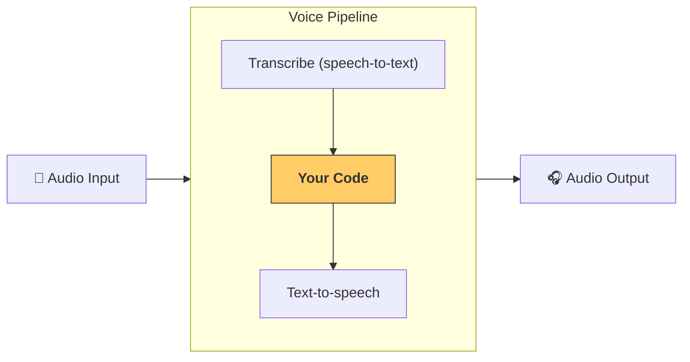

This file is a merged representation of a subset of the codebase, containing specifically included files, combined into a single document by Repomix.

<files>
This section contains the contents of the repository's files.

<file path="docs/ja/models/index.md">
---
search:
  exclude: true
---
# モデル

Agents SDK には、標準で 2 種類の OpenAI モデルサポートが含まれています。

- **推奨**: [`OpenAIResponsesModel`][agents.models.openai_responses.OpenAIResponsesModel] — 新しい [Responses API](https://platform.openai.com/docs/api-reference/responses) を利用して OpenAI API を呼び出します。  
- [`OpenAIChatCompletionsModel`][agents.models.openai_chatcompletions.OpenAIChatCompletionsModel] — [Chat Completions API](https://platform.openai.com/docs/api-reference/chat) を利用して OpenAI API を呼び出します。

## モデルの組み合わせ

1 つのワークフロー内で、エージェントごとに異なるモデルを使用したい場合があります。たとえば、振り分けには小さく高速なモデルを、複雑なタスクには大きく高性能なモデルを使う、といった使い分けです。[`Agent`][agents.Agent] を設定する際は、以下のいずれかで特定のモデルを指定できます。

1. OpenAI モデル名を直接渡す  
2. 任意のモデル名と、それを `Model` インスタンスへマッピングできる [`ModelProvider`][agents.models.interface.ModelProvider] を渡す  
3. [`Model`][agents.models.interface.Model] 実装を直接渡す  

!!!note
    SDK は [`OpenAIResponsesModel`][agents.models.openai_responses.OpenAIResponsesModel] と [`OpenAIChatCompletionsModel`][agents.models.openai_chatcompletions.OpenAIChatCompletionsModel] の両方の形に対応していますが、ワークフローごとに 1 つのモデル形を使用することを推奨します。2 つの形ではサポートする機能・ツールが異なるためです。どうしても混在させる場合は、利用するすべての機能が両方で利用可能であることを確認してください。

```python
from agents import Agent, Runner, AsyncOpenAI, OpenAIChatCompletionsModel
import asyncio

spanish_agent = Agent(
    name="Spanish agent",
    instructions="You only speak Spanish.",
    model="o3-mini", # (1)!
)

english_agent = Agent(
    name="English agent",
    instructions="You only speak English",
    model=OpenAIChatCompletionsModel( # (2)!
        model="gpt-4o",
        openai_client=AsyncOpenAI()
    ),
)

triage_agent = Agent(
    name="Triage agent",
    instructions="Handoff to the appropriate agent based on the language of the request.",
    handoffs=[spanish_agent, english_agent],
    model="gpt-3.5-turbo",
)

async def main():
    result = await Runner.run(triage_agent, input="Hola, ¿cómo estás?")
    print(result.final_output)
```

1. OpenAI モデル名を直接指定  
2. [`Model`][agents.models.interface.Model] 実装を提供  

エージェントで使用するモデルをさらに細かく設定したい場合は、`temperature` などのオプションを指定できる [`ModelSettings`][agents.models.interface.ModelSettings] を渡します。

```python
from agents import Agent, ModelSettings

english_agent = Agent(
    name="English agent",
    instructions="You only speak English",
    model="gpt-4o",
    model_settings=ModelSettings(temperature=0.1),
)
```

## 他の LLM プロバイダーの利用

他の LLM プロバイダーは 3 通りの方法で利用できます（コード例は [こちら](https://github.com/openai/openai-agents-python/tree/main/examples/model_providers/)）。

1. [`set_default_openai_client`][agents.set_default_openai_client]  
   OpenAI 互換の API エンドポイントを持つ場合に、`AsyncOpenAI` インスタンスをグローバルに LLM クライアントとして設定できます。`base_url` と `api_key` を設定するケースです。設定例は [examples/model_providers/custom_example_global.py](https://github.com/openai/openai-agents-python/tree/main/examples/model_providers/custom_example_global.py)。  

2. [`ModelProvider`][agents.models.interface.ModelProvider]  
   `Runner.run` レベルで「この実行中のすべてのエージェントにカスタムモデルプロバイダーを使う」と宣言できます。設定例は [examples/model_providers/custom_example_provider.py](https://github.com/openai/openai-agents-python/tree/main/examples/model_providers/custom_example_provider.py)。  

3. [`Agent.model`][agents.agent.Agent.model]  
   特定の Agent インスタンスにモデルを指定できます。エージェントごとに異なるプロバイダーを組み合わせられます。設定例は [examples/model_providers/custom_example_agent.py](https://github.com/openai/openai-agents-python/tree/main/examples/model_providers/custom_example_agent.py)。多くのモデルを簡単に使う方法として [LiteLLM 連携](./litellm.md) があります。  

`platform.openai.com` の API キーを持たない場合は、`set_tracing_disabled()` でトレーシングを無効化するか、[別のトレーシングプロセッサー](../tracing.md) を設定することを推奨します。

!!! note
    これらの例では Chat Completions API/モデルを使用しています。多くの LLM プロバイダーがまだ Responses API をサポートしていないためです。もしプロバイダーが Responses API をサポートしている場合は、Responses の使用を推奨します。

## 他の LLM プロバイダーでよくある問題

### Tracing クライアントの 401 エラー

トレースは OpenAI サーバーへアップロードされるため、OpenAI API キーがない場合にエラーになります。解決策は次の 3 つです。

1. トレーシングを完全に無効化する: [`set_tracing_disabled(True)`][agents.set_tracing_disabled]  
2. トレーシング用の OpenAI キーを設定する: [`set_tracing_export_api_key(...)`][agents.set_tracing_export_api_key]  
   このキーはトレースのアップロードにのみ使用され、[platform.openai.com](https://platform.openai.com/) のものが必要です。  
3. OpenAI 以外のトレースプロセッサーを使う。詳しくは [tracing ドキュメント](../tracing.md#custom-tracing-processors) を参照してください。  

### Responses API サポート

SDK は既定で Responses API を使用しますが、多くの LLM プロバイダーはまだ対応していません。そのため 404 などのエラーが発生する場合があります。対処方法は 2 つです。

1. [`set_default_openai_api("chat_completions")`][agents.set_default_openai_api] を呼び出す  
   環境変数 `OPENAI_API_KEY` と `OPENAI_BASE_URL` を設定している場合に機能します。  
2. [`OpenAIChatCompletionsModel`][agents.models.openai_chatcompletions.OpenAIChatCompletionsModel] を使用する  
   コード例は [こちら](https://github.com/openai/openai-agents-python/tree/main/examples/model_providers/) にあります。  

### structured outputs のサポート

一部のモデルプロバイダーは [structured outputs](https://platform.openai.com/docs/guides/structured-outputs) をサポートしていません。その場合、次のようなエラーが発生することがあります。

```
BadRequestError: Error code: 400 - {'error': {'message': "'response_format.type' : value is not one of the allowed values ['text','json_object']", 'type': 'invalid_request_error'}}
```

これは一部プロバイダーの制限で、JSON 出力はサポートしていても `json_schema` を指定できません。現在修正に取り組んでいますが、JSON スキーマ出力をサポートしているプロバイダーを利用することを推奨します。そうでない場合、不正な JSON によりアプリが頻繁に壊れる可能性があります。
</file>

<file path="docs/ja/models/litellm.md">
---
search:
  exclude: true
---
# LiteLLM 経由でのモデル利用

!!! note

    LiteLLM との統合は現在ベータ版です。特に小規模なモデルプロバイダーでは問題が発生する可能性があります。問題を見つけた場合は、[GitHub Issues](https://github.com/openai/openai-agents-python/issues) からご報告ください。迅速に対応いたします。

[LiteLLM](https://docs.litellm.ai/docs/) は、1 つのインターフェースで 100 以上のモデルを利用できるライブラリです。Agents SDK では LiteLLM との統合により、任意の AI モデルを使用できます。

## セットアップ

`litellm` がインストールされていることを確認してください。オプションの `litellm` 依存関係グループをインストールすることで対応できます。

```bash
pip install "openai-agents[litellm]"
```

インストール後、任意のエージェントで [`LitellmModel`][agents.extensions.models.litellm_model.LitellmModel] を利用できます。

## 例

以下は動作する完全なサンプルです。実行するとモデル名と API キーの入力を求められます。例えば次のように入力できます。

-   `openai/gpt-4.1` をモデル名に、OpenAI API キーを入力  
-   `anthropic/claude-3-5-sonnet-20240620` をモデル名に、Anthropic API キーを入力  
-   その他

LiteLLM でサポートされているモデルの全リストは、[litellm providers docs](https://docs.litellm.ai/docs/providers) を参照してください。

```python
from __future__ import annotations

import asyncio

from agents import Agent, Runner, function_tool, set_tracing_disabled
from agents.extensions.models.litellm_model import LitellmModel

@function_tool
def get_weather(city: str):
    print(f"[debug] getting weather for {city}")
    return f"The weather in {city} is sunny."


async def main(model: str, api_key: str):
    agent = Agent(
        name="Assistant",
        instructions="You only respond in haikus.",
        model=LitellmModel(model=model, api_key=api_key),
        tools=[get_weather],
    )

    result = await Runner.run(agent, "What's the weather in Tokyo?")
    print(result.final_output)


if __name__ == "__main__":
    # First try to get model/api key from args
    import argparse

    parser = argparse.ArgumentParser()
    parser.add_argument("--model", type=str, required=False)
    parser.add_argument("--api-key", type=str, required=False)
    args = parser.parse_args()

    model = args.model
    if not model:
        model = input("Enter a model name for Litellm: ")

    api_key = args.api_key
    if not api_key:
        api_key = input("Enter an API key for Litellm: ")

    asyncio.run(main(model, api_key))
```
</file>

<file path="docs/ja/voice/pipeline.md">
---
search:
  exclude: true
---
# パイプラインと ワークフロー

[`VoicePipeline`][agents.voice.pipeline.VoicePipeline] は、エージェント的なワークフローを音声アプリに簡単に変換できるクラスです。ワークフローを渡すと、パイプラインが入力音声の文字起こし、音声終了の検知、適切なタイミングでのワークフロー呼び出し、そしてワークフロー出力を音声へ変換する処理を担当します。



## パイプラインの設定

パイプラインを作成する際に、以下を設定できます。

1. [`workflow`][agents.voice.workflow.VoiceWorkflowBase] ‐ 新しい音声が文字起こしされるたびに実行されるコード
2. 使用する [`speech-to-text`][agents.voice.model.STTModel] および [`text-to-speech`][agents.voice.model.TTSModel] モデル
3. [`config`][agents.voice.pipeline_config.VoicePipelineConfig] ‐ 以下のような内容を設定可能
    - モデルプロバイダー。モデル名をモデルにマッピングします
    - トレーシング。トレーシングの無効化、音声ファイルのアップロード可否、ワークフロー名、トレース ID など
    - TTS と STT モデルの設定。プロンプト、言語、使用するデータ型など

## パイプラインの実行

パイプラインは [`run()`][agents.voice.pipeline.VoicePipeline.run] メソッドで実行できます。音声入力は次の 2 形式で渡せます。

1. [`AudioInput`][agents.voice.input.AudioInput]  
   完全な音声トランスクリプトがある場合に使用し、その結果だけを生成したいときに便利です。話者の発話終了を検知する必要がないケース、たとえば録音済み音声やプッシュトゥートーク型アプリのようにユーザーが話し終えたタイミングが明確な場合に向いています。
2. [`StreamedAudioInput`][agents.voice.input.StreamedAudioInput]  
   ユーザーの発話終了検知が必要な場合に使用します。検出された音声チャンクを順次プッシュでき、音声パイプラインが「アクティビティ検知」と呼ばれるプロセスを通じて適切なタイミングでエージェント ワークフローを自動的に実行します。

## 結果

音声パイプライン実行の結果は [`StreamedAudioResult`][agents.voice.result.StreamedAudioResult] です。これは発生したイベントをストリーミングで受け取れるオブジェクトです。いくつかの [`VoiceStreamEvent`][agents.voice.events.VoiceStreamEvent] があり、主なものは次のとおりです。

1. [`VoiceStreamEventAudio`][agents.voice.events.VoiceStreamEventAudio] ‐ 音声チャンクを含みます
2. [`VoiceStreamEventLifecycle`][agents.voice.events.VoiceStreamEventLifecycle] ‐ ターンの開始や終了などのライフサイクルイベントを通知します
3. [`VoiceStreamEventError`][agents.voice.events.VoiceStreamEventError] ‐ エラーイベントです

```python

result = await pipeline.run(input)

async for event in result.stream():
    if event.type == "voice_stream_event_audio":
        # play audio
    elif event.type == "voice_stream_event_lifecycle":
        # lifecycle
    elif event.type == "voice_stream_event_error"
        # error
    ...
```

## ベストプラクティス

### 割り込み

Agents SDK は現在 [`StreamedAudioInput`][agents.voice.input.StreamedAudioInput] に対して、組み込みの割り込み処理をサポートしていません。そのため、検出された各ターンごとにワークフローが個別に実行されます。アプリケーション内で割り込みを処理したい場合は、[`VoiceStreamEventLifecycle`][agents.voice.events.VoiceStreamEventLifecycle] イベントを監視できます。`turn_started` は新しいターンが文字起こしされ、処理が開始されたことを示します。`turn_ended` は該当ターンのすべての音声が送信された後にトリガーされます。たとえば、モデルがターンを開始した際にスピーカーのマイクをミュートし、そのターンに関連する音声をすべて送信し終えた後にアンミュートするといった制御に、これらのイベントを利用できます。
</file>

<file path="docs/ja/voice/quickstart.md">
---
search:
  exclude: true
---
# クイックスタート

## 前提条件

まずは [クイックスタート手順](../quickstart.md) に従って Agents SDK をセットアップし、仮想環境を作成してください。その後、SDK の音声関連のオプション依存関係をインストールします:

```bash
pip install 'openai-agents[voice]'
```

## コンセプト

押さえておくべき主な概念は [`VoicePipeline`][agents.voice.pipeline.VoicePipeline] です。これは次の 3 ステップから成るプロセスです。

1. speech-to-text モデルを実行して音声をテキストに変換します。  
2. 通常はエージェント的ワークフローであるあなたのコードを実行し、結果を生成します。  
3. text-to-speech モデルを実行して結果のテキストを再び音声に変換します。


## エージェント

まず、いくつかの エージェント をセットアップしましょう。この SDK でエージェントを構築したことがあれば、見覚えがあるはずです。ここでは複数の エージェント、ハンドオフ、そしてツールを用意します。

```python
import asyncio
import random

from agents import (
    Agent,
    function_tool,
)
from agents.extensions.handoff_prompt import prompt_with_handoff_instructions


@function_tool
def get_weather(city: str) -> str:
    """Get the weather for a given city."""
    print(f"[debug] get_weather called with city: {city}")
    choices = ["sunny", "cloudy", "rainy", "snowy"]
    return f"The weather in {city} is {random.choice(choices)}."


spanish_agent = Agent(
    name="Spanish",
    handoff_description="A spanish speaking agent.",
    instructions=prompt_with_handoff_instructions(
        "You're speaking to a human, so be polite and concise. Speak in Spanish.",
    ),
    model="gpt-4o-mini",
)

agent = Agent(
    name="Assistant",
    instructions=prompt_with_handoff_instructions(
        "You're speaking to a human, so be polite and concise. If the user speaks in Spanish, handoff to the spanish agent.",
    ),
    model="gpt-4o-mini",
    handoffs=[spanish_agent],
    tools=[get_weather],
)
```

## 音声パイプライン

[`SingleAgentVoiceWorkflow`][agents.voice.workflow.SingleAgentVoiceWorkflow] をワークフローとして、シンプルな音声パイプラインを構築します。

```python
from agents.voice import SingleAgentVoiceWorkflow, VoicePipeline
pipeline = VoicePipeline(workflow=SingleAgentVoiceWorkflow(agent))
```

## パイプラインの実行

```python
import numpy as np
import sounddevice as sd
from agents.voice import AudioInput

# For simplicity, we'll just create 3 seconds of silence
# In reality, you'd get microphone data
buffer = np.zeros(24000 * 3, dtype=np.int16)
audio_input = AudioInput(buffer=buffer)

result = await pipeline.run(audio_input)

# Create an audio player using `sounddevice`
player = sd.OutputStream(samplerate=24000, channels=1, dtype=np.int16)
player.start()

# Play the audio stream as it comes in
async for event in result.stream():
    if event.type == "voice_stream_event_audio":
        player.write(event.data)

```

## まとめて実行

```python
import asyncio
import random

import numpy as np
import sounddevice as sd

from agents import (
    Agent,
    function_tool,
    set_tracing_disabled,
)
from agents.voice import (
    AudioInput,
    SingleAgentVoiceWorkflow,
    VoicePipeline,
)
from agents.extensions.handoff_prompt import prompt_with_handoff_instructions


@function_tool
def get_weather(city: str) -> str:
    """Get the weather for a given city."""
    print(f"[debug] get_weather called with city: {city}")
    choices = ["sunny", "cloudy", "rainy", "snowy"]
    return f"The weather in {city} is {random.choice(choices)}."


spanish_agent = Agent(
    name="Spanish",
    handoff_description="A spanish speaking agent.",
    instructions=prompt_with_handoff_instructions(
        "You're speaking to a human, so be polite and concise. Speak in Spanish.",
    ),
    model="gpt-4o-mini",
)

agent = Agent(
    name="Assistant",
    instructions=prompt_with_handoff_instructions(
        "You're speaking to a human, so be polite and concise. If the user speaks in Spanish, handoff to the spanish agent.",
    ),
    model="gpt-4o-mini",
    handoffs=[spanish_agent],
    tools=[get_weather],
)


async def main():
    pipeline = VoicePipeline(workflow=SingleAgentVoiceWorkflow(agent))
    buffer = np.zeros(24000 * 3, dtype=np.int16)
    audio_input = AudioInput(buffer=buffer)

    result = await pipeline.run(audio_input)

    # Create an audio player using `sounddevice`
    player = sd.OutputStream(samplerate=24000, channels=1, dtype=np.int16)
    player.start()

    # Play the audio stream as it comes in
    async for event in result.stream():
        if event.type == "voice_stream_event_audio":
            player.write(event.data)


if __name__ == "__main__":
    asyncio.run(main())
```

この例を実行すると、エージェントがあなたに話しかけます。実際にエージェントと会話できるデモは、[examples/voice/static](https://github.com/openai/openai-agents-python/tree/main/examples/voice/static) をご覧ください。
</file>

<file path="docs/ja/voice/tracing.md">
---
search:
  exclude: true
---
# トレーシング

[エージェントのトレーシング](../tracing.md) と同様に、音声パイプラインも自動的にトレーシングされます。

基本的なトレーシング情報については上記のドキュメントを参照してください。さらに、[`VoicePipelineConfig`][agents.voice.pipeline_config.VoicePipelineConfig] でパイプラインのトレーシング設定を行えます。

主なトレーシング関連フィールドは次のとおりです。

-   [`tracing_disabled`][agents.voice.pipeline_config.VoicePipelineConfig.tracing_disabled]：トレーシングを無効にするかどうかを制御します。デフォルトではトレーシングは有効です。  
-   [`trace_include_sensitive_data`][agents.voice.pipeline_config.VoicePipelineConfig.trace_include_sensitive_data]：トレースに音声テキストなどの機微なデータを含めるかどうかを制御します。これは音声パイプライン専用であり、Workflow 内部で発生する処理には影響しません。  
-   [`trace_include_sensitive_audio_data`][agents.voice.pipeline_config.VoicePipelineConfig.trace_include_sensitive_audio_data]：トレースに音声データを含めるかどうかを制御します。  
-   [`workflow_name`][agents.voice.pipeline_config.VoicePipelineConfig.workflow_name]：トレース Workflow の名前です。  
-   [`group_id`][agents.voice.pipeline_config.VoicePipelineConfig.group_id]：複数のトレースを関連付けるための `group_id` です。  
-   [`trace_metadata`][agents.voice.pipeline_config.VoicePipelineConfig.tracing_disabled]：トレースに追加するメタデータです。
</file>

<file path="docs/ja/agents.md">
---
search:
  exclude: true
---
# エージェント

エージェントはアプリの主要な構成ブロックです。エージェントは、大規模言語モデル ( LLM ) に instructions と tools を設定したものです。

## 基本設定

エージェントで最も一般的に設定するプロパティは次のとおりです。

-   `instructions`: 開発者メッセージまたは system prompt とも呼ばれます。
-   `model`: 使用する LLM と、temperature や top_p などのモデル調整パラメーターを指定する任意の `model_settings`。
-   `tools`: エージェントがタスクを達成するために利用できるツール。

```python
from agents import Agent, ModelSettings, function_tool

@function_tool
def get_weather(city: str) -> str:
    return f"The weather in {city} is sunny"

agent = Agent(
    name="Haiku agent",
    instructions="Always respond in haiku form",
    model="o3-mini",
    tools=[get_weather],
)
```

## コンテキスト

エージェントはその `context` 型について汎用的です。コンテキストは依存性注入の手段で、`Runner.run()` に渡すオブジェクトです。これはすべてのエージェント、ツール、ハンドオフなどに渡され、エージェント実行時の依存関係や状態をまとめて保持します。任意の Python オブジェクトをコンテキストとして渡せます。

```python
@dataclass
class UserContext:
    uid: str
    is_pro_user: bool

    async def fetch_purchases() -> list[Purchase]:
        return ...

agent = Agent[UserContext](
    ...,
)
```

## 出力タイプ

デフォルトでは、エージェントはプレーンテキスト ( つまり `str` ) を出力します。特定の型で出力させたい場合は `output_type` パラメーターを使用します。一般的には [Pydantic](https://docs.pydantic.dev/) オブジェクトを利用しますが、Pydantic の [TypeAdapter](https://docs.pydantic.dev/latest/api/type_adapter/) でラップ可能な型であれば何でも対応します。たとえば dataclass、list、TypedDict などです。

```python
from pydantic import BaseModel
from agents import Agent


class CalendarEvent(BaseModel):
    name: str
    date: str
    participants: list[str]

agent = Agent(
    name="Calendar extractor",
    instructions="Extract calendar events from text",
    output_type=CalendarEvent,
)
```

!!! note

    `output_type` を渡すと、モデルは通常のプレーンテキスト応答の代わりに [structured outputs](https://platform.openai.com/docs/guides/structured-outputs) を使用するよう指示されます。

## ハンドオフ

ハンドオフは、エージェントが委譲できるサブエージェントです。ハンドオフのリストを渡しておくと、エージェントは必要に応じてそれらに処理を委譲できます。これにより、単一のタスクに特化したモジュール式エージェントを編成できる強力なパターンが実現します。詳細は [handoffs](handoffs.md) ドキュメントをご覧ください。

```python
from agents import Agent

booking_agent = Agent(...)
refund_agent = Agent(...)

triage_agent = Agent(
    name="Triage agent",
    instructions=(
        "Help the user with their questions."
        "If they ask about booking, handoff to the booking agent."
        "If they ask about refunds, handoff to the refund agent."
    ),
    handoffs=[booking_agent, refund_agent],
)
```

## 動的 instructions

通常はエージェント作成時に instructions を指定しますが、関数を介して動的に instructions を提供することもできます。その関数はエージェントとコンテキストを受け取り、プロンプトを返す必要があります。同期関数と `async` 関数の両方に対応しています。

```python
def dynamic_instructions(
    context: RunContextWrapper[UserContext], agent: Agent[UserContext]
) -> str:
    return f"The user's name is {context.context.name}. Help them with their questions."


agent = Agent[UserContext](
    name="Triage agent",
    instructions=dynamic_instructions,
)
```

## ライフサイクルイベント (hooks)

場合によっては、エージェントのライフサイクルを観察したいことがあります。たとえば、イベントをログに記録したり、特定のイベント発生時にデータを事前取得したりする場合です。`hooks` プロパティを使ってエージェントのライフサイクルにフックできます。[`AgentHooks`][agents.lifecycle.AgentHooks] クラスをサブクラス化し、関心のあるメソッドをオーバーライドしてください。

## ガードレール

ガードレールを使うと、エージェントの実行と並行してユーザー入力に対するチェックやバリデーションを実行できます。たとえば、ユーザーの入力内容が関連しているかをスクリーニングできます。詳細は [guardrails](guardrails.md) ドキュメントをご覧ください。

## エージェントの複製

`clone()` メソッドを使用すると、エージェントを複製し、必要に応じて任意のプロパティを変更できます。

```python
pirate_agent = Agent(
    name="Pirate",
    instructions="Write like a pirate",
    model="o3-mini",
)

robot_agent = pirate_agent.clone(
    name="Robot",
    instructions="Write like a robot",
)
```

## ツール使用の強制

ツールの一覧を渡しても、LLM が必ずツールを使用するとは限りません。[`ModelSettings.tool_choice`][agents.model_settings.ModelSettings.tool_choice] を設定することでツール使用を強制できます。有効な値は次のとおりです。

1. `auto` — ツールを使用するかどうかを LLM が判断します。
2. `required` — LLM にツール使用を必須化します ( ただし使用するツールは自動選択 )。
3. `none` — LLM にツールを使用しないことを要求します。
4. 特定の文字列 ( 例: `my_tool` ) — その特定のツールを LLM に使用させます。

!!! note

    無限ループを防ぐため、フレームワークはツール呼び出し後に `tool_choice` を自動的に "auto" にリセットします。この動作は [`agent.reset_tool_choice`][agents.agent.Agent.reset_tool_choice] で設定できます。無限ループが起こる理由は、ツールの結果が LLM に送られ、`tool_choice` により再びツール呼び出しが生成される、という流れが繰り返されるからです。

    ツール呼び出し後にエージェントを完全に停止させたい場合 ( auto モードで続行させたくない場合 ) は、[`Agent.tool_use_behavior="stop_on_first_tool"`] を設定してください。これにより、ツールの出力を LL M の追加処理なしにそのまま最終応答として返します。
</file>

<file path="docs/ja/config.md">
---
search:
  exclude: true
---
# SDK の設定

## API キーとクライアント

デフォルトでは、 SDK はインポートされた時点で LLM リクエストとトレーシングに使用する `OPENAI_API_KEY` 環境変数を探します。アプリ起動前にこの環境変数を設定できない場合は、 [set_default_openai_key()][agents.set_default_openai_key] 関数を利用してキーを設定できます。

```python
from agents import set_default_openai_key

set_default_openai_key("sk-...")
```

また、使用する OpenAI クライアントを構成することも可能です。デフォルトでは、 SDK は環境変数または上記で設定したデフォルトキーを用いて `AsyncOpenAI` インスタンスを作成します。これを変更するには、 [set_default_openai_client()][agents.set_default_openai_client] 関数を使用します。

```python
from openai import AsyncOpenAI
from agents import set_default_openai_client

custom_client = AsyncOpenAI(base_url="...", api_key="...")
set_default_openai_client(custom_client)
```

さらに、使用する OpenAI API をカスタマイズすることもできます。既定では OpenAI Responses API を利用します。これを Chat Completions API に変更するには、 [set_default_openai_api()][agents.set_default_openai_api] 関数を使用してください。

```python
from agents import set_default_openai_api

set_default_openai_api("chat_completions")
```

## トレーシング

トレーシングはデフォルトで有効になっています。前述の OpenAI API キー（環境変数または設定したデフォルトキー）が自動的に使用されます。トレーシングで使用する API キーを個別に設定したい場合は、 [`set_tracing_export_api_key`][agents.set_tracing_export_api_key] 関数を利用してください。

```python
from agents import set_tracing_export_api_key

set_tracing_export_api_key("sk-...")
```

トレーシングを完全に無効化するには、 [`set_tracing_disabled()`][agents.set_tracing_disabled] 関数を呼び出します。

```python
from agents import set_tracing_disabled

set_tracing_disabled(True)
```

## デバッグログ

 SDK にはハンドラーが設定されていない Python ロガーが 2 つあります。デフォルトでは、警告とエラーは `stdout` に出力されますが、それ以外のログは抑制されます。

詳細なログを有効にするには、 [`enable_verbose_stdout_logging()`][agents.enable_verbose_stdout_logging] 関数を使用します。

```python
from agents import enable_verbose_stdout_logging

enable_verbose_stdout_logging()
```

必要に応じて、ハンドラー、フィルター、フォーマッターなどを追加してログをカスタマイズすることも可能です。詳しくは [Python ロギングガイド](https://docs.python.org/3/howto/logging.html) を参照してください。

```python
import logging

logger = logging.getLogger("openai.agents") # or openai.agents.tracing for the Tracing logger

# To make all logs show up
logger.setLevel(logging.DEBUG)
# To make info and above show up
logger.setLevel(logging.INFO)
# To make warning and above show up
logger.setLevel(logging.WARNING)
# etc

# You can customize this as needed, but this will output to `stderr` by default
logger.addHandler(logging.StreamHandler())
```

### ログに含まれる機微情報

特定のログには機微情報（たとえば ユーザー データ）が含まれる場合があります。この情報が記録されるのを防ぎたい場合は、次の環境変数を設定してください。

LLM の入力および出力のログを無効にする:

```bash
export OPENAI_AGENTS_DONT_LOG_MODEL_DATA=1
```

ツールの入力および出力のログを無効にする:

```bash
export OPENAI_AGENTS_DONT_LOG_TOOL_DATA=1
```
</file>

<file path="docs/ja/context.md">
---
search:
  exclude: true
---
# コンテキスト管理

コンテキストという言葉には複数の意味があります。ここでは主に 2 つのコンテキストについて説明します。

1. コード内でローカルに利用できるコンテキスト: ツール関数の実行時や `on_handoff` などのコールバック、ライフサイクルフックで必要となるデータや依存関係です。  
2. LLM が参照できるコンテキスト: LLM がレスポンスを生成する際に見えるデータです。

## ローカルコンテキスト

ローカルコンテキストは [`RunContextWrapper`][agents.run_context.RunContextWrapper] クラスと、その中の [`context`][agents.run_context.RunContextWrapper.context] プロパティで表現されます。仕組みは次のとおりです。

1. 任意の Python オブジェクトを作成します。一般的なパターンとして dataclass や Pydantic オブジェクトを使用します。  
2. そのオブジェクトを各種 run メソッド（例: `Runner.run(..., **context=whatever** )`）に渡します。  
3. すべてのツール呼び出しやライフサイクルフックには、ラッパーオブジェクト `RunContextWrapper[T]` が渡されます。ここで `T` はコンテキストオブジェクトの型で、`wrapper.context` からアクセスできます。

**最重要ポイント**: あるエージェントの実行において、エージェント・ツール関数・ライフサイクルフックなどはすべて同じ _型_ のコンテキストを使用しなければなりません。

コンテキストでは次のような用途が考えられます。

-   実行に関するデータ（例: ユーザー名 / uid やその他のユーザー情報）
-   依存オブジェクト（例: ロガー、データフェッチャーなど）
-   ヘルパー関数

!!! danger "Note"

    コンテキストオブジェクトは LLM には送信されません。あくまでローカルのオブジェクトであり、読み書きやメソッド呼び出しが可能です。

```python
import asyncio
from dataclasses import dataclass

from agents import Agent, RunContextWrapper, Runner, function_tool

@dataclass
class UserInfo:  # (1)!
    name: str
    uid: int

@function_tool
async def fetch_user_age(wrapper: RunContextWrapper[UserInfo]) -> str:  # (2)!
    return f"User {wrapper.context.name} is 47 years old"

async def main():
    user_info = UserInfo(name="John", uid=123)

    agent = Agent[UserInfo](  # (3)!
        name="Assistant",
        tools=[fetch_user_age],
    )

    result = await Runner.run(  # (4)!
        starting_agent=agent,
        input="What is the age of the user?",
        context=user_info,
    )

    print(result.final_output)  # (5)!
    # The user John is 47 years old.

if __name__ == "__main__":
    asyncio.run(main())
```

1. これがコンテキストオブジェクトです。ここでは dataclass を使っていますが、任意の型を使用できます。  
2. これはツールです。`RunContextWrapper[UserInfo]` を受け取り、実装内でコンテキストを参照しています。  
3. エージェントにジェネリック `UserInfo` を付与することで、型チェッカーが誤りを検出できます（たとえば別のコンテキスト型を受け取るツールを渡した場合など）。  
4. `run` 関数にコンテキストを渡します。  
5. エージェントはツールを正しく呼び出し、年齢を取得します。  

## エージェント / LLM コンテキスト

LLM が呼び出されるとき、LLM が参照できるデータは会話履歴に含まれるものだけです。したがって、新しいデータを LLM に渡したい場合は、そのデータを履歴に含める形で提供する必要があります。方法はいくつかあります。

1. Agent の `instructions` に追加する。いわゆる「system prompt」や「developer message」と呼ばれるものです。システムプロンプトは静的な文字列でも、コンテキストを受け取って文字列を返す動的な関数でも構いません。ユーザー名や現在の日付など、常に有用な情報を渡す際によく使われます。  
2. `Runner.run` 呼び出し時の `input` に追加する。`instructions` と似ていますが、[chain of command](https://cdn.openai.com/spec/model-spec-2024-05-08.html#follow-the-chain-of-command) の下位レイヤーにメッセージを配置できます。  
3. 関数ツール経由で公開する。オンデマンドで取得するコンテキストに適しており、LLM が必要に応じてツールを呼び出してデータを取得します。  
4. retrieval や web search を使う。これらは特別なツールで、ファイルやデータベースから関連データを取得する（retrieval）、もしくは Web から取得する（web search）ことができます。レスポンスを関連コンテキストで「グラウンディング」するのに有効です。
</file>

<file path="docs/ja/examples.md">
---
search:
  exclude: true
---
# コード例

リポジトリの [examples セクション](https://github.com/openai/openai-agents-python/tree/main/examples) には、 SDK のさまざまなサンプル実装が用意されています。これらの例は、異なるパターンや機能を示す複数のカテゴリーに整理されています。


## カテゴリー

- **[agent_patterns](https://github.com/openai/openai-agents-python/tree/main/examples/agent_patterns):**  
  このカテゴリーの例では、一般的なエージェント設計パターンを紹介しています。

    - 決定論的ワークフロー  
    - ツールとしてのエージェント  
    - エージェントの並列実行  

- **[basic](https://github.com/openai/openai-agents-python/tree/main/examples/basic):**  
  SDK の基礎的な機能を示す例です。

    - 動的なシステムプロンプト  
    - ストリーミング出力  
    - ライフサイクルイベント  

- **[tool examples](https://github.com/openai/openai-agents-python/tree/main/examples/tools):**  
  Web 検索やファイル検索など、 OpenAI がホストするツールの実装方法と、それらをエージェントに統合する方法を学べます。

- **[model providers](https://github.com/openai/openai-agents-python/tree/main/examples/model_providers):**  
  OpenAI 以外のモデルを SDK で利用する方法を探ります。

- **[handoffs](https://github.com/openai/openai-agents-python/tree/main/examples/handoffs):**  
  エージェントのハンドオフを実践的に示す例です。

- **[mcp](https://github.com/openai/openai-agents-python/tree/main/examples/mcp):**  
  MCP を使ったエージェントの構築方法を学べます。

- **[customer_service](https://github.com/openai/openai-agents-python/tree/main/examples/customer_service)** と **[research_bot](https://github.com/openai/openai-agents-python/tree/main/examples/research_bot):**  
  より実践的なユースケースを示す、拡張された 2 つの例です。

    - **customer_service**: 航空会社向けカスタマーサービスシステムの例  
    - **research_bot**: シンプルなディープリサーチクローン  

- **[voice](https://github.com/openai/openai-agents-python/tree/main/examples/voice):**  
  TTS と STT モデルを用いた音声エージェントの例をご覧ください。
</file>

<file path="docs/ja/guardrails.md">
---
search:
  exclude: true
---
# ガードレール

ガードレールは エージェント と _並列_ に実行され、 ユーザー入力 のチェックとバリデーションを行います。たとえば、顧客からのリクエストを支援するために非常に賢い (そのため遅く / 高価な) モデルを使うエージェントがあるとします。悪意のある ユーザー がモデルに数学の宿題を手伝わせようとするのは避けたいですよね。その場合、 高速 / 低コスト のモデルでガードレールを実行できます。ガードレールが悪意のある利用を検知した場合、即座にエラーを送出して高価なモデルの実行を停止し、時間と費用を節約できます。

ガードレールには 2 種類あります。

1. Input ガードレールは最初の ユーザー入力 に対して実行されます  
2. Output ガードレールは最終的なエージェント出力に対して実行されます  

## Input ガードレール

Input ガードレールは 3 つのステップで実行されます。

1. まず、ガードレールはエージェントに渡されたものと同じ入力を受け取ります。  
2. 次に、ガードレール関数が実行され [`GuardrailFunctionOutput`][agents.guardrail.GuardrailFunctionOutput] を生成し、それが [`InputGuardrailResult`][agents.guardrail.InputGuardrailResult] でラップされます。  
3. 最後に [`.tripwire_triggered`][agents.guardrail.GuardrailFunctionOutput.tripwire_triggered] が true かどうかを確認します。true の場合、[`InputGuardrailTripwireTriggered`][agents.exceptions.InputGuardrailTripwireTriggered] 例外が送出されるので、 ユーザー への適切な応答や例外処理を行えます。  

!!! Note

    Input ガードレールは ユーザー入力 に対して実行されることを想定しているため、エージェントのガードレールが実行されるのはそのエージェントが *最初* のエージェントである場合だけです。「なぜ `guardrails` プロパティがエージェントにあり、 `Runner.run` に渡さないのか？」と思うかもしれません。ガードレールは実際の エージェント に密接に関連する場合が多く、エージェントごとに異なるガードレールを実行するため、コードを同じ場所に置くことで可読性が向上するからです。

## Output ガードレール

Output ガードレールは 3 つのステップで実行されます。

1. まず、ガードレールはエージェントに渡されたものと同じ入力を受け取ります。  
2. 次に、ガードレール関数が実行され [`GuardrailFunctionOutput`][agents.guardrail.GuardrailFunctionOutput] を生成し、それが [`OutputGuardrailResult`][agents.guardrail.OutputGuardrailResult] でラップされます。  
3. 最後に [`.tripwire_triggered`][agents.guardrail.GuardrailFunctionOutput.tripwire_triggered] が true かどうかを確認します。true の場合、[`OutputGuardrailTripwireTriggered`][agents.exceptions.OutputGuardrailTripwireTriggered] 例外が送出されるので、 ユーザー への適切な応答や例外処理を行えます。  

!!! Note

    Output ガードレールは最終的なエージェント出力に対して実行されることを想定しているため、エージェントのガードレールが実行されるのはそのエージェントが *最後* のエージェントである場合だけです。Input ガードレール同様、ガードレールは実際の エージェント に密接に関連するため、コードを同じ場所に置くことで可読性が向上します。

## トリップワイヤ

入力または出力がガードレールに失敗した場合、ガードレールはトリップワイヤを用いてそれを通知できます。ガードレールがトリップワイヤを発火したことを検知すると、ただちに `{Input,Output}GuardrailTripwireTriggered` 例外を送出してエージェントの実行を停止します。

## ガードレールの実装

入力を受け取り、[`GuardrailFunctionOutput`][agents.guardrail.GuardrailFunctionOutput] を返す関数を用意する必要があります。次の例では、内部で エージェント を実行してこれを行います。

```python
from pydantic import BaseModel
from agents import (
    Agent,
    GuardrailFunctionOutput,
    InputGuardrailTripwireTriggered,
    RunContextWrapper,
    Runner,
    TResponseInputItem,
    input_guardrail,
)

class MathHomeworkOutput(BaseModel):
    is_math_homework: bool
    reasoning: str

guardrail_agent = Agent( # (1)!
    name="Guardrail check",
    instructions="Check if the user is asking you to do their math homework.",
    output_type=MathHomeworkOutput,
)


@input_guardrail
async def math_guardrail( # (2)!
    ctx: RunContextWrapper[None], agent: Agent, input: str | list[TResponseInputItem]
) -> GuardrailFunctionOutput:
    result = await Runner.run(guardrail_agent, input, context=ctx.context)

    return GuardrailFunctionOutput(
        output_info=result.final_output, # (3)!
        tripwire_triggered=result.final_output.is_math_homework,
    )


agent = Agent(  # (4)!
    name="Customer support agent",
    instructions="You are a customer support agent. You help customers with their questions.",
    input_guardrails=[math_guardrail],
)

async def main():
    # This should trip the guardrail
    try:
        await Runner.run(agent, "Hello, can you help me solve for x: 2x + 3 = 11?")
        print("Guardrail didn't trip - this is unexpected")

    except InputGuardrailTripwireTriggered:
        print("Math homework guardrail tripped")
```

1. この エージェント をガードレール関数内で使用します。  
2. これはエージェントの入力 / コンテキストを受け取り、結果を返すガードレール関数です。  
3. ガードレール結果に追加情報を含めることができます。  
4. これはワークフローを定義する実際のエージェントです。  

Output ガードレールも同様です。

```python
from pydantic import BaseModel
from agents import (
    Agent,
    GuardrailFunctionOutput,
    OutputGuardrailTripwireTriggered,
    RunContextWrapper,
    Runner,
    output_guardrail,
)
class MessageOutput(BaseModel): # (1)!
    response: str

class MathOutput(BaseModel): # (2)!
    reasoning: str
    is_math: bool

guardrail_agent = Agent(
    name="Guardrail check",
    instructions="Check if the output includes any math.",
    output_type=MathOutput,
)

@output_guardrail
async def math_guardrail(  # (3)!
    ctx: RunContextWrapper, agent: Agent, output: MessageOutput
) -> GuardrailFunctionOutput:
    result = await Runner.run(guardrail_agent, output.response, context=ctx.context)

    return GuardrailFunctionOutput(
        output_info=result.final_output,
        tripwire_triggered=result.final_output.is_math,
    )

agent = Agent( # (4)!
    name="Customer support agent",
    instructions="You are a customer support agent. You help customers with their questions.",
    output_guardrails=[math_guardrail],
    output_type=MessageOutput,
)

async def main():
    # This should trip the guardrail
    try:
        await Runner.run(agent, "Hello, can you help me solve for x: 2x + 3 = 11?")
        print("Guardrail didn't trip - this is unexpected")

    except OutputGuardrailTripwireTriggered:
        print("Math output guardrail tripped")
```

1. これは実際のエージェントの出力型です。  
2. これはガードレールの出力型です。  
3. これはエージェントの出力を受け取り、結果を返すガードレール関数です。  
4. これはワークフローを定義する実際のエージェントです。
</file>

<file path="docs/ja/handoffs.md">
---
search:
  exclude: true
---
# ハンドオフ

ハンドオフを使用すると、エージェント がタスクを別の エージェント に委譲できます。これは、複数の エージェント がそれぞれ異なる分野を専門とするシナリオで特に便利です。たとえばカスタマーサポートアプリでは、注文状況、返金、 FAQ などのタスクを個別に担当する エージェント を用意できます。

ハンドオフは LLM からはツールとして認識されます。そのため、`Refund Agent` という エージェント へのハンドオフであれば、ツール名は `transfer_to_refund_agent` になります。

## ハンドオフの作成

すべての エージェント には [`handoffs`][agents.agent.Agent.handoffs] パラメーターがあり、直接 `Agent` を渡すことも、ハンドオフをカスタマイズする `Handoff` オブジェクトを渡すこともできます。

Agents SDK が提供する [`handoff()`][agents.handoffs.handoff] 関数を使ってハンドオフを作成できます。この関数では、引き継ぎ先の エージェント を指定し、オーバーライドや入力フィルターをオプションで設定できます。

### 基本的な使い方

シンプルなハンドオフを作成する例を示します。

```python
from agents import Agent, handoff

billing_agent = Agent(name="Billing agent")
refund_agent = Agent(name="Refund agent")

# (1)!
triage_agent = Agent(name="Triage agent", handoffs=[billing_agent, handoff(refund_agent)])
```

1. `billing_agent` のように エージェント を直接指定することも、`handoff()` 関数を使用することもできます。

### `handoff()` 関数によるハンドオフのカスタマイズ

[`handoff()`][agents.handoffs.handoff] 関数を使うと、ハンドオフを細かくカスタマイズできます。

-   `agent`: ここで指定した エージェント に処理が引き渡されます。
-   `tool_name_override`: デフォルトでは `Handoff.default_tool_name()` が使用され、`transfer_to_<agent_name>` という名前になります。これを上書きできます。
-   `tool_description_override`: `Handoff.default_tool_description()` が返すデフォルトのツール説明を上書きします。
-   `on_handoff`: ハンドオフ実行時に呼び出されるコールバック関数です。ハンドオフが呼ばれたタイミングでデータ取得を開始するなどに便利です。この関数は エージェント のコンテキストを受け取り、オプションで LLM が生成した入力も受け取れます。渡されるデータは `input_type` パラメーターで制御します。
-   `input_type`: ハンドオフが受け取る入力の型（任意）。
-   `input_filter`: 次の エージェント が受け取る入力をフィルタリングできます。詳細は後述します。

```python
from agents import Agent, handoff, RunContextWrapper

def on_handoff(ctx: RunContextWrapper[None]):
    print("Handoff called")

agent = Agent(name="My agent")

handoff_obj = handoff(
    agent=agent,
    on_handoff=on_handoff,
    tool_name_override="custom_handoff_tool",
    tool_description_override="Custom description",
)
```

## ハンドオフ入力

場合によっては、 LLM がハンドオフを呼び出す際に追加のデータを渡してほしいことがあります。たとえば「Escalation エージェント」へのハンドオフでは、ログ用に理由を渡してもらいたいかもしれません。

```python
from pydantic import BaseModel

from agents import Agent, handoff, RunContextWrapper

class EscalationData(BaseModel):
    reason: str

async def on_handoff(ctx: RunContextWrapper[None], input_data: EscalationData):
    print(f"Escalation agent called with reason: {input_data.reason}")

agent = Agent(name="Escalation agent")

handoff_obj = handoff(
    agent=agent,
    on_handoff=on_handoff,
    input_type=EscalationData,
)
```

## 入力フィルター

ハンドオフが発生すると、新しい エージェント が会話を引き継ぎ、これまでの会話履歴全体を閲覧できる状態になります。これを変更したい場合は [`input_filter`][agents.handoffs.Handoff.input_filter] を設定してください。入力フィルターは、[`HandoffInputData`][agents.handoffs.HandoffInputData] として渡される既存の入力を受け取り、新しい `HandoffInputData` を返す関数です。

よくあるパターン（たとえば履歴からすべてのツール呼び出しを削除するなど）は [`agents.extensions.handoff_filters`][] に実装済みです。

```python
from agents import Agent, handoff
from agents.extensions import handoff_filters

agent = Agent(name="FAQ agent")

handoff_obj = handoff(
    agent=agent,
    input_filter=handoff_filters.remove_all_tools, # (1)!
)
```

1. これにより `FAQ agent` が呼ばれた際に、履歴からすべてのツール呼び出しが自動で削除されます。

## 推奨プロンプト

LLM がハンドオフを正しく理解できるよう、エージェント にハンドオフに関する情報を含めることを推奨します。事前に用意したプレフィックス [`agents.extensions.handoff_prompt.RECOMMENDED_PROMPT_PREFIX`][] を利用するか、[`agents.extensions.handoff_prompt.prompt_with_handoff_instructions`][] を呼び出してプロンプトに推奨情報を自動で追加できます。

```python
from agents import Agent
from agents.extensions.handoff_prompt import RECOMMENDED_PROMPT_PREFIX

billing_agent = Agent(
    name="Billing agent",
    instructions=f"""{RECOMMENDED_PROMPT_PREFIX}
    <Fill in the rest of your prompt here>.""",
)
```
</file>

<file path="docs/ja/index.md">
---
search:
  exclude: true
---
# OpenAI Agents SDK

[OpenAI Agents SDK](https://github.com/openai/openai-agents-python) は、抽象化をほとんど排した軽量で使いやすいパッケージにより、エージェントベースの AI アプリを構築できるようにします。これは、以前のエージェント向け実験プロジェクトである [Swarm](https://github.com/openai/swarm/tree/main) をプロダクションレベルへとアップグレードしたものです。Agents SDK にはごく少数の基本コンポーネントがあります。

- **エージェント**: instructions と tools を備えた LLM  
- **ハンドオフ**: エージェントが特定タスクを他のエージェントへ委任するしくみ  
- **ガードレール**: エージェントへの入力を検証する機能  

Python と組み合わせることで、これらのコンポーネントはツールとエージェント間の複雑な関係を表現でき、学習コストを抑えつつ実際のアプリケーションを構築できます。さらに SDK には、エージェントフローを可視化・デバッグできる **トレーシング** が標準搭載されており、評価やファインチューニングにも活用可能です。

## Agents SDK を使用する理由

SDK には 2 つの設計原則があります。

1. 使う価値のある十分な機能を備えつつ、学習が早いようコンポーネント数を絞る。  
2. すぐに使い始められる初期設定で動作しつつ、挙動を細かくカスタマイズできる。  

主な機能は次のとおりです。

- エージェントループ: ツール呼び出し、結果を LLM に送信、LLM が完了するまでのループを自動で処理。  
- Python ファースト: 新しい抽象化を学ばずに、言語標準機能でエージェントをオーケストレーション。  
- ハンドオフ: 複数エージェント間の協調と委譲を実現する強力な機能。  
- ガードレール: エージェントと並列で入力バリデーションを実行し、失敗時に早期終了。  
- 関数ツール: 任意の Python 関数をツール化し、自動スキーマ生成と Pydantic での検証を提供。  
- トレーシング: フローの可視化・デバッグ・モニタリングに加え、OpenAI の評価・ファインチューニング・蒸留ツールを利用可能。  

## インストール

```bash
pip install openai-agents
```

## Hello World の例

```python
from agents import Agent, Runner

agent = Agent(name="Assistant", instructions="You are a helpful assistant")

result = Runner.run_sync(agent, "Write a haiku about recursion in programming.")
print(result.final_output)

# Code within the code,
# Functions calling themselves,
# Infinite loop's dance.
```

(_これを実行する場合は、`OPENAI_API_KEY` 環境変数を設定してください_)

```bash
export OPENAI_API_KEY=sk-...
```
</file>

<file path="docs/ja/mcp.md">
---
search:
  exclude: true
---
# Model context protocol (MCP)

[Model context protocol](https://modelcontextprotocol.io/introduction)（通称 MCP）は、 LLM にツールとコンテキストを提供するための仕組みです。MCP のドキュメントでは次のように説明されています。

> MCP は、アプリケーションが LLM にコンテキストを提供する方法を標準化するオープンプロトコルです。MCP は AI アプリケーションにとっての USB‑C ポートのようなものと考えてください。USB‑C が各種デバイスを周辺機器と接続するための標準化された方法を提供するのと同様に、MCP は AI モデルをさまざまなデータソースやツールと接続するための標準化された方法を提供します。

Agents SDK は MCP をサポートしており、これにより幅広い MCP サーバーをエージェントにツールとして追加できます。

## MCP サーバー

現在、MCP 仕様では使用するトランスポート方式に基づき 2 種類のサーバーが定義されています。

1. **stdio** サーバー: アプリケーションのサブプロセスとして実行されます。ローカルで動かすイメージです。  
2. **HTTP over SSE** サーバー: リモートで動作し、 URL 経由で接続します。

これらのサーバーへは [`MCPServerStdio`][agents.mcp.server.MCPServerStdio] と [`MCPServerSse`][agents.mcp.server.MCPServerSse] クラスを使用して接続できます。

たとえば、[公式 MCP filesystem サーバー](https://www.npmjs.com/package/@modelcontextprotocol/server-filesystem)を利用する場合は次のようになります。

```python
async with MCPServerStdio(
    params={
        "command": "npx",
        "args": ["-y", "@modelcontextprotocol/server-filesystem", samples_dir],
    }
) as server:
    tools = await server.list_tools()
```

## MCP サーバーの利用

MCP サーバーはエージェントに追加できます。Agents SDK はエージェント実行時に毎回 MCP サーバーへ `list_tools()` を呼び出し、 LLM に MCP サーバーのツールを認識させます。LLM が MCP サーバーのツールを呼び出すと、SDK はそのサーバーへ `call_tool()` を実行します。

```python

agent=Agent(
    name="Assistant",
    instructions="Use the tools to achieve the task",
    mcp_servers=[mcp_server_1, mcp_server_2]
)
```

## キャッシュ

エージェントが実行されるたびに、MCP サーバーへ `list_tools()` が呼び出されます。サーバーがリモートの場合は特にレイテンシが発生します。ツール一覧を自動でキャッシュしたい場合は、[`MCPServerStdio`][agents.mcp.server.MCPServerStdio] と [`MCPServerSse`][agents.mcp.server.MCPServerSse] の両方に `cache_tools_list=True` を渡してください。ツール一覧が変更されないと確信できる場合のみ使用してください。

キャッシュを無効化したい場合は、サーバーで `invalidate_tools_cache()` を呼び出します。

## エンドツーエンドのコード例

完全な動作例は [examples/mcp](https://github.com/openai/openai-agents-python/tree/main/examples/mcp) をご覧ください。

## トレーシング

[トレーシング](./tracing.md) は MCP の操作を自動的にキャプチャします。具体的には次の内容が含まれます。

1. ツール一覧取得のための MCP サーバー呼び出し  
2. 関数呼び出しに関する MCP 情報  


</file>

<file path="docs/ja/models.md">
# モデル

Agents SDK には、OpenAI モデルの 2 種類のサポートが標準で用意されています。

-   **推奨**: [`OpenAIResponsesModel`][agents.models.openai_responses.OpenAIResponsesModel] は、新しい [Responses API](https://platform.openai.com/docs/api-reference/responses) を使って OpenAI API を呼び出します。
-   [`OpenAIChatCompletionsModel`][agents.models.openai_chatcompletions.OpenAIChatCompletionsModel] は、[Chat Completions API](https://platform.openai.com/docs/api-reference/chat) を使って OpenAI API を呼び出します。

## モデルの組み合わせ

1 つのワークフロー内で、各エージェントごとに異なるモデルを使いたい場合があります。たとえば、トリアージには小型で高速なモデルを使い、複雑なタスクにはより大きく高性能なモデルを使うことができます。[`Agent`][agents.Agent] を設定する際、以下のいずれかの方法で特定のモデルを選択できます。

1. OpenAI モデル名を直接渡す。
2. 任意のモデル名と、その名前を Model インスタンスにマッピングできる [`ModelProvider`][agents.models.interface.ModelProvider] を渡す。
3. [`Model`][agents.models.interface.Model] 実装を直接指定する。

!!!note

    SDK は [`OpenAIResponsesModel`][agents.models.openai_responses.OpenAIResponsesModel] と [`OpenAIChatCompletionsModel`][agents.models.openai_chatcompletions.OpenAIChatCompletionsModel] の両方の形状をサポートしていますが、各ワークフローで 1 つのモデル形状のみを使うことを推奨します。なぜなら、2 つの形状はサポートする機能やツールが異なるためです。ワークフローでモデル形状を組み合わせて使う場合は、利用するすべての機能が両方で利用可能かご確認ください。

```python
from agents import Agent, Runner, AsyncOpenAI, OpenAIChatCompletionsModel
import asyncio

spanish_agent = Agent(
    name="Spanish agent",
    instructions="You only speak Spanish.",
    model="o3-mini", # (1)!
)

english_agent = Agent(
    name="English agent",
    instructions="You only speak English",
    model=OpenAIChatCompletionsModel( # (2)!
        model="gpt-4o",
        openai_client=AsyncOpenAI()
    ),
)

triage_agent = Agent(
    name="Triage agent",
    instructions="Handoff to the appropriate agent based on the language of the request.",
    handoffs=[spanish_agent, english_agent],
    model="gpt-3.5-turbo",
)

async def main():
    result = await Runner.run(triage_agent, input="Hola, ¿cómo estás?")
    print(result.final_output)
```

1.  OpenAI モデル名を直接設定します。
2.  [`Model`][agents.models.interface.Model] 実装を指定します。

エージェントで使用するモデルをさらに細かく設定したい場合は、[`ModelSettings`][agents.models.interface.ModelSettings] を渡すことができます。これにより、temperature などのオプションのモデル設定パラメーターを指定できます。

```python
from agents import Agent, ModelSettings

english_agent = Agent(
    name="English agent",
    instructions="You only speak English",
    model="gpt-4o",
    model_settings=ModelSettings(temperature=0.1),
)
```

## 他の LLM プロバイダーの利用

他の LLM プロバイダーは、3 つの方法で利用できます（[こちら](https://github.com/openai/openai-agents-python/tree/main/examples/model_providers/) に code examples があります）。

1. [`set_default_openai_client`][agents.set_default_openai_client] は、`AsyncOpenAI` のインスタンスを LLM クライアントとしてグローバルに利用したい場合に便利です。これは、LLM プロバイダーが OpenAI 互換の API エンドポイントを持ち、`base_url` と `api_key` を設定できる場合に使います。[examples/model_providers/custom_example_global.py](https://github.com/openai/openai-agents-python/tree/main/examples/model_providers/custom_example_global.py) に設定例があります。
2. [`ModelProvider`][agents.models.interface.ModelProvider] は `Runner.run` レベルで利用します。これにより、「この実行のすべてのエージェントでカスタムモデルプロバイダーを使う」と指定できます。[examples/model_providers/custom_example_provider.py](https://github.com/openai/openai-agents-python/tree/main/examples/model_providers/custom_example_provider.py) に設定例があります。
3. [`Agent.model`][agents.agent.Agent.model] で、特定のエージェントインスタンスにモデルを指定できます。これにより、エージェントごとに異なるプロバイダーを組み合わせて使うことができます。[examples/model_providers/custom_example_agent.py](https://github.com/openai/openai-agents-python/tree/main/examples/model_providers/custom_example_agent.py) に設定例があります。

`platform.openai.com` の API キーがない場合は、`set_tracing_disabled()` でトレーシングを無効にするか、[別のトレーシングプロセッサー](tracing.md) を設定することを推奨します。

!!! note

    これらの code examples では Chat Completions API/モデルを使っています。なぜなら、ほとんどの LLM プロバイダーはまだ Responses API をサポートしていないためです。もし LLM プロバイダーが Responses API をサポートしている場合は、Responses の利用を推奨します。

## 他の LLM プロバイダー利用時のよくある問題

### Tracing クライアントの 401 エラー

トレーシングに関連するエラーが発生した場合、これはトレースが OpenAI サーバーにアップロードされるため、OpenAI API キーがないことが原因です。解決方法は 3 つあります。

1. トレーシングを完全に無効化する: [`set_tracing_disabled(True)`][agents.set_tracing_disabled]。
2. トレーシング用の OpenAI キーを設定する: [`set_tracing_export_api_key(...)`][agents.set_tracing_export_api_key]。この API キーはトレースのアップロードのみに使われ、[platform.openai.com](https://platform.openai.com/) のものが必要です。
3. OpenAI 以外のトレースプロセッサーを使う。[トレーシングのドキュメント](tracing.md#custom-tracing-processors) をご覧ください。

### Responses API サポート

SDK はデフォルトで Responses API を使いますが、ほとんどの他の LLM プロバイダーはまだ対応していません。そのため、404 エラーなどが発生する場合があります。解決方法は 2 つあります。

1. [`set_default_openai_api("chat_completions")`][agents.set_default_openai_api] を呼び出します。これは、環境変数で `OPENAI_API_KEY` と `OPENAI_BASE_URL` を設定している場合に有効です。
2. [`OpenAIChatCompletionsModel`][agents.models.openai_chatcompletions.OpenAIChatCompletionsModel] を使います。[こちら](https://github.com/openai/openai-agents-python/tree/main/examples/model_providers/) に code examples があります。

### structured outputs サポート

一部のモデルプロバイダーは [structured outputs](https://platform.openai.com/docs/guides/structured-outputs) をサポートしていません。その場合、次のようなエラーが発生することがあります。

```
BadRequestError: Error code: 400 - {'error': {'message': "'response_format.type' : value is not one of the allowed values ['text','json_object']", 'type': 'invalid_request_error'}}
```

これは一部のモデルプロバイダーの制限で、JSON 出力には対応していても、出力に使う `json_schema` を指定できない場合があります。現在この問題の修正に取り組んでいますが、JSON schema 出力をサポートしているプロバイダーの利用を推奨します。そうでない場合、不正な JSON によりアプリが頻繁に動作しなくなる可能性があります。
</file>

<file path="docs/ja/multi_agent.md">
---
search:
  exclude: true
---
# 複数エージェントのオーケストレーション

オーケストレーションとは、アプリ内でエージェントがどのように流れるかを指します。どのエージェントが、どの順序で実行され、その後どう決定するかを制御します。エージェントをオーケストレーションする主な方法は次の 2 つです。

1.  LLM に判断させる:  LLM の知能を活用し、計画・推論を行い、その結果に基づいて次のステップを決定します。  
2.  コードでオーケストレーションする: コード側でエージェントの流れを定義します。

これらのパターンは組み合わせて使用できます。それぞれにトレードオフがあり、以下で説明します。

## LLM によるオーケストレーション

エージェントとは、 instructions、ツール、ハンドオフを備えた  LLM です。オープンエンドなタスクが与えられた場合、 LLM はタスクをどのように進めるかを自律的に計画し、ツールを使ってアクションやデータ取得を行い、ハンドオフでサブエージェントへタスクを委譲できます。たとえば、リサーチエージェントには次のようなツールを装備できます。

-   Web 検索でオンライン情報を取得する  
-   ファイル検索で独自データや接続を調べる  
-   コンピュータ操作でコンピュータ上のアクションを実行する  
-   コード実行でデータ分析を行う  
-   計画立案やレポート作成などに長けた専門エージェントへのハンドオフ  

このパターンはタスクがオープンエンドで、 LLM の知能に頼りたい場合に最適です。重要な戦術は次のとおりです。

1.  良いプロンプトに投資する。利用可能なツール、使い方、守るべきパラメーターを明確に示します。  
2.  アプリを監視し、改善を繰り返す。問題が起きた箇所を特定し、プロンプトを改善します。  
3.  エージェントに内省と改善を許可する。たとえばループで実行し自己批評させたり、エラーメッセージを渡して修正させたりします。  
4.  何でもこなす汎用エージェントより、特定タスクに特化したエージェントを用意します。  
5.  [evals](https://platform.openai.com/docs/guides/evals) に投資する。これによりエージェントを訓練し、タスク性能を向上できます。  

## コードによるオーケストレーション

LLM によるオーケストレーションは強力ですが、コードでオーケストレーションすると速度・コスト・性能の面でより決定的かつ予測可能になります。よく使われるパターンは次のとおりです。

-   [structured outputs](https://platform.openai.com/docs/guides/structured-outputs) を使って、コード側で検査できる 適切な形式のデータ を生成する。たとえばエージェントにタスクをいくつかのカテゴリーに分類させ、そのカテゴリーに応じて次のエージェントを選択します。  
-   あるエージェントの出力を次のエージェントの入力に変換して複数エージェントをチェーンする。ブログ記事執筆を「リサーチ → アウトライン作成 → 記事執筆 → 批評 → 改善」という一連のステップに分解できます。  
-   タスクを実行するエージェントを `while` ループで回し、評価とフィードバックを行うエージェントと組み合わせ、評価者が基準を満たしたと判断するまで繰り返します。  
-   `asyncio.gather` など Python の基本コンポーネントを用いて複数エージェントを並列実行する。互いに依存しない複数タスクがある場合に高速化できます。  

[`examples/agent_patterns`](https://github.com/openai/openai-agents-python/tree/main/examples/agent_patterns) には多数のコード例があります。
</file>

<file path="docs/ja/quickstart.md">
---
search:
  exclude: true
---
# クイックスタート

## プロジェクトと仮想環境の作成

これは一度だけ行えば十分です。

```bash
mkdir my_project
cd my_project
python -m venv .venv
```

### 仮想環境の有効化

新しいターミナルセッションを開始するたびに実行してください。

```bash
source .venv/bin/activate
```

### Agents SDK のインストール

```bash
pip install openai-agents # or `uv add openai-agents`, etc
```

### OpenAI API キーの設定

まだお持ちでない場合は、[こちらの手順](https://platform.openai.com/docs/quickstart#create-and-export-an-api-key)に従って OpenAI API キーを作成してください。

```bash
export OPENAI_API_KEY=sk-...
```

## 最初のエージェントの作成

エージェントは instructions 、名前、`model_config` などのオプション設定で定義します。

```python
from agents import Agent

agent = Agent(
    name="Math Tutor",
    instructions="You provide help with math problems. Explain your reasoning at each step and include examples",
)
```

## さらにエージェントを追加

追加のエージェントも同様の方法で定義できます。`handoff_descriptions` はハンドオフのルーティングを判断するための追加コンテキストを提供します。

```python
from agents import Agent

history_tutor_agent = Agent(
    name="History Tutor",
    handoff_description="Specialist agent for historical questions",
    instructions="You provide assistance with historical queries. Explain important events and context clearly.",
)

math_tutor_agent = Agent(
    name="Math Tutor",
    handoff_description="Specialist agent for math questions",
    instructions="You provide help with math problems. Explain your reasoning at each step and include examples",
)
```

## ハンドオフの定義

各エージェントに対して、タスクを進める際に選択できるハンドオフ先の一覧を定義できます。

```python
triage_agent = Agent(
    name="Triage Agent",
    instructions="You determine which agent to use based on the user's homework question",
    handoffs=[history_tutor_agent, math_tutor_agent]
)
```

## エージェントオーケストレーションの実行

ワークフローが実行され、トリアージエージェントが 2 つの専門エージェント間で正しくルーティングすることを確認しましょう。

```python
from agents import Runner

async def main():
    result = await Runner.run(triage_agent, "What is the capital of France?")
    print(result.final_output)
```

## ガードレールの追加

入力または出力に対して実行されるカスタムガードレールを定義できます。

```python
from agents import GuardrailFunctionOutput, Agent, Runner
from pydantic import BaseModel

class HomeworkOutput(BaseModel):
    is_homework: bool
    reasoning: str

guardrail_agent = Agent(
    name="Guardrail check",
    instructions="Check if the user is asking about homework.",
    output_type=HomeworkOutput,
)

async def homework_guardrail(ctx, agent, input_data):
    result = await Runner.run(guardrail_agent, input_data, context=ctx.context)
    final_output = result.final_output_as(HomeworkOutput)
    return GuardrailFunctionOutput(
        output_info=final_output,
        tripwire_triggered=not final_output.is_homework,
    )
```

## すべてをまとめる

ハンドオフと入力ガードレールを組み合わせて、ワークフロー全体を実行してみましょう。

```python
from agents import Agent, InputGuardrail, GuardrailFunctionOutput, Runner
from pydantic import BaseModel
import asyncio

class HomeworkOutput(BaseModel):
    is_homework: bool
    reasoning: str

guardrail_agent = Agent(
    name="Guardrail check",
    instructions="Check if the user is asking about homework.",
    output_type=HomeworkOutput,
)

math_tutor_agent = Agent(
    name="Math Tutor",
    handoff_description="Specialist agent for math questions",
    instructions="You provide help with math problems. Explain your reasoning at each step and include examples",
)

history_tutor_agent = Agent(
    name="History Tutor",
    handoff_description="Specialist agent for historical questions",
    instructions="You provide assistance with historical queries. Explain important events and context clearly.",
)


async def homework_guardrail(ctx, agent, input_data):
    result = await Runner.run(guardrail_agent, input_data, context=ctx.context)
    final_output = result.final_output_as(HomeworkOutput)
    return GuardrailFunctionOutput(
        output_info=final_output,
        tripwire_triggered=not final_output.is_homework,
    )

triage_agent = Agent(
    name="Triage Agent",
    instructions="You determine which agent to use based on the user's homework question",
    handoffs=[history_tutor_agent, math_tutor_agent],
    input_guardrails=[
        InputGuardrail(guardrail_function=homework_guardrail),
    ],
)

async def main():
    result = await Runner.run(triage_agent, "who was the first president of the united states?")
    print(result.final_output)

    result = await Runner.run(triage_agent, "what is life")
    print(result.final_output)

if __name__ == "__main__":
    asyncio.run(main())
```

## トレースの表示

エージェントの実行内容を確認するには、[OpenAI ダッシュボードの Trace viewer](https://platform.openai.com/traces) に移動してトレースを閲覧してください。

## 次のステップ

より複雑なエージェントフローの構築方法を学びましょう。

-   [エージェント](agents.md) の設定方法を学ぶ。
-   [エージェントの実行](running_agents.md) について学ぶ。
-   [ツール](tools.md)、[ガードレール](guardrails.md)、[モデル](models/index.md) について学ぶ。
</file>

<file path="docs/ja/results.md">
---
search:
  exclude: true
---
# 結果

`Runner.run` メソッドを呼び出すと、以下のいずれかが返されます。

-   `run` または `run_sync` を呼び出した場合は [`RunResult`][agents.result.RunResult]
-   `run_streamed` を呼び出した場合は [`RunResultStreaming`][agents.result.RunResultStreaming]

これらはどちらも [`RunResultBase`][agents.result.RunResultBase] を継承しており、ほとんどの有用な情報はここに格納されています。

## 最終出力

[`final_output`][agents.result.RunResultBase.final_output] プロパティには、最後に実行されたエージェントの最終出力が格納されます。内容は以下のいずれかです。

-   `output_type` が定義されていない場合は `str`
-   `output_type` が定義されている場合は `last_agent.output_type` 型のオブジェクト

!!! note

    `final_output` の型は `Any` です。ハンドオフが発生する可能性があるため、静的に型付けできません。ハンドオフが発生すると、どのエージェントでも最後になり得るため、可能性のある出力型を静的に特定できないのです。

## 次のターンへの入力

[`result.to_input_list()`][agents.result.RunResultBase.to_input_list] を使用すると、エージェント実行中に生成されたアイテムを元の入力に連結した入力リストへ変換できます。これにより、あるエージェント実行の出力を別の実行へ渡したり、ループで実行して毎回新しいユーザー入力を追加したりすることが容易になります。

## 最後のエージェント

[`last_agent`][agents.result.RunResultBase.last_agent] プロパティには、最後に実行されたエージェントが格納されています。アプリケーションによっては、次回ユーザーが入力する際にこれが役立つことがよくあります。例えば、フロントラインのトリアージ エージェントが言語専用のエージェントにハンドオフする場合、最後のエージェントを保存しておき、ユーザーが次にメッセージを送ったときに再利用できます。

## 新しいアイテム

[`new_items`][agents.result.RunResultBase.new_items] プロパティには、実行中に生成された新しいアイテムが含まれます。これらのアイテムは [`RunItem`][agents.items.RunItem] です。RunItem は、 LLM が生成した  raw  アイテムをラップします。

-   [`MessageOutputItem`][agents.items.MessageOutputItem] —  LLM からのメッセージを示します。  raw  アイテムは生成されたメッセージです。
-   [`HandoffCallItem`][agents.items.HandoffCallItem] —  LLM がハンドオフ ツールを呼び出したことを示します。  raw  アイテムは  LLM からのツール呼び出しアイテムです。
-   [`HandoffOutputItem`][agents.items.HandoffOutputItem] — ハンドオフが発生したことを示します。  raw  アイテムはハンドオフ ツール呼び出しに対するツール応答です。また、アイテムから送信元 / 送信先エージェントにもアクセスできます。
-   [`ToolCallItem`][agents.items.ToolCallItem] —  LLM がツールを呼び出したことを示します。
-   [`ToolCallOutputItem`][agents.items.ToolCallOutputItem] — ツールが呼び出されたことを示します。  raw  アイテムはツール応答です。また、アイテムからツール出力にもアクセスできます。
-   [`ReasoningItem`][agents.items.ReasoningItem] —  LLM からの推論アイテムを示します。  raw  アイテムは生成された推論内容です。

## その他の情報

### ガードレール結果

[`input_guardrail_results`][agents.result.RunResultBase.input_guardrail_results] と [`output_guardrail_results`][agents.result.RunResultBase.output_guardrail_results] プロパティには、ガードレールの結果が存在する場合に格納されます。ガードレール結果には、ログや保存を行いたい有用な情報が含まれることがあるため、これらを参照できるようにしています。

### raw レスポンス

[`raw_responses`][agents.result.RunResultBase.raw_responses] プロパティには、 LLM が生成した [`ModelResponse`][agents.items.ModelResponse] が格納されます。

### 元の入力

[`input`][agents.result.RunResultBase.input] プロパティには、`run` メソッドに渡した元の入力が格納されます。ほとんどの場合は必要ありませんが、必要に応じて参照できるように用意されています。
</file>

<file path="docs/ja/running_agents.md">
---
search:
  exclude: true
---
# エージェントの実行

`Runner` クラス [`Runner`][agents.run.Runner] を使用して エージェント を実行できます。方法は 3 つあります。

1. 非同期で実行し、[`RunResult`][agents.result.RunResult] を返す [`Runner.run()`][agents.run.Runner.run]  
2. 同期メソッドで、内部的には `.run()` を呼び出す [`Runner.run_sync()`][agents.run.Runner.run_sync]  
3. 非同期で実行し、[`RunResultStreaming`][agents.result.RunResultStreaming] を返す [`Runner.run_streamed()`][agents.run.Runner.run_streamed]  
   LLM をストリーミングモードで呼び出し、受信したイベントを逐次 ストリーミング します。

```python
from agents import Agent, Runner

async def main():
    agent = Agent(name="Assistant", instructions="You are a helpful assistant")

    result = await Runner.run(agent, "Write a haiku about recursion in programming.")
    print(result.final_output)
    # Code within the code,
    # Functions calling themselves,
    # Infinite loop's dance.
```

詳細は [結果ガイド](results.md) を参照してください。

## エージェントループ

`Runner` の run メソッドを使用する際は、開始 エージェント と入力を渡します。入力は文字列（ユーザー メッセージと見なされます）または入力項目のリスト（OpenAI Responses API の項目）です。

Runner は以下のループを実行します。

1. 現在の エージェント と現在の入力で LLM を呼び出します。  
2. LLM が出力を生成します。  
    1. `final_output` が返された場合、ループを終了して結果を返します。  
    2. ハンドオフ が発生した場合、現在の エージェント と入力を更新し、ループを再実行します。  
    3. ツール呼び出し がある場合、それらを実行し、結果を追加してループを再実行します。  
3. 指定した `max_turns` を超えた場合、[`MaxTurnsExceeded`][agents.exceptions.MaxTurnsExceeded] 例外を送出します。

!!! note
    LLM の出力が「最終出力」と見なされる条件は、望ましい型のテキスト出力であり、ツール呼び出しがないことです。

## ストリーミング

ストリーミング を使用すると、LLM の実行中に ストリーミング イベントを受け取れます。ストリーム完了後、[`RunResultStreaming`][agents.result.RunResultStreaming] には実行に関する完全な情報（新しく生成されたすべての出力を含む）が格納されます。`.stream_events()` を呼び出して ストリーミング イベントを取得できます。詳しくは [ストリーミングガイド](streaming.md) をご覧ください。

## Run 設定

`run_config` パラメーターにより、エージェント実行のグローバル設定を行えます。

- [`model`][agents.run.RunConfig.model]: 各 Agent の `model` 設定に関わらず使用するグローバル LLM モデルを指定します。  
- [`model_provider`][agents.run.RunConfig.model_provider]: モデル名を解決する モデルプロバイダー。デフォルトは OpenAI です。  
- [`model_settings`][agents.run.RunConfig.model_settings]: エージェント固有設定を上書きします。例としてグローバル `temperature` や `top_p` の設定など。  
- [`input_guardrails`][agents.run.RunConfig.input_guardrails], [`output_guardrails`][agents.run.RunConfig.output_guardrails]: すべての実行に適用する入力 / 出力 ガードレール のリスト。  
- [`handoff_input_filter`][agents.run.RunConfig.handoff_input_filter]: ハンドオフ に入力フィルターが設定されていない場合に適用されるグローバル入力フィルター。新しい エージェント へ送信される入力を編集できます。詳細は [`Handoff.input_filter`][agents.handoffs.Handoff.input_filter] を参照してください。  
- [`tracing_disabled`][agents.run.RunConfig.tracing_disabled]: 実行全体の [トレーシング](tracing.md) を無効化します。  
- [`trace_include_sensitive_data`][agents.run.RunConfig.trace_include_sensitive_data]: トレースに LLM やツール呼び出しの入出力など、機微なデータを含めるかどうかを設定します。  
- [`workflow_name`][agents.run.RunConfig.workflow_name], [`trace_id`][agents.run.RunConfig.trace_id], [`group_id`][agents.run.RunConfig.group_id]: 実行のトレーシング ワークフロー名、トレース ID、トレース グループ ID を設定します。少なくとも `workflow_name` の設定を推奨します。`group_id` を設定すると、複数の実行にまたがるトレースをリンクできます。  
- [`trace_metadata`][agents.run.RunConfig.trace_metadata]: すべてのトレースに付与するメタデータ。  

## 会話 / チャットスレッド

いずれかの run メソッドを呼び出すと、1 つ以上の エージェント が実行され（つまり 1 つ以上の LLM 呼び出しが行われ）、チャット会話の 1 つの論理ターンを表します。例:

1. ユーザーターン: ユーザー がテキストを入力  
2. Runner 実行: 最初の エージェント が LLM を呼び出し、ツールを実行し、2 番目の エージェント へハンドオフ。2 番目の エージェント がさらにツールを実行し、最終出力を生成。  

エージェント実行の終了時に、ユーザー に何を表示するかは自由です。たとえば、エージェント が生成したすべての新しい項目を表示する、または最終出力のみを表示する等です。いずれの場合でも、ユーザー がフォローアップ質問をしたら、再度 run メソッドを呼び出せます。

次ターンの入力は、基底クラス [`RunResultBase.to_input_list()`][agents.result.RunResultBase.to_input_list] を使用して取得できます。

```python
async def main():
    agent = Agent(name="Assistant", instructions="Reply very concisely.")

    with trace(workflow_name="Conversation", group_id=thread_id):
        # First turn
        result = await Runner.run(agent, "What city is the Golden Gate Bridge in?")
        print(result.final_output)
        # San Francisco

        # Second turn
        new_input = result.to_input_list() + [{"role": "user", "content": "What state is it in?"}]
        result = await Runner.run(agent, new_input)
        print(result.final_output)
        # California
```

## 例外

特定の状況で SDK は例外を送出します。完全な一覧は [`agents.exceptions`][] にあります。概要は以下のとおりです。

- [`AgentsException`][agents.exceptions.AgentsException]: SDK が送出するすべての例外の基底クラス  
- [`MaxTurnsExceeded`][agents.exceptions.MaxTurnsExceeded]: 実行が `max_turns` を超えた場合に送出  
- [`ModelBehaviorError`][agents.exceptions.ModelBehaviorError]: モデルが不正な出力（例: JSON 形式違反、存在しないツールの呼び出しなど）を生成した場合に送出  
- [`UserError`][agents.exceptions.UserError]: SDK の使用方法に誤りがある場合に送出  
- [`InputGuardrailTripwireTriggered`][agents.exceptions.InputGuardrailTripwireTriggered], [`OutputGuardrailTripwireTriggered`][agents.exceptions.OutputGuardrailTripwireTriggered]: [ガードレール](guardrails.md) が発火した場合に送出
</file>

<file path="docs/ja/streaming.md">
---
search:
  exclude: true
---
# ストリーミング

ストリーミングを使用すると、 エージェント の実行が進行するにつれて発生する更新を購読できます。これにより、エンド ユーザーに進捗状況や部分的な応答を表示するのに役立ちます。

ストリーミングを行うには、 [`Runner.run_streamed()`][agents.run.Runner.run_streamed] を呼び出します。これにより [`RunResultStreaming`][agents.result.RunResultStreaming] が返されます。続いて `result.stream_events()` を呼び出すと、後述する [`StreamEvent`][agents.stream_events.StreamEvent] オブジェクトの非同期ストリームを取得できます。

## raw response イベント

[`RawResponsesStreamEvent`][agents.stream_events.RawResponsesStreamEvent] は、 LLM から直接渡される raw なイベントです。これらは OpenAI Responses API 形式であり、各イベントには `response.created` や `response.output_text.delta` などの type とデータが含まれます。生成されたメッセージを即座にユーザーへストリーミングしたい場合に便利です。

たとえば、以下のコードは LLM が生成したテキストをトークンごとに出力します。

```python
import asyncio
from openai.types.responses import ResponseTextDeltaEvent
from agents import Agent, Runner

async def main():
    agent = Agent(
        name="Joker",
        instructions="You are a helpful assistant.",
    )

    result = Runner.run_streamed(agent, input="Please tell me 5 jokes.")
    async for event in result.stream_events():
        if event.type == "raw_response_event" and isinstance(event.data, ResponseTextDeltaEvent):
            print(event.data.delta, end="", flush=True)


if __name__ == "__main__":
    asyncio.run(main())
```

## Run item イベントと エージェント イベント

[`RunItemStreamEvent`][agents.stream_events.RunItemStreamEvent] は、より高レベルなイベントです。アイテムが完全に生成されたタイミングを通知するため、トークン単位ではなく「メッセージが生成された」「ツールが実行された」といったレベルで進捗をプッシュできます。同様に、 [`AgentUpdatedStreamEvent`][agents.stream_events.AgentUpdatedStreamEvent] はハンドオフなどで現在の エージェント が変わった際に更新を提供します。

たとえば、以下のコードは raw イベントを無視し、ユーザーへ更新のみをストリーミングします。

```python
import asyncio
import random
from agents import Agent, ItemHelpers, Runner, function_tool

@function_tool
def how_many_jokes() -> int:
    return random.randint(1, 10)


async def main():
    agent = Agent(
        name="Joker",
        instructions="First call the `how_many_jokes` tool, then tell that many jokes.",
        tools=[how_many_jokes],
    )

    result = Runner.run_streamed(
        agent,
        input="Hello",
    )
    print("=== Run starting ===")

    async for event in result.stream_events():
        # We'll ignore the raw responses event deltas
        if event.type == "raw_response_event":
            continue
        # When the agent updates, print that
        elif event.type == "agent_updated_stream_event":
            print(f"Agent updated: {event.new_agent.name}")
            continue
        # When items are generated, print them
        elif event.type == "run_item_stream_event":
            if event.item.type == "tool_call_item":
                print("-- Tool was called")
            elif event.item.type == "tool_call_output_item":
                print(f"-- Tool output: {event.item.output}")
            elif event.item.type == "message_output_item":
                print(f"-- Message output:\n {ItemHelpers.text_message_output(event.item)}")
            else:
                pass  # Ignore other event types

    print("=== Run complete ===")


if __name__ == "__main__":
    asyncio.run(main())
```
</file>

<file path="docs/ja/tools.md">
---
search:
  exclude: true
---
# ツール

ツールはエージェントがアクションを実行できるようにします。たとえばデータの取得、コードの実行、外部 API の呼び出し、さらにはコンピュータ操作などです。Agents SDK には次の 3 種類のツールがあります。

-   ホストツール: これらは LLM サーバー上で AI モデルと一緒に実行されます。OpenAI は retrieval、Web 検索、コンピュータ操作をホストツールとして提供しています。
-   関数呼び出し: 任意の Python 関数をツールとして利用できます。
-   ツールとしてのエージェント: ハンドオフせずに、エージェントから他のエージェントを呼び出すことができます。

## ホストツール

OpenAI は [`OpenAIResponsesModel`][agents.models.openai_responses.OpenAIResponsesModel] を使用する際に、いくつかの組み込みツールを提供しています。

-   [`WebSearchTool`][agents.tool.WebSearchTool] はエージェントに Web 検索を行わせます。
-   [`FileSearchTool`][agents.tool.FileSearchTool] は OpenAI ベクトルストアから情報を取得します。
-   [`ComputerTool`][agents.tool.ComputerTool] はコンピュータ操作タスクを自動化します。

```python
from agents import Agent, FileSearchTool, Runner, WebSearchTool

agent = Agent(
    name="Assistant",
    tools=[
        WebSearchTool(),
        FileSearchTool(
            max_num_results=3,
            vector_store_ids=["VECTOR_STORE_ID"],
        ),
    ],
)

async def main():
    result = await Runner.run(agent, "Which coffee shop should I go to, taking into account my preferences and the weather today in SF?")
    print(result.final_output)
```

## 関数ツール

任意の Python 関数をツールとして使用できます。Agents SDK が自動的に設定を行います。

-   ツールの名前は Python 関数の名前になります（任意で名前を指定することも可能です）
-   ツールの説明は関数の docstring から取得されます（任意で説明を指定することも可能です）
-   関数の引数から自動的に入力スキーマを生成します
-   各入力の説明は、無効化しない限り docstring から取得されます

Python の `inspect` モジュールを使用して関数シグネチャを抽出し、[`griffe`](https://mkdocstrings.github.io/griffe/) で docstring を解析し、`pydantic` でスキーマを作成します。

```python
import json

from typing_extensions import TypedDict, Any

from agents import Agent, FunctionTool, RunContextWrapper, function_tool


class Location(TypedDict):
    lat: float
    long: float

@function_tool  # (1)!
async def fetch_weather(location: Location) -> str:
    # (2)!
    """Fetch the weather for a given location.

    Args:
        location: The location to fetch the weather for.
    """
    # In real life, we'd fetch the weather from a weather API
    return "sunny"


@function_tool(name_override="fetch_data")  # (3)!
def read_file(ctx: RunContextWrapper[Any], path: str, directory: str | None = None) -> str:
    """Read the contents of a file.

    Args:
        path: The path to the file to read.
        directory: The directory to read the file from.
    """
    # In real life, we'd read the file from the file system
    return "<file contents>"


agent = Agent(
    name="Assistant",
    tools=[fetch_weather, read_file],  # (4)!
)

for tool in agent.tools:
    if isinstance(tool, FunctionTool):
        print(tool.name)
        print(tool.description)
        print(json.dumps(tool.params_json_schema, indent=2))
        print()

```

1.  関数の引数には任意の Python 型を使用でき、同期・非同期どちらの関数も利用できます。
2.  docstring が存在する場合、ツールと引数の説明を取得します。
3.  関数はオプションで `context` を受け取れます（最初の引数である必要があります）。ツール名、説明、docstring のスタイルなどを上書き設定することも可能です。
4.  デコレートされた関数をツールのリストに渡してください。

??? note "展開して出力を確認"

    ```
    fetch_weather
    Fetch the weather for a given location.
    {
    "$defs": {
      "Location": {
        "properties": {
          "lat": {
            "title": "Lat",
            "type": "number"
          },
          "long": {
            "title": "Long",
            "type": "number"
          }
        },
        "required": [
          "lat",
          "long"
        ],
        "title": "Location",
        "type": "object"
      }
    },
    "properties": {
      "location": {
        "$ref": "#/$defs/Location",
        "description": "The location to fetch the weather for."
      }
    },
    "required": [
      "location"
    ],
    "title": "fetch_weather_args",
    "type": "object"
    }

    fetch_data
    Read the contents of a file.
    {
    "properties": {
      "path": {
        "description": "The path to the file to read.",
        "title": "Path",
        "type": "string"
      },
      "directory": {
        "anyOf": [
          {
            "type": "string"
          },
          {
            "type": "null"
          }
        ],
        "default": null,
        "description": "The directory to read the file from.",
        "title": "Directory"
      }
    },
    "required": [
      "path"
    ],
    "title": "fetch_data_args",
    "type": "object"
    }
    ```

### カスタム関数ツール

Python 関数をそのままツールにしたくない場合は、[`FunctionTool`][agents.tool.FunctionTool] を直接作成できます。次を指定する必要があります。

-   `name`
-   `description`
-   `params_json_schema`（引数の JSON スキーマ）
-   `on_invoke_tool`（context と引数の JSON 文字列を受け取り、ツールの出力を文字列で返す async 関数）

```python
from typing import Any

from pydantic import BaseModel

from agents import RunContextWrapper, FunctionTool


def do_some_work(data: str) -> str:
    return "done"


class FunctionArgs(BaseModel):
    username: str
    age: int


async def run_function(ctx: RunContextWrapper[Any], args: str) -> str:
    parsed = FunctionArgs.model_validate_json(args)
    return do_some_work(data=f"{parsed.username} is {parsed.age} years old")


tool = FunctionTool(
    name="process_user",
    description="Processes extracted user data",
    params_json_schema=FunctionArgs.model_json_schema(),
    on_invoke_tool=run_function,
)
```

### 引数と docstring の自動解析

前述のとおり、関数シグネチャを自動解析してツールのスキーマを生成し、docstring を解析してツールおよび個別引数の説明を抽出します。主な注意点は次のとおりです。

1. シグネチャ解析は `inspect` モジュールで行います。型アノテーションを用いて引数の型を認識し、Pydantic モデルを動的に構築して全体のスキーマを表現します。Python の基本型、Pydantic モデル、TypedDict などほとんどの型をサポートします。
2. `griffe` を使用して docstring を解析します。対応する docstring 形式は `google`、`sphinx`、`numpy` です。形式は自動検出を試みますが、`function_tool` 呼び出し時に明示的に指定することもできます。`use_docstring_info` を `False` に設定すると docstring 解析を無効化できます。

スキーマ抽出のコードは [`agents.function_schema`][] にあります。

## ツールとしてのエージェント

一部のワークフローでは、ハンドオフせずに中央のエージェントが複数の専門エージェントをオーケストレーションしたい場合があります。そのような場合、エージェントをツールとしてモデル化できます。

```python
from agents import Agent, Runner
import asyncio

spanish_agent = Agent(
    name="Spanish agent",
    instructions="You translate the user's message to Spanish",
)

french_agent = Agent(
    name="French agent",
    instructions="You translate the user's message to French",
)

orchestrator_agent = Agent(
    name="orchestrator_agent",
    instructions=(
        "You are a translation agent. You use the tools given to you to translate."
        "If asked for multiple translations, you call the relevant tools."
    ),
    tools=[
        spanish_agent.as_tool(
            tool_name="translate_to_spanish",
            tool_description="Translate the user's message to Spanish",
        ),
        french_agent.as_tool(
            tool_name="translate_to_french",
            tool_description="Translate the user's message to French",
        ),
    ],
)

async def main():
    result = await Runner.run(orchestrator_agent, input="Say 'Hello, how are you?' in Spanish.")
    print(result.final_output)
```

### ツールエージェントのカスタマイズ

`agent.as_tool` 関数はエージェントを簡単にツール化するためのヘルパーです。ただし、すべての設定に対応しているわけではありません（例: `max_turns` は設定不可）。高度なユースケースでは、ツール実装内で `Runner.run` を直接使用してください。

```python
@function_tool
async def run_my_agent() -> str:
  """A tool that runs the agent with custom configs".

    agent = Agent(name="My agent", instructions="...")

    result = await Runner.run(
        agent,
        input="...",
        max_turns=5,
        run_config=...
    )

    return str(result.final_output)
```

## 関数ツールでのエラー処理

`@function_tool` で関数ツールを作成する際、`failure_error_function` を渡せます。これはツール呼び出しが失敗した場合に LLM へ返すエラーレスポンスを生成する関数です。

-   何も指定しない場合、`default_tool_error_function` が実行され、LLM にエラー発生を伝えます。
-   独自のエラー関数を渡した場合はそちらが実行され、そのレスポンスが LLM へ送信されます。
-   明示的に `None` を渡すと、ツール呼び出し時のエラーは再送出されます。モデルが無効な JSON を生成した場合は `ModelBehaviorError`、コードがクラッシュした場合は `UserError` などになります。

`FunctionTool` オブジェクトを手動で作成する場合は、`on_invoke_tool` 関数内でエラーを処理する必要があります。
</file>

<file path="docs/ja/tracing.md">
---
search:
  exclude: true
---
# トレーシング

Agents SDK にはビルトインのトレーシング機能があり、エージェントの実行中に発生するイベント―― LLM 生成、ツール呼び出し、ハンドオフ、ガードレール、さらにカスタムイベントまで――を網羅的に記録します。開発時と本番環境の両方で [Traces dashboard](https://platform.openai.com/traces) を使用すると、ワークフローをデバッグ・可視化・モニタリングできます。

!!!note

    トレーシングはデフォルトで有効です。無効化する方法は次の 2 つです:

    1. 環境変数 `OPENAI_AGENTS_DISABLE_TRACING=1` を設定してグローバルに無効化する  
    2. 単一の実行に対しては [`agents.run.RunConfig.tracing_disabled`][] を `True` に設定する

***OpenAI の API を Zero Data Retention (ZDR) ポリシーで利用している組織では、トレーシングを利用できません。***

## トレースとスパン

-   **トレース** は 1 度のワークフロー全体を表します。複数のスパンで構成され、次のプロパティを持ちます:
    -   `workflow_name`: 論理的なワークフローまたはアプリ名。例: 「Code generation」や「Customer service」
    -   `trace_id`: トレースを一意に識別する ID。指定しない場合は自動生成されます。形式は `trace_<32_alphanumeric>` である必要があります。
    -   `group_id`: オプションのグループ ID。会話内の複数トレースを関連付けます。たとえばチャットスレッド ID など。
    -   `disabled`: `True` の場合、このトレースは記録されません。
    -   `metadata`: トレースに付随する任意のメタデータ。
-   **スパン** は開始時刻と終了時刻を持つ個々の処理を表します。スパンは以下を保持します:
    -   `started_at` と `ended_at` タイムスタンプ
    -   所属トレースを示す `trace_id`
    -   親スパンを指す `parent_id` (存在する場合)
    -   スパンに関する情報を格納する `span_data`。たとえば `AgentSpanData` にはエージェント情報が、`GenerationSpanData` には LLM 生成情報が含まれます。

## デフォルトのトレーシング

デフォルトで SDK は以下をトレースします:

-   `Runner.{run, run_sync, run_streamed}()` 全体を `trace()` でラップ
-   エージェントが実行されるたびに `agent_span()` でラップ
-   LLM 生成を `generation_span()` でラップ
-   関数ツール呼び出しを `function_span()` でラップ
-   ガードレールを `guardrail_span()` でラップ
-   ハンドオフを `handoff_span()` でラップ
-   音声入力 (speech‑to‑text) を `transcription_span()` でラップ
-   音声出力 (text‑to‑speech) を `speech_span()` でラップ
-   関連する音声スパンは `speech_group_span()` の下にネストされる場合があります

トレース名はデフォルトで「Agent trace」です。`trace` を使用して指定したり、[`RunConfig`][agents.run.RunConfig] で名前やその他のプロパティを設定できます。

さらに [カスタムトレーシングプロセッサー](#custom-tracing-processors) を設定して、トレースを別の送信先に出力（置き換えまたは追加）することも可能です。

## 上位レベルのトレース

複数回の `run()` 呼び出しを 1 つのトレースにまとめたい場合があります。その場合、コード全体を `trace()` でラップします。

```python
from agents import Agent, Runner, trace

async def main():
    agent = Agent(name="Joke generator", instructions="Tell funny jokes.")

    with trace("Joke workflow"): # (1)!
        first_result = await Runner.run(agent, "Tell me a joke")
        second_result = await Runner.run(agent, f"Rate this joke: {first_result.final_output}")
        print(f"Joke: {first_result.final_output}")
        print(f"Rating: {second_result.final_output}")
```

1. `with trace()` で 2 つの `Runner.run` 呼び出しをラップしているため、それぞれが個別のトレースを作成せず、全体で 1 つのトレースになります。

## トレースの作成

[`trace()`][agents.tracing.trace] 関数を使ってトレースを作成できます。開始と終了が必要で、方法は 2 つあります。

1. **推奨**: `with trace(...) as my_trace` のようにコンテキストマネージャーとして使用する。開始と終了が自動で行われます。  
2. [`trace.start()`][agents.tracing.Trace.start] と [`trace.finish()`][agents.tracing.Trace.finish] を手動で呼び出す。

現在のトレースは Python の [`contextvar`](https://docs.python.org/3/library/contextvars.html) で管理されているため、並行処理でも自動で機能します。手動で開始／終了する場合は `start()`／`finish()` に `mark_as_current` と `reset_current` を渡して現在のトレースを更新してください。

## スパンの作成

各種 [`*_span()`][agents.tracing.create] メソッドでスパンを作成できます。一般的には手動で作成する必要はありません。カスタム情報を追跡するための [`custom_span()`][agents.tracing.custom_span] も利用できます。

スパンは自動的に現在のトレースの一部となり、最も近い現在のスパンの下にネストされます。これも Python の [`contextvar`](https://docs.python.org/3/library/contextvars.html) で管理されています。

## 機密データ

一部のスパンでは機密データが収集される可能性があります。

`generation_span()` には LLM の入力と出力、`function_span()` には関数呼び出しの入力と出力が保存されます。これらに機密データが含まれる場合、[`RunConfig.trace_include_sensitive_data`][agents.run.RunConfig.trace_include_sensitive_data] を使用して記録を無効化できます。

同様に、音声スパンにはデフォルトで base64 エンコードされた PCM 音声データが含まれます。[`VoicePipelineConfig.trace_include_sensitive_audio_data`][agents.voice.pipeline_config.VoicePipelineConfig.trace_include_sensitive_audio_data] を設定して音声データの記録を無効化できます。

## カスタムトレーシングプロセッサー

トレーシングの高レベル構成は次のとおりです。

-   初期化時にグローバルな [`TraceProvider`][agents.tracing.setup.TraceProvider] を作成し、トレースを生成。
-   `TraceProvider` は [`BatchTraceProcessor`][agents.tracing.processors.BatchTraceProcessor] を用いてスパン／トレースをバッチ送信し、[`BackendSpanExporter`][agents.tracing.processors.BackendSpanExporter] が OpenAI バックエンドへバッチでエクスポートします。

デフォルト設定を変更して別のバックエンドへ送信したり、エクスポーターの挙動を修正するには次の 2 通りがあります。

1. [`add_trace_processor()`][agents.tracing.add_trace_processor]  
   既定の送信に加え、**追加** のトレースプロセッサーを登録できます。これにより OpenAI バックエンドへの送信に加えて独自処理が可能です。  
2. [`set_trace_processors()`][agents.tracing.set_trace_processors]  
   既定のプロセッサーを置き換え、**独自** のトレースプロセッサーだけを使用します。OpenAI バックエンドへ送信する場合は、その機能を持つ `TracingProcessor` を含める必要があります。

## 外部トレーシングプロセッサー一覧

-   [Weights & Biases](https://weave-docs.wandb.ai/guides/integrations/openai_agents)
-   [Arize‑Phoenix](https://docs.arize.com/phoenix/tracing/integrations-tracing/openai-agents-sdk)
-   [MLflow (self‑hosted/OSS](https://mlflow.org/docs/latest/tracing/integrations/openai-agent)
-   [MLflow (Databricks hosted](https://docs.databricks.com/aws/en/mlflow/mlflow-tracing#-automatic-tracing)
-   [Braintrust](https://braintrust.dev/docs/guides/traces/integrations#openai-agents-sdk)
-   [Pydantic Logfire](https://logfire.pydantic.dev/docs/integrations/llms/openai/#openai-agents)
-   [AgentOps](https://docs.agentops.ai/v1/integrations/agentssdk)
-   [Scorecard](https://docs.scorecard.io/docs/documentation/features/tracing#openai-agents-sdk-integration)
-   [Keywords AI](https://docs.keywordsai.co/integration/development-frameworks/openai-agent)
-   [LangSmith](https://docs.smith.langchain.com/observability/how_to_guides/trace_with_openai_agents_sdk)
-   [Maxim AI](https://www.getmaxim.ai/docs/observe/integrations/openai-agents-sdk)
-   [Comet Opik](https://www.comet.com/docs/opik/tracing/integrations/openai_agents)
-   [Langfuse](https://langfuse.com/docs/integrations/openaiagentssdk/openai-agents)
-   [Langtrace](https://docs.langtrace.ai/supported-integrations/llm-frameworks/openai-agents-sdk)
-   [Okahu‑Monocle](https://github.com/monocle2ai/monocle)
</file>

<file path="docs/ja/visualization.md">
---
search:
  exclude: true
---
# エージェントの可視化

エージェントの可視化を使用すると、 ** Graphviz ** を用いてエージェントとその関係を構造化されたグラフィカル表現として生成できます。これは、アプリケーション内でエージェント、ツール、handoffs がどのように相互作用するかを理解するのに役立ちます。

## インストール

オプションの `viz` 依存関係グループをインストールします:

```bash
pip install "openai-agents[viz]"
```

## グラフの生成

`draw_graph` 関数を使用してエージェントの可視化を生成できます。この関数は有向グラフを作成し、以下のように表現します。

- **エージェント** は黄色のボックスで表されます。
- **ツール** は緑色の楕円で表されます。
- **handoffs** はエージェント間の有向エッジで示されます。

### 使用例

```python
from agents import Agent, function_tool
from agents.extensions.visualization import draw_graph

@function_tool
def get_weather(city: str) -> str:
    return f"The weather in {city} is sunny."

spanish_agent = Agent(
    name="Spanish agent",
    instructions="You only speak Spanish.",
)

english_agent = Agent(
    name="English agent",
    instructions="You only speak English",
)

triage_agent = Agent(
    name="Triage agent",
    instructions="Handoff to the appropriate agent based on the language of the request.",
    handoffs=[spanish_agent, english_agent],
    tools=[get_weather],
)

draw_graph(triage_agent)
```


これにより、 **triage agent** の構造と、それがサブエージェントやツールとどのようにつながっているかを視覚的に表すグラフが生成されます。

## 可視化の理解

生成されたグラフには次の要素が含まれます。

- エントリーポイントを示す **start node** (`__start__`)
- 黄色の塗りつぶしを持つ **矩形** のエージェント
- 緑色の塗りつぶしを持つ **楕円** のツール
- 相互作用を示す有向エッジ
  - エージェント間の handoffs には **実線の矢印**
  - ツール呼び出しには **破線の矢印**
- 実行が終了する位置を示す **end node** (`__end__`)

## グラフのカスタマイズ

### グラフの表示
デフォルトでは、`draw_graph` はグラフをインラインで表示します。別ウィンドウでグラフを表示するには、次のように記述します。

```python
draw_graph(triage_agent).view()
```

### グラフの保存
デフォルトでは、`draw_graph` はグラフをインラインで表示します。ファイルとして保存するには、ファイル名を指定します:

```python
draw_graph(triage_agent, filename="agent_graph.png")
```

これにより、作業ディレクトリに `agent_graph.png` が生成されます。
</file>

<file path="docs/models/index.md">
# Models

The Agents SDK comes with out-of-the-box support for OpenAI models in two flavors:

-   **Recommended**: the [`OpenAIResponsesModel`][agents.models.openai_responses.OpenAIResponsesModel], which calls OpenAI APIs using the new [Responses API](https://platform.openai.com/docs/api-reference/responses).
-   The [`OpenAIChatCompletionsModel`][agents.models.openai_chatcompletions.OpenAIChatCompletionsModel], which calls OpenAI APIs using the [Chat Completions API](https://platform.openai.com/docs/api-reference/chat).

## Mixing and matching models

Within a single workflow, you may want to use different models for each agent. For example, you could use a smaller, faster model for triage, while using a larger, more capable model for complex tasks. When configuring an [`Agent`][agents.Agent], you can select a specific model by either:

1. Passing the name of an OpenAI model.
2. Passing any model name + a [`ModelProvider`][agents.models.interface.ModelProvider] that can map that name to a Model instance.
3. Directly providing a [`Model`][agents.models.interface.Model] implementation.

!!!note

    While our SDK supports both the [`OpenAIResponsesModel`][agents.models.openai_responses.OpenAIResponsesModel] and the [`OpenAIChatCompletionsModel`][agents.models.openai_chatcompletions.OpenAIChatCompletionsModel] shapes, we recommend using a single model shape for each workflow because the two shapes support a different set of features and tools. If your workflow requires mixing and matching model shapes, make sure that all the features you're using are available on both.

```python
from agents import Agent, Runner, AsyncOpenAI, OpenAIChatCompletionsModel
import asyncio

spanish_agent = Agent(
    name="Spanish agent",
    instructions="You only speak Spanish.",
    model="o3-mini", # (1)!
)

english_agent = Agent(
    name="English agent",
    instructions="You only speak English",
    model=OpenAIChatCompletionsModel( # (2)!
        model="gpt-4o",
        openai_client=AsyncOpenAI()
    ),
)

triage_agent = Agent(
    name="Triage agent",
    instructions="Handoff to the appropriate agent based on the language of the request.",
    handoffs=[spanish_agent, english_agent],
    model="gpt-3.5-turbo",
)

async def main():
    result = await Runner.run(triage_agent, input="Hola, ¿cómo estás?")
    print(result.final_output)
```

1.  Sets the name of an OpenAI model directly.
2.  Provides a [`Model`][agents.models.interface.Model] implementation.

When you want to further configure the model used for an agent, you can pass [`ModelSettings`][agents.models.interface.ModelSettings], which provides optional model configuration parameters such as temperature.

```python
from agents import Agent, ModelSettings

english_agent = Agent(
    name="English agent",
    instructions="You only speak English",
    model="gpt-4o",
    model_settings=ModelSettings(temperature=0.1),
)
```

## Using other LLM providers

You can use other LLM providers in 3 ways (examples [here](https://github.com/openai/openai-agents-python/tree/main/examples/model_providers/)):

1. [`set_default_openai_client`][agents.set_default_openai_client] is useful in cases where you want to globally use an instance of `AsyncOpenAI` as the LLM client. This is for cases where the LLM provider has an OpenAI compatible API endpoint, and you can set the `base_url` and `api_key`. See a configurable example in [examples/model_providers/custom_example_global.py](https://github.com/openai/openai-agents-python/tree/main/examples/model_providers/custom_example_global.py).
2. [`ModelProvider`][agents.models.interface.ModelProvider] is at the `Runner.run` level. This lets you say "use a custom model provider for all agents in this run". See a configurable example in [examples/model_providers/custom_example_provider.py](https://github.com/openai/openai-agents-python/tree/main/examples/model_providers/custom_example_provider.py).
3. [`Agent.model`][agents.agent.Agent.model] lets you specify the model on a specific Agent instance. This enables you to mix and match different providers for different agents. See a configurable example in [examples/model_providers/custom_example_agent.py](https://github.com/openai/openai-agents-python/tree/main/examples/model_providers/custom_example_agent.py). An easy way to use most available models is via the [LiteLLM integration](./litellm.md).

In cases where you do not have an API key from `platform.openai.com`, we recommend disabling tracing via `set_tracing_disabled()`, or setting up a [different tracing processor](../tracing.md).

!!! note

    In these examples, we use the Chat Completions API/model, because most LLM providers don't yet support the Responses API. If your LLM provider does support it, we recommend using Responses.

## Common issues with using other LLM providers

### Tracing client error 401

If you get errors related to tracing, this is because traces are uploaded to OpenAI servers, and you don't have an OpenAI API key. You have three options to resolve this:

1. Disable tracing entirely: [`set_tracing_disabled(True)`][agents.set_tracing_disabled].
2. Set an OpenAI key for tracing: [`set_tracing_export_api_key(...)`][agents.set_tracing_export_api_key]. This API key will only be used for uploading traces, and must be from [platform.openai.com](https://platform.openai.com/).
3. Use a non-OpenAI trace processor. See the [tracing docs](../tracing.md#custom-tracing-processors).

### Responses API support

The SDK uses the Responses API by default, but most other LLM providers don't yet support it. You may see 404s or similar issues as a result. To resolve, you have two options:

1. Call [`set_default_openai_api("chat_completions")`][agents.set_default_openai_api]. This works if you are setting `OPENAI_API_KEY` and `OPENAI_BASE_URL` via environment vars.
2. Use [`OpenAIChatCompletionsModel`][agents.models.openai_chatcompletions.OpenAIChatCompletionsModel]. There are examples [here](https://github.com/openai/openai-agents-python/tree/main/examples/model_providers/).

### Structured outputs support

Some model providers don't have support for [structured outputs](https://platform.openai.com/docs/guides/structured-outputs). This sometimes results in an error that looks something like this:

```
BadRequestError: Error code: 400 - {'error': {'message': "'response_format.type' : value is not one of the allowed values ['text','json_object']", 'type': 'invalid_request_error'}}
```

This is a shortcoming of some model providers - they support JSON outputs, but don't allow you to specify the `json_schema` to use for the output. We are working on a fix for this, but we suggest relying on providers that do have support for JSON schema output, because otherwise your app will often break because of malformed JSON.
</file>

<file path="docs/models/litellm.md">
# Using any model via LiteLLM

!!! note

    The LiteLLM integration is in beta. You may run into issues with some model providers, especially smaller ones. Please report any issues via [Github issues](https://github.com/openai/openai-agents-python/issues) and we'll fix quickly.

[LiteLLM](https://docs.litellm.ai/docs/) is a library that allows you to use 100+ models via a single interface. We've added a LiteLLM integration to allow you to use any AI model in the Agents SDK.

## Setup

You'll need to ensure `litellm` is available. You can do this by installing the optional `litellm` dependency group:

```bash
pip install "openai-agents[litellm]"
```

Once done, you can use [`LitellmModel`][agents.extensions.models.litellm_model.LitellmModel] in any agent.

## Example

This is a fully working example. When you run it, you'll be prompted for a model name and API key. For example, you could enter:

-   `openai/gpt-4.1` for the model, and your OpenAI API key
-   `anthropic/claude-3-5-sonnet-20240620` for the model, and your Anthropic API key
-   etc

For a full list of models supported in LiteLLM, see the [litellm providers docs](https://docs.litellm.ai/docs/providers).

```python
from __future__ import annotations

import asyncio

from agents import Agent, Runner, function_tool, set_tracing_disabled
from agents.extensions.models.litellm_model import LitellmModel

@function_tool
def get_weather(city: str):
    print(f"[debug] getting weather for {city}")
    return f"The weather in {city} is sunny."


async def main(model: str, api_key: str):
    agent = Agent(
        name="Assistant",
        instructions="You only respond in haikus.",
        model=LitellmModel(model=model, api_key=api_key),
        tools=[get_weather],
    )

    result = await Runner.run(agent, "What's the weather in Tokyo?")
    print(result.final_output)


if __name__ == "__main__":
    # First try to get model/api key from args
    import argparse

    parser = argparse.ArgumentParser()
    parser.add_argument("--model", type=str, required=False)
    parser.add_argument("--api-key", type=str, required=False)
    args = parser.parse_args()

    model = args.model
    if not model:
        model = input("Enter a model name for Litellm: ")

    api_key = args.api_key
    if not api_key:
        api_key = input("Enter an API key for Litellm: ")

    asyncio.run(main(model, api_key))
```
</file>

<file path="docs/ref/extensions/handoff_filters.md">
# `Handoff filters`

::: agents.extensions.handoff_filters
</file>

<file path="docs/ref/extensions/handoff_prompt.md">
# `Handoff prompt`

::: agents.extensions.handoff_prompt

    options:
        members:
            - RECOMMENDED_PROMPT_PREFIX
            - prompt_with_handoff_instructions
</file>

<file path="docs/ref/extensions/litellm.md">
# `LiteLLM Models`

::: agents.extensions.models.litellm_model
</file>

<file path="docs/ref/mcp/server.md">
# `MCP Servers`

::: agents.mcp.server
</file>

<file path="docs/ref/mcp/util.md">
# `MCP Util`

::: agents.mcp.util
</file>

<file path="docs/ref/models/interface.md">
# `Model interface`

::: agents.models.interface
</file>

<file path="docs/ref/models/openai_chatcompletions.md">
# `OpenAI Chat Completions model`

::: agents.models.openai_chatcompletions
</file>

<file path="docs/ref/models/openai_responses.md">
# `OpenAI Responses model`

::: agents.models.openai_responses
</file>

<file path="docs/ref/tracing/create.md">
# `Creating traces/spans`

::: agents.tracing.create
</file>

<file path="docs/ref/tracing/index.md">
# Tracing module

::: agents.tracing
</file>

<file path="docs/ref/tracing/processor_interface.md">
# `Processor interface`

::: agents.tracing.processor_interface
</file>

<file path="docs/ref/tracing/processors.md">
# `Processors`

::: agents.tracing.processors
</file>

<file path="docs/ref/tracing/scope.md">
# `Scope`

::: agents.tracing.scope
</file>

<file path="docs/ref/tracing/setup.md">
# `Setup`

::: agents.tracing.setup
</file>

<file path="docs/ref/tracing/span_data.md">
# `Span data`

::: agents.tracing.span_data
</file>

<file path="docs/ref/tracing/spans.md">
# `Spans`

::: agents.tracing.spans

    options:
        members:
            - Span
            - NoOpSpan
            - SpanImpl
</file>

<file path="docs/ref/tracing/traces.md">
# `Traces`

::: agents.tracing.traces
</file>

<file path="docs/ref/tracing/util.md">
# `Util`

::: agents.tracing.util
</file>

<file path="docs/ref/voice/models/openai_provider.md">
# `OpenAIVoiceModelProvider`

::: agents.voice.models.openai_model_provider
</file>

<file path="docs/ref/voice/models/openai_stt.md">
# `OpenAI STT`

::: agents.voice.models.openai_stt
</file>

<file path="docs/ref/voice/models/openai_tts.md">
# `OpenAI TTS`

::: agents.voice.models.openai_tts
</file>

<file path="docs/ref/voice/events.md">
# `Events`

::: agents.voice.events
</file>

<file path="docs/ref/voice/exceptions.md">
# `Exceptions`

::: agents.voice.exceptions
</file>

<file path="docs/ref/voice/input.md">
# `Input`

::: agents.voice.input
</file>

<file path="docs/ref/voice/model.md">
# `Model`

::: agents.voice.model
</file>

<file path="docs/ref/voice/pipeline_config.md">
# `Pipeline Config`

::: agents.voice.pipeline_config
</file>

<file path="docs/ref/voice/pipeline.md">
# `Pipeline`

::: agents.voice.pipeline
</file>

<file path="docs/ref/voice/result.md">
# `Result`

::: agents.voice.result
</file>

<file path="docs/ref/voice/utils.md">
# `Utils`

::: agents.voice.utils
</file>

<file path="docs/ref/voice/workflow.md">
# `Workflow`

::: agents.voice.workflow
</file>

<file path="docs/ref/agent_output.md">
# `Agent output`

::: agents.agent_output
</file>

<file path="docs/ref/agent.md">
# `Agents`

::: agents.agent
</file>

<file path="docs/ref/exceptions.md">
# `Exceptions`

::: agents.exceptions
</file>

<file path="docs/ref/function_schema.md">
# `Function schema`

::: agents.function_schema
</file>

<file path="docs/ref/guardrail.md">
# `Guardrails`

::: agents.guardrail
</file>

<file path="docs/ref/handoffs.md">
# `Handoffs`

::: agents.handoffs
</file>

<file path="docs/ref/index.md">
# Agents module

::: agents

    options:
        members:
            - set_default_openai_key
            - set_default_openai_client
            - set_default_openai_api
            - set_tracing_export_api_key
            - set_tracing_disabled
            - set_trace_processors
            - enable_verbose_stdout_logging
</file>

<file path="docs/ref/items.md">
# `Items`

::: agents.items
</file>

<file path="docs/ref/lifecycle.md">
# `Lifecycle`

::: agents.lifecycle

    options:
        show_source: false
</file>

<file path="docs/ref/model_settings.md">
# `Model settings`

::: agents.model_settings
</file>

<file path="docs/ref/result.md">
# `Results`

::: agents.result
</file>

<file path="docs/ref/run_context.md">
# `Run context`

::: agents.run_context
</file>

<file path="docs/ref/run.md">
# `Runner`

::: agents.run

    options:
        members:
            - Runner
            - RunConfig
</file>

<file path="docs/ref/stream_events.md">
# `Streaming events`

::: agents.stream_events
</file>

<file path="docs/ref/tool.md">
# `Tools`

::: agents.tool
</file>

<file path="docs/ref/usage.md">
# `Usage`

::: agents.usage
</file>

<file path="docs/voice/pipeline.md">
# Pipelines and workflows

[`VoicePipeline`][agents.voice.pipeline.VoicePipeline] is a class that makes it easy to turn your agentic workflows into a voice app. You pass in a workflow to run, and the pipeline takes care of transcribing input audio, detecting when the audio ends, calling your workflow at the right time, and turning the workflow output back into audio.


## Configuring a pipeline

When you create a pipeline, you can set a few things:

1. The [`workflow`][agents.voice.workflow.VoiceWorkflowBase], which is the code that runs each time new audio is transcribed.
2. The [`speech-to-text`][agents.voice.model.STTModel] and [`text-to-speech`][agents.voice.model.TTSModel] models used
3. The [`config`][agents.voice.pipeline_config.VoicePipelineConfig], which lets you configure things like:
    - A model provider, which can map model names to models
    - Tracing, including whether to disable tracing, whether audio files are uploaded, the workflow name, trace IDs etc.
    - Settings on the TTS and STT models, like the prompt, language and data types used.

## Running a pipeline

You can run a pipeline via the [`run()`][agents.voice.pipeline.VoicePipeline.run] method, which lets you pass in audio input in two forms:

1. [`AudioInput`][agents.voice.input.AudioInput] is used when you have a full audio transcript, and just want to produce a result for it. This is useful in cases where you don't need to detect when a speaker is done speaking; for example, when you have pre-recorded audio or in push-to-talk apps where it's clear when the user is done speaking.
2. [`StreamedAudioInput`][agents.voice.input.StreamedAudioInput] is used when you might need to detect when a user is done speaking. It allows you to push audio chunks as they are detected, and the voice pipeline will automatically run the agent workflow at the right time, via a process called "activity detection".

## Results

The result of a voice pipeline run is a [`StreamedAudioResult`][agents.voice.result.StreamedAudioResult]. This is an object that lets you stream events as they occur. There are a few kinds of [`VoiceStreamEvent`][agents.voice.events.VoiceStreamEvent], including:

1. [`VoiceStreamEventAudio`][agents.voice.events.VoiceStreamEventAudio], which contains a chunk of audio.
2. [`VoiceStreamEventLifecycle`][agents.voice.events.VoiceStreamEventLifecycle], which informs you of lifecycle events like a turn starting or ending.
3. [`VoiceStreamEventError`][agents.voice.events.VoiceStreamEventError], is an error event.

```python

result = await pipeline.run(input)

async for event in result.stream():
    if event.type == "voice_stream_event_audio":
        # play audio
    elif event.type == "voice_stream_event_lifecycle":
        # lifecycle
    elif event.type == "voice_stream_event_error"
        # error
    ...
```

## Best practices

### Interruptions

The Agents SDK currently does not support any built-in interruptions support for [`StreamedAudioInput`][agents.voice.input.StreamedAudioInput]. Instead for every detected turn it will trigger a separate run of your workflow. If you want to handle interruptions inside your application you can listen to the [`VoiceStreamEventLifecycle`][agents.voice.events.VoiceStreamEventLifecycle] events. `turn_started` will indicate that a new turn was transcribed and processing is beginning. `turn_ended` will trigger after all the audio was dispatched for a respective turn. You could use these events to mute the microphone of the speaker when the model starts a turn and unmute it after you flushed all the related audio for a turn.
</file>

<file path="docs/voice/quickstart.md">
# Quickstart

## Prerequisites

Make sure you've followed the base [quickstart instructions](../quickstart.md) for the Agents SDK, and set up a virtual environment. Then, install the optional voice dependencies from the SDK:

```bash
pip install 'openai-agents[voice]'
```

## Concepts

The main concept to know about is a [`VoicePipeline`][agents.voice.pipeline.VoicePipeline], which is a 3 step process:

1. Run a speech-to-text model to turn audio into text.
2. Run your code, which is usually an agentic workflow, to produce a result.
3. Run a text-to-speech model to turn the result text back into audio.


## Agents

First, let's set up some Agents. This should feel familiar to you if you've built any agents with this SDK. We'll have a couple of Agents, a handoff, and a tool.

```python
import asyncio
import random

from agents import (
    Agent,
    function_tool,
)
from agents.extensions.handoff_prompt import prompt_with_handoff_instructions


@function_tool
def get_weather(city: str) -> str:
    """Get the weather for a given city."""
    print(f"[debug] get_weather called with city: {city}")
    choices = ["sunny", "cloudy", "rainy", "snowy"]
    return f"The weather in {city} is {random.choice(choices)}."


spanish_agent = Agent(
    name="Spanish",
    handoff_description="A spanish speaking agent.",
    instructions=prompt_with_handoff_instructions(
        "You're speaking to a human, so be polite and concise. Speak in Spanish.",
    ),
    model="gpt-4o-mini",
)

agent = Agent(
    name="Assistant",
    instructions=prompt_with_handoff_instructions(
        "You're speaking to a human, so be polite and concise. If the user speaks in Spanish, handoff to the spanish agent.",
    ),
    model="gpt-4o-mini",
    handoffs=[spanish_agent],
    tools=[get_weather],
)
```

## Voice pipeline

We'll set up a simple voice pipeline, using [`SingleAgentVoiceWorkflow`][agents.voice.workflow.SingleAgentVoiceWorkflow] as the workflow.

```python
from agents.voice import SingleAgentVoiceWorkflow, VoicePipeline
pipeline = VoicePipeline(workflow=SingleAgentVoiceWorkflow(agent))
```

## Run the pipeline

```python
import numpy as np
import sounddevice as sd
from agents.voice import AudioInput

# For simplicity, we'll just create 3 seconds of silence
# In reality, you'd get microphone data
buffer = np.zeros(24000 * 3, dtype=np.int16)
audio_input = AudioInput(buffer=buffer)

result = await pipeline.run(audio_input)

# Create an audio player using `sounddevice`
player = sd.OutputStream(samplerate=24000, channels=1, dtype=np.int16)
player.start()

# Play the audio stream as it comes in
async for event in result.stream():
    if event.type == "voice_stream_event_audio":
        player.write(event.data)

```

## Put it all together

```python
import asyncio
import random

import numpy as np
import sounddevice as sd

from agents import (
    Agent,
    function_tool,
    set_tracing_disabled,
)
from agents.voice import (
    AudioInput,
    SingleAgentVoiceWorkflow,
    VoicePipeline,
)
from agents.extensions.handoff_prompt import prompt_with_handoff_instructions


@function_tool
def get_weather(city: str) -> str:
    """Get the weather for a given city."""
    print(f"[debug] get_weather called with city: {city}")
    choices = ["sunny", "cloudy", "rainy", "snowy"]
    return f"The weather in {city} is {random.choice(choices)}."


spanish_agent = Agent(
    name="Spanish",
    handoff_description="A spanish speaking agent.",
    instructions=prompt_with_handoff_instructions(
        "You're speaking to a human, so be polite and concise. Speak in Spanish.",
    ),
    model="gpt-4o-mini",
)

agent = Agent(
    name="Assistant",
    instructions=prompt_with_handoff_instructions(
        "You're speaking to a human, so be polite and concise. If the user speaks in Spanish, handoff to the spanish agent.",
    ),
    model="gpt-4o-mini",
    handoffs=[spanish_agent],
    tools=[get_weather],
)


async def main():
    pipeline = VoicePipeline(workflow=SingleAgentVoiceWorkflow(agent))
    buffer = np.zeros(24000 * 3, dtype=np.int16)
    audio_input = AudioInput(buffer=buffer)

    result = await pipeline.run(audio_input)

    # Create an audio player using `sounddevice`
    player = sd.OutputStream(samplerate=24000, channels=1, dtype=np.int16)
    player.start()

    # Play the audio stream as it comes in
    async for event in result.stream():
        if event.type == "voice_stream_event_audio":
            player.write(event.data)


if __name__ == "__main__":
    asyncio.run(main())
```

If you run this example, the agent will speak to you! Check out the example in [examples/voice/static](https://github.com/openai/openai-agents-python/tree/main/examples/voice/static) to see a demo where you can speak to the agent yourself.
</file>

<file path="docs/voice/tracing.md">
# Tracing

Just like the way [agents are traced](../tracing.md), voice pipelines are also automatically traced.

You can read the tracing doc above for basic tracing information, but you can additionally configure tracing of a pipeline via [`VoicePipelineConfig`][agents.voice.pipeline_config.VoicePipelineConfig].

Key tracing related fields are:

-   [`tracing_disabled`][agents.voice.pipeline_config.VoicePipelineConfig.tracing_disabled]: controls whether tracing is disabled. By default, tracing is enabled.
-   [`trace_include_sensitive_data`][agents.voice.pipeline_config.VoicePipelineConfig.trace_include_sensitive_data]: controls whether traces include potentially sensitive data, like audio transcripts. This is specifically for the voice pipeline, and not for anything that goes on inside your Workflow.
-   [`trace_include_sensitive_audio_data`][agents.voice.pipeline_config.VoicePipelineConfig.trace_include_sensitive_audio_data]: controls whether traces include audio data.
-   [`workflow_name`][agents.voice.pipeline_config.VoicePipelineConfig.workflow_name]: The name of the trace workflow.
-   [`group_id`][agents.voice.pipeline_config.VoicePipelineConfig.group_id]: The `group_id` of the trace, which lets you link multiple traces.
-   [`trace_metadata`][agents.voice.pipeline_config.VoicePipelineConfig.tracing_disabled]: Additional metadata to include with the trace.
</file>

<file path="docs/agents.md">
# Agents

Agents are the core building block in your apps. An agent is a large language model (LLM), configured with instructions and tools.

## Basic configuration

The most common properties of an agent you'll configure are:

-   `instructions`: also known as a developer message or system prompt.
-   `model`: which LLM to use, and optional `model_settings` to configure model tuning parameters like temperature, top_p, etc.
-   `tools`: Tools that the agent can use to achieve its tasks.

```python
from agents import Agent, ModelSettings, function_tool

@function_tool
def get_weather(city: str) -> str:
    return f"The weather in {city} is sunny"

agent = Agent(
    name="Haiku agent",
    instructions="Always respond in haiku form",
    model="o3-mini",
    tools=[get_weather],
)
```

## Context

Agents are generic on their `context` type. Context is a dependency-injection tool: it's an object you create and pass to `Runner.run()`, that is passed to every agent, tool, handoff etc, and it serves as a grab bag of dependencies and state for the agent run. You can provide any Python object as the context.

```python
@dataclass
class UserContext:
    uid: str
    is_pro_user: bool

    async def fetch_purchases() -> list[Purchase]:
        return ...

agent = Agent[UserContext](
    ...,
)
```

## Output types

By default, agents produce plain text (i.e. `str`) outputs. If you want the agent to produce a particular type of output, you can use the `output_type` parameter. A common choice is to use [Pydantic](https://docs.pydantic.dev/) objects, but we support any type that can be wrapped in a Pydantic [TypeAdapter](https://docs.pydantic.dev/latest/api/type_adapter/) - dataclasses, lists, TypedDict, etc.

```python
from pydantic import BaseModel
from agents import Agent


class CalendarEvent(BaseModel):
    name: str
    date: str
    participants: list[str]

agent = Agent(
    name="Calendar extractor",
    instructions="Extract calendar events from text",
    output_type=CalendarEvent,
)
```

!!! note

    When you pass an `output_type`, that tells the model to use [structured outputs](https://platform.openai.com/docs/guides/structured-outputs) instead of regular plain text responses.

## Handoffs

Handoffs are sub-agents that the agent can delegate to. You provide a list of handoffs, and the agent can choose to delegate to them if relevant. This is a powerful pattern that allows orchestrating modular, specialized agents that excel at a single task. Read more in the [handoffs](handoffs.md) documentation.

```python
from agents import Agent

booking_agent = Agent(...)
refund_agent = Agent(...)

triage_agent = Agent(
    name="Triage agent",
    instructions=(
        "Help the user with their questions."
        "If they ask about booking, handoff to the booking agent."
        "If they ask about refunds, handoff to the refund agent."
    ),
    handoffs=[booking_agent, refund_agent],
)
```

## Dynamic instructions

In most cases, you can provide instructions when you create the agent. However, you can also provide dynamic instructions via a function. The function will receive the agent and context, and must return the prompt. Both regular and `async` functions are accepted.

```python
def dynamic_instructions(
    context: RunContextWrapper[UserContext], agent: Agent[UserContext]
) -> str:
    return f"The user's name is {context.context.name}. Help them with their questions."


agent = Agent[UserContext](
    name="Triage agent",
    instructions=dynamic_instructions,
)
```

## Lifecycle events (hooks)

Sometimes, you want to observe the lifecycle of an agent. For example, you may want to log events, or pre-fetch data when certain events occur. You can hook into the agent lifecycle with the `hooks` property. Subclass the [`AgentHooks`][agents.lifecycle.AgentHooks] class, and override the methods you're interested in.

## Guardrails

Guardrails allow you to run checks/validations on user input, in parallel to the agent running. For example, you could screen the user's input for relevance. Read more in the [guardrails](guardrails.md) documentation.

## Cloning/copying agents

By using the `clone()` method on an agent, you can duplicate an Agent, and optionally change any properties you like.

```python
pirate_agent = Agent(
    name="Pirate",
    instructions="Write like a pirate",
    model="o3-mini",
)

robot_agent = pirate_agent.clone(
    name="Robot",
    instructions="Write like a robot",
)
```

## Forcing tool use

Supplying a list of tools doesn't always mean the LLM will use a tool. You can force tool use by setting [`ModelSettings.tool_choice`][agents.model_settings.ModelSettings.tool_choice]. Valid values are:

1. `auto`, which allows the LLM to decide whether or not to use a tool.
2. `required`, which requires the LLM to use a tool (but it can intelligently decide which tool).
3. `none`, which requires the LLM to _not_ use a tool.
4. Setting a specific string e.g. `my_tool`, which requires the LLM to use that specific tool.

!!! note

    To prevent infinite loops, the framework automatically resets `tool_choice` to "auto" after a tool call. This behavior is configurable via [`agent.reset_tool_choice`][agents.agent.Agent.reset_tool_choice]. The infinite loop is because tool results are sent to the LLM, which then generates another tool call because of `tool_choice`, ad infinitum.

    If you want the Agent to completely stop after a tool call (rather than continuing with auto mode), you can set [`Agent.tool_use_behavior="stop_on_first_tool"`] which will directly use the tool output as the final response without further LLM processing.
</file>

<file path="docs/config.md">
# Configuring the SDK

## API keys and clients

By default, the SDK looks for the `OPENAI_API_KEY` environment variable for LLM requests and tracing, as soon as it is imported. If you are unable to set that environment variable before your app starts, you can use the [set_default_openai_key()][agents.set_default_openai_key] function to set the key.

```python
from agents import set_default_openai_key

set_default_openai_key("sk-...")
```

Alternatively, you can also configure an OpenAI client to be used. By default, the SDK creates an `AsyncOpenAI` instance, using the API key from the environment variable or the default key set above. You can change this by using the [set_default_openai_client()][agents.set_default_openai_client] function.

```python
from openai import AsyncOpenAI
from agents import set_default_openai_client

custom_client = AsyncOpenAI(base_url="...", api_key="...")
set_default_openai_client(custom_client)
```

Finally, you can also customize the OpenAI API that is used. By default, we use the OpenAI Responses API. You can override this to use the Chat Completions API by using the [set_default_openai_api()][agents.set_default_openai_api] function.

```python
from agents import set_default_openai_api

set_default_openai_api("chat_completions")
```

## Tracing

Tracing is enabled by default. It uses the OpenAI API keys from the section above by default (i.e. the environment variable or the default key you set). You can specifically set the API key used for tracing by using the [`set_tracing_export_api_key`][agents.set_tracing_export_api_key] function.

```python
from agents import set_tracing_export_api_key

set_tracing_export_api_key("sk-...")
```

You can also disable tracing entirely by using the [`set_tracing_disabled()`][agents.set_tracing_disabled] function.

```python
from agents import set_tracing_disabled

set_tracing_disabled(True)
```

## Debug logging

The SDK has two Python loggers without any handlers set. By default, this means that warnings and errors are sent to `stdout`, but other logs are suppressed.

To enable verbose logging, use the [`enable_verbose_stdout_logging()`][agents.enable_verbose_stdout_logging] function.

```python
from agents import enable_verbose_stdout_logging

enable_verbose_stdout_logging()
```

Alternatively, you can customize the logs by adding handlers, filters, formatters, etc. You can read more in the [Python logging guide](https://docs.python.org/3/howto/logging.html).

```python
import logging

logger = logging.getLogger("openai.agents") # or openai.agents.tracing for the Tracing logger

# To make all logs show up
logger.setLevel(logging.DEBUG)
# To make info and above show up
logger.setLevel(logging.INFO)
# To make warning and above show up
logger.setLevel(logging.WARNING)
# etc

# You can customize this as needed, but this will output to `stderr` by default
logger.addHandler(logging.StreamHandler())
```

### Sensitive data in logs

Certain logs may contain sensitive data (for example, user data). If you want to disable this data from being logged, set the following environment variables.

To disable logging LLM inputs and outputs:

```bash
export OPENAI_AGENTS_DONT_LOG_MODEL_DATA=1
```

To disable logging tool inputs and outputs:

```bash
export OPENAI_AGENTS_DONT_LOG_TOOL_DATA=1
```
</file>

<file path="docs/context.md">
# Context management

Context is an overloaded term. There are two main classes of context you might care about:

1. Context available locally to your code: this is data and dependencies you might need when tool functions run, during callbacks like `on_handoff`, in lifecycle hooks, etc.
2. Context available to LLMs: this is data the LLM sees when generating a response.

## Local context

This is represented via the [`RunContextWrapper`][agents.run_context.RunContextWrapper] class and the [`context`][agents.run_context.RunContextWrapper.context] property within it. The way this works is:

1. You create any Python object you want. A common pattern is to use a dataclass or a Pydantic object.
2. You pass that object to the various run methods (e.g. `Runner.run(..., **context=whatever**))`.
3. All your tool calls, lifecycle hooks etc will be passed a wrapper object, `RunContextWrapper[T]`, where `T` represents your context object type which you can access via `wrapper.context`.

The **most important** thing to be aware of: every agent, tool function, lifecycle etc for a given agent run must use the same _type_ of context.

You can use the context for things like:

-   Contextual data for your run (e.g. things like a username/uid or other information about the user)
-   Dependencies (e.g. logger objects, data fetchers, etc)
-   Helper functions

!!! danger "Note"

    The context object is **not** sent to the LLM. It is purely a local object that you can read from, write to and call methods on it.

```python
import asyncio
from dataclasses import dataclass

from agents import Agent, RunContextWrapper, Runner, function_tool

@dataclass
class UserInfo:  # (1)!
    name: str
    uid: int

@function_tool
async def fetch_user_age(wrapper: RunContextWrapper[UserInfo]) -> str:  # (2)!
    return f"User {wrapper.context.name} is 47 years old"

async def main():
    user_info = UserInfo(name="John", uid=123)

    agent = Agent[UserInfo](  # (3)!
        name="Assistant",
        tools=[fetch_user_age],
    )

    result = await Runner.run(  # (4)!
        starting_agent=agent,
        input="What is the age of the user?",
        context=user_info,
    )

    print(result.final_output)  # (5)!
    # The user John is 47 years old.

if __name__ == "__main__":
    asyncio.run(main())
```

1. This is the context object. We've used a dataclass here, but you can use any type.
2. This is a tool. You can see it takes a `RunContextWrapper[UserInfo]`. The tool implementation reads from the context.
3. We mark the agent with the generic `UserInfo`, so that the typechecker can catch errors (for example, if we tried to pass a tool that took a different context type).
4. The context is passed to the `run` function.
5. The agent correctly calls the tool and gets the age.

## Agent/LLM context

When an LLM is called, the **only** data it can see is from the conversation history. This means that if you want to make some new data available to the LLM, you must do it in a way that makes it available in that history. There are a few ways to do this:

1. You can add it to the Agent `instructions`. This is also known as a "system prompt" or "developer message". System prompts can be static strings, or they can be dynamic functions that receive the context and output a string. This is a common tactic for information that is always useful (for example, the user's name or the current date).
2. Add it to the `input` when calling the `Runner.run` functions. This is similar to the `instructions` tactic, but allows you to have messages that are lower in the [chain of command](https://cdn.openai.com/spec/model-spec-2024-05-08.html#follow-the-chain-of-command).
3. Expose it via function tools. This is useful for _on-demand_ context - the LLM decides when it needs some data, and can call the tool to fetch that data.
4. Use retrieval or web search. These are special tools that are able to fetch relevant data from files or databases (retrieval), or from the web (web search). This is useful for "grounding" the response in relevant contextual data.
</file>

<file path="docs/examples.md">
# Examples

Check out a variety of sample implementations of the SDK in the examples section of the [repo](https://github.com/openai/openai-agents-python/tree/main/examples). The examples are organized into several categories that demonstrate different patterns and capabilities.


## Categories

- **[agent_patterns](https://github.com/openai/openai-agents-python/tree/main/examples/agent_patterns):**
  Examples in this category illustrate common agent design patterns, such as

    - Deterministic workflows
    - Agents as tools
    - Parallel agent execution

- **[basic](https://github.com/openai/openai-agents-python/tree/main/examples/basic):**
  These examples showcase foundational capabilities of the SDK, such as

    - Dynamic system prompts
    - Streaming outputs
    - Lifecycle events

- **[tool examples](https://github.com/openai/openai-agents-python/tree/main/examples/tools):**
  Learn how to implement OAI hosted tools such as web search and file search,
   and integrate them into your agents.

- **[model providers](https://github.com/openai/openai-agents-python/tree/main/examples/model_providers):**
  Explore how to use non-OpenAI models with the SDK.

- **[handoffs](https://github.com/openai/openai-agents-python/tree/main/examples/handoffs):**
  See practical examples of agent handoffs.

- **[mcp](https://github.com/openai/openai-agents-python/tree/main/examples/mcp):**
  Learn how to build agents with MCP.

- **[customer_service](https://github.com/openai/openai-agents-python/tree/main/examples/customer_service)** and **[research_bot](https://github.com/openai/openai-agents-python/tree/main/examples/research_bot):**
  Two more built-out examples that illustrate real-world applications

    - **customer_service**: Example customer service system for an airline.
    - **research_bot**: Simple deep research clone.

- **[voice](https://github.com/openai/openai-agents-python/tree/main/examples/voice):**
  See examples of voice agents, using our TTS and STT models.
</file>

<file path="docs/guardrails.md">
# Guardrails

Guardrails run _in parallel_ to your agents, enabling you to do checks and validations of user input. For example, imagine you have an agent that uses a very smart (and hence slow/expensive) model to help with customer requests. You wouldn't want malicious users to ask the model to help them with their math homework. So, you can run a guardrail with a fast/cheap model. If the guardrail detects malicious usage, it can immediately raise an error, which stops the expensive model from running and saves you time/money.

There are two kinds of guardrails:

1. Input guardrails run on the initial user input
2. Output guardrails run on the final agent output

## Input guardrails

Input guardrails run in 3 steps:

1. First, the guardrail receives the same input passed to the agent.
2. Next, the guardrail function runs to produce a [`GuardrailFunctionOutput`][agents.guardrail.GuardrailFunctionOutput], which is then wrapped in an [`InputGuardrailResult`][agents.guardrail.InputGuardrailResult]
3. Finally, we check if [`.tripwire_triggered`][agents.guardrail.GuardrailFunctionOutput.tripwire_triggered] is true. If true, an [`InputGuardrailTripwireTriggered`][agents.exceptions.InputGuardrailTripwireTriggered] exception is raised, so you can appropriately respond to the user or handle the exception.

!!! Note

    Input guardrails are intended to run on user input, so an agent's guardrails only run if the agent is the *first* agent. You might wonder, why is the `guardrails` property on the agent instead of passed to `Runner.run`? It's because guardrails tend to be related to the actual Agent - you'd run different guardrails for different agents, so colocating the code is useful for readability.

## Output guardrails

Output guardrails run in 3 steps:

1. First, the guardrail receives the same input passed to the agent.
2. Next, the guardrail function runs to produce a [`GuardrailFunctionOutput`][agents.guardrail.GuardrailFunctionOutput], which is then wrapped in an [`OutputGuardrailResult`][agents.guardrail.OutputGuardrailResult]
3. Finally, we check if [`.tripwire_triggered`][agents.guardrail.GuardrailFunctionOutput.tripwire_triggered] is true. If true, an [`OutputGuardrailTripwireTriggered`][agents.exceptions.OutputGuardrailTripwireTriggered] exception is raised, so you can appropriately respond to the user or handle the exception.

!!! Note

    Output guardrails are intended to run on the final agent output, so an agent's guardrails only run if the agent is the *last* agent. Similar to the input guardrails, we do this because guardrails tend to be related to the actual Agent - you'd run different guardrails for different agents, so colocating the code is useful for readability.

## Tripwires

If the input or output fails the guardrail, the Guardrail can signal this with a tripwire. As soon as we see a guardrail that has triggered the tripwires, we immediately raise a `{Input,Output}GuardrailTripwireTriggered` exception and halt the Agent execution.

## Implementing a guardrail

You need to provide a function that receives input, and returns a [`GuardrailFunctionOutput`][agents.guardrail.GuardrailFunctionOutput]. In this example, we'll do this by running an Agent under the hood.

```python
from pydantic import BaseModel
from agents import (
    Agent,
    GuardrailFunctionOutput,
    InputGuardrailTripwireTriggered,
    RunContextWrapper,
    Runner,
    TResponseInputItem,
    input_guardrail,
)

class MathHomeworkOutput(BaseModel):
    is_math_homework: bool
    reasoning: str

guardrail_agent = Agent( # (1)!
    name="Guardrail check",
    instructions="Check if the user is asking you to do their math homework.",
    output_type=MathHomeworkOutput,
)


@input_guardrail
async def math_guardrail( # (2)!
    ctx: RunContextWrapper[None], agent: Agent, input: str | list[TResponseInputItem]
) -> GuardrailFunctionOutput:
    result = await Runner.run(guardrail_agent, input, context=ctx.context)

    return GuardrailFunctionOutput(
        output_info=result.final_output, # (3)!
        tripwire_triggered=result.final_output.is_math_homework,
    )


agent = Agent(  # (4)!
    name="Customer support agent",
    instructions="You are a customer support agent. You help customers with their questions.",
    input_guardrails=[math_guardrail],
)

async def main():
    # This should trip the guardrail
    try:
        await Runner.run(agent, "Hello, can you help me solve for x: 2x + 3 = 11?")
        print("Guardrail didn't trip - this is unexpected")

    except InputGuardrailTripwireTriggered:
        print("Math homework guardrail tripped")
```

1. We'll use this agent in our guardrail function.
2. This is the guardrail function that receives the agent's input/context, and returns the result.
3. We can include extra information in the guardrail result.
4. This is the actual agent that defines the workflow.

Output guardrails are similar.

```python
from pydantic import BaseModel
from agents import (
    Agent,
    GuardrailFunctionOutput,
    OutputGuardrailTripwireTriggered,
    RunContextWrapper,
    Runner,
    output_guardrail,
)
class MessageOutput(BaseModel): # (1)!
    response: str

class MathOutput(BaseModel): # (2)!
    reasoning: str
    is_math: bool

guardrail_agent = Agent(
    name="Guardrail check",
    instructions="Check if the output includes any math.",
    output_type=MathOutput,
)

@output_guardrail
async def math_guardrail(  # (3)!
    ctx: RunContextWrapper, agent: Agent, output: MessageOutput
) -> GuardrailFunctionOutput:
    result = await Runner.run(guardrail_agent, output.response, context=ctx.context)

    return GuardrailFunctionOutput(
        output_info=result.final_output,
        tripwire_triggered=result.final_output.is_math,
    )

agent = Agent( # (4)!
    name="Customer support agent",
    instructions="You are a customer support agent. You help customers with their questions.",
    output_guardrails=[math_guardrail],
    output_type=MessageOutput,
)

async def main():
    # This should trip the guardrail
    try:
        await Runner.run(agent, "Hello, can you help me solve for x: 2x + 3 = 11?")
        print("Guardrail didn't trip - this is unexpected")

    except OutputGuardrailTripwireTriggered:
        print("Math output guardrail tripped")
```

1. This is the actual agent's output type.
2. This is the guardrail's output type.
3. This is the guardrail function that receives the agent's output, and returns the result.
4. This is the actual agent that defines the workflow.
</file>

<file path="docs/handoffs.md">
# Handoffs

Handoffs allow an agent to delegate tasks to another agent. This is particularly useful in scenarios where different agents specialize in distinct areas. For example, a customer support app might have agents that each specifically handle tasks like order status, refunds, FAQs, etc.

Handoffs are represented as tools to the LLM. So if there's a handoff to an agent named `Refund Agent`, the tool would be called `transfer_to_refund_agent`.

## Creating a handoff

All agents have a [`handoffs`][agents.agent.Agent.handoffs] param, which can either take an `Agent` directly, or a `Handoff` object that customizes the Handoff.

You can create a handoff using the [`handoff()`][agents.handoffs.handoff] function provided by the Agents SDK. This function allows you to specify the agent to hand off to, along with optional overrides and input filters.

### Basic Usage

Here's how you can create a simple handoff:

```python
from agents import Agent, handoff

billing_agent = Agent(name="Billing agent")
refund_agent = Agent(name="Refund agent")

# (1)!
triage_agent = Agent(name="Triage agent", handoffs=[billing_agent, handoff(refund_agent)])
```

1. You can use the agent directly (as in `billing_agent`), or you can use the `handoff()` function.

### Customizing handoffs via the `handoff()` function

The [`handoff()`][agents.handoffs.handoff] function lets you customize things.

-   `agent`: This is the agent to which things will be handed off.
-   `tool_name_override`: By default, the `Handoff.default_tool_name()` function is used, which resolves to `transfer_to_<agent_name>`. You can override this.
-   `tool_description_override`: Override the default tool description from `Handoff.default_tool_description()`
-   `on_handoff`: A callback function executed when the handoff is invoked. This is useful for things like kicking off some data fetching as soon as you know a handoff is being invoked. This function receives the agent context, and can optionally also receive LLM generated input. The input data is controlled by the `input_type` param.
-   `input_type`: The type of input expected by the handoff (optional).
-   `input_filter`: This lets you filter the input received by the next agent. See below for more.

```python
from agents import Agent, handoff, RunContextWrapper

def on_handoff(ctx: RunContextWrapper[None]):
    print("Handoff called")

agent = Agent(name="My agent")

handoff_obj = handoff(
    agent=agent,
    on_handoff=on_handoff,
    tool_name_override="custom_handoff_tool",
    tool_description_override="Custom description",
)
```

## Handoff inputs

In certain situations, you want the LLM to provide some data when it calls a handoff. For example, imagine a handoff to an "Escalation agent". You might want a reason to be provided, so you can log it.

```python
from pydantic import BaseModel

from agents import Agent, handoff, RunContextWrapper

class EscalationData(BaseModel):
    reason: str

async def on_handoff(ctx: RunContextWrapper[None], input_data: EscalationData):
    print(f"Escalation agent called with reason: {input_data.reason}")

agent = Agent(name="Escalation agent")

handoff_obj = handoff(
    agent=agent,
    on_handoff=on_handoff,
    input_type=EscalationData,
)
```

## Input filters

When a handoff occurs, it's as though the new agent takes over the conversation, and gets to see the entire previous conversation history. If you want to change this, you can set an [`input_filter`][agents.handoffs.Handoff.input_filter]. An input filter is a function that receives the existing input via a [`HandoffInputData`][agents.handoffs.HandoffInputData], and must return a new `HandoffInputData`.

There are some common patterns (for example removing all tool calls from the history), which are implemented for you in [`agents.extensions.handoff_filters`][]

```python
from agents import Agent, handoff
from agents.extensions import handoff_filters

agent = Agent(name="FAQ agent")

handoff_obj = handoff(
    agent=agent,
    input_filter=handoff_filters.remove_all_tools, # (1)!
)
```

1. This will automatically remove all tools from the history when `FAQ agent` is called.

## Recommended prompts

To make sure that LLMs understand handoffs properly, we recommend including information about handoffs in your agents. We have a suggested prefix in [`agents.extensions.handoff_prompt.RECOMMENDED_PROMPT_PREFIX`][], or you can call [`agents.extensions.handoff_prompt.prompt_with_handoff_instructions`][] to automatically add recommended data to your prompts.

```python
from agents import Agent
from agents.extensions.handoff_prompt import RECOMMENDED_PROMPT_PREFIX

billing_agent = Agent(
    name="Billing agent",
    instructions=f"""{RECOMMENDED_PROMPT_PREFIX}
    <Fill in the rest of your prompt here>.""",
)
```
</file>

<file path="docs/index.md">
# OpenAI Agents SDK

The [OpenAI Agents SDK](https://github.com/openai/openai-agents-python) enables you to build agentic AI apps in a lightweight, easy-to-use package with very few abstractions. It's a production-ready upgrade of our previous experimentation for agents, [Swarm](https://github.com/openai/swarm/tree/main). The Agents SDK has a very small set of primitives:

-   **Agents**, which are LLMs equipped with instructions and tools
-   **Handoffs**, which allow agents to delegate to other agents for specific tasks
-   **Guardrails**, which enable the inputs to agents to be validated

In combination with Python, these primitives are powerful enough to express complex relationships between tools and agents, and allow you to build real-world applications without a steep learning curve. In addition, the SDK comes with built-in **tracing** that lets you visualize and debug your agentic flows, as well as evaluate them and even fine-tune models for your application.

## Why use the Agents SDK

The SDK has two driving design principles:

1. Enough features to be worth using, but few enough primitives to make it quick to learn.
2. Works great out of the box, but you can customize exactly what happens.

Here are the main features of the SDK:

-   Agent loop: Built-in agent loop that handles calling tools, sending results to the LLM, and looping until the LLM is done.
-   Python-first: Use built-in language features to orchestrate and chain agents, rather than needing to learn new abstractions.
-   Handoffs: A powerful feature to coordinate and delegate between multiple agents.
-   Guardrails: Run input validations and checks in parallel to your agents, breaking early if the checks fail.
-   Function tools: Turn any Python function into a tool, with automatic schema generation and Pydantic-powered validation.
-   Tracing: Built-in tracing that lets you visualize, debug and monitor your workflows, as well as use the OpenAI suite of evaluation, fine-tuning and distillation tools.

## Installation

```bash
pip install openai-agents
```

## Hello world example

```python
from agents import Agent, Runner

agent = Agent(name="Assistant", instructions="You are a helpful assistant")

result = Runner.run_sync(agent, "Write a haiku about recursion in programming.")
print(result.final_output)

# Code within the code,
# Functions calling themselves,
# Infinite loop's dance.
```

(_If running this, ensure you set the `OPENAI_API_KEY` environment variable_)

```bash
export OPENAI_API_KEY=sk-...
```
</file>

<file path="docs/mcp.md">
# Model context protocol (MCP)

The [Model context protocol](https://modelcontextprotocol.io/introduction) (aka MCP) is a way to provide tools and context to the LLM. From the MCP docs:

> MCP is an open protocol that standardizes how applications provide context to LLMs. Think of MCP like a USB-C port for AI applications. Just as USB-C provides a standardized way to connect your devices to various peripherals and accessories, MCP provides a standardized way to connect AI models to different data sources and tools.

The Agents SDK has support for MCP. This enables you to use a wide range of MCP servers to provide tools to your Agents.

## MCP servers

Currently, the MCP spec defines two kinds of servers, based on the transport mechanism they use:

1. **stdio** servers run as a subprocess of your application. You can think of them as running "locally".
2. **HTTP over SSE** servers run remotely. You connect to them via a URL.

You can use the [`MCPServerStdio`][agents.mcp.server.MCPServerStdio] and [`MCPServerSse`][agents.mcp.server.MCPServerSse] classes to connect to these servers.

For example, this is how you'd use the [official MCP filesystem server](https://www.npmjs.com/package/@modelcontextprotocol/server-filesystem).

```python
async with MCPServerStdio(
    params={
        "command": "npx",
        "args": ["-y", "@modelcontextprotocol/server-filesystem", samples_dir],
    }
) as server:
    tools = await server.list_tools()
```

## Using MCP servers

MCP servers can be added to Agents. The Agents SDK will call `list_tools()` on the MCP servers each time the Agent is run. This makes the LLM aware of the MCP server's tools. When the LLM calls a tool from an MCP server, the SDK calls `call_tool()` on that server.

```python

agent=Agent(
    name="Assistant",
    instructions="Use the tools to achieve the task",
    mcp_servers=[mcp_server_1, mcp_server_2]
)
```

## Caching

Every time an Agent runs, it calls `list_tools()` on the MCP server. This can be a latency hit, especially if the server is a remote server. To automatically cache the list of tools, you can pass `cache_tools_list=True` to both [`MCPServerStdio`][agents.mcp.server.MCPServerStdio] and [`MCPServerSse`][agents.mcp.server.MCPServerSse]. You should only do this if you're certain the tool list will not change.

If you want to invalidate the cache, you can call `invalidate_tools_cache()` on the servers.

## End-to-end examples

View complete working examples at [examples/mcp](https://github.com/openai/openai-agents-python/tree/main/examples/mcp).

## Tracing

[Tracing](./tracing.md) automatically captures MCP operations, including:

1. Calls to the MCP server to list tools
2. MCP-related info on function calls


</file>

<file path="docs/multi_agent.md">
# Orchestrating multiple agents

Orchestration refers to the flow of agents in your app. Which agents run, in what order, and how do they decide what happens next? There are two main ways to orchestrate agents:

1. Allowing the LLM to make decisions: this uses the intelligence of an LLM to plan, reason, and decide on what steps to take based on that.
2. Orchestrating via code: determining the flow of agents via your code.

You can mix and match these patterns. Each has their own tradeoffs, described below.

## Orchestrating via LLM

An agent is an LLM equipped with instructions, tools and handoffs. This means that given an open-ended task, the LLM can autonomously plan how it will tackle the task, using tools to take actions and acquire data, and using handoffs to delegate tasks to sub-agents. For example, a research agent could be equipped with tools like:

-   Web search to find information online
-   File search and retrieval to search through proprietary data and connections
-   Computer use to take actions on a computer
-   Code execution to do data analysis
-   Handoffs to specialized agents that are great at planning, report writing and more.

This pattern is great when the task is open-ended and you want to rely on the intelligence of an LLM. The most important tactics here are:

1. Invest in good prompts. Make it clear what tools are available, how to use them, and what parameters it must operate within.
2. Monitor your app and iterate on it. See where things go wrong, and iterate on your prompts.
3. Allow the agent to introspect and improve. For example, run it in a loop, and let it critique itself; or, provide error messages and let it improve.
4. Have specialized agents that excel in one task, rather than having a general purpose agent that is expected to be good at anything.
5. Invest in [evals](https://platform.openai.com/docs/guides/evals). This lets you train your agents to improve and get better at tasks.

## Orchestrating via code

While orchestrating via LLM is powerful, orchestrating via code makes tasks more deterministic and predictable, in terms of speed, cost and performance. Common patterns here are:

-   Using [structured outputs](https://platform.openai.com/docs/guides/structured-outputs) to generate well formed data that you can inspect with your code. For example, you might ask an agent to classify the task into a few categories, and then pick the next agent based on the category.
-   Chaining multiple agents by transforming the output of one into the input of the next. You can decompose a task like writing a blog post into a series of steps - do research, write an outline, write the blog post, critique it, and then improve it.
-   Running the agent that performs the task in a `while` loop with an agent that evaluates and provides feedback, until the evaluator says the output passes certain criteria.
-   Running multiple agents in parallel, e.g. via Python primitives like `asyncio.gather`. This is useful for speed when you have multiple tasks that don't depend on each other.

We have a number of examples in [`examples/agent_patterns`](https://github.com/openai/openai-agents-python/tree/main/examples/agent_patterns).
</file>

<file path="docs/quickstart.md">
# Quickstart

## Create a project and virtual environment

You'll only need to do this once.

```bash
mkdir my_project
cd my_project
python -m venv .venv
```

### Activate the virtual environment

Do this every time you start a new terminal session.

```bash
source .venv/bin/activate
```

### Install the Agents SDK

```bash
pip install openai-agents # or `uv add openai-agents`, etc
```

### Set an OpenAI API key

If you don't have one, follow [these instructions](https://platform.openai.com/docs/quickstart#create-and-export-an-api-key) to create an OpenAI API key.

```bash
export OPENAI_API_KEY=sk-...
```

## Create your first agent

Agents are defined with instructions, a name, and optional config (such as `model_config`)

```python
from agents import Agent

agent = Agent(
    name="Math Tutor",
    instructions="You provide help with math problems. Explain your reasoning at each step and include examples",
)
```

## Add a few more agents

Additional agents can be defined in the same way. `handoff_descriptions` provide additional context for determining handoff routing

```python
from agents import Agent

history_tutor_agent = Agent(
    name="History Tutor",
    handoff_description="Specialist agent for historical questions",
    instructions="You provide assistance with historical queries. Explain important events and context clearly.",
)

math_tutor_agent = Agent(
    name="Math Tutor",
    handoff_description="Specialist agent for math questions",
    instructions="You provide help with math problems. Explain your reasoning at each step and include examples",
)
```

## Define your handoffs

On each agent, you can define an inventory of outgoing handoff options that the agent can choose from to decide how to make progress on their task.

```python
triage_agent = Agent(
    name="Triage Agent",
    instructions="You determine which agent to use based on the user's homework question",
    handoffs=[history_tutor_agent, math_tutor_agent]
)
```

## Run the agent orchestration

Let's check that the workflow runs and the triage agent correctly routes between the two specialist agents.

```python
from agents import Runner

async def main():
    result = await Runner.run(triage_agent, "What is the capital of France?")
    print(result.final_output)
```

## Add a guardrail

You can define custom guardrails to run on the input or output.

```python
from agents import GuardrailFunctionOutput, Agent, Runner
from pydantic import BaseModel

class HomeworkOutput(BaseModel):
    is_homework: bool
    reasoning: str

guardrail_agent = Agent(
    name="Guardrail check",
    instructions="Check if the user is asking about homework.",
    output_type=HomeworkOutput,
)

async def homework_guardrail(ctx, agent, input_data):
    result = await Runner.run(guardrail_agent, input_data, context=ctx.context)
    final_output = result.final_output_as(HomeworkOutput)
    return GuardrailFunctionOutput(
        output_info=final_output,
        tripwire_triggered=not final_output.is_homework,
    )
```

## Put it all together

Let's put it all together and run the entire workflow, using handoffs and the input guardrail.

```python
from agents import Agent, InputGuardrail, GuardrailFunctionOutput, Runner
from pydantic import BaseModel
import asyncio

class HomeworkOutput(BaseModel):
    is_homework: bool
    reasoning: str

guardrail_agent = Agent(
    name="Guardrail check",
    instructions="Check if the user is asking about homework.",
    output_type=HomeworkOutput,
)

math_tutor_agent = Agent(
    name="Math Tutor",
    handoff_description="Specialist agent for math questions",
    instructions="You provide help with math problems. Explain your reasoning at each step and include examples",
)

history_tutor_agent = Agent(
    name="History Tutor",
    handoff_description="Specialist agent for historical questions",
    instructions="You provide assistance with historical queries. Explain important events and context clearly.",
)


async def homework_guardrail(ctx, agent, input_data):
    result = await Runner.run(guardrail_agent, input_data, context=ctx.context)
    final_output = result.final_output_as(HomeworkOutput)
    return GuardrailFunctionOutput(
        output_info=final_output,
        tripwire_triggered=not final_output.is_homework,
    )

triage_agent = Agent(
    name="Triage Agent",
    instructions="You determine which agent to use based on the user's homework question",
    handoffs=[history_tutor_agent, math_tutor_agent],
    input_guardrails=[
        InputGuardrail(guardrail_function=homework_guardrail),
    ],
)

async def main():
    result = await Runner.run(triage_agent, "who was the first president of the united states?")
    print(result.final_output)

    result = await Runner.run(triage_agent, "what is life")
    print(result.final_output)

if __name__ == "__main__":
    asyncio.run(main())
```

## View your traces

To review what happened during your agent run, navigate to the [Trace viewer in the OpenAI Dashboard](https://platform.openai.com/traces) to view traces of your agent runs.

## Next steps

Learn how to build more complex agentic flows:

-   Learn about how to configure [Agents](agents.md).
-   Learn about [running agents](running_agents.md).
-   Learn about [tools](tools.md), [guardrails](guardrails.md) and [models](models/index.md).
</file>

<file path="docs/results.md">
# Results

When you call the `Runner.run` methods, you either get a:

-   [`RunResult`][agents.result.RunResult] if you call `run` or `run_sync`
-   [`RunResultStreaming`][agents.result.RunResultStreaming] if you call `run_streamed`

Both of these inherit from [`RunResultBase`][agents.result.RunResultBase], which is where most useful information is present.

## Final output

The [`final_output`][agents.result.RunResultBase.final_output] property contains the final output of the last agent that ran. This is either:

-   a `str`, if the last agent didn't have an `output_type` defined
-   an object of type `last_agent.output_type`, if the agent had an output type defined.

!!! note

    `final_output` is of type `Any`. We can't statically type this, because of handoffs. If handoffs occur, that means any Agent might be the last agent, so we don't statically know the set of possible output types.

## Inputs for the next turn

You can use [`result.to_input_list()`][agents.result.RunResultBase.to_input_list] to turn the result into an input list that concatenates the original input you provided, to the items generated during the agent run. This makes it convenient to take the outputs of one agent run and pass them into another run, or to run it in a loop and append new user inputs each time.

## Last agent

The [`last_agent`][agents.result.RunResultBase.last_agent] property contains the last agent that ran. Depending on your application, this is often useful for the next time the user inputs something. For example, if you have a frontline triage agent that hands off to a language-specific agent, you can store the last agent, and re-use it the next time the user messages the agent.

## New items

The [`new_items`][agents.result.RunResultBase.new_items] property contains the new items generated during the run. The items are [`RunItem`][agents.items.RunItem]s. A run item wraps the raw item generated by the LLM.

-   [`MessageOutputItem`][agents.items.MessageOutputItem] indicates a message from the LLM. The raw item is the message generated.
-   [`HandoffCallItem`][agents.items.HandoffCallItem] indicates that the LLM called the handoff tool. The raw item is the tool call item from the LLM.
-   [`HandoffOutputItem`][agents.items.HandoffOutputItem] indicates that a handoff occurred. The raw item is the tool response to the handoff tool call. You can also access the source/target agents from the item.
-   [`ToolCallItem`][agents.items.ToolCallItem] indicates that the LLM invoked a tool.
-   [`ToolCallOutputItem`][agents.items.ToolCallOutputItem] indicates that a tool was called. The raw item is the tool response. You can also access the tool output from the item.
-   [`ReasoningItem`][agents.items.ReasoningItem] indicates a reasoning item from the LLM. The raw item is the reasoning generated.

## Other information

### Guardrail results

The [`input_guardrail_results`][agents.result.RunResultBase.input_guardrail_results] and [`output_guardrail_results`][agents.result.RunResultBase.output_guardrail_results] properties contain the results of the guardrails, if any. Guardrail results can sometimes contain useful information you want to log or store, so we make these available to you.

### Raw responses

The [`raw_responses`][agents.result.RunResultBase.raw_responses] property contains the [`ModelResponse`][agents.items.ModelResponse]s generated by the LLM.

### Original input

The [`input`][agents.result.RunResultBase.input] property contains the original input you provided to the `run` method. In most cases you won't need this, but it's available in case you do.
</file>

<file path="docs/running_agents.md">
# Running agents

You can run agents via the [`Runner`][agents.run.Runner] class. You have 3 options:

1. [`Runner.run()`][agents.run.Runner.run], which runs async and returns a [`RunResult`][agents.result.RunResult].
2. [`Runner.run_sync()`][agents.run.Runner.run_sync], which is a sync method and just runs `.run()` under the hood.
3. [`Runner.run_streamed()`][agents.run.Runner.run_streamed], which runs async and returns a [`RunResultStreaming`][agents.result.RunResultStreaming]. It calls the LLM in streaming mode, and streams those events to you as they are received.

```python
from agents import Agent, Runner

async def main():
    agent = Agent(name="Assistant", instructions="You are a helpful assistant")

    result = await Runner.run(agent, "Write a haiku about recursion in programming.")
    print(result.final_output)
    # Code within the code,
    # Functions calling themselves,
    # Infinite loop's dance.
```

Read more in the [results guide](results.md).

## The agent loop

When you use the run method in `Runner`, you pass in a starting agent and input. The input can either be a string (which is considered a user message), or a list of input items, which are the items in the OpenAI Responses API.

The runner then runs a loop:

1. We call the LLM for the current agent, with the current input.
2. The LLM produces its output.
    1. If the LLM returns a `final_output`, the loop ends and we return the result.
    2. If the LLM does a handoff, we update the current agent and input, and re-run the loop.
    3. If the LLM produces tool calls, we run those tool calls, append the results, and re-run the loop.
3. If we exceed the `max_turns` passed, we raise a [`MaxTurnsExceeded`][agents.exceptions.MaxTurnsExceeded] exception.

!!! note

    The rule for whether the LLM output is considered as a "final output" is that it produces text output with the desired type, and there are no tool calls.

## Streaming

Streaming allows you to additionally receive streaming events as the LLM runs. Once the stream is done, the [`RunResultStreaming`][agents.result.RunResultStreaming] will contain the complete information about the run, including all the new outputs produces. You can call `.stream_events()` for the streaming events. Read more in the [streaming guide](streaming.md).

## Run config

The `run_config` parameter lets you configure some global settings for the agent run:

-   [`model`][agents.run.RunConfig.model]: Allows setting a global LLM model to use, irrespective of what `model` each Agent has.
-   [`model_provider`][agents.run.RunConfig.model_provider]: A model provider for looking up model names, which defaults to OpenAI.
-   [`model_settings`][agents.run.RunConfig.model_settings]: Overrides agent-specific settings. For example, you can set a global `temperature` or `top_p`.
-   [`input_guardrails`][agents.run.RunConfig.input_guardrails], [`output_guardrails`][agents.run.RunConfig.output_guardrails]: A list of input or output guardrails to include on all runs.
-   [`handoff_input_filter`][agents.run.RunConfig.handoff_input_filter]: A global input filter to apply to all handoffs, if the handoff doesn't already have one. The input filter allows you to edit the inputs that are sent to the new agent. See the documentation in [`Handoff.input_filter`][agents.handoffs.Handoff.input_filter] for more details.
-   [`tracing_disabled`][agents.run.RunConfig.tracing_disabled]: Allows you to disable [tracing](tracing.md) for the entire run.
-   [`trace_include_sensitive_data`][agents.run.RunConfig.trace_include_sensitive_data]: Configures whether traces will include potentially sensitive data, such as LLM and tool call inputs/outputs.
-   [`workflow_name`][agents.run.RunConfig.workflow_name], [`trace_id`][agents.run.RunConfig.trace_id], [`group_id`][agents.run.RunConfig.group_id]: Sets the tracing workflow name, trace ID and trace group ID for the run. We recommend at least setting `workflow_name`. The group ID is an optional field that lets you link traces across multiple runs.
-   [`trace_metadata`][agents.run.RunConfig.trace_metadata]: Metadata to include on all traces.

## Conversations/chat threads

Calling any of the run methods can result in one or more agents running (and hence one or more LLM calls), but it represents a single logical turn in a chat conversation. For example:

1. User turn: user enter text
2. Runner run: first agent calls LLM, runs tools, does a handoff to a second agent, second agent runs more tools, and then produces an output.

At the end of the agent run, you can choose what to show to the user. For example, you might show the user every new item generated by the agents, or just the final output. Either way, the user might then ask a followup question, in which case you can call the run method again.

You can use the base [`RunResultBase.to_input_list()`][agents.result.RunResultBase.to_input_list] method to get the inputs for the next turn.

```python
async def main():
    agent = Agent(name="Assistant", instructions="Reply very concisely.")

    with trace(workflow_name="Conversation", group_id=thread_id):
        # First turn
        result = await Runner.run(agent, "What city is the Golden Gate Bridge in?")
        print(result.final_output)
        # San Francisco

        # Second turn
        new_input = result.to_input_list() + [{"role": "user", "content": "What state is it in?"}]
        result = await Runner.run(agent, new_input)
        print(result.final_output)
        # California
```

## Exceptions

The SDK raises exceptions in certain cases. The full list is in [`agents.exceptions`][]. As an overview:

-   [`AgentsException`][agents.exceptions.AgentsException] is the base class for all exceptions raised in the SDK.
-   [`MaxTurnsExceeded`][agents.exceptions.MaxTurnsExceeded] is raised when the run exceeds the `max_turns` passed to the run methods.
-   [`ModelBehaviorError`][agents.exceptions.ModelBehaviorError] is raised when the model produces invalid outputs, e.g. malformed JSON or using non-existent tools.
-   [`UserError`][agents.exceptions.UserError] is raised when you (the person writing code using the SDK) make an error using the SDK.
-   [`InputGuardrailTripwireTriggered`][agents.exceptions.InputGuardrailTripwireTriggered], [`OutputGuardrailTripwireTriggered`][agents.exceptions.OutputGuardrailTripwireTriggered] is raised when a [guardrail](guardrails.md) is tripped.
</file>

<file path="docs/streaming.md">
# Streaming

Streaming lets you subscribe to updates of the agent run as it proceeds. This can be useful for showing the end-user progress updates and partial responses.

To stream, you can call [`Runner.run_streamed()`][agents.run.Runner.run_streamed], which will give you a [`RunResultStreaming`][agents.result.RunResultStreaming]. Calling `result.stream_events()` gives you an async stream of [`StreamEvent`][agents.stream_events.StreamEvent] objects, which are described below.

## Raw response events

[`RawResponsesStreamEvent`][agents.stream_events.RawResponsesStreamEvent] are raw events passed directly from the LLM. They are in OpenAI Responses API format, which means each event has a type (like `response.created`, `response.output_text.delta`, etc) and data. These events are useful if you want to stream response messages to the user as soon as they are generated.

For example, this will output the text generated by the LLM token-by-token.

```python
import asyncio
from openai.types.responses import ResponseTextDeltaEvent
from agents import Agent, Runner

async def main():
    agent = Agent(
        name="Joker",
        instructions="You are a helpful assistant.",
    )

    result = Runner.run_streamed(agent, input="Please tell me 5 jokes.")
    async for event in result.stream_events():
        if event.type == "raw_response_event" and isinstance(event.data, ResponseTextDeltaEvent):
            print(event.data.delta, end="", flush=True)


if __name__ == "__main__":
    asyncio.run(main())
```

## Run item events and agent events

[`RunItemStreamEvent`][agents.stream_events.RunItemStreamEvent]s are higher level events. They inform you when an item has been fully generated. This allows you to push progress updates at the level of "message generated", "tool ran", etc, instead of each token. Similarly, [`AgentUpdatedStreamEvent`][agents.stream_events.AgentUpdatedStreamEvent] gives you updates when the current agent changes (e.g. as the result of a handoff).

For example, this will ignore raw events and stream updates to the user.

```python
import asyncio
import random
from agents import Agent, ItemHelpers, Runner, function_tool

@function_tool
def how_many_jokes() -> int:
    return random.randint(1, 10)


async def main():
    agent = Agent(
        name="Joker",
        instructions="First call the `how_many_jokes` tool, then tell that many jokes.",
        tools=[how_many_jokes],
    )

    result = Runner.run_streamed(
        agent,
        input="Hello",
    )
    print("=== Run starting ===")

    async for event in result.stream_events():
        # We'll ignore the raw responses event deltas
        if event.type == "raw_response_event":
            continue
        # When the agent updates, print that
        elif event.type == "agent_updated_stream_event":
            print(f"Agent updated: {event.new_agent.name}")
            continue
        # When items are generated, print them
        elif event.type == "run_item_stream_event":
            if event.item.type == "tool_call_item":
                print("-- Tool was called")
            elif event.item.type == "tool_call_output_item":
                print(f"-- Tool output: {event.item.output}")
            elif event.item.type == "message_output_item":
                print(f"-- Message output:\n {ItemHelpers.text_message_output(event.item)}")
            else:
                pass  # Ignore other event types

    print("=== Run complete ===")


if __name__ == "__main__":
    asyncio.run(main())
```
</file>

<file path="docs/tools.md">
# Tools

Tools let agents take actions: things like fetching data, running code, calling external APIs, and even using a computer. There are three classes of tools in the Agent SDK:

-   Hosted tools: these run on LLM servers alongside the AI models. OpenAI offers retrieval, web search and computer use as hosted tools.
-   Function calling: these allow you to use any Python function as a tool.
-   Agents as tools: this allows you to use an agent as a tool, allowing Agents to call other agents without handing off to them.

## Hosted tools

OpenAI offers a few built-in tools when using the [`OpenAIResponsesModel`][agents.models.openai_responses.OpenAIResponsesModel]:

-   The [`WebSearchTool`][agents.tool.WebSearchTool] lets an agent search the web.
-   The [`FileSearchTool`][agents.tool.FileSearchTool] allows retrieving information from your OpenAI Vector Stores.
-   The [`ComputerTool`][agents.tool.ComputerTool] allows automating computer use tasks.

```python
from agents import Agent, FileSearchTool, Runner, WebSearchTool

agent = Agent(
    name="Assistant",
    tools=[
        WebSearchTool(),
        FileSearchTool(
            max_num_results=3,
            vector_store_ids=["VECTOR_STORE_ID"],
        ),
    ],
)

async def main():
    result = await Runner.run(agent, "Which coffee shop should I go to, taking into account my preferences and the weather today in SF?")
    print(result.final_output)
```

## Function tools

You can use any Python function as a tool. The Agents SDK will setup the tool automatically:

-   The name of the tool will be the name of the Python function (or you can provide a name)
-   Tool description will be taken from the docstring of the function (or you can provide a description)
-   The schema for the function inputs is automatically created from the function's arguments
-   Descriptions for each input are taken from the docstring of the function, unless disabled

We use Python's `inspect` module to extract the function signature, along with [`griffe`](https://mkdocstrings.github.io/griffe/) to parse docstrings and `pydantic` for schema creation.

```python
import json

from typing_extensions import TypedDict, Any

from agents import Agent, FunctionTool, RunContextWrapper, function_tool


class Location(TypedDict):
    lat: float
    long: float

@function_tool  # (1)!
async def fetch_weather(location: Location) -> str:
    # (2)!
    """Fetch the weather for a given location.

    Args:
        location: The location to fetch the weather for.
    """
    # In real life, we'd fetch the weather from a weather API
    return "sunny"


@function_tool(name_override="fetch_data")  # (3)!
def read_file(ctx: RunContextWrapper[Any], path: str, directory: str | None = None) -> str:
    """Read the contents of a file.

    Args:
        path: The path to the file to read.
        directory: The directory to read the file from.
    """
    # In real life, we'd read the file from the file system
    return "<file contents>"


agent = Agent(
    name="Assistant",
    tools=[fetch_weather, read_file],  # (4)!
)

for tool in agent.tools:
    if isinstance(tool, FunctionTool):
        print(tool.name)
        print(tool.description)
        print(json.dumps(tool.params_json_schema, indent=2))
        print()

```

1.  You can use any Python types as arguments to your functions, and the function can be sync or async.
2.  Docstrings, if present, are used to capture descriptions and argument descriptions
3.  Functions can optionally take the `context` (must be the first argument). You can also set overrides, like the name of the tool, description, which docstring style to use, etc.
4.  You can pass the decorated functions to the list of tools.

??? note "Expand to see output"

    ```
    fetch_weather
    Fetch the weather for a given location.
    {
    "$defs": {
      "Location": {
        "properties": {
          "lat": {
            "title": "Lat",
            "type": "number"
          },
          "long": {
            "title": "Long",
            "type": "number"
          }
        },
        "required": [
          "lat",
          "long"
        ],
        "title": "Location",
        "type": "object"
      }
    },
    "properties": {
      "location": {
        "$ref": "#/$defs/Location",
        "description": "The location to fetch the weather for."
      }
    },
    "required": [
      "location"
    ],
    "title": "fetch_weather_args",
    "type": "object"
    }

    fetch_data
    Read the contents of a file.
    {
    "properties": {
      "path": {
        "description": "The path to the file to read.",
        "title": "Path",
        "type": "string"
      },
      "directory": {
        "anyOf": [
          {
            "type": "string"
          },
          {
            "type": "null"
          }
        ],
        "default": null,
        "description": "The directory to read the file from.",
        "title": "Directory"
      }
    },
    "required": [
      "path"
    ],
    "title": "fetch_data_args",
    "type": "object"
    }
    ```

### Custom function tools

Sometimes, you don't want to use a Python function as a tool. You can directly create a [`FunctionTool`][agents.tool.FunctionTool] if you prefer. You'll need to provide:

-   `name`
-   `description`
-   `params_json_schema`, which is the JSON schema for the arguments
-   `on_invoke_tool`, which is an async function that receives the context and the arguments as a JSON string, and must return the tool output as a string.

```python
from typing import Any

from pydantic import BaseModel

from agents import RunContextWrapper, FunctionTool


def do_some_work(data: str) -> str:
    return "done"


class FunctionArgs(BaseModel):
    username: str
    age: int


async def run_function(ctx: RunContextWrapper[Any], args: str) -> str:
    parsed = FunctionArgs.model_validate_json(args)
    return do_some_work(data=f"{parsed.username} is {parsed.age} years old")


tool = FunctionTool(
    name="process_user",
    description="Processes extracted user data",
    params_json_schema=FunctionArgs.model_json_schema(),
    on_invoke_tool=run_function,
)
```

### Automatic argument and docstring parsing

As mentioned before, we automatically parse the function signature to extract the schema for the tool, and we parse the docstring to extract descriptions for the tool and for individual arguments. Some notes on that:

1. The signature parsing is done via the `inspect` module. We use type annotations to understand the types for the arguments, and dynamically build a Pydantic model to represent the overall schema. It supports most types, including Python primitives, Pydantic models, TypedDicts, and more.
2. We use `griffe` to parse docstrings. Supported docstring formats are `google`, `sphinx` and `numpy`. We attempt to automatically detect the docstring format, but this is best-effort and you can explicitly set it when calling `function_tool`. You can also disable docstring parsing by setting `use_docstring_info` to `False`.

The code for the schema extraction lives in [`agents.function_schema`][].

## Agents as tools

In some workflows, you may want a central agent to orchestrate a network of specialized agents, instead of handing off control. You can do this by modeling agents as tools.

```python
from agents import Agent, Runner
import asyncio

spanish_agent = Agent(
    name="Spanish agent",
    instructions="You translate the user's message to Spanish",
)

french_agent = Agent(
    name="French agent",
    instructions="You translate the user's message to French",
)

orchestrator_agent = Agent(
    name="orchestrator_agent",
    instructions=(
        "You are a translation agent. You use the tools given to you to translate."
        "If asked for multiple translations, you call the relevant tools."
    ),
    tools=[
        spanish_agent.as_tool(
            tool_name="translate_to_spanish",
            tool_description="Translate the user's message to Spanish",
        ),
        french_agent.as_tool(
            tool_name="translate_to_french",
            tool_description="Translate the user's message to French",
        ),
    ],
)

async def main():
    result = await Runner.run(orchestrator_agent, input="Say 'Hello, how are you?' in Spanish.")
    print(result.final_output)
```

### Customizing tool-agents

The `agent.as_tool` function is a convenience method to make it easy to turn an agent into a tool. It doesn't support all configuration though; for example, you can't set `max_turns`. For advanced use cases, use `Runner.run` directly in your tool implementation:

```python
@function_tool
async def run_my_agent() -> str:
  """A tool that runs the agent with custom configs".

    agent = Agent(name="My agent", instructions="...")

    result = await Runner.run(
        agent,
        input="...",
        max_turns=5,
        run_config=...
    )

    return str(result.final_output)
```

## Handling errors in function tools

When you create a function tool via `@function_tool`, you can pass a `failure_error_function`. This is a function that provides an error response to the LLM in case the tool call crashes.

-   By default (i.e. if you don't pass anything), it runs a `default_tool_error_function` which tells the LLM an error occurred.
-   If you pass your own error function, it runs that instead, and sends the response to the LLM.
-   If you explicitly pass `None`, then any tool call errors will be re-raised for you to handle. This could be a `ModelBehaviorError` if the model produced invalid JSON, or a `UserError` if your code crashed, etc.

If you are manually creating a `FunctionTool` object, then you must handle errors inside the `on_invoke_tool` function.
</file>

<file path="docs/tracing.md">
# Tracing

The Agents SDK includes built-in tracing, collecting a comprehensive record of events during an agent run: LLM generations, tool calls, handoffs, guardrails, and even custom events that occur. Using the [Traces dashboard](https://platform.openai.com/traces), you can debug, visualize, and monitor your workflows during development and in production.

!!!note

    Tracing is enabled by default. There are two ways to disable tracing:

    1. You can globally disable tracing by setting the env var `OPENAI_AGENTS_DISABLE_TRACING=1`
    2. You can disable tracing for a single run by setting [`agents.run.RunConfig.tracing_disabled`][] to `True`

***For organizations operating under a Zero Data Retention (ZDR) policy using OpenAI's APIs, tracing is unavailable.***

## Traces and spans

-   **Traces** represent a single end-to-end operation of a "workflow". They're composed of Spans. Traces have the following properties:
    -   `workflow_name`: This is the logical workflow or app. For example "Code generation" or "Customer service".
    -   `trace_id`: A unique ID for the trace. Automatically generated if you don't pass one. Must have the format `trace_<32_alphanumeric>`.
    -   `group_id`: Optional group ID, to link multiple traces from the same conversation. For example, you might use a chat thread ID.
    -   `disabled`: If True, the trace will not be recorded.
    -   `metadata`: Optional metadata for the trace.
-   **Spans** represent operations that have a start and end time. Spans have:
    -   `started_at` and `ended_at` timestamps.
    -   `trace_id`, to represent the trace they belong to
    -   `parent_id`, which points to the parent Span of this Span (if any)
    -   `span_data`, which is information about the Span. For example, `AgentSpanData` contains information about the Agent, `GenerationSpanData` contains information about the LLM generation, etc.

## Default tracing

By default, the SDK traces the following:

-   The entire `Runner.{run, run_sync, run_streamed}()` is wrapped in a `trace()`.
-   Each time an agent runs, it is wrapped in `agent_span()`
-   LLM generations are wrapped in `generation_span()`
-   Function tool calls are each wrapped in `function_span()`
-   Guardrails are wrapped in `guardrail_span()`
-   Handoffs are wrapped in `handoff_span()`
-   Audio inputs (speech-to-text) are wrapped in a `transcription_span()`
-   Audio outputs (text-to-speech) are wrapped in a `speech_span()`
-   Related audio spans may be parented under a `speech_group_span()`

By default, the trace is named "Agent trace". You can set this name if you use `trace`, or you can can configure the name and other properties with the [`RunConfig`][agents.run.RunConfig].

In addition, you can set up [custom trace processors](#custom-tracing-processors) to push traces to other destinations (as a replacement, or secondary destination).

## Higher level traces

Sometimes, you might want multiple calls to `run()` to be part of a single trace. You can do this by wrapping the entire code in a `trace()`.

```python
from agents import Agent, Runner, trace

async def main():
    agent = Agent(name="Joke generator", instructions="Tell funny jokes.")

    with trace("Joke workflow"): # (1)!
        first_result = await Runner.run(agent, "Tell me a joke")
        second_result = await Runner.run(agent, f"Rate this joke: {first_result.final_output}")
        print(f"Joke: {first_result.final_output}")
        print(f"Rating: {second_result.final_output}")
```

1. Because the two calls to `Runner.run` are wrapped in a `with trace()`, the individual runs will be part of the overall trace rather than creating two traces.

## Creating traces

You can use the [`trace()`][agents.tracing.trace] function to create a trace. Traces need to be started and finished. You have two options to do so:

1. **Recommended**: use the trace as a context manager, i.e. `with trace(...) as my_trace`. This will automatically start and end the trace at the right time.
2. You can also manually call [`trace.start()`][agents.tracing.Trace.start] and [`trace.finish()`][agents.tracing.Trace.finish].

The current trace is tracked via a Python [`contextvar`](https://docs.python.org/3/library/contextvars.html). This means that it works with concurrency automatically. If you manually start/end a trace, you'll need to pass `mark_as_current` and `reset_current` to `start()`/`finish()` to update the current trace.

## Creating spans

You can use the various [`*_span()`][agents.tracing.create] methods to create a span. In general, you don't need to manually create spans. A [`custom_span()`][agents.tracing.custom_span] function is available for tracking custom span information.

Spans are automatically part of the current trace, and are nested under the nearest current span, which is tracked via a Python [`contextvar`](https://docs.python.org/3/library/contextvars.html).

## Sensitive data

Certain spans may capture potentially sensitive data.

The `generation_span()` stores the inputs/outputs of the LLM generation, and `function_span()` stores the inputs/outputs of function calls. These may contain sensitive data, so you can disable capturing that data via [`RunConfig.trace_include_sensitive_data`][agents.run.RunConfig.trace_include_sensitive_data].

Similarly, Audio spans include base64-encoded PCM data for input and output audio by default. You can disable capturing this audio data by configuring [`VoicePipelineConfig.trace_include_sensitive_audio_data`][agents.voice.pipeline_config.VoicePipelineConfig.trace_include_sensitive_audio_data].

## Custom tracing processors

The high level architecture for tracing is:

-   At initialization, we create a global [`TraceProvider`][agents.tracing.setup.TraceProvider], which is responsible for creating traces.
-   We configure the `TraceProvider` with a [`BatchTraceProcessor`][agents.tracing.processors.BatchTraceProcessor] that sends traces/spans in batches to a [`BackendSpanExporter`][agents.tracing.processors.BackendSpanExporter], which exports the spans and traces to the OpenAI backend in batches.

To customize this default setup, to send traces to alternative or additional backends or modifying exporter behavior, you have two options:

1. [`add_trace_processor()`][agents.tracing.add_trace_processor] lets you add an **additional** trace processor that will receive traces and spans as they are ready. This lets you do your own processing in addition to sending traces to OpenAI's backend.
2. [`set_trace_processors()`][agents.tracing.set_trace_processors] lets you **replace** the default processors with your own trace processors. This means traces will not be sent to the OpenAI backend unless you include a `TracingProcessor` that does so.

## External tracing processors list

-   [Weights & Biases](https://weave-docs.wandb.ai/guides/integrations/openai_agents)
-   [Arize-Phoenix](https://docs.arize.com/phoenix/tracing/integrations-tracing/openai-agents-sdk)
-   [MLflow (self-hosted/OSS](https://mlflow.org/docs/latest/tracing/integrations/openai-agent)
-   [MLflow (Databricks hosted](https://docs.databricks.com/aws/en/mlflow/mlflow-tracing#-automatic-tracing)
-   [Braintrust](https://braintrust.dev/docs/guides/traces/integrations#openai-agents-sdk)
-   [Pydantic Logfire](https://logfire.pydantic.dev/docs/integrations/llms/openai/#openai-agents)
-   [AgentOps](https://docs.agentops.ai/v1/integrations/agentssdk)
-   [Scorecard](https://docs.scorecard.io/docs/documentation/features/tracing#openai-agents-sdk-integration)
-   [Keywords AI](https://docs.keywordsai.co/integration/development-frameworks/openai-agent)
-   [LangSmith](https://docs.smith.langchain.com/observability/how_to_guides/trace_with_openai_agents_sdk)
-   [Maxim AI](https://www.getmaxim.ai/docs/observe/integrations/openai-agents-sdk)
-   [Comet Opik](https://www.comet.com/docs/opik/tracing/integrations/openai_agents)
-   [Langfuse](https://langfuse.com/docs/integrations/openaiagentssdk/openai-agents)
-   [Langtrace](https://docs.langtrace.ai/supported-integrations/llm-frameworks/openai-agents-sdk)
-   [Okahu-Monocle](https://github.com/monocle2ai/monocle)
</file>

<file path="docs/visualization.md">
# Agent Visualization

Agent visualization allows you to generate a structured graphical representation of agents and their relationships using **Graphviz**. This is useful for understanding how agents, tools, and handoffs interact within an application.

## Installation

Install the optional `viz` dependency group:

```bash
pip install "openai-agents[viz]"
```

## Generating a Graph

You can generate an agent visualization using the `draw_graph` function. This function creates a directed graph where:

- **Agents** are represented as yellow boxes.
- **Tools** are represented as green ellipses.
- **Handoffs** are directed edges from one agent to another.

### Example Usage

```python
from agents import Agent, function_tool
from agents.extensions.visualization import draw_graph

@function_tool
def get_weather(city: str) -> str:
    return f"The weather in {city} is sunny."

spanish_agent = Agent(
    name="Spanish agent",
    instructions="You only speak Spanish.",
)

english_agent = Agent(
    name="English agent",
    instructions="You only speak English",
)

triage_agent = Agent(
    name="Triage agent",
    instructions="Handoff to the appropriate agent based on the language of the request.",
    handoffs=[spanish_agent, english_agent],
    tools=[get_weather],
)

draw_graph(triage_agent)
```


This generates a graph that visually represents the structure of the **triage agent** and its connections to sub-agents and tools.


## Understanding the Visualization

The generated graph includes:

- A **start node** (`__start__`) indicating the entry point.
- Agents represented as **rectangles** with yellow fill.
- Tools represented as **ellipses** with green fill.
- Directed edges indicating interactions:
  - **Solid arrows** for agent-to-agent handoffs.
  - **Dotted arrows** for tool invocations.
- An **end node** (`__end__`) indicating where execution terminates.

## Customizing the Graph

### Showing the Graph
By default, `draw_graph` displays the graph inline. To show the graph in a separate window, write the following:

```python
draw_graph(triage_agent).view()
```

### Saving the Graph
By default, `draw_graph` displays the graph inline. To save it as a file, specify a filename:

```python
draw_graph(triage_agent, filename="agent_graph.png")
```

This will generate `agent_graph.png` in the working directory.
</file>

</files>
