================================================================
Files
================================================================

================
File: docs/ko/models/index.md
================
---
search:
  exclude: true
---
# 모델

Agents SDK는 두 가지 방식으로 OpenAI 모델을 바로 사용할 수 있도록 지원합니다:

-   **권장**: 새로운 [Responses API](https://platform.openai.com/docs/api-reference/responses)를 사용해 OpenAI API를 호출하는 [`OpenAIResponsesModel`][agents.models.openai_responses.OpenAIResponsesModel]
-   [Chat Completions API](https://platform.openai.com/docs/api-reference/chat)를 사용해 OpenAI API를 호출하는 [`OpenAIChatCompletionsModel`][agents.models.openai_chatcompletions.OpenAIChatCompletionsModel]

## OpenAI 모델

`Agent`를 초기화할 때 모델을 지정하지 않으면 기본 모델이 사용됩니다. 현재 기본값은 [`gpt-4.1`](https://platform.openai.com/docs/models/gpt-4.1)이며, 에이전트형 워크플로의 예측 가능성과 낮은 지연 시간 사이에 좋은 균형을 제공합니다.

[`gpt-5`](https://platform.openai.com/docs/models/gpt-5) 같은 다른 모델로 전환하려면 다음 섹션의 단계를 따르세요.

### 기본 OpenAI 모델

사용자 지정 모델을 설정하지 않은 모든 에이전트에 대해 일관되게 특정 모델을 사용하려면, 에이전트를 실행하기 전에 `OPENAI_DEFAULT_MODEL` 환경 변수를 설정하세요.

```bash
export OPENAI_DEFAULT_MODEL=gpt-5
python3 my_awesome_agent.py
```

#### GPT-5 모델

이 방식으로 GPT-5 추론 모델들([`gpt-5`](https://platform.openai.com/docs/models/gpt-5), [`gpt-5-mini`](https://platform.openai.com/docs/models/gpt-5-mini), [`gpt-5-nano`](https://platform.openai.com/docs/models/gpt-5-nano))을 사용할 때, SDK는 기본적으로 합리적인 `ModelSettings`를 적용합니다. 구체적으로 `reasoning.effort`와 `verbosity`를 모두 `"low"`로 설정합니다. 이러한 설정을 직접 구성하려면 `agents.models.get_default_model_settings("gpt-5")`를 호출하세요.

지연 시간을 더 낮추거나 특정 요구 사항이 있는 경우, 다른 모델과 설정을 선택할 수 있습니다. 기본 모델의 추론 강도를 조정하려면 사용자 정의 `ModelSettings`를 전달하세요:

```python
from openai.types.shared import Reasoning
from agents import Agent, ModelSettings

my_agent = Agent(
    name="My Agent",
    instructions="You're a helpful agent.",
    model_settings=ModelSettings(reasoning=Reasoning(effort="minimal"), verbosity="low")
    # If OPENAI_DEFAULT_MODEL=gpt-5 is set, passing only model_settings works.
    # It's also fine to pass a GPT-5 model name explicitly:
    # model="gpt-5",
)
```

특히 지연 시간을 낮추려면 [`gpt-5-mini`](https://platform.openai.com/docs/models/gpt-5-mini) 또는 [`gpt-5-nano`](https://platform.openai.com/docs/models/gpt-5-nano) 모델에 `reasoning.effort="minimal"`을 사용하면 기본 설정보다 더 빠르게 응답하는 경우가 많습니다. 다만 Responses API의 일부 내장 도구(예: 파일 검색과 이미지 생성)는 `"minimal"` 추론 강도를 지원하지 않으므로, 이 Agents SDK의 기본값은 `"low"`입니다.

#### 비 GPT-5 모델

사용자 정의 `model_settings` 없이 비 GPT-5 모델 이름을 전달하는 경우, SDK는 모든 모델과 호환되는 일반 `ModelSettings`로 되돌립니다.

## 비 OpenAI 모델

[LiteLLM 통합](../litellm.md)을 통해 대부분의 다른 비 OpenAI 모델을 사용할 수 있습니다. 먼저 litellm 의존성 그룹을 설치하세요:

```bash
pip install "openai-agents[litellm]"
```

그다음 `litellm/` 접두사를 붙여 [지원되는 모델](https://docs.litellm.ai/docs/providers)을 사용하세요:

```python
claude_agent = Agent(model="litellm/anthropic/claude-3-5-sonnet-20240620", ...)
gemini_agent = Agent(model="litellm/gemini/gemini-2.5-flash-preview-04-17", ...)
```

### 비 OpenAI 모델을 사용하는 다른 방법

다른 LLM 제공자를 통합하는 방법은 추가로 3가지가 있습니다(코드 예제는 [여기](https://github.com/openai/openai-agents-python/tree/main/examples/model_providers/) 참고):

1. [`set_default_openai_client`][agents.set_default_openai_client]는 전역적으로 `AsyncOpenAI` 인스턴스를 LLM 클라이언트로 사용하고 싶은 경우에 유용합니다. 이는 LLM 제공자가 OpenAI 호환 API 엔드포인트를 제공하고, `base_url`과 `api_key`를 설정할 수 있는 경우에 해당합니다. 구성 가능한 코드 예제는 [examples/model_providers/custom_example_global.py](https://github.com/openai/openai-agents-python/tree/main/examples/model_providers/custom_example_global.py)를 참고하세요.
2. [`ModelProvider`][agents.models.interface.ModelProvider]는 `Runner.run` 수준에서 사용합니다. 이를 통해 "이번 실행의 모든 에이전트에 대해 사용자 지정 모델 제공자를 사용"하도록 지정할 수 있습니다. 구성 가능한 코드 예제는 [examples/model_providers/custom_example_provider.py](https://github.com/openai/openai-agents-python/tree/main/examples/model_providers/custom_example_provider.py)를 참고하세요.
3. [`Agent.model`][agents.agent.Agent.model]을 사용하면 특정 Agent 인스턴스에 모델을 지정할 수 있습니다. 이를 통해 에이전트마다 서로 다른 제공자를 혼합하여 사용할 수 있습니다. 손쉽게 대부분의 사용 가능한 모델을 쓰는 방법은 [LiteLLM 통합](../litellm.md)을 활용하는 것입니다.

`platform.openai.com`의 API 키가 없는 경우, `set_tracing_disabled()`로 트레이싱을 비활성화하거나, [다른 트레이싱 프로세서](../tracing.md)를 설정하는 것을 권장합니다.

!!! note

    이 코드 예제에서는 대부분의 LLM 제공자가 아직 Responses API를 지원하지 않기 때문에 Chat Completions API/모델을 사용합니다. 사용 중인 LLM 제공자가 이를 지원한다면 Responses 사용을 권장합니다.

## 모델 혼합 및 조합

단일 워크플로 내에서 에이전트마다 다른 모델을 사용하고 싶을 수 있습니다. 예를 들어 분류(트리아지)에는 더 작고 빠른 모델을, 복잡한 작업에는 더 크고 성능이 높은 모델을 사용할 수 있습니다. [`Agent`][agents.Agent]를 구성할 때 다음 중 하나로 특정 모델을 선택할 수 있습니다:

1. 모델 이름을 직접 전달
2. 임의의 모델 이름 + 해당 이름을 Model 인스턴스로 매핑할 수 있는 [`ModelProvider`][agents.models.interface.ModelProvider] 전달
3. [`Model`][agents.models.interface.Model] 구현을 직접 제공

!!!note

    SDK는 [`OpenAIResponsesModel`][agents.models.openai_responses.OpenAIResponsesModel]과 [`OpenAIChatCompletionsModel`][agents.models.openai_chatcompletions.OpenAIChatCompletionsModel] 두 형태 모두를 지원하지만, 두 형태가 지원하는 기능과 도구 세트가 다르므로 각 워크플로에는 단일 모델 형태를 사용하는 것을 권장합니다. 워크플로에 서로 다른 모델 형태가 필요한 경우, 사용하는 모든 기능이 두 형태에서 모두 제공되는지 확인하세요.

```python
from agents import Agent, Runner, AsyncOpenAI, OpenAIChatCompletionsModel
import asyncio

spanish_agent = Agent(
    name="Spanish agent",
    instructions="You only speak Spanish.",
    model="gpt-5-mini", # (1)!
)

english_agent = Agent(
    name="English agent",
    instructions="You only speak English",
    model=OpenAIChatCompletionsModel( # (2)!
        model="gpt-5-nano",
        openai_client=AsyncOpenAI()
    ),
)

triage_agent = Agent(
    name="Triage agent",
    instructions="Handoff to the appropriate agent based on the language of the request.",
    handoffs=[spanish_agent, english_agent],
    model="gpt-5",
)

async def main():
    result = await Runner.run(triage_agent, input="Hola, ¿cómo estás?")
    print(result.final_output)
```

1.  OpenAI 모델 이름을 직접 설정
2.  [`Model`][agents.models.interface.Model] 구현을 제공

에이전트에 사용할 모델을 더 세부적으로 구성하려면 `temperature` 같은 선택적 모델 구성 매개변수를 제공하는 [`ModelSettings`][agents.models.interface.ModelSettings]를 전달할 수 있습니다.

```python
from agents import Agent, ModelSettings

english_agent = Agent(
    name="English agent",
    instructions="You only speak English",
    model="gpt-4.1",
    model_settings=ModelSettings(temperature=0.1),
)
```

또한 OpenAI의 Responses API를 사용할 때 [몇 가지 다른 선택적 매개변수](https://platform.openai.com/docs/api-reference/responses/create)(예: `user`, `service_tier` 등)가 있습니다. 이들이 최상위 수준에서 제공되지 않는 경우, `extra_args`를 사용하여 함께 전달할 수 있습니다.

```python
from agents import Agent, ModelSettings

english_agent = Agent(
    name="English agent",
    instructions="You only speak English",
    model="gpt-4.1",
    model_settings=ModelSettings(
        temperature=0.1,
        extra_args={"service_tier": "flex", "user": "user_12345"},
    ),
)
```

## 다른 LLM 제공자 사용 시 일반적인 문제

### 트레이싱 클라이언트 오류 401

트레이싱 관련 오류가 발생하는 경우, 트레이스가 OpenAI 서버로 업로드되는데 OpenAI API 키가 없기 때문입니다. 해결 방법은 세 가지입니다:

1. 트레이싱 완전 비활성화: [`set_tracing_disabled(True)`][agents.set_tracing_disabled]
2. 트레이싱용 OpenAI 키 설정: [`set_tracing_export_api_key(...)`][agents.set_tracing_export_api_key]. 이 API 키는 트레이스 업로드에만 사용되며, [platform.openai.com](https://platform.openai.com/)에서 발급된 키여야 합니다
3. OpenAI가 아닌 트레이스 프로세서 사용. [트레이싱 문서](../tracing.md#custom-tracing-processors)를 참고하세요

### Responses API 지원

SDK는 기본적으로 Responses API를 사용하지만, 대부분의 다른 LLM 제공자는 아직 이를 지원하지 않습니다. 이로 인해 404 등의 문제가 발생할 수 있습니다. 해결 방법은 다음 두 가지입니다:

1. [`set_default_openai_api("chat_completions")`][agents.set_default_openai_api]를 호출하세요. 환경 변수로 `OPENAI_API_KEY`와 `OPENAI_BASE_URL`을 설정하는 경우 동작합니다
2. [`OpenAIChatCompletionsModel`][agents.models.openai_chatcompletions.OpenAIChatCompletionsModel]을 사용하세요. 코드 예제는 [여기](https://github.com/openai/openai-agents-python/tree/main/examples/model_providers/)에 있습니다

### Structured outputs 지원

일부 모델 제공자는 [structured outputs](https://platform.openai.com/docs/guides/structured-outputs)을 지원하지 않습니다. 이로 인해 다음과 유사한 오류가 발생할 수 있습니다:

```

BadRequestError: Error code: 400 - {'error': {'message': "'response_format.type' : value is not one of the allowed values ['text','json_object']", 'type': 'invalid_request_error'}}

```

이는 일부 모델 제공자의 한계로, JSON 출력을 지원하더라도 출력에 사용할 `json_schema`를 지정할 수 없습니다. 이에 대한 해결책을 마련 중이지만, JSON 스키마 출력을 지원하는 제공자를 사용하는 것을 권장합니다. 그렇지 않으면 형식이 잘못된 JSON 때문에 앱이 자주 실패할 수 있습니다.

## 제공자 간 모델 혼합

모델 제공자별 기능 차이를 인지하지 못하면 오류가 발생할 수 있습니다. 예를 들어 OpenAI는 structured outputs, 멀티모달 입력, 호스팅되는 파일 검색과 웹 검색을 지원하지만, 많은 다른 제공자는 이러한 기능을 지원하지 않습니다. 다음과 같은 제한 사항에 유의하세요:

-   지원하지 않는 `tools`를 이해하지 못하는 제공자에게 보내지 않기
-   텍스트 전용 모델을 호출하기 전에 멀티모달 입력을 필터링하기
-   structured JSON 출력을 지원하지 않는 제공자는 때때로 유효하지 않은 JSON을 생성할 수 있음을 인지하기

================
File: docs/ko/models/litellm.md
================
---
search:
  exclude: true
---
# LiteLLM 를 통한 임의 모델 사용

!!! note

    LiteLLM 통합은 베타 단계입니다. 특히 소규모 모델 제공자에서는 문제가 발생할 수 있습니다. 문제가 있으면 [GitHub 이슈](https://github.com/openai/openai-agents-python/issues)로 보고해 주세요. 신속히 수정하겠습니다.

[LiteLLM](https://docs.litellm.ai/docs/)은 단일 인터페이스로 100개 이상의 모델을 사용할 수 있게 해주는 라이브러리입니다. Agents SDK에서 어떤 AI 모델이든 사용할 수 있도록 LiteLLM 통합을 추가했습니다.

## 설정

`litellm`이 사용 가능해야 합니다. 선택적 `litellm` 의존성 그룹을 설치하면 됩니다:

```bash
pip install "openai-agents[litellm]"
```

완료되면, 모든 에이전트에서 [`LitellmModel`][agents.extensions.models.litellm_model.LitellmModel]을 사용할 수 있습니다.

## 예제

다음은 완전히 동작하는 예제입니다. 실행하면 모델 이름과 API 키를 입력하라는 메시지가 표시됩니다. 예를 들어 다음과 같이 입력할 수 있습니다:

- `openai/gpt-4.1` 모델과 OpenAI API 키
- `anthropic/claude-3-5-sonnet-20240620` 모델과 Anthropic API 키
- 등

LiteLLM 에서 지원하는 전체 모델 목록은 [litellm 제공자 문서](https://docs.litellm.ai/docs/providers)를 참조하세요.

```python
from __future__ import annotations

import asyncio

from agents import Agent, Runner, function_tool, set_tracing_disabled
from agents.extensions.models.litellm_model import LitellmModel

@function_tool
def get_weather(city: str):
    print(f"[debug] getting weather for {city}")
    return f"The weather in {city} is sunny."


async def main(model: str, api_key: str):
    agent = Agent(
        name="Assistant",
        instructions="You only respond in haikus.",
        model=LitellmModel(model=model, api_key=api_key),
        tools=[get_weather],
    )

    result = await Runner.run(agent, "What's the weather in Tokyo?")
    print(result.final_output)


if __name__ == "__main__":
    # First try to get model/api key from args
    import argparse

    parser = argparse.ArgumentParser()
    parser.add_argument("--model", type=str, required=False)
    parser.add_argument("--api-key", type=str, required=False)
    args = parser.parse_args()

    model = args.model
    if not model:
        model = input("Enter a model name for Litellm: ")

    api_key = args.api_key
    if not api_key:
        api_key = input("Enter an API key for Litellm: ")

    asyncio.run(main(model, api_key))
```

## 사용량 데이터 추적

LiteLLM 응답을 Agents SDK 사용량 지표에 채우려면 에이전트를 생성할 때 `ModelSettings(include_usage=True)`를 전달하세요.

```python
from agents import Agent, ModelSettings
from agents.extensions.models.litellm_model import LitellmModel

agent = Agent(
    name="Assistant",
    model=LitellmModel(model="your/model", api_key="..."),
    model_settings=ModelSettings(include_usage=True),
)
```

`include_usage=True`를 사용하면, LiteLLM 요청은 기본 제공 OpenAI 모델과 마찬가지로 `result.context_wrapper.usage`를 통해 토큰 및 요청 수를 보고합니다.

================
File: docs/ko/realtime/guide.md
================
---
search:
  exclude: true
---
# 가이드

이 가이드는 OpenAI Agents SDK의 실시간 기능을 사용하여 음성 지원 AI 에이전트를 구축하는 방법을 심층적으로 안내합니다.

!!! warning "베타 기능"
실시간 에이전트는 베타 단계입니다. 구현 개선 과정에서 호환성 깨짐이 발생할 수 있습니다.

## 개요

실시간 에이전트는 대화형 흐름을 가능하게 하며, 오디오와 텍스트 입력을 실시간으로 처리하고 실시간 오디오로 응답합니다. OpenAI의 Realtime API와 지속적인 연결을 유지하여 낮은 지연의 자연스러운 음성 대화를 지원하고 인터럽션(중단 처리)을 우아하게 처리할 수 있습니다.

## 아키텍처

### 핵심 구성 요소

실시간 시스템은 다음의 주요 구성 요소로 이루어집니다:

-   **RealtimeAgent**: instructions, tools 및 핸드오프로 구성된 에이전트
-   **RealtimeRunner**: 구성 관리. `runner.run()` 을 호출하여 세션을 얻을 수 있습니다
-   **RealtimeSession**: 단일 상호작용 세션. 일반적으로 사용자가 대화를 시작할 때마다 하나를 만들고 대화가 끝날 때까지 유지합니다
-   **RealtimeModel**: 기본 모델 인터페이스(일반적으로 OpenAI의 WebSocket 구현)

### 세션 플로우

일반적인 실시간 세션은 다음 흐름을 따릅니다:

1. instructions, tools 및 핸드오프로 **RealtimeAgent(들)를 생성**합니다
2. 에이전트와 구성 옵션으로 **RealtimeRunner를 설정**합니다
3. `await runner.run()` 을 사용해 **세션을 시작**하고 RealtimeSession을 반환받습니다
4. `send_audio()` 또는 `send_message()` 로 **오디오나 텍스트 메시지를 전송**합니다
5. 세션을 순회(iterate)하며 **이벤트를 수신**합니다 - 오디오 출력, 전사, 도구 호출, 핸드오프, 오류 등의 이벤트가 포함됩니다
6. 사용자가 에이전트 말 위로 말할 때 **인터럽션(중단 처리)** 을 처리합니다. 현재 오디오 생성이 자동으로 중지됩니다

세션은 대화 내역을 유지하며 실시간 모델과의 지속적인 연결을 관리합니다.

## 에이전트 구성

RealtimeAgent는 일반 Agent 클래스와 유사하게 동작하지만 몇 가지 중요한 차이점이 있습니다. 전체 API 세부 정보는 [`RealtimeAgent`][agents.realtime.agent.RealtimeAgent] API 레퍼런스를 참조하세요.

일반 에이전트와의 주요 차이점:

-   모델 선택은 에이전트 수준이 아닌 세션 수준에서 구성합니다
-   structured outputs 미지원(`outputType` 은 지원되지 않음)
-   음성(voice)은 에이전트별로 구성할 수 있지만 첫 에이전트가 말한 후에는 변경할 수 없습니다
-   도구, 핸드오프, instructions 같은 다른 기능은 동일하게 작동합니다

## 세션 구성

### 모델 설정

세션 구성으로 기본 실시간 모델 동작을 제어할 수 있습니다. 모델 이름(예: `gpt-realtime`), 음성 선택(alloy, echo, fable, onyx, nova, shimmer), 지원 모달리티(텍스트 및/또는 오디오)를 설정할 수 있습니다. 오디오 포맷은 입력과 출력 모두에 대해 설정 가능하며 기본값은 PCM16입니다.

### 오디오 구성

오디오 설정은 세션이 음성 입력과 출력을 처리하는 방식을 제어합니다. Whisper 같은 모델을 사용한 입력 오디오 전사 설정, 언어 선호도 설정, 도메인 특화 용어의 정확도를 높이기 위한 전사 프롬프트 제공이 가능합니다. 턴 감지 설정으로 에이전트가 언제 응답을 시작하고 끝낼지 제어할 수 있으며, 음성 활동 감지 임계값, 무음 지속 시간, 감지된 음성 주변 패딩 같은 옵션을 제공합니다.

## 도구와 함수

### 도구 추가

일반 에이전트와 마찬가지로, 실시간 에이전트는 대화 중에 실행되는 함수 도구를 지원합니다:

```python
from agents import function_tool

@function_tool
def get_weather(city: str) -> str:
    """Get current weather for a city."""
    # Your weather API logic here
    return f"The weather in {city} is sunny, 72°F"

@function_tool
def book_appointment(date: str, time: str, service: str) -> str:
    """Book an appointment."""
    # Your booking logic here
    return f"Appointment booked for {service} on {date} at {time}"

agent = RealtimeAgent(
    name="Assistant",
    instructions="You can help with weather and appointments.",
    tools=[get_weather, book_appointment],
)
```

## 핸드오프

### 핸드오프 생성

핸드오프를 통해 특화된 에이전트 간에 대화를 전환할 수 있습니다.

```python
from agents.realtime import realtime_handoff

# Specialized agents
billing_agent = RealtimeAgent(
    name="Billing Support",
    instructions="You specialize in billing and payment issues.",
)

technical_agent = RealtimeAgent(
    name="Technical Support",
    instructions="You handle technical troubleshooting.",
)

# Main agent with handoffs
main_agent = RealtimeAgent(
    name="Customer Service",
    instructions="You are the main customer service agent. Hand off to specialists when needed.",
    handoffs=[
        realtime_handoff(billing_agent, tool_description="Transfer to billing support"),
        realtime_handoff(technical_agent, tool_description="Transfer to technical support"),
    ]
)
```

## 이벤트 처리

세션은 세션 객체를 순회하여 수신할 수 있는 이벤트를 스트리밍합니다. 이벤트에는 오디오 출력 청크, 전사 결과, 도구 실행 시작과 종료, 에이전트 핸드오프, 오류가 포함됩니다. 처리해야 할 주요 이벤트는 다음과 같습니다:

-   **audio**: 에이전트 응답의 원문 오디오 데이터
-   **audio_end**: 에이전트가 말하기를 끝냄
-   **audio_interrupted**: 사용자가 에이전트를 중단함
-   **tool_start/tool_end**: 도구 실행 라이프사이클
-   **handoff**: 에이전트 핸드오프 발생
-   **error**: 처리 중 오류 발생

전체 이벤트 세부 정보는 [`RealtimeSessionEvent`][agents.realtime.events.RealtimeSessionEvent]를 참조하세요.

## 가드레일

실시간 에이전트에는 출력 가드레일만 지원됩니다. 성능 문제를 피하기 위해 이 가드레일은 디바운스되어 주기적으로 실행되며(모든 단어마다 실행되지 않음), 기본 디바운스 길이는 100자이며 구성 가능합니다.

가드레일은 `RealtimeAgent` 에 직접 연결하거나 세션의 `run_config` 를 통해 제공할 수 있습니다. 두 소스의 가드레일은 함께 실행됩니다.

```python
from agents.guardrail import GuardrailFunctionOutput, OutputGuardrail

def sensitive_data_check(context, agent, output):
    return GuardrailFunctionOutput(
        tripwire_triggered="password" in output,
        output_info=None,
    )

agent = RealtimeAgent(
    name="Assistant",
    instructions="...",
    output_guardrails=[OutputGuardrail(guardrail_function=sensitive_data_check)],
)
```

가드레일이 트리거되면 `guardrail_tripped` 이벤트를 생성하고 에이전트의 현재 응답을 인터럽트할 수 있습니다. 디바운스 동작은 안전성과 실시간 성능 요구 사이의 균형을 돕습니다. 텍스트 에이전트와 달리, 실시간 에이전트는 가드레일이 트리거되어도 Exception을 발생시키지 **않습니다**.

## 오디오 처리

[`session.send_audio(audio_bytes)`][agents.realtime.session.RealtimeSession.send_audio] 를 사용해 오디오를 세션에 전송하거나, [`session.send_message()`][agents.realtime.session.RealtimeSession.send_message] 를 사용해 텍스트를 전송하세요.

오디오 출력의 경우 `audio` 이벤트를 수신하고 선호하는 오디오 라이브러리로 오디오 데이터를 재생하세요. 사용자가 에이전트를 중단할 때 즉시 재생을 중지하고 대기 중인 오디오를 지우기 위해 `audio_interrupted` 이벤트를 반드시 수신하세요.

## 모델 직접 접근

기본 모델에 접근하여 사용자 지정 리스너를 추가하거나 고급 작업을 수행할 수 있습니다:

```python
# Add a custom listener to the model
session.model.add_listener(my_custom_listener)
```

이를 통해 연결에 대한 더 낮은 수준의 제어가 필요한 고급 사용 사례를 위해 [`RealtimeModel`][agents.realtime.model.RealtimeModel] 인터페이스에 직접 접근할 수 있습니다.

## 코드 예제

완전한 동작 code examples 는 UI 구성 요소가 있는 경우와 없는 경우의 데모를 포함하며, [examples/realtime 디렉터리](https://github.com/openai/openai-agents-python/tree/main/examples/realtime)에서 확인할 수 있습니다.

================
File: docs/ko/realtime/quickstart.md
================
---
search:
  exclude: true
---
# 빠른 시작

실시간 에이전트는 OpenAI의 Realtime API를 사용해 AI 에이전트와 음성 대화를 가능하게 합니다. 이 가이드는 첫 실시간 음성 에이전트를 만드는 과정을 안내합니다.

!!! warning "베타 기능"
실시간 에이전트는 베타 단계입니다. 구현을 개선하는 동안 호환성에 영향을 줄 수 있는 변경이 있을 수 있습니다.

## 사전 준비

- Python 3.9 이상
- OpenAI API 키
- OpenAI Agents SDK에 대한 기본 이해

## 설치

아직 설치하지 않았다면 OpenAI Agents SDK를 설치하세요:

```bash
pip install openai-agents
```

## 첫 실시간 에이전트 만들기

### 1. 필요한 구성요소 가져오기

```python
import asyncio
from agents.realtime import RealtimeAgent, RealtimeRunner
```

### 2. 실시간 에이전트 생성

```python
agent = RealtimeAgent(
    name="Assistant",
    instructions="You are a helpful voice assistant. Keep your responses conversational and friendly.",
)
```

### 3. 러너 설정

```python
runner = RealtimeRunner(
    starting_agent=agent,
    config={
        "model_settings": {
            "model_name": "gpt-realtime",
            "voice": "ash",
            "modalities": ["audio"],
            "input_audio_format": "pcm16",
            "output_audio_format": "pcm16",
            "input_audio_transcription": {"model": "gpt-4o-mini-transcribe"},
            "turn_detection": {"type": "semantic_vad", "interrupt_response": True},
        }
    }
)
```

### 4. 세션 시작

```python
# Start the session
session = await runner.run()

async with session:
    print("Session started! The agent will stream audio responses in real-time.")
    # Process events
    async for event in session:
        try:
            if event.type == "agent_start":
                print(f"Agent started: {event.agent.name}")
            elif event.type == "agent_end":
                print(f"Agent ended: {event.agent.name}")
            elif event.type == "handoff":
                print(f"Handoff from {event.from_agent.name} to {event.to_agent.name}")
            elif event.type == "tool_start":
                print(f"Tool started: {event.tool.name}")
            elif event.type == "tool_end":
                print(f"Tool ended: {event.tool.name}; output: {event.output}")
            elif event.type == "audio_end":
                print("Audio ended")
            elif event.type == "audio":
                # Enqueue audio for callback-based playback with metadata
                # Non-blocking put; queue is unbounded, so drops won’t occur.
                pass
            elif event.type == "audio_interrupted":
                print("Audio interrupted")
                # Begin graceful fade + flush in the audio callback and rebuild jitter buffer.
            elif event.type == "error":
                print(f"Error: {event.error}")
            elif event.type == "history_updated":
                pass  # Skip these frequent events
            elif event.type == "history_added":
                pass  # Skip these frequent events
            elif event.type == "raw_model_event":
                print(f"Raw model event: {_truncate_str(str(event.data), 200)}")
            else:
                print(f"Unknown event type: {event.type}")
        except Exception as e:
            print(f"Error processing event: {_truncate_str(str(e), 200)}")

def _truncate_str(s: str, max_length: int) -> str:
    if len(s) > max_length:
        return s[:max_length] + "..."
    return s
```

## 전체 예제

다음은 완전한 동작 예제입니다:

```python
import asyncio
from agents.realtime import RealtimeAgent, RealtimeRunner

async def main():
    # Create the agent
    agent = RealtimeAgent(
        name="Assistant",
        instructions="You are a helpful voice assistant. Keep responses brief and conversational.",
    )
    # Set up the runner with configuration
    runner = RealtimeRunner(
        starting_agent=agent,
        config={
            "model_settings": {
                "model_name": "gpt-realtime",
                "voice": "ash",
                "modalities": ["audio"],
                "input_audio_format": "pcm16",
                "output_audio_format": "pcm16",
                "input_audio_transcription": {"model": "gpt-4o-mini-transcribe"},
                "turn_detection": {"type": "semantic_vad", "interrupt_response": True},
            }
        },
    )
    # Start the session
    session = await runner.run()

    async with session:
        print("Session started! The agent will stream audio responses in real-time.")
        # Process events
        async for event in session:
            try:
                if event.type == "agent_start":
                    print(f"Agent started: {event.agent.name}")
                elif event.type == "agent_end":
                    print(f"Agent ended: {event.agent.name}")
                elif event.type == "handoff":
                    print(f"Handoff from {event.from_agent.name} to {event.to_agent.name}")
                elif event.type == "tool_start":
                    print(f"Tool started: {event.tool.name}")
                elif event.type == "tool_end":
                    print(f"Tool ended: {event.tool.name}; output: {event.output}")
                elif event.type == "audio_end":
                    print("Audio ended")
                elif event.type == "audio":
                    # Enqueue audio for callback-based playback with metadata
                    # Non-blocking put; queue is unbounded, so drops won’t occur.
                    pass
                elif event.type == "audio_interrupted":
                    print("Audio interrupted")
                    # Begin graceful fade + flush in the audio callback and rebuild jitter buffer.
                elif event.type == "error":
                    print(f"Error: {event.error}")
                elif event.type == "history_updated":
                    pass  # Skip these frequent events
                elif event.type == "history_added":
                    pass  # Skip these frequent events
                elif event.type == "raw_model_event":
                    print(f"Raw model event: {_truncate_str(str(event.data), 200)}")
                else:
                    print(f"Unknown event type: {event.type}")
            except Exception as e:
                print(f"Error processing event: {_truncate_str(str(e), 200)}")

def _truncate_str(s: str, max_length: int) -> str:
    if len(s) > max_length:
        return s[:max_length] + "..."
    return s

if __name__ == "__main__":
    # Run the session
    asyncio.run(main())
```

## 구성 옵션

### 모델 설정

- `model_name`: 사용 가능한 실시간 모델 중 선택 (예: `gpt-realtime`)
- `voice`: 음성 선택 (`alloy`, `echo`, `fable`, `onyx`, `nova`, `shimmer`)
- `modalities`: 텍스트 또는 오디오 활성화 (`["text"]` 또는 `["audio"]`)

### 오디오 설정

- `input_audio_format`: 입력 오디오 형식 (`pcm16`, `g711_ulaw`, `g711_alaw`)
- `output_audio_format`: 출력 오디오 형식
- `input_audio_transcription`: 전사 구성

### 턴 감지

- `type`: 감지 방식 (`server_vad`, `semantic_vad`)
- `threshold`: 음성 활동 임계값 (0.0-1.0)
- `silence_duration_ms`: 턴 종료를 감지할 무음 지속 시간
- `prefix_padding_ms`: 발화 전 오디오 패딩

## 다음 단계

- [실시간 에이전트에 대해 더 알아보기](guide.md)
- [examples/realtime](https://github.com/openai/openai-agents-python/tree/main/examples/realtime) 폴더의 동작하는 code examples 확인
- 에이전트에 도구 추가
- 에이전트 간 핸드오프 구현
- 안전을 위한 가드레일 설정

## 인증

환경 변수에 OpenAI API 키가 설정되어 있는지 확인하세요:

```bash
export OPENAI_API_KEY="your-api-key-here"
```

또는 세션을 생성할 때 직접 전달하세요:

```python
session = await runner.run(model_config={"api_key": "your-api-key"})
```

================
File: docs/ko/voice/pipeline.md
================
---
search:
  exclude: true
---
# 파이프라인과 워크플로

[`VoicePipeline`][agents.voice.pipeline.VoicePipeline] 클래스는 에이전트 워크플로를 음성 앱으로 쉽게 전환할 수 있게 해줍니다. 실행할 워크플로를 전달하면, 파이프라인이 입력 오디오를 전사하고, 오디오 종료 시점을 감지하고, 적절한 시점에 워크플로를 호출하고, 워크플로 출력 결과를 다시 오디오로 변환하는 작업을 처리합니다



## 파이프라인 구성

파이프라인을 생성할 때 다음을 설정할 수 있습니다:

1. 새 오디오가 전사될 때마다 실행되는 코드인 [`workflow`][agents.voice.workflow.VoiceWorkflowBase]
2. 사용하는 [`speech-to-text`][agents.voice.model.STTModel] 및 [`text-to-speech`][agents.voice.model.TTSModel] 모델
3. 다음과 같은 항목을 구성할 수 있는 [`config`][agents.voice.pipeline_config.VoicePipelineConfig]
    - 모델 이름을 실제 모델로 매핑할 수 있는 모델 제공자
    - 트레이싱: 트레이싱 비활성화 여부, 오디오 파일 업로드 여부, 워크플로 이름, 트레이스 ID 등
    - 프롬프트, 언어, 사용하는 데이터 타입 등 TTS 및 STT 모델의 설정

## 파이프라인 실행

파이프라인은 [`run()`][agents.voice.pipeline.VoicePipeline.run] 메서드를 통해 실행할 수 있으며, 두 가지 형태로 오디오 입력을 전달할 수 있습니다:

1. 전체 오디오 전사본이 있고 그 결과만 생성하고자 할 때는 [`AudioInput`][agents.voice.input.AudioInput] 을 사용합니다. 이는 화자가 발화를 마치는 시점을 감지할 필요가 없는 경우에 유용합니다. 예를 들어, 사전 녹음된 오디오가 있거나 사용자가 발화를 마치는 시점이 명확한 푸시-투-토크 앱에서 유용합니다
2. 사용자가 발화를 마치는 시점을 감지해야 할 수 있는 경우에는 [`StreamedAudioInput`][agents.voice.input.StreamedAudioInput] 을 사용합니다. 이는 감지되는 대로 오디오 청크를 푸시할 수 있게 하며, 음성 파이프라인은 "활동 감지(activity detection)"라는 과정을 통해 적절한 시점에 에이전트 워크플로를 자동으로 실행합니다

## 결과

음성 파이프라인 실행의 결과는 [`StreamedAudioResult`][agents.voice.result.StreamedAudioResult] 입니다. 이는 발생하는 이벤트를 스트리밍으로 수신할 수 있는 객체입니다. 다음과 같은 여러 종류의 [`VoiceStreamEvent`][agents.voice.events.VoiceStreamEvent] 가 있습니다:

1. 오디오 청크를 포함하는 [`VoiceStreamEventAudio`][agents.voice.events.VoiceStreamEventAudio]
2. 턴 시작 및 종료와 같은 라이프사이클 이벤트를 알려주는 [`VoiceStreamEventLifecycle`][agents.voice.events.VoiceStreamEventLifecycle]
3. 오류 이벤트인 [`VoiceStreamEventError`][agents.voice.events.VoiceStreamEventError]

```python

result = await pipeline.run(input)

async for event in result.stream():
    if event.type == "voice_stream_event_audio":
        # play audio
    elif event.type == "voice_stream_event_lifecycle":
        # lifecycle
    elif event.type == "voice_stream_event_error"
        # error
    ...
```

## 모범 사례

### 인터럽션(중단 처리)

Agents SDK 는 현재 [`StreamedAudioInput`][agents.voice.input.StreamedAudioInput] 에 대해 기본 제공 인터럽션(중단 처리) 지원을 제공하지 않습니다. 대신 감지된 각 턴마다 워크플로의 별도 실행을 트리거합니다. 애플리케이션 내부에서 인터럽션을 처리하려면 [`VoiceStreamEventLifecycle`][agents.voice.events.VoiceStreamEventLifecycle] 이벤트를 수신하면 됩니다. `turn_started` 는 새 턴이 전사되어 처리가 시작되었음을 나타냅니다. `turn_ended` 는 해당 턴에 대한 모든 오디오가 디스패치된 후 트리거됩니다. 이러한 이벤트를 사용하여 모델이 턴을 시작할 때 화자의 마이크를 음소거하고, 해당 턴의 관련 오디오를 모두 전송한 뒤 음소거를 해제할 수 있습니다

================
File: docs/ko/voice/quickstart.md
================
---
search:
  exclude: true
---
# 빠른 시작

## 사전 준비

Agents SDK의 기본 [빠른 시작 가이드](../quickstart.md)를 따라 가상 환경을 설정했는지 확인하세요. 그런 다음, SDK에서 선택 사항인 음성 관련 의존성을 설치하세요:

```bash
pip install 'openai-agents[voice]'
```

## 개념

알아두어야 할 핵심 개념은 [`VoicePipeline`][agents.voice.pipeline.VoicePipeline]이며, 이는 3단계 프로세스입니다:

1. 음성을 텍스트로 변환하기 위해 음성-텍스트 모델을 실행
2. 결과를 생성하기 위해 코드를 실행하며, 보통 에이전트 워크플로를 사용
3. 결과 텍스트를 다시 음성으로 변환하기 위해 텍스트-음성 모델을 실행


## 에이전트

먼저 에이전트를 설정해 봅시다. 이 SDK로 에이전트를 만들어본 적이 있다면 익숙할 것입니다. 에이전트 두 개와 핸드오프, 그리고 도구 하나를 사용합니다.

```python
import asyncio
import random

from agents import (
    Agent,
    function_tool,
)
from agents.extensions.handoff_prompt import prompt_with_handoff_instructions


@function_tool
def get_weather(city: str) -> str:
    """Get the weather for a given city."""
    print(f"[debug] get_weather called with city: {city}")
    choices = ["sunny", "cloudy", "rainy", "snowy"]
    return f"The weather in {city} is {random.choice(choices)}."


spanish_agent = Agent(
    name="Spanish",
    handoff_description="A spanish speaking agent.",
    instructions=prompt_with_handoff_instructions(
        "You're speaking to a human, so be polite and concise. Speak in Spanish.",
    ),
    model="gpt-4.1",
)

agent = Agent(
    name="Assistant",
    instructions=prompt_with_handoff_instructions(
        "You're speaking to a human, so be polite and concise. If the user speaks in Spanish, handoff to the spanish agent.",
    ),
    model="gpt-4.1",
    handoffs=[spanish_agent],
    tools=[get_weather],
)
```

## 음성 파이프라인

워크플로로 [`SingleAgentVoiceWorkflow`][agents.voice.workflow.SingleAgentVoiceWorkflow]를 사용하여 간단한 음성 파이프라인을 설정하겠습니다.

```python
from agents.voice import SingleAgentVoiceWorkflow, VoicePipeline
pipeline = VoicePipeline(workflow=SingleAgentVoiceWorkflow(agent))
```

## 파이프라인 실행

```python
import numpy as np
import sounddevice as sd
from agents.voice import AudioInput

# For simplicity, we'll just create 3 seconds of silence
# In reality, you'd get microphone data
buffer = np.zeros(24000 * 3, dtype=np.int16)
audio_input = AudioInput(buffer=buffer)

result = await pipeline.run(audio_input)

# Create an audio player using `sounddevice`
player = sd.OutputStream(samplerate=24000, channels=1, dtype=np.int16)
player.start()

# Play the audio stream as it comes in
async for event in result.stream():
    if event.type == "voice_stream_event_audio":
        player.write(event.data)

```

## 모두 합치기

```python
import asyncio
import random

import numpy as np
import sounddevice as sd

from agents import (
    Agent,
    function_tool,
    set_tracing_disabled,
)
from agents.voice import (
    AudioInput,
    SingleAgentVoiceWorkflow,
    VoicePipeline,
)
from agents.extensions.handoff_prompt import prompt_with_handoff_instructions


@function_tool
def get_weather(city: str) -> str:
    """Get the weather for a given city."""
    print(f"[debug] get_weather called with city: {city}")
    choices = ["sunny", "cloudy", "rainy", "snowy"]
    return f"The weather in {city} is {random.choice(choices)}."


spanish_agent = Agent(
    name="Spanish",
    handoff_description="A spanish speaking agent.",
    instructions=prompt_with_handoff_instructions(
        "You're speaking to a human, so be polite and concise. Speak in Spanish.",
    ),
    model="gpt-4.1",
)

agent = Agent(
    name="Assistant",
    instructions=prompt_with_handoff_instructions(
        "You're speaking to a human, so be polite and concise. If the user speaks in Spanish, handoff to the spanish agent.",
    ),
    model="gpt-4.1",
    handoffs=[spanish_agent],
    tools=[get_weather],
)


async def main():
    pipeline = VoicePipeline(workflow=SingleAgentVoiceWorkflow(agent))
    buffer = np.zeros(24000 * 3, dtype=np.int16)
    audio_input = AudioInput(buffer=buffer)

    result = await pipeline.run(audio_input)

    # Create an audio player using `sounddevice`
    player = sd.OutputStream(samplerate=24000, channels=1, dtype=np.int16)
    player.start()

    # Play the audio stream as it comes in
    async for event in result.stream():
        if event.type == "voice_stream_event_audio":
            player.write(event.data)


if __name__ == "__main__":
    asyncio.run(main())
```

이 예제를 실행하면 에이전트가 여러분에게 말을 겁니다! 직접 에이전트와 대화할 수 있는 데모는 [examples/voice/static](https://github.com/openai/openai-agents-python/tree/main/examples/voice/static)에서 확인하세요.

================
File: docs/ko/voice/tracing.md
================
---
search:
  exclude: true
---
# 트레이싱

[에이전트가 트레이싱되는 방식](../tracing.md)과 마찬가지로, 음성 파이프라인도 자동으로 트레이싱됩니다.

기본 트레이싱 정보는 위 문서를 참고하시고, 추가로 [`VoicePipelineConfig`][agents.voice.pipeline_config.VoicePipelineConfig]를 통해 파이프라인 트레이싱을 구성할 수 있습니다.

주요 트레이싱 관련 필드는 다음과 같습니다:

- [`tracing_disabled`][agents.voice.pipeline_config.VoicePipelineConfig.tracing_disabled]: 트레이싱 비활성화 여부를 제어합니다. 기본값은 트레이싱 활성화
- [`trace_include_sensitive_data`][agents.voice.pipeline_config.VoicePipelineConfig.trace_include_sensitive_data]: 오디오 전사본과 같은 잠재적으로 민감한 데이터 포함 여부를 제어합니다. 이는 음성 파이프라인에만 적용되며, Workflow 내부에서 발생하는 작업에는 적용되지 않습니다
- [`trace_include_sensitive_audio_data`][agents.voice.pipeline_config.VoicePipelineConfig.trace_include_sensitive_audio_data]: 트레이스에 오디오 데이터를 포함할지 여부를 제어합니다
- [`workflow_name`][agents.voice.pipeline_config.VoicePipelineConfig.workflow_name]: 트레이스 워크플로 이름
- [`group_id`][agents.voice.pipeline_config.VoicePipelineConfig.group_id]: 여러 트레이스를 연결할 수 있게 해주는 트레이스의 `group_id`
- [`trace_metadata`][agents.voice.pipeline_config.VoicePipelineConfig.tracing_disabled]: 트레이스에 포함할 추가 메타데이터

================
File: docs/ko/agents.md
================
---
search:
  exclude: true
---
# 에이전트

에이전트는 앱의 핵심 빌딩 블록입니다. 에이전트는 instructions와 tools로 구성된 대규모 언어 모델(LLM)입니다.

## 기본 구성

에이전트에서 가장 일반적으로 구성하는 속성은 다음과 같습니다:

- `name`: 에이전트를 식별하는 필수 문자열
- `instructions`: developer message 또는 시스템 프롬프트라고도 함
- `model`: 사용할 LLM과, temperature, top_p 등 모델 튜닝 매개변수를 설정하는 선택적 `model_settings`
- `tools`: 에이전트가 작업을 수행하는 데 사용할 수 있는 도구

```python
from agents import Agent, ModelSettings, function_tool

@function_tool
def get_weather(city: str) -> str:
    """returns weather info for the specified city."""
    return f"The weather in {city} is sunny"

agent = Agent(
    name="Haiku agent",
    instructions="Always respond in haiku form",
    model="gpt-5-nano",
    tools=[get_weather],
)
```

## 컨텍스트

에이전트는 `context` 타입에 대해 제네릭합니다. 컨텍스트는 의존성 주입 도구로, 여러분이 생성해 `Runner.run()`에 전달하는 객체이며, 모든 에이전트, 도구, 핸드오프 등에게 전달되어 해당 실행에서 필요한 의존성과 상태를 담는 잡동사니 역할을 합니다. 어떤 Python 객체든 컨텍스트로 제공할 수 있습니다.

```python
@dataclass
class UserContext:
    name: str
    uid: str
    is_pro_user: bool

    async def fetch_purchases() -> list[Purchase]:
        return ...

agent = Agent[UserContext](
    ...,
)
```

## 출력 타입

기본적으로 에이전트는 일반 텍스트(즉, `str`) 출력을 생성합니다. 특정 타입의 출력을 에이전트가 생성하도록 하려면 `output_type` 매개변수를 사용할 수 있습니다. 일반적인 선택지는 [Pydantic](https://docs.pydantic.dev/) 객체이지만, Pydantic [TypeAdapter](https://docs.pydantic.dev/latest/api/type_adapter/)로 감쌀 수 있는 모든 타입(데이터클래스, 리스트, TypedDict 등)을 지원합니다.

```python
from pydantic import BaseModel
from agents import Agent


class CalendarEvent(BaseModel):
    name: str
    date: str
    participants: list[str]

agent = Agent(
    name="Calendar extractor",
    instructions="Extract calendar events from text",
    output_type=CalendarEvent,
)
```

!!! note

    `output_type`을 전달하면, 모델은 일반 텍스트 응답 대신 [structured outputs](https://platform.openai.com/docs/guides/structured-outputs)을 사용하도록 지시됩니다.

## 멀티 에이전트 시스템 설계 패턴

멀티 에이전트 시스템을 설계하는 방법은 다양하지만, 일반적으로 폭넓게 적용 가능한 두 가지 패턴이 있습니다:

1. 매니저(도구로서의 에이전트): 중앙 매니저/오케스트레이터가 특화된 하위 에이전트를 도구처럼 호출하고 대화를 계속 통제함
2. 핸드오프: 동등한 에이전트 간에 통제를 특화된 에이전트에게 넘기며, 그 에이전트가 대화를 인수함. 분산형 방식임

자세한 내용은 [에이전트 구축을 위한 실용 가이드](https://cdn.openai.com/business-guides-and-resources/a-practical-guide-to-building-agents.pdf)를 참고하세요.

### 매니저(도구로서의 에이전트)

`customer_facing_agent`는 모든 사용자 상호작용을 처리하고, 도구로 노출된 특화된 하위 에이전트를 호출합니다. 자세한 내용은 [tools](tools.md#agents-as-tools) 문서를 참고하세요.

```python
from agents import Agent

booking_agent = Agent(...)
refund_agent = Agent(...)

customer_facing_agent = Agent(
    name="Customer-facing agent",
    instructions=(
        "Handle all direct user communication. "
        "Call the relevant tools when specialized expertise is needed."
    ),
    tools=[
        booking_agent.as_tool(
            tool_name="booking_expert",
            tool_description="Handles booking questions and requests.",
        ),
        refund_agent.as_tool(
            tool_name="refund_expert",
            tool_description="Handles refund questions and requests.",
        )
    ],
)
```

### 핸드오프

핸드오프는 에이전트가 위임할 수 있는 하위 에이전트입니다. 핸드오프가 발생하면, 위임받은 에이전트가 대화 내역을 전달받아 대화를 인수합니다. 이 패턴은 단일 작업에 뛰어난 모듈식, 특화형 에이전트를 가능하게 합니다. 자세한 내용은 [handoffs](handoffs.md) 문서를 참고하세요.

```python
from agents import Agent

booking_agent = Agent(...)
refund_agent = Agent(...)

triage_agent = Agent(
    name="Triage agent",
    instructions=(
        "Help the user with their questions. "
        "If they ask about booking, hand off to the booking agent. "
        "If they ask about refunds, hand off to the refund agent."
    ),
    handoffs=[booking_agent, refund_agent],
)
```

## 동적 instructions

대부분의 경우, 에이전트를 생성할 때 instructions를 제공하면 됩니다. 하지만 함수로 동적 instructions를 제공할 수도 있습니다. 이 함수는 에이전트와 컨텍스트를 입력으로 받아 프롬프트를 반환해야 합니다. 일반 함수와 `async` 함수 모두 허용됩니다.

```python
def dynamic_instructions(
    context: RunContextWrapper[UserContext], agent: Agent[UserContext]
) -> str:
    return f"The user's name is {context.context.name}. Help them with their questions."


agent = Agent[UserContext](
    name="Triage agent",
    instructions=dynamic_instructions,
)
```

## 라이프사이클 이벤트(hooks)

때로는 에이전트의 라이프사이클을 관찰하고 싶을 수 있습니다. 예를 들어, 이벤트를 로깅하거나 특정 이벤트가 발생할 때 데이터를 미리 가져오고자 할 수 있습니다. `hooks` 속성으로 에이전트 라이프사이클에 훅을 걸 수 있습니다. [`AgentHooks`][agents.lifecycle.AgentHooks] 클래스를 상속하고 관심 있는 메서드를 오버라이드하세요.

## 가드레일

가드레일은 에이전트 실행과 병렬로 사용자 입력에 대한 검사/검증을 수행하고, 에이전트 출력이 생성된 후에도 검사를 수행할 수 있게 합니다. 예를 들어, 사용자 입력과 에이전트 출력을 관련성 기준으로 스크리닝할 수 있습니다. 자세한 내용은 [guardrails](guardrails.md) 문서를 참고하세요.

## 에이전트 복제/복사

에이전트에서 `clone()` 메서드를 사용하면 에이전트를 복제하고, 원하는 속성을 선택적으로 변경할 수 있습니다.

```python
pirate_agent = Agent(
    name="Pirate",
    instructions="Write like a pirate",
    model="gpt-4.1",
)

robot_agent = pirate_agent.clone(
    name="Robot",
    instructions="Write like a robot",
)
```

## 도구 사용 강제

도구 목록을 제공해도 LLM이 항상 도구를 사용하는 것은 아닙니다. [`ModelSettings.tool_choice`][agents.model_settings.ModelSettings.tool_choice]를 설정해 도구 사용을 강제할 수 있습니다. 유효한 값은 다음과 같습니다:

1. `auto`: LLM이 도구 사용 여부를 스스로 결정함
2. `required`: LLM이 반드시 도구를 사용하도록 요구함(어떤 도구를 사용할지는 지능적으로 선택 가능)
3. `none`: LLM이 도구를 사용하지 않도록 요구함
4. 특정 문자열 예: `my_tool`을 설정하면, LLM이 그 특정 도구를 사용하도록 요구함

```python
from agents import Agent, Runner, function_tool, ModelSettings

@function_tool
def get_weather(city: str) -> str:
    """Returns weather info for the specified city."""
    return f"The weather in {city} is sunny"

agent = Agent(
    name="Weather Agent",
    instructions="Retrieve weather details.",
    tools=[get_weather],
    model_settings=ModelSettings(tool_choice="get_weather")
)
```

## 도구 사용 동작

`Agent` 구성의 `tool_use_behavior` 매개변수는 도구 출력이 처리되는 방식을 제어합니다:

- `"run_llm_again"`: 기본값. 도구를 실행하고, LLM이 결과를 처리해 최종 응답을 생성함
- `"stop_on_first_tool"`: 첫 번째 도구 호출의 출력을 추가 LLM 처리 없이 최종 응답으로 사용함

```python
from agents import Agent, Runner, function_tool, ModelSettings

@function_tool
def get_weather(city: str) -> str:
    """Returns weather info for the specified city."""
    return f"The weather in {city} is sunny"

agent = Agent(
    name="Weather Agent",
    instructions="Retrieve weather details.",
    tools=[get_weather],
    tool_use_behavior="stop_on_first_tool"
)
```

- `StopAtTools(stop_at_tool_names=[...])`: 지정한 도구 중 하나가 호출되면 중지하고, 해당 도구 출력을 최종 응답으로 사용함

```python
from agents import Agent, Runner, function_tool
from agents.agent import StopAtTools

@function_tool
def get_weather(city: str) -> str:
    """Returns weather info for the specified city."""
    return f"The weather in {city} is sunny"

@function_tool
def sum_numbers(a: int, b: int) -> int:
    """Adds two numbers."""
    return a + b

agent = Agent(
    name="Stop At Stock Agent",
    instructions="Get weather or sum numbers.",
    tools=[get_weather, sum_numbers],
    tool_use_behavior=StopAtTools(stop_at_tool_names=["get_weather"])
)
```

- `ToolsToFinalOutputFunction`: 도구 결과를 처리하고 중지할지 LLM을 계속 사용할지 결정하는 커스텀 함수

```python
from agents import Agent, Runner, function_tool, FunctionToolResult, RunContextWrapper
from agents.agent import ToolsToFinalOutputResult
from typing import List, Any

@function_tool
def get_weather(city: str) -> str:
    """Returns weather info for the specified city."""
    return f"The weather in {city} is sunny"

def custom_tool_handler(
    context: RunContextWrapper[Any],
    tool_results: List[FunctionToolResult]
) -> ToolsToFinalOutputResult:
    """Processes tool results to decide final output."""
    for result in tool_results:
        if result.output and "sunny" in result.output:
            return ToolsToFinalOutputResult(
                is_final_output=True,
                final_output=f"Final weather: {result.output}"
            )
    return ToolsToFinalOutputResult(
        is_final_output=False,
        final_output=None
    )

agent = Agent(
    name="Weather Agent",
    instructions="Retrieve weather details.",
    tools=[get_weather],
    tool_use_behavior=custom_tool_handler
)
```

!!! note

    무한 루프를 방지하기 위해, 프레임워크는 도구 호출 후 `tool_choice`를 자동으로 "auto"로 재설정합니다. 이 동작은 [`agent.reset_tool_choice`][agents.agent.Agent.reset_tool_choice]를 통해 구성할 수 있습니다. 무한 루프는 도구 결과가 LLM으로 전달되고, `tool_choice` 때문에 LLM이 또 다른 도구 호출을 생성하는 과정이 반복되기 때문에 발생합니다.

================
File: docs/ko/config.md
================
---
search:
  exclude: true
---
# SDK 구성

## API 키와 클라이언트

기본적으로 SDK는 가져오자마자 LLM 요청과 트레이싱을 위해 `OPENAI_API_KEY` 환경 변수를 찾습니다. 앱이 시작되기 전에 해당 환경 변수를 설정할 수 없다면 [기본 OpenAI 키 설정][agents.set_default_openai_key] 함수를 사용해 키를 설정할 수 있습니다.

```python
from agents import set_default_openai_key

set_default_openai_key("sk-...")
```

또는 사용할 OpenAI 클라이언트를 구성할 수도 있습니다. 기본적으로 SDK는 환경 변수의 API 키 또는 위에서 설정한 기본 키를 사용하여 `AsyncOpenAI` 인스턴스를 생성합니다. 이는 [기본 OpenAI 클라이언트 설정][agents.set_default_openai_client] 함수를 사용해 변경할 수 있습니다.

```python
from openai import AsyncOpenAI
from agents import set_default_openai_client

custom_client = AsyncOpenAI(base_url="...", api_key="...")
set_default_openai_client(custom_client)
```

마지막으로 사용되는 OpenAI API를 커스터마이즈할 수도 있습니다. 기본적으로 우리는 OpenAI Responses API를 사용합니다. [기본 OpenAI API 설정][agents.set_default_openai_api] 함수를 사용해 Chat Completions API를 사용하도록 재정의할 수 있습니다.

```python
from agents import set_default_openai_api

set_default_openai_api("chat_completions")
```

## 트레이싱

트레이싱은 기본적으로 활성화되어 있습니다. 기본적으로 위 섹션의 OpenAI API 키(즉, 환경 변수 또는 설정한 기본 키)를 사용합니다. 트레이싱에 사용할 API 키를 별도로 설정하려면 [`set_tracing_export_api_key`][agents.set_tracing_export_api_key] 함수를 사용하세요.

```python
from agents import set_tracing_export_api_key

set_tracing_export_api_key("sk-...")
```

[`set_tracing_disabled()`][agents.set_tracing_disabled] 함수를 사용해 트레이싱을 완전히 비활성화할 수도 있습니다.

```python
from agents import set_tracing_disabled

set_tracing_disabled(True)
```

## 디버그 로깅

SDK에는 핸들러가 설정되지 않은 두 개의 Python 로거가 있습니다. 기본적으로 이는 경고와 오류가 `stdout`으로 전송되고, 다른 로그는 억제됨을 의미합니다.

자세한 로깅을 활성화하려면 [`enable_verbose_stdout_logging()`][agents.enable_verbose_stdout_logging] 함수를 사용하세요.

```python
from agents import enable_verbose_stdout_logging

enable_verbose_stdout_logging()
```

또는 핸들러, 필터, 포매터 등을 추가하여 로그를 커스터마이즈할 수 있습니다. 자세한 내용은 [Python 로깅 가이드](https://docs.python.org/3/howto/logging.html)를 참고하세요.

```python
import logging

logger = logging.getLogger("openai.agents") # or openai.agents.tracing for the Tracing logger

# To make all logs show up
logger.setLevel(logging.DEBUG)
# To make info and above show up
logger.setLevel(logging.INFO)
# To make warning and above show up
logger.setLevel(logging.WARNING)
# etc

# You can customize this as needed, but this will output to `stderr` by default
logger.addHandler(logging.StreamHandler())
```

### 로그의 민감한 데이터

일부 로그에는 민감한 데이터(예: 사용자 데이터)가 포함될 수 있습니다. 이러한 데이터의 로깅을 비활성화하려면 다음 환경 변수를 설정하세요.

LLM 입력과 출력을 로깅하지 않으려면:

```bash
export OPENAI_AGENTS_DONT_LOG_MODEL_DATA=1
```

도구 입력과 출력을 로깅하지 않으려면:

```bash
export OPENAI_AGENTS_DONT_LOG_TOOL_DATA=1
```

================
File: docs/ko/context.md
================
---
search:
  exclude: true
---
# 컨텍스트 관리

컨텍스트는 과부하된 용어입니다. 고려해야 할 컨텍스트에는 두 가지 주요 범주가 있습니다:

1. 코드에서 로컬로 사용할 수 있는 컨텍스트: 이는 도구 함수 실행 시, `on_handoff` 같은 콜백 동안, 라이프사이클 훅 등에서 필요할 수 있는 데이터와 의존성입니다
2. LLMs 에서 사용할 수 있는 컨텍스트: 이는 응답을 생성할 때 LLM 이 볼 수 있는 데이터입니다

## 로컬 컨텍스트

이는 [`RunContextWrapper`][agents.run_context.RunContextWrapper] 클래스와 그 안의 [`context`][agents.run_context.RunContextWrapper.context] 속성을 통해 표현됩니다. 동작 방식은 다음과 같습니다:

1. 원하는 어떤 Python 객체든 생성합니다. 일반적으로 dataclass 또는 Pydantic 객체를 사용합니다
2. 해당 객체를 다양한 실행 메서드에 전달합니다(예: `Runner.run(..., **context=whatever**)`)
3. 모든 도구 호출, 라이프사이클 훅 등에는 `RunContextWrapper[T]` 래퍼 객체가 전달되며, 여기서 `T` 는 컨텍스트 객체 타입을 나타내고 `wrapper.context` 를 통해 접근할 수 있습니다

가장 중요한 점: 특정 에이전트 실행에 대해 모든 에이전트, 도구 함수, 라이프사이클 등은 동일한 컨텍스트의 _타입_ 을 사용해야 합니다.

컨텍스트는 다음과 같은 용도로 사용할 수 있습니다:

- 실행을 위한 컨텍스트 데이터(예: 사용자 이름/uid 또는 사용자에 대한 기타 정보)
- 의존성(예: 로거 객체, 데이터 페처 등)
- 헬퍼 함수

!!! danger "주의"

    컨텍스트 객체는 LLM 에게 **전송되지 않습니다**. 순수하게 로컬 객체로, 읽고 쓰고 메서드를 호출할 수 있습니다.

```python
import asyncio
from dataclasses import dataclass

from agents import Agent, RunContextWrapper, Runner, function_tool

@dataclass
class UserInfo:  # (1)!
    name: str
    uid: int

@function_tool
async def fetch_user_age(wrapper: RunContextWrapper[UserInfo]) -> str:  # (2)!
    """Fetch the age of the user. Call this function to get user's age information."""
    return f"The user {wrapper.context.name} is 47 years old"

async def main():
    user_info = UserInfo(name="John", uid=123)

    agent = Agent[UserInfo](  # (3)!
        name="Assistant",
        tools=[fetch_user_age],
    )

    result = await Runner.run(  # (4)!
        starting_agent=agent,
        input="What is the age of the user?",
        context=user_info,
    )

    print(result.final_output)  # (5)!
    # The user John is 47 years old.

if __name__ == "__main__":
    asyncio.run(main())
```

1. 이것이 컨텍스트 객체입니다. 여기서는 dataclass 를 사용했지만, 어떤 타입이든 사용할 수 있습니다.
2. 이것은 도구입니다. `RunContextWrapper[UserInfo]` 를 받는 것을 볼 수 있습니다. 도구 구현은 컨텍스트에서 읽습니다.
3. 에이전트를 제네릭 `UserInfo` 로 표시하여, 타입 체커가 오류를 잡을 수 있게 합니다(예: 다른 컨텍스트 타입을 받는 도구를 전달하려고 할 때).
4. 컨텍스트는 `run` 함수로 전달됩니다.
5. 에이전트는 도구를 올바르게 호출하고 나이를 가져옵니다.

---

### 고급: `ToolContext`

일부 경우 실행 중인 도구에 대한 추가 메타데이터(이름, 호출 ID, 원문 인자 문자열 등)에 접근하고 싶을 수 있습니다.  
이를 위해 `RunContextWrapper` 를 확장한 [`ToolContext`][agents.tool_context.ToolContext] 클래스를 사용할 수 있습니다.

```python
from typing import Annotated
from pydantic import BaseModel, Field
from agents import Agent, Runner, function_tool
from agents.tool_context import ToolContext

class WeatherContext(BaseModel):
    user_id: str

class Weather(BaseModel):
    city: str = Field(description="The city name")
    temperature_range: str = Field(description="The temperature range in Celsius")
    conditions: str = Field(description="The weather conditions")

@function_tool
def get_weather(ctx: ToolContext[WeatherContext], city: Annotated[str, "The city to get the weather for"]) -> Weather:
    print(f"[debug] Tool context: (name: {ctx.tool_name}, call_id: {ctx.tool_call_id}, args: {ctx.tool_arguments})")
    return Weather(city=city, temperature_range="14-20C", conditions="Sunny with wind.")

agent = Agent(
    name="Weather Agent",
    instructions="You are a helpful agent that can tell the weather of a given city.",
    tools=[get_weather],
)
```

`ToolContext` 는 `RunContextWrapper` 와 동일한 `.context` 속성을 제공하며,  
현재 도구 호출에 특화된 추가 필드를 포함합니다:

- `tool_name` – 호출되는 도구의 이름  
- `tool_call_id` – 이 도구 호출의 고유 식별자  
- `tool_arguments` – 도구에 전달된 원문 인자 문자열  

실행 중 도구 수준 메타데이터가 필요할 때 `ToolContext` 를 사용하세요.  
에이전트와 도구 간 일반적인 컨텍스트 공유에는 `RunContextWrapper` 만으로 충분합니다.

---

## 에이전트/LLM 컨텍스트

LLM 이 호출될 때, LLM 이 볼 수 있는 **유일한** 데이터는 대화 이력뿐입니다. 따라서 LLM 에게 새로운 데이터를 제공하려면 해당 이력에 포함되도록 해야 합니다. 이를 수행하는 몇 가지 방법은 다음과 같습니다:

1. 에이전트 `instructions` 에 추가합니다. 이는 "시스템 프롬프트" 또는 "developer message" 라고도 합니다. 시스템 프롬프트는 정적인 문자열일 수도 있고, 컨텍스트를 받아 문자열을 출력하는 동적 함수일 수도 있습니다. 이는 항상 유용한 정보(예: 사용자 이름이나 현재 날짜)에 일반적으로 사용되는 방식입니다
2. `Runner.run` 함수를 호출할 때 `input` 에 추가합니다. 이는 `instructions` 방식과 유사하지만, [지휘 계통(chain of command)](https://cdn.openai.com/spec/model-spec-2024-05-08.html#follow-the-chain-of-command)에서 더 낮은 위치의 메시지를 사용할 수 있습니다
3. 함수 도구를 통해 노출합니다. 이는 _온디맨드_ 컨텍스트에 유용합니다. LLM 이 언제 데이터가 필요한지 결정하고, 해당 데이터를 가져오기 위해 도구를 호출할 수 있습니다
4. 검색(retrieval) 또는 웹 검색을 사용합니다. 이는 파일이나 데이터베이스에서 관련 데이터를 가져오거나(retrieval), 웹에서 가져올 수 있는(웹 검색) 특수 도구입니다. 이는 관련 컨텍스트 데이터에 기반해 응답을 "그라운딩"하는 데 유용합니다

================
File: docs/ko/examples.md
================
---
search:
  exclude: true
---
# 코드 예제

[리포지토리](https://github.com/openai/openai-agents-python/tree/main/examples)의 examples 섹션에서 SDK의 다양한 샘플 구현을 확인하세요. code examples 는 서로 다른 패턴과 기능을 보여주는 여러 카테고리로 구성되어 있습니다.

## 카테고리

- **[agent_patterns](https://github.com/openai/openai-agents-python/tree/main/examples/agent_patterns):**
  이 카테고리의 code examples 는 다음과 같은 일반적인 에이전트 설계 패턴을 보여줍니다

  - 결정적 워크플로
  - 도구로서의 에이전트
  - 에이전트 병렬 실행
  - 조건부 도구 사용
  - 입력/출력 가드레일
  - 심판으로서의 LLM
  - 라우팅
  - 스트리밍 가드레일

- **[basic](https://github.com/openai/openai-agents-python/tree/main/examples/basic):**
  이 code examples 는 SDK의 기본 기능을 보여줍니다

  - Hello World code examples (기본 모델, GPT-5, 오픈 웨이트 모델)
  - 에이전트 라이프사이클 관리
  - 동적 시스템 프롬프트
  - 스트리밍 출력(텍스트, 아이템, 함수 호출 인자)
  - 프롬프트 템플릿
  - 파일 처리(로컬 및 원격, 이미지 및 PDF)
  - 사용량 추적
  - 비엄격한 출력 타입
  - 이전 응답 ID 사용

- **[customer_service](https://github.com/openai/openai-agents-python/tree/main/examples/customer_service):**
  항공사를 위한 고객 서비스 시스템 예제

- **[financial_research_agent](https://github.com/openai/openai-agents-python/tree/main/examples/financial_research_agent):**
  금융 데이터 분석을 위한 에이전트와 도구로 구조화된 리서치 워크플로를 보여주는 금융 리서치 에이전트

- **[handoffs](https://github.com/openai/openai-agents-python/tree/main/examples/handoffs):**
  메시지 필터링을 활용한 에이전트 핸드오프의 실용적인 code examples

- **[hosted_mcp](https://github.com/openai/openai-agents-python/tree/main/examples/hosted_mcp):**
  호스티드 MCP (Model Context Protocol) 커넥터와 승인 흐름을 사용하는 방법을 보여주는 code examples

- **[mcp](https://github.com/openai/openai-agents-python/tree/main/examples/mcp):**
  MCP (Model Context Protocol)로 에이전트를 만드는 방법을 학습하세요. 다음을 포함합니다

  - 파일시스템 code examples
  - Git code examples
  - MCP 프롬프트 서버 code examples
  - SSE (Server-Sent Events) code examples
  - 스트리밍 가능한 HTTP code examples

- **[memory](https://github.com/openai/openai-agents-python/tree/main/examples/memory):**
  에이전트를 위한 다양한 메모리 구현 code examples

  - SQLite 세션 스토리지
  - 고급 SQLite 세션 스토리지
  - Redis 세션 스토리지
  - SQLAlchemy 세션 스토리지
  - 암호화된 세션 스토리지
  - OpenAI 세션 스토리지

- **[model_providers](https://github.com/openai/openai-agents-python/tree/main/examples/model_providers):**
  커스텀 프로바이더와 LiteLLM 통합을 포함해, OpenAI 가 아닌 모델을 SDK와 함께 사용하는 방법을 알아보세요

- **[realtime](https://github.com/openai/openai-agents-python/tree/main/examples/realtime):**
  SDK를 사용해 실시간 경험을 구축하는 방법을 보여주는 code examples

  - 웹 애플리케이션
  - 커맨드 라인 인터페이스
  - Twilio 통합

- **[reasoning_content](https://github.com/openai/openai-agents-python/tree/main/examples/reasoning_content):**
  추론 콘텐츠와 structured outputs 를 다루는 방법을 보여주는 code examples

- **[research_bot](https://github.com/openai/openai-agents-python/tree/main/examples/research_bot):**
  복잡한 멀티 에이전트 리서치 워크플로를 보여주는 간단한 딥 리서치 클론

- **[tools](https://github.com/openai/openai-agents-python/tree/main/examples/tools):**
  다음과 같은 OpenAI 호스트하는 도구를 구현하는 방법을 학습하세요

  - 웹 검색 및 필터를 적용한 웹 검색
  - 파일 검색
  - Code Interpreter
  - 컴퓨터 사용
  - 이미지 생성

- **[voice](https://github.com/openai/openai-agents-python/tree/main/examples/voice):**
  TTS 및 STT 모델을 활용한 음성 에이전트 code examples, 스트리밍 음성 code examples 를 포함합니다

================
File: docs/ko/guardrails.md
================
---
search:
  exclude: true
---
# 가드레일

가드레일은 에이전트와 _병렬로_ 실행되어 사용자 입력에 대한 점검과 검증을 수행합니다. 예를 들어, 고객 요청을 돕기 위해 매우 스마트한(따라서 느리고/비용이 큰) 모델을 사용하는 에이전트를 상상해 보세요. 악의적인 사용자가 모델에게 수학 숙제를 도와 달라고 요청하는 것을 원치 않을 것입니다. 이때 빠르고/저렴한 모델로 가드레일을 실행할 수 있습니다. 가드레일이 악의적 사용을 감지하면 즉시 오류를 발생시켜 비용이 큰 모델의 실행을 중단하고 시간/비용을 절약할 수 있습니다.

가드레일에는 두 가지 종류가 있습니다:

1. 입력 가드레일은 최초 사용자 입력에서 실행됨
2. 출력 가드레일은 최종 에이전트 출력에서 실행됨

## 입력 가드레일

입력 가드레일은 3단계로 실행됩니다:

1. 먼저, 가드레일은 에이전트에 전달된 것과 동일한 입력을 수신합니다
2. 다음으로, 가드레일 함수가 실행되어 [`GuardrailFunctionOutput`][agents.guardrail.GuardrailFunctionOutput]을 생성하고, 이는 [`InputGuardrailResult`][agents.guardrail.InputGuardrailResult]로 래핑됩니다
3. 마지막으로 [`.tripwire_triggered`][agents.guardrail.GuardrailFunctionOutput.tripwire_triggered]가 true인지 확인합니다. true이면 [`InputGuardrailTripwireTriggered`][agents.exceptions.InputGuardrailTripwireTriggered] 예외가 발생하며, 이에 따라 사용자에게 적절히 응답하거나 예외를 처리할 수 있습니다

!!! Note

    입력 가드레일은 사용자 입력에서 실행되도록 설계되었으므로, 에이전트의 가드레일은 해당 에이전트가 *첫 번째* 에이전트인 경우에만 실행됩니다. 왜 `guardrails` 속성이 `Runner.run`에 전달되는 대신 에이전트에 있냐고 궁금할 수 있습니다. 이는 가드레일이 실제 에이전트와 연관되는 경향이 있기 때문입니다. 서로 다른 에이전트에 대해 서로 다른 가드레일을 실행하므로, 코드를 같은 위치에 두는 것이 가독성에 유리합니다.

## 출력 가드레일

출력 가드레일은 3단계로 실행됩니다:

1. 먼저, 가드레일은 에이전트가 생성한 출력을 수신합니다
2. 다음으로, 가드레일 함수가 실행되어 [`GuardrailFunctionOutput`][agents.guardrail.GuardrailFunctionOutput]을 생성하고, 이는 [`OutputGuardrailResult`][agents.guardrail.OutputGuardrailResult]로 래핑됩니다
3. 마지막으로 [`.tripwire_triggered`][agents.guardrail.GuardrailFunctionOutput.tripwire_triggered]가 true인지 확인합니다. true이면 [`OutputGuardrailTripwireTriggered`][agents.exceptions.OutputGuardrailTripwireTriggered] 예외가 발생하며, 이에 따라 사용자에게 적절히 응답하거나 예외를 처리할 수 있습니다

!!! Note

    출력 가드레일은 최종 에이전트 출력에서 실행되도록 설계되었으므로, 에이전트의 가드레일은 해당 에이전트가 *마지막* 에이전트인 경우에만 실행됩니다. 입력 가드레일과 유사하게, 가드레일은 실제 에이전트와 연관되는 경향이 있으므로 서로 다른 에이전트에 대해 서로 다른 가드레일을 실행하며, 코드를 같은 위치에 두는 것이 가독성에 유리합니다.

## 트립와이어

입력 또는 출력이 가드레일을 통과하지 못하면, 가드레일은 트립와이어로 이를 신호할 수 있습니다. 트립와이어가 트리거된 가드레일을 발견하는 즉시 `{Input,Output}GuardrailTripwireTriggered` 예외를 발생시키고 에이전트 실행을 중단합니다.

## 가드레일 구현

입력을 받고 [`GuardrailFunctionOutput`][agents.guardrail.GuardrailFunctionOutput]을 반환하는 함수를 제공해야 합니다. 이 예시에서는 내부적으로 에이전트를 실행하여 이를 수행합니다.

```python
from pydantic import BaseModel
from agents import (
    Agent,
    GuardrailFunctionOutput,
    InputGuardrailTripwireTriggered,
    RunContextWrapper,
    Runner,
    TResponseInputItem,
    input_guardrail,
)

class MathHomeworkOutput(BaseModel):
    is_math_homework: bool
    reasoning: str

guardrail_agent = Agent( # (1)!
    name="Guardrail check",
    instructions="Check if the user is asking you to do their math homework.",
    output_type=MathHomeworkOutput,
)


@input_guardrail
async def math_guardrail( # (2)!
    ctx: RunContextWrapper[None], agent: Agent, input: str | list[TResponseInputItem]
) -> GuardrailFunctionOutput:
    result = await Runner.run(guardrail_agent, input, context=ctx.context)

    return GuardrailFunctionOutput(
        output_info=result.final_output, # (3)!
        tripwire_triggered=result.final_output.is_math_homework,
    )


agent = Agent(  # (4)!
    name="Customer support agent",
    instructions="You are a customer support agent. You help customers with their questions.",
    input_guardrails=[math_guardrail],
)

async def main():
    # This should trip the guardrail
    try:
        await Runner.run(agent, "Hello, can you help me solve for x: 2x + 3 = 11?")
        print("Guardrail didn't trip - this is unexpected")

    except InputGuardrailTripwireTriggered:
        print("Math homework guardrail tripped")
```

1. 이 에이전트를 가드레일 함수에서 사용합니다
2. 이는 에이전트의 입력/컨텍스트를 받아 결과를 반환하는 가드레일 함수입니다
3. 가드레일 결과에 추가 정보를 포함할 수 있습니다
4. 이는 워크플로를 정의하는 실제 에이전트입니다

출력 가드레일도 유사합니다.

```python
from pydantic import BaseModel
from agents import (
    Agent,
    GuardrailFunctionOutput,
    OutputGuardrailTripwireTriggered,
    RunContextWrapper,
    Runner,
    output_guardrail,
)
class MessageOutput(BaseModel): # (1)!
    response: str

class MathOutput(BaseModel): # (2)!
    reasoning: str
    is_math: bool

guardrail_agent = Agent(
    name="Guardrail check",
    instructions="Check if the output includes any math.",
    output_type=MathOutput,
)

@output_guardrail
async def math_guardrail(  # (3)!
    ctx: RunContextWrapper, agent: Agent, output: MessageOutput
) -> GuardrailFunctionOutput:
    result = await Runner.run(guardrail_agent, output.response, context=ctx.context)

    return GuardrailFunctionOutput(
        output_info=result.final_output,
        tripwire_triggered=result.final_output.is_math,
    )

agent = Agent( # (4)!
    name="Customer support agent",
    instructions="You are a customer support agent. You help customers with their questions.",
    output_guardrails=[math_guardrail],
    output_type=MessageOutput,
)

async def main():
    # This should trip the guardrail
    try:
        await Runner.run(agent, "Hello, can you help me solve for x: 2x + 3 = 11?")
        print("Guardrail didn't trip - this is unexpected")

    except OutputGuardrailTripwireTriggered:
        print("Math output guardrail tripped")
```

1. 이는 실제 에이전트의 출력 타입입니다
2. 이는 가드레일의 출력 타입입니다
3. 이는 에이전트의 출력을 받아 결과를 반환하는 가드레일 함수입니다
4. 이는 워크플로를 정의하는 실제 에이전트입니다

================
File: docs/ko/handoffs.md
================
---
search:
  exclude: true
---
# 핸드오프

핸드오프는 한 에이전트가 다른 에이전트에게 작업을 위임하도록 합니다. 이는 서로 다른 분야에 특화된 에이전트들이 있는 시나리오에서 특히 유용합니다. 예를 들어, 고객 지원 앱에서는 주문 상태, 환불, FAQ 등 각각의 작업을 전담하는 에이전트가 있을 수 있습니다.

핸드오프는 LLM 에게 도구로 표시됩니다. 따라서 `Refund Agent`라는 에이전트로의 핸드오프가 있다면, 도구 이름은 `transfer_to_refund_agent`가 됩니다.

## 핸드오프 생성

모든 에이전트에는 [`handoffs`][agents.agent.Agent.handoffs] 매개변수가 있으며, 이는 `Agent`를 직접 받거나, 핸드오프를 커스터마이즈하는 `Handoff` 객체를 받을 수 있습니다.

Agents SDK 에서 제공하는 [`handoff()`][agents.handoffs.handoff] 함수를 사용해 핸드오프를 생성할 수 있습니다. 이 함수는 넘겨줄 에이전트와 선택적 override 및 입력 필터를 지정할 수 있게 해줍니다.

### 기본 사용법

간단한 핸드오프를 생성하는 방법은 다음과 같습니다:

```python
from agents import Agent, handoff

billing_agent = Agent(name="Billing agent")
refund_agent = Agent(name="Refund agent")

# (1)!
triage_agent = Agent(name="Triage agent", handoffs=[billing_agent, handoff(refund_agent)])
```

1. 에이전트를 직접 사용할 수도 있고(예: `billing_agent`), `handoff()` 함수를 사용할 수도 있습니다.

### `handoff()` 함수로 핸드오프 커스터마이즈

[`handoff()`][agents.handoffs.handoff] 함수로 다양한 설정을 커스터마이즈할 수 있습니다.

- `agent`: 핸드오프가 이루어질 대상 에이전트
- `tool_name_override`: 기본적으로 `Handoff.default_tool_name()` 함수가 사용되며, 이는 `transfer_to_<agent_name>`으로 결정됩니다. 이를 재정의할 수 있습니다
- `tool_description_override`: `Handoff.default_tool_description()`의 기본 도구 설명을 재정의
- `on_handoff`: 핸드오프가 호출될 때 실행되는 콜백 함수입니다. 핸드오프가 호출되는 순간 일부 데이터 페칭을 시작하는 등 작업에 유용합니다. 이 함수는 에이전트 컨텍스트를 받고, 선택적으로 LLM 이 생성한 입력도 받을 수 있습니다. 입력 데이터는 `input_type` 매개변수로 제어됩니다
- `input_type`: 핸드오프에서 기대하는 입력의 타입(선택 사항)
- `input_filter`: 다음 에이전트가 받는 입력을 필터링합니다. 아래 내용을 참고하세요
- `is_enabled`: 핸드오프 활성화 여부입니다. 불리언 또는 불리언을 반환하는 함수가 될 수 있으며, 런타임에 동적으로 핸드오프를 활성화/비활성화할 수 있습니다

```python
from agents import Agent, handoff, RunContextWrapper

def on_handoff(ctx: RunContextWrapper[None]):
    print("Handoff called")

agent = Agent(name="My agent")

handoff_obj = handoff(
    agent=agent,
    on_handoff=on_handoff,
    tool_name_override="custom_handoff_tool",
    tool_description_override="Custom description",
)
```

## 핸드오프 입력

특정 상황에서는 LLM 이 핸드오프를 호출할 때 일부 데이터를 제공하길 원할 수 있습니다. 예를 들어, "에스컬레이션 에이전트"로의 핸드오프를 상상해 보세요. 로깅을 위해 사유(reason)를 제공받고 싶을 수 있습니다.

```python
from pydantic import BaseModel

from agents import Agent, handoff, RunContextWrapper

class EscalationData(BaseModel):
    reason: str

async def on_handoff(ctx: RunContextWrapper[None], input_data: EscalationData):
    print(f"Escalation agent called with reason: {input_data.reason}")

agent = Agent(name="Escalation agent")

handoff_obj = handoff(
    agent=agent,
    on_handoff=on_handoff,
    input_type=EscalationData,
)
```

## 입력 필터

핸드오프가 발생하면, 새로운 에이전트가 대화를 넘겨받아 이전의 전체 대화 기록을 볼 수 있게 됩니다. 이를 변경하고 싶다면 [`input_filter`][agents.handoffs.Handoff.input_filter]를 설정할 수 있습니다. 입력 필터는 [`HandoffInputData`][agents.handoffs.HandoffInputData]를 통해 기존 입력을 받아서, 새로운 `HandoffInputData`를 반환해야 하는 함수입니다.

일반적인 패턴들(예: 기록에서 모든 도구 호출 제거)이 있으며, 이는 [`agents.extensions.handoff_filters`][]에 구현되어 있습니다

```python
from agents import Agent, handoff
from agents.extensions import handoff_filters

agent = Agent(name="FAQ agent")

handoff_obj = handoff(
    agent=agent,
    input_filter=handoff_filters.remove_all_tools, # (1)!
)
```

1. 이것은 `FAQ agent`가 호출될 때 기록에서 모든 도구를 자동으로 제거합니다.

## 권장 프롬프트

LLM 이 핸드오프를 올바르게 이해하도록 하려면, 에이전트에 핸드오프 관련 정보를 포함하는 것을 권장합니다. [`agents.extensions.handoff_prompt.RECOMMENDED_PROMPT_PREFIX`][]의 권장 접두문을 사용하거나, [`agents.extensions.handoff_prompt.prompt_with_handoff_instructions`][]를 호출해 권장 데이터를 프롬프트에 자동으로 추가할 수 있습니다.

```python
from agents import Agent
from agents.extensions.handoff_prompt import RECOMMENDED_PROMPT_PREFIX

billing_agent = Agent(
    name="Billing agent",
    instructions=f"""{RECOMMENDED_PROMPT_PREFIX}
    <Fill in the rest of your prompt here>.""",
)
```

================
File: docs/ko/index.md
================
---
search:
  exclude: true
---
# OpenAI Agents SDK

[OpenAI Agents SDK](https://github.com/openai/openai-agents-python)는 적은 추상화로 가볍고 사용하기 쉬운 패키지에서 에이전트형 AI 앱을 만들 수 있게 해줍니다. 이는 이전의 에이전트 실험인 [Swarm](https://github.com/openai/swarm/tree/main)의 프로덕션 준비 업그레이드입니다. Agents SDK 는 매우 작은 기본 구성요소 세트를 제공합니다:

-   **에이전트**: instructions 와 tools 를 갖춘 LLM
-   **핸드오프**: 에이전트가 특정 작업을 다른 에이전트에 위임할 수 있게 함
-   **가드레일**: 에이전트 입력과 출력을 검증할 수 있게 함
-   **세션**: 에이전트 실행 전반에 걸친 대화 기록을 자동으로 유지 관리

Python 과 결합하면, 이 기본 구성요소만으로도 도구와 에이전트 간의 복잡한 관계를 표현하고 가파른 학습 곡선 없이 실사용 애플리케이션을 구축할 수 있습니다. 또한 SDK 는 내장된 **트레이싱**을 제공하여 에이전트 플로를 시각화하고 디버그하며, 평가하고 심지어 애플리케이션에 맞게 모델을 파인튜닝할 수 있습니다.

## Agents SDK 사용 이유

SDK 의 설계 원칙은 두 가지입니다:

1. 쓸 만큼 충분한 기능을 제공하되, 빠르게 익힐 수 있도록 기본 구성요소는 최소화
2. 기본 설정으로도 훌륭히 동작하지만, 동작 방식을 세밀하게 커스터마이즈 가능

주요 기능은 다음과 같습니다:

-   에이전트 루프: 도구 호출, 결과를 LLM 에 전달, LLM 이 완료될 때까지 루프를 처리하는 내장 에이전트 루프
-   파이썬 우선: 새로운 추상화를 배울 필요 없이, 내장 언어 기능으로 에이전트를 오케스트레이션하고 연결
-   핸드오프: 여러 에이전트 간 조정과 위임을 위한 강력한 기능
-   가드레일: 에이전트와 병렬로 입력 검증과 체크를 실행하고, 실패 시 조기 중단
-   세션: 에이전트 실행 전반의 대화 이력을 자동 관리하여 수동 상태 관리를 제거
-   함수 도구: 어떤 Python 함수든 도구로 전환하고, 스키마 자동 생성과 Pydantic 기반 검증 제공
-   트레이싱: 워크플로를 시각화, 디버그, 모니터링할 수 있는 내장 트레이싱과 OpenAI 의 평가, 파인튜닝, 증류 도구 제품군 활용

## 설치

```bash
pip install openai-agents
```

## Hello world 예제

```python
from agents import Agent, Runner

agent = Agent(name="Assistant", instructions="You are a helpful assistant")

result = Runner.run_sync(agent, "Write a haiku about recursion in programming.")
print(result.final_output)

# Code within the code,
# Functions calling themselves,
# Infinite loop's dance.
```

(_이 코드를 실행할 경우, `OPENAI_API_KEY` 환경 변수를 설정했는지 확인하세요_)

```bash
export OPENAI_API_KEY=sk-...
```

================
File: docs/ko/mcp.md
================
---
search:
  exclude: true
---
# Model context protocol (MCP)

[Model context protocol](https://modelcontextprotocol.io/introduction) (MCP)는 애플리케이션이 도구와 컨텍스트를 언어 모델에 노출하는 방식을 표준화합니다. 공식 문서에서 발췌:

> MCP는 애플리케이션이 LLM에 컨텍스트를 제공하는 방식을 표준화하는 오픈 프로토콜입니다. MCP를 AI 애플리케이션을 위한 USB‑C 포트로 생각해 보세요.
> USB‑C가 다양한 주변기기와 액세서리에 기기를 연결하는 표준화된 방식을 제공하듯, MCP는 AI 모델을 다양한 데이터 소스와 도구에 연결하는 표준화된 방식을 제공합니다.

Agents Python SDK는 여러 MCP 전송 방식을 이해합니다. 이를 통해 기존 MCP 서버를 재사용하거나 직접 구축하여 파일 시스템, HTTP, 또는 커넥터 기반 도구를 에이전트에 노출할 수 있습니다.

## MCP 통합 선택

MCP 서버를 에이전트에 연결하기 전에 도구 호출을 어디에서 실행할지, 그리고 어떤 전송 방식을 사용할 수 있는지 결정하세요. 아래 매트릭스는 Python SDK가 지원하는 옵션을 요약합니다.

| 필요한 사항                                                                           | 권장 옵션                                              |
| ------------------------------------------------------------------------------------ | ----------------------------------------------------- |
| OpenAI의 Responses API가 모델을 대신해 공용으로 도달 가능한 MCP 서버를 호출하도록 함   | **호스티드 MCP 서버 도구** via [`HostedMCPTool`][agents.tool.HostedMCPTool] |
| 로컬 또는 원격에서 실행하는 Streamable HTTP 서버에 연결                               | **Streamable HTTP MCP 서버** via [`MCPServerStreamableHttp`][agents.mcp.server.MCPServerStreamableHttp] |
| Server-Sent Events 를 구현한 HTTP 서버와 통신                                        | **HTTP with SSE MCP 서버** via [`MCPServerSse`][agents.mcp.server.MCPServerSse] |
| 로컬 프로세스를 실행하고 stdin/stdout 으로 통신                                       | **stdio MCP 서버** via [`MCPServerStdio`][agents.mcp.server.MCPServerStdio] |

아래 섹션에서는 각 옵션을 설정하는 방법과 언제 어떤 전송 방식을 선택할지 설명합니다.

## 1. 호스티드 MCP 서버 도구

호스티드 툴은 전체 도구 왕복을 OpenAI 인프라로 이동합니다. 코드에서 도구를 나열하고 호출하는 대신,
[`HostedMCPTool`][agents.tool.HostedMCPTool]이 서버 레이블(및 선택적 커넥터 메타데이터)을 Responses API로 전달합니다.
모델은 원격 서버의 도구를 나열하고, Python 프로세스로의 추가 콜백 없이 이를 호출합니다. 호스티드 툴은 현재 Responses API의 호스티드 MCP 통합을 지원하는 OpenAI 모델과 함께 작동합니다.

### 기본 호스티드 MCP 툴

에이전트의 `tools` 목록에 [`HostedMCPTool`][agents.tool.HostedMCPTool]을 추가하여 호스티드 툴을 생성합니다. `tool_config`
딕셔너리는 REST API로 전송하는 JSON과 동일합니다:

```python
import asyncio

from agents import Agent, HostedMCPTool, Runner

async def main() -> None:
    agent = Agent(
        name="Assistant",
        tools=[
            HostedMCPTool(
                tool_config={
                    "type": "mcp",
                    "server_label": "gitmcp",
                    "server_url": "https://gitmcp.io/openai/codex",
                    "require_approval": "never",
                }
            )
        ],
    )

    result = await Runner.run(agent, "Which language is this repository written in?")
    print(result.final_output)

asyncio.run(main())
```

호스티드 서버는 도구를 자동으로 노출하므로 `mcp_servers`에 추가할 필요가 없습니다.

### 호스티드 MCP 결과 스트리밍

호스티드 툴은 함수 도구와 정확히 같은 방식으로 스트리밍을 지원합니다. `Runner.run_streamed`에 `stream=True`를 전달하여
모델이 실행 중일 때도 MCP의 증분 출력을 소비하세요:

```python
result = Runner.run_streamed(agent, "Summarise this repository's top languages")
async for event in result.stream_events():
    if event.type == "run_item_stream_event":
        print(f"Received: {event.item}")
print(result.final_output)
```

### 선택적 승인 플로우

서버가 민감한 작업을 수행할 수 있는 경우, 각 도구 실행 전에 사람 또는 프로그램의 승인을 요구할 수 있습니다. `tool_config`의
`require_approval`을 단일 정책(`"always"`, `"never"`) 또는 도구 이름별 정책 매핑 딕셔너리로 설정하세요. Python 내부에서 결정을 내리려면 `on_approval_request` 콜백을 제공합니다.

```python
from agents import MCPToolApprovalFunctionResult, MCPToolApprovalRequest

SAFE_TOOLS = {"read_project_metadata"}

def approve_tool(request: MCPToolApprovalRequest) -> MCPToolApprovalFunctionResult:
    if request.data.name in SAFE_TOOLS:
        return {"approve": True}
    return {"approve": False, "reason": "Escalate to a human reviewer"}

agent = Agent(
    name="Assistant",
    tools=[
        HostedMCPTool(
            tool_config={
                "type": "mcp",
                "server_label": "gitmcp",
                "server_url": "https://gitmcp.io/openai/codex",
                "require_approval": "always",
            },
            on_approval_request=approve_tool,
        )
    ],
)
```

콜백은 동기 또는 비동기 모두 가능하며, 모델이 실행을 계속하기 위해 승인 데이터가 필요할 때마다 호출됩니다.

### 커넥터 기반 호스티드 서버

호스티드 MCP는 OpenAI 커넥터도 지원합니다. `server_url`을 지정하는 대신 `connector_id`와 액세스 토큰을 제공하세요.
Responses API가 인증을 처리하며, 호스티드 서버는 커넥터의 도구를 노출합니다.

```python
import os

HostedMCPTool(
    tool_config={
        "type": "mcp",
        "server_label": "google_calendar",
        "connector_id": "connector_googlecalendar",
        "authorization": os.environ["GOOGLE_CALENDAR_AUTHORIZATION"],
        "require_approval": "never",
    }
)
```

스트리밍, 승인, 커넥터를 포함한 완전한 호스티드 툴 샘플은
[`examples/hosted_mcp`](https://github.com/openai/openai-agents-python/tree/main/examples/hosted_mcp)에 있습니다.

## 2. Streamable HTTP MCP 서버

네트워크 연결을 직접 관리하려면
[`MCPServerStreamableHttp`][agents.mcp.server.MCPServerStreamableHttp]를 사용하세요. Streamable HTTP 서버는 전송을 직접 제어하거나, 지연 시간을 낮게 유지하면서 자체 인프라 내에서 서버를 실행하고자 할 때 이상적입니다.

```python
import asyncio
import os

from agents import Agent, Runner
from agents.mcp import MCPServerStreamableHttp
from agents.model_settings import ModelSettings

async def main() -> None:
    token = os.environ["MCP_SERVER_TOKEN"]
    async with MCPServerStreamableHttp(
        name="Streamable HTTP Python Server",
        params={
            "url": "http://localhost:8000/mcp",
            "headers": {"Authorization": f"Bearer {token}"},
            "timeout": 10,
        },
        cache_tools_list=True,
        max_retry_attempts=3,
    ) as server:
        agent = Agent(
            name="Assistant",
            instructions="Use the MCP tools to answer the questions.",
            mcp_servers=[server],
            model_settings=ModelSettings(tool_choice="required"),
        )

        result = await Runner.run(agent, "Add 7 and 22.")
        print(result.final_output)

asyncio.run(main())
```

생성자는 다음 추가 옵션을 받습니다:

- `client_session_timeout_seconds`는 HTTP 읽기 타임아웃을 제어합니다
- `use_structured_content`는 텍스트 출력보다 `tool_result.structured_content`를 선호할지 여부를 전환합니다
- `max_retry_attempts` 및 `retry_backoff_seconds_base`는 `list_tools()` 및 `call_tool()`에 자동 재시도를 추가합니다
- `tool_filter`를 사용하면 노출할 도구의 하위 집합만 선택할 수 있습니다([도구 필터링](#tool-filtering) 참조)

## 3. HTTP with SSE MCP 서버

MCP 서버가 HTTP with SSE 전송을 구현한다면,
[`MCPServerSse`][agents.mcp.server.MCPServerSse]를 인스턴스화하세요. 전송 방식을 제외하면 API는 Streamable HTTP 서버와 동일합니다.

```python

from agents import Agent, Runner
from agents.model_settings import ModelSettings
from agents.mcp import MCPServerSse

workspace_id = "demo-workspace"

async with MCPServerSse(
    name="SSE Python Server",
    params={
        "url": "http://localhost:8000/sse",
        "headers": {"X-Workspace": workspace_id},
    },
    cache_tools_list=True,
) as server:
    agent = Agent(
        name="Assistant",
        mcp_servers=[server],
        model_settings=ModelSettings(tool_choice="required"),
    )
    result = await Runner.run(agent, "What's the weather in Tokyo?")
    print(result.final_output)
```

## 4. stdio MCP 서버

로컬 하위 프로세스로 실행되는 MCP 서버에는 [`MCPServerStdio`][agents.mcp.server.MCPServerStdio]를 사용하세요. SDK는
프로세스를 시작하고 파이프를 열어두며, 컨텍스트 매니저 종료 시 자동으로 닫습니다. 이 옵션은 빠른 개념 증명이나 서버가 커맨드라인 엔트리 포인트만 노출하는 경우에 유용합니다.

```python
from pathlib import Path
from agents import Agent, Runner
from agents.mcp import MCPServerStdio

current_dir = Path(__file__).parent
samples_dir = current_dir / "sample_files"

async with MCPServerStdio(
    name="Filesystem Server via npx",
    params={
        "command": "npx",
        "args": ["-y", "@modelcontextprotocol/server-filesystem", str(samples_dir)],
    },
) as server:
    agent = Agent(
        name="Assistant",
        instructions="Use the files in the sample directory to answer questions.",
        mcp_servers=[server],
    )
    result = await Runner.run(agent, "List the files available to you.")
    print(result.final_output)
```

## 도구 필터링

각 MCP 서버는 에이전트에 필요한 기능만 노출할 수 있도록 도구 필터를 지원합니다. 필터링은 생성 시점 또는 실행별로 동적으로 수행할 수 있습니다.

### 정적 도구 필터링

[`create_static_tool_filter`][agents.mcp.create_static_tool_filter]를 사용해 간단한 허용/차단 목록을 구성하세요:

```python
from pathlib import Path

from agents.mcp import MCPServerStdio, create_static_tool_filter

samples_dir = Path("/path/to/files")

filesystem_server = MCPServerStdio(
    params={
        "command": "npx",
        "args": ["-y", "@modelcontextprotocol/server-filesystem", str(samples_dir)],
    },
    tool_filter=create_static_tool_filter(allowed_tool_names=["read_file", "write_file"]),
)
```

`allowed_tool_names`와 `blocked_tool_names`가 모두 제공되면 SDK는 허용 목록을 먼저 적용한 뒤, 남은 집합에서 차단된 도구를 제거합니다.

### 동적 도구 필터링

더 정교한 로직이 필요하면 [`ToolFilterContext`][agents.mcp.ToolFilterContext]를 받는 호출 가능 객체를 전달하세요. 이 호출체는
동기 또는 비동기일 수 있으며, 도구를 노출해야 할 때 `True`를 반환합니다.

```python
from pathlib import Path

from agents.mcp import MCPServerStdio, ToolFilterContext

samples_dir = Path("/path/to/files")

async def context_aware_filter(context: ToolFilterContext, tool) -> bool:
    if context.agent.name == "Code Reviewer" and tool.name.startswith("danger_"):
        return False
    return True

async with MCPServerStdio(
    params={
        "command": "npx",
        "args": ["-y", "@modelcontextprotocol/server-filesystem", str(samples_dir)],
    },
    tool_filter=context_aware_filter,
) as server:
    ...
```

필터 컨텍스트는 활성 `run_context`, 도구를 요청하는 `agent`, 그리고 `server_name`을 제공합니다.

## 프롬프트

MCP 서버는 에이전트 instructions 를 동적으로 생성하는 프롬프트도 제공할 수 있습니다. 프롬프트를 지원하는 서버는 두 가지
메서드를 노출합니다:

- `list_prompts()`는 사용 가능한 프롬프트 템플릿을 나열합니다
- `get_prompt(name, arguments)`는 매개변수(옵션)를 포함해 구체적인 프롬프트를 가져옵니다

```python
from agents import Agent

prompt_result = await server.get_prompt(
    "generate_code_review_instructions",
    {"focus": "security vulnerabilities", "language": "python"},
)
instructions = prompt_result.messages[0].content.text

agent = Agent(
    name="Code Reviewer",
    instructions=instructions,
    mcp_servers=[server],
)
```

## 캐싱

모든 에이전트 실행은 각 MCP 서버에서 `list_tools()`를 호출합니다. 원격 서버는 눈에 띄는 지연을 유발할 수 있으므로, 모든 MCP
서버 클래스는 `cache_tools_list` 옵션을 제공합니다. 도구 정의가 자주 변경되지 않는다고 확신할 때만 `True`로 설정하세요. 이후 새 목록을 강제로 가져오려면 서버 인스턴스에서 `invalidate_tools_cache()`를 호출하세요.

## 트레이싱

[트레이싱](./tracing.md)은 다음을 포함해 MCP 활동을 자동으로 캡처합니다:

1. 도구를 나열하기 위한 MCP 서버 호출
2. 도구 호출에 관한 MCP 관련 정보


## 추가 자료

- [Model Context Protocol](https://modelcontextprotocol.io/) – 사양 및 설계 가이드
- [examples/mcp](https://github.com/openai/openai-agents-python/tree/main/examples/mcp) – 실행 가능한 stdio, SSE, Streamable HTTP 샘플
- [examples/hosted_mcp](https://github.com/openai/openai-agents-python/tree/main/examples/hosted_mcp) – 승인 및 커넥터를 포함한 완전한 호스티드 MCP 데모

================
File: docs/ko/multi_agent.md
================
---
search:
  exclude: true
---
# 멀티 에이전트 오케스트레이션

오케스트레이션은 앱 내 에이전트의 흐름을 의미합니다. 어떤 에이전트를 어떤 순서로 실행할지, 그리고 다음에 무엇을 할지 어떻게 결정할지에 관한 것입니다. 에이전트를 오케스트레이션하는 주요 방법은 두 가지입니다:

1. LLM 에게 결정을 맡기기: LLM 의 지능을 활용해 계획하고 추론하며 이에 따라 다음 단계를 결정하는 방식
2. 코드로 오케스트레이션하기: 코드로 에이전트의 흐름을 결정하는 방식

이 패턴들은 혼합하여 사용할 수 있습니다. 각각의 절충점은 아래에 설명되어 있습니다.

## LLM 기반 오케스트레이션

에이전트는 instructions, tools 및 핸드오프를 갖춘 LLM 입니다. 이는 개방형 작업이 주어졌을 때, LLM 이 도구를 사용해 행동하고 데이터를 수집하며, 핸드오프를 통해 하위 에이전트에 작업을 위임하는 방식으로 작업을 자율적으로 계획할 수 있음을 의미합니다. 예를 들어, 리서치 에이전트는 다음과 같은 도구를 갖출 수 있습니다:

- 웹 검색을 통해 온라인에서 정보 찾기
- 파일 검색 및 검색을 통해 독점 데이터와 연결에서 탐색하기
- 컴퓨터 사용을 통해 컴퓨터에서 작업 수행하기
- 코드 실행으로 데이터 분석 수행하기
- 기획, 보고서 작성 등에 특화된 에이전트로의 핸드오프

이 패턴은 작업이 개방형이며 LLM 의 지능에 의존하고자 할 때 유용합니다. 여기서 가장 중요한 전술은 다음과 같습니다:

1. 좋은 프롬프트에 투자하세요. 사용 가능한 도구와 사용 방법, 그리고 운영해야 하는 매개변수를 명확히 하세요.
2. 앱을 모니터링하고 반복 개선하세요. 문제가 생기는 지점을 파악하고 프롬프트를 개선하세요.
3. 에이전트가 내성하고 개선하도록 하세요. 예를 들어 루프에서 실행하여 스스로 비판하게 하거나 오류 메시지를 제공해 개선하도록 하세요.
4. 모든 것을 잘하는 범용 에이전트보다는 하나의 작업에 특화된 에이전트를 두세요.
5. [평가(evals)](https://platform.openai.com/docs/guides/evals)에 투자하세요. 에이전트를 훈련해 작업 능력을 향상시킬 수 있습니다.

## 코드 기반 오케스트레이션

LLM 기반 오케스트레이션이 강력하긴 하지만, 코드 기반 오케스트레이션은 속도, 비용, 성능 측면에서 작업을 더 결정적이고 예측 가능하게 만듭니다. 일반적인 패턴은 다음과 같습니다:

- [structured outputs](https://platform.openai.com/docs/guides/structured-outputs)를 사용해 코드로 검사할 수 있는 적절한 형식의 데이터를 생성하기. 예를 들어, 에이전트에게 작업을 몇 가지 카테고리로 분류하게 한 뒤, 그 카테고리에 따라 다음 에이전트를 선택할 수 있습니다.
- 한 에이전트의 출력을 다음 에이전트의 입력으로 변환해 여러 에이전트를 체이닝하기. 예를 들어 블로그 글쓰기를 리서치, 개요 작성, 본문 작성, 비판, 개선의 일련의 단계로 분해할 수 있습니다.
- 작업을 수행하는 에이전트를 평가 및 피드백을 제공하는 에이전트와 함께 `while` 루프에서 실행하고, 평가자가 출력이 특정 기준을 통과했다고 판단할 때까지 반복하기
- `asyncio.gather` 같은 파이썬의 기본 구성 요소를 통해 여러 에이전트를 병렬로 실행하기. 서로 의존하지 않는 여러 작업이 있을 때 속도에 유리합니다

[`examples/agent_patterns`](https://github.com/openai/openai-agents-python/tree/main/examples/agent_patterns) 디렉토리에 여러 코드 예제가 있습니다.

================
File: docs/ko/quickstart.md
================
---
search:
  exclude: true
---
# 빠른 시작

## 프로젝트 및 가상 환경 생성

한 번만 수행하면 됩니다.

```bash
mkdir my_project
cd my_project
python -m venv .venv
```

### 가상 환경 활성화

새 터미널 세션을 시작할 때마다 수행하세요.

```bash
source .venv/bin/activate
```

### Agents SDK 설치

```bash
pip install openai-agents # or `uv add openai-agents`, etc
```

### OpenAI API 키 설정

없다면 OpenAI API 키를 만들기 위해 [이 안내](https://platform.openai.com/docs/quickstart#create-and-export-an-api-key)를 따르세요.

```bash
export OPENAI_API_KEY=sk-...
```

## 첫 에이전트 생성

에이전트는 instructions, 이름, 그리고 선택적 구성(예: `model_config`)으로 정의합니다

```python
from agents import Agent

agent = Agent(
    name="Math Tutor",
    instructions="You provide help with math problems. Explain your reasoning at each step and include examples",
)
```

## 추가 에이전트

추가 에이전트도 같은 방식으로 정의할 수 있습니다. `handoff_descriptions`는 핸드오프 라우팅을 결정하는 데 추가 컨텍스트를 제공합니다

```python
from agents import Agent

history_tutor_agent = Agent(
    name="History Tutor",
    handoff_description="Specialist agent for historical questions",
    instructions="You provide assistance with historical queries. Explain important events and context clearly.",
)

math_tutor_agent = Agent(
    name="Math Tutor",
    handoff_description="Specialist agent for math questions",
    instructions="You provide help with math problems. Explain your reasoning at each step and include examples",
)
```

## 핸드오프 정의

각 에이전트에서 작업을 진행하는 방법을 결정하기 위해 선택할 수 있는 발신 핸드오프 옵션의 인벤토리를 정의할 수 있습니다.

```python
triage_agent = Agent(
    name="Triage Agent",
    instructions="You determine which agent to use based on the user's homework question",
    handoffs=[history_tutor_agent, math_tutor_agent]
)
```

## 에이전트 오케스트레이션 실행

워크플로가 실행되고 분류 에이전트가 두 전문 에이전트 사이를 올바르게 라우팅하는지 확인해 봅시다.

```python
from agents import Runner

async def main():
    result = await Runner.run(triage_agent, "What is the capital of France?")
    print(result.final_output)
```

## 가드레일 추가

입력 또는 출력에 대해 실행될 사용자 지정 가드레일을 정의할 수 있습니다.

```python
from agents import GuardrailFunctionOutput, Agent, Runner
from pydantic import BaseModel


class HomeworkOutput(BaseModel):
    is_homework: bool
    reasoning: str

guardrail_agent = Agent(
    name="Guardrail check",
    instructions="Check if the user is asking about homework.",
    output_type=HomeworkOutput,
)

async def homework_guardrail(ctx, agent, input_data):
    result = await Runner.run(guardrail_agent, input_data, context=ctx.context)
    final_output = result.final_output_as(HomeworkOutput)
    return GuardrailFunctionOutput(
        output_info=final_output,
        tripwire_triggered=not final_output.is_homework,
    )
```

## 전체 워크플로 통합

모두 통합하여 핸드오프와 입력 가드레일을 사용해 전체 워크플로를 실행해 봅시다.

```python
from agents import Agent, InputGuardrail, GuardrailFunctionOutput, Runner
from agents.exceptions import InputGuardrailTripwireTriggered
from pydantic import BaseModel
import asyncio

class HomeworkOutput(BaseModel):
    is_homework: bool
    reasoning: str

guardrail_agent = Agent(
    name="Guardrail check",
    instructions="Check if the user is asking about homework.",
    output_type=HomeworkOutput,
)

math_tutor_agent = Agent(
    name="Math Tutor",
    handoff_description="Specialist agent for math questions",
    instructions="You provide help with math problems. Explain your reasoning at each step and include examples",
)

history_tutor_agent = Agent(
    name="History Tutor",
    handoff_description="Specialist agent for historical questions",
    instructions="You provide assistance with historical queries. Explain important events and context clearly.",
)


async def homework_guardrail(ctx, agent, input_data):
    result = await Runner.run(guardrail_agent, input_data, context=ctx.context)
    final_output = result.final_output_as(HomeworkOutput)
    return GuardrailFunctionOutput(
        output_info=final_output,
        tripwire_triggered=not final_output.is_homework,
    )

triage_agent = Agent(
    name="Triage Agent",
    instructions="You determine which agent to use based on the user's homework question",
    handoffs=[history_tutor_agent, math_tutor_agent],
    input_guardrails=[
        InputGuardrail(guardrail_function=homework_guardrail),
    ],
)

async def main():
    # Example 1: History question
    try:
        result = await Runner.run(triage_agent, "who was the first president of the united states?")
        print(result.final_output)
    except InputGuardrailTripwireTriggered as e:
        print("Guardrail blocked this input:", e)

    # Example 2: General/philosophical question
    try:
        result = await Runner.run(triage_agent, "What is the meaning of life?")
        print(result.final_output)
    except InputGuardrailTripwireTriggered as e:
        print("Guardrail blocked this input:", e)

if __name__ == "__main__":
    asyncio.run(main())
```

## 트레이스 보기

에이전트 실행 중에 무슨 일이 있었는지 검토하려면 [OpenAI Dashboard의 Trace viewer](https://platform.openai.com/traces)로 이동해 실행 트레이스를 확인하세요.

## 다음 단계

더 복잡한 에이전트 플로우를 만드는 방법을 알아보세요:

- Learn about how to configure [에이전트](agents.md).
- Learn about [에이전트 실행](running_agents.md).
- Learn about [도구](tools.md), [가드레일](guardrails.md) 및 [모델](models/index.md).

================
File: docs/ko/release.md
================
---
search:
  exclude: true
---
# 릴리스 프로세스/변경 로그

이 프로젝트는 `0.Y.Z` 형식의 약간 수정된 시맨틱 버전 관리 방식을 따릅니다. 선행 `0`은 SDK가 여전히 빠르게 발전 중임을 의미합니다. 각 구성 요소는 다음과 같이 증가시킵니다:

## 마이너(`Y`) 버전

베타로 표시되지 않은 모든 공개 인터페이스에 **호환성 파괴 변경**이 있을 경우 마이너 버전 `Y`를 올립니다. 예를 들어 `0.0.x`에서 `0.1.x`로 올라갈 때 호환성 파괴 변경이 포함될 수 있습니다.

호환성 파괴 변경을 원하지 않으시면, 프로젝트에서 `0.0.x` 버전으로 고정하는 것을 권장합니다.

## 패치(`Z`) 버전

다음과 같은 호환성에 영향을 주지 않는 변경에 대해 `Z`를 증가시킵니다:

- Bug 수정
- 새로운 기능
- 비공개 인터페이스 변경
- 베타 기능 업데이트

## 호환성 파괴 변경 로그

### 0.2.0

이 버전에서는 이전에 `Agent`를 인수로 받던 일부 위치가 이제 `AgentBase`를 인수로 받도록 변경되었습니다. 예: MCP 서버의 `list_tools()` 호출. 이는 순전히 타입 관련 변경이며, 여전히 `Agent` 객체를 받게 됩니다. 업데이트하려면 `Agent`를 `AgentBase`로 바꿔 타입 오류만 수정하면 됩니다.

### 0.1.0

이 버전에서는 [`MCPServer.list_tools()`][agents.mcp.server.MCPServer]에 `run_context`와 `agent`라는 두 개의 새로운 매개변수가 추가되었습니다. `MCPServer`를 서브클래싱하는 모든 클래스에 이 매개변수를 추가해야 합니다.

================
File: docs/ko/repl.md
================
---
search:
  exclude: true
---
# REPL 유틸리티

SDK는 터미널에서 에이전트의 동작을 빠르고 상호작용적으로 테스트할 수 있도록 `run_demo_loop`를 제공합니다.

```python
import asyncio
from agents import Agent, run_demo_loop

async def main() -> None:
    agent = Agent(name="Assistant", instructions="You are a helpful assistant.")
    await run_demo_loop(agent)

if __name__ == "__main__":
    asyncio.run(main())
```

`run_demo_loop`는 반복 루프에서 사용자 입력을 요청하며, 턴 사이의 대화 기록을 유지합니다. 기본적으로 생성되는 대로 모델 출력을 스트리밍합니다. 위의 예제를 실행하면, run_demo_loop가 대화형 채팅 세션을 시작합니다. 사용자 입력을 계속 요청하고, 턴 사이의 전체 대화 기록을 기억하여(에이전트가 어떤 내용이 논의되었는지 알 수 있도록) 응답이 생성되는 즉시 실시간으로 자동 스트리밍합니다.

이 채팅 세션을 종료하려면 `quit` 또는 `exit`을(를) 입력하고 Enter를 누르거나 `Ctrl-D` 키보드 단축키를 사용하세요.

================
File: docs/ko/results.md
================
---
search:
  exclude: true
---
# 결과

`Runner.run` 메서드를 호출하면 다음 중 하나를 받습니다:

-   `run` 또는 `run_sync` 호출 시 [`RunResult`][agents.result.RunResult]
-   `run_streamed` 호출 시 [`RunResultStreaming`][agents.result.RunResultStreaming]

이 둘 모두 대부분의 유용한 정보가 담겨 있는 [`RunResultBase`][agents.result.RunResultBase]를 상속합니다.

## 최종 출력

[`final_output`][agents.result.RunResultBase.final_output] 속성에는 마지막으로 실행된 에이전트의 최종 출력이 담깁니다. 이는 다음 중 하나입니다:

-   마지막 에이전트에 `output_type`이 정의되지 않은 경우 `str`
-   에이전트에 출력 타입이 정의된 경우 `last_agent.output_type` 타입의 객체

!!! note

    `final_output`의 타입은 `Any`입니다. 핸드오프 때문에 정적 타이핑을 할 수 없습니다. 핸드오프가 발생하면 어떤 에이전트든 마지막 에이전트가 될 수 있으므로, 가능한 출력 타입의 집합을 정적으로 알 수 없습니다.

## 다음 턴을 위한 입력

[`result.to_input_list()`][agents.result.RunResultBase.to_input_list]를 사용하면 결과를, 제공한 원본 입력과 에이전트 실행 중 생성된 항목을 이어붙인 입력 리스트로 변환할 수 있습니다. 이를 통해 한 번의 에이전트 실행 출력을 다른 실행에 전달하거나, 루프에서 실행하면서 매번 새로운 사용자 입력을 덧붙이기에 편리합니다.

## 마지막 에이전트

[`last_agent`][agents.result.RunResultBase.last_agent] 속성에는 마지막으로 실행된 에이전트가 담깁니다. 애플리케이션에 따라, 이는 사용자가 다음에 무언가를 입력할 때 유용한 경우가 많습니다. 예를 들어, 1차 분류 에이전트가 언어별 에이전트로 핸드오프하는 구조라면, 마지막 에이전트를 저장해 두었다가 사용자가 다음에 에이전트에 메시지를 보낼 때 재사용할 수 있습니다.

## 신규 항목

[`new_items`][agents.result.RunResultBase.new_items] 속성에는 실행 중 생성된 신규 항목이 담깁니다. 항목은 [`RunItem`][agents.items.RunItem]입니다. 실행 항목은 LLM이 생성한 원문 항목을 래핑합니다.

-   [`MessageOutputItem`][agents.items.MessageOutputItem]: LLM의 메시지를 나타냅니다. 원문 항목은 생성된 메시지입니다
-   [`HandoffCallItem`][agents.items.HandoffCallItem]: LLM이 핸드오프 도구를 호출했음을 나타냅니다. 원문 항목은 LLM의 도구 호출 항목입니다
-   [`HandoffOutputItem`][agents.items.HandoffOutputItem]: 핸드오프가 발생했음을 나타냅니다. 원문 항목은 핸드오프 도구 호출에 대한 도구 응답입니다. 항목에서 소스/타깃 에이전트에도 접근할 수 있습니다
-   [`ToolCallItem`][agents.items.ToolCallItem]: LLM이 도구를 호출했음을 나타냅니다
-   [`ToolCallOutputItem`][agents.items.ToolCallOutputItem]: 도구가 호출되었음을 나타냅니다. 원문 항목은 도구 응답입니다. 항목에서 도구 출력에도 접근할 수 있습니다
-   [`ReasoningItem`][agents.items.ReasoningItem]: LLM의 추론 항목을 나타냅니다. 원문 항목은 생성된 추론입니다

## 기타 정보

### 가드레일 결과

[`input_guardrail_results`][agents.result.RunResultBase.input_guardrail_results] 및 [`output_guardrail_results`][agents.result.RunResultBase.output_guardrail_results] 속성에는 (있는 경우) 가드레일의 결과가 담깁니다. 가드레일 결과에는 로깅하거나 저장하고 싶은 유용한 정보가 포함되는 경우가 있어, 이를 제공해 드립니다.

### 원문 응답

[`raw_responses`][agents.result.RunResultBase.raw_responses] 속성에는 LLM이 생성한 [`ModelResponse`][agents.items.ModelResponse] 목록이 담깁니다.

### 원본 입력

[`input`][agents.result.RunResultBase.input] 속성에는 `run` 메서드에 제공한 원본 입력이 담깁니다. 대부분의 경우 필요하지 않지만, 필요한 경우를 대비해 제공됩니다.

================
File: docs/ko/running_agents.md
================
---
search:
  exclude: true
---
# 에이전트 실행

에이전트는 [`Runner`][agents.run.Runner] 클래스를 통해 실행할 수 있습니다. 선택지는 3가지입니다:

1. [`Runner.run()`][agents.run.Runner.run]: 비동기로 실행되며 [`RunResult`][agents.result.RunResult] 를 반환합니다.
2. [`Runner.run_sync()`][agents.run.Runner.run_sync]: 동기 메서드로, 내부적으로 `.run()` 을 실행합니다.
3. [`Runner.run_streamed()`][agents.run.Runner.run_streamed]: 비동기로 실행되며 [`RunResultStreaming`][agents.result.RunResultStreaming] 을 반환합니다. LLM 을 스트리밍 모드로 호출하고, 수신되는 대로 해당 이벤트를 스트림으로 제공합니다.

```python
from agents import Agent, Runner

async def main():
    agent = Agent(name="Assistant", instructions="You are a helpful assistant")

    result = await Runner.run(agent, "Write a haiku about recursion in programming.")
    print(result.final_output)
    # Code within the code,
    # Functions calling themselves,
    # Infinite loop's dance
```

자세한 내용은 [결과 가이드](results.md)에서 확인하세요.

## 에이전트 루프

`Runner` 의 run 메서드를 사용할 때 시작 에이전트와 입력을 전달합니다. 입력은 문자열(사용자 메시지로 간주) 또는 OpenAI Responses API 의 입력 아이템 리스트가 될 수 있습니다.

런너는 다음과 같은 루프를 실행합니다:

1. 현재 입력으로 현재 에이전트에 대해 LLM 을 호출합니다.
2. LLM 이 출력을 생성합니다.
    1. LLM 이 `final_output` 을 반환하면 루프를 종료하고 결과를 반환합니다.
    2. LLM 이 핸드오프를 수행하면 현재 에이전트와 입력을 갱신하고 루프를 다시 실행합니다.
    3. LLM 이 도구 호출을 생성하면 해당 도구 호출을 실행하고 결과를 추가한 뒤 루프를 다시 실행합니다.
3. 전달된 `max_turns` 를 초과하면 [`MaxTurnsExceeded`][agents.exceptions.MaxTurnsExceeded] 예외를 발생시킵니다.

!!! note

    LLM 출력이 "최종 출력" 으로 간주되는 규칙은, 원하는 타입의 텍스트 출력을 생성하고 도구 호출이 없을 때입니다.

## 스트리밍

스트리밍을 사용하면 LLM 이 실행되는 동안 스트리밍 이벤트를 추가로 수신할 수 있습니다. 스트림이 끝나면 [`RunResultStreaming`][agents.result.RunResultStreaming] 에는 실행에 대한 완전한 정보와 새로 생성된 모든 출력이 포함됩니다. 스트리밍 이벤트는 `.stream_events()` 로 호출할 수 있습니다. 자세한 내용은 [스트리밍 가이드](streaming.md)를 참고하세요.

## 실행 구성

`run_config` 매개변수로 에이전트 실행에 대한 전역 설정을 구성할 수 있습니다:

-   [`model`][agents.run.RunConfig.model]: 각 Agent 의 `model` 설정과 무관하게 사용할 전역 LLM 모델을 설정합니다.
-   [`model_provider`][agents.run.RunConfig.model_provider]: 모델 이름 조회를 위한 모델 공급자이며 기본값은 OpenAI 입니다.
-   [`model_settings`][agents.run.RunConfig.model_settings]: 에이전트별 설정을 재정의합니다. 예를 들어 전역 `temperature` 또는 `top_p` 를 설정할 수 있습니다.
-   [`input_guardrails`][agents.run.RunConfig.input_guardrails], [`output_guardrails`][agents.run.RunConfig.output_guardrails]: 모든 실행에 포함할 입력 또는 출력 가드레일의 리스트입니다.
-   [`handoff_input_filter`][agents.run.RunConfig.handoff_input_filter]: 핸드오프에 이미 입력 필터가 없을 경우 모든 핸드오프에 적용할 전역 입력 필터입니다. 입력 필터는 새 에이전트로 전송되는 입력을 편집할 수 있게 합니다. 자세한 내용은 [`Handoff.input_filter`][agents.handoffs.Handoff.input_filter] 문서를 참고하세요.
-   [`tracing_disabled`][agents.run.RunConfig.tracing_disabled]: 전체 실행에 대해 [트레이싱](tracing.md) 을 비활성화할 수 있습니다.
-   [`trace_include_sensitive_data`][agents.run.RunConfig.trace_include_sensitive_data]: LLM 및 도구 호출의 입력/출력과 같은 민감할 수 있는 데이터를 트레이스에 포함할지 구성합니다.
-   [`workflow_name`][agents.run.RunConfig.workflow_name], [`trace_id`][agents.run.RunConfig.trace_id], [`group_id`][agents.run.RunConfig.group_id]: 실행에 대한 트레이싱 워크플로 이름, 트레이스 ID, 트레이스 그룹 ID 를 설정합니다. 최소한 `workflow_name` 설정을 권장합니다. 그룹 ID 는 선택 필드로 여러 실행에 걸쳐 트레이스를 연결할 수 있습니다.
-   [`trace_metadata`][agents.run.RunConfig.trace_metadata]: 모든 트레이스에 포함할 메타데이터입니다.

## 대화/채팅 스레드

어떤 run 메서드를 호출하든 하나 이상의 에이전트가 실행될 수 있습니다(즉, 하나 이상의 LLM 호출). 하지만 이는 채팅 대화에서 하나의 논리적 턴을 의미합니다. 예:

1. 사용자 턴: 사용자가 텍스트 입력
2. Runner 실행: 첫 번째 에이전트가 LLM 을 호출하고 도구를 실행하며 두 번째 에이전트로 핸드오프, 두 번째 에이전트가 더 많은 도구를 실행한 뒤 출력을 생성

에이전트 실행이 끝나면 사용자에게 무엇을 보여줄지 선택할 수 있습니다. 예를 들어 에이전트가 생성한 모든 새 아이템을 보여주거나 최종 출력만 보여줄 수 있습니다. 어느 쪽이든, 사용자가 후속 질문을 할 수 있으며, 이 경우 run 메서드를 다시 호출하면 됩니다.

### 수동 대화 관리

다음 턴의 입력을 얻기 위해 [`RunResultBase.to_input_list()`][agents.result.RunResultBase.to_input_list] 메서드를 사용하여 대화 기록을 수동으로 관리할 수 있습니다:

```python
async def main():
    agent = Agent(name="Assistant", instructions="Reply very concisely.")

    thread_id = "thread_123"  # Example thread ID
    with trace(workflow_name="Conversation", group_id=thread_id):
        # First turn
        result = await Runner.run(agent, "What city is the Golden Gate Bridge in?")
        print(result.final_output)
        # San Francisco

        # Second turn
        new_input = result.to_input_list() + [{"role": "user", "content": "What state is it in?"}]
        result = await Runner.run(agent, new_input)
        print(result.final_output)
        # California
```

### Sessions 를 통한 자동 대화 관리

더 간단한 방법으로, [Sessions](sessions.md) 를 사용하면 `.to_input_list()` 를 수동으로 호출하지 않고도 대화 기록을 자동으로 처리할 수 있습니다:

```python
from agents import Agent, Runner, SQLiteSession

async def main():
    agent = Agent(name="Assistant", instructions="Reply very concisely.")

    # Create session instance
    session = SQLiteSession("conversation_123")

    thread_id = "thread_123"  # Example thread ID
    with trace(workflow_name="Conversation", group_id=thread_id):
        # First turn
        result = await Runner.run(agent, "What city is the Golden Gate Bridge in?", session=session)
        print(result.final_output)
        # San Francisco

        # Second turn - agent automatically remembers previous context
        result = await Runner.run(agent, "What state is it in?", session=session)
        print(result.final_output)
        # California
```

Sessions 는 자동으로 다음을 수행합니다:

-   매 실행 전 대화 기록을 조회
-   매 실행 후 새 메시지를 저장
-   서로 다른 세션 ID 별로 분리된 대화를 유지

자세한 내용은 [Sessions 문서](sessions.md)를 참고하세요.


### 서버 관리 대화

`to_input_list()` 또는 `Sessions` 로 로컬에서 관리하는 대신, OpenAI 대화 상태 기능에 서버 측 대화 상태 관리를 맡길 수도 있습니다. 이렇게 하면 과거 메시지를 모두 수동으로 다시 보내지 않고도 대화 기록을 보존할 수 있습니다. 자세한 내용은 [OpenAI Conversation state 가이드](https://platform.openai.com/docs/guides/conversation-state?api-mode=responses)를 참고하세요.

OpenAI 는 여러 턴에 걸친 상태 추적을 두 가지 방식으로 제공합니다:

#### 1. `conversation_id` 사용

먼저 OpenAI Conversations API 를 사용해 대화를 생성한 뒤, 이후 모든 호출에서 해당 ID 를 재사용합니다:

```python
from agents import Agent, Runner
from openai import AsyncOpenAI

client = AsyncOpenAI()

async def main():
    # Create a server-managed conversation
    conversation = await client.conversations.create()
    conv_id = conversation.id    

    agent = Agent(name="Assistant", instructions="Reply very concisely.")

    # First turn
    result1 = await Runner.run(agent, "What city is the Golden Gate Bridge in?", conversation_id=conv_id)
    print(result1.final_output)
    # San Francisco

    # Second turn reuses the same conversation_id
    result2 = await Runner.run(
        agent,
        "What state is it in?",
        conversation_id=conv_id,
    )
    print(result2.final_output)
    # California
```

#### 2. `previous_response_id` 사용

또 다른 방법은 **response chaining** 으로, 각 턴이 이전 턴의 response ID 에 명시적으로 연결됩니다.

```python
from agents import Agent, Runner

async def main():
    agent = Agent(name="Assistant", instructions="Reply very concisely.")

    # First turn
    result1 = await Runner.run(agent, "What city is the Golden Gate Bridge in?")
    print(result1.final_output)
    # San Francisco

    # Second turn, chained to the previous response
    result2 = await Runner.run(
        agent,
        "What state is it in?",
        previous_response_id=result1.last_response_id,
    )
    print(result2.final_output)
    # California
```


## 장기 실행 에이전트 및 휴먼인더루프

Agents SDK 의 [Temporal](https://temporal.io/) 통합을 사용하면 휴먼인더루프 (HITL) 작업을 포함한 내구성 있는 장기 실행 워크플로를 운영할 수 있습니다. Temporal 과 Agents SDK 가 함께 장기 실행 작업을 완료하는 데모는 [이 영상](https://www.youtube.com/watch?v=fFBZqzT4DD8)에서 확인하고, [여기 문서](https://github.com/temporalio/sdk-python/tree/main/temporalio/contrib/openai_agents)도 참고하세요.

## 예외

SDK 는 특정 경우에 예외를 발생시킵니다. 전체 목록은 [`agents.exceptions`][] 에 있습니다. 개요는 다음과 같습니다:

-   [`AgentsException`][agents.exceptions.AgentsException]: SDK 내에서 발생하는 모든 예외의 기본 클래스입니다. 다른 모든 구체적 예외가 파생되는 일반적 타입입니다.
-   [`MaxTurnsExceeded`][agents.exceptions.MaxTurnsExceeded]: 에이전트 실행이 `max_turns` 한도를 초과하여 `Runner.run`, `Runner.run_sync`, `Runner.run_streamed` 메서드에서 발생합니다. 지정된 상호작용 횟수 내에 에이전트가 작업을 완료하지 못했음을 나타냅니다.
-   [`ModelBehaviorError`][agents.exceptions.ModelBehaviorError]: 기본 모델(LLM) 이 예기치 않거나 잘못된 출력을 생성할 때 발생합니다. 예를 들면 다음을 포함할 수 있습니다:
    -   잘못된 JSON: 특히 특정 `output_type` 이 정의된 경우, 도구 호출용 또는 직접 출력으로 잘못된 JSON 구조를 제공하는 경우
    -   예기치 않은 도구 관련 실패: 모델이 예상 방식으로 도구를 사용하지 못한 경우
-   [`UserError`][agents.exceptions.UserError]: SDK 를 사용하는 코드 작성자인 귀하가 SDK 사용 중 오류를 범했을 때 발생합니다. 일반적으로 잘못된 코드 구현, 유효하지 않은 구성, SDK API 오사용에서 비롯됩니다.
-   [`InputGuardrailTripwireTriggered`][agents.exceptions.InputGuardrailTripwireTriggered], [`OutputGuardrailTripwireTriggered`][agents.exceptions.OutputGuardrailTripwireTriggered]: 각각 입력 가드레일 또는 출력 가드레일 조건이 충족될 때 발생합니다. 입력 가드레일은 처리 전에 들어오는 메시지를 확인하고, 출력 가드레일은 전달 전에 에이전트의 최종 응답을 확인합니다.

================
File: docs/ko/streaming.md
================
---
search:
  exclude: true
---
# 스트리밍

스트리밍을 사용하면 에이전트 실행이 진행되는 동안 업데이트를 구독할 수 있습니다. 이는 최종 사용자에게 진행 상태와 부분 응답을 보여줄 때 유용합니다.

스트리밍을 사용하려면 [`Runner.run_streamed()`][agents.run.Runner.run_streamed]를 호출하면 되며, 이는 [`RunResultStreaming`][agents.result.RunResultStreaming]을 반환합니다. `result.stream_events()`를 호출하면 아래에 설명된 [`StreamEvent`][agents.stream_events.StreamEvent] 객체의 비동기 스트림을 받습니다.

## 원문 응답 이벤트

[`RawResponsesStreamEvent`][agents.stream_events.RawResponsesStreamEvent]는 LLM에서 직접 전달되는 원문 이벤트입니다. 이들은 OpenAI Responses API 형식을 따르며, 각 이벤트는 타입(예: `response.created`, `response.output_text.delta` 등)과 데이터를 가집니다. 생성되는 즉시 사용자에게 응답 메시지를 스트리밍하고 싶다면 이러한 이벤트가 유용합니다.

예를 들어, 아래 코드는 LLM이 생성한 텍스트를 토큰 단위로 출력합니다.

```python
import asyncio
from openai.types.responses import ResponseTextDeltaEvent
from agents import Agent, Runner

async def main():
    agent = Agent(
        name="Joker",
        instructions="You are a helpful assistant.",
    )

    result = Runner.run_streamed(agent, input="Please tell me 5 jokes.")
    async for event in result.stream_events():
        if event.type == "raw_response_event" and isinstance(event.data, ResponseTextDeltaEvent):
            print(event.data.delta, end="", flush=True)


if __name__ == "__main__":
    asyncio.run(main())
```

## 실행 항목 이벤트와 에이전트 이벤트

[`RunItemStreamEvent`][agents.stream_events.RunItemStreamEvent]는 상위 수준의 이벤트입니다. 항목이 완전히 생성되었을 때 알려줍니다. 이를 통해 각 토큰이 아니라 "메시지 생성됨", "도구 실행됨" 등과 같은 수준에서 진행 상태를 전달할 수 있습니다. 비슷하게, [`AgentUpdatedStreamEvent`][agents.stream_events.AgentUpdatedStreamEvent]는 현재 에이전트가 변경될 때(예: 핸드오프의 결과로) 업데이트를 제공합니다.

예를 들어, 아래 코드는 원문 이벤트를 무시하고 사용자에게 업데이트를 스트리밍합니다.

```python
import asyncio
import random
from agents import Agent, ItemHelpers, Runner, function_tool

@function_tool
def how_many_jokes() -> int:
    return random.randint(1, 10)


async def main():
    agent = Agent(
        name="Joker",
        instructions="First call the `how_many_jokes` tool, then tell that many jokes.",
        tools=[how_many_jokes],
    )

    result = Runner.run_streamed(
        agent,
        input="Hello",
    )
    print("=== Run starting ===")

    async for event in result.stream_events():
        # We'll ignore the raw responses event deltas
        if event.type == "raw_response_event":
            continue
        # When the agent updates, print that
        elif event.type == "agent_updated_stream_event":
            print(f"Agent updated: {event.new_agent.name}")
            continue
        # When items are generated, print them
        elif event.type == "run_item_stream_event":
            if event.item.type == "tool_call_item":
                print("-- Tool was called")
            elif event.item.type == "tool_call_output_item":
                print(f"-- Tool output: {event.item.output}")
            elif event.item.type == "message_output_item":
                print(f"-- Message output:\n {ItemHelpers.text_message_output(event.item)}")
            else:
                pass  # Ignore other event types

    print("=== Run complete ===")


if __name__ == "__main__":
    asyncio.run(main())
```

================
File: docs/ko/tools.md
================
---
search:
  exclude: true
---
# 도구

도구는 에이전트가 데이터를 가져오고, 코드를 실행하고, 외부 API 를 호출하고, 심지어 컴퓨터를 사용하는 등의 행동을 할 수 있게 합니다. Agents SDK 에는 세 가지 클래스의 도구가 있습니다:

- Hosted tools: 이는 AI 모델과 함께 LLM 서버에서 실행됩니다. OpenAI 는 리트리벌 (retrieval), 웹 검색 및 컴퓨터 사용을 호스티드 툴로 제공합니다
- 함수 호출: 임의의 Python 함수를 도구로 사용할 수 있게 해줍니다
- 도구로서의 에이전트: 에이전트를 도구로 사용하여 핸드오프 없이 에이전트가 다른 에이전트를 호출할 수 있게 합니다

## 호스티드 툴

OpenAI 는 [`OpenAIResponsesModel`][agents.models.openai_responses.OpenAIResponsesModel] 사용 시 몇 가지 내장 도구를 제공합니다:

- [`WebSearchTool`][agents.tool.WebSearchTool] 은 에이전트가 웹을 검색할 수 있게 합니다
- [`FileSearchTool`][agents.tool.FileSearchTool] 은 OpenAI 벡터 스토어에서 정보를 검색할 수 있게 합니다
- [`ComputerTool`][agents.tool.ComputerTool] 은 컴퓨터 사용 작업을 자동화할 수 있게 합니다
- [`CodeInterpreterTool`][agents.tool.CodeInterpreterTool] 은 LLM 이 샌드박스 환경에서 코드를 실행할 수 있게 합니다
- [`HostedMCPTool`][agents.tool.HostedMCPTool] 은 원격 MCP 서버의 도구를 모델에 노출합니다
- [`ImageGenerationTool`][agents.tool.ImageGenerationTool] 은 프롬프트로부터 이미지를 생성합니다
- [`LocalShellTool`][agents.tool.LocalShellTool] 은 로컬 머신에서 셸 명령을 실행합니다

```python
from agents import Agent, FileSearchTool, Runner, WebSearchTool

agent = Agent(
    name="Assistant",
    tools=[
        WebSearchTool(),
        FileSearchTool(
            max_num_results=3,
            vector_store_ids=["VECTOR_STORE_ID"],
        ),
    ],
)

async def main():
    result = await Runner.run(agent, "Which coffee shop should I go to, taking into account my preferences and the weather today in SF?")
    print(result.final_output)
```

## 함수 도구

임의의 Python 함수를 도구로 사용할 수 있습니다. Agents SDK 가 도구를 자동으로 설정합니다:

- 도구 이름은 Python 함수 이름이 됩니다(또는 이름을 제공할 수 있음)
- 도구 설명은 함수의 독스트링에서 가져옵니다(또는 설명을 제공할 수 있음)
- 함수 입력에 대한 스키마는 함수의 인자에서 자동으로 생성됩니다
- 각 입력에 대한 설명은 비활성화하지 않는 한 함수의 독스트링에서 가져옵니다

우리는 Python의 `inspect` 모듈을 사용해 함수 시그니처를 추출하고, [`griffe`](https://mkdocstrings.github.io/griffe/) 로 독스트링을 파싱하며 스키마 생성을 위해 `pydantic` 을 사용합니다.

```python
import json

from typing_extensions import TypedDict, Any

from agents import Agent, FunctionTool, RunContextWrapper, function_tool


class Location(TypedDict):
    lat: float
    long: float

@function_tool  # (1)!
async def fetch_weather(location: Location) -> str:
    # (2)!
    """Fetch the weather for a given location.

    Args:
        location: The location to fetch the weather for.
    """
    # In real life, we'd fetch the weather from a weather API
    return "sunny"


@function_tool(name_override="fetch_data")  # (3)!
def read_file(ctx: RunContextWrapper[Any], path: str, directory: str | None = None) -> str:
    """Read the contents of a file.

    Args:
        path: The path to the file to read.
        directory: The directory to read the file from.
    """
    # In real life, we'd read the file from the file system
    return "<file contents>"


agent = Agent(
    name="Assistant",
    tools=[fetch_weather, read_file],  # (4)!
)

for tool in agent.tools:
    if isinstance(tool, FunctionTool):
        print(tool.name)
        print(tool.description)
        print(json.dumps(tool.params_json_schema, indent=2))
        print()

```

1. 함수의 인자로 임의의 Python 타입을 사용할 수 있으며, 함수는 동기 또는 비동기일 수 있습니다
2. 독스트링이 있으면, 설명과 인자 설명을 추출하는 데 사용됩니다
3. 함수는 선택적으로 `context` 를 받을 수 있습니다(첫 번째 인자여야 함). 도구 이름, 설명, 사용할 독스트링 스타일 등과 같은 재정의도 설정할 수 있습니다
4. 데코레이터가 적용된 함수를 도구 목록에 전달하면 됩니다

??? note "출력을 보려면 펼치기"

    ```
    fetch_weather
    Fetch the weather for a given location.
    {
    "$defs": {
      "Location": {
        "properties": {
          "lat": {
            "title": "Lat",
            "type": "number"
          },
          "long": {
            "title": "Long",
            "type": "number"
          }
        },
        "required": [
          "lat",
          "long"
        ],
        "title": "Location",
        "type": "object"
      }
    },
    "properties": {
      "location": {
        "$ref": "#/$defs/Location",
        "description": "The location to fetch the weather for."
      }
    },
    "required": [
      "location"
    ],
    "title": "fetch_weather_args",
    "type": "object"
    }

    fetch_data
    Read the contents of a file.
    {
    "properties": {
      "path": {
        "description": "The path to the file to read.",
        "title": "Path",
        "type": "string"
      },
      "directory": {
        "anyOf": [
          {
            "type": "string"
          },
          {
            "type": "null"
          }
        ],
        "default": null,
        "description": "The directory to read the file from.",
        "title": "Directory"
      }
    },
    "required": [
      "path"
    ],
    "title": "fetch_data_args",
    "type": "object"
    }
    ```

### 커스텀 함수 도구

때로는 Python 함수를 도구로 사용하고 싶지 않을 수 있습니다. 이 경우 직접 [`FunctionTool`][agents.tool.FunctionTool] 을 생성할 수 있습니다. 제공해야 하는 것은 다음과 같습니다:

- `name`
- `description`
- 인자에 대한 JSON 스키마인 `params_json_schema`
- [`ToolContext`][agents.tool_context.ToolContext] 와 JSON 문자열 형태의 인자를 받아 도구 출력을 문자열로 반환해야 하는 비동기 함수 `on_invoke_tool`

```python
from typing import Any

from pydantic import BaseModel

from agents import RunContextWrapper, FunctionTool


def do_some_work(data: str) -> str:
    return "done"


class FunctionArgs(BaseModel):
    username: str
    age: int


async def run_function(ctx: RunContextWrapper[Any], args: str) -> str:
    parsed = FunctionArgs.model_validate_json(args)
    return do_some_work(data=f"{parsed.username} is {parsed.age} years old")


tool = FunctionTool(
    name="process_user",
    description="Processes extracted user data",
    params_json_schema=FunctionArgs.model_json_schema(),
    on_invoke_tool=run_function,
)
```

### 자동 인자 및 독스트링 파싱

앞서 언급했듯이, 우리는 도구의 스키마를 추출하기 위해 함수 시그니처를 자동으로 파싱하고, 도구와 개별 인자에 대한 설명을 추출하기 위해 독스트링을 파싱합니다. 다음을 참고하세요:

1. 시그니처 파싱은 `inspect` 모듈을 통해 수행됩니다. 우리는 타입 어노테이션을 사용해 인자 타입을 파악하고, 전체 스키마를 표현하는 Pydantic 모델을 동적으로 빌드합니다. Python 기본 타입, Pydantic 모델, TypedDict 등 대부분의 타입을 지원합니다
2. 독스트링 파싱에는 `griffe` 를 사용합니다. 지원되는 독스트링 형식은 `google`, `sphinx`, `numpy` 입니다. 독스트링 형식을 자동 감지하려고 시도하지만 최선의 노력 기준이며, `function_tool` 호출 시 명시적으로 설정할 수 있습니다. `use_docstring_info` 를 `False` 로 설정하여 독스트링 파싱을 비활성화할 수도 있습니다

스키마 추출을 위한 코드는 [`agents.function_schema`][] 에 있습니다.

## 도구로서의 에이전트

일부 워크플로에서는 제어를 넘기는 대신 중앙 에이전트가 특화된 에이전트 네트워크를 오케스트레이션하기를 원할 수 있습니다. 에이전트를 도구로 모델링하여 이 작업을 수행할 수 있습니다.

```python
from agents import Agent, Runner
import asyncio

spanish_agent = Agent(
    name="Spanish agent",
    instructions="You translate the user's message to Spanish",
)

french_agent = Agent(
    name="French agent",
    instructions="You translate the user's message to French",
)

orchestrator_agent = Agent(
    name="orchestrator_agent",
    instructions=(
        "You are a translation agent. You use the tools given to you to translate."
        "If asked for multiple translations, you call the relevant tools."
    ),
    tools=[
        spanish_agent.as_tool(
            tool_name="translate_to_spanish",
            tool_description="Translate the user's message to Spanish",
        ),
        french_agent.as_tool(
            tool_name="translate_to_french",
            tool_description="Translate the user's message to French",
        ),
    ],
)

async def main():
    result = await Runner.run(orchestrator_agent, input="Say 'Hello, how are you?' in Spanish.")
    print(result.final_output)
```

### 툴-에이전트 커스터마이징

`agent.as_tool` 함수는 에이전트를 도구로 손쉽게 전환하기 위한 편의 메서드입니다. 다만 모든 구성을 지원하지는 않습니다. 예를 들어 `max_turns` 를 설정할 수 없습니다. 고급 사용 사례의 경우, 도구 구현에서 `Runner.run` 을 직접 사용하세요:

```python
@function_tool
async def run_my_agent() -> str:
    """A tool that runs the agent with custom configs"""

    agent = Agent(name="My agent", instructions="...")

    result = await Runner.run(
        agent,
        input="...",
        max_turns=5,
        run_config=...
    )

    return str(result.final_output)
```

### 커스텀 출력 추출

특정 상황에서는 중앙 에이전트에 반환하기 전에 툴-에이전트의 출력을 수정하고 싶을 수 있습니다. 다음과 같은 경우에 유용합니다:

- 하위 에이전트의 대화 기록에서 특정 정보(예: JSON 페이로드)를 추출
- 에이전트의 최종 답변을 변환 또는 재포맷(예: Markdown 을 일반 텍스트 또는 CSV 로 변환)
- 에이전트의 응답이 없거나 잘못된 경우 출력을 검증하거나 폴백 값을 제공

이는 `as_tool` 메서드에 `custom_output_extractor` 인자를 제공하여 수행할 수 있습니다:

```python
async def extract_json_payload(run_result: RunResult) -> str:
    # Scan the agent’s outputs in reverse order until we find a JSON-like message from a tool call.
    for item in reversed(run_result.new_items):
        if isinstance(item, ToolCallOutputItem) and item.output.strip().startswith("{"):
            return item.output.strip()
    # Fallback to an empty JSON object if nothing was found
    return "{}"


json_tool = data_agent.as_tool(
    tool_name="get_data_json",
    tool_description="Run the data agent and return only its JSON payload",
    custom_output_extractor=extract_json_payload,
)
```

### 조건부 도구 활성화

런타임에 `is_enabled` 매개변수를 사용하여 에이전트 도구를 조건부로 활성화하거나 비활성화할 수 있습니다. 이를 통해 컨텍스트, 사용자 선호도 또는 런타임 조건에 따라 LLM 에서 사용 가능한 도구를 동적으로 필터링할 수 있습니다.

```python
import asyncio
from agents import Agent, AgentBase, Runner, RunContextWrapper
from pydantic import BaseModel

class LanguageContext(BaseModel):
    language_preference: str = "french_spanish"

def french_enabled(ctx: RunContextWrapper[LanguageContext], agent: AgentBase) -> bool:
    """Enable French for French+Spanish preference."""
    return ctx.context.language_preference == "french_spanish"

# Create specialized agents
spanish_agent = Agent(
    name="spanish_agent",
    instructions="You respond in Spanish. Always reply to the user's question in Spanish.",
)

french_agent = Agent(
    name="french_agent",
    instructions="You respond in French. Always reply to the user's question in French.",
)

# Create orchestrator with conditional tools
orchestrator = Agent(
    name="orchestrator",
    instructions=(
        "You are a multilingual assistant. You use the tools given to you to respond to users. "
        "You must call ALL available tools to provide responses in different languages. "
        "You never respond in languages yourself, you always use the provided tools."
    ),
    tools=[
        spanish_agent.as_tool(
            tool_name="respond_spanish",
            tool_description="Respond to the user's question in Spanish",
            is_enabled=True,  # Always enabled
        ),
        french_agent.as_tool(
            tool_name="respond_french",
            tool_description="Respond to the user's question in French",
            is_enabled=french_enabled,
        ),
    ],
)

async def main():
    context = RunContextWrapper(LanguageContext(language_preference="french_spanish"))
    result = await Runner.run(orchestrator, "How are you?", context=context.context)
    print(result.final_output)

asyncio.run(main())
```

`is_enabled` 매개변수는 다음을 허용합니다:

- **불리언 값**: `True`(항상 활성) 또는 `False`(항상 비활성)
- **호출 가능 함수**: `(context, agent)` 를 받아 불리언을 반환하는 함수
- **비동기 함수**: 복잡한 조건부 로직을 위한 비동기 함수

비활성화된 도구는 런타임에 LLM 에 완전히 숨겨지므로 다음에 유용합니다:

- 사용자 권한에 따른 기능 게이팅
- 환경별 도구 가용성(dev vs prod)
- 서로 다른 도구 구성을 A/B 테스트
- 런타임 상태에 따른 동적 도구 필터링

## 함수 도구에서의 오류 처리

`@function_tool` 로 함수 도구를 생성할 때 `failure_error_function` 을 전달할 수 있습니다. 이는 도구 호출이 실패할 경우 LLM 에 에러 응답을 제공하는 함수입니다.

- 기본적으로(즉, 아무것도 전달하지 않으면) 오류가 발생했음을 LLM 에 알리는 `default_tool_error_function` 이 실행됩니다
- 자체 에러 함수를 전달하면 해당 함수가 대신 실행되며, 그 응답이 LLM 에 전송됩니다
- 명시적으로 `None` 을 전달하면, 도구 호출 오류가 다시 발생하여 직접 처리해야 합니다. 모델이 잘못된 JSON 을 생성한 경우 `ModelBehaviorError`, 코드가 크래시한 경우 `UserError` 등이 될 수 있습니다

```python
from agents import function_tool, RunContextWrapper
from typing import Any

def my_custom_error_function(context: RunContextWrapper[Any], error: Exception) -> str:
    """A custom function to provide a user-friendly error message."""
    print(f"A tool call failed with the following error: {error}")
    return "An internal server error occurred. Please try again later."

@function_tool(failure_error_function=my_custom_error_function)
def get_user_profile(user_id: str) -> str:
    """Fetches a user profile from a mock API.
     This function demonstrates a 'flaky' or failing API call.
    """
    if user_id == "user_123":
        return "User profile for user_123 successfully retrieved."
    else:
        raise ValueError(f"Could not retrieve profile for user_id: {user_id}. API returned an error.")

```

`FunctionTool` 객체를 수동으로 생성하는 경우, `on_invoke_tool` 함수 내부에서 오류를 처리해야 합니다.

================
File: docs/ko/tracing.md
================
---
search:
  exclude: true
---
# 트레이싱

Agents SDK에는 기본 제공 트레이싱이 포함되어 있어 에이전트 실행 중 발생하는 이벤트의 종합적인 기록을 수집합니다: LLM 생성, 도구 호출, 핸드오프, 가드레일, 그리고 커스텀 이벤트까지 포함됩니다. [Traces 대시보드](https://platform.openai.com/traces)를 사용하면 개발 및 운영 환경에서 워크플로를 디버그하고, 시각화하며, 모니터링할 수 있습니다.

!!!note

    트레이싱은 기본적으로 활성화되어 있습니다. 트레이싱을 비활성화하는 방법은 두 가지입니다:

    1. 환경 변수 `OPENAI_AGENTS_DISABLE_TRACING=1` 를 설정하여 전체적으로 트레이싱을 비활성화할 수 있습니다
    2. 단일 실행에 대해서는 [`agents.run.RunConfig.tracing_disabled`][] 를 `True` 로 설정하여 트레이싱을 비활성화할 수 있습니다

***OpenAI의 API를 사용하는 Zero Data Retention (ZDR) 정책 적용 조직의 경우, 트레이싱을 사용할 수 없습니다.***

## 트레이스와 스팬

-   **트레이스(Traces)** 는 "워크플로"의 단일 엔드 투 엔드 작업을 나타냅니다. 스팬으로 구성됩니다. 트레이스에는 다음 속성이 있습니다:
    -   `workflow_name`: 논리적 워크플로 또는 앱의 이름입니다. 예: "Code generation" 또는 "Customer service"
    -   `trace_id`: 트레이스의 고유 ID입니다. 전달하지 않으면 자동으로 생성됩니다. 형식은 `trace_<32_alphanumeric>` 이어야 합니다
    -   `group_id`: 선택적 그룹 ID로, 동일한 대화에서 나온 여러 트레이스를 연결합니다. 예를 들어 채팅 스레드 ID를 사용할 수 있습니다
    -   `disabled`: True이면 트레이스가 기록되지 않습니다
    -   `metadata`: 트레이스에 대한 선택적 메타데이터
-   **스팬(Spans)** 은 시작 및 종료 시간이 있는 작업을 나타냅니다. 스팬에는 다음이 있습니다:
    -   `started_at` 및 `ended_at` 타임스탬프
    -   소속 트레이스를 나타내는 `trace_id`
    -   해당 스팬의 상위 스팬을 가리키는 `parent_id` (있는 경우)
    -   스팬에 대한 정보를 담는 `span_data`. 예: `AgentSpanData` 는 에이전트 정보를, `GenerationSpanData` 는 LLM 생성 정보를 포함합니다

## 기본 트레이싱

기본적으로 SDK는 다음을 트레이싱합니다:

-   전체 `Runner.{run, run_sync, run_streamed}()` 가 `trace()` 로 감싸집니다
-   에이전트가 실행될 때마다 `agent_span()` 으로 감쌉니다
-   LLM 생성은 `generation_span()` 으로 감쌉니다
-   함수 도구 호출은 각각 `function_span()` 으로 감쌉니다
-   가드레일은 `guardrail_span()` 으로 감쌉니다
-   핸드오프는 `handoff_span()` 으로 감쌉니다
-   오디오 입력(음성-텍스트)은 `transcription_span()` 으로 감쌉니다
-   오디오 출력(텍스트-음성)은 `speech_span()` 으로 감쌉니다
-   관련 오디오 스팬은 `speech_group_span()` 아래에 상위로 연결될 수 있습니다

기본적으로 트레이스 이름은 "Agent workflow" 입니다. `trace` 를 사용하면 이 이름을 설정할 수 있으며, 또는 [`RunConfig`][agents.run.RunConfig] 를 통해 이름과 기타 속성을 구성할 수 있습니다.

또한, [사용자 지정 트레이싱 프로세서](#custom-tracing-processors)를 설정하여 트레이스를 다른 대상지로 전송할 수 있습니다(대체 또는 보조 대상지).

## 상위 수준 트레이스

때로는 여러 번의 `run()` 호출을 단일 트레이스의 일부로 묶고 싶을 수 있습니다. 이 경우 전체 코드를 `trace()` 로 감싸면 됩니다.

```python
from agents import Agent, Runner, trace

async def main():
    agent = Agent(name="Joke generator", instructions="Tell funny jokes.")

    with trace("Joke workflow"): # (1)!
        first_result = await Runner.run(agent, "Tell me a joke")
        second_result = await Runner.run(agent, f"Rate this joke: {first_result.final_output}")
        print(f"Joke: {first_result.final_output}")
        print(f"Rating: {second_result.final_output}")
```

1. `Runner.run` 에 대한 두 번의 호출이 `with trace()` 로 감싸져 있으므로, 각 실행은 두 개의 트레이스를 생성하는 대신 전체 트레이스의 일부가 됩니다.

## 트레이스 생성

[`trace()`][agents.tracing.trace] 함수를 사용해 트레이스를 생성할 수 있습니다. 트레이스는 시작과 종료가 필요합니다. 방법은 두 가지입니다:

1. **권장**: 컨텍스트 매니저로 사용합니다. 예: `with trace(...) as my_trace`. 적절한 시점에 트레이스를 자동으로 시작하고 종료합니다
2. 직접 [`trace.start()`][agents.tracing.Trace.start] 와 [`trace.finish()`][agents.tracing.Trace.finish] 를 호출할 수도 있습니다

현재 트레이스는 Python의 [`contextvar`](https://docs.python.org/3/library/contextvars.html) 를 통해 추적됩니다. 이는 동시성 환경에서도 자동으로 동작함을 의미합니다. 트레이스를 수동으로 시작/종료하는 경우, 현재 트레이스를 업데이트하기 위해 `start()`/`finish()` 에 `mark_as_current` 와 `reset_current` 를 전달해야 합니다.

## 스팬 생성

여러 [`*_span()`][agents.tracing.create] 메서드를 사용하여 스팬을 생성할 수 있습니다. 일반적으로 스팬을 수동으로 생성할 필요는 없습니다. 커스텀 스팬 정보를 추적하기 위해 [`custom_span()`][agents.tracing.custom_span] 함수를 사용할 수 있습니다.

스팬은 자동으로 현재 트레이스의 일부가 되며, Python의 [`contextvar`](https://docs.python.org/3/library/contextvars.html) 로 추적되는 가장 가까운 현재 스팬 아래에 중첩됩니다.

## 민감한 데이터

특정 스팬은 잠재적으로 민감한 데이터를 캡처할 수 있습니다.

`generation_span()` 은 LLM 생성의 입력/출력을 저장하고, `function_span()` 은 함수 호출의 입력/출력을 저장합니다. 이는 민감한 데이터를 포함할 수 있으므로, [`RunConfig.trace_include_sensitive_data`][agents.run.RunConfig.trace_include_sensitive_data] 를 통해 해당 데이터 캡처를 비활성화할 수 있습니다.

마찬가지로, 오디오 스팬은 기본적으로 입력 및 출력 오디오에 대해 base64 인코딩된 PCM 데이터를 포함합니다. [`VoicePipelineConfig.trace_include_sensitive_audio_data`][agents.voice.pipeline_config.VoicePipelineConfig.trace_include_sensitive_audio_data] 를 구성하여 이 오디오 데이터 캡처를 비활성화할 수 있습니다.

## 사용자 지정 트레이싱 프로세서

트레이싱의 상위 수준 아키텍처는 다음과 같습니다:

-   초기화 시 트레이스를 생성하는 역할의 전역 [`TraceProvider`][agents.tracing.setup.TraceProvider] 를 생성합니다
-   `TraceProvider` 를 [`BatchTraceProcessor`][agents.tracing.processors.BatchTraceProcessor] 로 구성하여 스팬과 트레이스를 배치로 [`BackendSpanExporter`][agents.tracing.processors.BackendSpanExporter] 에 전송하고, 이는 스팬과 트레이스를 OpenAI 백엔드로 배치 내보냅니다

기본 구성을 사용자 지정하여 다른 백엔드로 트레이스를 전송하거나 추가 백엔드로 전송하거나, 내보내기 동작을 수정하려면 두 가지 옵션이 있습니다:

1. [`add_trace_processor()`][agents.tracing.add_trace_processor] 는 트레이스와 스팬이 준비되는 대로 수신하는 **추가** 트레이스 프로세서를 추가할 수 있게 합니다. 이를 통해 OpenAI 백엔드로 전송하는 것과 더불어 자체 처리를 수행할 수 있습니다
2. [`set_trace_processors()`][agents.tracing.set_trace_processors] 는 기본 프로세서를 사용자 지정 트레이스 프로세서로 **교체** 할 수 있게 합니다. 이 경우 OpenAI 백엔드로 트레이스가 전송되지 않으며, 그렇게 하는 `TracingProcessor` 를 포함한 경우에만 전송됩니다

## 비 OpenAI 모델과의 트레이싱

OpenAI의 API 키를 비 OpenAI 모델과 함께 사용하여, 트레이싱을 비활성화할 필요 없이 OpenAI Traces 대시보드에서 무료 트레이싱을 활성화할 수 있습니다.

```python
import os
from agents import set_tracing_export_api_key, Agent, Runner
from agents.extensions.models.litellm_model import LitellmModel

tracing_api_key = os.environ["OPENAI_API_KEY"]
set_tracing_export_api_key(tracing_api_key)

model = LitellmModel(
    model="your-model-name",
    api_key="your-api-key",
)

agent = Agent(
    name="Assistant",
    model=model,
)
```

## 참고
- 무료 트레이스를 OpenAI Traces 대시보드에서 확인하세요

## 외부 트레이싱 프로세서 목록

-   [Weights & Biases](https://weave-docs.wandb.ai/guides/integrations/openai_agents)
-   [Arize-Phoenix](https://docs.arize.com/phoenix/tracing/integrations-tracing/openai-agents-sdk)
-   [Future AGI](https://docs.futureagi.com/future-agi/products/observability/auto-instrumentation/openai_agents)
-   [MLflow (self-hosted/OSS)](https://mlflow.org/docs/latest/tracing/integrations/openai-agent)
-   [MLflow (Databricks hosted)](https://docs.databricks.com/aws/en/mlflow/mlflow-tracing#-automatic-tracing)
-   [Braintrust](https://braintrust.dev/docs/guides/traces/integrations#openai-agents-sdk)
-   [Pydantic Logfire](https://logfire.pydantic.dev/docs/integrations/llms/openai/#openai-agents)
-   [AgentOps](https://docs.agentops.ai/v1/integrations/agentssdk)
-   [Scorecard](https://docs.scorecard.io/docs/documentation/features/tracing#openai-agents-sdk-integration)
-   [Keywords AI](https://docs.keywordsai.co/integration/development-frameworks/openai-agent)
-   [LangSmith](https://docs.smith.langchain.com/observability/how_to_guides/trace_with_openai_agents_sdk)
-   [Maxim AI](https://www.getmaxim.ai/docs/observe/integrations/openai-agents-sdk)
-   [Comet Opik](https://www.comet.com/docs/opik/tracing/integrations/openai_agents)
-   [Langfuse](https://langfuse.com/docs/integrations/openaiagentssdk/openai-agents)
-   [Langtrace](https://docs.langtrace.ai/supported-integrations/llm-frameworks/openai-agents-sdk)
-   [Okahu-Monocle](https://github.com/monocle2ai/monocle)
-   [Galileo](https://v2docs.galileo.ai/integrations/openai-agent-integration#openai-agent-integration)
-   [Portkey AI](https://portkey.ai/docs/integrations/agents/openai-agents)
-   [LangDB AI](https://docs.langdb.ai/getting-started/working-with-agent-frameworks/working-with-openai-agents-sdk)
-   [Agenta](https://docs.agenta.ai/observability/integrations/openai-agents)

================
File: docs/ko/usage.md
================
---
search:
  exclude: true
---
# 사용량

Agents SDK 는 모든 실행에 대해 토큰 사용량을 자동으로 추적합니다. 실행 컨텍스트에서 접근하여 비용을 모니터링하고, 한도를 강제하거나, 분석을 기록할 수 있습니다.

## 추적 항목

- **requests**: 수행된 LLM API 호출 수
- **input_tokens**: 전송된 입력 토큰 총합
- **output_tokens**: 수신된 출력 토큰 총합
- **total_tokens**: 입력 + 출력
- **details**:
  - `input_tokens_details.cached_tokens`
  - `output_tokens_details.reasoning_tokens`

## 실행에서 사용량 접근

`Runner.run(...)` 이후, `result.context_wrapper.usage` 를 통해 사용량에 접근합니다.

```python
result = await Runner.run(agent, "What's the weather in Tokyo?")
usage = result.context_wrapper.usage

print("Requests:", usage.requests)
print("Input tokens:", usage.input_tokens)
print("Output tokens:", usage.output_tokens)
print("Total tokens:", usage.total_tokens)
```

사용량은 실행 중의 모든 모델 호출에 걸쳐 집계됩니다(도구 호출과 핸드오프 포함).

### LiteLLM 모델에서 사용량 활성화

LiteLLM 제공자는 기본적으로 사용량 지표를 보고하지 않습니다. [`LitellmModel`](models/litellm.md) 을 사용할 때, 에이전트에 `ModelSettings(include_usage=True)` 를 전달하면 LiteLLM 응답이 `result.context_wrapper.usage` 에 채워집니다.

```python
from agents import Agent, ModelSettings, Runner
from agents.extensions.models.litellm_model import LitellmModel

agent = Agent(
    name="Assistant",
    model=LitellmModel(model="your/model", api_key="..."),
    model_settings=ModelSettings(include_usage=True),
)

result = await Runner.run(agent, "What's the weather in Tokyo?")
print(result.context_wrapper.usage.total_tokens)
```

## 세션에서 사용량 접근

`Session`(예: `SQLiteSession`) 을 사용할 때, 각 `Runner.run(...)` 호출은 해당 실행에 대한 사용량을 반환합니다. 세션은 컨텍스트 유지를 위해 대화 내역을 보관하지만, 각 실행의 사용량은 독립적입니다.

```python
session = SQLiteSession("my_conversation")

first = await Runner.run(agent, "Hi!", session=session)
print(first.context_wrapper.usage.total_tokens)  # Usage for first run

second = await Runner.run(agent, "Can you elaborate?", session=session)
print(second.context_wrapper.usage.total_tokens)  # Usage for second run
```

세션은 실행 간 대화 컨텍스트를 보존하지만, 각 `Runner.run()` 호출이 반환하는 사용량 지표는 해당 실행만을 나타냅니다. 세션에서는 이전 메시지가 각 실행의 입력으로 다시 공급될 수 있으며, 이는 이후 턴의 입력 토큰 수에 영향을 미칩니다.

## 훅에서 사용량 활용

`RunHooks` 를 사용하는 경우, 각 훅에 전달되는 `context` 객체는 `usage` 를 포함합니다. 이를 통해 수명주기의 핵심 시점에 사용량을 로깅할 수 있습니다.

```python
class MyHooks(RunHooks):
    async def on_agent_end(self, context: RunContextWrapper, agent: Agent, output: Any) -> None:
        u = context.usage
        print(f"{agent.name} → {u.requests} requests, {u.total_tokens} total tokens")
```

## API 참조

자세한 API 문서는 다음을 참고하세요.

-   [`Usage`][agents.usage.Usage] - 사용량 추적 데이터 구조
-   [`RunContextWrapper`][agents.run.RunContextWrapper] - 실행 컨텍스트에서 사용량 접근
-   [`RunHooks`][agents.run.RunHooks] - 사용량 추적 수명주기에 훅 연결

================
File: docs/ko/visualization.md
================
---
search:
  exclude: true
---
# 에이전트 시각화

에이전트 시각화는 **Graphviz**를 사용하여 에이전트와 그 관계를 구조적으로 표현한 그래프를 생성합니다. 이는 애플리케이션 내에서 에이전트, 도구, 핸드오프가 어떻게 상호작용하는지 이해하는 데 유용합니다.

## 설치

선택적 `viz` 종속성 그룹을 설치하세요:

```bash
pip install "openai-agents[viz]"
```

## 그래프 생성

`draw_graph` 함수를 사용해 에이전트 시각화를 생성할 수 있습니다. 이 함수는 다음과 같은 유향 그래프를 만듭니다:

- **에이전트**는 노란색 상자로 표시됨
- **MCP 서버**는 회색 상자로 표시됨
- **도구**는 초록색 타원으로 표시됨
- **핸드오프**는 한 에이전트에서 다른 에이전트로 향하는 방향성 간선

### 사용 예

```python
import os

from agents import Agent, function_tool
from agents.mcp.server import MCPServerStdio
from agents.extensions.visualization import draw_graph

@function_tool
def get_weather(city: str) -> str:
    return f"The weather in {city} is sunny."

spanish_agent = Agent(
    name="Spanish agent",
    instructions="You only speak Spanish.",
)

english_agent = Agent(
    name="English agent",
    instructions="You only speak English",
)

current_dir = os.path.dirname(os.path.abspath(__file__))
samples_dir = os.path.join(current_dir, "sample_files")
mcp_server = MCPServerStdio(
    name="Filesystem Server, via npx",
    params={
        "command": "npx",
        "args": ["-y", "@modelcontextprotocol/server-filesystem", samples_dir],
    },
)

triage_agent = Agent(
    name="Triage agent",
    instructions="Handoff to the appropriate agent based on the language of the request.",
    handoffs=[spanish_agent, english_agent],
    tools=[get_weather],
    mcp_servers=[mcp_server],
)

draw_graph(triage_agent)
```


이는 **트리아지 에이전트**의 구조와 하위 에이전트 및 도구와의 연결을 시각적으로 표현한 그래프를 생성합니다.


## 시각화 이해

생성된 그래프에는 다음이 포함됩니다:

- 진입점을 나타내는 **시작 노드**(`__start__`)
- 노란색 채우기의 **직사각형**으로 표시된 에이전트
- 초록색 채우기의 **타원**으로 표시된 도구
- 회색 채우기의 **직사각형**으로 표시된 MCP 서버
- 상호작용을 나타내는 방향성 간선:
  - 에이전트 간 핸드오프는 **실선 화살표**
  - 도구 호출은 **점선 화살표**
  - MCP 서버 호출은 **파선 화살표**
- 실행 종료 지점을 나타내는 **종료 노드**(`__end__`)

**참고:** MCP 서버는 최근 버전의
`agents` 패키지에서 렌더링됩니다(**v0.2.8**에서 확인됨). 시각화에 MCP 상자가 보이지 않는 경우 최신 릴리스로 업그레이드하세요.

## 그래프 커스터마이징

### 그래프 표시
기본적으로 `draw_graph`는 그래프를 인라인으로 표시합니다. 그래프를 별도 창에서 보려면 다음을 작성하세요:

```python
draw_graph(triage_agent).view()
```

### 그래프 저장
기본적으로 `draw_graph`는 그래프를 인라인으로 표시합니다. 파일로 저장하려면 파일명을 지정하세요:

```python
draw_graph(triage_agent, filename="agent_graph")
```

그러면 작업 디렉터리에 `agent_graph.png`가 생성됩니다.

================
File: docs/models/index.md
================
# Models

The Agents SDK comes with out-of-the-box support for OpenAI models in two flavors:

-   **Recommended**: the [`OpenAIResponsesModel`][agents.models.openai_responses.OpenAIResponsesModel], which calls OpenAI APIs using the new [Responses API](https://platform.openai.com/docs/api-reference/responses).
-   The [`OpenAIChatCompletionsModel`][agents.models.openai_chatcompletions.OpenAIChatCompletionsModel], which calls OpenAI APIs using the [Chat Completions API](https://platform.openai.com/docs/api-reference/chat).

## OpenAI models

When you don't specify a model when initializing an `Agent`, the default model will be used. The default is currently [`gpt-4.1`](https://platform.openai.com/docs/models/gpt-4.1), which offers a strong balance of predictability for agentic workflows and low latency.

If you want to switch to other models like [`gpt-5`](https://platform.openai.com/docs/models/gpt-5), follow the steps in the next section.

### Default OpenAI model

If you want to consistently use a specific model for all agents that do not set a custom model, set the `OPENAI_DEFAULT_MODEL` environment variable before running your agents.

```bash
export OPENAI_DEFAULT_MODEL=gpt-5
python3 my_awesome_agent.py
```

#### GPT-5 models

When you use any of GPT-5's reasoning models ([`gpt-5`](https://platform.openai.com/docs/models/gpt-5), [`gpt-5-mini`](https://platform.openai.com/docs/models/gpt-5-mini), or [`gpt-5-nano`](https://platform.openai.com/docs/models/gpt-5-nano)) this way, the SDK applies sensible `ModelSettings` by default. Specifically, it sets both `reasoning.effort` and `verbosity` to `"low"`. If you want to build these settings yourself, call `agents.models.get_default_model_settings("gpt-5")`.

For lower latency or specific requirements, you can choose a different model and settings. To adjust the reasoning effort for the default model, pass your own `ModelSettings`:

```python
from openai.types.shared import Reasoning
from agents import Agent, ModelSettings

my_agent = Agent(
    name="My Agent",
    instructions="You're a helpful agent.",
    model_settings=ModelSettings(reasoning=Reasoning(effort="minimal"), verbosity="low")
    # If OPENAI_DEFAULT_MODEL=gpt-5 is set, passing only model_settings works.
    # It's also fine to pass a GPT-5 model name explicitly:
    # model="gpt-5",
)
```

Specifically for lower latency, using either [`gpt-5-mini`](https://platform.openai.com/docs/models/gpt-5-mini) or [`gpt-5-nano`](https://platform.openai.com/docs/models/gpt-5-nano) model with `reasoning.effort="minimal"` will often return responses faster than the default settings. However, some built-in tools (such as file search and image generation) in Responses API do not support `"minimal"` reasoning effort, which is why this Agents SDK defaults to `"low"`.

#### Non-GPT-5 models

If you pass a non–GPT-5 model name without custom `model_settings`, the SDK reverts to generic `ModelSettings` compatible with any model.

## Non-OpenAI models

You can use most other non-OpenAI models via the [LiteLLM integration](./litellm.md). First, install the litellm dependency group:

```bash
pip install "openai-agents[litellm]"
```

Then, use any of the [supported models](https://docs.litellm.ai/docs/providers) with the `litellm/` prefix:

```python
claude_agent = Agent(model="litellm/anthropic/claude-3-5-sonnet-20240620", ...)
gemini_agent = Agent(model="litellm/gemini/gemini-2.5-flash-preview-04-17", ...)
```

### Other ways to use non-OpenAI models

You can integrate other LLM providers in 3 more ways (examples [here](https://github.com/openai/openai-agents-python/tree/main/examples/model_providers/)):

1. [`set_default_openai_client`][agents.set_default_openai_client] is useful in cases where you want to globally use an instance of `AsyncOpenAI` as the LLM client. This is for cases where the LLM provider has an OpenAI compatible API endpoint, and you can set the `base_url` and `api_key`. See a configurable example in [examples/model_providers/custom_example_global.py](https://github.com/openai/openai-agents-python/tree/main/examples/model_providers/custom_example_global.py).
2. [`ModelProvider`][agents.models.interface.ModelProvider] is at the `Runner.run` level. This lets you say "use a custom model provider for all agents in this run". See a configurable example in [examples/model_providers/custom_example_provider.py](https://github.com/openai/openai-agents-python/tree/main/examples/model_providers/custom_example_provider.py).
3. [`Agent.model`][agents.agent.Agent.model] lets you specify the model on a specific Agent instance. This enables you to mix and match different providers for different agents. See a configurable example in [examples/model_providers/custom_example_agent.py](https://github.com/openai/openai-agents-python/tree/main/examples/model_providers/custom_example_agent.py). An easy way to use most available models is via the [LiteLLM integration](./litellm.md).

In cases where you do not have an API key from `platform.openai.com`, we recommend disabling tracing via `set_tracing_disabled()`, or setting up a [different tracing processor](../tracing.md).

!!! note

    In these examples, we use the Chat Completions API/model, because most LLM providers don't yet support the Responses API. If your LLM provider does support it, we recommend using Responses.

## Mixing and matching models

Within a single workflow, you may want to use different models for each agent. For example, you could use a smaller, faster model for triage, while using a larger, more capable model for complex tasks. When configuring an [`Agent`][agents.Agent], you can select a specific model by either:

1. Passing the name of a model.
2. Passing any model name + a [`ModelProvider`][agents.models.interface.ModelProvider] that can map that name to a Model instance.
3. Directly providing a [`Model`][agents.models.interface.Model] implementation.

!!!note

    While our SDK supports both the [`OpenAIResponsesModel`][agents.models.openai_responses.OpenAIResponsesModel] and the [`OpenAIChatCompletionsModel`][agents.models.openai_chatcompletions.OpenAIChatCompletionsModel] shapes, we recommend using a single model shape for each workflow because the two shapes support a different set of features and tools. If your workflow requires mixing and matching model shapes, make sure that all the features you're using are available on both.

```python
from agents import Agent, Runner, AsyncOpenAI, OpenAIChatCompletionsModel
import asyncio

spanish_agent = Agent(
    name="Spanish agent",
    instructions="You only speak Spanish.",
    model="gpt-5-mini", # (1)!
)

english_agent = Agent(
    name="English agent",
    instructions="You only speak English",
    model=OpenAIChatCompletionsModel( # (2)!
        model="gpt-5-nano",
        openai_client=AsyncOpenAI()
    ),
)

triage_agent = Agent(
    name="Triage agent",
    instructions="Handoff to the appropriate agent based on the language of the request.",
    handoffs=[spanish_agent, english_agent],
    model="gpt-5",
)

async def main():
    result = await Runner.run(triage_agent, input="Hola, ¿cómo estás?")
    print(result.final_output)
```

1.  Sets the name of an OpenAI model directly.
2.  Provides a [`Model`][agents.models.interface.Model] implementation.

When you want to further configure the model used for an agent, you can pass [`ModelSettings`][agents.models.interface.ModelSettings], which provides optional model configuration parameters such as temperature.

```python
from agents import Agent, ModelSettings

english_agent = Agent(
    name="English agent",
    instructions="You only speak English",
    model="gpt-4.1",
    model_settings=ModelSettings(temperature=0.1),
)
```

Also, when you use OpenAI's Responses API, [there are a few other optional parameters](https://platform.openai.com/docs/api-reference/responses/create) (e.g., `user`, `service_tier`, and so on). If they are not available at the top level, you can use `extra_args` to pass them as well.

```python
from agents import Agent, ModelSettings

english_agent = Agent(
    name="English agent",
    instructions="You only speak English",
    model="gpt-4.1",
    model_settings=ModelSettings(
        temperature=0.1,
        extra_args={"service_tier": "flex", "user": "user_12345"},
    ),
)
```

## Common issues with using other LLM providers

### Tracing client error 401

If you get errors related to tracing, this is because traces are uploaded to OpenAI servers, and you don't have an OpenAI API key. You have three options to resolve this:

1. Disable tracing entirely: [`set_tracing_disabled(True)`][agents.set_tracing_disabled].
2. Set an OpenAI key for tracing: [`set_tracing_export_api_key(...)`][agents.set_tracing_export_api_key]. This API key will only be used for uploading traces, and must be from [platform.openai.com](https://platform.openai.com/).
3. Use a non-OpenAI trace processor. See the [tracing docs](../tracing.md#custom-tracing-processors).

### Responses API support

The SDK uses the Responses API by default, but most other LLM providers don't yet support it. You may see 404s or similar issues as a result. To resolve, you have two options:

1. Call [`set_default_openai_api("chat_completions")`][agents.set_default_openai_api]. This works if you are setting `OPENAI_API_KEY` and `OPENAI_BASE_URL` via environment vars.
2. Use [`OpenAIChatCompletionsModel`][agents.models.openai_chatcompletions.OpenAIChatCompletionsModel]. There are examples [here](https://github.com/openai/openai-agents-python/tree/main/examples/model_providers/).

### Structured outputs support

Some model providers don't have support for [structured outputs](https://platform.openai.com/docs/guides/structured-outputs). This sometimes results in an error that looks something like this:

```

BadRequestError: Error code: 400 - {'error': {'message': "'response_format.type' : value is not one of the allowed values ['text','json_object']", 'type': 'invalid_request_error'}}

```

This is a shortcoming of some model providers - they support JSON outputs, but don't allow you to specify the `json_schema` to use for the output. We are working on a fix for this, but we suggest relying on providers that do have support for JSON schema output, because otherwise your app will often break because of malformed JSON.

## Mixing models across providers

You need to be aware of feature differences between model providers, or you may run into errors. For example, OpenAI supports structured outputs, multimodal input, and hosted file search and web search, but many other providers don't support these features. Be aware of these limitations:

-   Don't send unsupported `tools` to providers that don't understand them
-   Filter out multimodal inputs before calling models that are text-only
-   Be aware that providers that don't support structured JSON outputs will occasionally produce invalid JSON.

================
File: docs/models/litellm.md
================
# Using any model via LiteLLM

!!! note

    The LiteLLM integration is in beta. You may run into issues with some model providers, especially smaller ones. Please report any issues via [Github issues](https://github.com/openai/openai-agents-python/issues) and we'll fix quickly.

[LiteLLM](https://docs.litellm.ai/docs/) is a library that allows you to use 100+ models via a single interface. We've added a LiteLLM integration to allow you to use any AI model in the Agents SDK.

## Setup

You'll need to ensure `litellm` is available. You can do this by installing the optional `litellm` dependency group:

```bash
pip install "openai-agents[litellm]"
```

Once done, you can use [`LitellmModel`][agents.extensions.models.litellm_model.LitellmModel] in any agent.

## Example

This is a fully working example. When you run it, you'll be prompted for a model name and API key. For example, you could enter:

-   `openai/gpt-4.1` for the model, and your OpenAI API key
-   `anthropic/claude-3-5-sonnet-20240620` for the model, and your Anthropic API key
-   etc

For a full list of models supported in LiteLLM, see the [litellm providers docs](https://docs.litellm.ai/docs/providers).

```python
from __future__ import annotations

import asyncio

from agents import Agent, Runner, function_tool, set_tracing_disabled
from agents.extensions.models.litellm_model import LitellmModel

@function_tool
def get_weather(city: str):
    print(f"[debug] getting weather for {city}")
    return f"The weather in {city} is sunny."


async def main(model: str, api_key: str):
    agent = Agent(
        name="Assistant",
        instructions="You only respond in haikus.",
        model=LitellmModel(model=model, api_key=api_key),
        tools=[get_weather],
    )

    result = await Runner.run(agent, "What's the weather in Tokyo?")
    print(result.final_output)


if __name__ == "__main__":
    # First try to get model/api key from args
    import argparse

    parser = argparse.ArgumentParser()
    parser.add_argument("--model", type=str, required=False)
    parser.add_argument("--api-key", type=str, required=False)
    args = parser.parse_args()

    model = args.model
    if not model:
        model = input("Enter a model name for Litellm: ")

    api_key = args.api_key
    if not api_key:
        api_key = input("Enter an API key for Litellm: ")

    asyncio.run(main(model, api_key))
```

## Tracking usage data

If you want LiteLLM responses to populate the Agents SDK usage metrics, pass `ModelSettings(include_usage=True)` when creating your agent.

```python
from agents import Agent, ModelSettings
from agents.extensions.models.litellm_model import LitellmModel

agent = Agent(
    name="Assistant",
    model=LitellmModel(model="your/model", api_key="..."),
    model_settings=ModelSettings(include_usage=True),
)
```

With `include_usage=True`, LiteLLM requests report token and request counts through `result.context_wrapper.usage` just like the built-in OpenAI models.

================
File: docs/realtime/guide.md
================
# Guide

This guide provides an in-depth look at building voice-enabled AI agents using the OpenAI Agents SDK's realtime capabilities.

!!! warning "Beta feature"
Realtime agents are in beta. Expect some breaking changes as we improve the implementation.

## Overview

Realtime agents allow for conversational flows, processing audio and text inputs in real time and responding with realtime audio. They maintain persistent connections with OpenAI's Realtime API, enabling natural voice conversations with low latency and the ability to handle interruptions gracefully.

## Architecture

### Core Components

The realtime system consists of several key components:

-   **RealtimeAgent**: An agent, configured with instructions, tools and handoffs.
-   **RealtimeRunner**: Manages configuration. You can call `runner.run()` to get a session.
-   **RealtimeSession**: A single interaction session. You typically create one each time a user starts a conversation, and keep it alive until the conversation is done.
-   **RealtimeModel**: The underlying model interface (typically OpenAI's WebSocket implementation)

### Session flow

A typical realtime session follows this flow:

1. **Create your RealtimeAgent(s)** with instructions, tools and handoffs.
2. **Set up a RealtimeRunner** with the agent and configuration options
3. **Start the session** using `await runner.run()` which returns a RealtimeSession.
4. **Send audio or text messages** to the session using `send_audio()` or `send_message()`
5. **Listen for events** by iterating over the session - events include audio output, transcripts, tool calls, handoffs, and errors
6. **Handle interruptions** when users speak over the agent, which automatically stops current audio generation

The session maintains the conversation history and manages the persistent connection with the realtime model.

## Agent configuration

RealtimeAgent works similarly to the regular Agent class with some key differences. For full API details, see the [`RealtimeAgent`][agents.realtime.agent.RealtimeAgent] API reference.

Key differences from regular agents:

-   Model choice is configured at the session level, not the agent level.
-   No structured output support (`outputType` is not supported).
-   Voice can be configured per agent but cannot be changed after the first agent speaks.
-   All other features like tools, handoffs, and instructions work the same way.

## Session configuration

### Model settings

The session configuration allows you to control the underlying realtime model behavior. You can configure the model name (such as `gpt-realtime`), voice selection (alloy, echo, fable, onyx, nova, shimmer), and supported modalities (text and/or audio). Audio formats can be set for both input and output, with PCM16 being the default.

### Audio configuration

Audio settings control how the session handles voice input and output. You can configure input audio transcription using models like Whisper, set language preferences, and provide transcription prompts to improve accuracy for domain-specific terms. Turn detection settings control when the agent should start and stop responding, with options for voice activity detection thresholds, silence duration, and padding around detected speech.

## Tools and Functions

### Adding Tools

Just like regular agents, realtime agents support function tools that execute during conversations:

```python
from agents import function_tool

@function_tool
def get_weather(city: str) -> str:
    """Get current weather for a city."""
    # Your weather API logic here
    return f"The weather in {city} is sunny, 72°F"

@function_tool
def book_appointment(date: str, time: str, service: str) -> str:
    """Book an appointment."""
    # Your booking logic here
    return f"Appointment booked for {service} on {date} at {time}"

agent = RealtimeAgent(
    name="Assistant",
    instructions="You can help with weather and appointments.",
    tools=[get_weather, book_appointment],
)
```

## Handoffs

### Creating Handoffs

Handoffs allow transferring conversations between specialized agents.

```python
from agents.realtime import realtime_handoff

# Specialized agents
billing_agent = RealtimeAgent(
    name="Billing Support",
    instructions="You specialize in billing and payment issues.",
)

technical_agent = RealtimeAgent(
    name="Technical Support",
    instructions="You handle technical troubleshooting.",
)

# Main agent with handoffs
main_agent = RealtimeAgent(
    name="Customer Service",
    instructions="You are the main customer service agent. Hand off to specialists when needed.",
    handoffs=[
        realtime_handoff(billing_agent, tool_description="Transfer to billing support"),
        realtime_handoff(technical_agent, tool_description="Transfer to technical support"),
    ]
)
```

## Event handling

The session streams events that you can listen to by iterating over the session object. Events include audio output chunks, transcription results, tool execution start and end, agent handoffs, and errors. Key events to handle include:

-   **audio**: Raw audio data from the agent's response
-   **audio_end**: Agent finished speaking
-   **audio_interrupted**: User interrupted the agent
-   **tool_start/tool_end**: Tool execution lifecycle
-   **handoff**: Agent handoff occurred
-   **error**: Error occurred during processing

For complete event details, see [`RealtimeSessionEvent`][agents.realtime.events.RealtimeSessionEvent].

## Guardrails

Only output guardrails are supported for realtime agents. These guardrails are debounced and run periodically (not on every word) to avoid performance issues during real-time generation. The default debounce length is 100 characters, but this is configurable.

Guardrails can be attached directly to a `RealtimeAgent` or provided via the session's `run_config`. Guardrails from both sources run together.

```python
from agents.guardrail import GuardrailFunctionOutput, OutputGuardrail

def sensitive_data_check(context, agent, output):
    return GuardrailFunctionOutput(
        tripwire_triggered="password" in output,
        output_info=None,
    )

agent = RealtimeAgent(
    name="Assistant",
    instructions="...",
    output_guardrails=[OutputGuardrail(guardrail_function=sensitive_data_check)],
)
```

When a guardrail is triggered, it generates a `guardrail_tripped` event and can interrupt the agent's current response. The debounce behavior helps balance safety with real-time performance requirements. Unlike text agents, realtime agents do **not** raise an Exception when guardrails are tripped.

## Audio processing

Send audio to the session using [`session.send_audio(audio_bytes)`][agents.realtime.session.RealtimeSession.send_audio] or send text using [`session.send_message()`][agents.realtime.session.RealtimeSession.send_message].

For audio output, listen for `audio` events and play the audio data through your preferred audio library. Make sure to listen for `audio_interrupted` events to stop playback immediately and clear any queued audio when the user interrupts the agent.

## Direct model access

You can access the underlying model to add custom listeners or perform advanced operations:

```python
# Add a custom listener to the model
session.model.add_listener(my_custom_listener)
```

This gives you direct access to the [`RealtimeModel`][agents.realtime.model.RealtimeModel] interface for advanced use cases where you need lower-level control over the connection.

## Examples

For complete working examples, check out the [examples/realtime directory](https://github.com/openai/openai-agents-python/tree/main/examples/realtime) which includes demos with and without UI components.

================
File: docs/realtime/quickstart.md
================
# Quickstart

Realtime agents enable voice conversations with your AI agents using OpenAI's Realtime API. This guide walks you through creating your first realtime voice agent.

!!! warning "Beta feature"
Realtime agents are in beta. Expect some breaking changes as we improve the implementation.

## Prerequisites

-   Python 3.9 or higher
-   OpenAI API key
-   Basic familiarity with the OpenAI Agents SDK

## Installation

If you haven't already, install the OpenAI Agents SDK:

```bash
pip install openai-agents
```

## Creating your first realtime agent

### 1. Import required components

```python
import asyncio
from agents.realtime import RealtimeAgent, RealtimeRunner
```

### 2. Create a realtime agent

```python
agent = RealtimeAgent(
    name="Assistant",
    instructions="You are a helpful voice assistant. Keep your responses conversational and friendly.",
)
```

### 3. Set up the runner

```python
runner = RealtimeRunner(
    starting_agent=agent,
    config={
        "model_settings": {
            "model_name": "gpt-realtime",
            "voice": "ash",
            "modalities": ["audio"],
            "input_audio_format": "pcm16",
            "output_audio_format": "pcm16",
            "input_audio_transcription": {"model": "gpt-4o-mini-transcribe"},
            "turn_detection": {"type": "semantic_vad", "interrupt_response": True},
        }
    }
)
```

### 4. Start a session

```python
# Start the session
session = await runner.run()

async with session:
    print("Session started! The agent will stream audio responses in real-time.")
    # Process events
    async for event in session:
        try:
            if event.type == "agent_start":
                print(f"Agent started: {event.agent.name}")
            elif event.type == "agent_end":
                print(f"Agent ended: {event.agent.name}")
            elif event.type == "handoff":
                print(f"Handoff from {event.from_agent.name} to {event.to_agent.name}")
            elif event.type == "tool_start":
                print(f"Tool started: {event.tool.name}")
            elif event.type == "tool_end":
                print(f"Tool ended: {event.tool.name}; output: {event.output}")
            elif event.type == "audio_end":
                print("Audio ended")
            elif event.type == "audio":
                # Enqueue audio for callback-based playback with metadata
                # Non-blocking put; queue is unbounded, so drops won’t occur.
                pass
            elif event.type == "audio_interrupted":
                print("Audio interrupted")
                # Begin graceful fade + flush in the audio callback and rebuild jitter buffer.
            elif event.type == "error":
                print(f"Error: {event.error}")
            elif event.type == "history_updated":
                pass  # Skip these frequent events
            elif event.type == "history_added":
                pass  # Skip these frequent events
            elif event.type == "raw_model_event":
                print(f"Raw model event: {_truncate_str(str(event.data), 200)}")
            else:
                print(f"Unknown event type: {event.type}")
        except Exception as e:
            print(f"Error processing event: {_truncate_str(str(e), 200)}")

def _truncate_str(s: str, max_length: int) -> str:
    if len(s) > max_length:
        return s[:max_length] + "..."
    return s
```

## Complete example

Here's a complete working example:

```python
import asyncio
from agents.realtime import RealtimeAgent, RealtimeRunner

async def main():
    # Create the agent
    agent = RealtimeAgent(
        name="Assistant",
        instructions="You are a helpful voice assistant. Keep responses brief and conversational.",
    )
    # Set up the runner with configuration
    runner = RealtimeRunner(
        starting_agent=agent,
        config={
            "model_settings": {
                "model_name": "gpt-realtime",
                "voice": "ash",
                "modalities": ["audio"],
                "input_audio_format": "pcm16",
                "output_audio_format": "pcm16",
                "input_audio_transcription": {"model": "gpt-4o-mini-transcribe"},
                "turn_detection": {"type": "semantic_vad", "interrupt_response": True},
            }
        },
    )
    # Start the session
    session = await runner.run()

    async with session:
        print("Session started! The agent will stream audio responses in real-time.")
        # Process events
        async for event in session:
            try:
                if event.type == "agent_start":
                    print(f"Agent started: {event.agent.name}")
                elif event.type == "agent_end":
                    print(f"Agent ended: {event.agent.name}")
                elif event.type == "handoff":
                    print(f"Handoff from {event.from_agent.name} to {event.to_agent.name}")
                elif event.type == "tool_start":
                    print(f"Tool started: {event.tool.name}")
                elif event.type == "tool_end":
                    print(f"Tool ended: {event.tool.name}; output: {event.output}")
                elif event.type == "audio_end":
                    print("Audio ended")
                elif event.type == "audio":
                    # Enqueue audio for callback-based playback with metadata
                    # Non-blocking put; queue is unbounded, so drops won’t occur.
                    pass
                elif event.type == "audio_interrupted":
                    print("Audio interrupted")
                    # Begin graceful fade + flush in the audio callback and rebuild jitter buffer.
                elif event.type == "error":
                    print(f"Error: {event.error}")
                elif event.type == "history_updated":
                    pass  # Skip these frequent events
                elif event.type == "history_added":
                    pass  # Skip these frequent events
                elif event.type == "raw_model_event":
                    print(f"Raw model event: {_truncate_str(str(event.data), 200)}")
                else:
                    print(f"Unknown event type: {event.type}")
            except Exception as e:
                print(f"Error processing event: {_truncate_str(str(e), 200)}")

def _truncate_str(s: str, max_length: int) -> str:
    if len(s) > max_length:
        return s[:max_length] + "..."
    return s

if __name__ == "__main__":
    # Run the session
    asyncio.run(main())
```

## Configuration options

### Model settings

-   `model_name`: Choose from available realtime models (e.g., `gpt-realtime`)
-   `voice`: Select voice (`alloy`, `echo`, `fable`, `onyx`, `nova`, `shimmer`)
-   `modalities`: Enable text or audio (`["text"]` or `["audio"]`)

### Audio settings

-   `input_audio_format`: Format for input audio (`pcm16`, `g711_ulaw`, `g711_alaw`)
-   `output_audio_format`: Format for output audio
-   `input_audio_transcription`: Transcription configuration

### Turn detection

-   `type`: Detection method (`server_vad`, `semantic_vad`)
-   `threshold`: Voice activity threshold (0.0-1.0)
-   `silence_duration_ms`: Silence duration to detect turn end
-   `prefix_padding_ms`: Audio padding before speech

## Next steps

-   [Learn more about realtime agents](guide.md)
-   Check out working examples in the [examples/realtime](https://github.com/openai/openai-agents-python/tree/main/examples/realtime) folder
-   Add tools to your agent
-   Implement handoffs between agents
-   Set up guardrails for safety

## Authentication

Make sure your OpenAI API key is set in your environment:

```bash
export OPENAI_API_KEY="your-api-key-here"
```

Or pass it directly when creating the session:

```python
session = await runner.run(model_config={"api_key": "your-api-key"})
```

================
File: docs/ref/extensions/memory/advanced_sqlite_session.md
================
# `Advanced Sqlite Session`

::: agents.extensions.memory.advanced_sqlite_session

================
File: docs/ref/extensions/memory/encrypt_session.md
================
# `EncryptedSession`

::: agents.extensions.memory.encrypt_session.EncryptedSession

================
File: docs/ref/extensions/memory/redis_session.md
================
# `RedisSession`

::: agents.extensions.memory.redis_session.RedisSession

================
File: docs/ref/extensions/memory/sqlalchemy_session.md
================
# `SQLAlchemySession`

::: agents.extensions.memory.sqlalchemy_session.SQLAlchemySession

================
File: docs/ref/extensions/models/litellm_model.md
================
# `LiteLLM Model`

::: agents.extensions.models.litellm_model

================
File: docs/ref/extensions/models/litellm_provider.md
================
# `LiteLLM Provider`

::: agents.extensions.models.litellm_provider

================
File: docs/ref/extensions/handoff_filters.md
================
# `Handoff filters`

::: agents.extensions.handoff_filters

================
File: docs/ref/extensions/handoff_prompt.md
================
# `Handoff prompt`

::: agents.extensions.handoff_prompt

    options:
        members:
            - RECOMMENDED_PROMPT_PREFIX
            - prompt_with_handoff_instructions

================
File: docs/ref/extensions/litellm.md
================
# `LiteLLM Models`

::: agents.extensions.models.litellm_model

================
File: docs/ref/extensions/visualization.md
================
# `Visualization`

::: agents.extensions.visualization

================
File: docs/ref/mcp/server.md
================
# `MCP Servers`

::: agents.mcp.server

================
File: docs/ref/mcp/util.md
================
# `MCP Util`

::: agents.mcp.util

================
File: docs/ref/memory/openai_conversations_session.md
================
# `Openai Conversations Session`

::: agents.memory.openai_conversations_session

================
File: docs/ref/memory/session.md
================
# `Session`

::: agents.memory.session

================
File: docs/ref/memory/sqlite_session.md
================
# `Sqlite Session`

::: agents.memory.sqlite_session

================
File: docs/ref/memory/util.md
================
# `Util`

::: agents.memory.util

================
File: docs/ref/models/chatcmpl_converter.md
================
# `Chatcmpl Converter`

::: agents.models.chatcmpl_converter

================
File: docs/ref/models/chatcmpl_helpers.md
================
# `Chatcmpl Helpers`

::: agents.models.chatcmpl_helpers

================
File: docs/ref/models/chatcmpl_stream_handler.md
================
# `Chatcmpl Stream Handler`

::: agents.models.chatcmpl_stream_handler

================
File: docs/ref/models/default_models.md
================
# `Default Models`

::: agents.models.default_models

================
File: docs/ref/models/fake_id.md
================
# `Fake Id`

::: agents.models.fake_id

================
File: docs/ref/models/interface.md
================
# `Model interface`

::: agents.models.interface

================
File: docs/ref/models/multi_provider.md
================
# `Multi Provider`

::: agents.models.multi_provider

================
File: docs/ref/models/openai_chatcompletions.md
================
# `OpenAI Chat Completions model`

::: agents.models.openai_chatcompletions

================
File: docs/ref/models/openai_provider.md
================
# `OpenAI Provider`

::: agents.models.openai_provider

================
File: docs/ref/models/openai_responses.md
================
# `OpenAI Responses model`

::: agents.models.openai_responses

================
File: docs/ref/realtime/agent.md
================
# `RealtimeAgent`

::: agents.realtime.agent.RealtimeAgent

================
File: docs/ref/realtime/audio_formats.md
================
# `Audio Formats`

::: agents.realtime.audio_formats

================
File: docs/ref/realtime/config.md
================
# Realtime Configuration

## Run Configuration

::: agents.realtime.config.RealtimeRunConfig

## Model Settings

::: agents.realtime.config.RealtimeSessionModelSettings

## Audio Configuration

::: agents.realtime.config.RealtimeInputAudioTranscriptionConfig
::: agents.realtime.config.RealtimeInputAudioNoiseReductionConfig
::: agents.realtime.config.RealtimeTurnDetectionConfig

## Guardrails Settings

::: agents.realtime.config.RealtimeGuardrailsSettings

## Model Configuration

::: agents.realtime.model.RealtimeModelConfig

## Tracing Configuration

::: agents.realtime.config.RealtimeModelTracingConfig

## User Input Types

::: agents.realtime.config.RealtimeUserInput
::: agents.realtime.config.RealtimeUserInputText
::: agents.realtime.config.RealtimeUserInputMessage

## Client Messages

::: agents.realtime.config.RealtimeClientMessage

## Type Aliases

::: agents.realtime.config.RealtimeModelName
::: agents.realtime.config.RealtimeAudioFormat

================
File: docs/ref/realtime/events.md
================
# Realtime Events

## Session Events

::: agents.realtime.events.RealtimeSessionEvent

## Event Types

### Agent Events
::: agents.realtime.events.RealtimeAgentStartEvent
::: agents.realtime.events.RealtimeAgentEndEvent

### Audio Events
::: agents.realtime.events.RealtimeAudio
::: agents.realtime.events.RealtimeAudioEnd
::: agents.realtime.events.RealtimeAudioInterrupted

### Tool Events
::: agents.realtime.events.RealtimeToolStart
::: agents.realtime.events.RealtimeToolEnd

### Handoff Events
::: agents.realtime.events.RealtimeHandoffEvent

### Guardrail Events
::: agents.realtime.events.RealtimeGuardrailTripped

### History Events
::: agents.realtime.events.RealtimeHistoryAdded
::: agents.realtime.events.RealtimeHistoryUpdated

### Error Events
::: agents.realtime.events.RealtimeError

### Raw Model Events
::: agents.realtime.events.RealtimeRawModelEvent

================
File: docs/ref/realtime/handoffs.md
================
# `Handoffs`

::: agents.realtime.handoffs

================
File: docs/ref/realtime/items.md
================
# `Items`

::: agents.realtime.items

================
File: docs/ref/realtime/model_events.md
================
# `Model Events`

::: agents.realtime.model_events

================
File: docs/ref/realtime/model_inputs.md
================
# `Model Inputs`

::: agents.realtime.model_inputs

================
File: docs/ref/realtime/model.md
================
# `Model`

::: agents.realtime.model

================
File: docs/ref/realtime/openai_realtime.md
================
# `Openai Realtime`

::: agents.realtime.openai_realtime

================
File: docs/ref/realtime/runner.md
================
# `RealtimeRunner`

::: agents.realtime.runner.RealtimeRunner

================
File: docs/ref/realtime/session.md
================
# `RealtimeSession`

::: agents.realtime.session.RealtimeSession

================
File: docs/ref/tracing/create.md
================
# `Creating traces/spans`

::: agents.tracing.create

================
File: docs/ref/tracing/index.md
================
# Tracing module

::: agents.tracing

================
File: docs/ref/tracing/logger.md
================
# `Logger`

::: agents.tracing.logger

================
File: docs/ref/tracing/processor_interface.md
================
# `Processor interface`

::: agents.tracing.processor_interface

================
File: docs/ref/tracing/processors.md
================
# `Processors`

::: agents.tracing.processors

================
File: docs/ref/tracing/provider.md
================
# `Provider`

::: agents.tracing.provider

================
File: docs/ref/tracing/scope.md
================
# `Scope`

::: agents.tracing.scope

================
File: docs/ref/tracing/setup.md
================
# `Setup`

::: agents.tracing.setup

================
File: docs/ref/tracing/span_data.md
================
# `Span data`

::: agents.tracing.span_data

================
File: docs/ref/tracing/spans.md
================
# `Spans`

::: agents.tracing.spans

    options:
        members:
            - Span
            - NoOpSpan
            - SpanImpl

================
File: docs/ref/tracing/traces.md
================
# `Traces`

::: agents.tracing.traces

================
File: docs/ref/tracing/util.md
================
# `Util`

::: agents.tracing.util

================
File: docs/ref/voice/models/openai_model_provider.md
================
# `OpenAI Model Provider`

::: agents.voice.models.openai_model_provider

================
File: docs/ref/voice/models/openai_provider.md
================
# `OpenAIVoiceModelProvider`

::: agents.voice.models.openai_model_provider

================
File: docs/ref/voice/models/openai_stt.md
================
# `OpenAI STT`

::: agents.voice.models.openai_stt

================
File: docs/ref/voice/models/openai_tts.md
================
# `OpenAI TTS`

::: agents.voice.models.openai_tts

================
File: docs/ref/voice/events.md
================
# `Events`

::: agents.voice.events

================
File: docs/ref/voice/exceptions.md
================
# `Exceptions`

::: agents.voice.exceptions

================
File: docs/ref/voice/imports.md
================
# `Imports`

::: agents.voice.imports

================
File: docs/ref/voice/input.md
================
# `Input`

::: agents.voice.input

================
File: docs/ref/voice/model.md
================
# `Model`

::: agents.voice.model

================
File: docs/ref/voice/pipeline_config.md
================
# `Pipeline Config`

::: agents.voice.pipeline_config

================
File: docs/ref/voice/pipeline.md
================
# `Pipeline`

::: agents.voice.pipeline

================
File: docs/ref/voice/result.md
================
# `Result`

::: agents.voice.result

================
File: docs/ref/voice/utils.md
================
# `Utils`

::: agents.voice.utils

================
File: docs/ref/voice/workflow.md
================
# `Workflow`

::: agents.voice.workflow

================
File: docs/ref/agent_output.md
================
# `Agent output`

::: agents.agent_output

================
File: docs/ref/agent.md
================
# `Agents`

::: agents.agent

================
File: docs/ref/computer.md
================
# `Computer`

::: agents.computer

================
File: docs/ref/exceptions.md
================
# `Exceptions`

::: agents.exceptions

================
File: docs/ref/function_schema.md
================
# `Function schema`

::: agents.function_schema

================
File: docs/ref/guardrail.md
================
# `Guardrails`

::: agents.guardrail

================
File: docs/ref/handoffs.md
================
# `Handoffs`

::: agents.handoffs

================
File: docs/ref/index.md
================
# Agents module

::: agents

    options:
        members:
            - set_default_openai_key
            - set_default_openai_client
            - set_default_openai_api
            - set_tracing_export_api_key
            - set_tracing_disabled
            - set_trace_processors
            - enable_verbose_stdout_logging

================
File: docs/ref/items.md
================
# `Items`

::: agents.items

================
File: docs/ref/lifecycle.md
================
# `Lifecycle`

::: agents.lifecycle

    options:
        show_source: false

================
File: docs/ref/logger.md
================
# `Logger`

::: agents.logger

================
File: docs/ref/memory.md
================
# Memory

::: agents.memory

    options:
        members:
            - Session
            - SQLiteSession

================
File: docs/ref/model_settings.md
================
# `Model settings`

::: agents.model_settings

================
File: docs/ref/prompts.md
================
# `Prompts`

::: agents.prompts

================
File: docs/ref/repl.md
================
# `repl`

::: agents.repl
    options:
        members:
            - run_demo_loop

================
File: docs/ref/result.md
================
# `Results`

::: agents.result

================
File: docs/ref/run_context.md
================
# `Run context`

::: agents.run_context

================
File: docs/ref/run.md
================
# `Runner`

::: agents.run

    options:
        members:
            - Runner
            - RunConfig

================
File: docs/ref/stream_events.md
================
# `Streaming events`

::: agents.stream_events

================
File: docs/ref/strict_schema.md
================
# `Strict Schema`

::: agents.strict_schema

================
File: docs/ref/tool_context.md
================
# `Tool Context`

::: agents.tool_context

================
File: docs/ref/tool_guardrails.md
================
# `Tool Guardrails`

::: agents.tool_guardrails

================
File: docs/ref/tool.md
================
# `Tools`

::: agents.tool

================
File: docs/ref/usage.md
================
# `Usage`

::: agents.usage

================
File: docs/ref/version.md
================
# `Version`

::: agents.version

================
File: docs/voice/pipeline.md
================
# Pipelines and workflows

[`VoicePipeline`][agents.voice.pipeline.VoicePipeline] is a class that makes it easy to turn your agentic workflows into a voice app. You pass in a workflow to run, and the pipeline takes care of transcribing input audio, detecting when the audio ends, calling your workflow at the right time, and turning the workflow output back into audio.


## Configuring a pipeline

When you create a pipeline, you can set a few things:

1. The [`workflow`][agents.voice.workflow.VoiceWorkflowBase], which is the code that runs each time new audio is transcribed.
2. The [`speech-to-text`][agents.voice.model.STTModel] and [`text-to-speech`][agents.voice.model.TTSModel] models used
3. The [`config`][agents.voice.pipeline_config.VoicePipelineConfig], which lets you configure things like:
    - A model provider, which can map model names to models
    - Tracing, including whether to disable tracing, whether audio files are uploaded, the workflow name, trace IDs etc.
    - Settings on the TTS and STT models, like the prompt, language and data types used.

## Running a pipeline

You can run a pipeline via the [`run()`][agents.voice.pipeline.VoicePipeline.run] method, which lets you pass in audio input in two forms:

1. [`AudioInput`][agents.voice.input.AudioInput] is used when you have a full audio transcript, and just want to produce a result for it. This is useful in cases where you don't need to detect when a speaker is done speaking; for example, when you have pre-recorded audio or in push-to-talk apps where it's clear when the user is done speaking.
2. [`StreamedAudioInput`][agents.voice.input.StreamedAudioInput] is used when you might need to detect when a user is done speaking. It allows you to push audio chunks as they are detected, and the voice pipeline will automatically run the agent workflow at the right time, via a process called "activity detection".

## Results

The result of a voice pipeline run is a [`StreamedAudioResult`][agents.voice.result.StreamedAudioResult]. This is an object that lets you stream events as they occur. There are a few kinds of [`VoiceStreamEvent`][agents.voice.events.VoiceStreamEvent], including:

1. [`VoiceStreamEventAudio`][agents.voice.events.VoiceStreamEventAudio], which contains a chunk of audio.
2. [`VoiceStreamEventLifecycle`][agents.voice.events.VoiceStreamEventLifecycle], which informs you of lifecycle events like a turn starting or ending.
3. [`VoiceStreamEventError`][agents.voice.events.VoiceStreamEventError], is an error event.

```python

result = await pipeline.run(input)

async for event in result.stream():
    if event.type == "voice_stream_event_audio":
        # play audio
    elif event.type == "voice_stream_event_lifecycle":
        # lifecycle
    elif event.type == "voice_stream_event_error"
        # error
    ...
```

## Best practices

### Interruptions

The Agents SDK currently does not support any built-in interruptions support for [`StreamedAudioInput`][agents.voice.input.StreamedAudioInput]. Instead for every detected turn it will trigger a separate run of your workflow. If you want to handle interruptions inside your application you can listen to the [`VoiceStreamEventLifecycle`][agents.voice.events.VoiceStreamEventLifecycle] events. `turn_started` will indicate that a new turn was transcribed and processing is beginning. `turn_ended` will trigger after all the audio was dispatched for a respective turn. You could use these events to mute the microphone of the speaker when the model starts a turn and unmute it after you flushed all the related audio for a turn.

================
File: docs/voice/quickstart.md
================
# Quickstart

## Prerequisites

Make sure you've followed the base [quickstart instructions](../quickstart.md) for the Agents SDK, and set up a virtual environment. Then, install the optional voice dependencies from the SDK:

```bash
pip install 'openai-agents[voice]'
```

## Concepts

The main concept to know about is a [`VoicePipeline`][agents.voice.pipeline.VoicePipeline], which is a 3 step process:

1. Run a speech-to-text model to turn audio into text.
2. Run your code, which is usually an agentic workflow, to produce a result.
3. Run a text-to-speech model to turn the result text back into audio.

```mermaid
graph LR
    %% Input
    A["🎤 Audio Input"]

    %% Voice Pipeline
    subgraph Voice_Pipeline [Voice Pipeline]
        direction TB
        B["Transcribe (speech-to-text)"]
        C["Your Code"]:::highlight
        D["Text-to-speech"]
        B --> C --> D
    end

    %% Output
    E["🎧 Audio Output"]

    %% Flow
    A --> Voice_Pipeline
    Voice_Pipeline --> E

    %% Custom styling
    classDef highlight fill:#ffcc66,stroke:#333,stroke-width:1px,font-weight:700;

```


## Agents

First, let's set up some Agents. This should feel familiar to you if you've built any agents with this SDK. We'll have a couple of Agents, a handoff, and a tool.

```python
import asyncio
import random

from agents import (
    Agent,
    function_tool,
)
from agents.extensions.handoff_prompt import prompt_with_handoff_instructions


@function_tool
def get_weather(city: str) -> str:
    """Get the weather for a given city."""
    print(f"[debug] get_weather called with city: {city}")
    choices = ["sunny", "cloudy", "rainy", "snowy"]
    return f"The weather in {city} is {random.choice(choices)}."


spanish_agent = Agent(
    name="Spanish",
    handoff_description="A spanish speaking agent.",
    instructions=prompt_with_handoff_instructions(
        "You're speaking to a human, so be polite and concise. Speak in Spanish.",
    ),
    model="gpt-4.1",
)

agent = Agent(
    name="Assistant",
    instructions=prompt_with_handoff_instructions(
        "You're speaking to a human, so be polite and concise. If the user speaks in Spanish, handoff to the spanish agent.",
    ),
    model="gpt-4.1",
    handoffs=[spanish_agent],
    tools=[get_weather],
)
```

## Voice pipeline

We'll set up a simple voice pipeline, using [`SingleAgentVoiceWorkflow`][agents.voice.workflow.SingleAgentVoiceWorkflow] as the workflow.

```python
from agents.voice import SingleAgentVoiceWorkflow, VoicePipeline
pipeline = VoicePipeline(workflow=SingleAgentVoiceWorkflow(agent))
```

## Run the pipeline

```python
import numpy as np
import sounddevice as sd
from agents.voice import AudioInput

# For simplicity, we'll just create 3 seconds of silence
# In reality, you'd get microphone data
buffer = np.zeros(24000 * 3, dtype=np.int16)
audio_input = AudioInput(buffer=buffer)

result = await pipeline.run(audio_input)

# Create an audio player using `sounddevice`
player = sd.OutputStream(samplerate=24000, channels=1, dtype=np.int16)
player.start()

# Play the audio stream as it comes in
async for event in result.stream():
    if event.type == "voice_stream_event_audio":
        player.write(event.data)

```

## Put it all together

```python
import asyncio
import random

import numpy as np
import sounddevice as sd

from agents import (
    Agent,
    function_tool,
    set_tracing_disabled,
)
from agents.voice import (
    AudioInput,
    SingleAgentVoiceWorkflow,
    VoicePipeline,
)
from agents.extensions.handoff_prompt import prompt_with_handoff_instructions


@function_tool
def get_weather(city: str) -> str:
    """Get the weather for a given city."""
    print(f"[debug] get_weather called with city: {city}")
    choices = ["sunny", "cloudy", "rainy", "snowy"]
    return f"The weather in {city} is {random.choice(choices)}."


spanish_agent = Agent(
    name="Spanish",
    handoff_description="A spanish speaking agent.",
    instructions=prompt_with_handoff_instructions(
        "You're speaking to a human, so be polite and concise. Speak in Spanish.",
    ),
    model="gpt-4.1",
)

agent = Agent(
    name="Assistant",
    instructions=prompt_with_handoff_instructions(
        "You're speaking to a human, so be polite and concise. If the user speaks in Spanish, handoff to the spanish agent.",
    ),
    model="gpt-4.1",
    handoffs=[spanish_agent],
    tools=[get_weather],
)


async def main():
    pipeline = VoicePipeline(workflow=SingleAgentVoiceWorkflow(agent))
    buffer = np.zeros(24000 * 3, dtype=np.int16)
    audio_input = AudioInput(buffer=buffer)

    result = await pipeline.run(audio_input)

    # Create an audio player using `sounddevice`
    player = sd.OutputStream(samplerate=24000, channels=1, dtype=np.int16)
    player.start()

    # Play the audio stream as it comes in
    async for event in result.stream():
        if event.type == "voice_stream_event_audio":
            player.write(event.data)


if __name__ == "__main__":
    asyncio.run(main())
```

If you run this example, the agent will speak to you! Check out the example in [examples/voice/static](https://github.com/openai/openai-agents-python/tree/main/examples/voice/static) to see a demo where you can speak to the agent yourself.

================
File: docs/voice/tracing.md
================
# Tracing

Just like the way [agents are traced](../tracing.md), voice pipelines are also automatically traced.

You can read the tracing doc above for basic tracing information, but you can additionally configure tracing of a pipeline via [`VoicePipelineConfig`][agents.voice.pipeline_config.VoicePipelineConfig].

Key tracing related fields are:

-   [`tracing_disabled`][agents.voice.pipeline_config.VoicePipelineConfig.tracing_disabled]: controls whether tracing is disabled. By default, tracing is enabled.
-   [`trace_include_sensitive_data`][agents.voice.pipeline_config.VoicePipelineConfig.trace_include_sensitive_data]: controls whether traces include potentially sensitive data, like audio transcripts. This is specifically for the voice pipeline, and not for anything that goes on inside your Workflow.
-   [`trace_include_sensitive_audio_data`][agents.voice.pipeline_config.VoicePipelineConfig.trace_include_sensitive_audio_data]: controls whether traces include audio data.
-   [`workflow_name`][agents.voice.pipeline_config.VoicePipelineConfig.workflow_name]: The name of the trace workflow.
-   [`group_id`][agents.voice.pipeline_config.VoicePipelineConfig.group_id]: The `group_id` of the trace, which lets you link multiple traces.
-   [`trace_metadata`][agents.voice.pipeline_config.VoicePipelineConfig.tracing_disabled]: Additional metadata to include with the trace.

================
File: docs/zh/models/index.md
================
---
search:
  exclude: true
---
# 模型

Agents SDK 提供两种对 OpenAI 模型的开箱即用支持：

- **推荐**：[`OpenAIResponsesModel`][agents.models.openai_responses.OpenAIResponsesModel]，使用全新的 [Responses API](https://platform.openai.com/docs/api-reference/responses) 调用 OpenAI API。
- [`OpenAIChatCompletionsModel`][agents.models.openai_chatcompletions.OpenAIChatCompletionsModel]，使用 [Chat Completions API](https://platform.openai.com/docs/api-reference/chat) 调用 OpenAI API。

## OpenAI 模型

当你在初始化 `Agent` 时未指定模型，将使用默认模型。目前默认是 [`gpt-4.1`](https://platform.openai.com/docs/models/gpt-4.1)，在智能体工作流的可预测性与低延迟之间具有良好平衡。

如果你想切换到其他模型，如 [`gpt-5`](https://platform.openai.com/docs/models/gpt-5)，请按照下一节的步骤进行。

### 默认 OpenAI 模型

如果你希望对所有未设置自定义模型的智能体一致地使用某个特定模型，请在运行你的智能体之前设置 `OPENAI_DEFAULT_MODEL` 环境变量。

```bash
export OPENAI_DEFAULT_MODEL=gpt-5
python3 my_awesome_agent.py
```

#### GPT-5 模型

当你以这种方式使用任一 GPT-5 的推理模型（[`gpt-5`](https://platform.openai.com/docs/models/gpt-5)、[`gpt-5-mini`](https://platform.openai.com/docs/models/gpt-5-mini) 或 [`gpt-5-nano`](https://platform.openai.com/docs/models/gpt-5-nano)）时，SDK 会默认应用合理的 `ModelSettings`。具体来说，它会将 `reasoning.effort` 和 `verbosity` 都设置为 `"low"`。如果你想自行构建这些设置，可调用 `agents.models.get_default_model_settings("gpt-5")`。

为获得更低的延迟或满足特定需求，你可以选择不同的模型和设置。若要为默认模型调整推理强度，请传入你自己的 `ModelSettings`：

```python
from openai.types.shared import Reasoning
from agents import Agent, ModelSettings

my_agent = Agent(
    name="My Agent",
    instructions="You're a helpful agent.",
    model_settings=ModelSettings(reasoning=Reasoning(effort="minimal"), verbosity="low")
    # If OPENAI_DEFAULT_MODEL=gpt-5 is set, passing only model_settings works.
    # It's also fine to pass a GPT-5 model name explicitly:
    # model="gpt-5",
)
```

特别是为了降低延迟，将 [`gpt-5-mini`](https://platform.openai.com/docs/models/gpt-5-mini) 或 [`gpt-5-nano`](https://platform.openai.com/docs/models/gpt-5-nano) 与 `reasoning.effort="minimal"` 搭配使用，通常会比默认设置更快地返回结果。不过，Responses API 中的一些内置工具（如 文件检索 与 图像生成）不支持 `"minimal"` 推理强度，这也是本 Agents SDK 默认使用 `"low"` 的原因。

#### 非 GPT-5 模型

如果你在未提供自定义 `model_settings` 的情况下传入非 GPT-5 模型名，SDK 会回退到与任意模型兼容的通用 `ModelSettings`。

## 非 OpenAI 模型

你可以通过 [LiteLLM 集成](./litellm.md)使用大多数其他非 OpenAI 模型。首先，安装 litellm 依赖组：

```bash
pip install "openai-agents[litellm]"
```

然后，使用带有 `litellm/` 前缀的任一[受支持的模型](https://docs.litellm.ai/docs/providers)：

```python
claude_agent = Agent(model="litellm/anthropic/claude-3-5-sonnet-20240620", ...)
gemini_agent = Agent(model="litellm/gemini/gemini-2.5-flash-preview-04-17", ...)
```

### 使用非 OpenAI 模型的其他方式

你还可以通过另外 3 种方式集成其他 LLM 提供商（示例见[此处](https://github.com/openai/openai-agents-python/tree/main/examples/model_providers/)）：

1. [`set_default_openai_client`][agents.set_default_openai_client] 适用于你希望全局使用一个 `AsyncOpenAI` 实例作为 LLM 客户端的情况。适合 LLM 提供商有与 OpenAI 兼容的 API 端点、并可设置 `base_url` 和 `api_key` 的情形。可参考 [examples/model_providers/custom_example_global.py](https://github.com/openai/openai-agents-python/tree/main/examples/model_providers/custom_example_global.py) 中可配置示例。
2. [`ModelProvider`][agents.models.interface.ModelProvider] 作用于 `Runner.run` 级别。它允许你在一次运行中声明“为该次运行的所有智能体使用自定义模型提供商”。可参考 [examples/model_providers/custom_example_provider.py](https://github.com/openai/openai-agents-python/tree/main/examples/model_providers/custom_example_provider.py) 中可配置示例。
3. [`Agent.model`][agents.agent.Agent.model] 允许你在某个特定的 Agent 实例上指定模型。这样你可以为不同智能体混合搭配不同的提供商。可参考 [examples/model_providers/custom_example_agent.py](https://github.com/openai/openai-agents-python/tree/main/examples/model_providers/custom_example_agent.py) 中可配置示例。使用大多数可用模型的简便方式是通过 [LiteLLM 集成](./litellm.md)。

在你没有来自 `platform.openai.com` 的 API key 的情况下，建议通过 `set_tracing_disabled()` 禁用 追踪，或设置[不同的追踪进程](../tracing.md)。

!!! note

    在这些示例中，我们使用 Chat Completions API/模型，因为大多数 LLM 提供商尚不支持 Responses API。如果你的 LLM 提供商支持，建议使用 Responses。

## 模型混合与搭配

在单个工作流中，你可能希望为每个智能体使用不同的模型。例如，你可以为初步分流使用更小更快的模型，为复杂任务使用更大更强的模型。配置 [`Agent`][agents.Agent] 时，你可以通过以下方式选择特定模型：

1. 传入模型名称。
2. 传入任意模型名 + 一个可以将该名称映射到 Model 实例的 [`ModelProvider`][agents.models.interface.ModelProvider]。
3. 直接提供一个 [`Model`][agents.models.interface.Model] 的实现。

!!!note

    尽管我们的 SDK 同时支持 [`OpenAIResponsesModel`][agents.models.openai_responses.OpenAIResponsesModel] 和 [`OpenAIChatCompletionsModel`][agents.models.openai_chatcompletions.OpenAIChatCompletionsModel] 两种形态，但我们建议在每个工作流中使用单一模型形态，因为两者支持的功能和工具集合不同。如果你的工作流需要混合使用不同的模型形态，请确保你使用的所有功能在两者上都可用。

```python
from agents import Agent, Runner, AsyncOpenAI, OpenAIChatCompletionsModel
import asyncio

spanish_agent = Agent(
    name="Spanish agent",
    instructions="You only speak Spanish.",
    model="gpt-5-mini", # (1)!
)

english_agent = Agent(
    name="English agent",
    instructions="You only speak English",
    model=OpenAIChatCompletionsModel( # (2)!
        model="gpt-5-nano",
        openai_client=AsyncOpenAI()
    ),
)

triage_agent = Agent(
    name="Triage agent",
    instructions="Handoff to the appropriate agent based on the language of the request.",
    handoffs=[spanish_agent, english_agent],
    model="gpt-5",
)

async def main():
    result = await Runner.run(triage_agent, input="Hola, ¿cómo estás?")
    print(result.final_output)
```

1. 直接设置一个 OpenAI 模型的名称。
2. 提供一个 [`Model`][agents.models.interface.Model] 的实现。

当你希望进一步配置智能体所用模型时，可以传入 [`ModelSettings`][agents.models.interface.ModelSettings]，用于提供诸如 temperature 等可选的模型配置参数。

```python
from agents import Agent, ModelSettings

english_agent = Agent(
    name="English agent",
    instructions="You only speak English",
    model="gpt-4.1",
    model_settings=ModelSettings(temperature=0.1),
)
```

此外，当你使用 OpenAI 的 Responses API 时，[还有一些其他可选参数](https://platform.openai.com/docs/api-reference/responses/create)（例如 `user`、`service_tier` 等）。如果它们不在顶层可用，你可以使用 `extra_args` 传入。

```python
from agents import Agent, ModelSettings

english_agent = Agent(
    name="English agent",
    instructions="You only speak English",
    model="gpt-4.1",
    model_settings=ModelSettings(
        temperature=0.1,
        extra_args={"service_tier": "flex", "user": "user_12345"},
    ),
)
```

## 使用其他 LLM 提供商的常见问题

### 追踪客户端错误 401

如果你遇到与 追踪 相关的错误，这是因为追踪数据会上传到 OpenAI 服务，而你没有 OpenAI API key。你可以通过以下三种方式解决：

1. 完全禁用追踪：[`set_tracing_disabled(True)`][agents.set_tracing_disabled]。
2. 为追踪设置 OpenAI key：[`set_tracing_export_api_key(...)`][agents.set_tracing_export_api_key]。此 API key 仅用于上传追踪数据，且必须来自 [platform.openai.com](https://platform.openai.com/)。
3. 使用非 OpenAI 的追踪进程。参见[追踪文档](../tracing.md#custom-tracing-processors)。

### Responses API 支持

SDK 默认使用 Responses API，但大多数其他 LLM 提供商尚不支持。这可能导致出现 404 或类似问题。解决方法有两种：

1. 调用 [`set_default_openai_api("chat_completions")`][agents.set_default_openai_api]。当你通过环境变量设置 `OPENAI_API_KEY` 和 `OPENAI_BASE_URL` 时可用。
2. 使用 [`OpenAIChatCompletionsModel`][agents.models.openai_chatcompletions.OpenAIChatCompletionsModel]。示例见[此处](https://github.com/openai/openai-agents-python/tree/main/examples/model_providers/)。

### Structured outputs 支持

某些模型提供商不支持 [structured outputs](https://platform.openai.com/docs/guides/structured-outputs)。这有时会导致类似如下的错误：

```

BadRequestError: Error code: 400 - {'error': {'message': "'response_format.type' : value is not one of the allowed values ['text','json_object']", 'type': 'invalid_request_error'}}

```

这是某些模型提供商的不足——它们支持 JSON 输出，但不允许你为输出指定 `json_schema`。我们正在推进对此进行修复，但建议优先使用支持 JSON schema 输出的提供商，否则你的应用常会因为 JSON 不合法而出错。

## 跨提供商混合使用模型

你需要注意不同模型提供商之间的功能差异，否则可能会遇到错误。例如，OpenAI 支持 structured outputs、多模态输入以及托管的 文件检索 与 网络检索，但许多其他提供商不支持这些功能。需要注意以下限制：

- 不要将不受支持的 `tools` 发送给不理解它们的提供商
- 在调用仅支持文本的模型前，过滤掉多模态输入
- 注意不支持结构化 JSON 输出的提供商偶尔会生成无效的 JSON。

================
File: docs/zh/models/litellm.md
================
---
search:
  exclude: true
---
# 通过 LiteLLM 使用任意模型

!!! note

    LiteLLM 集成处于测试阶段。你在使用某些模型提供商（尤其是较小的提供商）时可能会遇到问题。请通过 [Github issues](https://github.com/openai/openai-agents-python/issues) 报告问题，我们会尽快修复。

[LiteLLM](https://docs.litellm.ai/docs/) 是一个库，可通过统一接口使用 100+ 模型。我们在 Agents SDK 中集成了 LiteLLM，使你可以使用任意 AI 模型。

## 设置

你需要确保可用 `litellm`。可以通过安装可选的 `litellm` 依赖组来完成：

```bash
pip install "openai-agents[litellm]"
```

完成后，你可以在任意智能体中使用 [`LitellmModel`][agents.extensions.models.litellm_model.LitellmModel]。

## 示例

这是一个可直接运行的示例。运行后会提示你输入模型名称和 API 密钥。例如，你可以输入：

- `openai/gpt-4.1` 作为模型，以及你的 OpenAI API 密钥
- `anthropic/claude-3-5-sonnet-20240620` 作为模型，以及你的 Anthropic API 密钥
- 等等

LiteLLM 支持的完整模型列表请参见 [litellm providers docs](https://docs.litellm.ai/docs/providers)。

```python
from __future__ import annotations

import asyncio

from agents import Agent, Runner, function_tool, set_tracing_disabled
from agents.extensions.models.litellm_model import LitellmModel

@function_tool
def get_weather(city: str):
    print(f"[debug] getting weather for {city}")
    return f"The weather in {city} is sunny."


async def main(model: str, api_key: str):
    agent = Agent(
        name="Assistant",
        instructions="You only respond in haikus.",
        model=LitellmModel(model=model, api_key=api_key),
        tools=[get_weather],
    )

    result = await Runner.run(agent, "What's the weather in Tokyo?")
    print(result.final_output)


if __name__ == "__main__":
    # First try to get model/api key from args
    import argparse

    parser = argparse.ArgumentParser()
    parser.add_argument("--model", type=str, required=False)
    parser.add_argument("--api-key", type=str, required=False)
    args = parser.parse_args()

    model = args.model
    if not model:
        model = input("Enter a model name for Litellm: ")

    api_key = args.api_key
    if not api_key:
        api_key = input("Enter an API key for Litellm: ")

    asyncio.run(main(model, api_key))
```

## 使用数据追踪

如果希望 LiteLLM 的响应填充到 Agents SDK 的使用指标中，在创建智能体时传入 `ModelSettings(include_usage=True)`。

```python
from agents import Agent, ModelSettings
from agents.extensions.models.litellm_model import LitellmModel

agent = Agent(
    name="Assistant",
    model=LitellmModel(model="your/model", api_key="..."),
    model_settings=ModelSettings(include_usage=True),
)
```

设置 `include_usage=True` 后，LiteLLM 请求会通过 `result.context_wrapper.usage` 报告 token 和请求计数，方式与内置的 OpenAI 模型相同。

================
File: docs/zh/realtime/guide.md
================
---
search:
  exclude: true
---
# 指南

本指南深入介绍如何使用 OpenAI Agents SDK 的实时能力来构建支持语音的 AI 智能体。

!!! warning "测试版功能"
Realtime 智能体处于测试阶段。随着实现的改进，可能会有不兼容的更改。

## 概览

Realtime 智能体支持会话式流程，能够实时处理音频与文本输入，并以实时音频进行回应。它们与 OpenAI 的 Realtime API 保持持久连接，实现低延迟的自然语音对话，并可优雅地处理打断。

## 架构

### 核心组件

该实时系统包含以下关键组件：

-   **RealtimeAgent**: 一个智能体，由 instructions、tools 和 任务转移 配置组成。
-   **RealtimeRunner**: 管理配置。你可以调用 `runner.run()` 获取会话。
-   **RealtimeSession**: 单个交互会话。通常在每次用户开始对话时创建一个，并在对话结束前保持存活。
-   **RealtimeModel**: 底层模型接口（通常是 OpenAI 的 WebSocket 实现）

### 会话流程

一个典型的实时会话遵循以下流程：

1. **创建 RealtimeAgent**，并配置 instructions、tools 和 任务转移。
2. **设置 RealtimeRunner**，指定智能体和配置项。
3. **启动会话**，使用 `await runner.run()`，该函数返回一个 RealtimeSession。
4. **发送音频或文本消息** 到会话，使用 `send_audio()` 或 `send_message()`。
5. **监听事件**，通过迭代会话对象来接收事件——事件包括音频输出、转录文本、工具调用、任务转移和错误。
6. **处理打断**，当用户打断智能体说话时，会自动停止当前音频生成。

会话负责维护对话历史并管理与实时模型的持久连接。

## 智能体配置

RealtimeAgent 的工作方式与常规 Agent 类似，但有一些关键差异。完整 API 详情参见 [`RealtimeAgent`][agents.realtime.agent.RealtimeAgent] API 参考。

与常规智能体的主要差异：

-   模型选择在会话级别配置，而非智能体级别。
-   不支持 structured output（不支持 `outputType`）。
-   语音可按智能体配置，但在第一个智能体开始说话后不可更改。
-   其他功能如 tools、任务转移 和 instructions 的工作方式相同。

## 会话配置

### 模型设置

会话配置允许你控制底层实时模型行为。你可以配置模型名称（如 `gpt-realtime`）、语音选择（alloy、echo、fable、onyx、nova、shimmer），以及支持的模态（文本和/或音频）。可为输入与输出设置音频格式，默认是 PCM16。

### 音频配置

音频设置控制会话如何处理语音输入与输出。你可以使用如 Whisper 的模型配置输入语音转录，设置语言偏好，并提供转录提示以提升领域术语的准确性。轮次检测设置控制智能体何时开始与停止回应，选项包括语音活动检测阈值、静音时长以及检测语音前后的填充。

## 工具与函数

### 添加工具

与常规智能体类似，Realtime 智能体支持在会话中执行的 工具调用：

```python
from agents import function_tool

@function_tool
def get_weather(city: str) -> str:
    """Get current weather for a city."""
    # Your weather API logic here
    return f"The weather in {city} is sunny, 72°F"

@function_tool
def book_appointment(date: str, time: str, service: str) -> str:
    """Book an appointment."""
    # Your booking logic here
    return f"Appointment booked for {service} on {date} at {time}"

agent = RealtimeAgent(
    name="Assistant",
    instructions="You can help with weather and appointments.",
    tools=[get_weather, book_appointment],
)
```

## 任务转移

### 创建任务转移

任务转移允许在不同的专业化智能体间迁移对话。

```python
from agents.realtime import realtime_handoff

# Specialized agents
billing_agent = RealtimeAgent(
    name="Billing Support",
    instructions="You specialize in billing and payment issues.",
)

technical_agent = RealtimeAgent(
    name="Technical Support",
    instructions="You handle technical troubleshooting.",
)

# Main agent with handoffs
main_agent = RealtimeAgent(
    name="Customer Service",
    instructions="You are the main customer service agent. Hand off to specialists when needed.",
    handoffs=[
        realtime_handoff(billing_agent, tool_description="Transfer to billing support"),
        realtime_handoff(technical_agent, tool_description="Transfer to technical support"),
    ]
)
```

## 事件处理

会话会流式传递事件，你可以通过迭代会话对象进行监听。事件包括音频输出分片、转录结果、工具执行的开始与结束、智能体任务转移以及错误。需要重点处理的事件包括：

-   **audio**: 来自智能体响应的原始音频数据
-   **audio_end**: 智能体完成发言
-   **audio_interrupted**: 用户打断了智能体
-   **tool_start/tool_end**: 工具执行生命周期
-   **handoff**: 发生了智能体任务转移
-   **error**: 处理过程中发生错误

完整事件详情参见 [`RealtimeSessionEvent`][agents.realtime.events.RealtimeSessionEvent]。

## 安全防护措施

Realtime 智能体仅支持输出层面的安全防护措施。为避免实时生成过程中的性能问题，这些防护是防抖执行的（不会对每个词触发），会定期运行。默认防抖长度为 100 个字符，但可配置。

安全防护措施可以直接附加到 `RealtimeAgent`，或通过会话的 `run_config` 提供。两个来源的防护会共同生效。

```python
from agents.guardrail import GuardrailFunctionOutput, OutputGuardrail

def sensitive_data_check(context, agent, output):
    return GuardrailFunctionOutput(
        tripwire_triggered="password" in output,
        output_info=None,
    )

agent = RealtimeAgent(
    name="Assistant",
    instructions="...",
    output_guardrails=[OutputGuardrail(guardrail_function=sensitive_data_check)],
)
```

当安全防护措施被触发时，会生成一个 `guardrail_tripped` 事件，并可中断智能体当前的回应。防抖行为有助于在安全性与实时性能需求之间取得平衡。与文本智能体不同，Realtime 智能体在防护触发时不会抛出 Exception。

## 音频处理

通过 [`session.send_audio(audio_bytes)`][agents.realtime.session.RealtimeSession.send_audio] 发送音频到会话，或通过 [`session.send_message()`][agents.realtime.session.RealtimeSession.send_message] 发送文本。

对于音频输出，监听 `audio` 事件，并使用你偏好的音频库播放音频数据。请确保监听 `audio_interrupted` 事件，以便在用户打断智能体时立即停止播放并清除任何已排队的音频。

## 直接模型访问

你可以访问底层模型以添加自定义监听器或执行高级操作：

```python
# Add a custom listener to the model
session.model.add_listener(my_custom_listener)
```

这使你可以直接访问 [`RealtimeModel`][agents.realtime.model.RealtimeModel] 接口，用于需要对连接进行更低层控制的高级用例。

## 代码示例

欲获取完整可运行的示例，请查看 [examples/realtime 目录](https://github.com/openai/openai-agents-python/tree/main/examples/realtime)，其中包含带 UI 与不带 UI 的演示。

================
File: docs/zh/realtime/quickstart.md
================
---
search:
  exclude: true
---
# 快速开始

实时智能体通过 OpenAI 的 Realtime API 实现与 AI 智能体的语音对话。本指南将引导你创建第一个实时语音智能体。

!!! warning "Beta 功能"
实时智能体当前处于 beta 阶段。随着实现的改进，可能会有不兼容的变更。

## 先决条件

- Python 3.9 或更高版本
- OpenAI API 密钥
- 对 OpenAI Agents SDK 的基本了解

## 安装

如果尚未安装，请先安装 OpenAI Agents SDK：

```bash
pip install openai-agents
```

## 创建你的第一个实时智能体

### 1. 导入所需组件

```python
import asyncio
from agents.realtime import RealtimeAgent, RealtimeRunner
```

### 2. 创建一个实时智能体

```python
agent = RealtimeAgent(
    name="Assistant",
    instructions="You are a helpful voice assistant. Keep your responses conversational and friendly.",
)
```

### 3. 设置运行器

```python
runner = RealtimeRunner(
    starting_agent=agent,
    config={
        "model_settings": {
            "model_name": "gpt-realtime",
            "voice": "ash",
            "modalities": ["audio"],
            "input_audio_format": "pcm16",
            "output_audio_format": "pcm16",
            "input_audio_transcription": {"model": "gpt-4o-mini-transcribe"},
            "turn_detection": {"type": "semantic_vad", "interrupt_response": True},
        }
    }
)
```

### 4. 启动会话

```python
# Start the session
session = await runner.run()

async with session:
    print("Session started! The agent will stream audio responses in real-time.")
    # Process events
    async for event in session:
        try:
            if event.type == "agent_start":
                print(f"Agent started: {event.agent.name}")
            elif event.type == "agent_end":
                print(f"Agent ended: {event.agent.name}")
            elif event.type == "handoff":
                print(f"Handoff from {event.from_agent.name} to {event.to_agent.name}")
            elif event.type == "tool_start":
                print(f"Tool started: {event.tool.name}")
            elif event.type == "tool_end":
                print(f"Tool ended: {event.tool.name}; output: {event.output}")
            elif event.type == "audio_end":
                print("Audio ended")
            elif event.type == "audio":
                # Enqueue audio for callback-based playback with metadata
                # Non-blocking put; queue is unbounded, so drops won’t occur.
                pass
            elif event.type == "audio_interrupted":
                print("Audio interrupted")
                # Begin graceful fade + flush in the audio callback and rebuild jitter buffer.
            elif event.type == "error":
                print(f"Error: {event.error}")
            elif event.type == "history_updated":
                pass  # Skip these frequent events
            elif event.type == "history_added":
                pass  # Skip these frequent events
            elif event.type == "raw_model_event":
                print(f"Raw model event: {_truncate_str(str(event.data), 200)}")
            else:
                print(f"Unknown event type: {event.type}")
        except Exception as e:
            print(f"Error processing event: {_truncate_str(str(e), 200)}")

def _truncate_str(s: str, max_length: int) -> str:
    if len(s) > max_length:
        return s[:max_length] + "..."
    return s
```

## 完整示例

下面是一个可运行的完整示例：

```python
import asyncio
from agents.realtime import RealtimeAgent, RealtimeRunner

async def main():
    # Create the agent
    agent = RealtimeAgent(
        name="Assistant",
        instructions="You are a helpful voice assistant. Keep responses brief and conversational.",
    )
    # Set up the runner with configuration
    runner = RealtimeRunner(
        starting_agent=agent,
        config={
            "model_settings": {
                "model_name": "gpt-realtime",
                "voice": "ash",
                "modalities": ["audio"],
                "input_audio_format": "pcm16",
                "output_audio_format": "pcm16",
                "input_audio_transcription": {"model": "gpt-4o-mini-transcribe"},
                "turn_detection": {"type": "semantic_vad", "interrupt_response": True},
            }
        },
    )
    # Start the session
    session = await runner.run()

    async with session:
        print("Session started! The agent will stream audio responses in real-time.")
        # Process events
        async for event in session:
            try:
                if event.type == "agent_start":
                    print(f"Agent started: {event.agent.name}")
                elif event.type == "agent_end":
                    print(f"Agent ended: {event.agent.name}")
                elif event.type == "handoff":
                    print(f"Handoff from {event.from_agent.name} to {event.to_agent.name}")
                elif event.type == "tool_start":
                    print(f"Tool started: {event.tool.name}")
                elif event.type == "tool_end":
                    print(f"Tool ended: {event.tool.name}; output: {event.output}")
                elif event.type == "audio_end":
                    print("Audio ended")
                elif event.type == "audio":
                    # Enqueue audio for callback-based playback with metadata
                    # Non-blocking put; queue is unbounded, so drops won’t occur.
                    pass
                elif event.type == "audio_interrupted":
                    print("Audio interrupted")
                    # Begin graceful fade + flush in the audio callback and rebuild jitter buffer.
                elif event.type == "error":
                    print(f"Error: {event.error}")
                elif event.type == "history_updated":
                    pass  # Skip these frequent events
                elif event.type == "history_added":
                    pass  # Skip these frequent events
                elif event.type == "raw_model_event":
                    print(f"Raw model event: {_truncate_str(str(event.data), 200)}")
                else:
                    print(f"Unknown event type: {event.type}")
            except Exception as e:
                print(f"Error processing event: {_truncate_str(str(e), 200)}")

def _truncate_str(s: str, max_length: int) -> str:
    if len(s) > max_length:
        return s[:max_length] + "..."
    return s

if __name__ == "__main__":
    # Run the session
    asyncio.run(main())
```

## 配置选项

### 模型设置

- `model_name`: 从可用的实时模型中选择（例如 `gpt-realtime`）
- `voice`: 选择语音（`alloy`、`echo`、`fable`、`onyx`、`nova`、`shimmer`）
- `modalities`: 启用文本或音频（`["text"]` 或 `["audio"]`）

### 音频设置

- `input_audio_format`: 输入音频的格式（`pcm16`、`g711_ulaw`、`g711_alaw`）
- `output_audio_format`: 输出音频的格式
- `input_audio_transcription`: 转写配置

### 轮次检测

- `type`: 检测方法（`server_vad`、`semantic_vad`）
- `threshold`: 语音活动阈值（0.0-1.0）
- `silence_duration_ms`: 用于检测轮次结束的静音时长
- `prefix_padding_ms`: 语音开始前的音频填充

## 后续步骤

- [进一步了解实时智能体](guide.md)
- 在 [examples/realtime](https://github.com/openai/openai-agents-python/tree/main/examples/realtime) 文件夹中查看可运行的 code examples
- 为你的智能体添加工具
- 在智能体之间实现任务转移
- 设置安全防护措施以确保安全

## 认证

确保在环境中设置了 OpenAI API 密钥：

```bash
export OPENAI_API_KEY="your-api-key-here"
```

或在创建会话时直接传入：

```python
session = await runner.run(model_config={"api_key": "your-api-key"})
```

================
File: docs/zh/voice/pipeline.md
================
---
search:
  exclude: true
---
# 流水线和工作流

[`VoicePipeline`][agents.voice.pipeline.VoicePipeline] 是一个类，可轻松将你的智能体工作流变成语音应用。你传入要运行的工作流，流水线会负责转写输入音频、检测音频结束的时机、在合适的时间调用你的工作流，并将工作流的输出转换回音频。


## 配置流水线

创建流水线时，你可以设置以下内容：

1. [`workflow`][agents.voice.workflow.VoiceWorkflowBase]，即每次有新音频被转写时运行的代码。
2. 使用的 [`speech-to-text`][agents.voice.model.STTModel] 和 [`text-to-speech`][agents.voice.model.TTSModel] 模型
3. [`config`][agents.voice.pipeline_config.VoicePipelineConfig]，用于配置如下内容：
    - 模型提供方，可将模型名称映射到具体模型
    - 追踪，包括是否禁用追踪、是否上传音频文件、工作流名称、追踪 ID 等
    - TTS 和 STT 模型的设置，如提示词、语言和使用的数据类型

## 运行流水线

可以通过 [`run()`][agents.voice.pipeline.VoicePipeline.run] 方法运行流水线，它允许你以两种形式传入音频输入：

1. [`AudioInput`][agents.voice.input.AudioInput] 适用于你已有完整音频转写、只需为其生成结果的场景。这在无需检测说话者何时结束的情况下很有用，例如已有预录音频，或在按键说话（push-to-talk）应用中能明确知道用户何时说完。
2. [`StreamedAudioInput`][agents.voice.input.StreamedAudioInput] 适用于需要检测用户何时说完的场景。它允许你在检测到时不断推送音频片段，语音流水线会通过称为“activity detection（活动检测）”的过程，在合适的时机自动运行智能体工作流。

## 结果

一次语音流水线运行的结果是 [`StreamedAudioResult`][agents.voice.result.StreamedAudioResult]。这是一个对象，可让你在事件发生时进行流式消费。存在几种 [`VoiceStreamEvent`][agents.voice.events.VoiceStreamEvent]，包括：

1. [`VoiceStreamEventAudio`][agents.voice.events.VoiceStreamEventAudio]，包含一段音频片段。
2. [`VoiceStreamEventLifecycle`][agents.voice.events.VoiceStreamEventLifecycle]，告知你生命周期事件，如一次轮次的开始或结束。
3. [`VoiceStreamEventError`][agents.voice.events.VoiceStreamEventError]，错误事件。

```python

result = await pipeline.run(input)

async for event in result.stream():
    if event.type == "voice_stream_event_audio":
        # play audio
    elif event.type == "voice_stream_event_lifecycle":
        # lifecycle
    elif event.type == "voice_stream_event_error"
        # error
    ...
```

## 最佳实践

### 中断

Agents SDK 目前不对 [`StreamedAudioInput`][agents.voice.input.StreamedAudioInput] 提供任何内置的中断支持。相反，对于每个检测到的轮次，它都会单独触发一次你的工作流运行。如果你想在应用中处理中断，可以监听 [`VoiceStreamEventLifecycle`][agents.voice.events.VoiceStreamEventLifecycle] 事件。`turn_started` 表示新的轮次已被转写且处理开始；`turn_ended` 会在相应轮次的全部音频分发完成后触发。你可以利用这些事件在模型开始一个轮次时静音说话者的麦克风，并在你将该轮次的相关音频全部发送完毕后取消静音。

================
File: docs/zh/voice/quickstart.md
================
---
search:
  exclude: true
---
# 快速开始

## 先决条件

请确保你已经按照 Agents SDK 的基础[快速开始说明](../quickstart.md)完成设置，并创建了一个虚拟环境。然后，从 SDK 安装可选的语音依赖：

```bash
pip install 'openai-agents[voice]'
```

## 概念

需要了解的主要概念是一个[`VoicePipeline`][agents.voice.pipeline.VoicePipeline]，它是一个包含 3 个步骤的流程：

1. 运行语音转文本模型，将音频转换为文本。
2. 运行你的代码（通常是一个智能体工作流）以生成结果。
3. 运行文本转语音模型，将结果文本转换回音频。


## 智能体

首先，我们来设置一些智能体。如果你已经用这个 SDK 构建过任何智能体，这应该会让你感到熟悉。我们将创建几个智能体、一个任务转移，以及一个工具。

```python
import asyncio
import random

from agents import (
    Agent,
    function_tool,
)
from agents.extensions.handoff_prompt import prompt_with_handoff_instructions


@function_tool
def get_weather(city: str) -> str:
    """Get the weather for a given city."""
    print(f"[debug] get_weather called with city: {city}")
    choices = ["sunny", "cloudy", "rainy", "snowy"]
    return f"The weather in {city} is {random.choice(choices)}."


spanish_agent = Agent(
    name="Spanish",
    handoff_description="A spanish speaking agent.",
    instructions=prompt_with_handoff_instructions(
        "You're speaking to a human, so be polite and concise. Speak in Spanish.",
    ),
    model="gpt-4.1",
)

agent = Agent(
    name="Assistant",
    instructions=prompt_with_handoff_instructions(
        "You're speaking to a human, so be polite and concise. If the user speaks in Spanish, handoff to the spanish agent.",
    ),
    model="gpt-4.1",
    handoffs=[spanish_agent],
    tools=[get_weather],
)
```

## 语音管线

我们将设置一个简单的语音管线，使用[`SingleAgentVoiceWorkflow`][agents.voice.workflow.SingleAgentVoiceWorkflow]作为工作流。

```python
from agents.voice import SingleAgentVoiceWorkflow, VoicePipeline
pipeline = VoicePipeline(workflow=SingleAgentVoiceWorkflow(agent))
```

## 运行管线

```python
import numpy as np
import sounddevice as sd
from agents.voice import AudioInput

# For simplicity, we'll just create 3 seconds of silence
# In reality, you'd get microphone data
buffer = np.zeros(24000 * 3, dtype=np.int16)
audio_input = AudioInput(buffer=buffer)

result = await pipeline.run(audio_input)

# Create an audio player using `sounddevice`
player = sd.OutputStream(samplerate=24000, channels=1, dtype=np.int16)
player.start()

# Play the audio stream as it comes in
async for event in result.stream():
    if event.type == "voice_stream_event_audio":
        player.write(event.data)

```

## 整合

```python
import asyncio
import random

import numpy as np
import sounddevice as sd

from agents import (
    Agent,
    function_tool,
    set_tracing_disabled,
)
from agents.voice import (
    AudioInput,
    SingleAgentVoiceWorkflow,
    VoicePipeline,
)
from agents.extensions.handoff_prompt import prompt_with_handoff_instructions


@function_tool
def get_weather(city: str) -> str:
    """Get the weather for a given city."""
    print(f"[debug] get_weather called with city: {city}")
    choices = ["sunny", "cloudy", "rainy", "snowy"]
    return f"The weather in {city} is {random.choice(choices)}."


spanish_agent = Agent(
    name="Spanish",
    handoff_description="A spanish speaking agent.",
    instructions=prompt_with_handoff_instructions(
        "You're speaking to a human, so be polite and concise. Speak in Spanish.",
    ),
    model="gpt-4.1",
)

agent = Agent(
    name="Assistant",
    instructions=prompt_with_handoff_instructions(
        "You're speaking to a human, so be polite and concise. If the user speaks in Spanish, handoff to the spanish agent.",
    ),
    model="gpt-4.1",
    handoffs=[spanish_agent],
    tools=[get_weather],
)


async def main():
    pipeline = VoicePipeline(workflow=SingleAgentVoiceWorkflow(agent))
    buffer = np.zeros(24000 * 3, dtype=np.int16)
    audio_input = AudioInput(buffer=buffer)

    result = await pipeline.run(audio_input)

    # Create an audio player using `sounddevice`
    player = sd.OutputStream(samplerate=24000, channels=1, dtype=np.int16)
    player.start()

    # Play the audio stream as it comes in
    async for event in result.stream():
        if event.type == "voice_stream_event_audio":
            player.write(event.data)


if __name__ == "__main__":
    asyncio.run(main())
```

如果你运行这个示例，智能体会和你对话！查看[examples/voice/static](https://github.com/openai/openai-agents-python/tree/main/examples/voice/static)中的示例，了解一个你可以亲自与智能体对话的演示。

================
File: docs/zh/voice/tracing.md
================
---
search:
  exclude: true
---
# 追踪

与[智能体的追踪方式](../tracing.md)相同，语音流水线也会被自动追踪。

你可以阅读上述追踪文档以获取基础信息，此外还可以通过[`VoicePipelineConfig`][agents.voice.pipeline_config.VoicePipelineConfig]对流水线的追踪进行配置。

与追踪相关的关键字段包括：

- [`tracing_disabled`][agents.voice.pipeline_config.VoicePipelineConfig.tracing_disabled]: 控制是否禁用追踪。默认启用追踪。
- [`trace_include_sensitive_data`][agents.voice.pipeline_config.VoicePipelineConfig.trace_include_sensitive_data]: 控制追踪是否包含可能敏感的数据，如音频转写。此设置仅针对语音流水线，不适用于你的工作流内部发生的任何内容。
- [`trace_include_sensitive_audio_data`][agents.voice.pipeline_config.VoicePipelineConfig.trace_include_sensitive_audio_data]: 控制追踪是否包含音频数据。
- [`workflow_name`][agents.voice.pipeline_config.VoicePipelineConfig.workflow_name]: 追踪工作流的名称。
- [`group_id`][agents.voice.pipeline_config.VoicePipelineConfig.group_id]: 追踪的`group_id`，用于关联多个追踪。
- [`trace_metadata`][agents.voice.pipeline_config.VoicePipelineConfig.tracing_disabled]: 要随追踪一同包含的额外元数据。

================
File: docs/zh/agents.md
================
---
search:
  exclude: true
---
# 智能体

智能体是你应用中的核心构建模块。一个智能体是一个大型语言模型（LLM），并通过 instructions 和工具进行配置。

## 基本配置

你最常为智能体配置的属性有：

- `name`: 一个必需的字符串，用于标识你的智能体。
- `instructions`: 也称为开发者消息或系统提示词（system prompt）。
- `model`: 要使用的 LLM，以及可选的 `model_settings`，用于配置如 temperature、top_p 等模型调优参数。
- `tools`: 智能体可用于完成任务的工具。

```python
from agents import Agent, ModelSettings, function_tool

@function_tool
def get_weather(city: str) -> str:
    """returns weather info for the specified city."""
    return f"The weather in {city} is sunny"

agent = Agent(
    name="Haiku agent",
    instructions="Always respond in haiku form",
    model="gpt-5-nano",
    tools=[get_weather],
)
```

## 上下文

智能体在其 `context` 类型上是通用的。Context 是一种依赖注入工具：这是一个你创建并传给 `Runner.run()` 的对象，它会传递给每个智能体、工具、任务转移等，用作一次运行期间的依赖与状态集合。你可以提供任意 Python 对象作为 context。

```python
@dataclass
class UserContext:
    name: str
    uid: str
    is_pro_user: bool

    async def fetch_purchases() -> list[Purchase]:
        return ...

agent = Agent[UserContext](
    ...,
)
```

## 输出类型

默认情况下，智能体生成纯文本（即 `str`）输出。若你希望智能体生成特定类型的输出，可以使用 `output_type` 参数。常见做法是使用 [Pydantic](https://docs.pydantic.dev/) 对象，但我们支持任何可由 Pydantic 的 [TypeAdapter](https://docs.pydantic.dev/latest/api/type_adapter/) 包装的类型——如 dataclasses、lists、TypedDict 等。

```python
from pydantic import BaseModel
from agents import Agent


class CalendarEvent(BaseModel):
    name: str
    date: str
    participants: list[str]

agent = Agent(
    name="Calendar extractor",
    instructions="Extract calendar events from text",
    output_type=CalendarEvent,
)
```

!!! note

    当你传入 `output_type` 时，这会指示模型使用 [structured outputs](https://platform.openai.com/docs/guides/structured-outputs) 而非常规纯文本回复。

## 多智能体系统设计模式

设计多智能体系统的方法很多，但我们常见两种具有广泛适用性的模式：

1. 管理器（智能体作为工具）：一个中心管理器/编排器将专业的子智能体作为工具调用，并保持对话控制权。
2. 任务转移：对等的智能体将控制权转移给一个专业的智能体，由其接管对话。这是去中心化的。

更多细节见[构建智能体的实用指南](https://cdn.openai.com/business-guides-and-resources/a-practical-guide-to-building-agents.pdf)。

### 管理器（智能体作为工具）

`customer_facing_agent` 处理所有用户交互，并调用作为工具暴露的专业子智能体。详见[工具](tools.md#agents-as-tools)文档。

```python
from agents import Agent

booking_agent = Agent(...)
refund_agent = Agent(...)

customer_facing_agent = Agent(
    name="Customer-facing agent",
    instructions=(
        "Handle all direct user communication. "
        "Call the relevant tools when specialized expertise is needed."
    ),
    tools=[
        booking_agent.as_tool(
            tool_name="booking_expert",
            tool_description="Handles booking questions and requests.",
        ),
        refund_agent.as_tool(
            tool_name="refund_expert",
            tool_description="Handles refund questions and requests.",
        )
    ],
)
```

### 任务转移

任务转移是智能体可以委托的子智能体。当发生任务转移时，被委托的智能体会接收对话历史并接管对话。该模式使得模块化、专业化的智能体能在单一任务上表现出色。详见[任务转移](handoffs.md)文档。

```python
from agents import Agent

booking_agent = Agent(...)
refund_agent = Agent(...)

triage_agent = Agent(
    name="Triage agent",
    instructions=(
        "Help the user with their questions. "
        "If they ask about booking, hand off to the booking agent. "
        "If they ask about refunds, hand off to the refund agent."
    ),
    handoffs=[booking_agent, refund_agent],
)
```

## 动态 instructions

在大多数情况下，你可以在创建智能体时直接提供 instructions。但你也可以通过函数动态提供 instructions。该函数将接收智能体和 context，并且必须返回提示词。同步和 `async` 函数均可接受。

```python
def dynamic_instructions(
    context: RunContextWrapper[UserContext], agent: Agent[UserContext]
) -> str:
    return f"The user's name is {context.context.name}. Help them with their questions."


agent = Agent[UserContext](
    name="Triage agent",
    instructions=dynamic_instructions,
)
```

## 生命周期事件（hooks）

有时你希望观测智能体的生命周期。例如，你可能希望记录事件，或在特定事件发生时预取数据。你可以通过 `hooks` 属性挂接到智能体生命周期。继承 [`AgentHooks`][agents.lifecycle.AgentHooks] 类，并重写你感兴趣的方法。

## 安全防护措施

安全防护措施允许你在智能体运行的同时对用户输入进行并行检查/验证，并在智能体产出后对其输出进行检查。例如，你可以筛查用户输入和智能体输出的相关性。详见[安全防护措施](guardrails.md)文档。

## 克隆/复制智能体

通过在智能体上使用 `clone()` 方法，你可以复制一个智能体，并可选地修改任意你需要的属性。

```python
pirate_agent = Agent(
    name="Pirate",
    instructions="Write like a pirate",
    model="gpt-4.1",
)

robot_agent = pirate_agent.clone(
    name="Robot",
    instructions="Write like a robot",
)
```

## 强制使用工具

提供工具列表并不总能保证 LLM 会使用某个工具。你可以通过设置 [`ModelSettings.tool_choice`][agents.model_settings.ModelSettings.tool_choice] 来强制使用工具。可用取值为：

1. `auto`：允许 LLM 自行决定是否使用工具。
2. `required`：要求 LLM 使用某个工具（但可智能选择具体哪个工具）。
3. `none`：要求 LLM 不使用工具。
4. 设置特定字符串，如 `my_tool`，要求 LLM 使用该特定工具。

```python
from agents import Agent, Runner, function_tool, ModelSettings

@function_tool
def get_weather(city: str) -> str:
    """Returns weather info for the specified city."""
    return f"The weather in {city} is sunny"

agent = Agent(
    name="Weather Agent",
    instructions="Retrieve weather details.",
    tools=[get_weather],
    model_settings=ModelSettings(tool_choice="get_weather")
)
```

## 工具使用行为

`Agent` 配置中的 `tool_use_behavior` 参数控制如何处理工具输出：

- `"run_llm_again"`：默认值。运行工具后，由 LLM 处理结果以生成最终回复。
- `"stop_on_first_tool"`：第一次工具调用的输出将作为最终回复，不再进行后续 LLM 处理。

```python
from agents import Agent, Runner, function_tool, ModelSettings

@function_tool
def get_weather(city: str) -> str:
    """Returns weather info for the specified city."""
    return f"The weather in {city} is sunny"

agent = Agent(
    name="Weather Agent",
    instructions="Retrieve weather details.",
    tools=[get_weather],
    tool_use_behavior="stop_on_first_tool"
)
```

- `StopAtTools(stop_at_tool_names=[...])`: 如果调用了任一指定工具则停止，并将其输出作为最终回复。

```python
from agents import Agent, Runner, function_tool
from agents.agent import StopAtTools

@function_tool
def get_weather(city: str) -> str:
    """Returns weather info for the specified city."""
    return f"The weather in {city} is sunny"

@function_tool
def sum_numbers(a: int, b: int) -> int:
    """Adds two numbers."""
    return a + b

agent = Agent(
    name="Stop At Stock Agent",
    instructions="Get weather or sum numbers.",
    tools=[get_weather, sum_numbers],
    tool_use_behavior=StopAtTools(stop_at_tool_names=["get_weather"])
)
```

- `ToolsToFinalOutputFunction`: 一个自定义函数，用于处理工具结果并决定是停止还是继续让 LLM 处理。

```python
from agents import Agent, Runner, function_tool, FunctionToolResult, RunContextWrapper
from agents.agent import ToolsToFinalOutputResult
from typing import List, Any

@function_tool
def get_weather(city: str) -> str:
    """Returns weather info for the specified city."""
    return f"The weather in {city} is sunny"

def custom_tool_handler(
    context: RunContextWrapper[Any],
    tool_results: List[FunctionToolResult]
) -> ToolsToFinalOutputResult:
    """Processes tool results to decide final output."""
    for result in tool_results:
        if result.output and "sunny" in result.output:
            return ToolsToFinalOutputResult(
                is_final_output=True,
                final_output=f"Final weather: {result.output}"
            )
    return ToolsToFinalOutputResult(
        is_final_output=False,
        final_output=None
    )

agent = Agent(
    name="Weather Agent",
    instructions="Retrieve weather details.",
    tools=[get_weather],
    tool_use_behavior=custom_tool_handler
)
```

!!! note

    为防止无限循环，框架会在一次工具调用后自动将 `tool_choice` 重置为 "auto"。可通过 [`agent.reset_tool_choice`][agents.agent.Agent.reset_tool_choice] 配置此行为。出现无限循环的原因是工具结果会被发送回 LLM，而由于 `tool_choice` 设置，LLM 可能再次产生工具调用，如此反复。

================
File: docs/zh/config.md
================
---
search:
  exclude: true
---
# 配置 SDK

## API 密钥和客户端

默认情况下，SDK 在导入后会立即查找用于 LLM 请求和追踪的 `OPENAI_API_KEY` 环境变量。如果你无法在应用启动前设置该环境变量，可以使用 [set_default_openai_key()][agents.set_default_openai_key] 函数来设置密钥。

```python
from agents import set_default_openai_key

set_default_openai_key("sk-...")
```

或者，你也可以配置要使用的 OpenAI 客户端。默认情况下，SDK 会创建一个 `AsyncOpenAI` 实例，使用环境变量中的 API 密钥或上面设置的默认密钥。你可以通过使用 [set_default_openai_client()][agents.set_default_openai_client] 函数来更改这一点。

```python
from openai import AsyncOpenAI
from agents import set_default_openai_client

custom_client = AsyncOpenAI(base_url="...", api_key="...")
set_default_openai_client(custom_client)
```

最后，你还可以自定义所使用的 OpenAI API。默认情况下，我们使用 OpenAI Responses API。你可以通过使用 [set_default_openai_api()][agents.set_default_openai_api] 函数将其覆盖为使用 Chat Completions API。

```python
from agents import set_default_openai_api

set_default_openai_api("chat_completions")
```

## 追踪

追踪默认启用。它默认使用上文中的 OpenAI API 密钥（即环境变量或你设置的默认密钥）。你可以通过使用 [`set_tracing_export_api_key`][agents.set_tracing_export_api_key] 函数专门设置用于追踪的 API 密钥。

```python
from agents import set_tracing_export_api_key

set_tracing_export_api_key("sk-...")
```

你也可以通过使用 [`set_tracing_disabled()`][agents.set_tracing_disabled] 函数完全禁用追踪。

```python
from agents import set_tracing_disabled

set_tracing_disabled(True)
```

## 调试日志

SDK 有两个 Python 记录器，默认未设置任何处理器。默认情况下，这意味着警告和错误会发送到 `stdout`，而其他日志会被抑制。

要启用详细日志记录，使用 [`enable_verbose_stdout_logging()`][agents.enable_verbose_stdout_logging] 函数。

```python
from agents import enable_verbose_stdout_logging

enable_verbose_stdout_logging()
```

或者，你可以通过添加处理器、过滤器、格式化器等自定义日志。更多信息参见 [Python 日志记录指南](https://docs.python.org/3/howto/logging.html)。

```python
import logging

logger = logging.getLogger("openai.agents") # or openai.agents.tracing for the Tracing logger

# To make all logs show up
logger.setLevel(logging.DEBUG)
# To make info and above show up
logger.setLevel(logging.INFO)
# To make warning and above show up
logger.setLevel(logging.WARNING)
# etc

# You can customize this as needed, but this will output to `stderr` by default
logger.addHandler(logging.StreamHandler())
```

### 日志中的敏感数据

某些日志可能包含敏感数据（例如，用户数据）。如果你想禁止记录这类数据，请设置以下环境变量。

要禁用记录 LLM 输入和输出：

```bash
export OPENAI_AGENTS_DONT_LOG_MODEL_DATA=1
```

要禁用记录工具输入和输出：

```bash
export OPENAI_AGENTS_DONT_LOG_TOOL_DATA=1
```

================
File: docs/zh/context.md
================
---
search:
  exclude: true
---
# 上下文管理

“上下文”一词含义广泛。通常你会关心两类上下文：

1. 代码本地可用的上下文：即在工具函数运行时、`on_handoff` 等回调中、生命周期钩子里可能需要的数据与依赖。
2. LLM 可用的上下文：即 LLM 在生成响应时能够看到的数据。

## 本地上下文

这通过 [`RunContextWrapper`][agents.run_context.RunContextWrapper] 类及其内部的 [`context`][agents.run_context.RunContextWrapper.context] 属性来表示。工作方式如下：

1. 创建任意你想要的 Python 对象。常见做法是使用 dataclass 或 Pydantic 对象。
2. 将该对象传给各种运行方法（例如：`Runner.run(..., **context=whatever**))`）。
3. 所有工具调用、生命周期钩子等都会接收一个包装对象 `RunContextWrapper[T]`，其中 `T` 表示你的上下文对象类型，你可以通过 `wrapper.context` 访问它。

**最重要**的是：给定一次智能体运行，其所有智能体、工具函数、生命周期等都必须使用相同_类型_的上下文。

你可以将上下文用于：

- 运行的情境数据（例如用户名/uid 或关于用户的其他信息）
- 依赖（例如日志记录器对象、数据获取器等）
- 辅助函数

!!! danger "Note"

    上下文对象**不会**发送给 LLM。它纯粹是一个本地对象，你可以读取、写入并在其上调用方法。

```python
import asyncio
from dataclasses import dataclass

from agents import Agent, RunContextWrapper, Runner, function_tool

@dataclass
class UserInfo:  # (1)!
    name: str
    uid: int

@function_tool
async def fetch_user_age(wrapper: RunContextWrapper[UserInfo]) -> str:  # (2)!
    """Fetch the age of the user. Call this function to get user's age information."""
    return f"The user {wrapper.context.name} is 47 years old"

async def main():
    user_info = UserInfo(name="John", uid=123)

    agent = Agent[UserInfo](  # (3)!
        name="Assistant",
        tools=[fetch_user_age],
    )

    result = await Runner.run(  # (4)!
        starting_agent=agent,
        input="What is the age of the user?",
        context=user_info,
    )

    print(result.final_output)  # (5)!
    # The user John is 47 years old.

if __name__ == "__main__":
    asyncio.run(main())
```

1. 这是上下文对象。这里我们使用了 dataclass，但你可以使用任意类型。
2. 这是一个工具。它接收 `RunContextWrapper[UserInfo]`。工具实现会从上下文中读取数据。
3. 我们用泛型 `UserInfo` 标注智能体，以便类型检查器能捕获错误（例如，如果我们尝试传入一个接收不同上下文类型的工具）。
4. 通过 `run` 函数传入上下文。
5. 智能体正确调用工具并获得年龄。

---

### 进阶：`ToolContext`

在某些情况下，你可能希望访问正在执行的工具的额外元数据——例如工具名、调用 ID 或原始参数字符串。  
为此，你可以使用扩展自 `RunContextWrapper` 的 [`ToolContext`][agents.tool_context.ToolContext] 类。

```python
from typing import Annotated
from pydantic import BaseModel, Field
from agents import Agent, Runner, function_tool
from agents.tool_context import ToolContext

class WeatherContext(BaseModel):
    user_id: str

class Weather(BaseModel):
    city: str = Field(description="The city name")
    temperature_range: str = Field(description="The temperature range in Celsius")
    conditions: str = Field(description="The weather conditions")

@function_tool
def get_weather(ctx: ToolContext[WeatherContext], city: Annotated[str, "The city to get the weather for"]) -> Weather:
    print(f"[debug] Tool context: (name: {ctx.tool_name}, call_id: {ctx.tool_call_id}, args: {ctx.tool_arguments})")
    return Weather(city=city, temperature_range="14-20C", conditions="Sunny with wind.")

agent = Agent(
    name="Weather Agent",
    instructions="You are a helpful agent that can tell the weather of a given city.",
    tools=[get_weather],
)
```

`ToolContext` 提供与 `RunContextWrapper` 相同的 `.context` 属性，  
并额外包含当前工具调用的专用字段：

- `tool_name` – 正在调用的工具名称  
- `tool_call_id` – 此次工具调用的唯一标识符  
- `tool_arguments` – 传给工具的原始参数字符串  

当你在执行期间需要工具级别的元数据时，使用 `ToolContext`。  
对于智能体与工具之间的一般上下文共享，`RunContextWrapper` 已经足够。

---

## 智能体/LLM 上下文

当调用 LLM 时，它能看到的**唯一**数据来自对话历史。因此，如果你希望让 LLM 获取某些新数据，必须以能使其进入该历史的方式提供。有几种方法：

1. 将其添加到智能体的 `instructions`。这也被称为“system prompt（系统提示词）”或“开发者消息”。System prompts 可以是静态字符串，也可以是接收上下文并输出字符串的动态函数。这对于总是有用的信息很常见（例如用户名或当前日期）。
2. 在调用 `Runner.run` 函数时将其添加到 `input`。这与 `instructions` 的做法类似，但允许你使用处于[指挥链](https://cdn.openai.com/spec/model-spec-2024-05-08.html#follow-the-chain-of-command)较低位置的消息。
3. 通过 工具调用 暴露它。这对_按需_上下文很有用——LLM 会决定何时需要某些数据，并可调用工具来获取该数据。
4. 使用 文件检索 或 网络检索。它们是能够从文件或数据库（文件检索）或从网络（网络检索）提取相关数据的特殊工具。这有助于让回答基于相关的上下文数据。

================
File: docs/zh/examples.md
================
---
search:
  exclude: true
---
# 代码示例

在[仓库](https://github.com/openai/openai-agents-python/tree/main/examples)的 examples 部分查看该 SDK 的多种示例实现。这些代码示例被组织为若干目录，以展示不同的模式和能力。

## 目录

-   **[agent_patterns](https://github.com/openai/openai-agents-python/tree/main/examples/agent_patterns):**
    此目录中的示例演示常见的智能体设计模式，例如

    -   确定性工作流
    -   将智能体作为工具
    -   智能体并行执行
    -   条件性工具使用
    -   输入/输出安全防护措施
    -   以 LLM 作为评审
    -   路由
    -   流式传输安全防护措施

-   **[basic](https://github.com/openai/openai-agents-python/tree/main/examples/basic):**
    这些示例展示了 SDK 的基础能力，例如

    -   Hello World 代码示例（默认模型、GPT-5、开源权重模型）
    -   智能体生命周期管理
    -   动态系统提示词
    -   流式传输输出（文本、项、函数调用参数）
    -   提示词模板
    -   文件处理（本地与远程、图像与 PDF）
    -   用量追踪
    -   非严格输出类型
    -   先前响应 ID 的使用

-   **[customer_service](https://github.com/openai/openai-agents-python/tree/main/examples/customer_service):**
    航空公司客服系统示例。

-   **[financial_research_agent](https://github.com/openai/openai-agents-python/tree/main/examples/financial_research_agent):**
    一个金融研究智能体，演示用于金融数据分析的智能体与工具的结构化研究工作流。

-   **[handoffs](https://github.com/openai/openai-agents-python/tree/main/examples/handoffs):**
    查看结合消息过滤的智能体任务转移的实用示例。

-   **[hosted_mcp](https://github.com/openai/openai-agents-python/tree/main/examples/hosted_mcp):**
    演示如何使用托管 MCP (Model Context Protocol) 连接器和审批的示例。

-   **[mcp](https://github.com/openai/openai-agents-python/tree/main/examples/mcp):**
    学习如何使用 MCP (Model Context Protocol) 构建智能体，包括：

    -   文件系统代码示例
    -   Git 代码示例
    -   MCP prompt server 代码示例
    -   SSE (Server-Sent Events) 代码示例
    -   可流式传输的 HTTP 代码示例

-   **[memory](https://github.com/openai/openai-agents-python/tree/main/examples/memory):**
    不同智能体内存实现的示例，包括：

    -   SQLite 会话存储
    -   高级 SQLite 会话存储
    -   Redis 会话存储
    -   SQLAlchemy 会话存储
    -   加密会话存储
    -   OpenAI 会话存储

-   **[model_providers](https://github.com/openai/openai-agents-python/tree/main/examples/model_providers):**
    了解如何在 SDK 中使用非 OpenAI 模型，包括自定义提供方和 LiteLLM 集成。

-   **[realtime](https://github.com/openai/openai-agents-python/tree/main/examples/realtime):**
    展示如何使用 SDK 构建实时体验的示例，包括：

    -   Web 应用
    -   命令行界面
    -   Twilio 集成

-   **[reasoning_content](https://github.com/openai/openai-agents-python/tree/main/examples/reasoning_content):**
    演示如何处理推理内容与 structured outputs 的示例。

-   **[research_bot](https://github.com/openai/openai-agents-python/tree/main/examples/research_bot):**
    简易的 deep research 克隆，演示复杂的多智能体研究工作流。

-   **[tools](https://github.com/openai/openai-agents-python/tree/main/examples/tools):**
    了解如何实现由OpenAI托管的工具，例如：

    -   网络检索以及带筛选器的网络检索
    -   文件检索
    -   Code interpreter
    -   计算机操作
    -   图像生成

-   **[voice](https://github.com/openai/openai-agents-python/tree/main/examples/voice):**
    查看语音智能体的示例，使用我们的 TTS 与 STT 模型，包括流式语音示例。

================
File: docs/zh/guardrails.md
================
---
search:
  exclude: true
---
# 安全防护措施

安全防护措施与您的智能体_并行_运行，使您能够对用户输入进行检查和验证。比如，假设您有一个使用非常智能（因此也较慢/昂贵）的模型来处理客户请求的智能体。您不希望恶意用户让该模型帮他们做数学作业。因此，您可以用一个快速/廉价的模型运行一条安全防护措施。如果该安全防护措施检测到恶意使用，它可以立即抛出错误，从而阻止昂贵模型运行，为您节省时间/金钱。

安全防护措施分为两种类型：

1. 输入安全防护措施在初始用户输入上运行
2. 输出安全防护措施在最终智能体输出上运行

## 输入安全防护措施

输入安全防护措施分三步运行：

1. 首先，安全防护措施接收与智能体相同的输入。
2. 接着，运行安全防护措施函数以生成一个[`GuardrailFunctionOutput`][agents.guardrail.GuardrailFunctionOutput]，随后将其包装为[`InputGuardrailResult`][agents.guardrail.InputGuardrailResult]
3. 最后，我们检查[`.tripwire_triggered`][agents.guardrail.GuardrailFunctionOutput.tripwire_triggered]是否为 true。若为 true，则会抛出[`InputGuardrailTripwireTriggered`][agents.exceptions.InputGuardrailTripwireTriggered]异常，您即可适当回复用户或处理该异常。

!!! Note

    输入安全防护措施旨在对用户输入运行，因此智能体的安全防护措施只会在该智能体是*第一个*智能体时运行。您可能会疑惑，为什么 `guardrails` 属性在智能体上，而不是传给 `Runner.run`？这是因为安全防护措施往往与具体的智能体相关——您会为不同的智能体运行不同的安全防护措施，因此将代码就近放置有助于可读性。

## 输出安全防护措施

输出安全防护措施分三步运行：

1. 首先，安全防护措施接收由智能体产出的输出。
2. 接着，运行安全防护措施函数以生成一个[`GuardrailFunctionOutput`][agents.guardrail.GuardrailFunctionOutput]，随后将其包装为[`OutputGuardrailResult`][agents.guardrail.OutputGuardrailResult]
3. 最后，我们检查[`.tripwire_triggered`][agents.guardrail.GuardrailFunctionOutput.tripwire_triggered]是否为 true。若为 true，则会抛出[`OutputGuardrailTripwireTriggered`][agents.exceptions.OutputGuardrailTripwireTriggered]异常，您即可适当回复用户或处理该异常。

!!! Note

    输出安全防护措施旨在对最终的智能体输出运行，因此智能体的安全防护措施只会在该智能体是*最后一个*智能体时运行。与输入安全防护措施类似，我们这样做是因为安全防护措施往往与具体的智能体相关——您会为不同的智能体运行不同的安全防护措施，因此将代码就近放置有助于可读性。

## 触发绊线

如果输入或输出未通过安全防护措施，安全防护措施可以通过触发绊线来发出信号。一旦我们发现某个安全防护措施触发了绊线，就会立即抛出`{Input,Output}GuardrailTripwireTriggered`异常并停止智能体执行。

## 安全防护措施实现

您需要提供一个接收输入并返回[`GuardrailFunctionOutput`][agents.guardrail.GuardrailFunctionOutput]的函数。在此示例中，我们将通过在底层运行一个智能体来实现。

```python
from pydantic import BaseModel
from agents import (
    Agent,
    GuardrailFunctionOutput,
    InputGuardrailTripwireTriggered,
    RunContextWrapper,
    Runner,
    TResponseInputItem,
    input_guardrail,
)

class MathHomeworkOutput(BaseModel):
    is_math_homework: bool
    reasoning: str

guardrail_agent = Agent( # (1)!
    name="Guardrail check",
    instructions="Check if the user is asking you to do their math homework.",
    output_type=MathHomeworkOutput,
)


@input_guardrail
async def math_guardrail( # (2)!
    ctx: RunContextWrapper[None], agent: Agent, input: str | list[TResponseInputItem]
) -> GuardrailFunctionOutput:
    result = await Runner.run(guardrail_agent, input, context=ctx.context)

    return GuardrailFunctionOutput(
        output_info=result.final_output, # (3)!
        tripwire_triggered=result.final_output.is_math_homework,
    )


agent = Agent(  # (4)!
    name="Customer support agent",
    instructions="You are a customer support agent. You help customers with their questions.",
    input_guardrails=[math_guardrail],
)

async def main():
    # This should trip the guardrail
    try:
        await Runner.run(agent, "Hello, can you help me solve for x: 2x + 3 = 11?")
        print("Guardrail didn't trip - this is unexpected")

    except InputGuardrailTripwireTriggered:
        print("Math homework guardrail tripped")
```

1. 我们将在安全防护措施函数中使用此智能体。
2. 这是接收智能体输入/上下文并返回结果的安全防护措施函数。
3. 我们可以在安全防护措施结果中包含额外信息。
4. 这是定义工作流的实际智能体。

输出安全防护措施类似。

```python
from pydantic import BaseModel
from agents import (
    Agent,
    GuardrailFunctionOutput,
    OutputGuardrailTripwireTriggered,
    RunContextWrapper,
    Runner,
    output_guardrail,
)
class MessageOutput(BaseModel): # (1)!
    response: str

class MathOutput(BaseModel): # (2)!
    reasoning: str
    is_math: bool

guardrail_agent = Agent(
    name="Guardrail check",
    instructions="Check if the output includes any math.",
    output_type=MathOutput,
)

@output_guardrail
async def math_guardrail(  # (3)!
    ctx: RunContextWrapper, agent: Agent, output: MessageOutput
) -> GuardrailFunctionOutput:
    result = await Runner.run(guardrail_agent, output.response, context=ctx.context)

    return GuardrailFunctionOutput(
        output_info=result.final_output,
        tripwire_triggered=result.final_output.is_math,
    )

agent = Agent( # (4)!
    name="Customer support agent",
    instructions="You are a customer support agent. You help customers with their questions.",
    output_guardrails=[math_guardrail],
    output_type=MessageOutput,
)

async def main():
    # This should trip the guardrail
    try:
        await Runner.run(agent, "Hello, can you help me solve for x: 2x + 3 = 11?")
        print("Guardrail didn't trip - this is unexpected")

    except OutputGuardrailTripwireTriggered:
        print("Math output guardrail tripped")
```

1. 这是实际智能体的输出类型。
2. 这是安全防护措施的输出类型。
3. 这是接收智能体输出并返回结果的安全防护措施函数。
4. 这是定义工作流的实际智能体。

================
File: docs/zh/handoffs.md
================
---
search:
  exclude: true
---
# 任务转移

任务转移允许一个智能体将任务委托给另一个智能体。这在不同智能体各自专长不同领域的场景中特别有用。例如，一个客服应用可能拥有分别处理订单状态、退款、常见问题等任务的智能体。

对 LLM 而言，任务转移会被表示为工具。因此，如果要转移给名为 `Refund Agent` 的智能体，该工具将被命名为 `transfer_to_refund_agent`。

## 创建任务转移

所有智能体都有一个 [`handoffs`][agents.agent.Agent.handoffs] 参数，它可以直接接收一个 `Agent`，或者接收一个用于自定义任务转移的 `Handoff` 对象。

你可以使用 Agents SDK 提供的 [`handoff()`][agents.handoffs.handoff] 函数来创建任务转移。该函数允许你指定要转移到的智能体，并可选地提供覆盖项和输入过滤器。

### 基本用法

以下是创建一个简单任务转移的方法：

```python
from agents import Agent, handoff

billing_agent = Agent(name="Billing agent")
refund_agent = Agent(name="Refund agent")

# (1)!
triage_agent = Agent(name="Triage agent", handoffs=[billing_agent, handoff(refund_agent)])
```

1. 你可以直接使用智能体（如 `billing_agent`），或者使用 `handoff()` 函数。

### 通过 `handoff()` 函数自定义任务转移

[`handoff()`][agents.handoffs.handoff] 函数允许你进行自定义。

- `agent`: 要将任务转移到的智能体。
- `tool_name_override`: 默认使用 `Handoff.default_tool_name()` 函数，其结果为 `transfer_to_<agent_name>`。你可以覆盖该名称。
- `tool_description_override`: 覆盖 `Handoff.default_tool_description()` 提供的默认工具描述。
- `on_handoff`: 当任务转移被调用时执行的回调函数。这对于在确认任务转移被调用后立即启动数据获取等操作非常有用。该函数接收智能体上下文，并且可选地接收由 LLM 生成的输入。输入数据由 `input_type` 参数控制。
- `input_type`: 任务转移期望的输入类型（可选）。
- `input_filter`: 允许你过滤下一个智能体接收到的输入。详见下文。
- `is_enabled`: 是否启用该任务转移。可以是布尔值或返回布尔值的函数，从而允许你在运行时动态启用或禁用任务转移。

```python
from agents import Agent, handoff, RunContextWrapper

def on_handoff(ctx: RunContextWrapper[None]):
    print("Handoff called")

agent = Agent(name="My agent")

handoff_obj = handoff(
    agent=agent,
    on_handoff=on_handoff,
    tool_name_override="custom_handoff_tool",
    tool_description_override="Custom description",
)
```

## 任务转移输入

在某些情况下，你希望 LLM 在调用任务转移时提供一些数据。例如，设想转移到一个“升级智能体”。你可能希望提供一个原因，以便进行日志记录。

```python
from pydantic import BaseModel

from agents import Agent, handoff, RunContextWrapper

class EscalationData(BaseModel):
    reason: str

async def on_handoff(ctx: RunContextWrapper[None], input_data: EscalationData):
    print(f"Escalation agent called with reason: {input_data.reason}")

agent = Agent(name="Escalation agent")

handoff_obj = handoff(
    agent=agent,
    on_handoff=on_handoff,
    input_type=EscalationData,
)
```

## 输入过滤器

当发生任务转移时，新智能体会像接管对话一样，能够看到先前的整个对话历史。如果你想改变这一点，可以设置一个 [`input_filter`][agents.handoffs.Handoff.input_filter]。输入过滤器是一个函数，它通过 [`HandoffInputData`][agents.handoffs.HandoffInputData] 接收现有输入，并且必须返回一个新的 `HandoffInputData`。

有一些常见模式（例如从历史中移除所有工具调用），已经在 [`agents.extensions.handoff_filters`][] 中为你实现。

```python
from agents import Agent, handoff
from agents.extensions import handoff_filters

agent = Agent(name="FAQ agent")

handoff_obj = handoff(
    agent=agent,
    input_filter=handoff_filters.remove_all_tools, # (1)!
)
```

1. 当调用 `FAQ agent` 时，这将自动从历史记录中移除所有工具。

## 推荐提示词

为确保 LLM 正确理解任务转移，我们建议在你的智能体中包含有关任务转移的信息。我们在 [`agents.extensions.handoff_prompt.RECOMMENDED_PROMPT_PREFIX`][] 中提供了建议的前缀，或者你可以调用 [`agents.extensions.handoff_prompt.prompt_with_handoff_instructions`][] 将推荐的数据自动添加到你的提示词中。

```python
from agents import Agent
from agents.extensions.handoff_prompt import RECOMMENDED_PROMPT_PREFIX

billing_agent = Agent(
    name="Billing agent",
    instructions=f"""{RECOMMENDED_PROMPT_PREFIX}
    <Fill in the rest of your prompt here>.""",
)
```

================
File: docs/zh/index.md
================
---
search:
  exclude: true
---
# OpenAI Agents SDK

[OpenAI Agents SDK](https://github.com/openai/openai-agents-python) 让你以轻量、易用、极少抽象的方式构建智能体式 AI 应用。它是我们此前智能体实验项目 [Swarm](https://github.com/openai/swarm/tree/main) 的可用于生产的升级版。Agents SDK 仅包含一小组基本组件：

-   **智能体**：配备 instructions 和 tools 的 LLMs
-   **任务转移**：允许智能体将特定任务委派给其他智能体
-   **安全防护措施**：用于对智能体输入和输出进行验证
-   **会话**：在多次智能体运行之间自动维护对话历史

结合 Python，这些基本组件足以表达工具与智能体之间的复杂关系，让你无需陡峭学习曲线即可构建真实应用。此外，SDK 内置 **追踪**，可用于可视化与调试智能体流程，并支持评估，甚至为你的应用微调模型。

## 为什么使用 Agents SDK

该 SDK 的两条核心设计原则：

1. 功能足够丰富以值得使用，但基本组件足够少以便快速上手。
2. 开箱即用，同时允许你精细定制具体行为。

主要特性包括：

-   智能体循环：内置循环负责调用工具、将结果发送给 LLM，并持续循环直至 LLM 完成。
-   Python 优先：使用内置语言特性来编排与串联智能体，无需学习新的抽象。
-   任务转移：强大的能力，用于在多个智能体之间协调与委派。
-   安全防护措施：与智能体并行执行输入验证与检查，如检查失败则提前中断。
-   会话：在多次智能体运行之间自动管理对话历史，免去手动状态处理。
-   工具调用：将任意 Python 函数变为工具，自动生成模式并通过 Pydantic 驱动验证。
-   追踪：内置追踪用于可视化、调试与监控工作流，并可使用 OpenAI 的评估、微调与蒸馏工具套件。

## 安装

```bash
pip install openai-agents
```

## Hello World 示例

```python
from agents import Agent, Runner

agent = Agent(name="Assistant", instructions="You are a helpful assistant")

result = Runner.run_sync(agent, "Write a haiku about recursion in programming.")
print(result.final_output)

# Code within the code,
# Functions calling themselves,
# Infinite loop's dance.
```

(_如果运行此示例，请确保设置 `OPENAI_API_KEY` 环境变量_)

```bash
export OPENAI_API_KEY=sk-...
```

================
File: docs/zh/mcp.md
================
---
search:
  exclude: true
---
# Model context protocol (MCP)

[Model context protocol](https://modelcontextprotocol.io/introduction)（MCP）标准化了应用向语言模型暴露工具和上下文的方式。官方文档中写道：

> MCP is an open protocol that standardizes how applications provide context to LLMs. Think of MCP like a USB-C port for AI
> applications. Just as USB-C provides a standardized way to connect your devices to various peripherals and accessories, MCP
> provides a standardized way to connect AI models to different data sources and tools.

Agents Python SDK 支持多种 MCP 传输方式。这样你可以复用现有的 MCP 服务或自建服务，将文件系统、HTTP 或基于连接器的工具暴露给智能体。

## 选择 MCP 集成方式

在将 MCP 服务接入智能体之前，先确定工具调用应在何处执行，以及你能使用哪些传输方式。下表总结了 Python SDK 支持的选项。

| 你的需求                                                                               | 推荐选项                                              |
| ------------------------------------------------------------------------------------ | ----------------------------------------------------- |
| 让 OpenAI 的 Responses API 代表模型调用可公开访问的 MCP 服务                            | **托管 MCP 服务工具**，通过 [`HostedMCPTool`][agents.tool.HostedMCPTool] |
| 连接你在本地或远程运行的可流式传输的 HTTP 服务                                         | **可流式 HTTP MCP 服务**，通过 [`MCPServerStreamableHttp`][agents.mcp.server.MCPServerStreamableHttp] |
| 与实现了基于 Server-Sent Events 的 HTTP 的服务通信                                     | **HTTP with SSE MCP 服务**，通过 [`MCPServerSse`][agents.mcp.server.MCPServerSse] |
| 启动本地进程并通过 stdin/stdout 通信                                                   | **stdio MCP 服务**，通过 [`MCPServerStdio`][agents.mcp.server.MCPServerStdio] |

下文将逐一介绍各选项的配置方法及何时优先选择某种传输方式。

## 1. 托管 MCP 服务工具

托管工具将整个工具调用往返过程放在 OpenAI 的基础设施中。你的代码无需列出和调用工具，[`HostedMCPTool`][agents.tool.HostedMCPTool] 会将服务标签（以及可选的连接器元数据）转发给 Responses API。模型会列出远程服务的工具并直接调用，而无需额外回调到你的 Python 进程。托管工具目前适用于支持 Responses API 托管 MCP 集成的 OpenAI 模型。

### 基础托管 MCP 工具

在智能体的 `tools` 列表中添加 [`HostedMCPTool`][agents.tool.HostedMCPTool] 以创建托管工具。`tool_config` 字典与发送到 REST API 的 JSON 相对应：

```python
import asyncio

from agents import Agent, HostedMCPTool, Runner

async def main() -> None:
    agent = Agent(
        name="Assistant",
        tools=[
            HostedMCPTool(
                tool_config={
                    "type": "mcp",
                    "server_label": "gitmcp",
                    "server_url": "https://gitmcp.io/openai/codex",
                    "require_approval": "never",
                }
            )
        ],
    )

    result = await Runner.run(agent, "Which language is this repository written in?")
    print(result.final_output)

asyncio.run(main())
```

托管服务会自动暴露其工具；你无需将其添加到 `mcp_servers`。

### 托管 MCP 结果流式传输

托管工具以与工具调用完全相同的方式支持流式传输。将 `stream=True` 传给 `Runner.run_streamed`，即可在模型仍在运行时消费增量 MCP 输出：

```python
result = Runner.run_streamed(agent, "Summarise this repository's top languages")
async for event in result.stream_events():
    if event.type == "run_item_stream_event":
        print(f"Received: {event.item}")
print(result.final_output)
```

### 可选审批流程

如果某个服务可执行敏感操作，你可以在每次工具执行前要求人工或程序化审批。在 `tool_config` 中配置 `require_approval`，可以是单一策略（`"always"`、`"never"`），也可以是将工具名称映射到策略的字典。若在 Python 中做决策，提供一个 `on_approval_request` 回调。

```python
from agents import MCPToolApprovalFunctionResult, MCPToolApprovalRequest

SAFE_TOOLS = {"read_project_metadata"}

def approve_tool(request: MCPToolApprovalRequest) -> MCPToolApprovalFunctionResult:
    if request.data.name in SAFE_TOOLS:
        return {"approve": True}
    return {"approve": False, "reason": "Escalate to a human reviewer"}

agent = Agent(
    name="Assistant",
    tools=[
        HostedMCPTool(
            tool_config={
                "type": "mcp",
                "server_label": "gitmcp",
                "server_url": "https://gitmcp.io/openai/codex",
                "require_approval": "always",
            },
            on_approval_request=approve_tool,
        )
    ],
)
```

该回调可为同步或异步，当模型需要审批数据以继续运行时会被调用。

### 基于连接器的托管服务

托管 MCP 也支持 OpenAI 连接器。你无需指定 `server_url`，改为提供 `connector_id` 和访问令牌。Responses API 处理认证，托管服务将暴露连接器的工具。

```python
import os

HostedMCPTool(
    tool_config={
        "type": "mcp",
        "server_label": "google_calendar",
        "connector_id": "connector_googlecalendar",
        "authorization": os.environ["GOOGLE_CALENDAR_AUTHORIZATION"],
        "require_approval": "never",
    }
)
```

完整可运行的托管工具示例——包括流式传输、审批和连接器——见
[`examples/hosted_mcp`](https://github.com/openai/openai-agents-python/tree/main/examples/hosted_mcp)。

## 2. 可流式 HTTP MCP 服务

当你希望自行管理网络连接时，使用 [`MCPServerStreamableHttp`][agents.mcp.server.MCPServerStreamableHttp]。当你掌控传输或希望在自有基础设施中运行服务并保持较低延迟时，可流式 HTTP 服务非常合适。

```python
import asyncio
import os

from agents import Agent, Runner
from agents.mcp import MCPServerStreamableHttp
from agents.model_settings import ModelSettings

async def main() -> None:
    token = os.environ["MCP_SERVER_TOKEN"]
    async with MCPServerStreamableHttp(
        name="Streamable HTTP Python Server",
        params={
            "url": "http://localhost:8000/mcp",
            "headers": {"Authorization": f"Bearer {token}"},
            "timeout": 10,
        },
        cache_tools_list=True,
        max_retry_attempts=3,
    ) as server:
        agent = Agent(
            name="Assistant",
            instructions="Use the MCP tools to answer the questions.",
            mcp_servers=[server],
            model_settings=ModelSettings(tool_choice="required"),
        )

        result = await Runner.run(agent, "Add 7 and 22.")
        print(result.final_output)

asyncio.run(main())
```

构造函数支持以下额外选项：

- `client_session_timeout_seconds` 控制 HTTP 读取超时。
- `use_structured_content` 切换是否优先使用 `tool_result.structured_content` 而非文本输出。
- `max_retry_attempts` 和 `retry_backoff_seconds_base` 为 `list_tools()` 与 `call_tool()` 提供自动重试。
- `tool_filter` 允许仅暴露工具的子集（见[工具过滤](#tool-filtering)）。

## 3. HTTP with SSE MCP 服务

如果 MCP 服务实现了基于 SSE 的 HTTP 传输，实例化 [`MCPServerSse`][agents.mcp.server.MCPServerSse]。除传输方式外，其 API 与可流式 HTTP 服务一致。

```python

from agents import Agent, Runner
from agents.model_settings import ModelSettings
from agents.mcp import MCPServerSse

workspace_id = "demo-workspace"

async with MCPServerSse(
    name="SSE Python Server",
    params={
        "url": "http://localhost:8000/sse",
        "headers": {"X-Workspace": workspace_id},
    },
    cache_tools_list=True,
) as server:
    agent = Agent(
        name="Assistant",
        mcp_servers=[server],
        model_settings=ModelSettings(tool_choice="required"),
    )
    result = await Runner.run(agent, "What's the weather in Tokyo?")
    print(result.final_output)
```

## 4. stdio MCP 服务

对于以本地子进程形式运行的 MCP 服务，使用 [`MCPServerStdio`][agents.mcp.server.MCPServerStdio]。SDK 会启动进程、保持管道打开，并在上下文管理器退出时自动关闭。该选项适用于快速原型或仅提供命令行入口的服务。

```python
from pathlib import Path
from agents import Agent, Runner
from agents.mcp import MCPServerStdio

current_dir = Path(__file__).parent
samples_dir = current_dir / "sample_files"

async with MCPServerStdio(
    name="Filesystem Server via npx",
    params={
        "command": "npx",
        "args": ["-y", "@modelcontextprotocol/server-filesystem", str(samples_dir)],
    },
) as server:
    agent = Agent(
        name="Assistant",
        instructions="Use the files in the sample directory to answer questions.",
        mcp_servers=[server],
    )
    result = await Runner.run(agent, "List the files available to you.")
    print(result.final_output)
```

## 工具过滤

每个 MCP 服务均支持工具过滤，你可以仅暴露智能体所需的功能。过滤可在构造时设置，也可在每次运行时动态决定。

### 静态工具过滤

使用 [`create_static_tool_filter`][agents.mcp.create_static_tool_filter] 配置简单的允许/阻止列表：

```python
from pathlib import Path

from agents.mcp import MCPServerStdio, create_static_tool_filter

samples_dir = Path("/path/to/files")

filesystem_server = MCPServerStdio(
    params={
        "command": "npx",
        "args": ["-y", "@modelcontextprotocol/server-filesystem", str(samples_dir)],
    },
    tool_filter=create_static_tool_filter(allowed_tool_names=["read_file", "write_file"]),
)
```

当同时提供 `allowed_tool_names` 和 `blocked_tool_names` 时，SDK 会先应用允许列表，再从剩余集合中移除被阻止的工具。

### 动态工具过滤

对于更复杂的逻辑，传入一个可调用对象，它会接收一个 [`ToolFilterContext`][agents.mcp.ToolFilterContext]。该可调用对象可为同步或异步，返回 `True` 表示应暴露该工具。

```python
from pathlib import Path

from agents.mcp import MCPServerStdio, ToolFilterContext

samples_dir = Path("/path/to/files")

async def context_aware_filter(context: ToolFilterContext, tool) -> bool:
    if context.agent.name == "Code Reviewer" and tool.name.startswith("danger_"):
        return False
    return True

async with MCPServerStdio(
    params={
        "command": "npx",
        "args": ["-y", "@modelcontextprotocol/server-filesystem", str(samples_dir)],
    },
    tool_filter=context_aware_filter,
) as server:
    ...
```

过滤上下文会暴露当前的 `run_context`、请求工具的 `agent`，以及 `server_name`。

## 提示词

MCP 服务还可提供动态生成智能体 instructions 的提示词。支持提示词的服务会暴露两个方法：

- `list_prompts()` 枚举可用的提示模板。
- `get_prompt(name, arguments)` 获取具体提示词，可选地带参数。

```python
from agents import Agent

prompt_result = await server.get_prompt(
    "generate_code_review_instructions",
    {"focus": "security vulnerabilities", "language": "python"},
)
instructions = prompt_result.messages[0].content.text

agent = Agent(
    name="Code Reviewer",
    instructions=instructions,
    mcp_servers=[server],
)
```

## 缓存

每次智能体运行都会在每个 MCP 服务上调用 `list_tools()`。远程服务可能带来明显延迟，因此所有 MCP 服务类都提供 `cache_tools_list` 选项。仅当你确信工具定义不经常变动时才将其设为 `True`。如需后续强制刷新，调用服务实例的 `invalidate_tools_cache()`。

## 追踪

[Tracing](./tracing.md) 会自动捕获 MCP 活动，包括：

1. 对 MCP 服务的工具列表请求。
2. 工具调用中的 MCP 相关信息。


## 延伸阅读

- [Model Context Protocol](https://modelcontextprotocol.io/) – 规范与设计指南。
- [examples/mcp](https://github.com/openai/openai-agents-python/tree/main/examples/mcp) – 可运行的 stdio、SSE 与可流式 HTTP 示例。
- [examples/hosted_mcp](https://github.com/openai/openai-agents-python/tree/main/examples/hosted_mcp) – 包含审批与连接器的完整托管 MCP 演示。

================
File: docs/zh/multi_agent.md
================
---
search:
  exclude: true
---
# 编排多个智能体

编排指的是应用中智能体的运行流程：哪些智能体运行、以什么顺序运行、以及它们如何决定接下来发生什么。编排智能体主要有两种方式：

1. 让 LLM 做决策：利用 LLM 的智能进行规划、推理，并据此决定采取哪些步骤。
2. 通过代码编排：通过你的代码来确定智能体的流程。

你可以混合使用这些模式。每种方式都有权衡，见下文。

## 通过 LLM 编排

一个智能体是配备了指令（instructions）、工具（tools）和任务转移（handoffs）的 LLM。这意味着面对一个开放式任务时，LLM 可以自主规划如何完成任务，使用工具执行操作和获取数据，并通过任务转移将任务委派给子智能体。例如，一个研究智能体可以配备如下工具：

- 网络检索以在网上查找信息
- 文件检索与提取以搜索专有数据和连接
- 计算机操作以在计算机上执行操作
- 代码执行以进行数据分析
- 任务转移到擅长规划、写报告等的专业智能体

当任务是开放式且你希望依赖 LLM 的智能时，这种模式非常适合。关键做法包括：

1. 投入精力于优质提示词。明确可用的工具、如何使用它们，以及它必须遵循的参数范围。
2. 监控你的应用并迭代改进。找出问题发生的位置，并迭代优化提示词。
3. 允许智能体自省和改进。例如，将其置于循环中，让其自我批判；或者提供错误信息并让其改进。
4. 使用在单一任务上表现出色的专业智能体，而不是期望一个通用智能体在所有方面都表现良好。
5. 投入于[评测（evals）](https://platform.openai.com/docs/guides/evals)。这可以让你训练智能体以改进并更好地完成任务。

## 通过代码编排

尽管通过 LLM 编排功能强大，但通过代码编排可以在速度、成本和性能方面让任务更具确定性和可预测性。常见模式包括：

- 使用 [structured outputs](https://platform.openai.com/docs/guides/structured-outputs) 生成可由你的代码检查的格式良好的数据。例如，你可以让一个智能体将任务分类到几个目录中，然后根据该目录选择下一个智能体。
- 将多个智能体串联，把一个智能体的输出转换为下一个的输入。你可以将写博客文章这样的任务分解为一系列步骤——进行研究、写大纲、写正文、批判性审阅，然后改进。
- 让执行任务的智能体与负责评估并提供反馈的智能体在一个 `while` 循环中运行，直到评估者判定输出满足某些标准为止。
- 并行运行多个智能体，例如通过 Python 基本组件如 `asyncio.gather`。当你有多个彼此不依赖的任务时，这有助于提升速度。

我们在 [`examples/agent_patterns`](https://github.com/openai/openai-agents-python/tree/main/examples/agent_patterns) 中提供了许多代码示例。

================
File: docs/zh/quickstart.md
================
---
search:
  exclude: true
---
# 快速入门

## 项目与虚拟环境创建

你只需执行一次。

```bash
mkdir my_project
cd my_project
python -m venv .venv
```

### 虚拟环境激活

每次启动新的终端会话都需执行。

```bash
source .venv/bin/activate
```

### Agents SDK 安装

```bash
pip install openai-agents # or `uv add openai-agents`, etc
```

### OpenAI API 密钥设置

如果还没有，请按照[这些说明](https://platform.openai.com/docs/quickstart#create-and-export-an-api-key)创建一个 OpenAI API 密钥。

```bash
export OPENAI_API_KEY=sk-...
```

## 第一个智能体创建

智能体由 instructions、名称以及可选配置（例如 `model_config`）定义。

```python
from agents import Agent

agent = Agent(
    name="Math Tutor",
    instructions="You provide help with math problems. Explain your reasoning at each step and include examples",
)
```

## 更多智能体添加

其他智能体可用相同方式定义。`handoff_descriptions` 提供用于确定任务转移路由的额外上下文。

```python
from agents import Agent

history_tutor_agent = Agent(
    name="History Tutor",
    handoff_description="Specialist agent for historical questions",
    instructions="You provide assistance with historical queries. Explain important events and context clearly.",
)

math_tutor_agent = Agent(
    name="Math Tutor",
    handoff_description="Specialist agent for math questions",
    instructions="You provide help with math problems. Explain your reasoning at each step and include examples",
)
```

## 任务转移定义

在每个智能体上，你可以定义一组可用的外发任务转移选项，供其选择以决定如何推进任务。

```python
triage_agent = Agent(
    name="Triage Agent",
    instructions="You determine which agent to use based on the user's homework question",
    handoffs=[history_tutor_agent, math_tutor_agent]
)
```

## 智能体编排运行

我们来检查工作流是否运行，以及分诊智能体是否能在两个专家型智能体之间正确路由。

```python
from agents import Runner

async def main():
    result = await Runner.run(triage_agent, "What is the capital of France?")
    print(result.final_output)
```

## 安全防护措施添加

你可以定义自定义安全防护措施，在输入或输出阶段运行。

```python
from agents import GuardrailFunctionOutput, Agent, Runner
from pydantic import BaseModel


class HomeworkOutput(BaseModel):
    is_homework: bool
    reasoning: str

guardrail_agent = Agent(
    name="Guardrail check",
    instructions="Check if the user is asking about homework.",
    output_type=HomeworkOutput,
)

async def homework_guardrail(ctx, agent, input_data):
    result = await Runner.run(guardrail_agent, input_data, context=ctx.context)
    final_output = result.final_output_as(HomeworkOutput)
    return GuardrailFunctionOutput(
        output_info=final_output,
        tripwire_triggered=not final_output.is_homework,
    )
```

## 综合运行

让我们将其整合起来，使用任务转移和输入安全防护措施运行整个工作流。

```python
from agents import Agent, InputGuardrail, GuardrailFunctionOutput, Runner
from agents.exceptions import InputGuardrailTripwireTriggered
from pydantic import BaseModel
import asyncio

class HomeworkOutput(BaseModel):
    is_homework: bool
    reasoning: str

guardrail_agent = Agent(
    name="Guardrail check",
    instructions="Check if the user is asking about homework.",
    output_type=HomeworkOutput,
)

math_tutor_agent = Agent(
    name="Math Tutor",
    handoff_description="Specialist agent for math questions",
    instructions="You provide help with math problems. Explain your reasoning at each step and include examples",
)

history_tutor_agent = Agent(
    name="History Tutor",
    handoff_description="Specialist agent for historical questions",
    instructions="You provide assistance with historical queries. Explain important events and context clearly.",
)


async def homework_guardrail(ctx, agent, input_data):
    result = await Runner.run(guardrail_agent, input_data, context=ctx.context)
    final_output = result.final_output_as(HomeworkOutput)
    return GuardrailFunctionOutput(
        output_info=final_output,
        tripwire_triggered=not final_output.is_homework,
    )

triage_agent = Agent(
    name="Triage Agent",
    instructions="You determine which agent to use based on the user's homework question",
    handoffs=[history_tutor_agent, math_tutor_agent],
    input_guardrails=[
        InputGuardrail(guardrail_function=homework_guardrail),
    ],
)

async def main():
    # Example 1: History question
    try:
        result = await Runner.run(triage_agent, "who was the first president of the united states?")
        print(result.final_output)
    except InputGuardrailTripwireTriggered as e:
        print("Guardrail blocked this input:", e)

    # Example 2: General/philosophical question
    try:
        result = await Runner.run(triage_agent, "What is the meaning of life?")
        print(result.final_output)
    except InputGuardrailTripwireTriggered as e:
        print("Guardrail blocked this input:", e)

if __name__ == "__main__":
    asyncio.run(main())
```

## 追踪查看

若要查看智能体运行期间发生的情况，请前往 [OpenAI 控制台中的追踪查看器](https://platform.openai.com/traces) 查看运行追踪。

## 后续步骤

了解如何构建更复杂的智能体流程：

- 了解如何配置[Agents](agents.md)。
- 了解[运行智能体](running_agents.md)。
- 了解[tools](tools.md)、[安全防护措施](guardrails.md)和[模型](models/index.md)。

================
File: docs/zh/release.md
================
---
search:
  exclude: true
---
# 发布流程/更新日志

本项目遵循稍作修改的语义化版本控制，版本格式为 `0.Y.Z`。前导的 `0` 表示该 SDK 仍在快速演进中。版本号的增量规则如下：

## 次版本（`Y`）

对于未标记为 beta 的任何公共接口出现**不兼容变更（breaking changes）**时，我们会提升次版本号 `Y`。例如，从 `0.0.x` 升级到 `0.1.x` 可能包含不兼容变更。

如果你不希望引入不兼容变更，建议在你的项目中锁定到 `0.0.x` 版本。

## 修订版本（`Z`）

对于非破坏性变更，我们会递增 `Z`：

- Bug 修复
- 新功能
- 私有接口的变更
- beta 特性的更新

## 不兼容变更日志

### 0.2.0

在该版本中，若干原本接收 `Agent` 作为参数的地方，现在改为接收 `AgentBase` 作为参数。例如，MCP 服务中的 `list_tools()` 调用。这只是类型层面的变更，你仍将收到 `Agent` 对象。要更新的话，只需将类型注解中的 `Agent` 替换为 `AgentBase`，以修复类型错误。

### 0.1.0

在该版本中，[`MCPServer.list_tools()`][agents.mcp.server.MCPServer] 新增了两个参数：`run_context` 和 `agent`。你需要在任何继承自 `MCPServer` 的类中添加这些参数。

================
File: docs/zh/repl.md
================
---
search:
  exclude: true
---
# REPL 工具

该 SDK 提供 `run_demo_loop`，可在终端中快速、交互式地测试智能体的行为。

```python
import asyncio
from agents import Agent, run_demo_loop

async def main() -> None:
    agent = Agent(name="Assistant", instructions="You are a helpful assistant.")
    await run_demo_loop(agent)

if __name__ == "__main__":
    asyncio.run(main())
```

`run_demo_loop` 在循环中提示用户输入，并在多轮之间保留对话历史。默认情况下，它会在模型生成输出时进行流式传输。运行上述示例时，run_demo_loop 会启动一个交互式聊天会话。它会持续请求你的输入，在多轮之间记住完整的对话历史（因此你的智能体知道已经讨论了什么），并在生成过程中将智能体的响应实时流式传输给你。

要结束此聊天会话，只需输入 `quit` 或 `exit`（然后按回车），或使用 `Ctrl-D` 键盘快捷键。

================
File: docs/zh/results.md
================
---
search:
  exclude: true
---
# 结果

当你调用 `Runner.run` 方法时，你会得到：

-   如果调用 `run` 或 `run_sync`，则得到 [`RunResult`][agents.result.RunResult]
-   如果调用 `run_streamed`，则得到 [`RunResultStreaming`][agents.result.RunResultStreaming]

两者都继承自 [`RunResultBase`][agents.result.RunResultBase]，大多数有用信息都在其中。

## 最终输出

[`final_output`][agents.result.RunResultBase.final_output] 属性包含最后一个运行的智能体的最终输出。可能是：

-   `str`，如果最后一个智能体没有定义 `output_type`
-   类型为 `last_agent.output_type` 的对象，如果该智能体定义了输出类型。

!!! note

    `final_output` 的类型为 `Any`。由于存在 任务转移，我们无法进行静态类型标注。如果发生 任务转移，意味着任意智能体都可能成为最后一个智能体，因此我们无法静态地知道可能的输出类型集合。

## 下一轮的输入

你可以使用 [`result.to_input_list()`][agents.result.RunResultBase.to_input_list] 将结果转换为输入列表，它会把你提供的原始输入与智能体运行期间生成的条目连接起来。这样可以方便地将一次智能体运行的输出传递到另一次运行中，或者在循环中运行并每次追加新的 用户 输入。

## 最后一个智能体

[`last_agent`][agents.result.RunResultBase.last_agent] 属性包含最后一个运行的智能体。根据你的应用场景，这对于用户下一次输入时通常很有用。例如，如果你有一个一线分诊智能体，会将任务转移给特定语言的智能体，那么你可以存储该最后的智能体，并在下次用户向智能体发送消息时复用它。

## 新增条目

[`new_items`][agents.result.RunResultBase.new_items] 属性包含运行期间生成的新增条目。这些条目是 [`RunItem`][agents.items.RunItem]。运行条目会包装由 LLM 生成的原始条目。

-   [`MessageOutputItem`][agents.items.MessageOutputItem] 表示来自 LLM 的消息。原始条目是生成的消息。
-   [`HandoffCallItem`][agents.items.HandoffCallItem] 表示 LLM 调用了任务转移工具。原始条目是来自 LLM 的工具调用项。
-   [`HandoffOutputItem`][agents.items.HandoffOutputItem] 表示发生了任务转移。原始条目是对任务转移工具调用的工具响应。你也可以从该条目访问源/目标智能体。
-   [`ToolCallItem`][agents.items.ToolCallItem] 表示 LLM 调用了某个工具。
-   [`ToolCallOutputItem`][agents.items.ToolCallOutputItem] 表示某个工具被调用。原始条目是工具响应。你也可以从该条目访问工具输出。
-   [`ReasoningItem`][agents.items.ReasoningItem] 表示来自 LLM 的推理条目。原始条目是生成的推理内容。

## 其他信息

### 安全防护措施结果

如果有的话，[`input_guardrail_results`][agents.result.RunResultBase.input_guardrail_results] 和 [`output_guardrail_results`][agents.result.RunResultBase.output_guardrail_results] 属性包含安全防护措施的结果。安全防护措施结果有时包含你可能想记录或存储的有用信息，因此我们将其提供给你。

### 原始响应

[`raw_responses`][agents.result.RunResultBase.raw_responses] 属性包含由 LLM 生成的 [`ModelResponse`] 列表。[agents.items.ModelResponse]

### 原始输入

[`input`][agents.result.RunResultBase.input] 属性包含你提供给 `run` 方法的原始输入。大多数情况下你可能不需要它，但在需要时可以使用。

================
File: docs/zh/running_agents.md
================
---
search:
  exclude: true
---
# 运行智能体

你可以通过 [`Runner`][agents.run.Runner] 类来运行智能体。你有 3 种选择：

1. [`Runner.run()`][agents.run.Runner.run]，异步运行并返回一个 [`RunResult`][agents.result.RunResult]。
2. [`Runner.run_sync()`][agents.run.Runner.run_sync]，同步方法，本质上在内部调用 `.run()`。
3. [`Runner.run_streamed()`][agents.run.Runner.run_streamed]，异步运行并返回一个 [`RunResultStreaming`][agents.result.RunResultStreaming]。它以流式模式调用 LLM，并在接收到事件时将其流式传输给你。

```python
from agents import Agent, Runner

async def main():
    agent = Agent(name="Assistant", instructions="You are a helpful assistant")

    result = await Runner.run(agent, "Write a haiku about recursion in programming.")
    print(result.final_output)
    # Code within the code,
    # Functions calling themselves,
    # Infinite loop's dance
```

在[结果指南](results.md)中阅读更多内容。

## 智能体循环

当你在 `Runner` 中使用 run 方法时，你需要传入一个起始智能体和输入。输入可以是字符串（视为用户消息），也可以是一组输入项列表，即 OpenAI Responses API 中的项目。

runner 随后运行一个循环：

1. 我们使用当前输入为当前智能体调用 LLM。
2. LLM 生成输出。
    1. 如果 LLM 返回 `final_output`，循环结束并返回结果。
    2. 如果 LLM 进行任务转移，我们会更新当前智能体和输入，并重新运行循环。
    3. 如果 LLM 产生工具调用，我们会运行这些工具调用，附加结果，并重新运行循环。
3. 如果超过传入的 `max_turns`，我们会抛出一个 [`MaxTurnsExceeded`][agents.exceptions.MaxTurnsExceeded] 异常。

!!! note

    判断 LLM 输出是否为“最终输出”的规则是：它生成了所需类型的文本输出，且没有工具调用。

## 流式传输

流式传输允许你在 LLM 运行时额外接收流式事件。流结束后，[`RunResultStreaming`][agents.result.RunResultStreaming] 将包含有关此次运行的完整信息，包括所有新产生的输出。你可以调用 `.stream_events()` 获取流式事件。更多信息请阅读[流式传输指南](streaming.md)。

## 运行配置

`run_config` 参数允许你为智能体运行配置一些全局设置：

-   [`model`][agents.run.RunConfig.model]：允许设置一个全局使用的 LLM 模型，而不管每个 Agent 的 `model` 是什么。
-   [`model_provider`][agents.run.RunConfig.model_provider]：用于查找模型名称的模型提供方，默认为 OpenAI。
-   [`model_settings`][agents.run.RunConfig.model_settings]：覆盖智能体特定设置。例如你可以设置全局的 `temperature` 或 `top_p`。
-   [`input_guardrails`][agents.run.RunConfig.input_guardrails], [`output_guardrails`][agents.run.RunConfig.output_guardrails]：要在所有运行中包含的输入或输出安全防护措施列表。
-   [`handoff_input_filter`][agents.run.RunConfig.handoff_input_filter]：应用于所有任务转移的全局输入过滤器（如果该任务转移尚未设置）。输入过滤器允许你编辑发送给新智能体的输入。更多细节见 [`Handoff.input_filter`][agents.handoffs.Handoff.input_filter] 的文档。
-   [`tracing_disabled`][agents.run.RunConfig.tracing_disabled]：允许你为整个运行禁用[追踪](tracing.md)。
-   [`trace_include_sensitive_data`][agents.run.RunConfig.trace_include_sensitive_data]：配置追踪中是否包含潜在敏感数据，例如 LLM 与工具调用的输入/输出。
-   [`workflow_name`][agents.run.RunConfig.workflow_name], [`trace_id`][agents.run.RunConfig.trace_id], [`group_id`][agents.run.RunConfig.group_id]：为此次运行设置追踪工作流名称、追踪 ID 和追踪分组 ID。我们建议至少设置 `workflow_name`。分组 ID 是可选字段，可用于跨多个运行关联追踪。
-   [`trace_metadata`][agents.run.RunConfig.trace_metadata]：要包含在所有追踪上的元数据。

## 会话/聊天线程

调用任一运行方法都可能导致一个或多个智能体运行（因此一个或多个 LLM 调用），但它表示聊天会话中的单个逻辑轮次。例如：

1. 用户轮次：用户输入文本
2. Runner 运行：第一个智能体调用 LLM，运行工具，进行一次任务转移到第二个智能体，第二个智能体运行更多工具，然后生成输出。

在智能体运行结束时，你可以选择向用户展示什么。例如，你可以向用户展示智能体生成的每个新条目，或仅展示最终输出。无论哪种方式，用户都可能继续追问，此时你可以再次调用 run 方法。

### 手动会话管理

你可以使用 [`RunResultBase.to_input_list()`][agents.result.RunResultBase.to_input_list] 手动管理会话历史，以获取下一轮的输入：

```python
async def main():
    agent = Agent(name="Assistant", instructions="Reply very concisely.")

    thread_id = "thread_123"  # Example thread ID
    with trace(workflow_name="Conversation", group_id=thread_id):
        # First turn
        result = await Runner.run(agent, "What city is the Golden Gate Bridge in?")
        print(result.final_output)
        # San Francisco

        # Second turn
        new_input = result.to_input_list() + [{"role": "user", "content": "What state is it in?"}]
        result = await Runner.run(agent, new_input)
        print(result.final_output)
        # California
```

### 使用 Sessions 的自动会话管理

更简单的方式是使用 [Sessions](sessions.md) 自动处理会话历史，而无需手动调用 `.to_input_list()`：

```python
from agents import Agent, Runner, SQLiteSession

async def main():
    agent = Agent(name="Assistant", instructions="Reply very concisely.")

    # Create session instance
    session = SQLiteSession("conversation_123")

    thread_id = "thread_123"  # Example thread ID
    with trace(workflow_name="Conversation", group_id=thread_id):
        # First turn
        result = await Runner.run(agent, "What city is the Golden Gate Bridge in?", session=session)
        print(result.final_output)
        # San Francisco

        # Second turn - agent automatically remembers previous context
        result = await Runner.run(agent, "What state is it in?", session=session)
        print(result.final_output)
        # California
```

Sessions 会自动：

-   在每次运行前检索会话历史
-   在每次运行后存储新消息
-   为不同的 session ID 维护独立会话

更多细节见[Sessions 文档](sessions.md)。

### 服务管理的会话

你也可以让 OpenAI 会话状态功能在服务端管理会话状态，而不是在本地通过 `to_input_list()` 或 `Sessions` 进行处理。这样可以在不手动重发所有历史消息的情况下保留会话历史。更多信息请参阅 [OpenAI Conversation state 指南](https://platform.openai.com/docs/guides/conversation-state?api-mode=responses)。

OpenAI 提供两种跨轮次追踪状态的方式：

#### 1. 使用 `conversation_id`

你首先使用 OpenAI Conversations API 创建一个会话，然后在后续每次调用中复用其 ID：

```python
from agents import Agent, Runner
from openai import AsyncOpenAI

client = AsyncOpenAI()

async def main():
    # Create a server-managed conversation
    conversation = await client.conversations.create()
    conv_id = conversation.id    

    agent = Agent(name="Assistant", instructions="Reply very concisely.")

    # First turn
    result1 = await Runner.run(agent, "What city is the Golden Gate Bridge in?", conversation_id=conv_id)
    print(result1.final_output)
    # San Francisco

    # Second turn reuses the same conversation_id
    result2 = await Runner.run(
        agent,
        "What state is it in?",
        conversation_id=conv_id,
    )
    print(result2.final_output)
    # California
```

#### 2. 使用 `previous_response_id`

另一种选择是**响应链式（response chaining）**，每一轮显式地链接到上一轮的响应 ID。

```python
from agents import Agent, Runner

async def main():
    agent = Agent(name="Assistant", instructions="Reply very concisely.")

    # First turn
    result1 = await Runner.run(agent, "What city is the Golden Gate Bridge in?")
    print(result1.final_output)
    # San Francisco

    # Second turn, chained to the previous response
    result2 = await Runner.run(
        agent,
        "What state is it in?",
        previous_response_id=result1.last_response_id,
    )
    print(result2.final_output)
    # California
```


## 长时运行的智能体与人机协同

你可以使用 Agents SDK 与 [Temporal](https://temporal.io/) 的集成来运行持久的、长时运行的工作流，包括人机协同任务。查看此[视频](https://www.youtube.com/watch?v=fFBZqzT4DD8)中 Temporal 与 Agents SDK 协同完成长时任务的演示，以及[此处的文档](https://github.com/temporalio/sdk-python/tree/main/temporalio/contrib/openai_agents)。

## 异常

SDK 在特定情况下会抛出异常。完整列表见 [`agents.exceptions`][]。概览如下：

-   [`AgentsException`][agents.exceptions.AgentsException]：这是 SDK 内抛出的所有异常的基类。它作为通用类型，其他所有特定异常都从它派生。
-   [`MaxTurnsExceeded`][agents.exceptions.MaxTurnsExceeded]：当智能体的运行超过传给 `Runner.run`、`Runner.run_sync` 或 `Runner.run_streamed` 方法的 `max_turns` 限制时抛出。表示智能体无法在指定的交互轮次内完成任务。
-   [`ModelBehaviorError`][agents.exceptions.ModelBehaviorError]：当底层模型（LLM）产生出乎意料或无效的输出时发生。这可能包括：
    -   JSON 格式错误：当模型为工具调用或其直接输出提供了格式错误的 JSON，尤其是在指定了特定 `output_type` 的情况下。
    -   意外的工具相关失败：当模型未按预期方式使用工具
-   [`UserError`][agents.exceptions.UserError]：当你（使用 SDK 编写代码的人）在使用 SDK 时出错会抛出该异常。通常由不正确的代码实现、无效的配置或误用 SDK 的 API 引起。
-   [`InputGuardrailTripwireTriggered`][agents.exceptions.InputGuardrailTripwireTriggered], [`OutputGuardrailTripwireTriggered`][agents.exceptions.OutputGuardrailTripwireTriggered]：当输入安全防护措施或输出安全防护措施的条件分别被触发时抛出。输入安全防护措施在处理前检查传入消息，而输出安全防护措施在交付前检查智能体的最终响应。

================
File: docs/zh/streaming.md
================
---
search:
  exclude: true
---
# 流式传输

流式传输允许你在智能体运行过程中订阅其更新。这有助于向最终用户展示进度更新和部分响应。

要进行流式传输，你可以调用 [`Runner.run_streamed()`][agents.run.Runner.run_streamed]，它会返回一个 [`RunResultStreaming`][agents.result.RunResultStreaming]。调用 `result.stream_events()` 会得到一个由 [`StreamEvent`][agents.stream_events.StreamEvent] 对象组成的异步流，下面会进行说明。

## 原始响应事件

[`RawResponsesStreamEvent`][agents.stream_events.RawResponsesStreamEvent] 是直接从 LLM 传递过来的原始事件。它们采用 OpenAI Responses API 格式，也就是说每个事件都有一个类型（如 `response.created`、`response.output_text.delta` 等）以及数据。如果你希望在生成的同时将响应消息流式传输给用户，这些事件会很有用。

例如，以下代码将逐个 token 输出由 LLM 生成的文本。

```python
import asyncio
from openai.types.responses import ResponseTextDeltaEvent
from agents import Agent, Runner

async def main():
    agent = Agent(
        name="Joker",
        instructions="You are a helpful assistant.",
    )

    result = Runner.run_streamed(agent, input="Please tell me 5 jokes.")
    async for event in result.stream_events():
        if event.type == "raw_response_event" and isinstance(event.data, ResponseTextDeltaEvent):
            print(event.data.delta, end="", flush=True)


if __name__ == "__main__":
    asyncio.run(main())
```

## 运行项事件与智能体事件

[`RunItemStreamEvent`][agents.stream_events.RunItemStreamEvent] 是更高层级的事件。它们会在某个项完全生成后通知你。这样你就可以在“消息已生成”“工具已运行”等层级推送进度更新，而不是按每个 token 推送。类似地，[`AgentUpdatedStreamEvent`][agents.stream_events.AgentUpdatedStreamEvent] 会在当前智能体发生变化时（例如由于一次任务转移）向你提供更新。

例如，以下代码将忽略原始事件并向用户流式传输更新。

```python
import asyncio
import random
from agents import Agent, ItemHelpers, Runner, function_tool

@function_tool
def how_many_jokes() -> int:
    return random.randint(1, 10)


async def main():
    agent = Agent(
        name="Joker",
        instructions="First call the `how_many_jokes` tool, then tell that many jokes.",
        tools=[how_many_jokes],
    )

    result = Runner.run_streamed(
        agent,
        input="Hello",
    )
    print("=== Run starting ===")

    async for event in result.stream_events():
        # We'll ignore the raw responses event deltas
        if event.type == "raw_response_event":
            continue
        # When the agent updates, print that
        elif event.type == "agent_updated_stream_event":
            print(f"Agent updated: {event.new_agent.name}")
            continue
        # When items are generated, print them
        elif event.type == "run_item_stream_event":
            if event.item.type == "tool_call_item":
                print("-- Tool was called")
            elif event.item.type == "tool_call_output_item":
                print(f"-- Tool output: {event.item.output}")
            elif event.item.type == "message_output_item":
                print(f"-- Message output:\n {ItemHelpers.text_message_output(event.item)}")
            else:
                pass  # Ignore other event types

    print("=== Run complete ===")


if __name__ == "__main__":
    asyncio.run(main())
```

================
File: docs/zh/tools.md
================
---
search:
  exclude: true
---
# 工具

工具让智能体能够执行操作：例如获取数据、运行代码、调用外部 API，甚至进行计算机操作。Agents SDK 中有三类工具：

- 托管工具：这些在与 AI 模型同一 LLM 服务上运行。OpenAI 提供检索、网络检索和计算机操作等托管工具。
- 工具调用：这允许你将任意 Python 函数用作工具。
- 作为工具的智能体：这允许你将智能体作为工具使用，使智能体无需进行任务转移也能调用其他智能体。

## 托管工具

使用 [`OpenAIResponsesModel`][agents.models.openai_responses.OpenAIResponsesModel] 时，OpenAI 提供了一些内置工具：

- [`WebSearchTool`][agents.tool.WebSearchTool] 让智能体进行网络检索。
- [`FileSearchTool`][agents.tool.FileSearchTool] 允许从你的 OpenAI 向量存储中检索信息。
- [`ComputerTool`][agents.tool.ComputerTool] 允许自动化计算机操作任务。
- [`CodeInterpreterTool`][agents.tool.CodeInterpreterTool] 让 LLM 在沙箱环境中执行代码。
- [`HostedMCPTool`][agents.tool.HostedMCPTool] 将远程 MCP 服务的工具暴露给模型。
- [`ImageGenerationTool`][agents.tool.ImageGenerationTool] 从提示生成图像。
- [`LocalShellTool`][agents.tool.LocalShellTool] 在你的机器上运行 shell 命令。

```python
from agents import Agent, FileSearchTool, Runner, WebSearchTool

agent = Agent(
    name="Assistant",
    tools=[
        WebSearchTool(),
        FileSearchTool(
            max_num_results=3,
            vector_store_ids=["VECTOR_STORE_ID"],
        ),
    ],
)

async def main():
    result = await Runner.run(agent, "Which coffee shop should I go to, taking into account my preferences and the weather today in SF?")
    print(result.final_output)
```

## 工具调用

你可以将任意 Python 函数用作工具。Agents SDK 会自动设置该工具：

- 工具名称将是 Python 函数名（或你可以提供一个名称）
- 工具描述将取自函数的 docstring（或你可以提供描述）
- 函数输入的模式会根据函数参数自动创建
- 每个输入的描述将从函数的 docstring 获取，除非你禁用它

我们使用 Python 的 `inspect` 模块提取函数签名，使用 [`griffe`](https://mkdocstrings.github.io/griffe/) 解析 docstring，并使用 `pydantic` 创建模式。

```python
import json

from typing_extensions import TypedDict, Any

from agents import Agent, FunctionTool, RunContextWrapper, function_tool


class Location(TypedDict):
    lat: float
    long: float

@function_tool  # (1)!
async def fetch_weather(location: Location) -> str:
    # (2)!
    """Fetch the weather for a given location.

    Args:
        location: The location to fetch the weather for.
    """
    # In real life, we'd fetch the weather from a weather API
    return "sunny"


@function_tool(name_override="fetch_data")  # (3)!
def read_file(ctx: RunContextWrapper[Any], path: str, directory: str | None = None) -> str:
    """Read the contents of a file.

    Args:
        path: The path to the file to read.
        directory: The directory to read the file from.
    """
    # In real life, we'd read the file from the file system
    return "<file contents>"


agent = Agent(
    name="Assistant",
    tools=[fetch_weather, read_file],  # (4)!
)

for tool in agent.tools:
    if isinstance(tool, FunctionTool):
        print(tool.name)
        print(tool.description)
        print(json.dumps(tool.params_json_schema, indent=2))
        print()

```

1. 你可以将任意 Python 类型作为函数参数，函数可以是同步或异步。
2. 若存在 docstring，将用于提取描述和参数说明。
3. 函数可选地接收 `context`（必须为第一个参数）。你也可以设置覆盖项，如工具名称、描述、docstring 风格等。
4. 你可以将装饰后的函数传递到工具列表中。

??? note "展开以查看输出"

    ```
    fetch_weather
    Fetch the weather for a given location.
    {
    "$defs": {
      "Location": {
        "properties": {
          "lat": {
            "title": "Lat",
            "type": "number"
          },
          "long": {
            "title": "Long",
            "type": "number"
          }
        },
        "required": [
          "lat",
          "long"
        ],
        "title": "Location",
        "type": "object"
      }
    },
    "properties": {
      "location": {
        "$ref": "#/$defs/Location",
        "description": "The location to fetch the weather for."
      }
    },
    "required": [
      "location"
    ],
    "title": "fetch_weather_args",
    "type": "object"
    }

    fetch_data
    Read the contents of a file.
    {
    "properties": {
      "path": {
        "description": "The path to the file to read.",
        "title": "Path",
        "type": "string"
      },
      "directory": {
        "anyOf": [
          {
            "type": "string"
          },
          {
            "type": "null"
          }
        ],
        "default": null,
        "description": "The directory to read the file from.",
        "title": "Directory"
      }
    },
    "required": [
      "path"
    ],
    "title": "fetch_data_args",
    "type": "object"
    }
    ```

### 自定义函数工具

有时你不想把 Python 函数用作工具。如果你愿意，可以直接创建一个 [`FunctionTool`][agents.tool.FunctionTool]。你需要提供：

- `name`
- `description`
- `params_json_schema`，即参数的 JSON 模式
- `on_invoke_tool`，这是一个异步函数，接收 [`ToolContext`][agents.tool_context.ToolContext] 和作为 JSON 字符串的参数，并且必须返回字符串形式的工具输出。

```python
from typing import Any

from pydantic import BaseModel

from agents import RunContextWrapper, FunctionTool


def do_some_work(data: str) -> str:
    return "done"


class FunctionArgs(BaseModel):
    username: str
    age: int


async def run_function(ctx: RunContextWrapper[Any], args: str) -> str:
    parsed = FunctionArgs.model_validate_json(args)
    return do_some_work(data=f"{parsed.username} is {parsed.age} years old")


tool = FunctionTool(
    name="process_user",
    description="Processes extracted user data",
    params_json_schema=FunctionArgs.model_json_schema(),
    on_invoke_tool=run_function,
)
```

### 自动参数与 docstring 解析

如前所述，我们会自动解析函数签名以提取工具的模式，并解析 docstring 以提取工具及各个参数的描述。注意事项如下：

1. 使用 `inspect` 模块进行签名解析。我们使用类型注解理解参数类型，并动态构建一个 Pydantic 模型来表示整体模式。它支持大多数类型，包括 Python 基本类型、Pydantic 模型、TypedDict 等。
2. 我们使用 `griffe` 解析 docstring。支持的 docstring 格式为 `google`、`sphinx` 和 `numpy`。我们会尝试自动检测 docstring 格式，但这是尽力而为，你也可以在调用 `function_tool` 时显式设置。你还可以通过将 `use_docstring_info` 设为 `False` 来禁用 docstring 解析。

用于模式提取的代码位于 [`agents.function_schema`][] 中。

## 作为工具的智能体

在某些工作流中，你可能希望由一个中心智能体来编排一组专门化的智能体，而不是移交控制。你可以通过将智能体建模为工具来实现。

```python
from agents import Agent, Runner
import asyncio

spanish_agent = Agent(
    name="Spanish agent",
    instructions="You translate the user's message to Spanish",
)

french_agent = Agent(
    name="French agent",
    instructions="You translate the user's message to French",
)

orchestrator_agent = Agent(
    name="orchestrator_agent",
    instructions=(
        "You are a translation agent. You use the tools given to you to translate."
        "If asked for multiple translations, you call the relevant tools."
    ),
    tools=[
        spanish_agent.as_tool(
            tool_name="translate_to_spanish",
            tool_description="Translate the user's message to Spanish",
        ),
        french_agent.as_tool(
            tool_name="translate_to_french",
            tool_description="Translate the user's message to French",
        ),
    ],
)

async def main():
    result = await Runner.run(orchestrator_agent, input="Say 'Hello, how are you?' in Spanish.")
    print(result.final_output)
```

### 自定义工具型智能体

`agent.as_tool` 函数是一个便捷方法，便于将智能体转换为工具。它并不支持所有配置；例如，你无法设置 `max_turns`。对于高级用例，请在你的工具实现中直接使用 `Runner.run`：

```python
@function_tool
async def run_my_agent() -> str:
    """A tool that runs the agent with custom configs"""

    agent = Agent(name="My agent", instructions="...")

    result = await Runner.run(
        agent,
        input="...",
        max_turns=5,
        run_config=...
    )

    return str(result.final_output)
```

### 自定义输出提取

在某些情况下，你可能希望在将工具型智能体的输出返回给中心智能体之前对其进行修改。如果你希望：

- 从子智能体的对话历史中提取特定信息（例如 JSON 载荷）。
- 转换或重新格式化智能体的最终答案（例如将 Markdown 转为纯文本或 CSV）。
- 验证输出，或在智能体的响应缺失或格式错误时提供后备值。

可以通过向 `as_tool` 方法提供 `custom_output_extractor` 参数来实现：

```python
async def extract_json_payload(run_result: RunResult) -> str:
    # Scan the agent’s outputs in reverse order until we find a JSON-like message from a tool call.
    for item in reversed(run_result.new_items):
        if isinstance(item, ToolCallOutputItem) and item.output.strip().startswith("{"):
            return item.output.strip()
    # Fallback to an empty JSON object if nothing was found
    return "{}"


json_tool = data_agent.as_tool(
    tool_name="get_data_json",
    tool_description="Run the data agent and return only its JSON payload",
    custom_output_extractor=extract_json_payload,
)
```

### 条件启用工具

你可以使用 `is_enabled` 参数在运行时有条件地启用或禁用智能体工具。这样可以根据上下文、用户偏好或运行时条件动态筛选 LLM 可用的工具。

```python
import asyncio
from agents import Agent, AgentBase, Runner, RunContextWrapper
from pydantic import BaseModel

class LanguageContext(BaseModel):
    language_preference: str = "french_spanish"

def french_enabled(ctx: RunContextWrapper[LanguageContext], agent: AgentBase) -> bool:
    """Enable French for French+Spanish preference."""
    return ctx.context.language_preference == "french_spanish"

# Create specialized agents
spanish_agent = Agent(
    name="spanish_agent",
    instructions="You respond in Spanish. Always reply to the user's question in Spanish.",
)

french_agent = Agent(
    name="french_agent",
    instructions="You respond in French. Always reply to the user's question in French.",
)

# Create orchestrator with conditional tools
orchestrator = Agent(
    name="orchestrator",
    instructions=(
        "You are a multilingual assistant. You use the tools given to you to respond to users. "
        "You must call ALL available tools to provide responses in different languages. "
        "You never respond in languages yourself, you always use the provided tools."
    ),
    tools=[
        spanish_agent.as_tool(
            tool_name="respond_spanish",
            tool_description="Respond to the user's question in Spanish",
            is_enabled=True,  # Always enabled
        ),
        french_agent.as_tool(
            tool_name="respond_french",
            tool_description="Respond to the user's question in French",
            is_enabled=french_enabled,
        ),
    ],
)

async def main():
    context = RunContextWrapper(LanguageContext(language_preference="french_spanish"))
    result = await Runner.run(orchestrator, "How are you?", context=context.context)
    print(result.final_output)

asyncio.run(main())
```

`is_enabled` 参数接受：

- **布尔值**：`True`（始终启用）或 `False`（始终禁用）
- **可调用函数**：接收 `(context, agent)` 并返回布尔值的函数
- **异步函数**：用于复杂条件逻辑的异步函数

被禁用的工具在运行时会对 LLM 完全隐藏，这对以下场景很有用：

- 基于用户权限的功能开关
- 基于环境的工具可用性（开发 vs 生产）
- 不同工具配置的 A/B 测试
- 基于运行时状态的动态工具筛选

## 在函数工具中处理错误

当你通过 `@function_tool` 创建函数工具时，你可以传入一个 `failure_error_function`。这是一个在工具调用崩溃时向 LLM 提供错误响应的函数。

- 默认情况下（即如果你不传入），它会运行 `default_tool_error_function`，告知 LLM 发生了错误。
- 如果你传入了自己的错误函数，则会运行该函数，并将其响应发送给 LLM。
- 如果你显式传入 `None`，则任何工具调用错误都会被重新抛出，供你自行处理。这可能是当模型生成了无效 JSON 时的 `ModelBehaviorError`，或者你的代码崩溃时的 `UserError`，等等。

```python
from agents import function_tool, RunContextWrapper
from typing import Any

def my_custom_error_function(context: RunContextWrapper[Any], error: Exception) -> str:
    """A custom function to provide a user-friendly error message."""
    print(f"A tool call failed with the following error: {error}")
    return "An internal server error occurred. Please try again later."

@function_tool(failure_error_function=my_custom_error_function)
def get_user_profile(user_id: str) -> str:
    """Fetches a user profile from a mock API.
     This function demonstrates a 'flaky' or failing API call.
    """
    if user_id == "user_123":
        return "User profile for user_123 successfully retrieved."
    else:
        raise ValueError(f"Could not retrieve profile for user_id: {user_id}. API returned an error.")

```

如果你手动创建一个 `FunctionTool` 对象，那么你必须在 `on_invoke_tool` 函数中处理错误。

================
File: docs/zh/tracing.md
================
---
search:
  exclude: true
---
# 追踪

Agents SDK 内置了追踪功能，会在一次智能体运行过程中收集全面的事件记录：LLM 生成、工具调用、任务转移、安全防护措施，以及发生的自定义事件。使用 [Traces 仪表板](https://platform.openai.com/traces)，你可以在开发与生产环境中对工作流进行调试、可视化和监控。

!!!note

    追踪默认启用。禁用追踪有两种方式：

    1. 通过设置环境变量 `OPENAI_AGENTS_DISABLE_TRACING=1` 全局禁用追踪
    2. 通过将 [`agents.run.RunConfig.tracing_disabled`][] 设为 `True`，为单次运行禁用追踪

***对于使用 OpenAI API 且遵循 Zero Data Retention (ZDR) 策略的组织，追踪不可用。***

## 追踪与 Span

-   **Traces（追踪）** 表示一次“工作流”的端到端操作。它们由多个 Span 组成。Trace 具有以下属性：
    -   `workflow_name`：逻辑上的工作流或应用。例如 “Code generation” 或 “Customer service”。
    -   `trace_id`：该追踪的唯一 ID。如果未传入，会自动生成。必须符合格式 `trace_<32_alphanumeric>`。
    -   `group_id`：可选的分组 ID，用于将同一会话中的多个追踪关联起来。例如你可以使用聊天线程 ID。
    -   `disabled`：若为 True，则不会记录该追踪。
    -   `metadata`：追踪的可选元数据。
-   **Spans（Span）** 表示具有开始和结束时间的操作。Span 具有：
    -   `started_at` 与 `ended_at` 时间戳。
    -   `trace_id`，表示其所属的追踪
    -   `parent_id`，指向该 Span 的父 Span（如有）
    -   `span_data`，关于该 Span 的信息。例如，`AgentSpanData` 包含智能体的信息，`GenerationSpanData` 包含 LLM 生成的信息，等等。

## 默认追踪

默认情况下，SDK 会追踪以下内容：

-   整个 `Runner.{run, run_sync, run_streamed}()` 会被 `trace()` 包裹。
-   每次智能体运行会被 `agent_span()` 包裹
-   LLM 生成会被 `generation_span()` 包裹
-   每次工具调用会被 `function_span()` 包裹
-   安全防护措施会被 `guardrail_span()` 包裹
-   任务转移会被 `handoff_span()` 包裹
-   音频输入（语音转文本）会被 `transcription_span()` 包裹
-   音频输出（文本转语音）会被 `speech_span()` 包裹
-   相关的音频 Span 可能会归于 `speech_group_span()` 之下

默认情况下，追踪名称为 “Agent workflow”。如果你使用 `trace`，可以设置该名称；或者你也可以通过 [`RunConfig`][agents.run.RunConfig] 来配置名称和其他属性。

此外，你可以设置[自定义追踪进程](#custom-tracing-processors)，将追踪推送到其他目的地（作为替代或次要目的地）。

## 更高层级的追踪

有时，你可能希望多次对 `run()` 的调用属于同一个追踪。可以通过将整段代码包裹在 `trace()` 中实现。

```python
from agents import Agent, Runner, trace

async def main():
    agent = Agent(name="Joke generator", instructions="Tell funny jokes.")

    with trace("Joke workflow"): # (1)!
        first_result = await Runner.run(agent, "Tell me a joke")
        second_result = await Runner.run(agent, f"Rate this joke: {first_result.final_output}")
        print(f"Joke: {first_result.final_output}")
        print(f"Rating: {second_result.final_output}")
```

1. 因为两次对 `Runner.run` 的调用都包裹在 `with trace()` 中，这些单独的运行将成为总体追踪的一部分，而不是创建两个追踪。

## 创建追踪

你可以使用 [`trace()`][agents.tracing.trace] 函数来创建追踪。追踪需要被启动并结束。你有两种方式：

1. 推荐：将追踪作为上下文管理器使用，即 `with trace(...) as my_trace`。这会在合适的时间自动开始与结束追踪。
2. 你也可以手动调用 [`trace.start()`][agents.tracing.Trace.start] 和 [`trace.finish()`][agents.tracing.Trace.finish]。

当前的追踪通过 Python 的 [`contextvar`](https://docs.python.org/3/library/contextvars.html) 进行跟踪。这意味着它可自动适配并发场景。如果你手动开始/结束追踪，需要在调用 `start()`/`finish()` 时传入 `mark_as_current` 与 `reset_current` 以更新当前追踪。

## 创建 Span

你可以使用各种 [`*_span()`][agents.tracing.create] 方法创建 Span。一般情况下，你不需要手动创建 Span。可使用 [`custom_span()`][agents.tracing.custom_span] 来记录自定义 Span 信息。

Span 会自动归属到当前追踪，并嵌套在最近的当前 Span 之下，该状态通过 Python 的 [`contextvar`](https://docs.python.org/3/library/contextvars.html) 进行跟踪。

## 敏感数据

某些 Span 可能会捕获潜在的敏感数据。

`generation_span()` 会存储 LLM 生成的输入/输出，`function_span()` 会存储工具调用的输入/输出。这些可能包含敏感数据，因此你可以通过 [`RunConfig.trace_include_sensitive_data`][agents.run.RunConfig.trace_include_sensitive_data] 禁用这些数据的捕获。

类似地，音频相关的 Span 默认会包含输入与输出音频的 base64 编码 PCM 数据。你可以通过配置 [`VoicePipelineConfig.trace_include_sensitive_audio_data`][agents.voice.pipeline_config.VoicePipelineConfig.trace_include_sensitive_audio_data] 禁用这些音频数据的捕获。

## 自定义追踪进程

追踪的高层架构如下：

-   在初始化时，我们会创建一个全局的 [`TraceProvider`][agents.tracing.setup.TraceProvider]，负责创建追踪。
-   我们为 `TraceProvider` 配置一个 [`BatchTraceProcessor`][agents.tracing.processors.BatchTraceProcessor]，它会将追踪/Span 批量发送到 [`BackendSpanExporter`][agents.tracing.processors.BackendSpanExporter]，由其将 Span 与追踪批量导出到 OpenAI 后端。

若要自定义这一默认设置，以便将追踪发送到其他或附加的后端，或修改导出器行为，你有两种选择：

1. [`add_trace_processor()`][agents.tracing.add_trace_processor] 允许添加一个额外的追踪进程，它将在追踪与 Span 就绪时接收它们。这使你可以在将追踪发送到 OpenAI 后端之外，执行你自己的处理。
2. [`set_trace_processors()`][agents.tracing.set_trace_processors] 允许用你自己的追踪进程替换默认进程。这意味着除非你包含一个执行该功能的 `TracingProcessor`，否则追踪将不会发送到 OpenAI 后端。

## 与非 OpenAI 模型的追踪

你可以将 OpenAI API key 用于非 OpenAI 模型，在无需禁用追踪的情况下，在 OpenAI Traces 仪表板中启用免费的追踪。

```python
import os
from agents import set_tracing_export_api_key, Agent, Runner
from agents.extensions.models.litellm_model import LitellmModel

tracing_api_key = os.environ["OPENAI_API_KEY"]
set_tracing_export_api_key(tracing_api_key)

model = LitellmModel(
    model="your-model-name",
    api_key="your-api-key",
)

agent = Agent(
    name="Assistant",
    model=model,
)
```

## 说明
- 在 OpenAI Traces 仪表板查看免费追踪。

## 外部追踪进程列表

-   [Weights & Biases](https://weave-docs.wandb.ai/guides/integrations/openai_agents)
-   [Arize-Phoenix](https://docs.arize.com/phoenix/tracing/integrations-tracing/openai-agents-sdk)
-   [Future AGI](https://docs.futureagi.com/future-agi/products/observability/auto-instrumentation/openai_agents)
-   [MLflow (self-hosted/OSS)](https://mlflow.org/docs/latest/tracing/integrations/openai-agent)
-   [MLflow (Databricks hosted)](https://docs.databricks.com/aws/en/mlflow/mlflow-tracing#-automatic-tracing)
-   [Braintrust](https://braintrust.dev/docs/guides/traces/integrations#openai-agents-sdk)
-   [Pydantic Logfire](https://logfire.pydantic.dev/docs/integrations/llms/openai/#openai-agents)
-   [AgentOps](https://docs.agentops.ai/v1/integrations/agentssdk)
-   [Scorecard](https://docs.scorecard.io/docs/documentation/features/tracing#openai-agents-sdk-integration)
-   [Keywords AI](https://docs.keywordsai.co/integration/development-frameworks/openai-agent)
-   [LangSmith](https://docs.smith.langchain.com/observability/how_to_guides/trace_with_openai_agents_sdk)
-   [Maxim AI](https://www.getmaxim.ai/docs/observe/integrations/openai-agents-sdk)
-   [Comet Opik](https://www.comet.com/docs/opik/tracing/integrations/openai_agents)
-   [Langfuse](https://langfuse.com/docs/integrations/openaiagentssdk/openai-agents)
-   [Langtrace](https://docs.langtrace.ai/supported-integrations/llm-frameworks/openai-agents-sdk)
-   [Okahu-Monocle](https://github.com/monocle2ai/monocle)
-   [Galileo](https://v2docs.galileo.ai/integrations/openai-agent-integration#openai-agent-integration)
-   [Portkey AI](https://portkey.ai/docs/integrations/agents/openai-agents)
-   [LangDB AI](https://docs.langdb.ai/getting-started/working-with-agent-frameworks/working-with-openai-agents-sdk)
-   [Agenta](https://docs.agenta.ai/observability/integrations/openai-agents)

================
File: docs/zh/usage.md
================
---
search:
  exclude: true
---
# 用量

Agents SDK 会自动跟踪每次运行的 token 用量。你可以从运行上下文中访问它，以用于监控成本、强制执行限制或记录分析数据。

## 跟踪内容

- **requests**: 发起的 LLM API 调用次数
- **input_tokens**: 发送的输入 token 总数
- **output_tokens**: 接收的输出 token 总数
- **total_tokens**: 输入 + 输出
- **details**:
  - `input_tokens_details.cached_tokens`
  - `output_tokens_details.reasoning_tokens`

## 从一次运行访问用量

在执行 `Runner.run(...)` 之后，通过 `result.context_wrapper.usage` 访问用量。

```python
result = await Runner.run(agent, "What's the weather in Tokyo?")
usage = result.context_wrapper.usage

print("Requests:", usage.requests)
print("Input tokens:", usage.input_tokens)
print("Output tokens:", usage.output_tokens)
print("Total tokens:", usage.total_tokens)
```

用量会聚合该次运行期间所有的模型调用（包括工具调用和任务转移）。

### 在 LiteLLM 模型中启用用量

LiteLLM 提供方默认不报告用量指标。当你使用 [`LitellmModel`](models/litellm.md) 时，向你的智能体传入 `ModelSettings(include_usage=True)`，以便 LiteLLM 的响应填充 `result.context_wrapper.usage`。

```python
from agents import Agent, ModelSettings, Runner
from agents.extensions.models.litellm_model import LitellmModel

agent = Agent(
    name="Assistant",
    model=LitellmModel(model="your/model", api_key="..."),
    model_settings=ModelSettings(include_usage=True),
)

result = await Runner.run(agent, "What's the weather in Tokyo?")
print(result.context_wrapper.usage.total_tokens)
```

## 在会话中访问用量

当你使用 `Session`（例如 `SQLiteSession`）时，每次调用 `Runner.run(...)` 都会返回该次运行的用量。会话会为上下文维护对话历史，但每次运行的用量彼此独立。

```python
session = SQLiteSession("my_conversation")

first = await Runner.run(agent, "Hi!", session=session)
print(first.context_wrapper.usage.total_tokens)  # Usage for first run

second = await Runner.run(agent, "Can you elaborate?", session=session)
print(second.context_wrapper.usage.total_tokens)  # Usage for second run
```

请注意，虽然会话会在运行之间保留对话上下文，但每次 `Runner.run()` 调用返回的用量指标仅代表那一次的执行。在会话中，之前的消息可能会作为输入重新提供给每次运行，这会影响后续轮次的输入 token 计数。

## 在钩子中使用用量

如果你在使用 `RunHooks`，传递给每个钩子的 `context` 对象包含 `usage`。这使你能够在关键生命周期时刻记录用量。

```python
class MyHooks(RunHooks):
    async def on_agent_end(self, context: RunContextWrapper, agent: Agent, output: Any) -> None:
        u = context.usage
        print(f"{agent.name} → {u.requests} requests, {u.total_tokens} total tokens")
```

## API 参考

有关详细的 API 文档，请参见：

-   [`Usage`][agents.usage.Usage] - 用量跟踪数据结构
-   [`RunContextWrapper`][agents.run.RunContextWrapper] - 从运行上下文访问用量
-   [`RunHooks`][agents.run.RunHooks] - 接入用量跟踪生命周期

================
File: docs/zh/visualization.md
================
---
search:
  exclude: true
---
# 智能体可视化

智能体可视化允许你使用 **Graphviz** 生成智能体及其关系的结构化图形表示。这有助于理解在应用中智能体、工具和任务转移如何交互。

## 安装

安装可选的 `viz` 依赖组：

```bash
pip install "openai-agents[viz]"
```

## 生成图形

你可以使用 `draw_graph` 函数生成智能体可视化。该函数会创建一个有向图，其中：

- **Agents（智能体）** 显示为黄色方框。
- **MCP Servers** 显示为灰色方框。
- **Tools（工具）** 显示为绿色椭圆。
- **Handoffs（任务转移）** 为从一个智能体指向另一个智能体的有向边。

### 使用示例

```python
import os

from agents import Agent, function_tool
from agents.mcp.server import MCPServerStdio
from agents.extensions.visualization import draw_graph

@function_tool
def get_weather(city: str) -> str:
    return f"The weather in {city} is sunny."

spanish_agent = Agent(
    name="Spanish agent",
    instructions="You only speak Spanish.",
)

english_agent = Agent(
    name="English agent",
    instructions="You only speak English",
)

current_dir = os.path.dirname(os.path.abspath(__file__))
samples_dir = os.path.join(current_dir, "sample_files")
mcp_server = MCPServerStdio(
    name="Filesystem Server, via npx",
    params={
        "command": "npx",
        "args": ["-y", "@modelcontextprotocol/server-filesystem", samples_dir],
    },
)

triage_agent = Agent(
    name="Triage agent",
    instructions="Handoff to the appropriate agent based on the language of the request.",
    handoffs=[spanish_agent, english_agent],
    tools=[get_weather],
    mcp_servers=[mcp_server],
)

draw_graph(triage_agent)
```


这会生成一个图，直观展示了**分诊智能体（triage agent）**的结构，以及它与子智能体和工具的连接关系。

## 可视化解析

生成的图包含：

- 一个表示入口的**起始节点**（`__start__`）。
- 用**矩形**且填充黄色表示的智能体。
- 用**椭圆**且填充绿色表示的工具。
- 用**矩形**且填充灰色表示的 MCP Servers。
- 表示交互的有向边：
  - **实线箭头**：智能体到智能体的任务转移。
  - **点线箭头**：工具调用。
  - **虚线箭头**：MCP Server 调用。
- 一个表示执行终止位置的**结束节点**（`__end__`）。

**注意：**MCP servers 会在 `agents` 包的较新版本中渲染（已在 **v0.2.8** 验证）。如果在你的可视化中看不到 MCP 方框，请升级到最新版本。

## 图形自定义

### 显示图形
默认情况下，`draw_graph` 会内联显示图形。要在单独的窗口中显示，请编写：

```python
draw_graph(triage_agent).view()
```

### 保存图形
默认情况下，`draw_graph` 会内联显示图形。要将其保存为文件，请指定文件名：

```python
draw_graph(triage_agent, filename="agent_graph")
```

这将在工作目录中生成 `agent_graph.png`。

================
File: docs/agents.md
================
# Agents

Agents are the core building block in your apps. An agent is a large language model (LLM), configured with instructions and tools.

## Basic configuration

The most common properties of an agent you'll configure are:

-   `name`: A required string that identifies your agent.
-   `instructions`: also known as a developer message or system prompt.
-   `model`: which LLM to use, and optional `model_settings` to configure model tuning parameters like temperature, top_p, etc.
-   `tools`: Tools that the agent can use to achieve its tasks.

```python
from agents import Agent, ModelSettings, function_tool

@function_tool
def get_weather(city: str) -> str:
    """returns weather info for the specified city."""
    return f"The weather in {city} is sunny"

agent = Agent(
    name="Haiku agent",
    instructions="Always respond in haiku form",
    model="gpt-5-nano",
    tools=[get_weather],
)
```

## Context

Agents are generic on their `context` type. Context is a dependency-injection tool: it's an object you create and pass to `Runner.run()`, that is passed to every agent, tool, handoff etc, and it serves as a grab bag of dependencies and state for the agent run. You can provide any Python object as the context.

```python
@dataclass
class UserContext:
    name: str
    uid: str
    is_pro_user: bool

    async def fetch_purchases() -> list[Purchase]:
        return ...

agent = Agent[UserContext](
    ...,
)
```

## Output types

By default, agents produce plain text (i.e. `str`) outputs. If you want the agent to produce a particular type of output, you can use the `output_type` parameter. A common choice is to use [Pydantic](https://docs.pydantic.dev/) objects, but we support any type that can be wrapped in a Pydantic [TypeAdapter](https://docs.pydantic.dev/latest/api/type_adapter/) - dataclasses, lists, TypedDict, etc.

```python
from pydantic import BaseModel
from agents import Agent


class CalendarEvent(BaseModel):
    name: str
    date: str
    participants: list[str]

agent = Agent(
    name="Calendar extractor",
    instructions="Extract calendar events from text",
    output_type=CalendarEvent,
)
```

!!! note

    When you pass an `output_type`, that tells the model to use [structured outputs](https://platform.openai.com/docs/guides/structured-outputs) instead of regular plain text responses.

## Multi-agent system design patterns

There are many ways to design multi‑agent systems, but we commonly see two broadly applicable patterns:

1. Manager (agents as tools): A central manager/orchestrator invokes specialized sub‑agents as tools and retains control of the conversation.
2. Handoffs: Peer agents hand off control to a specialized agent that takes over the conversation. This is decentralized.

See [our practical guide to building agents](https://cdn.openai.com/business-guides-and-resources/a-practical-guide-to-building-agents.pdf) for more details.

### Manager (agents as tools)

The `customer_facing_agent` handles all user interaction and invokes specialized sub‑agents exposed as tools. Read more in the [tools](tools.md#agents-as-tools) documentation.

```python
from agents import Agent

booking_agent = Agent(...)
refund_agent = Agent(...)

customer_facing_agent = Agent(
    name="Customer-facing agent",
    instructions=(
        "Handle all direct user communication. "
        "Call the relevant tools when specialized expertise is needed."
    ),
    tools=[
        booking_agent.as_tool(
            tool_name="booking_expert",
            tool_description="Handles booking questions and requests.",
        ),
        refund_agent.as_tool(
            tool_name="refund_expert",
            tool_description="Handles refund questions and requests.",
        )
    ],
)
```

### Handoffs

Handoffs are sub‑agents the agent can delegate to. When a handoff occurs, the delegated agent receives the conversation history and takes over the conversation. This pattern enables modular, specialized agents that excel at a single task. Read more in the [handoffs](handoffs.md) documentation.

```python
from agents import Agent

booking_agent = Agent(...)
refund_agent = Agent(...)

triage_agent = Agent(
    name="Triage agent",
    instructions=(
        "Help the user with their questions. "
        "If they ask about booking, hand off to the booking agent. "
        "If they ask about refunds, hand off to the refund agent."
    ),
    handoffs=[booking_agent, refund_agent],
)
```

## Dynamic instructions

In most cases, you can provide instructions when you create the agent. However, you can also provide dynamic instructions via a function. The function will receive the agent and context, and must return the prompt. Both regular and `async` functions are accepted.

```python
def dynamic_instructions(
    context: RunContextWrapper[UserContext], agent: Agent[UserContext]
) -> str:
    return f"The user's name is {context.context.name}. Help them with their questions."


agent = Agent[UserContext](
    name="Triage agent",
    instructions=dynamic_instructions,
)
```

## Lifecycle events (hooks)

Sometimes, you want to observe the lifecycle of an agent. For example, you may want to log events, or pre-fetch data when certain events occur. You can hook into the agent lifecycle with the `hooks` property. Subclass the [`AgentHooks`][agents.lifecycle.AgentHooks] class, and override the methods you're interested in.

## Guardrails

Guardrails allow you to run checks/validations on user input in parallel to the agent running, and on the agent's output once it is produced. For example, you could screen the user's input and agent's output for relevance. Read more in the [guardrails](guardrails.md) documentation.

## Cloning/copying agents

By using the `clone()` method on an agent, you can duplicate an Agent, and optionally change any properties you like.

```python
pirate_agent = Agent(
    name="Pirate",
    instructions="Write like a pirate",
    model="gpt-4.1",
)

robot_agent = pirate_agent.clone(
    name="Robot",
    instructions="Write like a robot",
)
```

## Forcing tool use

Supplying a list of tools doesn't always mean the LLM will use a tool. You can force tool use by setting [`ModelSettings.tool_choice`][agents.model_settings.ModelSettings.tool_choice]. Valid values are:

1. `auto`, which allows the LLM to decide whether or not to use a tool.
2. `required`, which requires the LLM to use a tool (but it can intelligently decide which tool).
3. `none`, which requires the LLM to _not_ use a tool.
4. Setting a specific string e.g. `my_tool`, which requires the LLM to use that specific tool.

```python
from agents import Agent, Runner, function_tool, ModelSettings

@function_tool
def get_weather(city: str) -> str:
    """Returns weather info for the specified city."""
    return f"The weather in {city} is sunny"

agent = Agent(
    name="Weather Agent",
    instructions="Retrieve weather details.",
    tools=[get_weather],
    model_settings=ModelSettings(tool_choice="get_weather")
)
```

## Tool Use Behavior

The `tool_use_behavior` parameter in the `Agent` configuration controls how tool outputs are handled:

- `"run_llm_again"`: The default. Tools are run, and the LLM processes the results to produce a final response.
- `"stop_on_first_tool"`: The output of the first tool call is used as the final response, without further LLM processing.

```python
from agents import Agent, Runner, function_tool, ModelSettings

@function_tool
def get_weather(city: str) -> str:
    """Returns weather info for the specified city."""
    return f"The weather in {city} is sunny"

agent = Agent(
    name="Weather Agent",
    instructions="Retrieve weather details.",
    tools=[get_weather],
    tool_use_behavior="stop_on_first_tool"
)
```

- `StopAtTools(stop_at_tool_names=[...])`: Stops if any specified tool is called, using its output as the final response.

```python
from agents import Agent, Runner, function_tool
from agents.agent import StopAtTools

@function_tool
def get_weather(city: str) -> str:
    """Returns weather info for the specified city."""
    return f"The weather in {city} is sunny"

@function_tool
def sum_numbers(a: int, b: int) -> int:
    """Adds two numbers."""
    return a + b

agent = Agent(
    name="Stop At Stock Agent",
    instructions="Get weather or sum numbers.",
    tools=[get_weather, sum_numbers],
    tool_use_behavior=StopAtTools(stop_at_tool_names=["get_weather"])
)
```

- `ToolsToFinalOutputFunction`: A custom function that processes tool results and decides whether to stop or continue with the LLM.

```python
from agents import Agent, Runner, function_tool, FunctionToolResult, RunContextWrapper
from agents.agent import ToolsToFinalOutputResult
from typing import List, Any

@function_tool
def get_weather(city: str) -> str:
    """Returns weather info for the specified city."""
    return f"The weather in {city} is sunny"

def custom_tool_handler(
    context: RunContextWrapper[Any],
    tool_results: List[FunctionToolResult]
) -> ToolsToFinalOutputResult:
    """Processes tool results to decide final output."""
    for result in tool_results:
        if result.output and "sunny" in result.output:
            return ToolsToFinalOutputResult(
                is_final_output=True,
                final_output=f"Final weather: {result.output}"
            )
    return ToolsToFinalOutputResult(
        is_final_output=False,
        final_output=None
    )

agent = Agent(
    name="Weather Agent",
    instructions="Retrieve weather details.",
    tools=[get_weather],
    tool_use_behavior=custom_tool_handler
)
```

!!! note

    To prevent infinite loops, the framework automatically resets `tool_choice` to "auto" after a tool call. This behavior is configurable via [`agent.reset_tool_choice`][agents.agent.Agent.reset_tool_choice]. The infinite loop is because tool results are sent to the LLM, which then generates another tool call because of `tool_choice`, ad infinitum.

================
File: docs/config.md
================
# Configuring the SDK

## API keys and clients

By default, the SDK looks for the `OPENAI_API_KEY` environment variable for LLM requests and tracing, as soon as it is imported. If you are unable to set that environment variable before your app starts, you can use the [set_default_openai_key()][agents.set_default_openai_key] function to set the key.

```python
from agents import set_default_openai_key

set_default_openai_key("sk-...")
```

Alternatively, you can also configure an OpenAI client to be used. By default, the SDK creates an `AsyncOpenAI` instance, using the API key from the environment variable or the default key set above. You can change this by using the [set_default_openai_client()][agents.set_default_openai_client] function.

```python
from openai import AsyncOpenAI
from agents import set_default_openai_client

custom_client = AsyncOpenAI(base_url="...", api_key="...")
set_default_openai_client(custom_client)
```

Finally, you can also customize the OpenAI API that is used. By default, we use the OpenAI Responses API. You can override this to use the Chat Completions API by using the [set_default_openai_api()][agents.set_default_openai_api] function.

```python
from agents import set_default_openai_api

set_default_openai_api("chat_completions")
```

## Tracing

Tracing is enabled by default. It uses the OpenAI API keys from the section above by default (i.e. the environment variable or the default key you set). You can specifically set the API key used for tracing by using the [`set_tracing_export_api_key`][agents.set_tracing_export_api_key] function.

```python
from agents import set_tracing_export_api_key

set_tracing_export_api_key("sk-...")
```

You can also disable tracing entirely by using the [`set_tracing_disabled()`][agents.set_tracing_disabled] function.

```python
from agents import set_tracing_disabled

set_tracing_disabled(True)
```

## Debug logging

The SDK has two Python loggers without any handlers set. By default, this means that warnings and errors are sent to `stdout`, but other logs are suppressed.

To enable verbose logging, use the [`enable_verbose_stdout_logging()`][agents.enable_verbose_stdout_logging] function.

```python
from agents import enable_verbose_stdout_logging

enable_verbose_stdout_logging()
```

Alternatively, you can customize the logs by adding handlers, filters, formatters, etc. You can read more in the [Python logging guide](https://docs.python.org/3/howto/logging.html).

```python
import logging

logger = logging.getLogger("openai.agents") # or openai.agents.tracing for the Tracing logger

# To make all logs show up
logger.setLevel(logging.DEBUG)
# To make info and above show up
logger.setLevel(logging.INFO)
# To make warning and above show up
logger.setLevel(logging.WARNING)
# etc

# You can customize this as needed, but this will output to `stderr` by default
logger.addHandler(logging.StreamHandler())
```

### Sensitive data in logs

Certain logs may contain sensitive data (for example, user data). If you want to disable this data from being logged, set the following environment variables.

To disable logging LLM inputs and outputs:

```bash
export OPENAI_AGENTS_DONT_LOG_MODEL_DATA=1
```

To disable logging tool inputs and outputs:

```bash
export OPENAI_AGENTS_DONT_LOG_TOOL_DATA=1
```

================
File: docs/context.md
================
# Context management

Context is an overloaded term. There are two main classes of context you might care about:

1. Context available locally to your code: this is data and dependencies you might need when tool functions run, during callbacks like `on_handoff`, in lifecycle hooks, etc.
2. Context available to LLMs: this is data the LLM sees when generating a response.

## Local context

This is represented via the [`RunContextWrapper`][agents.run_context.RunContextWrapper] class and the [`context`][agents.run_context.RunContextWrapper.context] property within it. The way this works is:

1. You create any Python object you want. A common pattern is to use a dataclass or a Pydantic object.
2. You pass that object to the various run methods (e.g. `Runner.run(..., **context=whatever**))`.
3. All your tool calls, lifecycle hooks etc will be passed a wrapper object, `RunContextWrapper[T]`, where `T` represents your context object type which you can access via `wrapper.context`.

The **most important** thing to be aware of: every agent, tool function, lifecycle etc for a given agent run must use the same _type_ of context.

You can use the context for things like:

-   Contextual data for your run (e.g. things like a username/uid or other information about the user)
-   Dependencies (e.g. logger objects, data fetchers, etc)
-   Helper functions

!!! danger "Note"

    The context object is **not** sent to the LLM. It is purely a local object that you can read from, write to and call methods on it.

```python
import asyncio
from dataclasses import dataclass

from agents import Agent, RunContextWrapper, Runner, function_tool

@dataclass
class UserInfo:  # (1)!
    name: str
    uid: int

@function_tool
async def fetch_user_age(wrapper: RunContextWrapper[UserInfo]) -> str:  # (2)!
    """Fetch the age of the user. Call this function to get user's age information."""
    return f"The user {wrapper.context.name} is 47 years old"

async def main():
    user_info = UserInfo(name="John", uid=123)

    agent = Agent[UserInfo](  # (3)!
        name="Assistant",
        tools=[fetch_user_age],
    )

    result = await Runner.run(  # (4)!
        starting_agent=agent,
        input="What is the age of the user?",
        context=user_info,
    )

    print(result.final_output)  # (5)!
    # The user John is 47 years old.

if __name__ == "__main__":
    asyncio.run(main())
```

1. This is the context object. We've used a dataclass here, but you can use any type.
2. This is a tool. You can see it takes a `RunContextWrapper[UserInfo]`. The tool implementation reads from the context.
3. We mark the agent with the generic `UserInfo`, so that the typechecker can catch errors (for example, if we tried to pass a tool that took a different context type).
4. The context is passed to the `run` function.
5. The agent correctly calls the tool and gets the age.

---

### Advanced: `ToolContext`

In some cases, you might want to access extra metadata about the tool being executed — such as its name, call ID, or raw argument string.  
For this, you can use the [`ToolContext`][agents.tool_context.ToolContext] class, which extends `RunContextWrapper`.

```python
from typing import Annotated
from pydantic import BaseModel, Field
from agents import Agent, Runner, function_tool
from agents.tool_context import ToolContext

class WeatherContext(BaseModel):
    user_id: str

class Weather(BaseModel):
    city: str = Field(description="The city name")
    temperature_range: str = Field(description="The temperature range in Celsius")
    conditions: str = Field(description="The weather conditions")

@function_tool
def get_weather(ctx: ToolContext[WeatherContext], city: Annotated[str, "The city to get the weather for"]) -> Weather:
    print(f"[debug] Tool context: (name: {ctx.tool_name}, call_id: {ctx.tool_call_id}, args: {ctx.tool_arguments})")
    return Weather(city=city, temperature_range="14-20C", conditions="Sunny with wind.")

agent = Agent(
    name="Weather Agent",
    instructions="You are a helpful agent that can tell the weather of a given city.",
    tools=[get_weather],
)
```

`ToolContext` provides the same `.context` property as `RunContextWrapper`,  
plus additional fields specific to the current tool call:

- `tool_name` – the name of the tool being invoked  
- `tool_call_id` – a unique identifier for this tool call  
- `tool_arguments` – the raw argument string passed to the tool  

Use `ToolContext` when you need tool-level metadata during execution.  
For general context sharing between agents and tools, `RunContextWrapper` remains sufficient.

---

## Agent/LLM context

When an LLM is called, the **only** data it can see is from the conversation history. This means that if you want to make some new data available to the LLM, you must do it in a way that makes it available in that history. There are a few ways to do this:

1. You can add it to the Agent `instructions`. This is also known as a "system prompt" or "developer message". System prompts can be static strings, or they can be dynamic functions that receive the context and output a string. This is a common tactic for information that is always useful (for example, the user's name or the current date).
2. Add it to the `input` when calling the `Runner.run` functions. This is similar to the `instructions` tactic, but allows you to have messages that are lower in the [chain of command](https://cdn.openai.com/spec/model-spec-2024-05-08.html#follow-the-chain-of-command).
3. Expose it via function tools. This is useful for _on-demand_ context - the LLM decides when it needs some data, and can call the tool to fetch that data.
4. Use retrieval or web search. These are special tools that are able to fetch relevant data from files or databases (retrieval), or from the web (web search). This is useful for "grounding" the response in relevant contextual data.

================
File: docs/examples.md
================
# Examples

Check out a variety of sample implementations of the SDK in the examples section of the [repo](https://github.com/openai/openai-agents-python/tree/main/examples). The examples are organized into several categories that demonstrate different patterns and capabilities.

## Categories

-   **[agent_patterns](https://github.com/openai/openai-agents-python/tree/main/examples/agent_patterns):**
    Examples in this category illustrate common agent design patterns, such as

    -   Deterministic workflows
    -   Agents as tools
    -   Parallel agent execution
    -   Conditional tool usage
    -   Input/output guardrails
    -   LLM as a judge
    -   Routing
    -   Streaming guardrails

-   **[basic](https://github.com/openai/openai-agents-python/tree/main/examples/basic):**
    These examples showcase foundational capabilities of the SDK, such as

    -   Hello world examples (Default model, GPT-5, open-weight model)
    -   Agent lifecycle management
    -   Dynamic system prompts
    -   Streaming outputs (text, items, function call args)
    -   Prompt templates
    -   File handling (local and remote, images and PDFs)
    -   Usage tracking
    -   Non-strict output types
    -   Previous response ID usage

-   **[customer_service](https://github.com/openai/openai-agents-python/tree/main/examples/customer_service):**
    Example customer service system for an airline.

-   **[financial_research_agent](https://github.com/openai/openai-agents-python/tree/main/examples/financial_research_agent):**
    A financial research agent that demonstrates structured research workflows with agents and tools for financial data analysis.

-   **[handoffs](https://github.com/openai/openai-agents-python/tree/main/examples/handoffs):**
    See practical examples of agent handoffs with message filtering.

-   **[hosted_mcp](https://github.com/openai/openai-agents-python/tree/main/examples/hosted_mcp):**
    Examples demonstrating how to use hosted MCP (Model Context Protocol) connectors and approvals.

-   **[mcp](https://github.com/openai/openai-agents-python/tree/main/examples/mcp):**
    Learn how to build agents with MCP (Model Context Protocol), including:

    -   Filesystem examples
    -   Git examples
    -   MCP prompt server examples
    -   SSE (Server-Sent Events) examples
    -   Streamable HTTP examples

-   **[memory](https://github.com/openai/openai-agents-python/tree/main/examples/memory):**
    Examples of different memory implementations for agents, including:

    -   SQLite session storage
    -   Advanced SQLite session storage
    -   Redis session storage
    -   SQLAlchemy session storage
    -   Encrypted session storage
    -   OpenAI session storage

-   **[model_providers](https://github.com/openai/openai-agents-python/tree/main/examples/model_providers):**
    Explore how to use non-OpenAI models with the SDK, including custom providers and LiteLLM integration.

-   **[realtime](https://github.com/openai/openai-agents-python/tree/main/examples/realtime):**
    Examples showing how to build real-time experiences using the SDK, including:

    -   Web applications
    -   Command-line interfaces
    -   Twilio integration

-   **[reasoning_content](https://github.com/openai/openai-agents-python/tree/main/examples/reasoning_content):**
    Examples demonstrating how to work with reasoning content and structured outputs.

-   **[research_bot](https://github.com/openai/openai-agents-python/tree/main/examples/research_bot):**
    Simple deep research clone that demonstrates complex multi-agent research workflows.

-   **[tools](https://github.com/openai/openai-agents-python/tree/main/examples/tools):**
    Learn how to implement OAI hosted tools such as:

    -   Web search and web search with filters
    -   File search
    -   Code interpreter
    -   Computer use
    -   Image generation

-   **[voice](https://github.com/openai/openai-agents-python/tree/main/examples/voice):**
    See examples of voice agents, using our TTS and STT models, including streamed voice examples.

================
File: docs/guardrails.md
================
# Guardrails

Guardrails run _in parallel_ to your agents, enabling you to do checks and validations of user input. For example, imagine you have an agent that uses a very smart (and hence slow/expensive) model to help with customer requests. You wouldn't want malicious users to ask the model to help them with their math homework. So, you can run a guardrail with a fast/cheap model. If the guardrail detects malicious usage, it can immediately raise an error, which stops the expensive model from running and saves you time/money.

There are two kinds of guardrails:

1. Input guardrails run on the initial user input
2. Output guardrails run on the final agent output

## Input guardrails

Input guardrails run in 3 steps:

1. First, the guardrail receives the same input passed to the agent.
2. Next, the guardrail function runs to produce a [`GuardrailFunctionOutput`][agents.guardrail.GuardrailFunctionOutput], which is then wrapped in an [`InputGuardrailResult`][agents.guardrail.InputGuardrailResult]
3. Finally, we check if [`.tripwire_triggered`][agents.guardrail.GuardrailFunctionOutput.tripwire_triggered] is true. If true, an [`InputGuardrailTripwireTriggered`][agents.exceptions.InputGuardrailTripwireTriggered] exception is raised, so you can appropriately respond to the user or handle the exception.

!!! Note

    Input guardrails are intended to run on user input, so an agent's guardrails only run if the agent is the *first* agent. You might wonder, why is the `guardrails` property on the agent instead of passed to `Runner.run`? It's because guardrails tend to be related to the actual Agent - you'd run different guardrails for different agents, so colocating the code is useful for readability.

## Output guardrails

Output guardrails run in 3 steps:

1. First, the guardrail receives the output produced by the agent.
2. Next, the guardrail function runs to produce a [`GuardrailFunctionOutput`][agents.guardrail.GuardrailFunctionOutput], which is then wrapped in an [`OutputGuardrailResult`][agents.guardrail.OutputGuardrailResult]
3. Finally, we check if [`.tripwire_triggered`][agents.guardrail.GuardrailFunctionOutput.tripwire_triggered] is true. If true, an [`OutputGuardrailTripwireTriggered`][agents.exceptions.OutputGuardrailTripwireTriggered] exception is raised, so you can appropriately respond to the user or handle the exception.

!!! Note

    Output guardrails are intended to run on the final agent output, so an agent's guardrails only run if the agent is the *last* agent. Similar to the input guardrails, we do this because guardrails tend to be related to the actual Agent - you'd run different guardrails for different agents, so colocating the code is useful for readability.

## Tripwires

If the input or output fails the guardrail, the Guardrail can signal this with a tripwire. As soon as we see a guardrail that has triggered the tripwires, we immediately raise a `{Input,Output}GuardrailTripwireTriggered` exception and halt the Agent execution.

## Implementing a guardrail

You need to provide a function that receives input, and returns a [`GuardrailFunctionOutput`][agents.guardrail.GuardrailFunctionOutput]. In this example, we'll do this by running an Agent under the hood.

```python
from pydantic import BaseModel
from agents import (
    Agent,
    GuardrailFunctionOutput,
    InputGuardrailTripwireTriggered,
    RunContextWrapper,
    Runner,
    TResponseInputItem,
    input_guardrail,
)

class MathHomeworkOutput(BaseModel):
    is_math_homework: bool
    reasoning: str

guardrail_agent = Agent( # (1)!
    name="Guardrail check",
    instructions="Check if the user is asking you to do their math homework.",
    output_type=MathHomeworkOutput,
)


@input_guardrail
async def math_guardrail( # (2)!
    ctx: RunContextWrapper[None], agent: Agent, input: str | list[TResponseInputItem]
) -> GuardrailFunctionOutput:
    result = await Runner.run(guardrail_agent, input, context=ctx.context)

    return GuardrailFunctionOutput(
        output_info=result.final_output, # (3)!
        tripwire_triggered=result.final_output.is_math_homework,
    )


agent = Agent(  # (4)!
    name="Customer support agent",
    instructions="You are a customer support agent. You help customers with their questions.",
    input_guardrails=[math_guardrail],
)

async def main():
    # This should trip the guardrail
    try:
        await Runner.run(agent, "Hello, can you help me solve for x: 2x + 3 = 11?")
        print("Guardrail didn't trip - this is unexpected")

    except InputGuardrailTripwireTriggered:
        print("Math homework guardrail tripped")
```

1. We'll use this agent in our guardrail function.
2. This is the guardrail function that receives the agent's input/context, and returns the result.
3. We can include extra information in the guardrail result.
4. This is the actual agent that defines the workflow.

Output guardrails are similar.

```python
from pydantic import BaseModel
from agents import (
    Agent,
    GuardrailFunctionOutput,
    OutputGuardrailTripwireTriggered,
    RunContextWrapper,
    Runner,
    output_guardrail,
)
class MessageOutput(BaseModel): # (1)!
    response: str

class MathOutput(BaseModel): # (2)!
    reasoning: str
    is_math: bool

guardrail_agent = Agent(
    name="Guardrail check",
    instructions="Check if the output includes any math.",
    output_type=MathOutput,
)

@output_guardrail
async def math_guardrail(  # (3)!
    ctx: RunContextWrapper, agent: Agent, output: MessageOutput
) -> GuardrailFunctionOutput:
    result = await Runner.run(guardrail_agent, output.response, context=ctx.context)

    return GuardrailFunctionOutput(
        output_info=result.final_output,
        tripwire_triggered=result.final_output.is_math,
    )

agent = Agent( # (4)!
    name="Customer support agent",
    instructions="You are a customer support agent. You help customers with their questions.",
    output_guardrails=[math_guardrail],
    output_type=MessageOutput,
)

async def main():
    # This should trip the guardrail
    try:
        await Runner.run(agent, "Hello, can you help me solve for x: 2x + 3 = 11?")
        print("Guardrail didn't trip - this is unexpected")

    except OutputGuardrailTripwireTriggered:
        print("Math output guardrail tripped")
```

1. This is the actual agent's output type.
2. This is the guardrail's output type.
3. This is the guardrail function that receives the agent's output, and returns the result.
4. This is the actual agent that defines the workflow.

================
File: docs/handoffs.md
================
# Handoffs

Handoffs allow an agent to delegate tasks to another agent. This is particularly useful in scenarios where different agents specialize in distinct areas. For example, a customer support app might have agents that each specifically handle tasks like order status, refunds, FAQs, etc.

Handoffs are represented as tools to the LLM. So if there's a handoff to an agent named `Refund Agent`, the tool would be called `transfer_to_refund_agent`.

## Creating a handoff

All agents have a [`handoffs`][agents.agent.Agent.handoffs] param, which can either take an `Agent` directly, or a `Handoff` object that customizes the Handoff.

You can create a handoff using the [`handoff()`][agents.handoffs.handoff] function provided by the Agents SDK. This function allows you to specify the agent to hand off to, along with optional overrides and input filters.

### Basic Usage

Here's how you can create a simple handoff:

```python
from agents import Agent, handoff

billing_agent = Agent(name="Billing agent")
refund_agent = Agent(name="Refund agent")

# (1)!
triage_agent = Agent(name="Triage agent", handoffs=[billing_agent, handoff(refund_agent)])
```

1. You can use the agent directly (as in `billing_agent`), or you can use the `handoff()` function.

### Customizing handoffs via the `handoff()` function

The [`handoff()`][agents.handoffs.handoff] function lets you customize things.

-   `agent`: This is the agent to which things will be handed off.
-   `tool_name_override`: By default, the `Handoff.default_tool_name()` function is used, which resolves to `transfer_to_<agent_name>`. You can override this.
-   `tool_description_override`: Override the default tool description from `Handoff.default_tool_description()`
-   `on_handoff`: A callback function executed when the handoff is invoked. This is useful for things like kicking off some data fetching as soon as you know a handoff is being invoked. This function receives the agent context, and can optionally also receive LLM generated input. The input data is controlled by the `input_type` param.
-   `input_type`: The type of input expected by the handoff (optional).
-   `input_filter`: This lets you filter the input received by the next agent. See below for more.
-   `is_enabled`: Whether the handoff is enabled. This can be a boolean or a function that returns a boolean, allowing you to dynamically enable or disable the handoff at runtime.

```python
from agents import Agent, handoff, RunContextWrapper

def on_handoff(ctx: RunContextWrapper[None]):
    print("Handoff called")

agent = Agent(name="My agent")

handoff_obj = handoff(
    agent=agent,
    on_handoff=on_handoff,
    tool_name_override="custom_handoff_tool",
    tool_description_override="Custom description",
)
```

## Handoff inputs

In certain situations, you want the LLM to provide some data when it calls a handoff. For example, imagine a handoff to an "Escalation agent". You might want a reason to be provided, so you can log it.

```python
from pydantic import BaseModel

from agents import Agent, handoff, RunContextWrapper

class EscalationData(BaseModel):
    reason: str

async def on_handoff(ctx: RunContextWrapper[None], input_data: EscalationData):
    print(f"Escalation agent called with reason: {input_data.reason}")

agent = Agent(name="Escalation agent")

handoff_obj = handoff(
    agent=agent,
    on_handoff=on_handoff,
    input_type=EscalationData,
)
```

## Input filters

When a handoff occurs, it's as though the new agent takes over the conversation, and gets to see the entire previous conversation history. If you want to change this, you can set an [`input_filter`][agents.handoffs.Handoff.input_filter]. An input filter is a function that receives the existing input via a [`HandoffInputData`][agents.handoffs.HandoffInputData], and must return a new `HandoffInputData`.

There are some common patterns (for example removing all tool calls from the history), which are implemented for you in [`agents.extensions.handoff_filters`][]

```python
from agents import Agent, handoff
from agents.extensions import handoff_filters

agent = Agent(name="FAQ agent")

handoff_obj = handoff(
    agent=agent,
    input_filter=handoff_filters.remove_all_tools, # (1)!
)
```

1. This will automatically remove all tools from the history when `FAQ agent` is called.

## Recommended prompts

To make sure that LLMs understand handoffs properly, we recommend including information about handoffs in your agents. We have a suggested prefix in [`agents.extensions.handoff_prompt.RECOMMENDED_PROMPT_PREFIX`][], or you can call [`agents.extensions.handoff_prompt.prompt_with_handoff_instructions`][] to automatically add recommended data to your prompts.

```python
from agents import Agent
from agents.extensions.handoff_prompt import RECOMMENDED_PROMPT_PREFIX

billing_agent = Agent(
    name="Billing agent",
    instructions=f"""{RECOMMENDED_PROMPT_PREFIX}
    <Fill in the rest of your prompt here>.""",
)
```

================
File: docs/index.md
================
# OpenAI Agents SDK

The [OpenAI Agents SDK](https://github.com/openai/openai-agents-python) enables you to build agentic AI apps in a lightweight, easy-to-use package with very few abstractions. It's a production-ready upgrade of our previous experimentation for agents, [Swarm](https://github.com/openai/swarm/tree/main). The Agents SDK has a very small set of primitives:

-   **Agents**, which are LLMs equipped with instructions and tools
-   **Handoffs**, which allow agents to delegate to other agents for specific tasks
-   **Guardrails**, which enable validation of agent inputs and outputs
-   **Sessions**, which automatically maintains conversation history across agent runs

In combination with Python, these primitives are powerful enough to express complex relationships between tools and agents, and allow you to build real-world applications without a steep learning curve. In addition, the SDK comes with built-in **tracing** that lets you visualize and debug your agentic flows, as well as evaluate them and even fine-tune models for your application.

## Why use the Agents SDK

The SDK has two driving design principles:

1. Enough features to be worth using, but few enough primitives to make it quick to learn.
2. Works great out of the box, but you can customize exactly what happens.

Here are the main features of the SDK:

-   Agent loop: Built-in agent loop that handles calling tools, sending results to the LLM, and looping until the LLM is done.
-   Python-first: Use built-in language features to orchestrate and chain agents, rather than needing to learn new abstractions.
-   Handoffs: A powerful feature to coordinate and delegate between multiple agents.
-   Guardrails: Run input validations and checks in parallel to your agents, breaking early if the checks fail.
-   Sessions: Automatic conversation history management across agent runs, eliminating manual state handling.
-   Function tools: Turn any Python function into a tool, with automatic schema generation and Pydantic-powered validation.
-   Tracing: Built-in tracing that lets you visualize, debug and monitor your workflows, as well as use the OpenAI suite of evaluation, fine-tuning and distillation tools.

## Installation

```bash
pip install openai-agents
```

## Hello world example

```python
from agents import Agent, Runner

agent = Agent(name="Assistant", instructions="You are a helpful assistant")

result = Runner.run_sync(agent, "Write a haiku about recursion in programming.")
print(result.final_output)

# Code within the code,
# Functions calling themselves,
# Infinite loop's dance.
```

(_If running this, ensure you set the `OPENAI_API_KEY` environment variable_)

```bash
export OPENAI_API_KEY=sk-...
```

================
File: docs/mcp.md
================
# Model context protocol (MCP)

The [Model context protocol](https://modelcontextprotocol.io/introduction) (MCP) standardises how applications expose tools and
context to language models. From the official documentation:

> MCP is an open protocol that standardizes how applications provide context to LLMs. Think of MCP like a USB-C port for AI
> applications. Just as USB-C provides a standardized way to connect your devices to various peripherals and accessories, MCP
> provides a standardized way to connect AI models to different data sources and tools.

The Agents Python SDK understands multiple MCP transports. This lets you reuse existing MCP servers or build your own to expose
filesystem, HTTP, or connector backed tools to an agent.

## Choosing an MCP integration

Before wiring an MCP server into an agent decide where the tool calls should execute and which transports you can reach. The
matrix below summarises the options that the Python SDK supports.

| What you need                                                                        | Recommended option                                    |
| ------------------------------------------------------------------------------------ | ----------------------------------------------------- |
| Let OpenAI's Responses API call a publicly reachable MCP server on the model's behalf| **Hosted MCP server tools** via [`HostedMCPTool`][agents.tool.HostedMCPTool] |
| Connect to Streamable HTTP servers that you run locally or remotely                  | **Streamable HTTP MCP servers** via [`MCPServerStreamableHttp`][agents.mcp.server.MCPServerStreamableHttp] |
| Talk to servers that implement HTTP with Server-Sent Events                          | **HTTP with SSE MCP servers** via [`MCPServerSse`][agents.mcp.server.MCPServerSse] |
| Launch a local process and communicate over stdin/stdout                             | **stdio MCP servers** via [`MCPServerStdio`][agents.mcp.server.MCPServerStdio] |

The sections below walk through each option, how to configure it, and when to prefer one transport over another.

## 1. Hosted MCP server tools

Hosted tools push the entire tool round-trip into OpenAI's infrastructure. Instead of your code listing and calling tools, the
[`HostedMCPTool`][agents.tool.HostedMCPTool] forwards a server label (and optional connector metadata) to the Responses API. The
model lists the remote server's tools and invokes them without an extra callback to your Python process. Hosted tools currently
work with OpenAI models that support the Responses API's hosted MCP integration.

### Basic hosted MCP tool

Create a hosted tool by adding a [`HostedMCPTool`][agents.tool.HostedMCPTool] to the agent's `tools` list. The `tool_config`
dict mirrors the JSON you would send to the REST API:

```python
import asyncio

from agents import Agent, HostedMCPTool, Runner

async def main() -> None:
    agent = Agent(
        name="Assistant",
        tools=[
            HostedMCPTool(
                tool_config={
                    "type": "mcp",
                    "server_label": "gitmcp",
                    "server_url": "https://gitmcp.io/openai/codex",
                    "require_approval": "never",
                }
            )
        ],
    )

    result = await Runner.run(agent, "Which language is this repository written in?")
    print(result.final_output)

asyncio.run(main())
```

The hosted server exposes its tools automatically; you do not add it to `mcp_servers`.

### Streaming hosted MCP results

Hosted tools support streaming results in exactly the same way as function tools. Pass `stream=True` to `Runner.run_streamed` to
consume incremental MCP output while the model is still working:

```python
result = Runner.run_streamed(agent, "Summarise this repository's top languages")
async for event in result.stream_events():
    if event.type == "run_item_stream_event":
        print(f"Received: {event.item}")
print(result.final_output)
```

### Optional approval flows

If a server can perform sensitive operations you can require human or programmatic approval before each tool execution. Configure
`require_approval` in the `tool_config` with either a single policy (`"always"`, `"never"`) or a dict mapping tool names to
policies. To make the decision inside Python, provide an `on_approval_request` callback.

```python
from agents import MCPToolApprovalFunctionResult, MCPToolApprovalRequest

SAFE_TOOLS = {"read_project_metadata"}

def approve_tool(request: MCPToolApprovalRequest) -> MCPToolApprovalFunctionResult:
    if request.data.name in SAFE_TOOLS:
        return {"approve": True}
    return {"approve": False, "reason": "Escalate to a human reviewer"}

agent = Agent(
    name="Assistant",
    tools=[
        HostedMCPTool(
            tool_config={
                "type": "mcp",
                "server_label": "gitmcp",
                "server_url": "https://gitmcp.io/openai/codex",
                "require_approval": "always",
            },
            on_approval_request=approve_tool,
        )
    ],
)
```

The callback can be synchronous or asynchronous and is invoked whenever the model needs approval data to keep running.

### Connector-backed hosted servers

Hosted MCP also supports OpenAI connectors. Instead of specifying a `server_url`, supply a `connector_id` and an access token. The
Responses API handles authentication and the hosted server exposes the connector's tools.

```python
import os

HostedMCPTool(
    tool_config={
        "type": "mcp",
        "server_label": "google_calendar",
        "connector_id": "connector_googlecalendar",
        "authorization": os.environ["GOOGLE_CALENDAR_AUTHORIZATION"],
        "require_approval": "never",
    }
)
```

Fully working hosted tool samples—including streaming, approvals, and connectors—live in
[`examples/hosted_mcp`](https://github.com/openai/openai-agents-python/tree/main/examples/hosted_mcp).

## 2. Streamable HTTP MCP servers

When you want to manage the network connection yourself, use
[`MCPServerStreamableHttp`][agents.mcp.server.MCPServerStreamableHttp]. Streamable HTTP servers are ideal when you control the
transport or want to run the server inside your own infrastructure while keeping latency low.

```python
import asyncio
import os

from agents import Agent, Runner
from agents.mcp import MCPServerStreamableHttp
from agents.model_settings import ModelSettings

async def main() -> None:
    token = os.environ["MCP_SERVER_TOKEN"]
    async with MCPServerStreamableHttp(
        name="Streamable HTTP Python Server",
        params={
            "url": "http://localhost:8000/mcp",
            "headers": {"Authorization": f"Bearer {token}"},
            "timeout": 10,
        },
        cache_tools_list=True,
        max_retry_attempts=3,
    ) as server:
        agent = Agent(
            name="Assistant",
            instructions="Use the MCP tools to answer the questions.",
            mcp_servers=[server],
            model_settings=ModelSettings(tool_choice="required"),
        )

        result = await Runner.run(agent, "Add 7 and 22.")
        print(result.final_output)

asyncio.run(main())
```

The constructor accepts additional options:

- `client_session_timeout_seconds` controls HTTP read timeouts.
- `use_structured_content` toggles whether `tool_result.structured_content` is preferred over textual output.
- `max_retry_attempts` and `retry_backoff_seconds_base` add automatic retries for `list_tools()` and `call_tool()`.
- `tool_filter` lets you expose only a subset of tools (see [Tool filtering](#tool-filtering)).

## 3. HTTP with SSE MCP servers

If the MCP server implements the HTTP with SSE transport, instantiate
[`MCPServerSse`][agents.mcp.server.MCPServerSse]. Apart from the transport, the API is identical to the Streamable HTTP server.

```python

from agents import Agent, Runner
from agents.model_settings import ModelSettings
from agents.mcp import MCPServerSse

workspace_id = "demo-workspace"

async with MCPServerSse(
    name="SSE Python Server",
    params={
        "url": "http://localhost:8000/sse",
        "headers": {"X-Workspace": workspace_id},
    },
    cache_tools_list=True,
) as server:
    agent = Agent(
        name="Assistant",
        mcp_servers=[server],
        model_settings=ModelSettings(tool_choice="required"),
    )
    result = await Runner.run(agent, "What's the weather in Tokyo?")
    print(result.final_output)
```

## 4. stdio MCP servers

For MCP servers that run as local subprocesses, use [`MCPServerStdio`][agents.mcp.server.MCPServerStdio]. The SDK spawns the
process, keeps the pipes open, and closes them automatically when the context manager exits. This option is helpful for quick
proofs of concept or when the server only exposes a command line entry point.

```python
from pathlib import Path
from agents import Agent, Runner
from agents.mcp import MCPServerStdio

current_dir = Path(__file__).parent
samples_dir = current_dir / "sample_files"

async with MCPServerStdio(
    name="Filesystem Server via npx",
    params={
        "command": "npx",
        "args": ["-y", "@modelcontextprotocol/server-filesystem", str(samples_dir)],
    },
) as server:
    agent = Agent(
        name="Assistant",
        instructions="Use the files in the sample directory to answer questions.",
        mcp_servers=[server],
    )
    result = await Runner.run(agent, "List the files available to you.")
    print(result.final_output)
```

## Tool filtering

Each MCP server supports tool filters so that you can expose only the functions that your agent needs. Filtering can happen at
construction time or dynamically per run.

### Static tool filtering

Use [`create_static_tool_filter`][agents.mcp.create_static_tool_filter] to configure simple allow/block lists:

```python
from pathlib import Path

from agents.mcp import MCPServerStdio, create_static_tool_filter

samples_dir = Path("/path/to/files")

filesystem_server = MCPServerStdio(
    params={
        "command": "npx",
        "args": ["-y", "@modelcontextprotocol/server-filesystem", str(samples_dir)],
    },
    tool_filter=create_static_tool_filter(allowed_tool_names=["read_file", "write_file"]),
)
```

When both `allowed_tool_names` and `blocked_tool_names` are supplied the SDK applies the allow-list first and then removes any
blocked tools from the remaining set.

### Dynamic tool filtering

For more elaborate logic pass a callable that receives a [`ToolFilterContext`][agents.mcp.ToolFilterContext]. The callable can be
synchronous or asynchronous and returns `True` when the tool should be exposed.

```python
from pathlib import Path

from agents.mcp import MCPServerStdio, ToolFilterContext

samples_dir = Path("/path/to/files")

async def context_aware_filter(context: ToolFilterContext, tool) -> bool:
    if context.agent.name == "Code Reviewer" and tool.name.startswith("danger_"):
        return False
    return True

async with MCPServerStdio(
    params={
        "command": "npx",
        "args": ["-y", "@modelcontextprotocol/server-filesystem", str(samples_dir)],
    },
    tool_filter=context_aware_filter,
) as server:
    ...
```

The filter context exposes the active `run_context`, the `agent` requesting the tools, and the `server_name`.

## Prompts

MCP servers can also provide prompts that dynamically generate agent instructions. Servers that support prompts expose two
methods:

- `list_prompts()` enumerates the available prompt templates.
- `get_prompt(name, arguments)` fetches a concrete prompt, optionally with parameters.

```python
from agents import Agent

prompt_result = await server.get_prompt(
    "generate_code_review_instructions",
    {"focus": "security vulnerabilities", "language": "python"},
)
instructions = prompt_result.messages[0].content.text

agent = Agent(
    name="Code Reviewer",
    instructions=instructions,
    mcp_servers=[server],
)
```

## Caching

Every agent run calls `list_tools()` on each MCP server. Remote servers can introduce noticeable latency, so all of the MCP
server classes expose a `cache_tools_list` option. Set it to `True` only if you are confident that the tool definitions do not
change frequently. To force a fresh list later, call `invalidate_tools_cache()` on the server instance.

## Tracing

[Tracing](./tracing.md) automatically captures MCP activity, including:

1. Calls to the MCP server to list tools.
2. MCP-related information on tool calls.


## Further reading

- [Model Context Protocol](https://modelcontextprotocol.io/) – the specification and design guides.
- [examples/mcp](https://github.com/openai/openai-agents-python/tree/main/examples/mcp) – runnable stdio, SSE, and Streamable HTTP samples.
- [examples/hosted_mcp](https://github.com/openai/openai-agents-python/tree/main/examples/hosted_mcp) – complete hosted MCP demonstrations including approvals and connectors.

================
File: docs/multi_agent.md
================
# Orchestrating multiple agents

Orchestration refers to the flow of agents in your app. Which agents run, in what order, and how do they decide what happens next? There are two main ways to orchestrate agents:

1. Allowing the LLM to make decisions: this uses the intelligence of an LLM to plan, reason, and decide on what steps to take based on that.
2. Orchestrating via code: determining the flow of agents via your code.

You can mix and match these patterns. Each has their own tradeoffs, described below.

## Orchestrating via LLM

An agent is an LLM equipped with instructions, tools and handoffs. This means that given an open-ended task, the LLM can autonomously plan how it will tackle the task, using tools to take actions and acquire data, and using handoffs to delegate tasks to sub-agents. For example, a research agent could be equipped with tools like:

-   Web search to find information online
-   File search and retrieval to search through proprietary data and connections
-   Computer use to take actions on a computer
-   Code execution to do data analysis
-   Handoffs to specialized agents that are great at planning, report writing and more.

This pattern is great when the task is open-ended and you want to rely on the intelligence of an LLM. The most important tactics here are:

1. Invest in good prompts. Make it clear what tools are available, how to use them, and what parameters it must operate within.
2. Monitor your app and iterate on it. See where things go wrong, and iterate on your prompts.
3. Allow the agent to introspect and improve. For example, run it in a loop, and let it critique itself; or, provide error messages and let it improve.
4. Have specialized agents that excel in one task, rather than having a general purpose agent that is expected to be good at anything.
5. Invest in [evals](https://platform.openai.com/docs/guides/evals). This lets you train your agents to improve and get better at tasks.

## Orchestrating via code

While orchestrating via LLM is powerful, orchestrating via code makes tasks more deterministic and predictable, in terms of speed, cost and performance. Common patterns here are:

-   Using [structured outputs](https://platform.openai.com/docs/guides/structured-outputs) to generate well formed data that you can inspect with your code. For example, you might ask an agent to classify the task into a few categories, and then pick the next agent based on the category.
-   Chaining multiple agents by transforming the output of one into the input of the next. You can decompose a task like writing a blog post into a series of steps - do research, write an outline, write the blog post, critique it, and then improve it.
-   Running the agent that performs the task in a `while` loop with an agent that evaluates and provides feedback, until the evaluator says the output passes certain criteria.
-   Running multiple agents in parallel, e.g. via Python primitives like `asyncio.gather`. This is useful for speed when you have multiple tasks that don't depend on each other.

We have a number of examples in [`examples/agent_patterns`](https://github.com/openai/openai-agents-python/tree/main/examples/agent_patterns).

================
File: docs/quickstart.md
================
# Quickstart

## Create a project and virtual environment

You'll only need to do this once.

```bash
mkdir my_project
cd my_project
python -m venv .venv
```

### Activate the virtual environment

Do this every time you start a new terminal session.

```bash
source .venv/bin/activate
```

### Install the Agents SDK

```bash
pip install openai-agents # or `uv add openai-agents`, etc
```

### Set an OpenAI API key

If you don't have one, follow [these instructions](https://platform.openai.com/docs/quickstart#create-and-export-an-api-key) to create an OpenAI API key.

```bash
export OPENAI_API_KEY=sk-...
```

## Create your first agent

Agents are defined with instructions, a name, and optional config (such as `model_config`)

```python
from agents import Agent

agent = Agent(
    name="Math Tutor",
    instructions="You provide help with math problems. Explain your reasoning at each step and include examples",
)
```

## Add a few more agents

Additional agents can be defined in the same way. `handoff_descriptions` provide additional context for determining handoff routing

```python
from agents import Agent

history_tutor_agent = Agent(
    name="History Tutor",
    handoff_description="Specialist agent for historical questions",
    instructions="You provide assistance with historical queries. Explain important events and context clearly.",
)

math_tutor_agent = Agent(
    name="Math Tutor",
    handoff_description="Specialist agent for math questions",
    instructions="You provide help with math problems. Explain your reasoning at each step and include examples",
)
```

## Define your handoffs

On each agent, you can define an inventory of outgoing handoff options that the agent can choose from to decide how to make progress on their task.

```python
triage_agent = Agent(
    name="Triage Agent",
    instructions="You determine which agent to use based on the user's homework question",
    handoffs=[history_tutor_agent, math_tutor_agent]
)
```

## Run the agent orchestration

Let's check that the workflow runs and the triage agent correctly routes between the two specialist agents.

```python
from agents import Runner

async def main():
    result = await Runner.run(triage_agent, "What is the capital of France?")
    print(result.final_output)
```

## Add a guardrail

You can define custom guardrails to run on the input or output.

```python
from agents import GuardrailFunctionOutput, Agent, Runner
from pydantic import BaseModel


class HomeworkOutput(BaseModel):
    is_homework: bool
    reasoning: str

guardrail_agent = Agent(
    name="Guardrail check",
    instructions="Check if the user is asking about homework.",
    output_type=HomeworkOutput,
)

async def homework_guardrail(ctx, agent, input_data):
    result = await Runner.run(guardrail_agent, input_data, context=ctx.context)
    final_output = result.final_output_as(HomeworkOutput)
    return GuardrailFunctionOutput(
        output_info=final_output,
        tripwire_triggered=not final_output.is_homework,
    )
```

## Put it all together

Let's put it all together and run the entire workflow, using handoffs and the input guardrail.

```python
from agents import Agent, InputGuardrail, GuardrailFunctionOutput, Runner
from agents.exceptions import InputGuardrailTripwireTriggered
from pydantic import BaseModel
import asyncio

class HomeworkOutput(BaseModel):
    is_homework: bool
    reasoning: str

guardrail_agent = Agent(
    name="Guardrail check",
    instructions="Check if the user is asking about homework.",
    output_type=HomeworkOutput,
)

math_tutor_agent = Agent(
    name="Math Tutor",
    handoff_description="Specialist agent for math questions",
    instructions="You provide help with math problems. Explain your reasoning at each step and include examples",
)

history_tutor_agent = Agent(
    name="History Tutor",
    handoff_description="Specialist agent for historical questions",
    instructions="You provide assistance with historical queries. Explain important events and context clearly.",
)


async def homework_guardrail(ctx, agent, input_data):
    result = await Runner.run(guardrail_agent, input_data, context=ctx.context)
    final_output = result.final_output_as(HomeworkOutput)
    return GuardrailFunctionOutput(
        output_info=final_output,
        tripwire_triggered=not final_output.is_homework,
    )

triage_agent = Agent(
    name="Triage Agent",
    instructions="You determine which agent to use based on the user's homework question",
    handoffs=[history_tutor_agent, math_tutor_agent],
    input_guardrails=[
        InputGuardrail(guardrail_function=homework_guardrail),
    ],
)

async def main():
    # Example 1: History question
    try:
        result = await Runner.run(triage_agent, "who was the first president of the united states?")
        print(result.final_output)
    except InputGuardrailTripwireTriggered as e:
        print("Guardrail blocked this input:", e)

    # Example 2: General/philosophical question
    try:
        result = await Runner.run(triage_agent, "What is the meaning of life?")
        print(result.final_output)
    except InputGuardrailTripwireTriggered as e:
        print("Guardrail blocked this input:", e)

if __name__ == "__main__":
    asyncio.run(main())
```

## View your traces

To review what happened during your agent run, navigate to the [Trace viewer in the OpenAI Dashboard](https://platform.openai.com/traces) to view traces of your agent runs.

## Next steps

Learn how to build more complex agentic flows:

-   Learn about how to configure [Agents](agents.md).
-   Learn about [running agents](running_agents.md).
-   Learn about [tools](tools.md), [guardrails](guardrails.md) and [models](models/index.md).

================
File: docs/release.md
================
# Release process/changelog

The project follows a slightly modified version of semantic versioning using the form `0.Y.Z`. The leading `0` indicates the SDK is still evolving rapidly. Increment the components as follows:

## Minor (`Y`) versions

We will increase minor versions `Y` for **breaking changes** to any public interfaces that are not marked as beta. For example, going from `0.0.x` to `0.1.x` might include breaking changes.

If you don't want breaking changes, we recommend pinning to `0.0.x` versions in your project.

## Patch (`Z`) versions

We will increment `Z` for non-breaking changes:

-   Bug fixes
-   New features
-   Changes to private interfaces
-   Updates to beta features

## Breaking change changelog

### 0.2.0

In this version, a few places that used to take `Agent` as an arg, now take `AgentBase` as an arg instead. For example, the `list_tools()` call in MCP servers. This is a purely typing change, you will still receive `Agent` objects. To update, just fix type errors by replacing `Agent` with `AgentBase`.

### 0.1.0

In this version, [`MCPServer.list_tools()`][agents.mcp.server.MCPServer] has two new params: `run_context` and `agent`. You'll need to add these params to any classes that subclass `MCPServer`.

================
File: docs/repl.md
================
# REPL utility

The SDK provides `run_demo_loop` for quick, interactive testing of an agent's behavior directly in your terminal.


```python
import asyncio
from agents import Agent, run_demo_loop

async def main() -> None:
    agent = Agent(name="Assistant", instructions="You are a helpful assistant.")
    await run_demo_loop(agent)

if __name__ == "__main__":
    asyncio.run(main())
```

`run_demo_loop` prompts for user input in a loop, keeping the conversation history between turns. By default, it streams model output as it is produced. When you run the example above, run_demo_loop starts an interactive chat session. It continuously asks for your input, remembers the entire conversation history between turns (so your agent knows what's been discussed) and automatically streams the agent's responses to you in real-time as they are generated.

To end this chat session, simply type `quit` or `exit` (and press Enter) or use the `Ctrl-D` keyboard shortcut.

================
File: docs/results.md
================
# Results

When you call the `Runner.run` methods, you either get a:

-   [`RunResult`][agents.result.RunResult] if you call `run` or `run_sync`
-   [`RunResultStreaming`][agents.result.RunResultStreaming] if you call `run_streamed`

Both of these inherit from [`RunResultBase`][agents.result.RunResultBase], which is where most useful information is present.

## Final output

The [`final_output`][agents.result.RunResultBase.final_output] property contains the final output of the last agent that ran. This is either:

-   a `str`, if the last agent didn't have an `output_type` defined
-   an object of type `last_agent.output_type`, if the agent had an output type defined.

!!! note

    `final_output` is of type `Any`. We can't statically type this, because of handoffs. If handoffs occur, that means any Agent might be the last agent, so we don't statically know the set of possible output types.

## Inputs for the next turn

You can use [`result.to_input_list()`][agents.result.RunResultBase.to_input_list] to turn the result into an input list that concatenates the original input you provided, to the items generated during the agent run. This makes it convenient to take the outputs of one agent run and pass them into another run, or to run it in a loop and append new user inputs each time.

## Last agent

The [`last_agent`][agents.result.RunResultBase.last_agent] property contains the last agent that ran. Depending on your application, this is often useful for the next time the user inputs something. For example, if you have a frontline triage agent that hands off to a language-specific agent, you can store the last agent, and re-use it the next time the user messages the agent.

## New items

The [`new_items`][agents.result.RunResultBase.new_items] property contains the new items generated during the run. The items are [`RunItem`][agents.items.RunItem]s. A run item wraps the raw item generated by the LLM.

-   [`MessageOutputItem`][agents.items.MessageOutputItem] indicates a message from the LLM. The raw item is the message generated.
-   [`HandoffCallItem`][agents.items.HandoffCallItem] indicates that the LLM called the handoff tool. The raw item is the tool call item from the LLM.
-   [`HandoffOutputItem`][agents.items.HandoffOutputItem] indicates that a handoff occurred. The raw item is the tool response to the handoff tool call. You can also access the source/target agents from the item.
-   [`ToolCallItem`][agents.items.ToolCallItem] indicates that the LLM invoked a tool.
-   [`ToolCallOutputItem`][agents.items.ToolCallOutputItem] indicates that a tool was called. The raw item is the tool response. You can also access the tool output from the item.
-   [`ReasoningItem`][agents.items.ReasoningItem] indicates a reasoning item from the LLM. The raw item is the reasoning generated.

## Other information

### Guardrail results

The [`input_guardrail_results`][agents.result.RunResultBase.input_guardrail_results] and [`output_guardrail_results`][agents.result.RunResultBase.output_guardrail_results] properties contain the results of the guardrails, if any. Guardrail results can sometimes contain useful information you want to log or store, so we make these available to you.

### Raw responses

The [`raw_responses`][agents.result.RunResultBase.raw_responses] property contains the [`ModelResponse`][agents.items.ModelResponse]s generated by the LLM.

### Original input

The [`input`][agents.result.RunResultBase.input] property contains the original input you provided to the `run` method. In most cases you won't need this, but it's available in case you do.

================
File: docs/running_agents.md
================
# Running agents

You can run agents via the [`Runner`][agents.run.Runner] class. You have 3 options:

1. [`Runner.run()`][agents.run.Runner.run], which runs async and returns a [`RunResult`][agents.result.RunResult].
2. [`Runner.run_sync()`][agents.run.Runner.run_sync], which is a sync method and just runs `.run()` under the hood.
3. [`Runner.run_streamed()`][agents.run.Runner.run_streamed], which runs async and returns a [`RunResultStreaming`][agents.result.RunResultStreaming]. It calls the LLM in streaming mode, and streams those events to you as they are received.

```python
from agents import Agent, Runner

async def main():
    agent = Agent(name="Assistant", instructions="You are a helpful assistant")

    result = await Runner.run(agent, "Write a haiku about recursion in programming.")
    print(result.final_output)
    # Code within the code,
    # Functions calling themselves,
    # Infinite loop's dance
```

Read more in the [results guide](results.md).

## The agent loop

When you use the run method in `Runner`, you pass in a starting agent and input. The input can either be a string (which is considered a user message), or a list of input items, which are the items in the OpenAI Responses API.

The runner then runs a loop:

1. We call the LLM for the current agent, with the current input.
2. The LLM produces its output.
    1. If the LLM returns a `final_output`, the loop ends and we return the result.
    2. If the LLM does a handoff, we update the current agent and input, and re-run the loop.
    3. If the LLM produces tool calls, we run those tool calls, append the results, and re-run the loop.
3. If we exceed the `max_turns` passed, we raise a [`MaxTurnsExceeded`][agents.exceptions.MaxTurnsExceeded] exception.

!!! note

    The rule for whether the LLM output is considered as a "final output" is that it produces text output with the desired type, and there are no tool calls.

## Streaming

Streaming allows you to additionally receive streaming events as the LLM runs. Once the stream is done, the [`RunResultStreaming`][agents.result.RunResultStreaming] will contain the complete information about the run, including all the new outputs produced. You can call `.stream_events()` for the streaming events. Read more in the [streaming guide](streaming.md).

## Run config

The `run_config` parameter lets you configure some global settings for the agent run:

-   [`model`][agents.run.RunConfig.model]: Allows setting a global LLM model to use, irrespective of what `model` each Agent has.
-   [`model_provider`][agents.run.RunConfig.model_provider]: A model provider for looking up model names, which defaults to OpenAI.
-   [`model_settings`][agents.run.RunConfig.model_settings]: Overrides agent-specific settings. For example, you can set a global `temperature` or `top_p`.
-   [`input_guardrails`][agents.run.RunConfig.input_guardrails], [`output_guardrails`][agents.run.RunConfig.output_guardrails]: A list of input or output guardrails to include on all runs.
-   [`handoff_input_filter`][agents.run.RunConfig.handoff_input_filter]: A global input filter to apply to all handoffs, if the handoff doesn't already have one. The input filter allows you to edit the inputs that are sent to the new agent. See the documentation in [`Handoff.input_filter`][agents.handoffs.Handoff.input_filter] for more details.
-   [`tracing_disabled`][agents.run.RunConfig.tracing_disabled]: Allows you to disable [tracing](tracing.md) for the entire run.
-   [`trace_include_sensitive_data`][agents.run.RunConfig.trace_include_sensitive_data]: Configures whether traces will include potentially sensitive data, such as LLM and tool call inputs/outputs.
-   [`workflow_name`][agents.run.RunConfig.workflow_name], [`trace_id`][agents.run.RunConfig.trace_id], [`group_id`][agents.run.RunConfig.group_id]: Sets the tracing workflow name, trace ID and trace group ID for the run. We recommend at least setting `workflow_name`. The group ID is an optional field that lets you link traces across multiple runs.
-   [`trace_metadata`][agents.run.RunConfig.trace_metadata]: Metadata to include on all traces.

## Conversations/chat threads

Calling any of the run methods can result in one or more agents running (and hence one or more LLM calls), but it represents a single logical turn in a chat conversation. For example:

1. User turn: user enter text
2. Runner run: first agent calls LLM, runs tools, does a handoff to a second agent, second agent runs more tools, and then produces an output.

At the end of the agent run, you can choose what to show to the user. For example, you might show the user every new item generated by the agents, or just the final output. Either way, the user might then ask a followup question, in which case you can call the run method again.

### Manual conversation management

You can manually manage conversation history using the [`RunResultBase.to_input_list()`][agents.result.RunResultBase.to_input_list] method to get the inputs for the next turn:

```python
async def main():
    agent = Agent(name="Assistant", instructions="Reply very concisely.")

    thread_id = "thread_123"  # Example thread ID
    with trace(workflow_name="Conversation", group_id=thread_id):
        # First turn
        result = await Runner.run(agent, "What city is the Golden Gate Bridge in?")
        print(result.final_output)
        # San Francisco

        # Second turn
        new_input = result.to_input_list() + [{"role": "user", "content": "What state is it in?"}]
        result = await Runner.run(agent, new_input)
        print(result.final_output)
        # California
```

### Automatic conversation management with Sessions

For a simpler approach, you can use [Sessions](sessions.md) to automatically handle conversation history without manually calling `.to_input_list()`:

```python
from agents import Agent, Runner, SQLiteSession

async def main():
    agent = Agent(name="Assistant", instructions="Reply very concisely.")

    # Create session instance
    session = SQLiteSession("conversation_123")

    thread_id = "thread_123"  # Example thread ID
    with trace(workflow_name="Conversation", group_id=thread_id):
        # First turn
        result = await Runner.run(agent, "What city is the Golden Gate Bridge in?", session=session)
        print(result.final_output)
        # San Francisco

        # Second turn - agent automatically remembers previous context
        result = await Runner.run(agent, "What state is it in?", session=session)
        print(result.final_output)
        # California
```

Sessions automatically:

-   Retrieves conversation history before each run
-   Stores new messages after each run
-   Maintains separate conversations for different session IDs

See the [Sessions documentation](sessions.md) for more details.


### Server-managed conversations

You can also let the OpenAI conversation state feature manage conversation state on the server side, instead of handling it locally with `to_input_list()` or `Sessions`. This allows you to preserve conversation history without manually resending all past messages. See the [OpenAI Conversation state guide](https://platform.openai.com/docs/guides/conversation-state?api-mode=responses) for more details.

OpenAI provides two ways to track state across turns:

#### 1. Using `conversation_id`

You first create a conversation using the OpenAI Conversations API and then reuse its ID for every subsequent call:

```python
from agents import Agent, Runner
from openai import AsyncOpenAI

client = AsyncOpenAI()

async def main():
    # Create a server-managed conversation
    conversation = await client.conversations.create()
    conv_id = conversation.id    

    agent = Agent(name="Assistant", instructions="Reply very concisely.")

    # First turn
    result1 = await Runner.run(agent, "What city is the Golden Gate Bridge in?", conversation_id=conv_id)
    print(result1.final_output)
    # San Francisco

    # Second turn reuses the same conversation_id
    result2 = await Runner.run(
        agent,
        "What state is it in?",
        conversation_id=conv_id,
    )
    print(result2.final_output)
    # California
```

#### 2. Using `previous_response_id`

Another option is **response chaining**, where each turn links explicitly to the response ID from the previous turn.

```python
from agents import Agent, Runner

async def main():
    agent = Agent(name="Assistant", instructions="Reply very concisely.")

    # First turn
    result1 = await Runner.run(agent, "What city is the Golden Gate Bridge in?")
    print(result1.final_output)
    # San Francisco

    # Second turn, chained to the previous response
    result2 = await Runner.run(
        agent,
        "What state is it in?",
        previous_response_id=result1.last_response_id,
    )
    print(result2.final_output)
    # California
```


## Long running agents & human-in-the-loop

You can use the Agents SDK [Temporal](https://temporal.io/) integration to run durable, long-running workflows, including human-in-the-loop tasks. View a demo of Temporal and the Agents SDK working in action to complete long-running tasks [in this video](https://www.youtube.com/watch?v=fFBZqzT4DD8), and [view docs here](https://github.com/temporalio/sdk-python/tree/main/temporalio/contrib/openai_agents).

## Exceptions

The SDK raises exceptions in certain cases. The full list is in [`agents.exceptions`][]. As an overview:

-   [`AgentsException`][agents.exceptions.AgentsException]: This is the base class for all exceptions raised within the SDK. It serves as a generic type from which all other specific exceptions are derived.
-   [`MaxTurnsExceeded`][agents.exceptions.MaxTurnsExceeded]: This exception is raised when the agent's run exceeds the `max_turns` limit passed to the `Runner.run`, `Runner.run_sync`, or `Runner.run_streamed` methods. It indicates that the agent could not complete its task within the specified number of interaction turns.
-   [`ModelBehaviorError`][agents.exceptions.ModelBehaviorError]: This exception occurs when the underlying model (LLM) produces unexpected or invalid outputs. This can include:
    -   Malformed JSON: When the model provides a malformed JSON structure for tool calls or in its direct output, especially if a specific `output_type` is defined.
    -   Unexpected tool-related failures: When the model fails to use tools in an expected manner
-   [`UserError`][agents.exceptions.UserError]: This exception is raised when you (the person writing code using the SDK) make an error while using the SDK. This typically results from incorrect code implementation, invalid configuration, or misuse of the SDK's API.
-   [`InputGuardrailTripwireTriggered`][agents.exceptions.InputGuardrailTripwireTriggered], [`OutputGuardrailTripwireTriggered`][agents.exceptions.OutputGuardrailTripwireTriggered]: This exception is raised when the conditions of an input guardrail or output guardrail are met, respectively. Input guardrails check incoming messages before processing, while output guardrails check the agent's final response before delivery.

================
File: docs/streaming.md
================
# Streaming

Streaming lets you subscribe to updates of the agent run as it proceeds. This can be useful for showing the end-user progress updates and partial responses.

To stream, you can call [`Runner.run_streamed()`][agents.run.Runner.run_streamed], which will give you a [`RunResultStreaming`][agents.result.RunResultStreaming]. Calling `result.stream_events()` gives you an async stream of [`StreamEvent`][agents.stream_events.StreamEvent] objects, which are described below.

## Raw response events

[`RawResponsesStreamEvent`][agents.stream_events.RawResponsesStreamEvent] are raw events passed directly from the LLM. They are in OpenAI Responses API format, which means each event has a type (like `response.created`, `response.output_text.delta`, etc) and data. These events are useful if you want to stream response messages to the user as soon as they are generated.

For example, this will output the text generated by the LLM token-by-token.

```python
import asyncio
from openai.types.responses import ResponseTextDeltaEvent
from agents import Agent, Runner

async def main():
    agent = Agent(
        name="Joker",
        instructions="You are a helpful assistant.",
    )

    result = Runner.run_streamed(agent, input="Please tell me 5 jokes.")
    async for event in result.stream_events():
        if event.type == "raw_response_event" and isinstance(event.data, ResponseTextDeltaEvent):
            print(event.data.delta, end="", flush=True)


if __name__ == "__main__":
    asyncio.run(main())
```

## Run item events and agent events

[`RunItemStreamEvent`][agents.stream_events.RunItemStreamEvent]s are higher level events. They inform you when an item has been fully generated. This allows you to push progress updates at the level of "message generated", "tool ran", etc, instead of each token. Similarly, [`AgentUpdatedStreamEvent`][agents.stream_events.AgentUpdatedStreamEvent] gives you updates when the current agent changes (e.g. as the result of a handoff).

For example, this will ignore raw events and stream updates to the user.

```python
import asyncio
import random
from agents import Agent, ItemHelpers, Runner, function_tool

@function_tool
def how_many_jokes() -> int:
    return random.randint(1, 10)


async def main():
    agent = Agent(
        name="Joker",
        instructions="First call the `how_many_jokes` tool, then tell that many jokes.",
        tools=[how_many_jokes],
    )

    result = Runner.run_streamed(
        agent,
        input="Hello",
    )
    print("=== Run starting ===")

    async for event in result.stream_events():
        # We'll ignore the raw responses event deltas
        if event.type == "raw_response_event":
            continue
        # When the agent updates, print that
        elif event.type == "agent_updated_stream_event":
            print(f"Agent updated: {event.new_agent.name}")
            continue
        # When items are generated, print them
        elif event.type == "run_item_stream_event":
            if event.item.type == "tool_call_item":
                print("-- Tool was called")
            elif event.item.type == "tool_call_output_item":
                print(f"-- Tool output: {event.item.output}")
            elif event.item.type == "message_output_item":
                print(f"-- Message output:\n {ItemHelpers.text_message_output(event.item)}")
            else:
                pass  # Ignore other event types

    print("=== Run complete ===")


if __name__ == "__main__":
    asyncio.run(main())
```

================
File: docs/tools.md
================
# Tools

Tools let agents take actions: things like fetching data, running code, calling external APIs, and even using a computer. There are three classes of tools in the Agent SDK:

-   Hosted tools: these run on LLM servers alongside the AI models. OpenAI offers retrieval, web search and computer use as hosted tools.
-   Function calling: these allow you to use any Python function as a tool.
-   Agents as tools: this allows you to use an agent as a tool, allowing Agents to call other agents without handing off to them.

## Hosted tools

OpenAI offers a few built-in tools when using the [`OpenAIResponsesModel`][agents.models.openai_responses.OpenAIResponsesModel]:

-   The [`WebSearchTool`][agents.tool.WebSearchTool] lets an agent search the web.
-   The [`FileSearchTool`][agents.tool.FileSearchTool] allows retrieving information from your OpenAI Vector Stores.
-   The [`ComputerTool`][agents.tool.ComputerTool] allows automating computer use tasks.
-   The [`CodeInterpreterTool`][agents.tool.CodeInterpreterTool] lets the LLM execute code in a sandboxed environment.
-   The [`HostedMCPTool`][agents.tool.HostedMCPTool] exposes a remote MCP server's tools to the model.
-   The [`ImageGenerationTool`][agents.tool.ImageGenerationTool] generates images from a prompt.
-   The [`LocalShellTool`][agents.tool.LocalShellTool] runs shell commands on your machine.

```python
from agents import Agent, FileSearchTool, Runner, WebSearchTool

agent = Agent(
    name="Assistant",
    tools=[
        WebSearchTool(),
        FileSearchTool(
            max_num_results=3,
            vector_store_ids=["VECTOR_STORE_ID"],
        ),
    ],
)

async def main():
    result = await Runner.run(agent, "Which coffee shop should I go to, taking into account my preferences and the weather today in SF?")
    print(result.final_output)
```

## Function tools

You can use any Python function as a tool. The Agents SDK will setup the tool automatically:

-   The name of the tool will be the name of the Python function (or you can provide a name)
-   Tool description will be taken from the docstring of the function (or you can provide a description)
-   The schema for the function inputs is automatically created from the function's arguments
-   Descriptions for each input are taken from the docstring of the function, unless disabled

We use Python's `inspect` module to extract the function signature, along with [`griffe`](https://mkdocstrings.github.io/griffe/) to parse docstrings and `pydantic` for schema creation.

```python
import json

from typing_extensions import TypedDict, Any

from agents import Agent, FunctionTool, RunContextWrapper, function_tool


class Location(TypedDict):
    lat: float
    long: float

@function_tool  # (1)!
async def fetch_weather(location: Location) -> str:
    # (2)!
    """Fetch the weather for a given location.

    Args:
        location: The location to fetch the weather for.
    """
    # In real life, we'd fetch the weather from a weather API
    return "sunny"


@function_tool(name_override="fetch_data")  # (3)!
def read_file(ctx: RunContextWrapper[Any], path: str, directory: str | None = None) -> str:
    """Read the contents of a file.

    Args:
        path: The path to the file to read.
        directory: The directory to read the file from.
    """
    # In real life, we'd read the file from the file system
    return "<file contents>"


agent = Agent(
    name="Assistant",
    tools=[fetch_weather, read_file],  # (4)!
)

for tool in agent.tools:
    if isinstance(tool, FunctionTool):
        print(tool.name)
        print(tool.description)
        print(json.dumps(tool.params_json_schema, indent=2))
        print()

```

1.  You can use any Python types as arguments to your functions, and the function can be sync or async.
2.  Docstrings, if present, are used to capture descriptions and argument descriptions
3.  Functions can optionally take the `context` (must be the first argument). You can also set overrides, like the name of the tool, description, which docstring style to use, etc.
4.  You can pass the decorated functions to the list of tools.

??? note "Expand to see output"

    ```
    fetch_weather
    Fetch the weather for a given location.
    {
    "$defs": {
      "Location": {
        "properties": {
          "lat": {
            "title": "Lat",
            "type": "number"
          },
          "long": {
            "title": "Long",
            "type": "number"
          }
        },
        "required": [
          "lat",
          "long"
        ],
        "title": "Location",
        "type": "object"
      }
    },
    "properties": {
      "location": {
        "$ref": "#/$defs/Location",
        "description": "The location to fetch the weather for."
      }
    },
    "required": [
      "location"
    ],
    "title": "fetch_weather_args",
    "type": "object"
    }

    fetch_data
    Read the contents of a file.
    {
    "properties": {
      "path": {
        "description": "The path to the file to read.",
        "title": "Path",
        "type": "string"
      },
      "directory": {
        "anyOf": [
          {
            "type": "string"
          },
          {
            "type": "null"
          }
        ],
        "default": null,
        "description": "The directory to read the file from.",
        "title": "Directory"
      }
    },
    "required": [
      "path"
    ],
    "title": "fetch_data_args",
    "type": "object"
    }
    ```

### Custom function tools

Sometimes, you don't want to use a Python function as a tool. You can directly create a [`FunctionTool`][agents.tool.FunctionTool] if you prefer. You'll need to provide:

-   `name`
-   `description`
-   `params_json_schema`, which is the JSON schema for the arguments
-   `on_invoke_tool`, which is an async function that receives a [`ToolContext`][agents.tool_context.ToolContext] and the arguments as a JSON string, and must return the tool output as a string.

```python
from typing import Any

from pydantic import BaseModel

from agents import RunContextWrapper, FunctionTool


def do_some_work(data: str) -> str:
    return "done"


class FunctionArgs(BaseModel):
    username: str
    age: int


async def run_function(ctx: RunContextWrapper[Any], args: str) -> str:
    parsed = FunctionArgs.model_validate_json(args)
    return do_some_work(data=f"{parsed.username} is {parsed.age} years old")


tool = FunctionTool(
    name="process_user",
    description="Processes extracted user data",
    params_json_schema=FunctionArgs.model_json_schema(),
    on_invoke_tool=run_function,
)
```

### Automatic argument and docstring parsing

As mentioned before, we automatically parse the function signature to extract the schema for the tool, and we parse the docstring to extract descriptions for the tool and for individual arguments. Some notes on that:

1. The signature parsing is done via the `inspect` module. We use type annotations to understand the types for the arguments, and dynamically build a Pydantic model to represent the overall schema. It supports most types, including Python primitives, Pydantic models, TypedDicts, and more.
2. We use `griffe` to parse docstrings. Supported docstring formats are `google`, `sphinx` and `numpy`. We attempt to automatically detect the docstring format, but this is best-effort and you can explicitly set it when calling `function_tool`. You can also disable docstring parsing by setting `use_docstring_info` to `False`.

The code for the schema extraction lives in [`agents.function_schema`][].

## Agents as tools

In some workflows, you may want a central agent to orchestrate a network of specialized agents, instead of handing off control. You can do this by modeling agents as tools.

```python
from agents import Agent, Runner
import asyncio

spanish_agent = Agent(
    name="Spanish agent",
    instructions="You translate the user's message to Spanish",
)

french_agent = Agent(
    name="French agent",
    instructions="You translate the user's message to French",
)

orchestrator_agent = Agent(
    name="orchestrator_agent",
    instructions=(
        "You are a translation agent. You use the tools given to you to translate."
        "If asked for multiple translations, you call the relevant tools."
    ),
    tools=[
        spanish_agent.as_tool(
            tool_name="translate_to_spanish",
            tool_description="Translate the user's message to Spanish",
        ),
        french_agent.as_tool(
            tool_name="translate_to_french",
            tool_description="Translate the user's message to French",
        ),
    ],
)

async def main():
    result = await Runner.run(orchestrator_agent, input="Say 'Hello, how are you?' in Spanish.")
    print(result.final_output)
```

### Customizing tool-agents

The `agent.as_tool` function is a convenience method to make it easy to turn an agent into a tool. It doesn't support all configuration though; for example, you can't set `max_turns`. For advanced use cases, use `Runner.run` directly in your tool implementation:

```python
@function_tool
async def run_my_agent() -> str:
    """A tool that runs the agent with custom configs"""

    agent = Agent(name="My agent", instructions="...")

    result = await Runner.run(
        agent,
        input="...",
        max_turns=5,
        run_config=...
    )

    return str(result.final_output)
```

### Custom output extraction

In certain cases, you might want to modify the output of the tool-agents before returning it to the central agent. This may be useful if you want to:

- Extract a specific piece of information (e.g., a JSON payload) from the sub-agent's chat history.
- Convert or reformat the agent’s final answer (e.g., transform Markdown into plain text or CSV).
- Validate the output or provide a fallback value when the agent’s response is missing or malformed.

You can do this by supplying the `custom_output_extractor` argument to the `as_tool` method:

```python
async def extract_json_payload(run_result: RunResult) -> str:
    # Scan the agent’s outputs in reverse order until we find a JSON-like message from a tool call.
    for item in reversed(run_result.new_items):
        if isinstance(item, ToolCallOutputItem) and item.output.strip().startswith("{"):
            return item.output.strip()
    # Fallback to an empty JSON object if nothing was found
    return "{}"


json_tool = data_agent.as_tool(
    tool_name="get_data_json",
    tool_description="Run the data agent and return only its JSON payload",
    custom_output_extractor=extract_json_payload,
)
```

### Conditional tool enabling

You can conditionally enable or disable agent tools at runtime using the `is_enabled` parameter. This allows you to dynamically filter which tools are available to the LLM based on context, user preferences, or runtime conditions.

```python
import asyncio
from agents import Agent, AgentBase, Runner, RunContextWrapper
from pydantic import BaseModel

class LanguageContext(BaseModel):
    language_preference: str = "french_spanish"

def french_enabled(ctx: RunContextWrapper[LanguageContext], agent: AgentBase) -> bool:
    """Enable French for French+Spanish preference."""
    return ctx.context.language_preference == "french_spanish"

# Create specialized agents
spanish_agent = Agent(
    name="spanish_agent",
    instructions="You respond in Spanish. Always reply to the user's question in Spanish.",
)

french_agent = Agent(
    name="french_agent",
    instructions="You respond in French. Always reply to the user's question in French.",
)

# Create orchestrator with conditional tools
orchestrator = Agent(
    name="orchestrator",
    instructions=(
        "You are a multilingual assistant. You use the tools given to you to respond to users. "
        "You must call ALL available tools to provide responses in different languages. "
        "You never respond in languages yourself, you always use the provided tools."
    ),
    tools=[
        spanish_agent.as_tool(
            tool_name="respond_spanish",
            tool_description="Respond to the user's question in Spanish",
            is_enabled=True,  # Always enabled
        ),
        french_agent.as_tool(
            tool_name="respond_french",
            tool_description="Respond to the user's question in French",
            is_enabled=french_enabled,
        ),
    ],
)

async def main():
    context = RunContextWrapper(LanguageContext(language_preference="french_spanish"))
    result = await Runner.run(orchestrator, "How are you?", context=context.context)
    print(result.final_output)

asyncio.run(main())
```

The `is_enabled` parameter accepts:

- **Boolean values**: `True` (always enabled) or `False` (always disabled)
- **Callable functions**: Functions that take `(context, agent)` and return a boolean
- **Async functions**: Async functions for complex conditional logic

Disabled tools are completely hidden from the LLM at runtime, making this useful for:

- Feature gating based on user permissions
- Environment-specific tool availability (dev vs prod)
- A/B testing different tool configurations
- Dynamic tool filtering based on runtime state

## Handling errors in function tools

When you create a function tool via `@function_tool`, you can pass a `failure_error_function`. This is a function that provides an error response to the LLM in case the tool call crashes.

-   By default (i.e. if you don't pass anything), it runs a `default_tool_error_function` which tells the LLM an error occurred.
-   If you pass your own error function, it runs that instead, and sends the response to the LLM.
-   If you explicitly pass `None`, then any tool call errors will be re-raised for you to handle. This could be a `ModelBehaviorError` if the model produced invalid JSON, or a `UserError` if your code crashed, etc.

```python
from agents import function_tool, RunContextWrapper
from typing import Any

def my_custom_error_function(context: RunContextWrapper[Any], error: Exception) -> str:
    """A custom function to provide a user-friendly error message."""
    print(f"A tool call failed with the following error: {error}")
    return "An internal server error occurred. Please try again later."

@function_tool(failure_error_function=my_custom_error_function)
def get_user_profile(user_id: str) -> str:
    """Fetches a user profile from a mock API.
     This function demonstrates a 'flaky' or failing API call.
    """
    if user_id == "user_123":
        return "User profile for user_123 successfully retrieved."
    else:
        raise ValueError(f"Could not retrieve profile for user_id: {user_id}. API returned an error.")

```

If you are manually creating a `FunctionTool` object, then you must handle errors inside the `on_invoke_tool` function.

================
File: docs/tracing.md
================
# Tracing

The Agents SDK includes built-in tracing, collecting a comprehensive record of events during an agent run: LLM generations, tool calls, handoffs, guardrails, and even custom events that occur. Using the [Traces dashboard](https://platform.openai.com/traces), you can debug, visualize, and monitor your workflows during development and in production.

!!!note

    Tracing is enabled by default. There are two ways to disable tracing:

    1. You can globally disable tracing by setting the env var `OPENAI_AGENTS_DISABLE_TRACING=1`
    2. You can disable tracing for a single run by setting [`agents.run.RunConfig.tracing_disabled`][] to `True`

***For organizations operating under a Zero Data Retention (ZDR) policy using OpenAI's APIs, tracing is unavailable.***

## Traces and spans

-   **Traces** represent a single end-to-end operation of a "workflow". They're composed of Spans. Traces have the following properties:
    -   `workflow_name`: This is the logical workflow or app. For example "Code generation" or "Customer service".
    -   `trace_id`: A unique ID for the trace. Automatically generated if you don't pass one. Must have the format `trace_<32_alphanumeric>`.
    -   `group_id`: Optional group ID, to link multiple traces from the same conversation. For example, you might use a chat thread ID.
    -   `disabled`: If True, the trace will not be recorded.
    -   `metadata`: Optional metadata for the trace.
-   **Spans** represent operations that have a start and end time. Spans have:
    -   `started_at` and `ended_at` timestamps.
    -   `trace_id`, to represent the trace they belong to
    -   `parent_id`, which points to the parent Span of this Span (if any)
    -   `span_data`, which is information about the Span. For example, `AgentSpanData` contains information about the Agent, `GenerationSpanData` contains information about the LLM generation, etc.

## Default tracing

By default, the SDK traces the following:

-   The entire `Runner.{run, run_sync, run_streamed}()` is wrapped in a `trace()`.
-   Each time an agent runs, it is wrapped in `agent_span()`
-   LLM generations are wrapped in `generation_span()`
-   Function tool calls are each wrapped in `function_span()`
-   Guardrails are wrapped in `guardrail_span()`
-   Handoffs are wrapped in `handoff_span()`
-   Audio inputs (speech-to-text) are wrapped in a `transcription_span()`
-   Audio outputs (text-to-speech) are wrapped in a `speech_span()`
-   Related audio spans may be parented under a `speech_group_span()`

By default, the trace is named "Agent workflow". You can set this name if you use `trace`, or you can configure the name and other properties with the [`RunConfig`][agents.run.RunConfig].

In addition, you can set up [custom trace processors](#custom-tracing-processors) to push traces to other destinations (as a replacement, or secondary destination).

## Higher level traces

Sometimes, you might want multiple calls to `run()` to be part of a single trace. You can do this by wrapping the entire code in a `trace()`.

```python
from agents import Agent, Runner, trace

async def main():
    agent = Agent(name="Joke generator", instructions="Tell funny jokes.")

    with trace("Joke workflow"): # (1)!
        first_result = await Runner.run(agent, "Tell me a joke")
        second_result = await Runner.run(agent, f"Rate this joke: {first_result.final_output}")
        print(f"Joke: {first_result.final_output}")
        print(f"Rating: {second_result.final_output}")
```

1. Because the two calls to `Runner.run` are wrapped in a `with trace()`, the individual runs will be part of the overall trace rather than creating two traces.

## Creating traces

You can use the [`trace()`][agents.tracing.trace] function to create a trace. Traces need to be started and finished. You have two options to do so:

1. **Recommended**: use the trace as a context manager, i.e. `with trace(...) as my_trace`. This will automatically start and end the trace at the right time.
2. You can also manually call [`trace.start()`][agents.tracing.Trace.start] and [`trace.finish()`][agents.tracing.Trace.finish].

The current trace is tracked via a Python [`contextvar`](https://docs.python.org/3/library/contextvars.html). This means that it works with concurrency automatically. If you manually start/end a trace, you'll need to pass `mark_as_current` and `reset_current` to `start()`/`finish()` to update the current trace.

## Creating spans

You can use the various [`*_span()`][agents.tracing.create] methods to create a span. In general, you don't need to manually create spans. A [`custom_span()`][agents.tracing.custom_span] function is available for tracking custom span information.

Spans are automatically part of the current trace, and are nested under the nearest current span, which is tracked via a Python [`contextvar`](https://docs.python.org/3/library/contextvars.html).

## Sensitive data

Certain spans may capture potentially sensitive data.

The `generation_span()` stores the inputs/outputs of the LLM generation, and `function_span()` stores the inputs/outputs of function calls. These may contain sensitive data, so you can disable capturing that data via [`RunConfig.trace_include_sensitive_data`][agents.run.RunConfig.trace_include_sensitive_data].

Similarly, Audio spans include base64-encoded PCM data for input and output audio by default. You can disable capturing this audio data by configuring [`VoicePipelineConfig.trace_include_sensitive_audio_data`][agents.voice.pipeline_config.VoicePipelineConfig.trace_include_sensitive_audio_data].

## Custom tracing processors

The high level architecture for tracing is:

-   At initialization, we create a global [`TraceProvider`][agents.tracing.setup.TraceProvider], which is responsible for creating traces.
-   We configure the `TraceProvider` with a [`BatchTraceProcessor`][agents.tracing.processors.BatchTraceProcessor] that sends traces/spans in batches to a [`BackendSpanExporter`][agents.tracing.processors.BackendSpanExporter], which exports the spans and traces to the OpenAI backend in batches.

To customize this default setup, to send traces to alternative or additional backends or modifying exporter behavior, you have two options:

1. [`add_trace_processor()`][agents.tracing.add_trace_processor] lets you add an **additional** trace processor that will receive traces and spans as they are ready. This lets you do your own processing in addition to sending traces to OpenAI's backend.
2. [`set_trace_processors()`][agents.tracing.set_trace_processors] lets you **replace** the default processors with your own trace processors. This means traces will not be sent to the OpenAI backend unless you include a `TracingProcessor` that does so.


## Tracing with Non-OpenAI Models

You can use an OpenAI API key with non-OpenAI Models to enable free tracing in the OpenAI Traces dashboard without needing to disable tracing.

```python
import os
from agents import set_tracing_export_api_key, Agent, Runner
from agents.extensions.models.litellm_model import LitellmModel

tracing_api_key = os.environ["OPENAI_API_KEY"]
set_tracing_export_api_key(tracing_api_key)

model = LitellmModel(
    model="your-model-name",
    api_key="your-api-key",
)

agent = Agent(
    name="Assistant",
    model=model,
)
```

## Notes
- View free traces at Openai Traces dashboard.


## External tracing processors list

-   [Weights & Biases](https://weave-docs.wandb.ai/guides/integrations/openai_agents)
-   [Arize-Phoenix](https://docs.arize.com/phoenix/tracing/integrations-tracing/openai-agents-sdk)
-   [Future AGI](https://docs.futureagi.com/future-agi/products/observability/auto-instrumentation/openai_agents)
-   [MLflow (self-hosted/OSS)](https://mlflow.org/docs/latest/tracing/integrations/openai-agent)
-   [MLflow (Databricks hosted)](https://docs.databricks.com/aws/en/mlflow/mlflow-tracing#-automatic-tracing)
-   [Braintrust](https://braintrust.dev/docs/guides/traces/integrations#openai-agents-sdk)
-   [Pydantic Logfire](https://logfire.pydantic.dev/docs/integrations/llms/openai/#openai-agents)
-   [AgentOps](https://docs.agentops.ai/v1/integrations/agentssdk)
-   [Scorecard](https://docs.scorecard.io/docs/documentation/features/tracing#openai-agents-sdk-integration)
-   [Keywords AI](https://docs.keywordsai.co/integration/development-frameworks/openai-agent)
-   [LangSmith](https://docs.smith.langchain.com/observability/how_to_guides/trace_with_openai_agents_sdk)
-   [Maxim AI](https://www.getmaxim.ai/docs/observe/integrations/openai-agents-sdk)
-   [Comet Opik](https://www.comet.com/docs/opik/tracing/integrations/openai_agents)
-   [Langfuse](https://langfuse.com/docs/integrations/openaiagentssdk/openai-agents)
-   [Langtrace](https://docs.langtrace.ai/supported-integrations/llm-frameworks/openai-agents-sdk)
-   [Okahu-Monocle](https://github.com/monocle2ai/monocle)
-   [Galileo](https://v2docs.galileo.ai/integrations/openai-agent-integration#openai-agent-integration)
-   [Portkey AI](https://portkey.ai/docs/integrations/agents/openai-agents)
-   [LangDB AI](https://docs.langdb.ai/getting-started/working-with-agent-frameworks/working-with-openai-agents-sdk)
-   [Agenta](https://docs.agenta.ai/observability/integrations/openai-agents)

================
File: docs/usage.md
================
# Usage

The Agents SDK automatically tracks token usage for every run. You can access it from the run context and use it to monitor costs, enforce limits, or record analytics.

## What is tracked

- **requests**: number of LLM API calls made
- **input_tokens**: total input tokens sent
- **output_tokens**: total output tokens received
- **total_tokens**: input + output
- **details**:
  - `input_tokens_details.cached_tokens`
  - `output_tokens_details.reasoning_tokens`

## Accessing usage from a run

After `Runner.run(...)`, access usage via `result.context_wrapper.usage`.

```python
result = await Runner.run(agent, "What's the weather in Tokyo?")
usage = result.context_wrapper.usage

print("Requests:", usage.requests)
print("Input tokens:", usage.input_tokens)
print("Output tokens:", usage.output_tokens)
print("Total tokens:", usage.total_tokens)
```

Usage is aggregated across all model calls during the run (including tool calls and handoffs).

### Enabling usage with LiteLLM models

LiteLLM providers do not report usage metrics by default. When you are using [`LitellmModel`](models/litellm.md), pass `ModelSettings(include_usage=True)` to your agent so that LiteLLM responses populate `result.context_wrapper.usage`.

```python
from agents import Agent, ModelSettings, Runner
from agents.extensions.models.litellm_model import LitellmModel

agent = Agent(
    name="Assistant",
    model=LitellmModel(model="your/model", api_key="..."),
    model_settings=ModelSettings(include_usage=True),
)

result = await Runner.run(agent, "What's the weather in Tokyo?")
print(result.context_wrapper.usage.total_tokens)
```

## Accessing usage with sessions

When you use a `Session` (e.g., `SQLiteSession`), each call to `Runner.run(...)` returns usage for that specific run. Sessions maintain conversation history for context, but each run's usage is independent.

```python
session = SQLiteSession("my_conversation")

first = await Runner.run(agent, "Hi!", session=session)
print(first.context_wrapper.usage.total_tokens)  # Usage for first run

second = await Runner.run(agent, "Can you elaborate?", session=session)
print(second.context_wrapper.usage.total_tokens)  # Usage for second run
```

Note that while sessions preserve conversation context between runs, the usage metrics returned by each `Runner.run()` call represent only that particular execution. In sessions, previous messages may be re-fed as input to each run, which affects the input token count in consequent turns.

## Using usage in hooks

If you're using `RunHooks`, the `context` object passed to each hook contains `usage`. This lets you log usage at key lifecycle moments.

```python
class MyHooks(RunHooks):
    async def on_agent_end(self, context: RunContextWrapper, agent: Agent, output: Any) -> None:
        u = context.usage
        print(f"{agent.name} → {u.requests} requests, {u.total_tokens} total tokens")
```

## API Reference

For detailed API documentation, see:

-   [`Usage`][agents.usage.Usage] - Usage tracking data structure
-   [`RunContextWrapper`][agents.run.RunContextWrapper] - Access usage from run context
-   [`RunHooks`][agents.run.RunHooks] - Hook into usage tracking lifecycle

================
File: docs/visualization.md
================
# Agent Visualization

Agent visualization allows you to generate a structured graphical representation of agents and their relationships using **Graphviz**. This is useful for understanding how agents, tools, and handoffs interact within an application.

## Installation

Install the optional `viz` dependency group:

```bash
pip install "openai-agents[viz]"
```

## Generating a Graph

You can generate an agent visualization using the `draw_graph` function. This function creates a directed graph where:

- **Agents** are represented as yellow boxes.
- **MCP Servers** are represented as grey boxes.
- **Tools** are represented as green ellipses.
- **Handoffs** are directed edges from one agent to another.

### Example Usage

```python
import os

from agents import Agent, function_tool
from agents.mcp.server import MCPServerStdio
from agents.extensions.visualization import draw_graph

@function_tool
def get_weather(city: str) -> str:
    return f"The weather in {city} is sunny."

spanish_agent = Agent(
    name="Spanish agent",
    instructions="You only speak Spanish.",
)

english_agent = Agent(
    name="English agent",
    instructions="You only speak English",
)

current_dir = os.path.dirname(os.path.abspath(__file__))
samples_dir = os.path.join(current_dir, "sample_files")
mcp_server = MCPServerStdio(
    name="Filesystem Server, via npx",
    params={
        "command": "npx",
        "args": ["-y", "@modelcontextprotocol/server-filesystem", samples_dir],
    },
)

triage_agent = Agent(
    name="Triage agent",
    instructions="Handoff to the appropriate agent based on the language of the request.",
    handoffs=[spanish_agent, english_agent],
    tools=[get_weather],
    mcp_servers=[mcp_server],
)

draw_graph(triage_agent)
```


This generates a graph that visually represents the structure of the **triage agent** and its connections to sub-agents and tools.


## Understanding the Visualization

The generated graph includes:

- A **start node** (`__start__`) indicating the entry point.
- Agents represented as **rectangles** with yellow fill.
- Tools represented as **ellipses** with green fill.
- MCP Servers represented as **rectangles** with grey fill.
- Directed edges indicating interactions:
  - **Solid arrows** for agent-to-agent handoffs.
  - **Dotted arrows** for tool invocations.
  - **Dashed arrows** for MCP server invocations.
- An **end node** (`__end__`) indicating where execution terminates.

**Note:** MCP servers are rendered in recent versions of the
`agents` package (verified in **v0.2.8**). If you don’t see MCP boxes
in your visualization, upgrade to the latest release.

## Customizing the Graph

### Showing the Graph
By default, `draw_graph` displays the graph inline. To show the graph in a separate window, write the following:

```python
draw_graph(triage_agent).view()
```

### Saving the Graph
By default, `draw_graph` displays the graph inline. To save it as a file, specify a filename:

```python
draw_graph(triage_agent, filename="agent_graph")
```

This will generate `agent_graph.png` in the working directory.


================================================================
End of Codebase
================================================================
